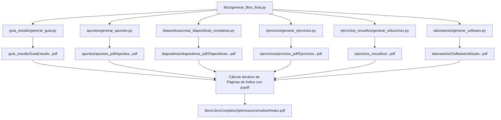

# Proceso de Creación y Compilación del Libro Completo

Este documento explica de forma exhaustiva y detallada el proceso técnico de creación, generación de subcomponentes y compilación del documento unificado del libro **Optimización y Análisis de Redes**.

---

## 1. Arquitectura General del Proyecto

El libro completo (`libro/LibroCompletoOptimizacionAnalisisRedes.pdf`) es una obra integral que combina automáticamente seis subcomponentes independientes mediante scripts de Python dedicados en el entorno de Conda **`oar_env`**:



---

## 2. Los Scripts de Generación de Subcomponentes

Toda la compilación se realiza utilizando la infraestructura de código Python ubicada en las subcarpetas del proyecto. Cada subcomponente posee un script especializado:

| Subcomponente | Script de Generación | Producto Generado | Descripción |
| :--- | :--- | :--- | :--- |
| **Guía de Estudio** | `guia_estudio/generar_guia.py` | `guia_estudio/GuiaEstudioOptimizacionAnalisisRedes.pdf` | Cronograma, metodología, evaluación y plan docente del curso. |
| **Apuntes Teóricos** | `apuntes/generar_apuntes.py` | `apuntes/apuntes_pdf/ApuntesOptimizacionAnalisisRedes.pdf` | Libro teórico de capítulos (`tema1.qmd` a `tema10.qmd`) en PDF. |
| **Diapositivas de Clase** | `diapositivas/crear_diapositivas_completas.py` | `diapositivas/diapositivas_pdf/DiapositivasOptimizacionAnalisisRedes.pdf` y `diapositivas/*.html` | Presentaciones Beamer PDF para impresión y presentaciones RevealJS HTML interactivas para clase. |
| **Ejercicios Prácticos** | `ejercicios/generar_ejercicios.py` | `ejercicios/ejercicios_pdf/EjerciciosOptimizacionAnalisisRedes.pdf` | Colección de enunciados de problemas teóricos numerados. |
| **Soluciones de Ejercicios** | `ejercicios_resueltos/generar_soluciones.py` | `ejercicios_resueltos/ejercicios_resueltos_pdf/SolucionesOptimizacionAnalisisRedes.pdf` | Resoluciones analíticas paso a paso de los ejercicios teóricos. |
| **Software y Laboratorios** | `laboratorios/generar_software.py` | `laboratorios/SoftwareUtilizadoOptimizacionAnalisisRedes.pdf` | Guía práctica de programación en Python (`NetworkX`, `SciPy`, `CVXPY`). |

---

## 3. Manejo Dual: HTML (RevealJS) vs. PDF (Beamer / Quarto PDF)

Uno de los pilares del diseño es el **soporte dual** entre formatos digitales interactivos e impresos:

1. **En Diapositivas RevealJS (HTML para clase)**:
   * Las animaciones e iteraciones algorítmicas (Kruskal, Prim, búsquedas 1D) se embeben usando los reproductores interactivos modales `<iframe src="../images/[id]_player.html" ...>`.
   * Esto permite al profesor controlar los fotogramas, pausar o avanzar la traza paso a paso en el aula.

2. **En Diapositivas Beamer / Documentos PDF (para impresión)**:
   * Los scripts de Python (como `crear_diapositivas_completas.py`) detectan automáticamente las referencias a archivos `.gif` o reproductores HTML y las sustituyen en un `.qmd` temporal por figuras estáticas nítidas en PNG (`images/[id]_traza_paso_a_paso.png` o `images/[id]_pasos.png`).
   * **JAMÁS se incluyen archivos `.gif` o iFrames en las compilaciones PDF**, garantizando que LuaLaTeX/Quarto renderice sin errores.

---

## 4. Algoritmo de Compilación Máster (`libro/generar_libro_final.py`)

El script principal de compilación ejecutable desde la raíz es `libro/generar_libro_final.py`. Su flujo interno consta de 4 fases automáticas:

### Fase 1: Verificación de Entorno
Comprueba la presencia de la estructura del proyecto y confirma que la librería `pypdf` y el ejecutable Quarto están disponibles dentro del entorno Conda `oar_env`.

### Fase 2: Ejecución Secuencial de Subscripts
Invoca de forma ordenada los scripts de los 6 subcomponentes (`generar_guia.py`, `generar_apuntes.py`, `crear_diapositivas_completas.py`, etc.) utilizando el intérprete Python oficial del entorno.

### Fase 3: Cálculo Iterativo de Páginas de Inicio (Páginas Estables)
Para construir un Índice General preciso en el libro impreso:
1. Mide la longitud exacta en páginas de cada PDF generado utilizando `pypdf.PdfReader`.
2. Calcula de forma dinámica las páginas de inicio para cada bloque (Portada, Índice, Guía de Estudio, Apuntes Teóricos, Diapositivas, Ejercicios y Software).
3. Genera un archivo temporal `libro/indice_temp.qmd` inyectando los números de página exactos (`{{GUIA_PAGE}}`, `{{APUNTES_PAGE}}`, `{{DIAPOSITIVAS_PAGE}}`, etc.) y lo compila a PDF.
4. Repite el proceso hasta que el número de páginas del índice se estabiliza (bucle de convergencia).

### Fase 4: Fusión Final y Marcadores (Bookmarks PDF)
1. Combina todos los PDFs individuales en un único documento maestro mediante `pypdf.PdfWriter`.
2. Inyecta marcadores de nivel superior (*outlines / bookmarks*) en el PDF para permitir la navegación directa por secciones desde cualquier visor de PDF.
3. Elimina automáticamente los archivos intermediarios temporales.
4. Guarda el resultado final en `libro/LibroCompletoOptimizacionAnalisisRedes.pdf`.

---

## 5. Comando de Compilación Unificado

Para recompilar todo el libro y mantener sincronizados los apuntes, diapositivas Beamer, presentaciones RevealJS HTML, ejercicios y el PDF final unificado, se debe ejecutar exclusivamente el siguiente comando desde la raíz de la workspace:

```powershell
C:\Users\vacek\anaconda3\envs\oar_env\python.exe libro/generar_libro_final.py
```

### Comandos de Compilación Individual (por componente)

Si solo se ha modificado un componente específico y se desea una vista previa rápida:

* **Solo Diapositivas (RevealJS HTML y Beamer PDF)**:
  ```powershell
  C:\Users\vacek\anaconda3\envs\oar_env\python.exe diapositivas/crear_diapositivas_completas.py
  ```
* **Solo Apuntes Teóricos (PDF del Libro Teórico)**:
  ```powershell
  C:\Users\vacek\anaconda3\envs\oar_env\python.exe apuntes/generar_apuntes.py
  ```
* **Solo Guía de Estudio**:
  ```powershell
  C:\Users\vacek\anaconda3\envs\oar_env\python.exe guia_estudio/generar_guia.py
  ```

---

## 6. Resumen de Reglas de Oro

1. **Única fuente de verdad para la compilación**: Usar siempre el script máster `libro/generar_libro_final.py` en el entorno Conda `oar_env`.
2. **Sin código Python en capítulos del libro**: Los archivos `temaN.qmd` son estrictamente teóricos y didácticos. Toda la componente práctica se ubica en `laboratorios/`.
3. **No GIFs en PDF**: Los reproductores HTML modales se reservan para RevealJS; para los PDFs se usan imágenes estáticas `.png`.
4. **Respeto a las reglas de estilo y notación**: Usar llaves $\{u,v\}$ para aristas no dirigidas y paréntesis $(u,v)$ para arcos dirigidos, Sentence case en títulos y sin demostraciones en diapositivas.
