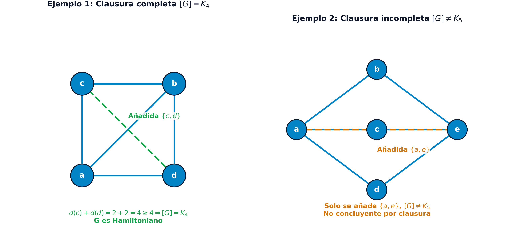

## Objetivos de aprendizaje

::: {.columns}
::: {.column width="50%"}
1. **Diferenciar** grafos eulerianos (tiempo polinomial) y hamiltonianos ($\mathcal{NP}$-completos).
2. **Aplicar** el teorema de Euler y ejecutar el algoritmo constructivo de cadenas.
3. **Resolver** el Problema del Cartero Chino (CPP) mediante emparejamientos perfectos.
:::
::: {.column width="50%"}
4. **Evaluar** ciclos hamiltonianos mediante 2-conexidad, clausura y teoremas de Dirac/Ore.
5. **Formular** el Problema del Viajante (TSP) comparando modelos DFJ y MTZ.
6. **Clasificar** los Problemas de Rutas de Vehículos (VRP) en *Node* y *Arc Routing*.
:::
:::

# Grafos eulerianos y el problema de los puentes de Königsberg

## El enigma histórico de Königsberg (1736)

* **Contexto geográfico (Königsberg, Prusia)**:
  * El río Pregel divide la ciudad en 4 masas terrestres ($A, D$ islas, $B, C$ riberas) conectadas por 7 puentes.

* **El desafío ciudadano**:
  * *¿Es posible cruzar cada uno de los 7 puentes exactamente una vez y regresar al punto de partida?*

* **La contribución de Leonhard Euler (1736)**:
  * Demostró su imposibilidad analítica mediante abstracción topológica, fundando la **teoría de grafos**.

---

## Abstracción topológica de Euler

{fig-align="center" width="85%"}

* **Del espacio geográfico al multigrafo abstracto**:
  * Masas de tierra $\to$ Vértices ($A, B, C, D$).
  * Puentes $\to$ Aristas ($m = 7$ conexiones).

---

## Principio de conservación y grados nodales

::: {.columns}
::: {.column width="50%"}
* **Conservación de tránsito en nodos**:
  * Cada paso por un nodo intermedio consume 2 aristas (1 entrante y 1 saliente).
  * Por tanto, todo vértice intermedio en un circuito cerrado debe tener **grado par**.
:::
::: {.column width="50%"}
* **Diagnóstico en Königsberg**:
  * $d(A) = 5$ (impar).
  * $d(B) = d(C) = d(D) = 3$ (impares).
  * Al tener 4 vértices impares, es **físicamente imposible** cerrar el recorrido.
:::
:::

---

## Cadenas y ciclos eulerianos

::: {.callout-note title="Definición: Recorridos eulerianos"}
Dado un multigrafo finito conexo no dirigido $G = (V, E)$:

* **Cadena euleriana**: Recorre **todas las aristas** de $E$ exactamente una vez.
* **Ciclo euleriano**: Cadena euleriana **cerrada** (inicio = fin).
* **Grafo euleriano**: Admite al menos un ciclo euleriano.
:::

* **Foco en aristas**:
  * Se pueden repetir vértices, pero **jamás se repite ninguna arista**.

---

## Teorema de caracterización de Euler

::: {.callout-important title="Condición necesaria y suficiente de Euler (1736, Hierholzer 1873)"}
Sea $G = (V, E)$ un multigrafo finito y conexo:

1. Admite **ciclo euleriano** $\iff$ **Todos los vértices tienen grado par**:
   $$
   d(i) \equiv 0 \pmod 2, \quad \forall i \in V
   $$

2. Admite **cadena euleriana abierta** $\iff$ Hay **exactamente dos vértices impares** (extremos inicial y final de la cadena).
:::

* **Complejidad lineal**: Test de paridad en tiempo $\mathcal{O}(|V| + |E|)$ (Clase $\mathcal{P}$).

---

## Clasificación según la paridad de grados

* **Criterio de existencia en grafos conexos**:

| Vértices impares ($|V_{\text{impar}}|$) | Tipo de recorrido euleriano | Propiedades |
| :---: | :---: | :--- |
| **$0$** | **Ciclo euleriano** | Inicio y fin en cualquier vértice. |
| **$2$** | **Cadena abierta** | Inicia en un impar y termina en el otro. |
| **$\ge 4$** | **No euleriano** | Requiere duplicar aristas (CPP). |
| **Impar ($1, 3, \dots$)** | **Imposible** | Prohibido por el *Handshaking Lemma*. |

---

## Algoritmo constructivo: Punteros sucesores $\mathbf{\sigma}$

* **Estructura de punteros $\mathbf{\sigma} = (\sigma(1), \dots, \sigma(m), \sigma(m+1))$**:
  * $\sigma(e)$: Identificador de la arista sucesora de $e$ en la cadena.
  * $\sigma(m+1)$: Identificador de la **primera arista** del recorrido.
  * $\sigma(e) = -1$: Marca el final del recorrido.

* **Ventaja algorítmica**:
  * Permite intercalar ciclos secundarios en tiempo $\mathcal{O}(1)$ reasignando punteros.
  * Construcción de la cadena euleriana en tiempo lineal $\mathcal{O}(|E|)$.

---

## Algoritmo constructivo: Variables de control

* **Estructuras auxiliares para un grafo con $m = |E|$ aristas**:
  * $w(i)$: Lista ordenada de aristas incidentes en el vértice $i$.
  * $\delta_i(e) = j$: Extremo opuesto al vértice $i$ por la arista $e$.
  * $\alpha(i)$: Contador de aristas incidentes en $i$ **sin explorar** ($\alpha(i) = d(i)$ al inicio).
  * $v$: Longitud acumulada del recorrido (aristas añadidas).
  * $\phi(i)$: Arista de primer acceso al vértice $i$ ($\phi(\text{inicio}) = m+1$).
  * $e_1, e_2$: Punteros auxiliares que delimitan el punto de inserción.

---

## Algoritmo constructivo: Pasos 1 y 2

* **Paso 1 (Inicialización)**:
  * Si hay 2 impares: inicio $i = a$, fin $t = b$. Si todos son pares: $a = b$ ($i = a, t = a$).
  * $\sigma(e) = 0$, $\alpha(i) = d(i)$, $\phi(j) = 0$, $\phi(a) = m+1$, $v = 0$, $e_1 = m+1, e_2 = -1$.

* **Paso 2 (Extensión secuencial)**:
  * Si $\alpha(i) = 0 \implies$ ir al **Paso 4**.
  * Si no, tomar $e = w_{\alpha(i)}(i)$ y decrementar $\alpha(i) \leftarrow \alpha(i) - 1$.
  * Si $e$ no está explorada:
    $$
    j = \delta_i(e), \quad \phi(j) = e, \quad \sigma(e_1) = e, \quad v \leftarrow v + 1, \quad \alpha(j) \leftarrow \alpha(j) - 1, \quad i \leftarrow j
    $$
  * Si $i = t \implies$ ir al **Paso 3**. Si no, $e_1 \leftarrow e$ y repetir Paso 2.

---

## Algoritmo constructivo: Pasos 3 y 4

* **Paso 3 (Cierre de tramo y parada)**:
  * Enlazar: $\sigma(e) = e_2$.
  * Si $v = m \implies$ **FIN**: $\mathbf{\sigma}$ contiene la cadena euleriana completa.
  * Si $v < m \implies$ quedan aristas pendientes: avanzar al **Paso 4**.

* **Paso 4 (Búsqueda y empalme de ciclos)**:
  * Buscar nodo $k \in V$ en la cadena actual con $\alpha(k) \ne 0$ y $\phi(k) \ne 0$.
  * Configurar punteros para intercalar un ciclo cerrado en $k$:
    $$
    i \leftarrow k, \quad t \leftarrow k, \quad e_1 \leftarrow \phi(k), \quad e_2 \leftarrow \sigma(e_1)
    $$
  * Volver al **Paso 2**.

---

## Ejemplo: Grafo de 4 nodos y paridad

::: {.columns}
::: {.column width="50%"}
* **Aristas e incidencias**:
  * Arista 1: $\{a, b\} \implies \delta_a(1)=b, \delta_b(1)=a$.
  * Arista 2: $\{b, c\} \implies \delta_b(2)=c, \delta_c(2)=b$.
  * Arista 3: $\{c, d\} \implies \delta_c(3)=d, \delta_d(3)=c$.
  * Arista 4: $\{b, d\} \implies \delta_b(4)=d, \delta_d(4)=b$.
:::
::: {.column width="50%"}
* **Grados nodales**:
  * $d(a) = 1$ (impar).
  * $d(b) = 3$ (impar).
  * $d(c) = 2, \ d(d) = 2$ (pares).

* **Diagnóstico de Euler**:
  * Exactamente dos vértices impares ($a$ y $b$) $\implies$ Cadena abierta de $a$ a $b$.
:::
:::

---

## Ejemplo: Representación gráfica y vector $\mathbf{\sigma}$

{fig-align="center" width="85%"}

* **Panel izquierdo**: Topología del grafo de 4 nodos y 4 aristas.
* **Panel derecho**: Evolución detallada del vector de punteros sucesores $\mathbf{\sigma}$ tras cada paso.

---

## Ejemplo: Inicialización y primera extensión (Pasos 1 y 2)

* **1. Inicialización (Paso 1)**:
  * Vértice inicial: $i = a$, vértice final: $t = b$.
  * Arista ficticia de cabecera: $m+1 = 5$. Punteros iniciales: $e_1 = 5, e_2 = -1, v = 0$.
  * Contadores: $\alpha(a)=1, \alpha(b)=3, \alpha(c)=2, \alpha(d)=2$.
  * Punteros de llegada: $\phi(a) = 5, \phi(b)=0, \phi(c)=0, \phi(d)=0$.

* **2. Primera extensión (Paso 2)**:
  * En $i = a$, $\alpha(a)=1$. Arista disponible $e = 1$. Se actualiza $\alpha(a) = 0$.
  * Como $e=1 \neq e_1=5$, se conecta la arista:
    $$
    j = \delta_a(1) = b, \quad \phi(b) = 1, \quad \sigma(5) = 1, \quad v = 1, \quad \alpha(b) = 2, \quad i = b
    $$
  * Como el nodo actual $b$ coincide con el destino $t=b$, se deriva al **Paso 3**.

---

## Ejemplo: Cierre inicial y bifurcación (Pasos 3 y 4)

* **3. Cierre de tramo inicial (Paso 3)**:
  * Se fija $\sigma(1) = e_2 = -1$.
  * Como la longitud acumulada $v = 1 < 4$, la cadena no está completa $\implies$ Se pasa al **Paso 4**.

* **4. Búsqueda de vértice de bifurcación (Paso 4)**:
  * Se evalúa el nodo $k = b$: cumple $\alpha(b) = 2 \ne 0$ y $\phi(b) = 1 \ne 0$.
  * Se reconfiguran los punteros para intercalar un ciclo cerrado en $b$:
    $$
    i = b, \quad t = b, \quad e_1 = \phi(b) = 1, \quad e_2 = \sigma(1) = -1
    $$
  * Se regresa al **Paso 2**.

---

## Ejemplo: Construcción del ciclo secundario (Pasos 2 y 3)

* **5. Construcción del ciclo secundario (Pasos 2 y 3)**:
  * *Iteración desde $b$*: $\alpha(b)=2$, arista $e = w_2(b) = 4 \implies \alpha(b)=1$:
    $$j = \delta_b(4) = d, \quad \phi(d) = 4, \quad \sigma(1) = 4, \quad v = 2, \quad \alpha(d) = 1, \quad i = d, \quad e_1 = 4$$
  * *Iteración desde $d$*: $\alpha(d)=1$, arista $e = w_1(d) = 3 \implies \alpha(d)=0$:
    $$j = \delta_d(3) = c, \quad \phi(c) = 3, \quad \sigma(4) = 3, \quad v = 3, \quad \alpha(c) = 1, \quad i = c, \quad e_1 = 3$$
  * *Iteración desde $c$*: $\alpha(c)=1$, arista $e = w_1(c) = 2 \implies \alpha(c)=0$:
    $$j = \delta_c(2) = b, \quad \phi(b) = 2, \quad \sigma(3) = 2, \quad v = 4, \quad \alpha(b) = 0, \quad i = b$$
  * Al alcanzar $i = t = b$, se pasa al **Paso 3**: $\sigma(2) = e_2 = -1$.
  * Como $v = 4 = m$, el algoritmo **termina con éxito**.

---

## Ejemplo: Vector final y reconstrucción

::: {.columns}
::: {.column width="50%"}
* **Vector final de punteros $\mathbf{\sigma}$**:
  $$
  \mathbf{\sigma} = (4, -1, 2, 3, 1)
  $$

* **Decodificación secuencial**:
  * Inicio: $\sigma(5) = 1 \implies \text{Arista } 1$.
  * Sucesor de 1: $\sigma(1) = 4 \implies \text{Arista } 4$.
  * Sucesor de 4: $\sigma(4) = 3 \implies \text{Arista } 3$.
  * Sucesor de 3: $\sigma(3) = 2 \implies \text{Arista } 2$.
  * Sucesor de 2: $\sigma(2) = -1 \implies \text{FIN}$.
:::
::: {.column width="50%"}
* **Secuencia de aristas**:
  $$
  (1, 4, 3, 2)
  $$

* **Cadena de vértices**:
  $$
  a \xrightarrow{e=1} b \xrightarrow{e=4} d \xrightarrow{e=3} c \xrightarrow{e=2} b
  $$

* **Verificación**:
  * Recorre las 4 aristas sin repetir.
  * Inicia en $a$ y termina en $b$.
:::
:::

---

## Resumen de grafos eulerianos

* **Caracterización exacta**:
  * La paridad de grados determina plenamente la existencia de circuitos eulerianos.

* **Complejidad polinomial**:
  * Verificación en $\mathcal{O}(|V| + |E|)$ y trazado en $\mathcal{O}(|E|)$ con punteros $\mathbf{\sigma}$.

* **Limitación en redes reales**:
  * Las redes viales reales suelen tener nodos impares $\implies$ Requieren duplicar calles (**Problema del Cartero Chino**).

# El Problema del Cartero Chino (CPP)

## Motivación práctica e industrial del CPP

::: {.columns}
::: {.column width="50%"}
* **Aplicaciones urbanas e industriales**:
  * Reparto postal domiciliario.
  * Recogida de residuos urbanos.
  * Mantenimiento y quitanieves en vialidad invernal.
  * Inspección de redes eléctricas y canalizaciones.
:::
::: {.column width="50%"}
* **El reto de optimización**:
  * En redes no eulerianas, es obligatorio transitar más de una vez por ciertas vías.
  * **Objetivo**: Minimizar la distancia o coste total acumulado de las aristas duplicadas.

* **Origen**: Formulado por **Mei-Ko Kwan** (1960).
:::
:::

---

## Formulación del Problema del Cartero Chino

::: {.callout-note title="Definición: Problema del Cartero Chino (CPP)"}
Dada una red valorada no dirigida $G = (V, E, p)$ con pesos no negativos $p(e) \ge 0$:

El **CPP** consiste en hallar un circuito cerrado $C$ que recorra todas las aristas de $E$ al menos una vez al menor coste total:
$$
\min_{C} \sum_{e \in C} p(e) \quad \text{sujeto a} \quad E \subseteq C
$$
:::

* **Red euleriana**: Longitud óptima = $\sum_{e \in E} p(e)$.
* **Red no euleriana**: Longitud óptima = $\sum_{e \in E} p(e) + \text{Coste}(E' \text{ duplicados})$.

---

## Eulerización conceptual tentativa (9 nodos)

::: {.columns}
::: {.column width="50%"}
* **Red valorada con 4 nodos impares**:
  * Vértices impares: $V' = \{a, b, c, d\}$ ($d=3$).
  * Nodo central $e$: $d(e) = 4$ (par).
  * Esquinas $i, f, h, g$: $d = 2$ (pares).

* **Duplicación tentativa hacia el centro $e$**:
  * Duplicar $\{a, e\}, \{b, e\}, \{e, c\}, \{e, d\}$.
  * Todos los grados en $G'$ pasan a ser pares.
  * Coste añadido: $3 + 3 + 3 + 6 = \mathbf{15}$.
:::
::: {.column width="50%"}
{fig-align="center" width="80%"}
:::
:::

---

## Proposición: Paridad del número de vértices de grado impar

::: {.callout-note title="Paridad del número de vértices de grado impar"}
En cualquier multigrafo finito $G = (V, E)$, el número de vértices con grado impar es estrictamente un **número par** ($|V'| = 2k$).
:::

* **Consecuencia para la eulerización**:
  * Un grafo jamás puede tener una cantidad impar de vértices impares ($1, 3, 5, \dots$).
  * En redes no eulerianas, siempre existirá una cantidad par de nodos impares que conectar de dos en dos.

---

## Proposición: Estructura de caminos de las aristas duplicadas

::: {.callout-note title="Estructura de caminos de las aristas duplicadas"}
Sea $G = (V, E)$ un grafo no euleriano y sea $E'$ un conjunto minimal de aristas duplicadas que convierte a $G' = (V, E \cup E')$ en euleriano. Entonces, para todo $i_1 \in V'$, el conjunto $E'$ contiene una cadena que une $i_1$ con otro vértice $i_2 \in V'$.
:::

* **Interpretación combinatoria**:
  * Las aristas duplicadas en $E'$ forman caminos disyuntos cuyos extremos son siempre vértices impares.
  * **La eulerización óptima equivale a un emparejamiento perfecto de peso mínimo entre los nodos impares**.

---

## Definición: Emparejamientos y emparejamiento perfecto

::: {.columns}
::: {.column width="50%"}
* **Emparejamiento (*matching*)**:
  * Subconjunto de aristas $M \subseteq E$ sin vértices comunes:
    $$e_1 \cap e_2 = \emptyset, \quad \forall e_1, e_2 \in M$$

* **Vértice saturado**:
  * Nodo $v \in V$ que es extremo de alguna arista de $M$.
:::
::: {.column width="50%"}
* **Emparejamiento perfecto**:
  * Satura a **todos los vértices de $V$** ($|V|$ debe ser par).

* **Matching de peso mínimo**:
  $$
  \min_{M \subseteq E} \sum_{e \in M} p(e) \quad \text{s.a. } M \text{ es perfecto}
  $$
:::
:::

---

## Esquema: Procedimiento general de resolución del CPP

::: {.columns}
::: {.column width="50%"}
* **1. Identificación de impares**:
  * Hallar $V' = \{v \in V \mid d(v) \text{ impar}\}$.
  * Si $V' = \emptyset \implies$ es euleriano.

* **2. Distancias mínimas**:
  * Calcular $d_G(u, v)$ en $V'$ (Dijkstra).

* **3. Grafo auxiliar completo**:
  * $G'' = (V', E'')$ con $p''(u, v) = d_G(u, v)$.
:::
::: {.column width="50%"}
* **4. Matching de peso mínimo**:
  * Determinar $M^*$ en $G''$ (Edmonds o combinatoria).

* **5. Multigrafo y circuito final**:
  * Duplicar caminos mínimos de $M^*$.
  * Trazar la ruta euleriana con el algoritmo de punteros $\mathbf{\sigma}$.
:::
:::

---

## Ejemplo CPP (9 nodos): Grafo original e impares (Paso 1)

::: {.columns}
::: {.column width="50%"}
* **Red de 9 nodos y 12 aristas**:
  * Suma de aristas base:
    $$
    \sum_{e \in E} p(e) = 38
    $$

* **1. Identificación de impares (Paso 1)**:
  * $d(a) = d(b) = d(c) = d(d) = 3$
  * $\implies V' = \{a, b, c, d\}$.
  * $d(e) = 4, \ d(i) = d(f) = d(h) = d(g) = 2$.
:::
::: {.column width="50%"}
{fig-align="center" width="80%"}
:::
:::

---

## Ejemplo CPP (9 nodos): Caminos mínimos en $V'$ (Paso 2)

::: {.columns}
::: {.column width="55%"}
* **2. Distancias geodésicas en $V'$ (Paso 2)**:
  * Desde $a$: $d(a, b) = \mathbf{6}, \ d(a, c) = \mathbf{6}, \ d(a, d) = \mathbf{9}$.
  * Desde $b$: $d(b, c) = \mathbf{6}, \ d(b, d) = \mathbf{9}$.
  * Desde $c$: $d(c, d) = \mathbf{6}$.

* **Rutas mínimas obtenidas (Dijkstra)**:
  * Tránsitos por el centro $e$ salvo:
    * Camino $b-f-d$ (coste $4 + 5 = 9$).
    * Camino $c-g-d$ (coste $4 + 2 = 6$).
:::
::: {.column width="45%"}
* **Matriz simétrica $D_{V'}$**:
  $$
  D_{V'} = \begin{pmatrix}
  - & 6 & 6 & 9 \\
  6 & - & 6 & 9 \\
  6 & 6 & - & 6 \\
  9 & 9 & 6 & -
  \end{pmatrix}
  $$
:::
:::

---

## Ejemplo CPP (9 nodos): Grafo auxiliar y matching (Pasos 3 y 4)

{fig-align="center" width="85%"}

* **3 y 4. Grafo auxiliar $G''$ y evaluación de matchings (Pasos 3 y 4)**:
  * **$M_1 = \{\{a, b\}, \{c, d\}\}$**: $d(a,b) + d(c,d) = 6 + 6 = \mathbf{12}$ **[ÓPTIMO]**.
  * **$M_2 = \{\{a, c\}, \{b, d\}\}$**: $d(a,c) + d(b,d) = 6 + 9 = 15$.
  * **$M_3 = \{\{a, d\}, \{b, c\}\}$**: $d(a,d) + d(b,c) = 9 + 6 = 15$.

---

## Ejemplo CPP (9 nodos): Eulerización y solución óptima (Paso 5)

::: {.columns}
::: {.column width="50%"}
* **5. Eulerización y circuito óptimo (Paso 5)**:
  * Camino $a-e-b$ (duplica $\{a, e\}$ y $\{e, b\}$).
  * Camino $c-g-d$ (duplica $\{c, g\}$ y $\{g, d\}$).

* **Longitud total mínima del circuito**:
  $$
  L_{\text{ópt}} = 38 \text{ (base)} + 12 \text{ (duplicados)} = \mathbf{50}
  $$
:::
::: {.column width="50%"}
{fig-align="center" width="80%"}
:::
:::

---

## Ejemplo Examen: Enunciado y delimitación de parcelas

{fig-align="center" width="82%"}

* **Planteamiento de la obra**:
  * Se desea cercar un terreno dividiéndolo en 4 parcelas ($A, B, C$ y $D$).
  * El cerramiento se realiza mediante una cerca prefabricada continua que **no se puede partir** y debe terminar exactamente donde empieza.

---

## Ejemplo Examen: Pregunta 1 - Modelado en teoría de grafos

* **1. ¿Qué problema de grafos se está planteando? (0.5 puntos)**:
  * Se trata formalmente del **Problema del Cartero Chino (CPP)** (o problema de inspección de rutas).
  * El objetivo es encontrar el circuito cerrado de longitud mínima que recorra todas las aristas de un grafo al menos una vez y regrese al punto de partida.

* **Justificación topológica**:
  * Al exigir una cerca continua y cerrada, es necesario trazar un **circuito euleriano**.
  * En el mapa existen intersecciones donde confluyen tres lindes (**vértices de grado impar $d=3$**), por lo que el grafo original **no es euleriano**.
  * **Objetivo**: Determinar qué tramos deben duplicarse (tender la cerca dos veces por el mismo borde) garantizando que la longitud añadida sea mínima.

---

## Ejemplo Examen: Pregunta 2 - Procedimiento de solución

::: {.columns}
::: {.column width="50%"}
* **Paso 1 (Identificación de impares)**:
  * Modelar $G = (V, E, p)$ y hallar:
    $V' = \{v \in V \mid d(v) \text{ impar}\}$.

* **Paso 2 (Distancias geodésicas)**:
  * Calcular $d_G(u, v)$ en $V'$ con Dijkstra.

* **Paso 3 (Grafo auxiliar $G''$)**:
  * Construir $G'' = (V', E'')$ con pesos $p''(u, v) = d_G(u, v)$.
:::
::: {.column width="50%"}
* **Paso 4 (Matching de peso mínimo)**:
  * Determinar el matching perfecto $M^*$ en $G''$.

* **Paso 5 (Eulerización y longitud)**:
  * Duplicar caminos mínimos de $M^*$.
  * Longitud: $L_{\text{total}} = \sum_{e \in E} p(e) + \text{Coste}(M^*)$.
:::
:::

---

## Ejemplo Examen: Pregunta 3 - Desglose de longitud base ($L_{\text{base}}$)

::: {.columns}
::: {.column width="50%"}
* **Lindes internas (fronteras)**:
  * $A\text{-}B$: $3\text{ m}$.
  * $A\text{-}C$: $4\text{ m}$.
  * $B\text{-}C$: $12\text{ m}$.
  * $A\text{-}D$: $6\text{ m}$.
  * $C\text{-}D$: $2 + 6 = 8\text{ m}$.
  * **Suma interna** = $\mathbf{33}\text{ m}$.
:::
::: {.column width="50%"}
* **Perímetro exterior (bordes)**:
  * Parcela $A$: $2+9+1+2+4+2+4+5 = 29\text{ m}$.
  * Parcela $B$: $8+4+8+3+4+4+5 = 36\text{ m}$.
  * Parcela $C$: $6+2+4+12 = 24\text{ m}$.
  * Parcela $D$: $8+8+2 = 18\text{ m}$.
  * **Suma externa** = $\mathbf{107}\text{ m}$.
:::
:::

* **Longitud base total de la red**:
  $$L_{\text{base}} = 33\text{ (internas)} + 107\text{ (externas)} = \mathbf{140}\text{ m}$$

---

## Ejemplo Examen: Pregunta 3 - Vértices impares $V'$ (Paso 1)

* **Análisis topológico de los grados $d(v)$**:
  * **Esquinas exteriores del perímetro**:
    * En cada quiebro del borde exterior concurren exactamente 2 aristas $\implies$ Grado $d = 2$ (pares).

  * **Puntos de confluencia triple (puntos rojos en el plano)**:
    * En las 6 intersecciones donde confluyen tres lindes (fronteras entre parcelas y bordes exteriores), el grado es estrictamente $d = 3$ (impares).

* **Conjunto de vértices de grado impar**:
  $$
  V' = \{v \in V \mid d(v) \equiv 1 \pmod 2\} \implies |V'| = \mathbf{6\text{ vértices impares}}
  $$

---

## Ejemplo Examen: Pregunta 3 - Caminos mínimos en $V'$ (Paso 2)

* **Paso 2 (Cálculo de distancias mínimas con Dijkstra)**:

* **Pareja 1 (Punto superior $A\text{-}B$ a central $A\text{-}B\text{-}C$)**:
  * Camino interior directo con distancia $d = \mathbf{3}\text{ m}$.

* **Pareja 2 (Punto inferior $A\text{-}D$ a central $A\text{-}C\text{-}D$)**:
  * Camino interior directo con distancia $d = \mathbf{6}\text{ m}$.

* **Pareja 3 (Extremos derechos: borde de $B\text{-}C$ a borde de $C\text{-}D$)**:
  * Distancia mínima $d = \mathbf{24}\text{ m}$, alcanzable por dos rutas alternativas de igual coste:
    * *Por el contorno exterior de $C$*: $6 + 2 + 4 + 12 = \mathbf{24}\text{ m}$.
    * *Por el interior de la red*: $(B\text{-}C) + (A\text{-}C) + (C\text{-}D) = 12 + 4 + 8 = \mathbf{24}\text{ m}$.

---

## Ejemplo Examen: Pregunta 3 - Matching y longitud total (Pasos 3 a 5)

* **Pasos 3 y 4 (Grafo auxiliar $G''$ y matching óptimo $M^*$)**:
  * Se construye el grafo auxiliar completo sobre los 6 nodos impares.
  * El emparejamiento perfecto de peso mínimo selecciona las tres parejas mínimas:
    $$
    \text{Coste}(M^*) = 3 + 6 + 24 = \mathbf{33}\text{ m}
    $$

* **Paso 5 (Multigrafo euleriano y longitud total de la valla)**:
  * Se duplican en el mapa los tres caminos mínimos identificados.
  * La longitud mínima de la cerca prefabricada continua necesaria es:
    $$
    L_{\text{total}} = L_{\text{base}} + \text{Coste}(M^*) = 140\text{ (base)} + 33\text{ (duplicados)} = \mathbf{173}\text{ m}
    $$

---

## Variantes del Problema del Cartero Chino

* **Cartero Dirigido (Directed CPP)**:
  * Calles de sentido único ($d^-(i) = d^+(i)$).
  * La eulerización se resuelve mediante un **modelo de flujo a coste mínimo y transbordo** en tiempo polinomial.

* **Windy Postman Problem**:
  * Costes asimétricos por pendientes o viento ($c(i, j) \ne c(j, i)$). Es $\mathcal{NP}$-duro.

* **Cartero Rural (RPP)**:
  * Solo se recorre un subconjunto obligatorio $E_R \subseteq E$. Es $\mathcal{NP}$-completo.

# Ciclos hamiltonianos y condiciones de hamiltonianidad

## Origen histórico: El Juego Icosiano (1857)

::: {.columns}
::: {.column width="50%"}
* **Patente de Sir William Rowan Hamilton**:
  * Dodecaedro regular de 20 vértices (*Icosian Game*).

* **El reto planteado**:
  * Visitar las **20 ciudades exactamente una vez** regresando al origen.

* **Euler vs. Hamilton**:
  * Euler: Recorrer todas las **aristas**.
  * Hamilton: Visitar todos los **vértices**.
:::
::: {.column width="50%"}
* **Complejidad computacional**:
  * Euleriano $\implies$ Clase $\mathcal{P}$ ($\mathcal{O}(|V|+|E|)$).
  * Hamiltoniano $\implies$ **$\mathcal{NP}$-completo** (Karp 1972).

* **Estrategia**:
  * No hay condiciones necesarias y suficientes simultáneas en $\mathcal{P}$.
  * Se estudian condiciones necesarias (conectividad) y suficientes (grados).
:::
:::

---

## Ciclos y caminos hamiltonianos

::: {.callout-note title="Definición: Recorridos hamiltonianos"}
Dado un grafo $G = (V, E)$ con $n = |V|$ vértices:

* **Ciclo hamiltoniano**: Ciclo simple que visita **todos los vértices de $V$** exactamente una vez.
* **Camino hamiltoniano**: Camino simple que visita todos los vértices sin cerrar el ciclo.
* **Grafo hamiltoniano**: Grafo que admite al menos un ciclo hamiltoniano.
:::

* **Propiedad básica**: Todo ciclo hamiltoniano en $n$ vértices contiene exactamente **$n$ aristas**.

---

## Definición: Conjuntos de corte y $k$-conexidad

::: {.callout-note title="Definición: Conjuntos de corte y k-conexidad"}
Dado un grafo conexo $G = (V, E)$:

* **Conjunto de corte de vértices**: Subconjunto $A \subset V$ tal que el subgrafo inducido $V \setminus A$ es disconexo.
* **Grafo $k$-conexo**: $|V| \ge k+1$ y no contiene ningún conjunto de corte de cardinal menor que $k$ (se requiere eliminar al menos $k$ vértices para desconectarlo).
:::

* **Implicación en grados**: Todo grafo $k$-conexo satisface $d_G(i) \ge k, \ \forall i \in V$.

---

## Proposición: Condición necesaria de 2-conexidad

::: {.callout-note title="Condición necesaria de 2-conexidad"}
Si un grafo $G = (V, E)$ es hamiltoniano, entonces $G$ es obligatoriamente **2-conexo** (no posee vértices de corte o puntos de articulación).
:::

* **Interpretación geométrica**:
  * Si existiera un vértice de corte $v$, el ciclo tendría que pasar al menos dos veces por $v$ para transitar entre las componentes desconectadas (imposible en ciclo simple).
  * **Grado mínimo necesario**: $d(v) \ge 2, \ \forall v \in V$. Si existe algún $d(v) \le 1 \implies$ No es hamiltoniano.

---

## Contraejemplo: Grafo 2-conexo no hamiltoniano

::: {.columns}
::: {.column width="50%"}
* **La 2-conexidad NO es suficiente**:
  * Grafo de 5 nodos con 3 caminos paralelos entre $a$ y $e$.
  * Cumple $d(i) \ge 2$ y es 2-conexo.

* **Por qué no es hamiltoniano**:
  * Para visitar $b, c, d$ (de grado 2), el ciclo debería pasar 3 veces por $a$ y por $e$.
:::
::: {.column width="50%"}
{fig-align="center" width="70%"}
:::
:::

---

## Hamiltonianidad del grafo completo $K_n$

::: {.callout-note title="Proposición: Ciclos en grafos completos"}
Todo grafo simple completo $K_n$ con $n \ge 3$ es hamiltoniano y contiene exactamente:
$$
\frac{(n-1)!}{2}
$$
ciclos hamiltonianos distintos no orientados.
:::

* **Crecimiento factorial**:
  * $n = 5 \implies 12$ ciclos.
  * $n = 10 \implies 181.440$ ciclos.
  * $n = 20 \implies 6 \times 10^{16}$ ciclos.

---

## Proposición fundamental de adyacencia

::: {.callout-important title="Proposición de adyacencia de Bondy y Chvátal (1976)"}
Sea $G = (V, E)$ un grafo con $n \ge 3$ vértices y sean $s, t \in V$ dos vértices **no adyacentes** con:
$$
d_G(s) + d_G(t) \ge n
$$
Se define $G + \{s, t\} = (V, E \cup \{\{s, t\}\})$. Entonces:
$$
G \text{ es hamiltoniano} \iff G + \{s, t\} \text{ es hamiltoniano}
$$
:::

* **Conservación**: Añadir aristas con suma de grados $\ge n$ no altera la hamiltonianidad.

---

## Interpretación geométrica de la adyacencia

{fig-align="center" width="80%"}

* **Mecanismo de reconexión**:
  * Si en $G + \{s, t\}$ hay un ciclo que usa $\{s, t\}$, la condición $d(s)+d(t) \ge n$ asegura por palomar que existen $\{s, x_{i+1}\}$ y $\{t, x_i\}$.
  * Sustituyendo aristas se reconstruye el ciclo en $G$ sin usar $\{s, t\}$.

---

## Definición: Operador de Clausura

::: {.callout-note title="Definición: Clausura de un grafo (Bondy y Chvátal 1976)"}
Dado un grafo simple $G = (V, E)$ con $n$ vértices, la **clausura $[G]$** es el grafo obtenido al añadir recursivamente aristas entre parejas no adyacentes $u, v$ que cumplen:
$$
d(u) + d(v) \ge n
$$
hasta que no sea posible añadir ninguna arista más. La clausura $[G]$ es **única e independiente del orden**.
:::

---

## Teorema de Bondy y Chvátal (1976)

::: {.callout-important title="Teorema de Bondy y Chvátal (1976)"}
Un grafo simple $G$ es **hamiltoniano si y solo si su clausura $[G]$ es hamiltoniana**.
En particular, si $[G] = K_n$, entonces $G$ es **hamiltoniano**.
:::

* **Potencia algorítmica**:
  * Permite evaluar la hamiltonianidad añadiendo aristas en tiempo polinomial $\mathcal{O}(|V|^3)$.

---

## Advertencia: El criterio $[G] = K_n$ es suficiente

* **Condición suficiente pero NO necesaria**:
  * Si $[G] = K_n \implies G$ es hamiltoniano.
  * Si $[G] \ne K_n \implies$ El test es **no concluyente** (puede o no ser hamiltoniano).

::: {.columns}
::: {.column width="50%"}
* **Contraejemplo del ciclo $C_5$ ($n=5$)**:
  * $C_5$ es hamiltoniano y $d(v)=2, \ \forall v$.
  * Pares no adyacentes: $2 + 2 = 4 < 5$.
  * Ninguna arista añadida: $[C_5] = C_5 \ne K_5$.
:::
::: {.column width="50%"}
{fig-align="center" width="70%"}
:::
:::

---

## Teoremas clásicos de Dirac y Ore

::: {.columns}
::: {.column width="50%"}
* **Teorema de Dirac (1952)**:
  * Grado mínimo uniforme:
    $$d(v) \ge \frac{n}{2}, \quad \forall v \in V$$
  * Condición suficiente estricta.
:::
::: {.column width="50%"}
* **Teorema de Ore (1960)**:
  * Pares no adyacentes:
    $$d(u) + d(v) \ge n, \quad \forall \{u, v\} \notin E$$
  * Generaliza a Dirac.
:::
:::

* **Jerarquía de implicaciones**:
  $$
  \text{Dirac} \implies \text{Ore} \implies \text{Bondy-Chvátal } ([G]=K_n) \implies G \text{ hamiltoniano}
  $$

---

## Comparativa de criterios suficientes

* **Evaluación de condiciones suficientes de hamiltonianidad**:

| Criterio | Condición evaluada | Exigencia topológica | Complejidad |
| :--- | :---: | :---: | :---: |
| **Dirac (1952)** | $\min_{v} d(v) \ge n/2$ | Muy alta (grafo denso uniforme) | $\mathcal{O}(|V|)$ |
| **Ore (1960)** | $d(u) + d(v) \ge n$ | Alta (pares no adyacentes) | $\mathcal{O}(|V|^2)$ |
| **Bondy-Chvátal (1976)** | $[G] = K_n$ | **Máxima potencia deductiva** | $\mathcal{O}(|V|^3)$ |

* Bondy-Chvátal detecta ciclos en grafos donde Dirac y Ore fallan.

---

## Ejemplo: Clausura de Bondy-Chvátal (Grafos de 4 y 5 nodos)

{fig-align="center" width="85%"}

* **Panel izquierdo ($n=4$)**: Grafo inicial con arista $\{c, d\}$ añadida por clausura (en naranja).
* **Panel derecho ($n=5$)**: Grafo inicial con arista $\{a, e\}$ añadida; no permite añadir más aristas.

---

## Ejemplo: Evaluación paso a paso de la clausura

* **1. Grafo de 4 nodos ($n=4$, izquierda)**:
  * Grados iniciales: $d(a)=3, d(b)=3, d(c)=2, d(d)=2$.
  * Única pareja no adyacente $\{c, d\}$: $d(c) + d(d) = 2 + 2 = 4 \ge n = 4$.
  * Se añade $\{c, d\} \implies [G] = K_4$. **Conclusión: Hamiltoniano**.

* **2. Grafo de 5 nodos ($n=5$, derecha)**:
  * Grados iniciales: $d(a)=3, d(e)=3, d(b)=d(c)=d(d)=2$.
  * Pareja $\{a, e\}$: $d(a) + d(e) = 3 + 3 = 6 \ge n = 5 \implies$ Se añade $\{a, e\}$.
  * Grados actualizados: $d(a)=4, d(e)=4$; nodos $b, c, d$ mantienen $d=2$.
  * Resto de parejas no adyacentes: $d(u) + d(v) = 2 + 2 = 4 < 5$ (no se pueden añadir más).
  * $[G] \ne K_5 \implies$ **Test no concluyente**.

---

## Resumen de condiciones de hamiltonianidad

* **Condiciones necesarias**:
  * Conexo y 2-conexo (sin vértices de corte o articulación).
  * Grado mínimo: $d(v) \ge 2, \ \forall v \in V$.

* **Condiciones suficientes**:
  * Dirac ($d \ge n/2$) $\implies$ Ore ($d_u+d_v \ge n$) $\implies$ Bondy-Chvátal ($[G]=K_n$).

* **Si $[G] \ne K_n$**:
  * Test no concluyente (el grafo puede o no ser hamiltoniano).
  * Resolución mediante modelos de Programación Lineal Entera (DFJ o MTZ).

# El Problema del Viajante de Comercio (TSP)

## El Problema del Viajante de Comercio (TSP)

::: {.columns}
::: {.column width="50%"}
* **Definición**:
  * Visitar $n$ ciudades exactamente una vez y regresar al origen al **mínimo coste total**.

* **Complejidad y escala**:
  * Problema $\mathcal{NP}$-duro.
  * Espacio de búsqueda factorial: $(n-1)! / 2$.
:::
::: {.column width="50%"}
* **Formulación formal**:
  $$
  \min_{\pi} \left( \sum_{k=1}^{n-1} d_{\pi(k), \pi(k+1)} + d_{\pi(n), \pi(1)} \right)
  $$
  donde $\pi$ es una permutación de los vértices $\{1, \dots, n\}$.
:::
:::

---

## Aplicaciones industriales del TSP

::: {.columns}
::: {.column width="50%"}
* **Taladrado de circuitos impresos (PCB)**:
  * Optimización de trayectoria láser para miles de orificios.

* **Secuenciación de tareas en máquinas**:
  * Programación con tiempos de cambio de matriz dependientes del orden.
:::
::: {.column width="50%"}
* **Orientación de telescopios espaciales**:
  * Maniobras de apuntado minimizando consumo de combustible.

* **Genómica computacional**:
  * Reconstrucción y alineamiento de fragmentos de ADN.
:::
:::

---

## Modelos de Programación Lineal Entera para el TSP

* **Tres formulaciones matemáticas fundamentales**:

1. **Modelo 1 (Variables de posición de tramo $x_{ijk}$)**:
   * Concibe el tour como una secuencia de $n$ etapas temporales ($n^3$ variables).

2. **Modelo 2 (DFJ: Dantzig, Fulkerson y Johnson, 1954)**:
   * Variables de arco $x_{ij}$ con restricciones exponenciales de subciclos (SEC).
   * Relajación lineal muy fuerte (*Branch-and-Cut*).

3. **Modelo 3 (MTZ: Miller, Tucker y Zemlin, 1960)**:
   * Formulación compacta con variables continuas de orden $u_i$ ($\mathcal{O}(n^2)$ restricciones).

---

## Modelo 1 del TSP: Variables de posición de tramo ($x_{ijk}$)

* **Concepción del recorrido**:
  * El itinerario del agente se modela como una secuencia ordenada de $n$ etapas o tramos sucesivos.

* **Variables de decisión tridimensionales**:
  $$
  x_{ijk} = \begin{cases} 
  1 & \text{si el agente va directamente de } i \text{ a } j \text{ en la etapa } k \\ 
  0 & \text{en otro caso} 
  \end{cases}
  $$
  para todo $i, j, k \in \{1, \dots, n\}$.

* **Dimensión**: Requiere $n^3$ variables binarias.

---

## Modelo 1 del TSP: Función objetivo y salida única (1 y 2)

* **1. Minimización de la distancia total (Función objetivo)**:
  * Cada desplazamiento devenga un coste $d_{ij}$ independientemente de la etapa $k$:
    $$\min_{x} \sum_{i=1}^n \sum_{j=1}^n \sum_{k=1}^n d_{ij} x_{ijk}$$

* **2. Salida única de cada ciudad**:
  * El agente abandona cada ciudad $i$ exactamente una vez a lo largo del viaje:
    $$\sum_{j=1}^n \sum_{k=1}^n x_{ijk} = 1, \quad \forall i = 1, \dots, n$$

---

## Modelo 1 del TSP: Llegada y ocupación temporal (3 y 4)

* **3. Llegada única a cada ciudad**:
  * El agente accede a cada ciudad $j$ exactamente una vez a lo largo del viaje:
    $$\sum_{i=1}^n \sum_{k=1}^n x_{ijk} = 1, \quad \forall j = 1, \dots, n$$

* **4. Ocupación exclusiva de cada etapa temporal**:
  * En cada etapa $k \in \{1, \dots, n\}$ solo se realiza un único trayecto:
    $$\sum_{i=1}^n \sum_{j=1}^n x_{ijk} = 1, \quad \forall k = 1, \dots, n$$

---

## Modelo 1 del TSP: Continuidad espacial (5)

* **5. Continuidad espacial del recorrido entre etapas consecutivas**:
  * Si en la etapa $k$ el agente llega a la ciudad $j$, en la etapa $k+1$ debe partir obligatoriamente desde esa misma ciudad $j$:
    $$
    \sum_{i \ne j} x_{ijk} = \sum_{l \ne j} x_{j, l, k+1}, \quad \forall j = 1, \dots, n, \quad \forall k = 1, \dots, n
    $$

* **Cierre circular**: Para la última etapa $k = n$, la etapa subsiguiente $k+1$ se identifica circularmente con la etapa 1.

---

## Modelo 1 del TSP: Formulación consolidada

$$
\begin{aligned}
\min_{x} \quad & \sum_{i=1}^n \sum_{j=1}^n \sum_{k=1}^n d_{ij} x_{ijk} \\
\text{s.a.} \quad & \sum_{j, k} x_{ijk} = 1, \ \forall i; \quad \sum_{i, k} x_{ijk} = 1, \ \forall j \\
& \sum_{i, j} x_{ijk} = 1, \ \forall k; \quad \sum_{i \ne j} x_{ijk} = \sum_{l \ne j} x_{j, l, k+1}, \ \forall j, k \\
& x_{ijk} \in \{0, 1\}, \quad \forall i, j, k = 1, \dots, n
\end{aligned}
$$

* **Dimensión**: $n^3$ variables binarias y $3n + n^2$ restricciones.

---

## Modelo 2 (DFJ): Variables de arco y asignación pura

* **Variables de decisión de arco**:
  $$
  x_{ij} = \begin{cases} 
  1 & \text{si el arco dirigido } (i, j) \text{ forma parte de la ruta} \\ 
  0 & \text{en otro caso} 
  \end{cases}
  \quad \forall i \ne j
  $$

* **Restricciones de grado del problema de asignación**:
  * **Conservación de salida (Grado exterior 1)**:
    $$\sum_{j=1, j \ne i}^n x_{ij} = 1, \quad \forall i = 1, \dots, n$$
  * **Conservación de entrada (Grado interior 1)**:
    $$\sum_{i=1, i \ne j}^n x_{ij} = 1, \quad \forall j = 1, \dots, n$$

---

## Modelo 2 (DFJ): El fenómeno de los subciclos (Subtours)

::: {.columns}
::: {.column width="50%"}
* **Riesgo de fractura de asignación**:
  * $d_{\text{in}} = 1$ y $d_{\text{out}} = 1$ no garantizan conexidad global.

* **Ejemplo en red de 7 nodos**:
  * Se rompe en 2 subciclos aislados:
    * Subciclo 1: $(1 \to 2 \to 3 \to 1)$.
    * Subciclo 2: $(4 \to 5 \to 6 \to 7 \to 4)$.
  * **No forma un ciclo hamiltoniano**.
:::
::: {.column width="50%"}
{fig-align="center" width="80%"}
:::
:::

---

## Modelo 2 (DFJ): Restricciones SEC

::: {.callout-note title="Restricciones de eliminación de subciclos (SEC DFJ 1954)"}
Para todo subconjunto propio no vacío $S \subset V$ con $2 \le |S| \le n-1$:
$$
\sum_{i \in S} \sum_{j \in S} x_{ij} \le |S| - 1
$$
:::

* **Fundamento combinatorio**:
  * Un subciclo cerrado aislado formado únicamente por ciudades de $S$ tendría exactamente $|S|$ arcos.
  * La cota superior $|S| - 1$ fuerza obligatoriamente al tour a salir de $S$.

---

## Modelo 2 (DFJ): Formulación consolidada y resolución

$$
\begin{aligned}
\min_{x} \quad & \sum_{i=1}^n \sum_{j=1}^n d_{ij} x_{ij} \\
\text{s.a.} \quad & \sum_{j=1, j \ne i}^n x_{ij} = 1, \quad \forall i = 1, \dots, n \\
& \sum_{i=1, i \ne j}^n x_{ij} = 1, \quad \forall j = 1, \dots, n \\
& \sum_{i \in S} \sum_{j \in S} x_{ij} \le |S| - 1, \quad \forall S \subset V, \ 2 \le |S| \le n-1 \\
& x_{ij} \in \{0, 1\}, \quad \forall i, j = 1, \dots, n, \ i \ne j
\end{aligned}
$$

* **Propiedades**: $n(n-1)$ variables binarias y $2^n - 2$ restricciones SEC.
* **Branch-and-Cut**: Las SEC se incorporan como **cortes perezosos (*lazy constraints*)**.

---

## Modelo 3 (MTZ): Variables de orden secuencial

* **Propuesta de Miller, Tucker y Zemlin (1960)**:
  * Elimina los subciclos con un número estrictamente polinomial de restricciones ($\mathcal{O}(n^2)$).

* **Variables de decisión**:
  * Variables binarias de arco: $x_{ij} \in \{0, 1\}$.
  * Depósito base fijado habitualmente en $u_1 = 1$.
  * Variables continuas auxiliares de posición:
    $$u_i \ge 0, \quad \forall i = 2, \dots, n \quad (2 \le u_i \le n)$$
    donde $u_i$ representa el número de orden en que se visita la ciudad $i$.

---

## Modelo 3 (MTZ): Mecánica de eliminación de subciclos

::: {.callout-note title="Restricciones de orden MTZ (1960)"}
$$
u_i - u_j + n x_{ij} \le n - 1, \quad \forall i, j \in \{2, \dots, n\}, \ i \ne j
$$
:::

::: {.columns}
::: {.column width="50%"}
* **1. Arco activo ($x_{ij} = 1$)**:
  * $u_j \ge u_i + 1$.
  * El orden $u_i$ crece estrictamente al avanzar.
  * **Imposibilita subciclos aislados** $i_1 \to \dots \to i_m \to i_1$ (exigiría $u_{i_1} < \dots < u_{i_1}$).
:::
::: {.column width="50%"}
* **2. Arco inactivo ($x_{ij} = 0$)**:
  * $u_i - u_j \le n - 1$.
  * Como $2 \le u_i, u_j \le n$, la máxima diferencia es $n - 2 \le n - 1$.
  * La restricción queda **desactivada**.
:::
:::

---

## Modelo 3 (MTZ): Formulación matemática consolidada

$$
\begin{aligned}
\min_{x, u} \quad & \sum_{i=1}^n \sum_{j=1}^n d_{ij} x_{ij} \\
\text{s.a.} \quad & \sum_{j=1, j \ne i}^n x_{ij} = 1, \quad \forall i = 1, \dots, n \\
& \sum_{i=1, i \ne j}^n x_{ij} = 1, \quad \forall j = 1, \dots, n \\
& u_i - u_j + n x_{ij} \le n - 1, \quad \forall i, j \in \{2, \dots, n\}, \ i \ne j \\
& u_i \ge 0, \ \forall i \ge 2; \quad x_{ij} \in \{0, 1\}, \ \forall i \ne j
\end{aligned}
$$

* **Dimensión**: $n(n-1)$ variables binarias, $n-1$ continuas y $n^2 - n + 2$ restricciones.

---

## Comparativa formal: Modelo DFJ vs. Modelo MTZ

* **Compromiso entre dimensión y fortaleza poliédrica**:

| Característica | Modelo DFJ (1954) | Modelo MTZ (1960) |
| :--- | :---: | :---: |
| **Variables de decisión** | $n(n-1)$ binarias | $n(n-1)$ binarias + $n-1$ continuas |
| **Número de restricciones** | $2^n - 2$ (exponencial) | $n^2 - n + 2$ (polinomial) |
| **Relajación lineal continua** | **Muy fuerte y ajustada** | **Significativamente débil** |
| **Técnica de resolución** | Branch-and-Cut (cortes dinámicos) | Solver MIP directo estándar |
| **Escalabilidad práctica** | Decenas de miles de ciudades | Cientos de ciudades |

---

## Heurísticas para el TSP: Vecino más Cercano y 2-Opt

::: {.columns}
::: {.column width="50%"}
* **Vecino más Cercano (Nearest Neighbor)**:
  * Heurística constructiva codiciosa en $\mathcal{O}(n^2)$.
  * En cada paso salta al nodo no visitado más próximo.
  * Muy rápida, pero suele dejar nodos lejanos con retorno costoso.
:::
::: {.column width="50%"}
* **Búsqueda Local 2-Opt**:
  * Heurística de mejora local sobre un tour inicial.
  * Evalúa parejas de aristas $\{(u, v), (x, y)\}$ y las sustituye por $\{(u, x), (v, y)\}$.
  * Equivale a **invertir el sentido de recorrido** del subsegmento intermedio.
  * Itera hasta alcanzar un óptimo local 2-óptimo.
:::
:::

---

## Algoritmo de aproximación de Christofides (1976)

::: {.columns}
::: {.column width="50%"}
* **Paso 1 (Árbol Soporte MST $T$)**:
  * Calcular un MST sobre $V$ con Kruskal o Prim.

* **Paso 2 (Identificación de impares $O$)**:
  * Extraer nodos con grado impar en $T$ ($|O|$ par).

* **Paso 3 (Matching perfecto $M$)**:
  * Matching perfecto de peso mínimo sobre $O$ en el grafo original.
:::
::: {.column width="50%"}
* **Paso 4 (Multigrafo euleriano $H$)**:
  * Unir $H = T \cup M \implies$ Grados pares en todo vértice.

* **Paso 5 (Ciclo euleriano y atajos)**:
  * Trazar el ciclo euleriano en $H$.
  * Aplicar **atajos** (*shortcuts*) omitiendo nodos repetidos para obtener el ciclo hamiltoniano.
:::
:::

---

## Esquema visual de las fases de Christofides

* **Estrategia combinatoria**: (1) MST $\to$ (2) Emparejamiento en impares $\to$ (3) Multigrafo euleriano $\to$ (4) Atajos hamiltonianos.

---

## Teorema de garantía de aproximación de Christofides

::: {.callout-important title="Garantía de factor 1.5 de Christofides (1976)"}
En cualquier grafo métrico (con desigualdad triangular):
$$
\text{Coste}(C_{\text{Christofides}}) \le \frac{3}{2} \text{Coste}(C^*)
$$
:::

::: {.columns}
::: {.column width="50%"}
* **1. Cota del MST $T$**:
  * $\text{Coste}(T) < \text{Coste}(C^*)$.

* **2. Cota del Matching $M$**:
  * $\text{Coste}(M) \le \frac{1}{2} \text{Coste}(C^*)$.
:::
::: {.column width="50%"}
* **3. Multigrafo $H = T \cup M$**:
  * $\text{Coste}(H) < \frac{3}{2} \text{Coste}(C^*)$.

* **4. Atajos métricos**:
  * No aumentan el coste total.
:::
:::

# Taxonomía y características de los Problemas de Rutas de Vehículos (VRP)

## Del TSP al VRP: Origen y logística

::: {.columns}
::: {.column width="50%"}
* **Origen (Dantzig y Ramser 1959)**:
  * *The Truck Dispatching Problem*.
  * Generaliza el TSP a la gestión integral de flotas de vehículos.

* **Limitaciones del TSP elemental**:
  * Un único vehículo con capacidad ilimitada.
  * Sin ventanas de servicio ni múltiples bases logísticas.
:::
::: {.column width="50%"}
* **La familia de problemas VRP**:
  * Coordina flotas para atender demandas territoriales minimizando costes de transporte.
  * Núcleo algorítmico del comercio electrónico y la distribución urbana.
:::
:::

---

## Taxonomía topológica: Node vs. Arc Routing

* **Node Routing (Demandas en vértices)**: TSP, CVRP, VRPTW, Pickup & Delivery.
* **Arc Routing (Demandas continuas en aristas)**: Cartero Chino (CPP), Rural (RPP), CARP.

---

## Clasificación según la localización de demanda

::: {.columns}
::: {.column width="50%"}
* **Rutas por Nodos (Node Routing)**:
  * **CVRP**: Flota con capacidad máxima $Q$ que abastece a clientes con demandas $q_i$.
  * **VRPTW**: Clientes atendidos en ventanas de tiempo $[a_i, b_i]$.
  * **Multi-Depot VRP**: Múltiples bases logísticas territoriales.
  * **Pickup and Delivery (PDP)**: Recogida y entrega simultánea.
:::
::: {.column width="50%"}
* **Rutas por Arcos (Arc Routing)**:
  * **Cartero Chino (CPP)**: Recorrer todas las aristas de la red (inspección vial/tuberías).
  * **Cartero Rural (RPP)**: Recorrer un subconjunto prioritario de aristas $E_R \subseteq E$.
  * **CARP**: Arcos con flota de camiones de capacidad limitada (recogida de residuos, quitanieves).
:::
:::

---

## Las seis dimensiones operativas del VRP

---

## Caracterización de las dimensiones operativas

::: {.columns}
::: {.column width="50%"}
* **1. Composición de flota**:
  * Homogénea vs. Heterogénea.

* **2. Depósitos e instalaciones**:
  * Monodepósito vs. Multidepósito.

* **3. Certeza de demanda**:
  * Determinista vs. Dinámica o Estocástica.
:::
::: {.column width="50%"}
* **4. Operación de transporte**:
  * Entrega pura, recogida o simultánea.

* **5. Ventanas temporales**:
  * Sin ventanas, rígidas (*Hard*) o flexibles (*Soft*).

* **6. Objetivos de optimización**:
  * Distancia, tiempo, combustible, flota y $\text{CO}_2$.
:::
:::
