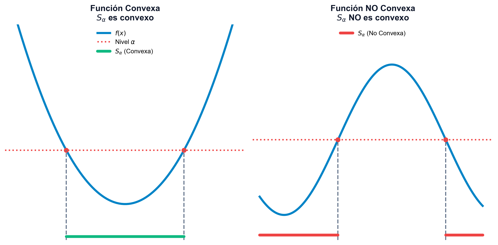
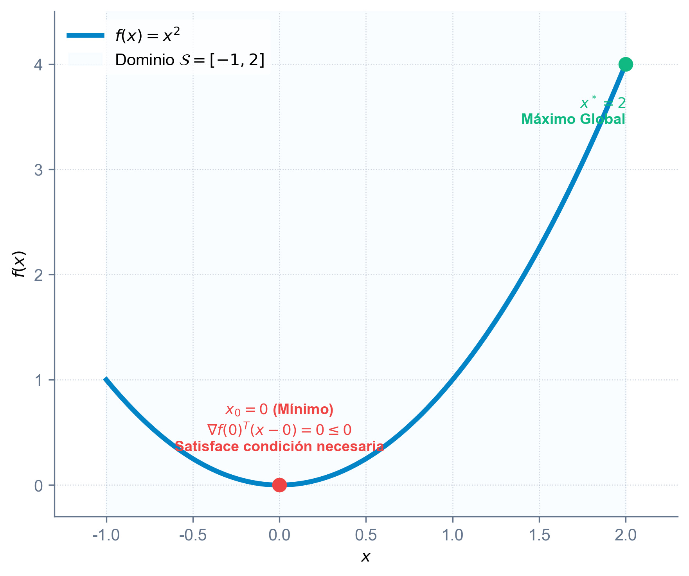
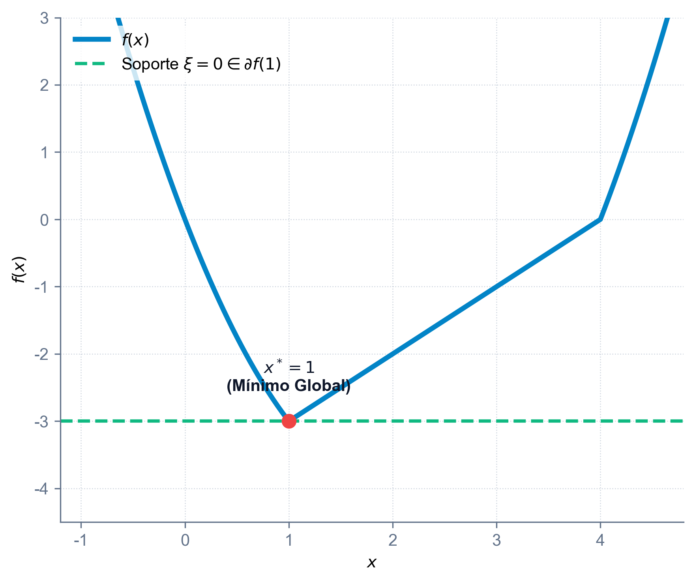
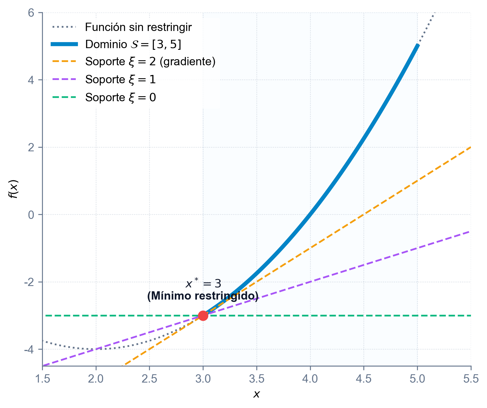
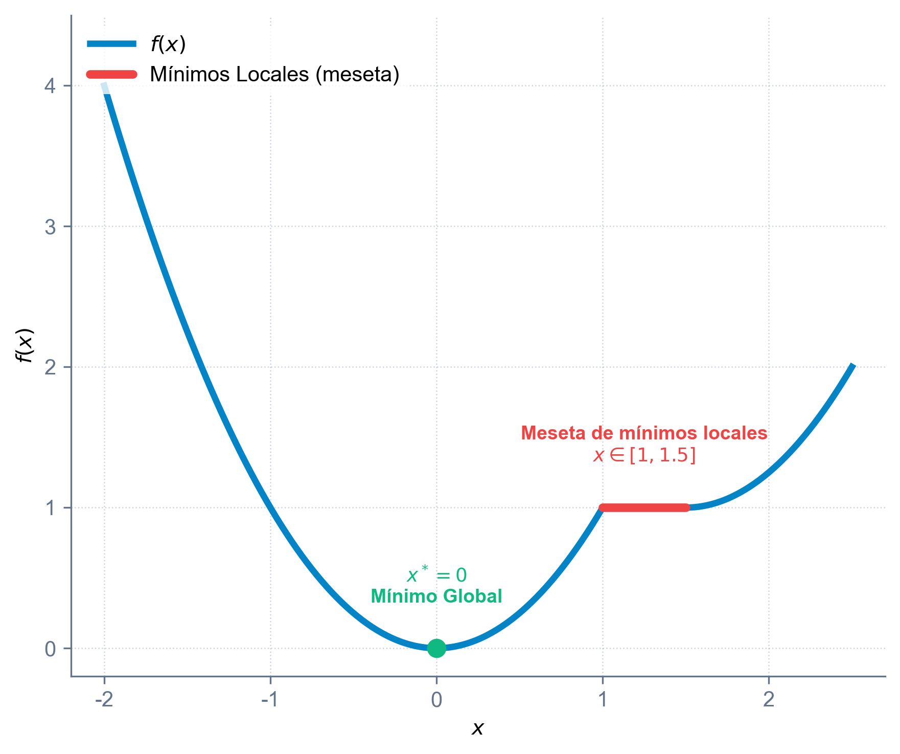
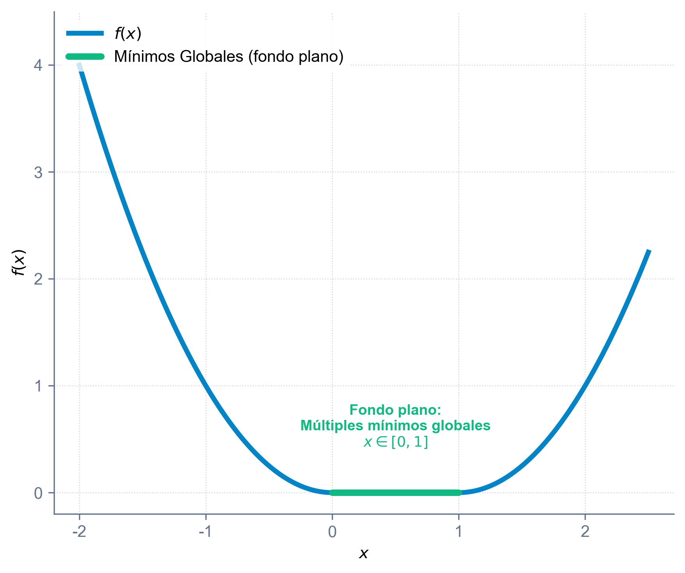

# Introducción y conjuntos convexos

## ¿De qué trata este tema?

El análisis convexo estudia las propiedades geométricas de conjuntos y funciones que garantizan la resolución eficiente y global de problemas de optimización.

*   **Evitar óptimos locales**: Identificar estructuras donde no existen mínimos locales falsos, impidiendo que los algoritmos queden atrapados en soluciones subóptimas.
*   **Optimización no diferenciable**: Extender la teoría de optimización clásica a funciones no suaves (con "codos" o esquinas) mediante el concepto de subgradiente y subdiferencial.
*   **Garantías de unicidad y globalidad**: Caracterizar analíticamente cuándo una solución óptima es única y globalmente válida.
*   **Generalizaciones matemáticas**: Relajar las condiciones de convexidad estricta mediante cuasi-convexidad y pseudo-convexidad para modelar problemas reales (como utilidad económica o eficiencias).

---

## ¿Qué aprenderás en este tema?

*   **Álgebra de conjuntos convexos**: Demostrar la convexidad de dominios factibles y comprender la minimalidad de la envoltura convexa.
*   **Geometría de funciones**: Caracterizar funciones a través de sus epígrafos y conjuntos de nivel.
*   **Condiciones diferenciales de convexidad**: Emplear el gradiente (primer orden) y la Hessiana (segundo orden) para demostrar analíticamente la convexidad de una función.
*   **Cálculo de subgradientes**: Determinar el subdiferencial de funciones no suaves y trazar planos de soporte inferior.
*   **Optimalidad global**: Aplicar la caracterización variacional y de subgradientes para verificar y certificar mínimos restringidos.
*   **Taxonomía de generalizaciones**: Clasificar y relacionar funciones cuasi-convexas, estrictamente cuasi-convexas, fuertemente cuasi-convexas y pseudo-convexas.

---

## Conjuntos convexos: definición

Un conjunto $\mathcal{S} \subseteq \mathbb{R}^n$ es **convexo** si, para cualesquiera dos puntos $x_1, x_2 \in \mathcal{S}$, la combinación convexa de ambos pertenece también a $\mathcal{S}$ para todo $\lambda \in [0, 1]$:

$$ \lambda x_1 + (1 - \lambda) x_2 \in \mathcal{S}, \quad \forall \lambda \in [0, 1] $$

::: {.columns}
::: {.column width="50%"}
*   **Combinación lineal**: $\sum \lambda_i x_i$ con $\lambda_i \in \mathbb{R}$.
*   **Combinación afín**: Combinación lineal con $\sum \lambda_i = 1$.
*   **Combinación cónica**: Combinación lineal con $\lambda_i \ge 0$.
*   **Combinación convexa**: Combinación lineal con $\lambda_i \ge 0$ y $\sum \lambda_i = 1$.
:::

::: {.column width="50%"}
{fig-align="center" width="90%"}
:::
:::

---

## Ejemplos de conjuntos convexos básicos

*   **Hiperplano**: Dado un vector normal no nulo $p \in \mathbb{R}^n$ y un escalar $\alpha \in \mathbb{R}$:
    $$ \mathcal{H} = \{ x \in \mathbb{R}^n \mid p^T x = \alpha \} $$
*   **Semiespacio Cerrado**: Región situada en uno de los lados de un hiperplano:
    $$ \mathcal{H}^- = \{ x \in \mathbb{R}^n \mid p^T x \le \alpha \} \qquad \mathcal{H}^+ = \{ x \in \mathbb{R}^n \mid p^T x \ge \alpha \} $$
*   **Poliedro o Politopo Convexo**: La intersección de un número finito de semiespacios cerrados:
    $$ \mathcal{P} = \{ x \in \mathbb{R}^n \mid A x \le b \} $$
*   **Bola Métrica**: Bola cerrada en $\mathbb{R}^n$ con centro en $x_0$ y radio $r \ge 0$ bajo cualquier norma $\|\cdot\|$:
    $$ \mathcal{B} = \{ x \in \mathbb{R}^n \mid \|x - x_0\| \le r \} $$

---

## Propiedades algebraicas de conjuntos convexos

La convexidad se preserva bajo operaciones algebraicas fundamentales.

**Propiedades de conservación**:
Sean $\mathcal{S}_1, \mathcal{S}_2 \subseteq \mathbb{R}^n$ dos conjuntos convexos:

1.  **Intersección**: $\mathcal{S}_1 \cap \mathcal{S}_2$ es un conjunto convexo. (Generalizable a familias infinitas).
2.  **Suma Directa**: $\mathcal{S}_1 \oplus \mathcal{S}_2 = \{ x + y \mid x \in \mathcal{S}_1, y \in \mathcal{S}_2 \}$ es convexo.
3.  **Diferencia Directa**: $\mathcal{S}_1 \ominus \mathcal{S}_2 = \{ x - y \mid x \in \mathcal{S}_1, y \in \mathcal{S}_2 \}$ es convexo.

---

## Envoltura convexa

La envoltura convexa $\mathcal{H}(\mathcal{S})$ de un conjunto $\mathcal{S}$ es el conjunto formado por todas las combinaciones lineales convexas posibles de puntos pertenecientes a $\mathcal{S}$:
$$ \mathcal{H}(\mathcal{S}) = \left\{ x = \sum_{j=1}^k \lambda_j x_j \;\middle|\; x_j \in \mathcal{S}, \ \lambda_j \ge 0, \ \sum_{j=1}^k \lambda_j = 1 \right\} $$

---

## Minimalidad de la envoltura convexa

::: {.callout-important title="Minimalidad de la envoltura convexa"}
La envoltura convexa $\mathcal{H}(\mathcal{S})$ es el menor conjunto convexo que contiene al conjunto $\mathcal{S}$.
:::

{fig-align="center" width="55%"}

---

## Politopos, símplices y puntos extremos

::: {.columns}
::: {.column width="50%"}
*   **Politopo y Símplex**: Un *politopo* es la envoltura convexa de un número finito de puntos. Si son afínmente independientes, es un *símplex* (triángulo en 2D, tetraedro en 3D).
*   **Puntos extremos**: Elemento $x \in \mathcal{S}$ que no puede expresarse como combinación convexa de otros dos puntos distintos. En poliedros coinciden con los **vértices**.
:::

::: {.column width="50%"}
{fig-align="center" width="100%"}
:::
:::

---

## Optimización en poliedros

*   **Teorema de Representación de Minkowski-Weyl**: Todo punto de un poliedro compacto $\mathcal{S}$ se puede expresar como una combinación lineal convexa de sus puntos extremos $\{x_1, \dots, x_k\}$.

::: {.callout-important title="Maximización en poliedros"}
Sea $\mathcal{S}$ un conjunto poliedro convexo y compacto no vacío de $\mathbb{R}^n$, y sea $f: \mathcal{S} \to \mathbb{R}$ una función convexa. Si $f$ alcanza su máximo en $\mathcal{S}$, entonces alcanza su máximo en al menos uno de los puntos extremos (vértices) de $\mathcal{S}$.
:::

# Funciones convexas

## Funciones convexas: definición y secante

Una función $f: \mathcal{S} \to \mathbb{R}$ definida sobre un conjunto convexo $\mathcal{S}$ es **convexa** si la cuerda o secante que une cualesquiera dos puntos de su gráfica se sitúa sobre o por encima de la propia gráfica de la función:

$$ f(\lambda x_1 + (1 - \lambda) x_2) \le \lambda f(x_1) + (1 - \lambda) f(x_2), \quad \forall x_1, x_2 \in \mathcal{S}, \; \forall \lambda \in [0, 1] $$

*   **Estrictamente convexa**: Si la desigualdad se cumple de forma estricta ($<$) para todo $\lambda \in (0, 1)$ y $x_1 \neq x_2$.
*   **Cóncava**: Si $-f$ es convexa.

---

## Ilustración de la convexidad

Visualización gráfica del concepto de secante. El valor de la función en el punto intermedio (curva azul) queda siempre por debajo de la combinación de sus extremos (recta roja):

{fig-align="center" width="60%"}

---

## Continuidad de las funciones convexas

::: {.callout-important title="Continuidad de las funciones convexas"}
Sea $f : \mathcal{S} \to \mathbb{R}$ una función convexa, con $\mathcal{S}$ un conjunto convexo no vacío de $\mathbb{R}^n$. Entonces, $f$ es continua en el interior de $\mathcal{S}$ ($\text{int }\mathcal{S}$).
:::

*   **Discontinuidad en la frontera**: La continuidad se restringe al interior de $\mathcal{S}$. En la frontera, una función convexa puede presentar discontinuidades.
    *   *Ejemplo*: Sea $\mathcal{S} = [0, 1]$ y consideremos la función convexa:
        $$ f(x) = \begin{cases} x^2 & \text{si } x \in (0, 1) \\ 1 & \text{si } x = 0 \text{ o } x = 1 \end{cases} $$
        Esta función es convexa en todo el intervalo $\mathcal{S}$, pero es discontinua en los límites frontera $x = 0$ y $x = 1$.

---

## Operaciones que preservan la convexidad

Podemos construir funciones convexas complejas combinando funciones convexas sencillas:

*   **Suma ponderada positiva**: Si $f_1, \dots, f_k$ son funciones convexas y $\alpha_1, \dots, \alpha_k \ge 0 \implies \sum_j \alpha_j f_j$ también es una función convexa.
*   **Supremo puntual (Máximo)**: Si $f_1, \dots, f_k$ son funciones convexas, la función envoltura superior definida por el máximo puntual $f(x) = \max_{j} \{f_j(x)\}$ es convexa.
*   **Composición afín**: Si $g: \mathbb{R}^m \to \mathbb{R}$ es una función activa y convexa y $h(x) = A x + b$ es una transformación afín $\implies f(x) = g(A x + b)$ es convexa.
*   **Inversa de una cóncava**: Si $g: \mathbb{R}^n \to \mathbb{R}$ es una función cóncava $\implies f(x) = \frac{1}{g(x)}$ es una función convexa sobre el dominio restringido $\{x \mid g(x) > 0\}$.
*   **Composición general (no decreciente)**: Si $g$ es convexa y no decreciente, y $h$ es convexa $\implies f(x) = g(h(x))$ es convexa.

---

## Convexidad de los conjuntos de nivel

::: {.callout-important title="Convexidad de los conjuntos de nivel"}
Sea $f: \mathcal{S} \to \mathbb{R}$ una función convexa sobre un dominio convexo $\mathcal{S}$. Para cualquier constante $\alpha \in \mathbb{R}$, el conjunto de nivel inferior $\mathcal{S}_\alpha = \{ x \in \mathcal{S} \mid f(x) \le \alpha \}$ es un conjunto convexo.
:::

---

## Convexidad de los conjuntos de nivel: gráfica

{fig-align="center" width="80%"}

---

## Epigrafo e hipografo

Asocian propiedades analíticas de las funciones con la geometría de conjuntos:

*   **Epigrafo ($\text{epi } f$)**: El conjunto de puntos situados sobre o por encima de la gráfica de la función:
    $$ \text{epi } f = \{ (x, y) \in \mathbb{R}^{n+1} \mid x \in \mathcal{S}, \; y \ge f(x) \} $$
*   **Hipografo ($\text{hyp } f$)**: El conjunto de puntos situados sobre o por debajo de la gráfica:
    $$ \text{hyp } f = \{ (x, y) \in \mathbb{R}^{n+1} \mid x \in \mathcal{S}, \; y \le f(x) \} $$

---

## Relación entre epigrafo y convexidad: gráfica

{fig-align="center" width="80%"}

---

## Relación entre epigrafo y convexidad

::: {.callout-important title="Relación entre epigrafo y convexidad"}
Una función $f: \mathcal{S} \to \mathbb{R}$ es convexa si y solo si su epigrafo $\text{epi } f$ es un conjunto convexo en $\mathbb{R}^{n+1}$.
:::

---

## Subgradientes y subdiferenciales

Para funciones no diferenciables (como $f(x) = |x|$), el concepto de gradiente se generaliza mediante subgradientes.

Un vector $\xi \in \mathbb{R}^n$ es un **subgradiente** de $f$ en el punto $x_0 \in \mathcal{S}$ si define un plano de soporte inferior para la función:

$$ f(x) \ge f(x_0) + \xi^T (x - x_0), \quad \forall x \in \mathcal{S} $$

*   **Subdiferencial ($\partial f(x_0)$)**: El conjunto de todos los subgradientes de $f$ en $x_0$.
*   Si la función es diferenciable en $x_0$, el subdiferencial contiene un único elemento: el gradiente clásico $\partial f(x_0) = \{\nabla f(x_0)\}$.

---

## Subgradientes: ilustración

Visualización geométrica del subdiferencial. En puntos singulares de no diferenciabilidad (codos), existen múltiples pendientes $\xi$ que sirven de plano de soporte inferior:

{fig-align="center" width="60%"}

---

## Existencia del subgradiente

El subdiferencial cuenta con soporte teórico de existencia en el interior y de unicidad local:

::: {.callout-important title="Existencia del subgradiente (hiperplano soporte al epigrafo)"}
Sea $f: \mathcal{S} \to \mathbb{R}$ una función convexa, con $\mathcal{S}$ un conjunto convexo no vacío de $\mathbb{R}^n$. Para cualquier punto interior $x_0 \in \text{int }\mathcal{S}$, existe al menos un subgradiente $\xi \in \mathbb{R}^n$. Esto equivale a decir que el hiperplano $y = f(x_0) + \xi^T(x - x_0)$ es un hiperplano de soporte para el epigrafo de $f$, $\text{epi } f$, en el punto frontera $(x_0, f(x_0))$.
:::

*   **Caso de Convexidad Estricta**: Si $f: \mathcal{S} \to \mathbb{R}$ es estrictamente convexa, entonces para cualquier $x_0 \in \text{int }\mathcal{S}$ y cualquier subgradiente $\xi \in \partial f(x_0)$, se verifica la desigualdad estricta:
    $$ f(x) > f(x_0) + \xi^T(x - x_0), \quad \forall x \in \mathcal{S}, \; x \neq x_0 $$

---

## Suficiencia de los subgradientes

La existencia de un vector de soporte inferior en cada punto del dominio es además suficiente para asegurar la convexidad:

::: {.callout-important title="Suficiencia de la caracterización por subgradientes"}
Sea $\mathcal{S}$ un conjunto convexo abierto no vacío de $\mathbb{R}^n$ y sea $f: \mathcal{S} \to \mathbb{R}$ una función. Si para cada punto $x_0 \in \mathcal{S}$ existe un vector $\xi \in \mathbb{R}^n$ tal que:
$$ f(x) \ge f(x_0) + \xi^T(x - x_0), \quad \forall x \in \mathcal{S} $$
entonces la función $f$ es convexa en $\mathcal{S}$.
:::

---

## Reglas del cálculo de subgradientes

El cálculo con subgradientes sigue reglas analíticas análogas al cálculo diferencial estándar:

*   **Regla de la Suma**:
    $$ \partial (f_1(x) + f_2(x)) = \partial f_1(x) \oplus \partial f_2(x) $$
*   **Multiplicación Escalar**:
    $$ \partial (\alpha f(x)) = \alpha \partial f(x), \quad \forall \alpha \ge 0 $$
*   **Máximo de Funciones**: Si $f(x) = \max \{f_1(x), f_2(x)\}$ con $f_1, f_2$ convexas:
    $$ \partial f(x) = \mathcal{H}(\cup_{i \in \mathcal{I}(x)} \partial f_i(x)) $$
    donde $\mathcal{I}(x) = \{ i \mid f_i(x) = f(x) \}$ es el conjunto de índices activos.

---

## Subgradientes: Caso 1D (Función no suave)

*   Sea la función convexa definida por tramos del libro:
    $$ f(x) = \max \{ |x| - 4, \ (x - 2)^2 - 4 \} = \begin{cases} x - 4 & \text{si } 1 \le x \le 4 \\ (x - 2)^2 - 4 & \text{en otro caso} \end{cases} $$
*   **En puntos diferenciables**:
    *   $x_0 = 2 \implies f'(2) = 1 \implies \partial f(2) = \{1\}$ (recta soporte: $y = x - 4$).
    *   $x_0 = 5 \implies f'(5) = 6 \implies \partial f(5) = \{6\}$ (recta soporte: $y = 6x - 25$).
*   **En puntos singulares o codos**:
    *   $x_0 = 1 \implies f'_{-}(1) = -2, \; f'_{+}(1) = 1 \implies \partial f(1) = [-2, 1]$.
    *   $x_0 = 4 \implies f'_{-}(4) = 1, \; f'_{+}(4) = 4 \implies \partial f(4) = [1, 4]$.

---

## Subgradientes: Caso 1D Ilustración

Visualización del subdiferencial de la función anterior en un punto diferenciable (izquierda) frente a los puntos singulares de codo (derecha):

{fig-align="center" width="75%"}

---

## Subgradientes: Caso 2D (Plano soporte)

*   Sea la función cuadrática diferenciable del libro:
    $$ f(x, y) = 8x^2 + 3xy + 7y^2 - 25x + 31y - 29 $$
*   En el punto de evaluación $\mathbf{x}_0 = (10, 10)^T$:
    *   Valor de la función: $f(10, 10) = 1831$.
    *   Derivadas parciales: $\frac{\partial f}{\partial x}(10, 10) = 165$ y $\frac{\partial f}{\partial y}(10, 10) = 201$.
*   Al ser diferenciable, el subgradiente es único e igual al gradiente:
    $$ \xi = \nabla f(10, 10) = \begin{pmatrix} 165 \\ 201 \end{pmatrix} \implies \partial f(10, 10) = \left\{ \begin{pmatrix} 165 \\ 201 \end{pmatrix} \right\} $$
*   El plano soporte tangente inferior en 3D es:
    $$ z = 1831 + 165(x - 10) + 201(y - 10) $$

---

## Subgradientes: Caso 2D Ilustración

Plano soporte tangente de soporte inferior en 3D para la función del libro en el punto de tangencia $(10, 10, 1831)$:

{fig-align="center" width="55%"}

# Caracterización diferencial

## Caracterización de primer orden

::: {.callout-important title="Caracterización de primer orden"}
Si la función $f: \mathcal{S} \to \mathbb{R}$ es **diferenciable** en un conjunto abierto convexo $\mathcal{S}$:

1.  $f$ es **convexa** en $\mathcal{S}$ si y solo si:
    $$ f(x) \ge f(x_0) + \nabla f(x_0)^T (x - x_0), \quad \forall x, x_0 \in \mathcal{S} $$
2.  $f$ es **estrictamente convexa** en $\mathcal{S}$ si y solo si:
    $$ f(x) > f(x_0) + \nabla f(x_0)^T (x - x_0), \quad \forall x, x_0 \in \mathcal{S}, \; x \neq x_0 $$
:::

---

## Monotonía del gradiente

::: {.callout-important title="Monotonía del gradiente"}
Una función diferenciable $f$ es convexa en un conjunto convexo abierto $\mathcal{S}$ si y solo si su gradiente es un operador monótono:
$$ (\nabla f(x_2) - \nabla f(x_1))^T(x_2 - x_1) \ge 0, \quad \forall x_1, x_2 \in \mathcal{S} $$
:::
---

## Caracterización de segundo orden

::: {.callout-important title="Caracterización de segundo orden"}
Si la función $f: \mathcal{S} \to \mathbb{R}$ es **dos veces diferenciable** ($\mathcal{C}^2$) en un abierto convexo $\mathcal{S}$:

1.  $f$ es **convexa** en $\mathcal{S}$ si y solo si su matriz hessiana es semidefinida positiva en todo punto de $\mathcal{S}$:
    $$ \nabla^2 f(x) \succeq 0, \quad \forall x \in \mathcal{S} $$
2.  Si la matriz hessiana es definida positiva en todo el dominio ($\nabla^2 f(x) \succ 0, \forall x \in \mathcal{S}$), entonces $f$ es **estrictamente convexa** en $\mathcal{S}$.
:::
*   *Ejemplo de recíproco falso*: $f(x) = x^4$ es estrictamente convexa, pero $f''(0) = 0$ (solo semidefinida positiva).

---

## Curvatura y Hessiana: Ejemplo 1

Estudiar la convexidad de la función cuadrática:
$$ f(x_1, x_2, x_3) = x_1 x_2 + 2x_1^2 + x_2^2 + 2x_3^2 - 6x_1 x_3 $$

*   **Matriz Hessiana constante**:
    $$ \nabla^2 f = \begin{pmatrix} 4 & 1 & -6 \\ 1 & 2 & 0 \\ -6 & 0 & 4 \end{pmatrix} $$
*   **Menores principales principales (Sylvester)**:
    *   $M_1 = 4 > 0$.
    *   $M_2 = 4(2) - 1^2 = 7 > 0$.
    *   $M_3 = \det(\nabla^2 f) = 4(8) - 1(4) - 6(12) = -20 < 0$.
*   Al ser el determinante negativo, la Hessiana es **indefinida**. La función no es ni cóncava ni convexa en $\mathbb{R}^3$.

---

## Curvatura y Hessiana: Ejemplo 2

Estudiar la concavidad de la función:
$$ f(x_1, x_2) = 10 - 2(x_2 - x_1^2)^2 $$

*   **Matriz Hessiana variable**:
    $$ \nabla^2 f(x) = \begin{pmatrix} 8x_2 - 24x_1^2 & 8x_1 \\ 8x_1 & -4 \end{pmatrix} $$
*   Para que sea cóncava se requiere $\nabla^2 f(x) \preceq 0$ (semidefinida negativa):
    *   $M_1 = 8x_2 - 24x_1^2 \le 0$.
    *   $M_2 = \det(\nabla^2 f) = 96x_1^2 - 32x_2 \ge 0 \implies x_2 \le 3x_1^2$.
*   Dado que $x_1^2 \le 3x_1^2$, la condición limitante es $x_2 \le x_1^2$ (región parabólica no convexa).

---

## Curvatura y Hessiana: Ilustración Ejemplo 2

Visualización en 3D de la cresta parabólica no lineal de la función $f(x_1, x_2) = 10 - 2(x_2 - x_1^2)^2$. Fuera de la parábola $x_2 \le x_1^2$, la curvatura deja de ser cóncava:

{fig-align="center" width="55%"}

---

## Curvatura y Hessiana: Ejemplo 3

Estudiar la convexidad de la función:
$$ f(x, y, z) = x^2 + 3y^2 + z^2 + xy - 4z - 5x + 14 $$

*   **Matriz Hessiana constante**:
    $$ \nabla^2 f = \begin{pmatrix} 2 & 1 & 0 \\ 1 & 6 & 0 \\ 0 & 0 & 2 \end{pmatrix} $$
*   **Menores principales**:
    *   $M_1 = 2 > 0$.
    *   $M_2 = 2(6) - 1^2 = 11 > 0$.
    *   $M_3 = 2(M_2) = 22 > 0$.
*   Al ser todos los menores principales estrictamente positivos, la Hessiana es **definida positiva** ($\nabla^2 f \succ 0$) en todo el dominio. La función es **estrictamente convexa** de forma global.

# Óptimos y condiciones de optimalidad

## Propiedades fundamentales del óptimo

La convexidad elimina la incertidumbre de la optimización no lineal clásica:

::: {.callout-important title="Fundamental de la optimización convexa"}
Si $f: \mathcal{S} \to \mathbb{R}$ es una función convexa sobre un conjunto convexo $\mathcal{S}$, entonces cualquier mínimo local de $f$ en $\mathcal{S}$ es también un mínimo global. Si la función $f$ es estrictamente convexa, el mínimo global (si existe) es único.
:::
---

## Caracterización variacional de mínimos

¿Cómo verificar analíticamente si un punto $x^*$ es un mínimo global?

*   **Caracterización con subgradientes**: Un punto $x^*$ es mínimo global de la función convexa $f$ en $\mathcal{S}$ si y solo si el vector nulo $0$ es un subgradiente de $f$ en $x^*$:
    $$ 0 \in \partial f(x^*) $$
*   **Caracterización variacional diferenciable**: Si la función $f$ es diferenciable en todo su dominio, entonces un punto $x^*$ es un mínimo global en $\mathcal{S}$ si y solo si:
    $$ \nabla f(x^*)^T (x - x^*) \ge 0, \quad \forall x \in \mathcal{S} $$

---

## Caracterización del conjunto de soluciones óptimas

::: {.callout-important title="Caracterización del conjunto de soluciones óptimas"}
Sea $f: \mathcal{S} \to \mathbb{R}$ una función convexa y diferenciable sobre el conjunto convexo $\mathcal{S}$. Si existe al menos un mínimo global $x_0 \in \mathcal{S}$, entonces el conjunto de todas las soluciones óptimas $\mathcal{S}^*$ viene caracterizado por:
        $$ \mathcal{S}^* = \{ x \in \mathcal{S} \mid \nabla f(x_0)^T(x - x_0) \ge 0 \quad \text{y} \quad \nabla f(x) = \nabla f(x_0) \} $$
:::

---

## Corolarios de la caracterización de óptimos

Bajo las mismas hipótesis de convexidad y diferenciabilidad y existiendo un mínimo global $x_0$:

*   **Caracterización mediante igualdad**: El conjunto de soluciones óptimas $\mathcal{S}^*$ puede expresarse alternativamente mediante la condición de igualdad del gradiente:
    $$ \mathcal{S}^* = \{ x \in \mathcal{S} \mid \nabla f(x_0)^T (x - x_0) = 0 \} $$
*   **Caso de funciones cuadráticas en poliedros**: Si $f(x) = c^T x + \frac{1}{2} x^T H x$ y el dominio $\mathcal{S}$ es un poliedro, entonces el conjunto de óptimos $\mathcal{S}^*$ es también un poliedro expresable como:
    $$ \mathcal{S}^* = \{ x \in \mathcal{S} \mid c^T(x - x_0) = 0 \text{ y } H(x - x_0) = \mathbf{0} \} $$

---

## Maximización de funciones convexas

::: {.callout-important title="Condición necesaria para máximos locales de funciones convexas"}
Sea el problema de maximizar $f(x)$ sujeto a $x \in \mathcal{S}$, donde $f: \mathcal{S} \to \mathbb{R}$ es una función convexa y $\mathcal{S}$ es un conjunto convexo no vacío de $\mathbb{R}^n$. Si $x_0 \in \mathcal{S}$ es un óptimo local para este problema de maximización, entonces:
        $$ \xi^T(x - x_0) \le 0, \quad \forall x \in \mathcal{S} $$
        donde $\xi$ es cualquier subgradiente de $f$ en $x_0$ ($\xi \in \partial f(x_0)$).
:::

---

## Maximización: contraejemplo

*   **Caso Diferenciable para Máximos Locales**: Si la función convexa $f$ es además diferenciable en todo el dominio $\mathcal{S}$, la condición necesaria para que $x_0 \in \mathcal{S}$ sea un óptimo local del problema de maximización se simplifica a:
    $$ \nabla f(x_0)^T (x - x_0) \le 0, \qquad \forall x \in \mathcal{S} $$
*   La condición necesaria $\nabla f(x_0)^T(x-x_0) \le 0$ para funciones convexas es muy débil y **no es suficiente** para garantizar un máximo local.

---

## Maximización: contraejemplo gráfico

::: {.columns}
::: {.column width="48%"}
*   **Contraejemplo**: Sea $f(x) = x^2$ en el dominio acotado $\mathcal{S} = [-1, 2]$.
    *   Mínimo global en $x_0 = 0$, con gradiente nulo: $\nabla f(0) = 0$.
    *   Se cumple la condición necesaria:
        $\nabla f(0)^T (x - 0) = 0 \le 0, \quad \forall x \in \mathcal{S}$
    *   Sin embargo, en $x_0 = 0$ la función alcanza su **mínimo global**, no un máximo.
    *   El máximo global real está en la frontera derecha $x^* = 2$ con valor $f(2) = 4$.
:::

::: {.column width="48%"}
{fig-align="center" width="100%"}
:::
:::

---

## Óptimos: Ejemplo 1 (No diferenciable)

Minimizar la función definida por tramos del libro en $\mathbb{R}$:
$$ f(x) = \begin{cases} x - 4 & \text{si } 1 \le x \le 4 \\ (x - 2)^2 - 4 & \text{en otro caso} \end{cases} $$

*   La función tiene un punto de no diferenciabilidad (codo) en $x^* = 1$.
*   Calculamos el subdiferencial en dicho codo:
    *   Derivada lateral izquierda (parábola): $f'_{-}(1) = 2(1-2) = -2$.
    *   Derivada lateral derecha (recta): $f'_{+}(1) = 1$.
    *   Subdiferencial en el codo: $\partial f(1) = [-2, 1]$.
*   Como el cero pertenece al subdiferencial ($0 \in [-2, 1]$), el punto $x^* = 1$ es un **mínimo global** de la función con valor $f(1) = -3$.

---

## Óptimos: Ilustración Ejemplo 1

Gráfica del Ejemplo 1. En el codo singular $x^* = 1$, la presencia del cero en el subdiferencial $[-2, 1]$ permite apoyar una recta de soporte horizontal (pendiente nula):

{fig-align="center" width="55%"}

---

## Óptimos: Ejemplo 2 (Dominio restringido 1D)

Minimizar la parábola convexa $f(x) = (x-2)^2 - 4$ sujeta a la restricción de caja $x \in [3, 5]$.

*   El mínimo libre global está en $x = 2$, el cual es exterior al conjunto factible $\mathcal{S} = [3, 5]$.
*   Evaluamos el punto frontera inferior factible $x^* = 3$:
    *   Gradiente clásico en el óptimo de frontera: $\nabla f(3) = 2(3-2) = 2$.
    *   El subdiferencial restringido a $\mathcal{S}$ en $x^* = 3$ es $\partial f_{\mathcal{S}}(3) = (-\infty, 2]$.
*   Como el cero pertenece a este subdiferencial restringido ($0 \le 2$), el punto $x^* = 3$ es el **mínimo global restringido** con valor $f(3) = -3$.

---

## Óptimos: Ilustración Ejemplo 2

La gráfica muestra la parábola en la región factible y cómo todas las pendientes del subdiferencial restringido $\xi \le 2$ (incluyendo la pendiente nula) actúan como rectas soporte válidas:

{fig-align="center" width="55%"}

---

## Óptimos: Ejemplo 3 (2D Frontera)

Minimizar la distancia cuadrática a un punto objetivo exterior $(3, 2)^T$:
$$ \min_{x_1, x_2} \ (x_1 - 3)^2 + (x_2 - 2)^2 $$
Sujeto al dominio convexo:
$$ \mathcal{S} = \{ \mathbf{x} \in \mathbb{R}^2 \mid x_1^2 + x_2^2 \le 5, \; x_1 + 2x_2 \le 4, \; x_1 \ge 0, \; x_2 \ge 0 \} $$

*   El óptimo analítico se localiza en la intersección de las fronteras activas: $\mathbf{x}^* = (2, 1)^T$.
*   El gradiente apunta en dirección contraria al dominio: $\nabla f(x^*) = (-2, -2)^T$.
*   La condición exige $\nabla f(x^*)^T(\mathbf{x} - \mathbf{x}^*) \ge 0 \implies -2(x_1 - 2) - 2(x_2 - 1) \ge 0 \iff x_1 + x_2 \le 3$.

---

## Óptimos: Ilustración Ejemplo 3

El gradiente $\nabla f(x^*)$ en el óptimo de frontera $(2,1)$ forma un ángulo obtuso con todas las direcciones factibles que apuntan hacia el interior del polígono convexo:

{fig-align="center" width="55%"}

---

## Óptimos: Ejemplo 4 (2D Interior)

Consideremos el mismo dominio convexo del Ejemplo 3, pero buscando el mínimo respecto al punto objetivo $(1, 1)^T$, el cual es un punto interior de $\mathcal{S}$:

*   Dado que $\mathbf{x}^* = (1, 1)^T$ cumple estrictamente las restricciones:
    *   $1^2 + 1^2 = 2 < 5$
    *   $1 + 2(1) = 3 < 4$
    *   $1 > 0, \; 1 > 0$
*   El óptimo se sitúa en el interior del conjunto factible, comportándose como un problema libre.
*   El gradiente se anula exactamente en el óptimo:
    $$ \nabla f(\mathbf{x}^*) = \mathbf{0} $$

---

## Óptimos: Ilustración Ejemplo 4

Al situarse el punto de referencia $(1, 1)$ dentro de la región factible, la distancia cuadrática se minimiza de forma exacta con valor cero en dicho punto interior:

{fig-align="center" width="55%"}

# Generalizaciones de la convexidad

## Funciones cuasi-convexas: concepto

::: {.callout-important title="Equivalencia por conjuntos de nivel"}
Sea $f: \mathcal{S} \to \mathbb{R}$, con $\mathcal{S}$ un conjunto convexo no vacío de $\mathbb{R}^n$. La función $f$ es cuasi-convexa si y solo si el conjunto de nivel inferior $\mathcal{S}_\alpha = \{ x \in \mathcal{S} \mid f(x) \le \alpha \}$ es convexo para cualquier número real $\alpha$.
:::
*   **Definición equivalente**:
    $$ f(\lambda x + (1-\lambda)y) \le \max(f(x), f(y)), \quad \forall x, y \in \mathcal{S}, \; \lambda \in [0, 1] $$

---

## Ejemplos de cuasi-convexidad

Ejemplos de funciones cuasi-convexas no convexas. La función $f(x)=x^3$ (izquierda) y la función $f(x)=|x|^{0.5}$ (derecha) poseen conjuntos de nivel convexos (intervalos):

{fig-align="center" width="70%"}

---

## Óptimos locales y globales en cuasi-convexidad

*   En funciones cuasi-convexas generales, **un mínimo local no es necesariamente global**.
*   Pueden existir "mesetas" o regiones planas que atrapen a los algoritmos en óptimos locales mediocres:

{fig-align="center" width="55%"}

---

## Funciones estrictamente cuasi-convexas

Para eliminar el problema de las mesetas de mínimos locales:

*   **Definición**: Una función $f: \mathcal{S} \to \mathbb{R}$ es **estrictamente cuasi-convexa** si para todo $x \neq y$ con $f(x) \neq f(y)$:
    $$ f(\lambda x + (1-\lambda)y) < \max(f(x), f(y)), \quad \forall \lambda \in (0, 1) $$

::: {.callout-important title="Mínimos en funciones estrictamente cuasi-convexas"}
Si $f: \mathcal{S} \to \mathbb{R}$ es una función estrictamente cuasi-convexa definida en un conjunto convexo $\mathcal{S}$, entonces cualquier mínimo local es también un mínimo global.
:::

*   Si $f: \mathcal{S} \to \mathbb{R}$ es estrictamente cuasi-convexa y semicontinua inferiormente, con $\mathcal{S}$ un conjunto convexo no vacío, entonces $f$ es cuasi-convexa.

---

## Estricta cuasi-convexidad: Ilustración

Ejemplo de función estrictamente cuasi-convexa que posee un fondo plano de infinitos mínimos globales en el intervalo $[0, 1]$, demostrando la falta de unicidad:

{fig-align="center" width="55%"}

---

## Funciones fuertemente cuasi-convexas

Para asegurar tanto la globalidad del óptimo como su **unicidad**:

*   **Definición**: Una función $f: \mathcal{S} \to \mathbb{R}$ es **fuertemente cuasi-convexa** si para todo $x \neq y$:
    $$ f(\lambda x + (1-\lambda)y) < \max(f(x), f(y)), \quad \forall \lambda \in (0, 1) $$
    (Incluso si coinciden los valores de los extremos, $f(x) = f(y)$).

::: {.callout-important title="Unicidad del mínimo en funciones fuertemente cuasi-convexas"}
Sea el problema de minimizar $f(x)$ sujeto a $x \in \mathcal{S}$, donde $f: \mathbb{R}^n \to \mathbb{R}$ es una función fuertemente cuasi-convexa y $\mathcal{S} \subseteq \mathbb{R}^n$ es un conjunto convexo no vacío. Si existe un mínimo local $x_0$, entonces $x_0$ es el único mínimo global.
:::
---

## Funciones pseudo-convexas

Se definen únicamente para funciones **diferenciables**. Representan la generalización más fuerte, garantizando que el óptimo se caracteriza por la anulación del gradiente.

*   **Definición**: Una función diferenciable $f$ es **pseudo-convexa** si:
    $$ \nabla f(y)^T (x - y) \ge 0 \implies f(x) \ge f(y) $$
*   **Consecuencia**: Si el gradiente es nulo en un punto ($\nabla f(y) = \mathbf{0}$), entonces $\nabla f(y)^T(x-y) = 0 \ge 0$, lo que implica $f(x) \ge f(y)$ para todo $x$, demostrando que $y$ es un **mínimo global**.

---

## Relaciones entre las generalizaciones

Existen implicaciones lógicas estrictas entre estas clases de funciones:

::: {.callout-important title="Relación entre pseudo-convexidad y cuasi-convexidad estricta"}
Sea $f: \mathcal{S} \to \mathbb{R}$ una función diferenciable en un conjunto convexo abierto no vacío $\mathcal{S}$. Si $f$ es pseudo-convexa en $\mathcal{S}$, entonces es estrictamente cuasi-convexa.
:::
::: {.callout-important title="Relación entre pseudo-convexidad estricta y cuasi-convexidad fuerte"}
Sea $f: \mathcal{S} \to \mathbb{R}$ una función diferenciable en un conjunto convexo abierto no vacío $\mathcal{S}$. Si $f$ es estrictamente pseudo-convexa en $\mathcal{S}$, entonces es fuertemente cuasi-convexa.
:::
---

## Jerarquía de generalizaciones de la convexidad

{fig-align="center" width="85%"}

---

## Teorema de equivalencia cuadrática

::: {.callout-important title="Equivalencia cuadrática"}
Si la función $f: \mathcal{S} \to \mathbb{R}$ es una función cuadrática diferenciable en un conjunto convexo abierto $\mathcal{S}$, entonces las siguientes generalizaciones de la convexidad son lógicamente equivalentes:

1.  $f$ es pseudo-convexa si y solo si es estrictamente cuasi-convexa.
2.  $f$ es cuasi-convexa si y solo si es estrictamente cuasi-convexa.
3.  $f$ es estrictamente pseudo-convexa si y solo si es fuertemente cuasi-convexa.

Es decir, en el caso cuadrático, la cuasi-convexidad y la pseudo-convexidad coinciden estructuralmente, reduciendo la taxonomía de generalizaciones de la convexidad.
:::
---

## Ejemplos Visuales: Curvas de nivel 3D (1)

::: {.columns}
::: {.column width="48%"}
*   **Función cuasi-convexa**:
    $$ f(x,y) = ((x-2)^2 + (y-2)^2)^{0.25} $$
*   Superficie tridimensional que no tiene curvatura convexa en sentido estricto.
*   **Curvas de nivel**: Sus conjuntos de nivel inferior proyectados en el plano inferior son discos circulares **convexos**.
:::

::: {.column width="48%"}
{fig-align="center" width="100%"}
:::
:::

---

## Ejemplos Visuales: Curvas de nivel 3D (2)

::: {.columns}
::: {.column width="48%"}
*   **Función no cuasi-convexa**:
    $$ f(x,y) = 2x^3+xy+y^3-x+y $$
*   La superficie muestra una curvatura irregular que no se asemeja a un cuenco.
*   **Curvas de nivel**: Sus conjuntos de nivel inferior proyectados no son convexos (tienen forma de herraduras o pliegues).
:::

::: {.column width="48%"}
{fig-align="center" width="100%"}
:::
:::

# Convexidad puntual

## Convexidad puntual (1)

La convexidad también puede estudiarse de forma localizada respecto a un determinado punto de interés $x_0 \in \mathcal{S}$ en un conjunto convexo no vacío $\mathcal{S}$:

1.  **Convexa en $x_0$**:
    $$ f(\lambda x_0 + (1-\lambda)x) \le \lambda f(x_0) + (1-\lambda)f(x), \quad \forall \lambda \in (0,1), \ \forall x \in \mathcal{S} $$
2.  **Estrictamente convexa en $x_0$**:
    $$ f(\lambda x_0 + (1-\lambda)x) < \lambda f(x_0) + (1-\lambda)f(x), \quad \forall \lambda \in (0,1), \ \forall x \in \mathcal{S}, \ x \neq x_0 $$
3.  **Cuasi-convexa en $x_0$**:
    $$ f(\lambda x_0 + (1-\lambda)x) \le \max \{ f(x_0), f(x) \}, \quad \forall \lambda \in (0,1), \ \forall x \in \mathcal{S} $$

---

## Convexidad puntual (2)

4.  **Estrictamente cuasi-convexa en $x_0$**:
    $$ f(\lambda x_0 + (1-\lambda)x) < \max \{ f(x_0), f(x) \}, \quad \forall \lambda \in (0,1), \ \forall x \in \mathcal{S} \text{ con } f(x) \neq f(x_0) $$
5.  **Fuertemente cuasi-convexa en $x_0$**:
    $$ f(\lambda x_0 + (1-\lambda)x) < \max \{ f(x_0), f(x) \}, \quad \forall \lambda \in (0,1), \ \forall x \in \mathcal{S}, \ x \neq x_0 $$
6.  **Pseudo-convexa en $x_0$**: (si $f$ es diferenciable en $x_0$)
    $$ \nabla f(x_0)^T(x - x_0) \ge 0 \implies f(x) \ge f(x_0), \quad \forall x \in \mathcal{S} $$
7.  **Estrictamente pseudo-convexa en $x_0$**: (si $f$ es diferenciable en $x_0$)
    $$ \nabla f(x_0)^T(x - x_0) \ge 0 \implies f(x) > f(x_0), \quad \forall x \in \mathcal{S}, \ x \neq x_0 $$