## Objetivos de aprendizaje

Al finalizar este capítulo, serás capaz de:

1.  **Diferenciar** las condiciones necesarias y suficientes de primer y segundo orden (FONC, SONC y SOSC) para optimización sin restricciones.
2.  **Caracterizar geométricamente** las direcciones de descenso y factibles a través de conos de direcciones algebraicos.
3.  **Analizar las condiciones de Fritz-John**, interpretando su significado geométrico y su sensibilidad ante restricciones redundantes.
4.  **Deducir y aplicar las condiciones de Karush-Kuhn-Tucker (KKT)** como fundamento analítico de la optimización restringida.
5.  **Resolver analíticamente** problemas con restricciones de igualdad y desigualdad por medio de la cualificación de restricciones (LICQ) y el análisis sistemático por casos.

# Optimización sin restricciones

## ¿Por qué estudiar problemas sin restricciones?

*   **Base diferencial**: Los conceptos de aproximación local, gradiente, Hessiana y curvatura se extienden directamente al caso restringido.
*   **Algoritmos indirectos**: Muchos métodos numéricos resuelven problemas con restricciones mediante una secuencia de subproblemas sin restricciones (ej. penalización, barrera).
*   **Comportamiento local**: Permite comprender cómo se comporta una función localmente basándonos únicamente en la información de sus derivadas.

---

## ¿Qué es una dirección de descenso?

Una dirección $d \in \mathbb{R}^n$ es de **descenso** en $\bar{x}$ si existe un paso $\delta > 0$ tal que la función disminuye estrictamente:
$$ f(\bar{x} + \lambda d) < f(\bar{x}), \quad \forall \lambda \in (0, \delta) $$

**Propiedad diferencial**:

*   Si $f$ es diferenciable en $\bar{x}$ y existe $d$ tal que $\nabla f(\bar{x})^T d < 0$, entonces $d$ es una dirección de descenso.
*   El producto escalar negativo indica que el ángulo entre el gradiente $\nabla f(\bar{x})$ y la dirección $d$ es obtuso.
*   **Cono de direcciones de descenso**:
    $$ \mathcal{D}_0(\bar{x}) = \{ d \in \mathbb{R}^n \mid \nabla f(\bar{x})^T d < 0 \} $$

---

## Condiciones de optimalidad sin restricciones (FONC y SONC)

Caracterización diferencial de extremos locales sin restricciones:

*   **Condición necesaria de primer orden (FONC)**:
    Si $\bar{x}$ es un mínimo local de $f$ (diferenciable en $\bar{x}$), entonces el gradiente se anula:
    $$ \nabla f(\bar{x}) = 0 $$
    *(El punto $\bar{x}$ es un **punto crítico** o estacionario, lo que vacía el cono de descenso: $\mathcal{D}_0(\bar{x}) = \emptyset$)*.

*   **Condición necesaria de segundo orden (SONC)**:
    Si $\bar{x}$ es un mínimo local de $f$ (dos veces diferenciable en $\bar{x}$), entonces la matriz Hessiana es semidefinida positiva:
    $$ \nabla^2 f(\bar{x}) \succeq 0 $$

---

## Condiciones suficientes de segundo orden (SOSC)

::: {.callout-important title="Condición suficiente de segundo orden (SOSC)"}
Sea $f$ dos veces diferenciable en un punto crítico $\bar{x}$ (donde $\nabla f(\bar{x}) = 0$).

*   Si $\nabla^2 f(\bar{x}) \succ 0$ (definida positiva), entonces $\bar{x}$ es un **mínimo local estricto**.
*   Si $\nabla^2 f(\bar{x}) \prec 0$ (definida negativa), entonces $\bar{x}$ es un **máximo local estricto**.
*   Si $\nabla^2 f(\bar{x})$ es indefinida (autovalores positivos y negativos), entonces $\bar{x}$ es un **punto de silla**.
:::

*Si es únicamente semidefinida, la condición de segundo orden no es suficiente y existe ambigüedad.*

---

## Suficiencia de optimalidad global

Las condiciones SOSC son locales. Para certificar optimalidad global (garantizar que no existe ningún otro punto mejor en todo el dominio), necesitamos imponer convexidad:

::: {.callout-important title="Suficiencia de optimalidad bajo pseudo-convexidad"}
Sea $f: \mathcal{S} \to \mathbb{R}$ una función pseudo-convexa definida sobre un conjunto convexo $\mathcal{S}$.

Un punto $\bar{x} \in \mathcal{S}$ es un **mínimo global** de $f$ si y solo si es un punto estacionario:
$$ \nabla f(\bar{x}) = 0 $$
:::

---

## Derivadas de orden superior (una variable)

::: {.callout-important title="Extremos univariantes de orden superior"}
Sea $f: \mathbb{R} \to \mathbb{R}$ una función infinitamente diferenciable en un punto crítico $\bar{x}$. Supongamos que la primera derivada no nula en $\bar{x}$ es de orden $n \ge 2$, es decir, $f^{(j)}(\bar{x}) = 0$ para todo $j = 1, \dots, n-1$, y $f^{(n)}(\bar{x}) \neq 0$:

1.  Si $n$ es **impar**, entonces $\bar{x}$ es un **punto de inflexión** (no es un extremo local).
2.  Si $n$ es **par**:
    *   Si $f^{(n)}(\bar{x}) > 0$, entonces $\bar{x}$ es un **mínimo local estricto**.
    *   Si $f^{(n)}(\bar{x}) < 0$, entonces $\bar{x}$ es un **máximo local estricto**.
:::

---

## Derivadas de orden superior: ejemplo

::: {.columns}
::: {.column width="55%"}

Consideremos la función $f(x) = (x^2 - 1)^3$.
Puntos críticos en $x^* \in \{0, 1, -1\}$:

*   **En $x^* = 0$**:
    *   $f''(0) = 6 > 0 \implies$ mínimo local por SOSC.
*   **En $x^* = \pm 1$**:
    *   $f''(\pm 1) = 0 \implies$ orden superior.
    *   $f'''(\pm 1) = \pm 48 \neq 0 \implies$ primera derivada no nula es **impar** ($n=3$).
    *   Son **puntos de inflexión**.
:::

::: {.column width="45%"}
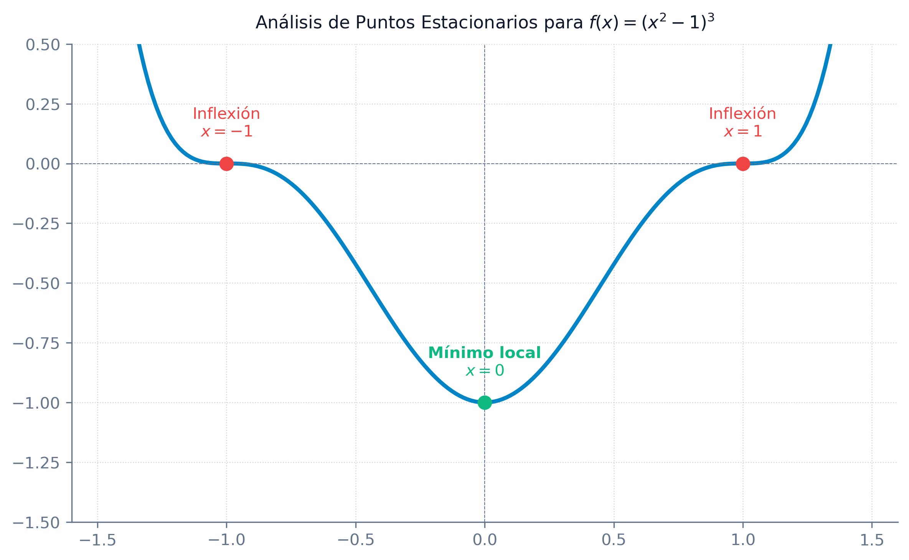{fig-align="center" width="95%"}
:::
:::

# Optimización con restricciones

## Introducción a la optimización con restricciones

En la práctica, la optimización matemática adquiere su verdadera complejidad al introducir restricciones sobre las variables de decisión.

**Dos marcos de análisis**:

1.  **Marco general geométrico**: Conjunto factible $\mathcal{S} \subseteq \mathbb{R}^n$ genérico:
    $$ \min \{ f(x) \mid x \in \mathcal{S} \} $$
2.  **Problema con restricciones explícitas**: Definidas mediante desigualdades:
    $$ \min \{ f(x) \mid x \in \mathcal{X}, \ g_i(x) \le 0, \ i = 1, \dots, m \} $$
    donde el dominio de partida $\mathcal{X}$ es un abierto no vacío de $\mathbb{R}^n$, y tanto $f$ como $g_i$ son diferenciables.

---

## Análisis local en la frontera

Para caracterizar si un punto frontera $\bar{x} \in \mathcal{S}$ es un mínimo local, analizamos movimientos infinitesimales a partir de él.

**Requisitos del movimiento infinitesimal**:

1.  **Factibilidad**: Permanecer dentro de la región factible $\mathcal{S}$ para un paso suficientemente pequeño.
2.  **Descenso**: Disminuir estrictamente el valor de la función objetivo $f(x)$.

*   Ambas condiciones se formalizan geométricamente a través de los **conos de direcciones** (factibles y de descenso).

---

## Conos de direcciones: factibilidad y descenso

Caracterización geométrica de los movimientos infinitesimales admisibles en $\bar{x} \in \mathcal{S}$:

*   **Cono de Direcciones Factibles ($\mathcal{F}(\bar{x})$)**:
    Direcciones a lo largo de las cuales un paso infinitesimal no abandona la región factible:
    $$ \mathcal{F}(\bar{x}) = \{ d \in \mathbb{R}^n \mid d \neq 0, \ \exists \delta_d > 0 \text{ t.q. } \bar{x} + \lambda d \in \mathcal{S}, \ \forall \lambda \in (0, \delta_d) \} $$
*   **Cono de Direcciones de Mejora/Descenso ($\mathcal{D}(\bar{x})$)**:
    Direcciones a lo largo de las cuales el valor de la función objetivo disminuye localmente:
    $$ \mathcal{D}(\bar{x}) = \{ d \in \mathbb{R}^n \mid d \neq 0, \ \exists \delta_d > 0 \text{ t.q. } f(\bar{x} + \lambda d) < f(\bar{x}), \ \forall \lambda \in (0, \delta_d) \} $$
*   **Condición necesaria geométrica de optimalidad**:
    $$ \bar{x} \text{ es mínimo local} \implies \mathcal{F}(\bar{x}) \cap \mathcal{D}(\bar{x}) = \emptyset $$

---

## El cono de descenso analítico

Si $f$ es diferenciable, aproximamos el cono de descenso real $\mathcal{D}(\bar{x})$ localmente:

*   **Definición**: El cono analítico $\mathcal{D}_0(\bar{x})$ son las direcciones con ángulo obtuso respecto al gradiente:
    $$ \mathcal{D}_0(\bar{x}) = \{ d \in \mathbb{R}^n \mid \nabla f(\bar{x})^T d < 0 \} $$
*   **Inclusión**: Se cumple que $\mathcal{D}_0(\bar{x}) \subseteq \mathcal{D}(\bar{x})$.
*   **Significado geométrico**: Cualquier dirección $d \in \mathcal{D}_0(\bar{x})$ garantiza el descenso local de la función en $\bar{x}$.

---

## Exclusión de Direcciones de Descenso y Factibilidad

::: {.columns}
::: {.column width="55%"}

::: {.callout-important title="Exclusión de direcciones de descenso y factibilidad"}
Si $\bar{x} \in \mathcal{S}$ es un mínimo local de una función diferenciable $f$, entonces el cono factible y el semiespacio de descenso analítico son disjuntos:
$$ \mathcal{D}_0(\bar{x}) \cap \mathcal{F}(\bar{x}) = \emptyset $$
:::
:::

::: {.column width="45%"}
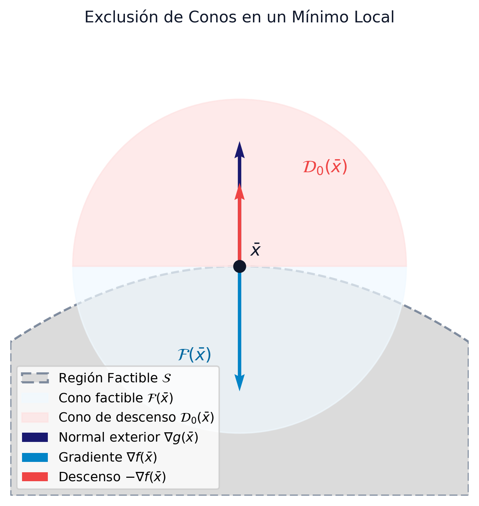{fig-align="center" width="100%"}
:::
:::

## Suficiencia geométrica bajo Pseudo-convexidad

La condición de exclusión $\mathcal{D}_0(\bar{x}) \cap \mathcal{F}(\bar{x}) = \emptyset$ es necesaria. Bajo propiedades de convexidad, se convierte también en suficiente:

::: {.callout-important title="Suficiencia geométrica bajo pseudo-convexidad"}
Sea el problema de optimización $\min\{f(x) \mid x \in \mathcal{S}\}$, con $f$ diferenciable y pseudo-convexa en $\bar{x} \in \mathcal{S}$. Si:

1.  Se cumple la condición de exclusión geométrica: $\mathcal{D}_0(\bar{x}) \cap \mathcal{F}(\bar{x}) = \emptyset$.
2.  Existe un entorno $N_\epsilon(\bar{x})$ de radio $\epsilon > 0$ tal que el vector $d = (x - \bar{x}) \in \mathcal{F}(\bar{x})$ para cualquier $x \in \mathcal{S} \cap N_\epsilon(\bar{x})$.

Entonces, $\bar{x}$ es un **mínimo local** de $f$.
:::

---

## Limitación del Cono de Direcciones Factibles

::: {.callout-warning title="Limitación del cono factible geométrico"}
El cono de direcciones factibles $\mathcal{F}(\bar{x})$ se define de forma puramente geométrica y depende del comportamiento infinitesimal de la frontera del conjunto $\mathcal{S}$.

*   Determinar analíticamente si una dirección $d \in \mathcal{F}(\bar{x})$ requiere analizar la existencia de un paso $\delta > 0$ tal que $\bar{x} + \lambda d \in \mathcal{S}$ para todo $\lambda \in (0, \delta)$.
*   Esta verificación es extremadamente compleja en la práctica para restricciones no lineales.
:::

**Solución**: Si el conjunto factible está definido por restricciones analíticas de desigualdad diferenciables, aproximamos localmente el cono factible mediante el **cono de restricciones activas** $\mathcal{G}_0(\bar{x})$, el cual se calcula algebraicamente.

# Restricciones de desigualdad y cono de restricciones activas

## Restricciones de desigualdad y conjunto activo

La región factible $\mathcal{S}$ se define explícitamente mediante una serie de desigualdades analíticas:
$$ \mathcal{S} = \{ x \in \mathcal{X} \mid g_i(x) \le 0, \ i = 1, \dots, m \} $$

*   **Región factible y dominio**: El dominio de partida $\mathcal{X} \subseteq \mathbb{R}^n$ es un abierto no vacío, y tanto $f$ como las restricciones $g_i$ son funciones diferenciables.

*   **Restricciones inactivas**: Si $g_i(\bar{x}) < 0$, la restricción está **inactiva** y no limita localmente los movimientos admisibles en un entorno lo suficientemente pequeño de $\bar{x}$.

*   **Conjunto activo**: El **conjunto activo** $\mathcal{I}$ está formado por los índices de las restricciones que se cumplen estrictamente como igualdad en $\bar{x}$:
    $$ \mathcal{I} = \{ i \in \{1, \dots, m\} \mid g_i(\bar{x}) = 0 \} $$

---

## Gradientes y movimiento admisible

Para analizar qué movimientos infinitesimales nos mantienen dentro de la región factible, estudiamos la geometría de las restricciones activas en $\bar{x}$:

*   **Gradiente como dirección de crecimiento**: Si $g_i$ ($i \in \mathcal{I}$) es diferenciable, el gradiente $\nabla g_i(\bar{x})$ señala la dirección de máximo crecimiento local de la restricción.

*   **Orientación hacia el exterior**: Dado que las restricciones son de tipo "menor o igual que" ($g_i(x) \le 0$), el gradiente $\nabla g_i(\bar{x})$ apunta estrictamente hacia el exterior de la región factible $\mathcal{S}$.

*   **Movimiento hacia el interior**: Si una dirección $d \in \mathbb{R}^n$ forma un ángulo obtuso con el gradiente de una restricción activa:
    $$ \nabla g_i(\bar{x})^T d < 0 $$
    entonces nos moveremos localmente hacia el interior factible de dicha restricción.

---

## Ejemplo: Identificación – Planteamiento

Consideremos el siguiente problema bidimensional con restricciones lineales y circulares:
$$
\begin{aligned}
\min \quad & f(x_1, x_2) = (x_1 - 3)^2 + (x_2 - 2)^2 \\
\text{s.a.} \quad & g_1(x_1, x_2) = x_1^2 + x_2^2 - 5 \le 0 \\
& g_2(x_1, x_2) = -x_1 \le 0 \\
& g_3(x_1, x_2) = -x_2 \le 0 \\
& g_4(x_1, x_2) = x_1 + x_2 - 3 \le 0
\end{aligned}
$$

*   **Función objetivo**: Minimizar la distancia euclídea al cuadrado con respecto al centro $(3, 2)$.

*   **Región factible $\mathcal{S}$**: Delimitada por la circunferencia $g_1$, los ejes de coordenadas $g_2, g_3$ y la recta oblicua $g_4$.

---

## Ejemplo: Identificación – Conjuntos activos

Dependiendo de la ubicación del punto factible evaluado, el conjunto de restricciones activas $\mathcal{I}$ varía considerablemente:

::: {.columns}
::: {.column width="55%"}

*   **Punto $(1,1)$**: El punto es estrictamente interior, por lo que ninguna restricción se cumple con igualdad y $\mathcal{I} = \emptyset$.

*   **Punto $(0,0)$**: El punto está en el origen, lo que activa las fronteras de no negatividad, resultando $\mathcal{I} = \{2, 3\}$.

*   **Punto $(2,1)$**: Situado en la intersección de la circunferencia y la recta, activando ambas simultáneamente: $\mathcal{I} = \{1, 4\}$.

*   **Punto $(0,1)$**: Situado sobre el eje vertical, lo que activa únicamente la restricción de $x_1 \ge 0$, resultando $\mathcal{I} = \{2\}$.
:::

::: {.column width="45%"}
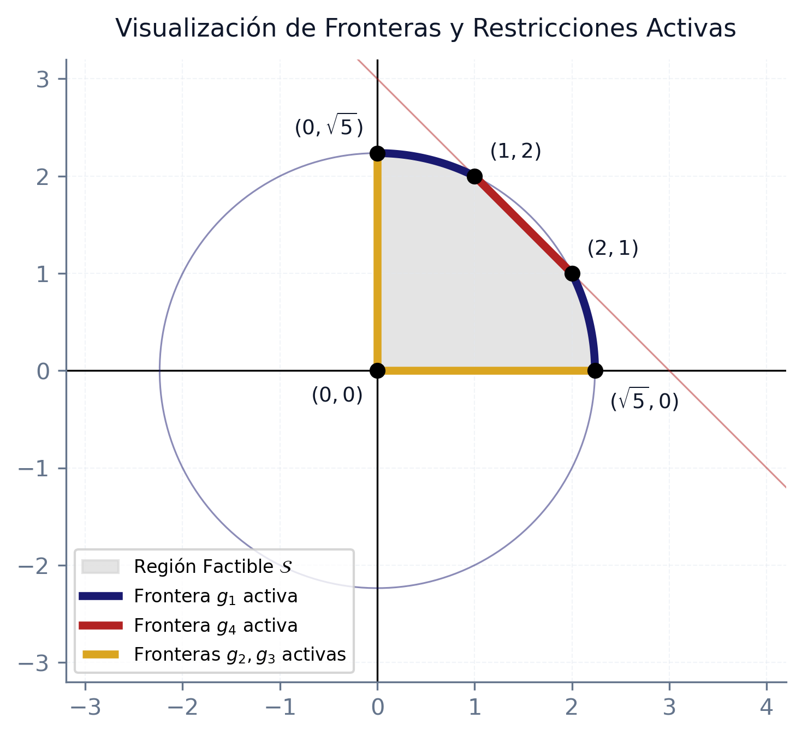{fig-align="center" width="100%"}
:::
:::

---

## Ejemplo: Identificación – Gradientes en la frontera

Analicemos los gradientes de las restricciones activas en los puntos situados sobre la frontera de la región factible:

::: {.columns}
::: {.column width="55%"}

*   **Punto $(1,2)$**: Las restricciones activas son la circunferencia $g_1$ y la recta oblicua $g_4$ ($\mathcal{I} = \{1, 4\}$).

*   **Cálculo de gradientes**:
    $$ \nabla g_1(1,2) = \begin{pmatrix} 2 \\ 4 \end{pmatrix}, \qquad \nabla g_4(1,2) = \begin{pmatrix} 1 \\ 1 \end{pmatrix} $$

*   **Orientación**: Ambos vectores señalan hacia fuera de la región factible, confirmando que el crecimiento de $g_i$ nos aleja del conjunto factible $\mathcal{S}$.
:::

::: {.column width="45%"}
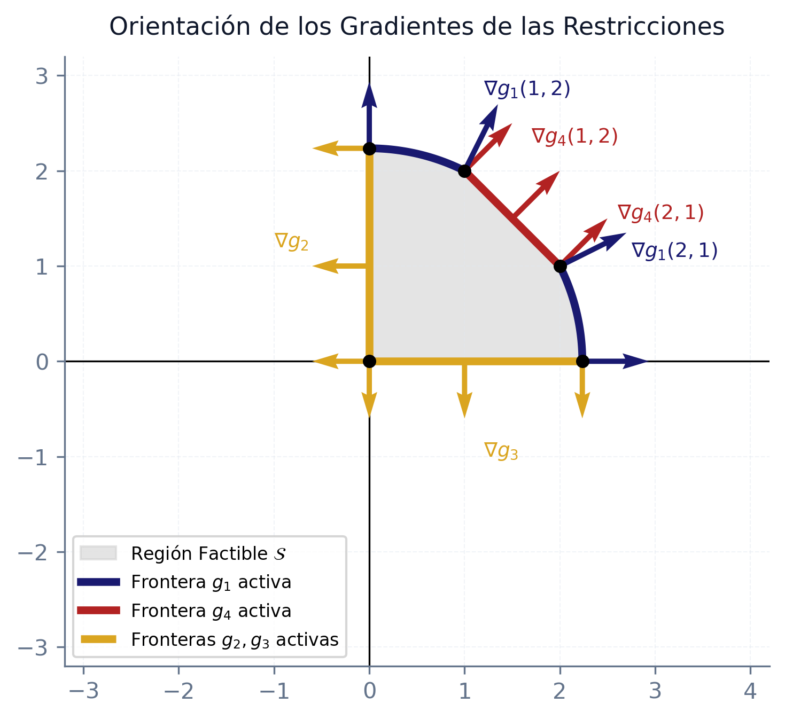{fig-align="center" width="100%"}
:::
:::

---

## Ejemplo: Identificación – Direcciones ortogonales

Analicemos qué ocurre con direcciones $d$ ortogonales a los gradientes de restricciones activas ($\nabla g_i(\bar{x})^T d = 0$):

::: {.columns}
::: {.column width="55%"}

*   **Punto $(0,1)$**: La restricción $g_2(x) = -x_1 \le 0$ está activa, con $\nabla g_2 = (-1,0)^T$. La dirección vertical $d = (0,1)^T$ es ortogonal al gradiente ($\nabla g_2^T d = 0$) y resulta factible, ya que mantiene al punto sobre la frontera.

*   **Punto $(1,2)$**: La restricción $g_4(x) = x_1+x_2-3 \le 0$ está activa, con $\nabla g_4 = (1,1)^T$. La dirección tangencial $d = (1,-1)^T$ es ortogonal ($\nabla g_4^T d = 0$) y es factible por tratarse de una frontera lineal.
:::

::: {.column width="45%"}
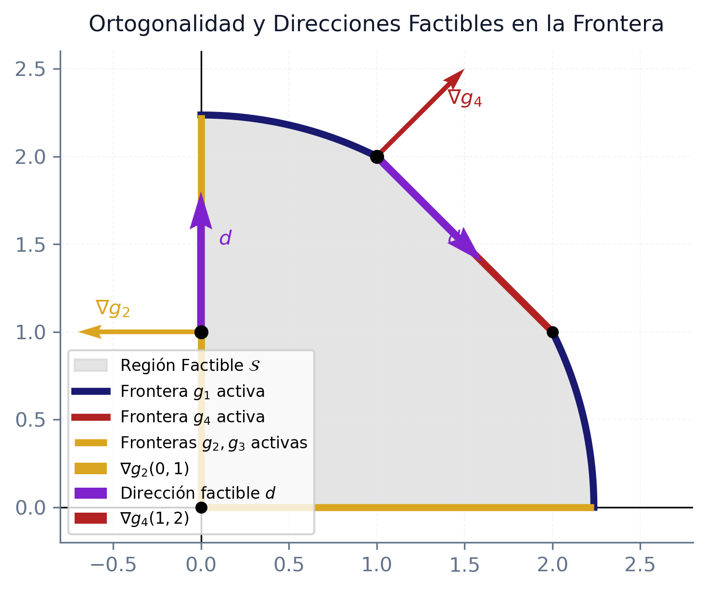{fig-align="center" width="100%"}
:::
:::

---

## El cono analítico de restricciones activas

El cono de direcciones factibles geométricas $\mathcal{F}(\bar{x})$ requiere analizar la existencia de un paso admisible, lo que resulta muy complejo en la frontera. Lo aproximamos localmente de forma algebraica:

*   **Definición**: El **cono analítico de restricciones activas** $\mathcal{G}_0(\bar{x})$ es el conjunto de direcciones que apuntan estrictamente hacia el interior de todas las restricciones activas en $\bar{x}$:
    $$ \mathcal{G}_0(\bar{x}) = \{ d \in \mathbb{R}^n \mid \nabla g_i(\bar{x})^T d < 0, \ \forall i \in \mathcal{I} \} $$

*   **Ventaja algebraica**: Se calcula directamente a partir de los gradientes de las restricciones activas en el punto de evaluación, sin necesidad de estimar la longitud de pasos infinitesimales.

---

## Relación de inclusión de conos

La relación entre el cono algebraico $\mathcal{G}_0(\bar{x})$ y el cono factible geométrico $\mathcal{F}(\bar{x})$ es estrecha, pero presenta matices:

*   **Inclusión fundamental**: Cualquier dirección que apunte estrictamente al interior de las restricciones activas es geométricamente factible:
    $$ \mathcal{G}_0(\bar{x}) \subseteq \mathcal{F}(\bar{x}) $$

*   **Inclusión estricta**: En general, no se cumple la igualdad ($\mathcal{G}_0(\bar{x}) \neq \mathcal{F}(\bar{x})$).

*   **Causa de discrepancia**: Las direcciones $d$ ortogonales a algún gradiente activo de frontera lineal ($\nabla g_i(\bar{x})^T d = 0$) pueden mantener al punto sobre la frontera y ser factibles geométricamente, pero no pertenecen al cono abierto algebraico $\mathcal{G}_0(\bar{x})$.

---

## Intersección vacía con el cono activo

::: {.callout-important title="Intersección vacía con el cono activo"}
Sea el problema de optimización bajo restricciones de desigualdad, con $f$ y $g_i$ ($i \in \mathcal{I}$) diferenciables en el punto factible $\bar{x}$.
Si $\bar{x}$ es un mínimo local, entonces el cono de descenso analítico y el cono analítico de restricciones activas son disjuntos:
$$ \mathcal{D}_0(\bar{x}) \cap \mathcal{G}_0(\bar{x}) = \emptyset $$
:::

*   Dado que $\mathcal{G}_0(\bar{x}) \subseteq \mathcal{F}(\bar{x})$, de la exclusión geométrica necesaria ($\mathcal{D}_0(\bar{x}) \cap \mathcal{F}(\bar{x}) = \emptyset$) se deduce de forma inmediata que la intersección con el cono analítico más restrictivo también debe ser vacía.

---

## Suficiencia geométrica sin KKT

::: {.callout-important title="Suficiencia geométrica sin KKT"}
Sea el problema de optimización con restricciones de desigualdad, con $f$ y $g_i$ ($i \in \mathcal{I}$) diferenciables en $\bar{x}$. Si se cumple:

1.  La función objetivo $f$ es **pseudo-convexa** en $\bar{x}$.
2.  Las restricciones activas $g_i$ son **estrictamente pseudo-convexas** en $\bar{x}$.
3.  Se cumple que: $\mathcal{D}_0(\bar{x}) \cap \mathcal{G}_0(\bar{x}) = \emptyset$.

Entonces, $\bar{x}$ es un **mínimo local** del problema.
:::

---

## Ejemplo 1: Planteamiento y candidatos

Consideremos el problema de optimización restringido:
$$
\begin{aligned}
\min \quad & f(x_1, x_2) = (x_1 - 3)^2 + (x_2 - 2)^2 \\
\text{s.a.} \quad & g_1(x_1, x_2) = x_1^2 + x_2^2 - 5 \le 0 \\
& g_2(x_1, x_2) = -x_1 \le 0 \\
& g_3(x_1, x_2) = -x_2 \le 0 \\
& g_4(x_1, x_2) = x_1 + x_2 - 3 \le 0
\end{aligned}
$$

*   **Objetivo**: Minimizar la distancia al cuadrado con respecto al centro $(3, 2)$.

*   **Candidatos de frontera**: Analizaremos el comportamiento de los conos de direcciones en dos puntos candidatos situados sobre la frontera de la región factible:
    1.  El punto candidato **$A(9/5, 6/5)$**.
    2.  El punto candidato **$B(2, 1)$**.

---

## Ejemplo 1: Candidato $A(9/5, 6/5)$ – Conos

::: {.columns}
::: {.column width="55%"}

*   **Restricciones activas**:
    $$ g_1(A) < 0, \quad g_4(A) = 0 \implies \mathcal{I} = \{4\} $$

*   **Gradientes relevantes**:
    $$ \nabla g_4(A) = \begin{pmatrix} 1 \\ 1 \end{pmatrix}, \quad \nabla f(A) = \begin{pmatrix} -12/5 \\ -8/5 \end{pmatrix} $$

*   **Conos analíticos**:
    $$ \mathcal{G}_0(A) = \{ d \in \mathbb{R}^2 \mid d_1 + d_2 < 0 \} $$
    $$ \mathcal{D}_0(A) = \{ d \in \mathbb{R}^2 \mid 3d_1 + 2d_2 > 0 \} $$
:::

::: {.column width="45%"}
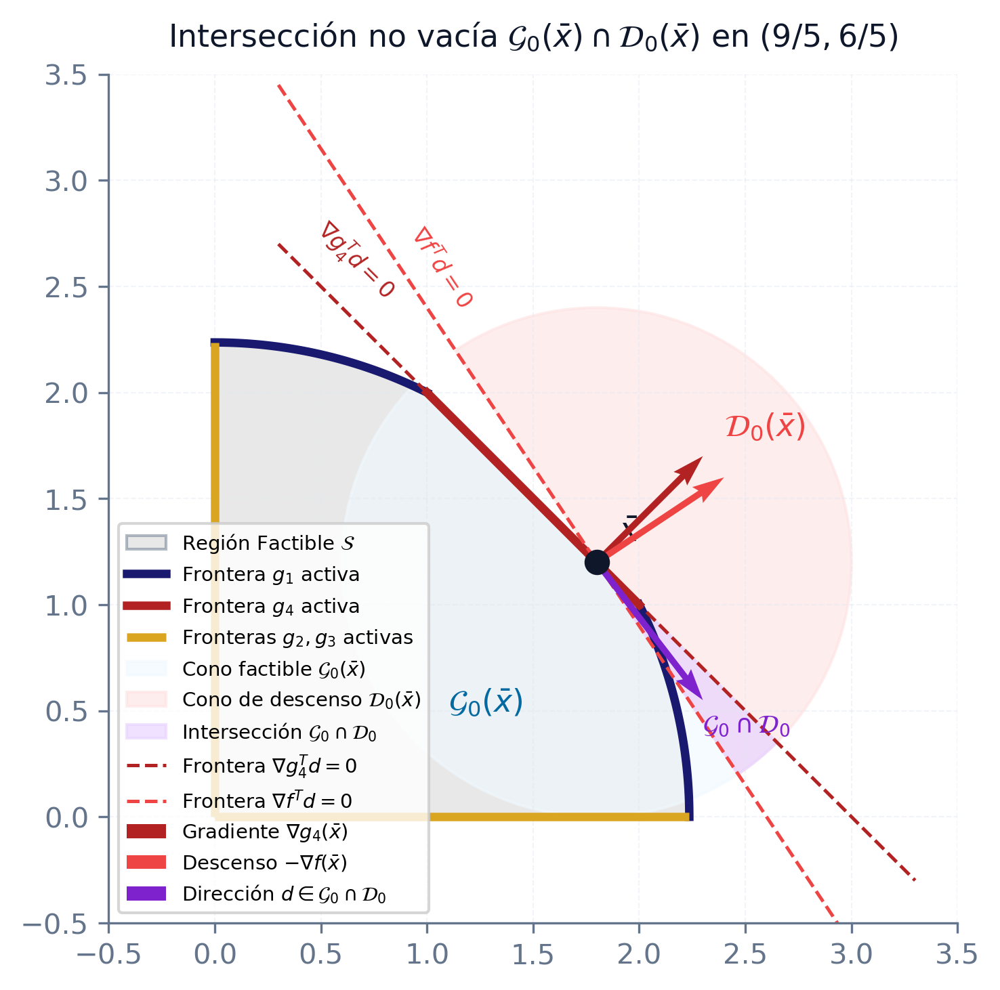{fig-align="center" width="100%"}
:::
:::

---

## Ejemplo 1: Candidato $A(9/5, 6/5)$ – No optimalidad

::: {.columns}
::: {.column width="55%"}

*   **Intersección de conos**:
    $$ \mathcal{G}_0(A) \cap \mathcal{D}_0(A) \neq \emptyset $$

*   **Dirección de descenso factible**: La dirección $d = (1, -1.3)^T$ cumple:
    *   $d_1 + d_2 = -0.3 < 0 \implies d \in \mathcal{G}_0(A)$
    *   $3d_1 + 2d_2 = 0.4 > 0 \implies d \in \mathcal{D}_0(A)$

*   **Conclusión**: Al existir direcciones factibles que a la vez son de descenso, el punto **no es un mínimo local**.
:::

::: {.column width="45%"}
{fig-align="center" width="100%"}
:::
:::

---

## Ejemplo 1: Candidato $B(2, 1)$ – Conos

::: {.columns}
::: {.column width="55%"}

*   **Restricciones activas**:
    $$ g_1(B) = 0, \quad g_4(B) = 0 \implies \mathcal{I} = \{1, 4\} $$

*   **Gradientes relevantes**:
    $$ \nabla g_1(B) = \begin{pmatrix} 4 \\ 2 \end{pmatrix}, \quad \nabla g_4(B) = \begin{pmatrix} 1 \\ 1 \end{pmatrix} $$
    $$ \nabla f(B) = \begin{pmatrix} -2 \\ -2 \end{pmatrix} $$

*   **Conos analíticos**:
    $$ \mathcal{G}_0(B) = \{ d \mid 2d_1+d_2 < 0 \text{ y } d_1+d_2 < 0 \} $$
    $$ \mathcal{D}_0(B) = \{ d \mid d_1 + d_2 > 0 \} $$
:::

::: {.column width="45%"}
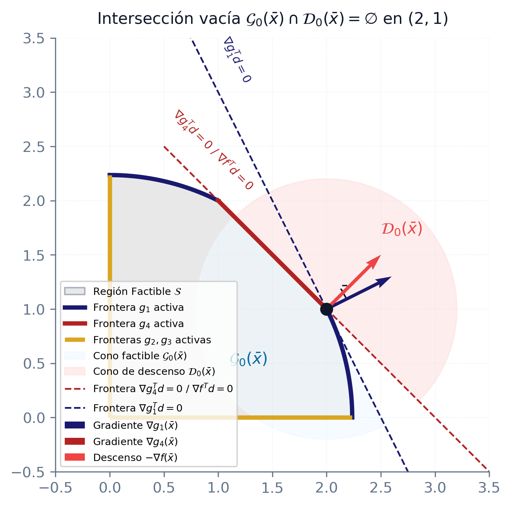{fig-align="center" width="100%"}
:::
:::

---

## Ejemplo 1: Candidato $B(2, 1)$ – Optimalidad

::: {.columns}
::: {.column width="55%"}

*   **Intersección vacía**:
    *   Cualquier $d \in \mathcal{G}_0(B)$ exige $d_1+d_2 < 0$.
    *   Esto es incompatible con $d \in \mathcal{D}_0(B) \implies d_1+d_2 > 0$.
    *   Por lo tanto:
        $$ \mathcal{G}_0(B) \cap \mathcal{D}_0(B) = \emptyset $$

*   **Conclusión**: Al ser un problema convexo (región factible y función objetivo convexas), **$B(2,1)$ es el mínimo global único**.
:::

::: {.column width="45%"}
{fig-align="center" width="100%"}
:::
:::

---

## Ejemplo 2: Tangencia cúbica (Planteamiento)

::: {.columns}
::: {.column width="55%"}

Consideremos el siguiente problema singular de optimización:
$$
\begin{aligned}
\min \quad & f(x_1, x_2) = (x_1 - 1)^2 + (x_2 - 1)^2 \\
\text{s.a.} \quad & g_1(x_1, x_2) = (x_1 + x_2 - 1)^3 \le 0 \\
& g_2(x_1, x_2) = -x_1 \le 0 \\
& g_3(x_1, x_2) = -x_2 \le 0
\end{aligned}
$$

*   **Geometría**:
    *   Región factible $\mathcal{S}$: Triángulo.
    *   Óptimo no restringido en el centro $(1, 1)$.
    *   Mínimo global real en el punto medio de la hipotenusa: $\bar{x} = (1/2, 1/2)$.
:::

::: {.column width="45%"}
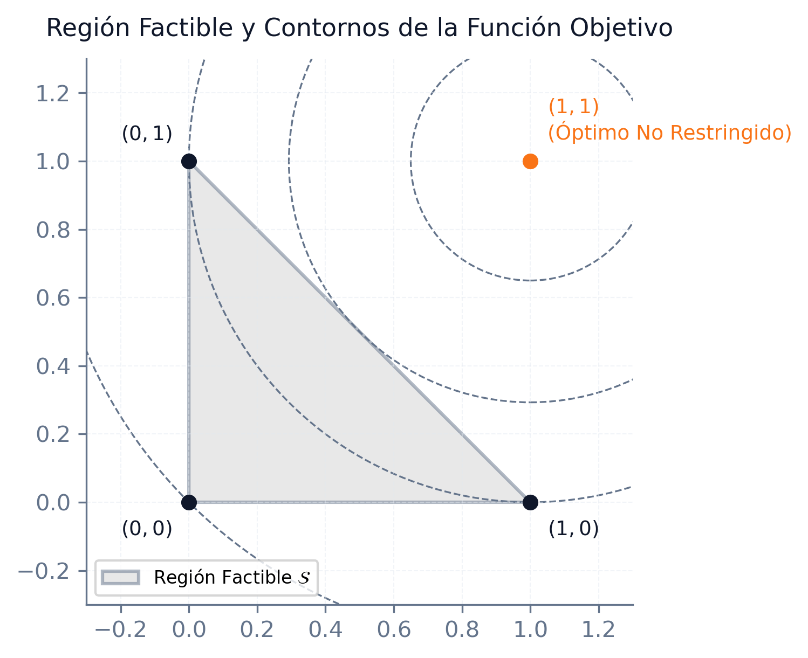{fig-align="center" width="100%"}
:::
:::

---

## Ejemplo 2: Análisis analítico en $\bar{x} = (1/2, 1/2)$

*   **Restricciones activas**: En $\bar{x} = (1/2, 1/2)$, la restricción $g_1$ está activa ($g_1(\bar{x}) = 0$).

*   **Cálculo de gradiente**:
    $$ \nabla g_1(x) = \begin{pmatrix} 3(x_1+x_2-1)^2 \\ 3(x_1+x_2-1)^2 \end{pmatrix} \implies \nabla g_1(\bar{x}) = \begin{pmatrix} 0 \\ 0 \end{pmatrix} $$

*   **Cono analítico activo**:
    $$ \mathcal{G}_0(\bar{x}) = \{ d \in \mathbb{R}^2 \mid \nabla g_1(\bar{x})^T d < 0 \} = \emptyset $$

*   **Intersección vacía**:
    Al ser $\mathcal{G}_0(\bar{x}) = \emptyset$, se cumple trivialmente que:
    $$ \mathcal{D}_0(\bar{x}) \cap \mathcal{G}_0(\bar{x}) = \emptyset $$
    La condición necesaria geométrica se satisface y el punto es, de hecho, el mínimo global.

---

## Ejemplo 2: Limitación del caso singular

El hecho de que el gradiente de la restricción activa se anule en el óptimo genera una limitación teórica importante:

*   **Falsos positivos**: Para cualquier punto sobre la hipotenusa $x_1+x_2=1$ (por ejemplo, el punto $(1,0)$), el gradiente $\nabla g_1(x)$ también es nulo.

*   **Anulación del cono analítico**: Esto implica que $\mathcal{G}_0(x) = \emptyset$ y $\mathcal{D}_0(x) \cap \mathcal{G}_0(x) = \emptyset$ para **toda la recta**, incluso para puntos que no son mínimos locales.

*   **Conclusión**: Cuando los gradientes de las restricciones activas se anulan o son linealmente dependientes, el cono analítico $\mathcal{G}_0(\bar{x})$ pierde su capacidad para representar el comportamiento geométrico real.

*   **Necesidad**: Surge la necesidad de definir **condiciones de regularidad** de restricciones (cualificación de restricciones).

---

## Ejemplo 2: Reformulación y regularización

::: {.columns}
::: {.column width="55%"}

Reescribimos la región factible con una restricción equivalente de primer orden:
$$ g_1(x_1, x_2) = x_1 + x_2 - 1 \le 0 $$

*   **Gradiente regularizado**:
    $$ \nabla g_1(x) = \begin{pmatrix} 1 \\ 1 \end{pmatrix} \neq \begin{pmatrix} 0 \\ 0 \end{pmatrix} $$

*   **Conos resultantes**:
    $$ \mathcal{G}_0(\bar{x}) = \{ d \in \mathbb{R}^2 \mid d_1 + d_2 < 0 \} $$

*   **Intersección vacía**:
    La condición $\mathcal{D}_0(\bar{x}) \cap \mathcal{G}_0(\bar{x}) = \emptyset$ ahora se verifica **únicamente** en el mínimo real $\bar{x} = (1/2, 1/2)$.
:::

::: {.column width="45%"}
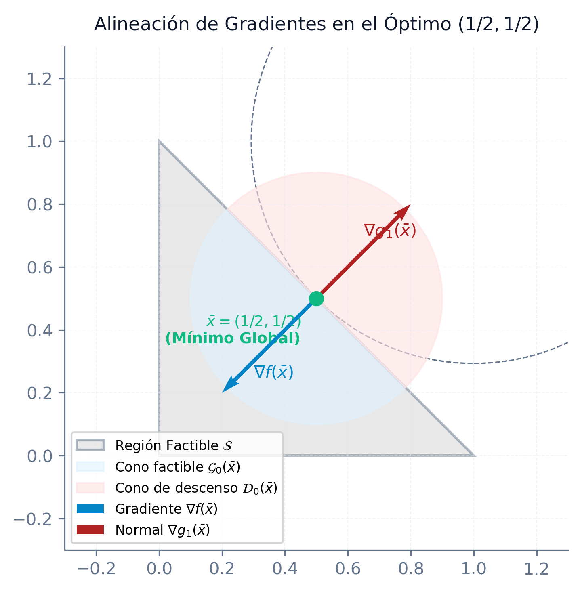{fig-align="center" width="100%"}
:::
:::

# Condiciones de Fritz-John (FJ)

## Introducción a las Condiciones de Fritz-John

*   **De la geometría al álgebra**: Comprobar la optimalidad mediante la exclusión geométrica de conos ($\mathcal{D}_0 \cap \mathcal{G}_0 = \emptyset$) en el espacio de direcciones requiere evaluar infinitos vectores (inviable en la práctica).

*   **Formulación dual**: Traducimos la exclusión geométrica en un sistema de ecuaciones algebraicas sobre los gradientes de las funciones en el punto de evaluación.

*   **Lemas de alternativas**: Resultados del álgebra lineal y convexidad que asocian coeficientes (multiplicadores) a las restricciones a partir de la ausencia de direcciones comunes.

---

## Lema: Alternativa de Farkas

::: {.callout-note title="Alternativa de Farkas"}
Sean $A$ una matriz de dimensiones $m \times n$ y $c \in \mathbb{R}^n$. Uno y solo uno de los siguientes sistemas de restricciones tiene solución:

1.  Existe $x \in \mathbb{R}^n$ tal que $A x \le 0$ y $c^T x > 0$.
2.  Existe $y \in \mathbb{R}^m$ tal que $A^T y = c$ e $y \ge 0$.
:::

*   **Significado**: Nos permite caracterizar cuándo un vector $c$ no puede formar un ángulo agudo con ninguna dirección factible, traduciéndolo en una combinación lineal cónica de las restricciones.

---

## Lema: Alternativa de Gordan

::: {.callout-note title="Alternativa de Gordan"}
Sea $A$ una matriz de dimensiones $m \times n$. Uno y solo uno de los siguientes sistemas de restricciones tiene solución:

1.  Existe $x \in \mathbb{R}^n$ tal que $A x < 0$.
2.  Existe $y \in \mathbb{R}^m$ tal que $A^T y = 0$, $y \ge 0$ e $y \neq 0$.
:::

*   **Significado**: Garantiza que si no hay ninguna dirección que sea estrictamente interior a un conjunto de semiespacios, entonces existe una combinación lineal no trivial no negativa de sus vectores normales que se anula.

---

## El equilibrio de fuerzas (Gordan)

La exclusión de direcciones de descenso factibles exige que no exista $d$ tal que:
$$ \nabla f(\bar{x})^T d < 0 \qquad \text{y} \qquad \nabla g_i(\bar{x})^T d < 0, \quad \forall i \in \mathcal{I} $$

*   **Matriz de gradientes**: Definimos la matriz $A$ cuyas filas son los gradientes $\nabla f(\bar{x})^T$ y $\nabla g_i(\bar{x})^T$ ($i \in \mathcal{I}$).

*   **Ausencia de solución**: La optimalidad geométrica equivale a que el sistema lineal $Ad < 0$ no tenga solución.

*   **Aplicación dual**: Por el Lema de Gordan, existe un vector de coeficientes no negativos $p = (u_0, u_{\mathcal{I}})^T \ge 0$ no nulo tal que:
    $$ u_0 \nabla f(\bar{x}) + \sum_{i \in \mathcal{I}} u_i \nabla g_i(\bar{x}) = 0 $$

---

## Condiciones necesarias de Fritz-John

::: {.callout-important title="Condiciones necesarias de fritz-john"}
Sea $\bar{x}$ un mínimo local del problema. Si $f$ y $g_i$ ($i \in \mathcal{I}$) son diferenciables en $\bar{x}$, existen multiplicadores $u_0, u_1, \dots, u_m$ tales que:

1.  **Factibilidad dual**: $u_0 \nabla f(\bar{x}) + \sum_{i=1}^m u_i \nabla g_i(\bar{x}) = 0$
2.  **Holgura complementaria**: $u_i g_i(\bar{x}) = 0, \quad \forall i = 1, \dots, m$
3.  **No negatividad**: $u_0, u_i \ge 0, \quad \forall i = 1, \dots, m$
4.  **No trivialidad**: $(u_0, u_1, \dots, u_m) \neq (0, 0, \dots, 0)$
:::

---

## El papel del multiplicador $u_0$

El multiplicador $u_0$ corresponde a la función objetivo:

*   **Caso regular ($u_0 > 0$)**: Podemos dividir toda la ecuación por $u_0$. Esto recupera de forma natural las **condiciones de KKT**, donde la función objetivo influye activamente en la optimalidad.

*   **Caso singular ($u_0 = 0$)**: La función objetivo desaparece de la ecuación dual. Las condiciones se satisfacen de forma puramente geométrica por la disposición de las restricciones en la frontera, perdiendo su utilidad para discriminar mínimos.

---

## Ejemplo: Interpretación en cuatro casos

Consideremos el punto de intersección $\bar{x} = (7/3, 4/3)$ bajo restricciones lineales activas:
$$ g_1(x) = 2x+y-6 \le 0 \implies \nabla g_1 = (2, 1)^T $$
$$ g_2(x) = x-y-1 \le 0 \implies \nabla g_2 = (1, -1)^T $$

*   **Propósito**: Analizaremos la relación entre el gradiente opuesto del objetivo $-\nabla f(\bar{x})$ y los gradientes de las restricciones en cuatro escenarios distintos.

*   **Equilibrio dual**: Estudiaremos cómo los signos y la dependencia lineal de los vectores determinan el tipo de punto y el valor de los multiplicadores.

---

## Caso 1: Mínimo local regular

::: {.columns}
::: {.column width="55%"}

*   **Problema**: Minimizar $f(x, y) = (x-5)^2+(y-1)^2$ sujeto a $g_1$ y $g_2$.

*   **Gradiente**: $-\nabla f(\bar{x}) = (16/3, -2/3)^T$, situado dentro del cono generado por los gradientes activos.

*   **Ecuación dual**:
    $$ u_0 \begin{pmatrix} 16/3 \\ -2/3 \end{pmatrix} = u_1 \begin{pmatrix} 2 \\ 1 \end{pmatrix} + u_2 \begin{pmatrix} 1 \\ -1 \end{pmatrix} $$

*   **Solución**: $u_1 = \frac{14}{9}u_0 > 0$, $u_2 = \frac{20}{9}u_0 > 0$. Punto regular con $u_0 = 1$.
:::

::: {.column width="45%"}
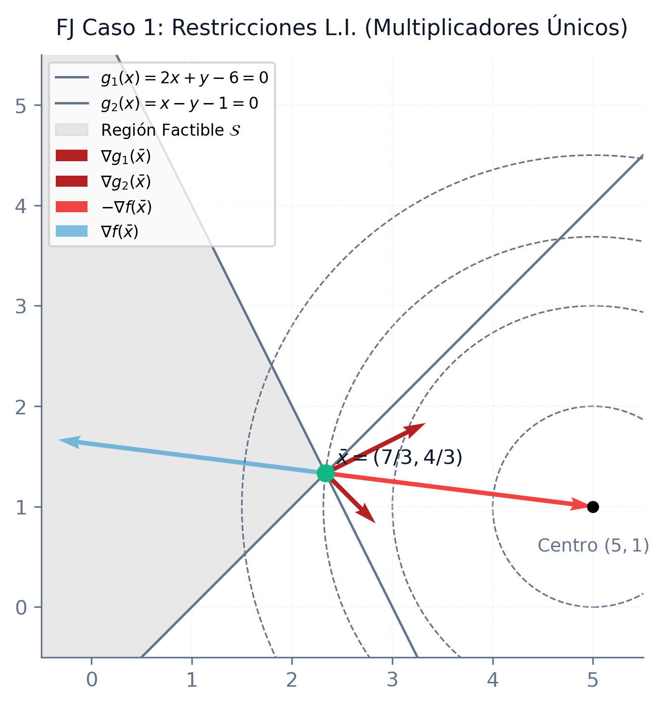{fig-align="center" width="100%"}
:::
:::

---

## Caso 2: Restricción redundante

::: {.columns}
::: {.column width="55%"}

*   **Problema**: Añadimos la restricción redundante $g_3(x, y) = x \le 7/3$ con gradiente $\nabla g_3 = (1,0)^T$.

*   **Gradientes activos**: Son linealmente dependientes.

*   **Ecuación dual**: Admite infinitas combinaciones para $-\nabla f(\bar{x})$. Con $u_0 = 1$:
    $$
    \begin{aligned}
    u_1 \in [0, 14/9], \quad & u_2 = u_1 + 2/3 \\
    & u_3 = 14/3 - 3u_1
    \end{aligned}
    $$
    Se pierde la unicidad de multiplicadores.
:::

::: {.column width="45%"}
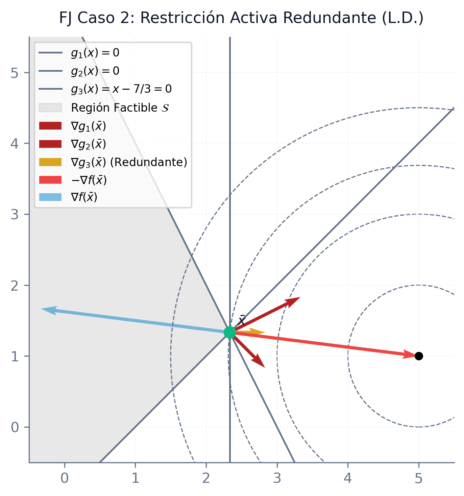{fig-align="center" width="100%"}
:::
:::

---

## Caso 3: Singularidad ($u_0 = 0$)

::: {.columns}
::: {.column width="55%"}

*   **Problema**: Añadimos la restricción opuesta $g_3(x, y) = -x \le -7/3$ con $\nabla g_3 = (-1,0)^T$.

*   **Geometría**: Los tres gradientes activos impiden direcciones factibles ($\mathcal{G}_0 = \emptyset$).

*   **Ecuación dual**: Se anula sin intervención de la función objetivo:
    $$ u_1 \begin{pmatrix} 2 \\ 1 \end{pmatrix} + u_2 \begin{pmatrix} 1 \\ -1 \end{pmatrix} + u_3 \begin{pmatrix} -1 \\ 0 \end{pmatrix} = \begin{pmatrix} 0 \\ 0 \end{pmatrix} $$

*   **Solución**: $u_0 = 0$, $u_1 = 1$, $u_2 = 1$, $u_3 = 3$. Las condiciones se cumplen de forma trivial.
:::

::: {.column width="45%"}
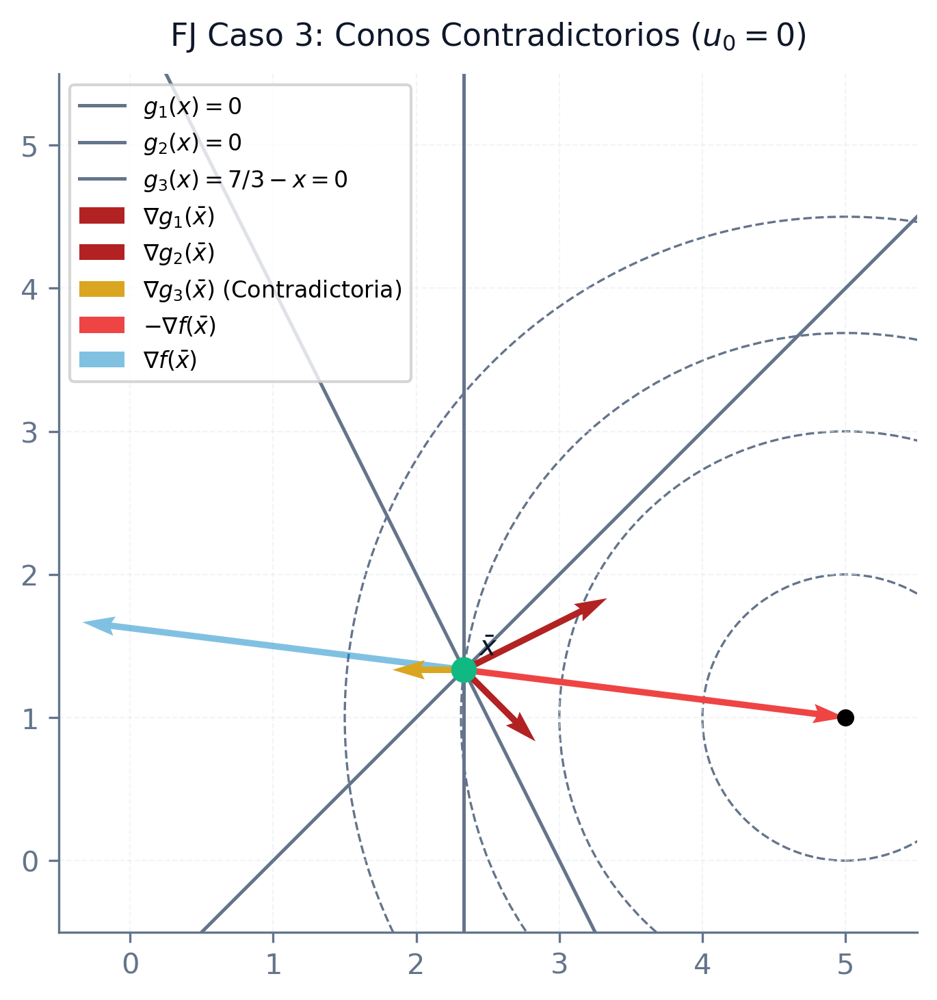{fig-align="center" width="100%"}
:::
:::

---

## Caso 4: Máximo local

::: {.columns}
::: {.column width="55%"}

*   **Problema**: Minimizar $f(x, y) = -(x-5)^2-(y-1)^2$ (maximizar la distancia).

*   **Gradiente**: $-\nabla f(\bar{x}) = (-16/3, 2/3)^T$, apunta hacia fuera del cono factible.

*   **Ecuación dual**: Al intentar resolver para $u_0 > 0$, los multiplicadores resultan negativos:
    $$ u_1 = -\frac{14}{9}u_0 < 0 $$

*   **Conclusión**: Las condiciones FJ descartan correctamente este candidato a mínimo local.
:::

::: {.column width="45%"}
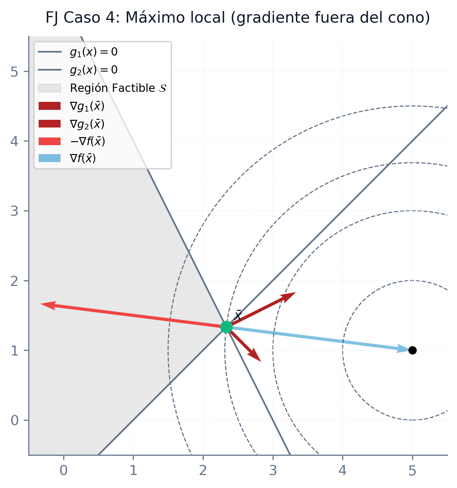{fig-align="center" width="100%"}
:::
:::

---

## Clasificación de candidatos duales

El formalismo de Fritz-John permite clasificar los puntos candidatos en tres familias según su geometría:

*   **Puntos de tangencia regular**: El gradiente de la función objetivo $\nabla f(\bar{x})$ y el de la restricción activa $\nabla g_i(\bar{x})$ son colineales y opuestos ($u_0 > 0$). El objetivo determina la optimalidad.

*   **Vértices o puntos de esquina**: Varias restricciones activas linealmente independientes bloquean cualquier dirección factible.

*   **Puntos singulares o de cúspide**: La frontera es tan restrictiva que la cualificación de restricciones falla (los gradientes activos son linealmente dependientes), permitiendo $u_0 = 0$.

---

## Vulnerabilidad y redundancia en FJ

El hecho de que las singularidades permitan $u_0 = 0$ limita la utilidad del teorema en ciertos problemas. En puntos singulares, el gradiente de la función que deseamos minimizar no influye en las ecuaciones de optimalidad (insensibilidad).

::: {.callout-warning title="Vulnerabilidad por redundancia trivial"}
Siempre se puede transformar artificialmente cualquier punto factible en un candidato Fritz-John con $u_0 = 0$ añadiendo una restricción redundante inútil como $\|x - \bar{x}\| \ge 0$, cuyo gradiente nulo anula el cono algebraico $\mathcal{G}_0$.
:::

---

## Ejemplo: Fallo de FJ (Planteamiento)

::: {.columns}
::: {.column width="55%"}

Consideremos el problema singular:
$$
\begin{aligned}
\min_{x} \quad & -x_1 \\
\text{sujeto a} \quad & g_1(x_1, x_2) = x_2 - (1 - x_1)^3 \le 0 \\
& g_2(x_1, x_2) = -x_2 \le 0
\end{aligned}
$$

*   **Óptimo**: $\bar{x} = (1, 0)$, ambas restricciones activas ($\mathcal{I} = \{1, 2\}$).

*   **Gradientes**:
    $$ \nabla f(\bar{x}) = \begin{pmatrix} -1 \\ 0 \end{pmatrix}, \quad \nabla g_1(\bar{x}) = \begin{pmatrix} 0 \\ 1 \end{pmatrix} $$
    $$ \nabla g_2(\bar{x}) = \begin{pmatrix} 0 \\ -1 \end{pmatrix} $$
:::

::: {.column width="45%"}
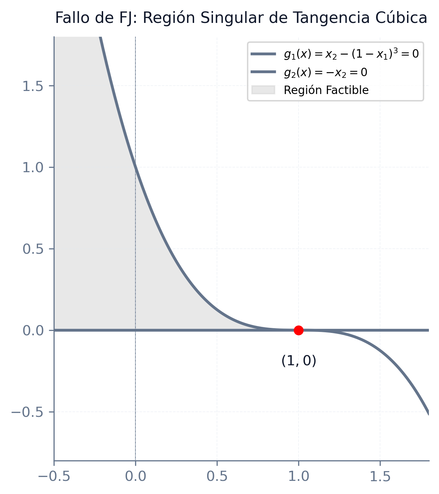{fig-align="center" width="100%"}
:::
:::

---

## Ejemplo: Fallo de FJ (Análisis Dual)

::: {.columns}
::: {.column width="55%"}

*   **Ecuación de Fritz-John**:
    $$ u_0 \begin{pmatrix} -1 \\ 0 \end{pmatrix} + u_1 \begin{pmatrix} 0 \\ 1 \end{pmatrix} + u_2 \begin{pmatrix} 0 \\ -1 \end{pmatrix} = \begin{pmatrix} 0 \\ 0 \end{pmatrix} $$

*   **Sistema de ecuaciones**:
    $$ -u_0 = 0 \implies u_0 = 0 $$
    $$ u_1 - u_2 = 0 \implies u_1 = u_2 = \alpha > 0 $$

*   **Resultado**: El multiplicador del objetivo se anula obligatoriamente ($u_0 = 0$). El objetivo no influye en las ecuaciones debido a la tangencia cúbica.
:::

::: {.column width="45%"}
{fig-align="center" width="100%"}
:::
:::

---

## Ejemplo: FJ Regular (Planteamiento)

::: {.columns}
::: {.column width="55%"}

Sustituimos la restricción cúbica singular por una restricción lineal equivalente:
$$
\begin{aligned}
\min \quad & -x_1 \\
\text{s.a.} \quad & g_1(x_1, x_2) = x_1 + x_2 - 1 \le 0 \\
& g_2(x_1, x_2) = -x_2 \le 0
\end{aligned}
$$

*   **Óptimo**: $\bar{x} = (1, 0)$, ambas activas ($\mathcal{I} = \{1, 2\}$).

*   **Gradientes**:
    $$ \nabla f(\bar{x}) = \begin{pmatrix} -1 \\ 0 \end{pmatrix}, \quad \nabla g_1(\bar{x}) = \begin{pmatrix} 1 \\ 1 \end{pmatrix} $$
    $$ \nabla g_2(\bar{x}) = \begin{pmatrix} 0 \\ -1 \end{pmatrix} $$
:::

::: {.column width="45%"}
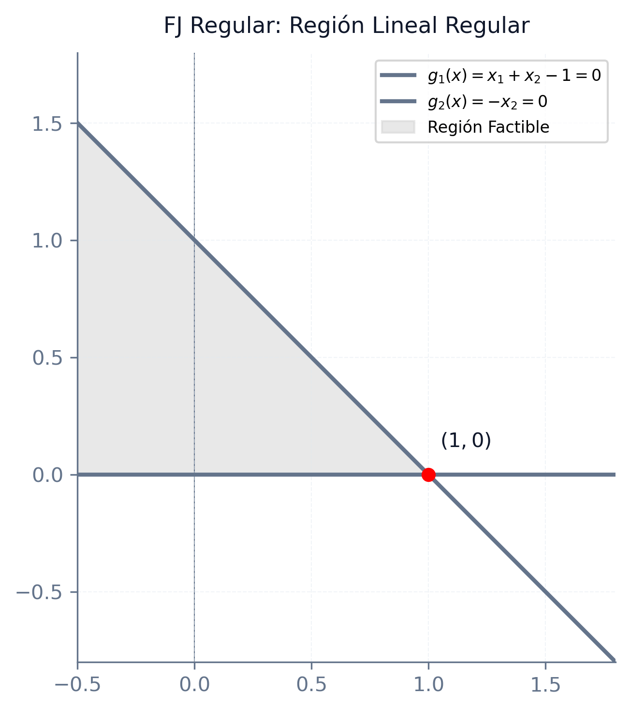{fig-align="center" width="100%"}
:::
:::

---

## Ejemplo: FJ Regular (Análisis Dual)

::: {.columns}
::: {.column width="55%"}

*   **Ecuación de Fritz-John**:
    $$ u_0 \begin{pmatrix} -1 \\ 0 \end{pmatrix} + u_1 \begin{pmatrix} 1 \\ 1 \end{pmatrix} + u_2 \begin{pmatrix} 0 \\ -1 \end{pmatrix} = \begin{pmatrix} 0 \\ 0 \end{pmatrix} $$

*   **Sistema de ecuaciones**:
    $$ -u_0 + u_1 = 0 \implies u_1 = u_0 $$
    $$ u_1 - u_2 = 0 \implies u_2 = u_1 $$

*   **Resultado**: Obtenemos $u_1 = u_2 = u_0$. Fijando $u_0 = 1$, la solución es $u_1 = u_2 = 1 > 0$. El objetivo influye activamente.
:::

::: {.column width="45%"}
{fig-align="center" width="100%"}
:::
:::

---
## Escenarios de vulnerabilidad dual en FJ

Existen tres escenarios habituales de multiplicadores triviales o insensibilidad respecto al objetivo en Fritz-John:

1.  **Estacionariedad simultánea**: Coincide un mínimo local libre con tangencia de restricciones ($\nabla f(\bar{x}) = 0$ y $\nabla g_i(\bar{x}) = 0$ para algún activo).

2.  **Desdoblamiento de restricciones de igualdad**: Reescribir $h(x) = 0$ como $h(x) \le 0$ y $-h(x) \le 0$ introduce gradientes opuestos que se anulan con $u_0 = 0$, anulando el objetivo.

3.  **Redundancia trivial en la frontera**: Añadir $\|x - \bar{x}\| \ge 0$ introduce un gradiente nulo en la frontera, forzando a que $u_0 = 0$.

# Condiciones de Karush-Kuhn-Tucker (KKT)

## Introducción a las Condiciones KKT

*   **Limitación de Fritz-John**: Cuando el multiplicador del objetivo es nulo ($u_0 = 0$), el gradiente de la función objetivo no influye en las ecuaciones duales de optimalidad.
*   **Cualificación de restricciones**: Para garantizar que $u_0 > 0$ y poder omitir dicho coeficiente, Kuhn, Tucker (1951) y Karush (1939) introdujeron hipótesis de regularidad en el punto candidato.
*   **Independencia Lineal (LICQ)**: La cualificación de restricciones más importante, que exige que los gradientes de las restricciones activas en el óptimo sean linealmente independientes.

---

## Cualificación de restricciones: LICQ

::: {.callout-important title="Independencia lineal de restricciones activas (LICQ)"}
Un punto factible $\bar{x}$ satisface la condición de regularidad LICQ si el conjunto de vectores gradiente de las restricciones activas en dicho punto:
$$ \{\nabla g_i(\bar{x}), \quad i \in \mathcal{I}(\bar{x})\} $$
es linealmente independiente.
:::

*   **Efecto dual**: Garantiza que no hay contradicciones ni redundancias críticas en la frontera factible, permitiendo la existencia y unicidad de los multiplicadores de Lagrange ordinarios.

---

## Condiciones necesarias de KKT

::: {.callout-important title="Condiciones necesarias de karush-kuhn-tucker (KKT)"}
Sea $\bar{x}$ un mínimo local del problema. Si $f$ y $g_i$ son diferenciables, las inactivas continuas en $\bar{x}$, y se satisface la condición de regularidad **LICQ** en $\bar{x}$:

Entonces, existen multiplicadores únicos $u_1, u_2, \dots, u_m$ tales que:

1.  **Factibilidad primal**: $g_i(\bar{x}) \le 0, \quad \forall i = 1, \dots, m$
2.  **Estacionariedad**: $\nabla f(\bar{x}) + \sum_{i=1}^m u_i \nabla g_i(\bar{x}) = 0$
3.  **Holgura complementaria**: $u_i g_i(\bar{x}) = 0, \quad \forall i = 1, \dots, m$
4.  **No negatividad**: $u_i \ge 0, \quad \forall i = 1, \dots, m$
:::

---

## Interpretación geométrica de KKT

::: {.columns}
::: {.column width="55%"}

*   **Equilibrio de fuerzas**: El gradiente opuesto de la función objetivo $-\nabla f(\bar{x})$ debe ser una combinación lineal no negativa de los gradientes de las restricciones activas.
*   **Exclusión de descenso**: Esto equivale a decir que el gradiente opuesto pertenece al cono dual de restricciones activas $\mathcal{G}_0^*(\bar{x})$.
*   **Cierre del cono**: Garantiza que no existe ninguna dirección factible que sea a la vez de descenso.

:::

::: {.column width="45%"}
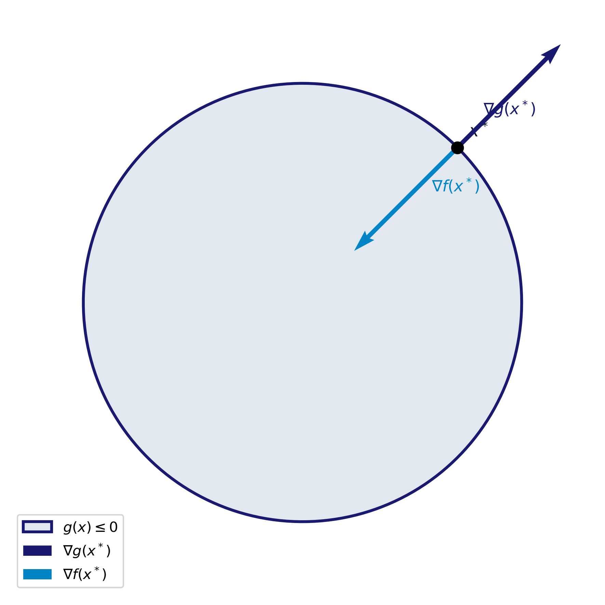{fig-align="center" width="100%"}
:::
:::

---

## Advertencia: Condiciones únicamente necesarias

::: {.callout-warning title="Las condiciones KKT son únicamente necesarias"}
Las condiciones KKT son únicamente **necesarias** en problemas generales. No se aplican a todos los puntos, sino que excluyen a aquellos que violan la cualificación de restricciones (LICQ).

Existe la posibilidad de que el óptimo global del problema se encuentre precisamente entre los puntos excluidos (por ejemplo, en un punto singular de la frontera donde los gradientes de las restricciones activas sean linealmente dependientes). En cualquier resolución analítica, estos puntos singulares deben analizarse de manera independiente.
:::

*   Para **problemas lineales**, las condiciones KKT sí resultan ser necesarias y suficientes.

---

## Observación: Extensión a máximos locales

::: {.callout-note title="Observación: Extensión a máximos locales"}
Si el punto $\bar{x}$ es un máximo local, entonces las condiciones necesarias de KKT siguen siendo válidas sin más que exigir que los multiplicadores de Lagrange sean no positivos:
$$ u_i \le 0, \quad \forall i = 1, \dots, m $$
:::

*   El gradiente del objetivo $-\nabla f(\bar{x})$ apuntará en la dirección de la normal exterior de la frontera en lugar de hacia dentro de la región factible.

---

## Condiciones suficientes KKT bajo Convexidad

::: {.callout-important title="Condiciones suficientes de KKT bajo convexidad"}
Sea $\bar{x}$ un punto factible que satisface las condiciones necesarias de KKT con multiplicadores $u_i$. Si se verifica que:

1.  La función objetivo $f(x)$ es **pseudo-convexa** en $\bar{x}$.
2.  Las restricciones activas $g_i(x)$ ($i \in \mathcal{I}$) son **cuasi-convexas** y diferenciables en $\bar{x}$.

Entonces, $\bar{x}$ es un **mínimo global** del problema.
:::

*   **Unicidad**: Si $f$ es estrictamente pseudo-convexa, el mínimo global $\bar{x}$ es único.

---

## Observación sobre suficiencia local y unicidad

::: {.callout-note title="Observación sobre suficiencia local y unicidad"}
*   **Suficiencia local**: Si las condiciones de pseudo-convexidad, cuasi-convexidad y diferenciabilidad se verifican sólo localmente en un entorno de $\bar{x}$, entonces el candidato será un mínimo local.
*   **Máximos globales**: Si el punto es un máximo local, para garantizar que sea máximo global hay que exigir que la función objetivo $f$ sea **pseudo-cóncava** (o $-f$ sea pseudo-convexa).
*   **Unicidad**: Si la función objetivo es estrictamente pseudo-convexa, el punto mínimo global $\bar{x}$ es único.
:::

---

## Ejemplo 1: Caso de KKT con círculo y parábola (Planteamiento)

::: {.columns}
::: {.column width="55%"}

*   **Problema de estudio**:
    $$ \min/\max \quad f(x_1, x_2) = x_1 + x_2 $$
    $$ \text{s.a.} \quad g_1(x) = x_1^2 + x_2^2 - 4 \le 0 $$
    $$ g_2(x) = -x_1^2 + x_2 \le 0 $$
*   **Gradientes**:
    $\nabla f = (1, 1)^T$
    $\nabla g_1 = (2x_1, 2x_2)^T$
    $\nabla g_2 = (-2x_1, 1)^T$
*   **Dominio**: Región sombreada acotada por el círculo y la parábola.

:::

::: {.column width="45%"}
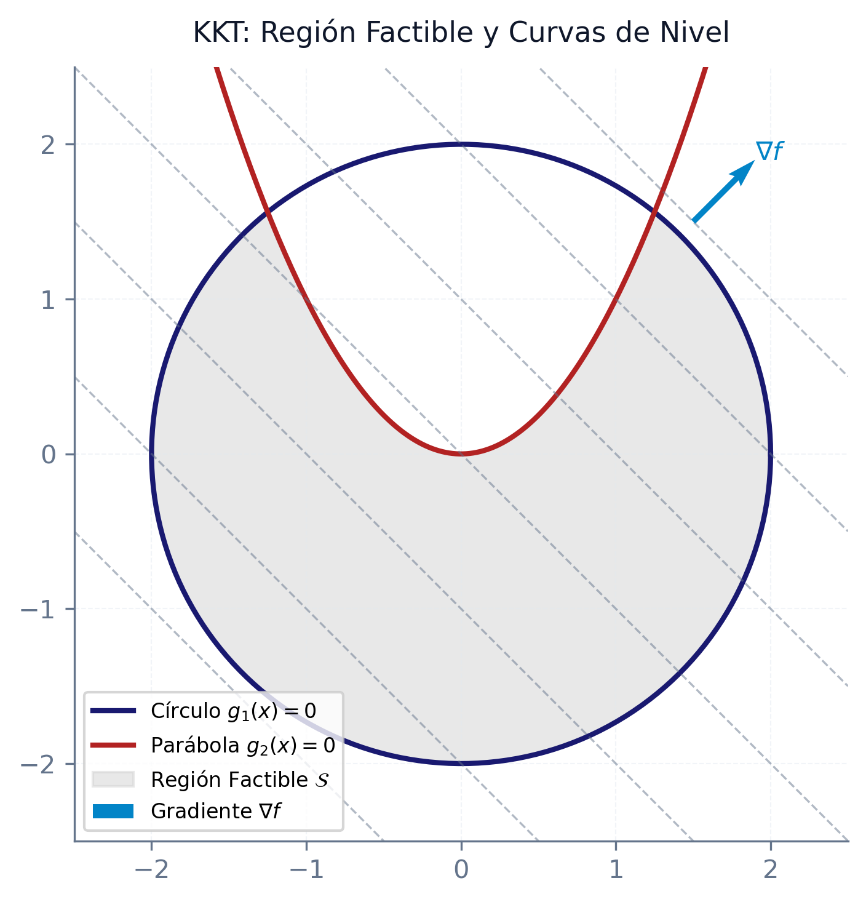{fig-align="center" width="100%"}
:::
:::

---

## Ejemplo 1: Caso de KKT con círculo y parábola (Sistema KKT)

::: {.columns}
::: {.column width="55%"}

*   **Función Lagrangiana**:
    $$ L(x, u) = x_1+x_2 + u_1(x_1^2+x_2^2-4) + u_2(-x_1^2+x_2) $$
*   **Condiciones algebraicas**:
    1.  **Estacionariedad**:
        $$ 1 + 2x_1(u_1 - u_2) = 0 $$
        $$ 1 + 2x_2 u_1 + u_2 = 0 $$
    2.  **Holgura**: $u_1 g_1(x) = 0$, $u_2 g_2(x) = 0$.
    3.  **Signo**: $u_i \ge 0$ (mínimos), $u_i \le 0$ (máximos).

:::

::: {.column width="45%"}
{fig-align="center" width="100%"}
:::
:::

---

## Ejemplo 1: Caso 1 – Círculo inactivo ($u_1 = 0$)

::: {.columns}
::: {.column width="55%"}

*   **Condición**: $u_1 = 0 \implies u_2 \neq 0$ ($g_2$ es activa, $x_2 = x_1^2$).
*   **Estacionariedad**:
    $1 - 2u_2 x_1 = 0$ y $1 + u_2 = 0 \implies u_2 = -1$.
*   **Coordenadas**:
    $1 - 2(-1)x_1 = 0 \implies x_1 = -1/2$.
    $x_2 = x_1^2 = 1/4$.
*   **Candidato**:
    $A(-1/2, 1/4)^T$ con $u = (0, -1)^T$.

:::

::: {.column width="45%"}
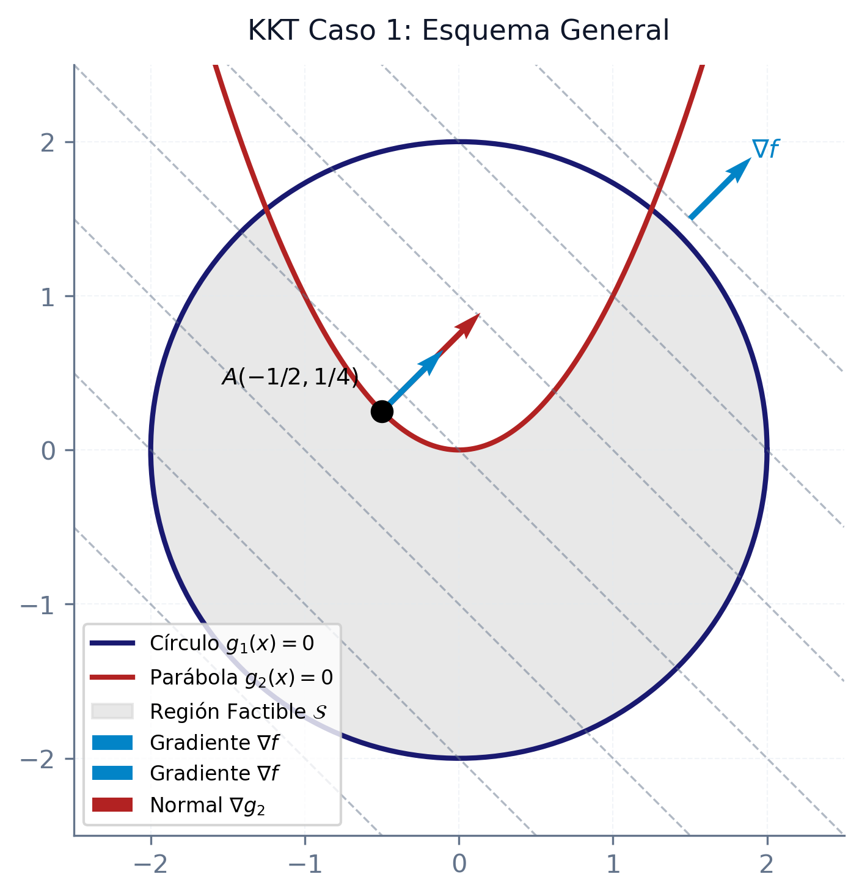{fig-align="center" width="100%"}
:::
:::

---

## Ejemplo 1: Caso 1 – Análisis de $A(-1/2, 1/4)^T$

::: {.columns}
::: {.column width="55%"}

*   **Multiplicador**: $u_2 = -1 < 0$.
    *   Para mínimos ($u_i \ge 0$), se descarta.
    *   Para máximos ($u_i \le 0$), es candidato a máximo local.
*   **Factibilidad primal**:
    $g_1(A) = 1/4 + 1/16 - 4 = -59/16 < 0$ (factible).
*   **Segundo orden**: Sobre la parábola activa, la función es $f(t, t^2) = t+t^2$, que presenta un mínimo local en $t = -0.5$.
*   **Conclusión**: El punto $A$ **no es un máximo local** (punto de ensilladura restringida).

:::

::: {.column width="45%"}
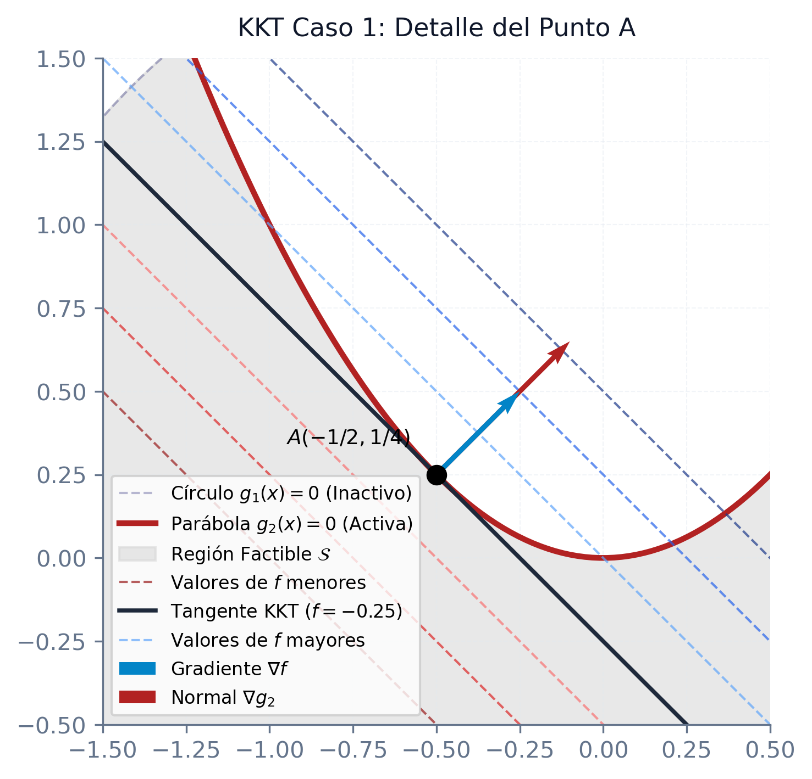{fig-align="center" width="100%"}
:::
:::

---

## Ejemplo 1: Caso 2 – Parábola inactiva ($u_2 = 0$)

::: {.columns}
::: {.column width="55%"}

*   **Condición**: $u_2 = 0 \implies u_1 \neq 0$ ($g_1$ es activa, $x_1^2+x_2^2=4$).
*   **Estacionariedad**:
    $1 + 2u_1 x_1 = 0$ y $1 + 2u_1 x_2 = 0 \implies x_1 = x_2 = -1/(2u_1)$.
*   **Coordenadas**:
    $2x_1^2 = 4 \implies x_1 = \pm\sqrt{2}$.
*   **Puntos de estudio**:
    $B(-\sqrt{2}, -\sqrt{2})^T$ y $C(\sqrt{2}, \sqrt{2})^T$.

:::

::: {.column width="45%"}
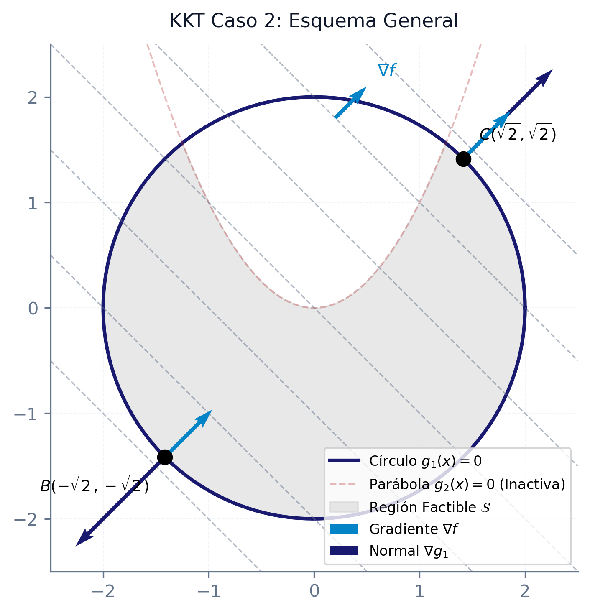{fig-align="center" width="100%"}
:::
:::

---

## Ejemplo 1: Caso 2 – Análisis de $B(-\sqrt{2}, -\sqrt{2})^T$

::: {.columns}
::: {.column width="55%"}

*   **Multiplicador**:
    $u_1 = \frac{1}{2\sqrt{2}} > 0 \implies$ candidato a **mínimo**.
*   **Factibilidad primal**:
    $g_2(B) = -(-\sqrt{2})^2 - \sqrt{2} = -2 - \sqrt{2} < 0$ (factible).
*   **Resultado**: El punto $B(-\sqrt{2}, -\sqrt{2})^T$ es un candidato KKT válido para mínimo global.
*   **Interpretación**: Los gradientes se oponen perfectamente con multiplicador positivo.

:::

::: {.column width="45%"}
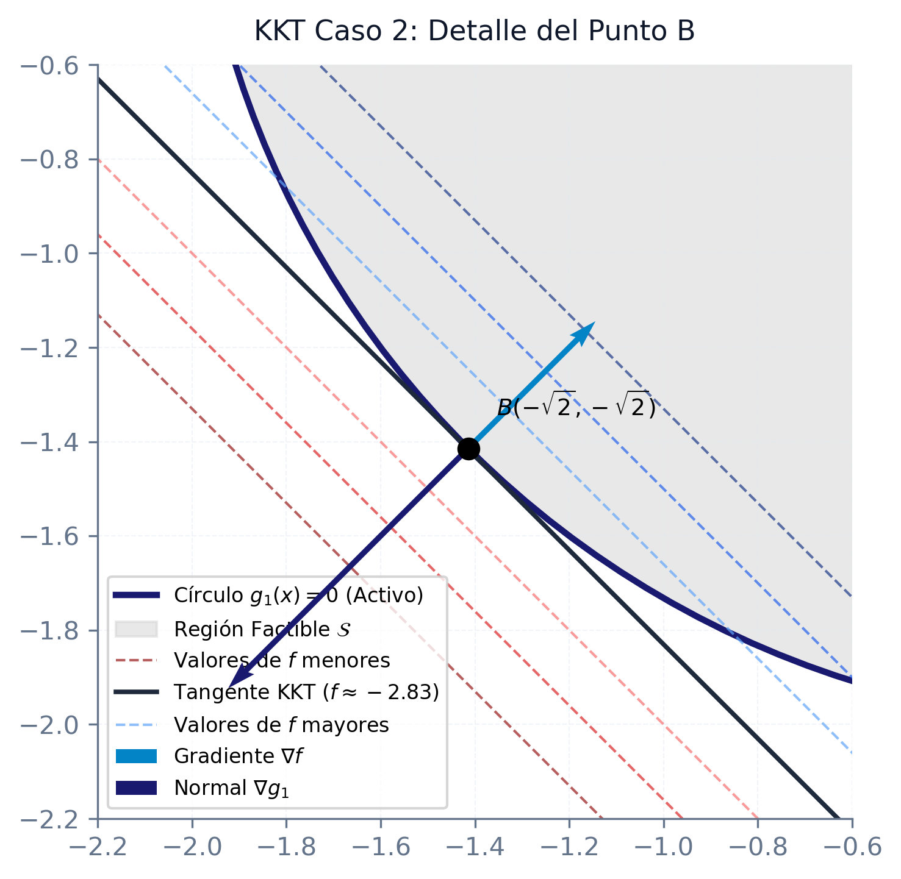{fig-align="center" width="100%"}
:::
:::

---

## Ejemplo 1: Caso 2 – Análisis de $C(\sqrt{2}, \sqrt{2})^T$

::: {.columns}
::: {.column width="55%"}

*   **Multiplicador**:
    $u_1 = -\frac{1}{2\sqrt{2}} < 0 \implies$ candidato a **máximo**.
*   **Factibilidad primal**:
    $g_2(C) = -2 + \sqrt{2} \approx -0.59 < 0$ (factible).
*   **Resultado**: El punto $C(\sqrt{2}, \sqrt{2})^T$ es un candidato KKT válido para máximo global.
*   **Interpretación**: Los gradientes apuntan en el mismo sentido con multiplicador negativo.

:::

::: {.column width="45%"}
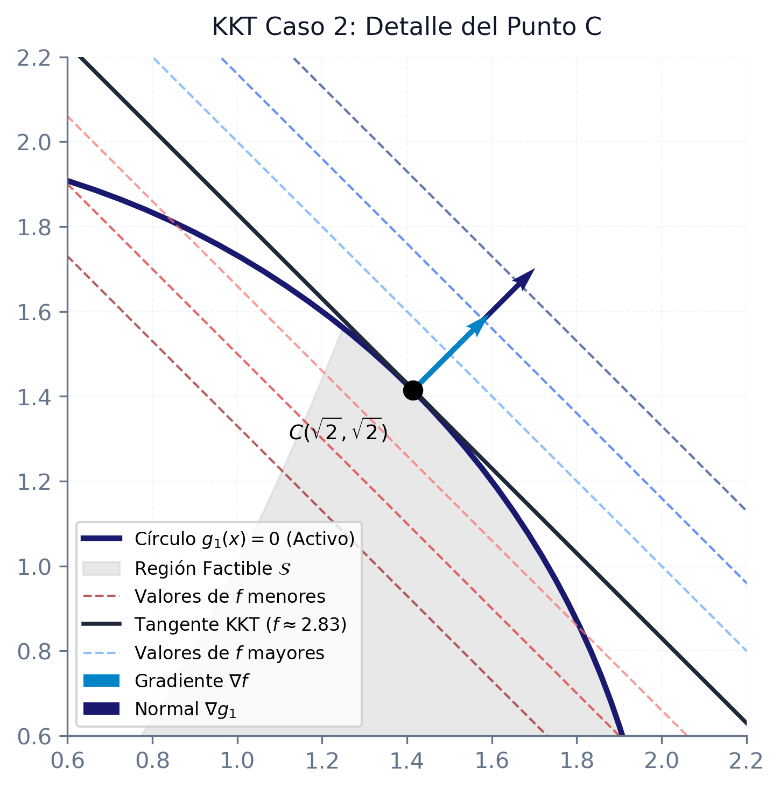{fig-align="center" width="100%"}
:::
:::

---

## Ejemplo 1: Caso 3 – Ambas restricciones activas

::: {.columns}
::: {.column width="55%"}

*   **Condición**: $g_1(x) = 0$ y $g_2(x) = 0$.
*   **Intersección**:
    $x_1^2 + x_2^2 = 4$ y $x_2 = x_1^2 \implies x_1^4 + x_1^2 - 4 = 0$.
    $x_1^2 = \frac{-1 + \sqrt{17}}{2} \approx 1.56 \implies x_1 \approx \pm 1.25$.
    $x_2 \approx 1.56$.
*   **Puntos de cruce**:
    $E(1.25, 1.56)^T$ y $D(-1.25, 1.56)^T$.

:::

::: {.column width="45%"}
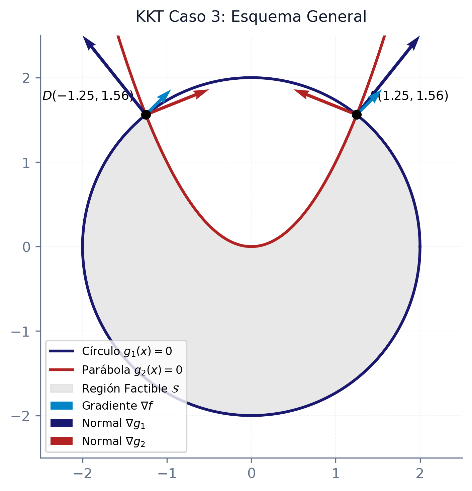{fig-align="center" width="100%"}
:::
:::

---

## Ejemplo 1: Caso 3 – Análisis de $E$ y $D$

::: {.columns}
::: {.column width="55%"}

*   **Punto $E(1.25, 1.56)^T$**:
    $u_1 \approx -0.34 < 0$ y $u_2 \approx 0.06 > 0$.
    *   Signos opuestos: se descarta.
*   **Punto $D(-1.25, 1.56)^T$**:
    $u_1 \approx -0.15 < 0$ y $u_2 \approx -0.55 < 0$.
    *   Ambos negativos: candidato a **máximo local**.
*   **Comparación**: $f(D) \approx 0.31$, menor que $f(C) \approx 2.83$ (máximo global).

:::

::: {.column width="45%"}
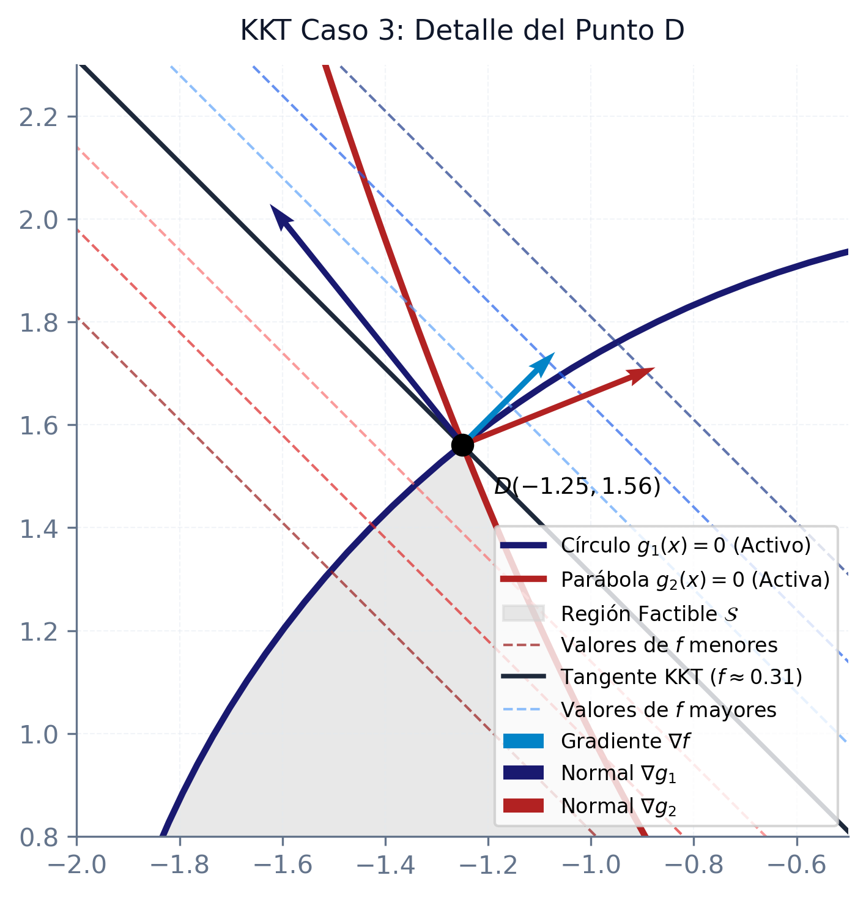{fig-align="center" width="100%"}
:::
:::

---

## Ejemplo 1: Caracterización y Conclusión

::: {.columns}
::: {.column width="55%"}

*   **Mínimo global**:
    $B(-\sqrt{2}, -\sqrt{2})^T$ con $f(B) \approx -2.83$.
*   **Máximo global**:
    $C(\sqrt{2}, \sqrt{2})^T$ con $f(C) \approx 2.83$.
*   **Máximo local**:
    $D(-1.25, 1.56)^T$ con $f(D) \approx 0.31$.
*   **Verificación suficiente**:
    *   $f$ es lineal (convexa/cóncava).
    *   $g_1$ es estrictamente convexa ($H_1 > 0$).
    *   $g_2$ es cóncava ($H_2 \le 0$). Falla suficiencia en $D$ (pero es máximo gráfico).

:::

::: {.column width="45%"}
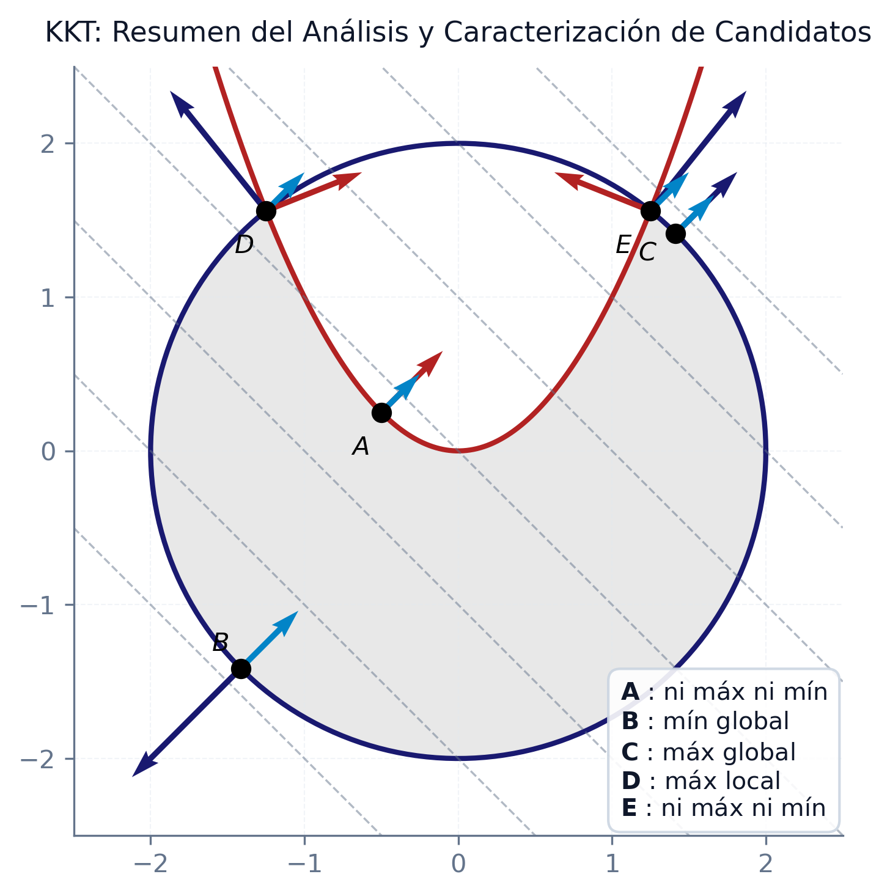{fig-align="center" width="100%"}
:::
:::

---

## Esquema general de resolución KKT (Pasos 1-2)

::: {.callout-note title="Esquema general de resolución KKT"}
1.  **Lagrangiana**: $L(x, u) = f(x) + \sum_{i=1}^m u_i g_i(x)$
2.  **Sistema KKT** a resolver (estacionariedad y condiciones de optimalidad):
    *   **Estacionariedad**: $\nabla_x L(x, u) = 0 \implies \frac{\partial L}{\partial x_j} = 0, \forall j = 1, \dots, n$
    *   **Factibilidad primal**: $g_i(x) \le 0, \forall i = 1, \dots, m$
    *   **Holgura complementaria**: $u_i g_i(x) = 0, \forall i = 1, \dots, m$
    *   **No negatividad**: $u_i \ge 0, \forall i = 1, \dots, m$ (para mínimos)
:::

---

## Esquema general de resolución KKT (Paso 3)

::: {.callout-note title="Esquema general de resolución KKT (análisis de casos)"}
3.  **Análisis por casos combinatorios**:
    Para resolver el sistema, para cada restricción $i$ se evalúan las dos ramas posibles de la holgura complementaria:
    *   **Caso A (Restricción inactiva)**: $g_i(x) < 0 \implies u_i = 0$.
    *   **Caso B (Restricción activa)**: $g_i(x) = 0 \implies u_i \ge 0$.
:::

*   Esto da lugar a $2^m$ posibles combinaciones de restricciones activas e inactivas que deben analizarse algebraicamente de forma independiente.

---

## Esquema general de resolución KKT (Pasos 4-5)

::: {.callout-note title="Esquema general de resolución KKT (filtrado y suficiencia)"}
4.  **Descartar candidatos** que violen la factibilidad primal o que resulten en multiplicadores con signo incorrecto.
5.  **Comprobar la cualificación de restricciones (LICQ)** en los candidatos y aplicar las **condiciones suficientes por convexidad**.
:::

*   **Maximización**: Exigir que los multiplicadores sean no positivos ($u_i \le 0$, $\forall i = 1, \dots, m$).
*   **Fritz-John**: Distinguir los casos en los que $u_0 > 0$ (KKT ordinarios) y aquellos en los que $u_0 = 0$ (puntos Fritz-John singulares).

---

## Ejemplo 2: Múltiples restricciones (Planteamiento)

*   **Problema de estudio**:
    $$
    \begin{aligned}
    \min/\max \quad & f(x, y) = \left(x - \frac{9}{4}\right)^2 + (y - 2)^2 \\
    \text{s.a.} \quad & g_1(x, y) = -x + y^2 \le 0 \\
    & g_2(x, y) = x + y - 6 \le 0 \\
    & g_3(x, y) = -x \le 0, \quad g_4(x, y) = -y \le 0
    \end{aligned}
    $$
*   **Geometría**: Minimización o maximización de la distancia al punto $(2.25, 2)^T$ sobre un dominio delimitado por una parábola, una recta y los ejes de coordenadas.

---

## Ejemplo 2: Caso 1 – Todas las restricciones inactivas

::: {.columns}
::: {.column width="55%"}

*   **Condición**: $u_1 = u_2 = u_3 = u_4 = 0$.
*   **Estacionariedad**:
    $$ 2(x - 2.25) = 0 \implies x = 2.25 $$
    $$ 2(y - 2) = 0 \implies y = 2 $$
*   **Punto libre**: $(2.25, 2)^T$.
*   **Factibilidad primal**:
    $$ g_1(2.25, 2) = -2.25 + 4 = 1.75 > 0 \quad (\text{no factible}) $$
*   **Resultado**: Se descarta el punto.

:::

::: {.column width="45%"}
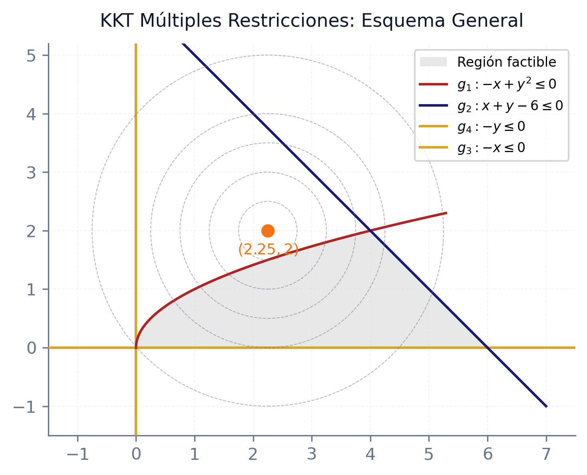{fig-align="center" width="100%"}
:::
:::

---

## Ejemplo 2: Caso 2 – Una única restricción activa ($g_1$)

::: {.columns}
::: {.column width="55%"}

*   **Condición**: $u_1 > 0$, $u_2 = u_3 = u_4 = 0$ ($g_1 = 0 \implies x = y^2$).
*   **Estacionariedad**:
    $u_1 = 2x - 4.5$ y $2y - 4 + 2y u_1 = 0 \implies 4y^3 - 7y - 4 = 0$.
*   **Coordenadas**: $y \approx 1.55 \implies x \approx 2.40$.
*   **Multiplicador**: $u_1 \approx 0.30 > 0$ (candidato a mínimo).
*   **Factibilidad primal**:
    $g_2(2.40, 1.55) = 2.40+1.55-6 = -2.05 \le 0$ (factible).
*   **Candidato**: $(2.40, 1.55)^T$.

:::

::: {.column width="45%"}
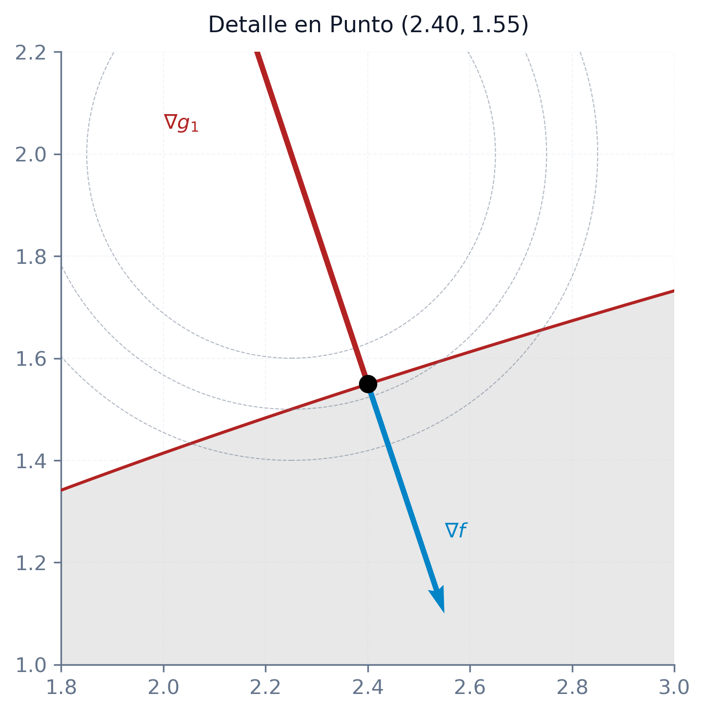{fig-align="center" width="100%"}
:::
:::

---

## Ejemplo 2: Caso 2 – Una única restricción activa ($g_2$ y $g_3$)

*   **Subcaso $g_2$ activa ($u_2 \neq 0, \ u_1=u_3=u_4=0$)**:
    *   Estacionariedad: $x = y + 0.25$ con $x+y=6 \implies y = 2.875, \ x = 3.125$.
    *   Multiplicador: $u_2 = -1.75 < 0$ (candidato a máximo).
    *   Factibilidad: $g_1(3.125, 2.875) \approx 5.14 > 0$ (**no factible**). Se descarta.
*   **Subcaso $g_3$ activa ($u_3 \neq 0, \ u_1=u_2=u_4=0$)**:
    *   Estacionariedad: $x = 0, \ y = 2$.
    *   Multiplicador: $u_3 = -4.50 < 0$ (candidato a máximo).
    *   Factibilidad: $g_1(0, 2) = 4 > 0$ (**no factible**). Se descarta.

---

## Ejemplo 2: Caso 2 – Una única restricción activa ($g_4$)

::: {.columns}
::: {.column width="55%"}

*   **Condición**: $u_4 > 0$, $u_1 = u_2 = u_3 = 0$ ($g_4 = -y = 0$).
*   **Coordenadas**: $y = 0 \implies x = 2.25$.
*   **Multiplicador**:
    $u_4 = -4 < 0$ (candidato a máximo).
*   **Factibilidad primal**:
    $g_1(2.25, 0) = -2.25 \le 0$ (factible).
    $g_2(2.25, 0) = 2.25 - 6 = -3.75 \le 0$ (factible).
*   **Candidato**: $(2.25, 0)^T$.

:::

::: {.column width="45%"}
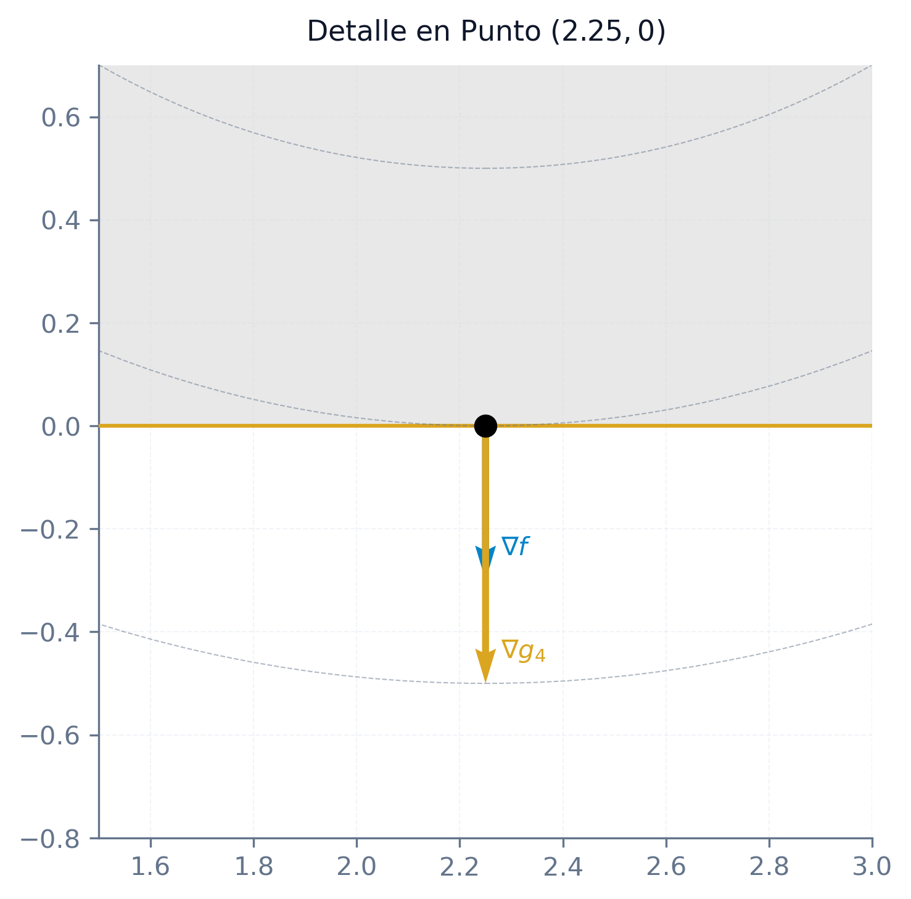{fig-align="center" width="100%"}
:::
:::

---

## Ejemplo 2: Caso 3 – Dos restricciones activas ($g_1, g_2$)

::: {.columns}
::: {.column width="55%"}

*   **Condición**: $u_1, u_2 \neq 0, \ u_3=u_4=0$.
*   **Intersección**: $x = y^2$ y $x+y=6 \implies y^2+y-6=0 \implies y=2, \ x=4$.
*   **Multiplicadores**:
    $$ 3.5 - u_1 + u_2 = 0 $$
    $$ 4u_1 + u_2 = 0 \implies u_1 = 0.70 > 0, \ u_2 = -2.80 < 0 $$
*   **Resultado**: Signos opuestos $\implies$ **se descarta** (no es candidato a mínimo ni a máximo).

:::

::: {.column width="45%"}
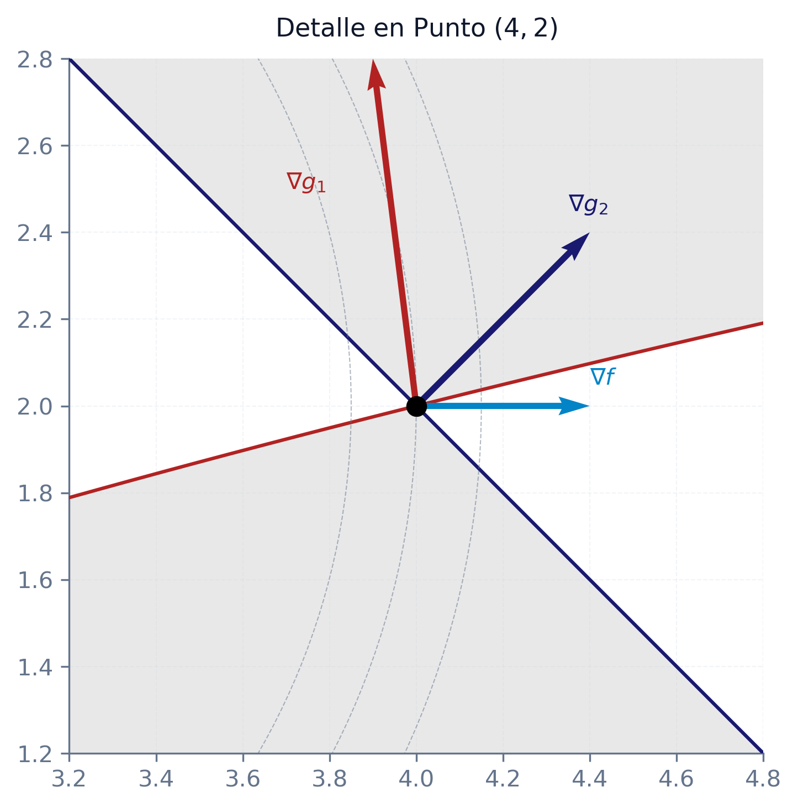{fig-align="center" width="100%"}
:::
:::

---

## Ejemplo 2: Caso 3 – Dos restricciones activas ($g_2, g_4$)

::: {.columns}
::: {.column width="55%"}

*   **Condición**: $u_2, u_4 > 0$, $u_1 = u_3 = 0$ ($x+y=6, \ y=0 \implies x=6$).
*   **Multiplicadores**:
    $u_2 = -7.50 < 0$ y $u_4 = -11.50 < 0$ (candidato a máximo).
*   **Factibilidad primal**:
    $g_1(6,0) = -6 \le 0$ (factible).
*   **Candidato**: $(6, 0)^T$.

:::

::: {.column width="45%"}
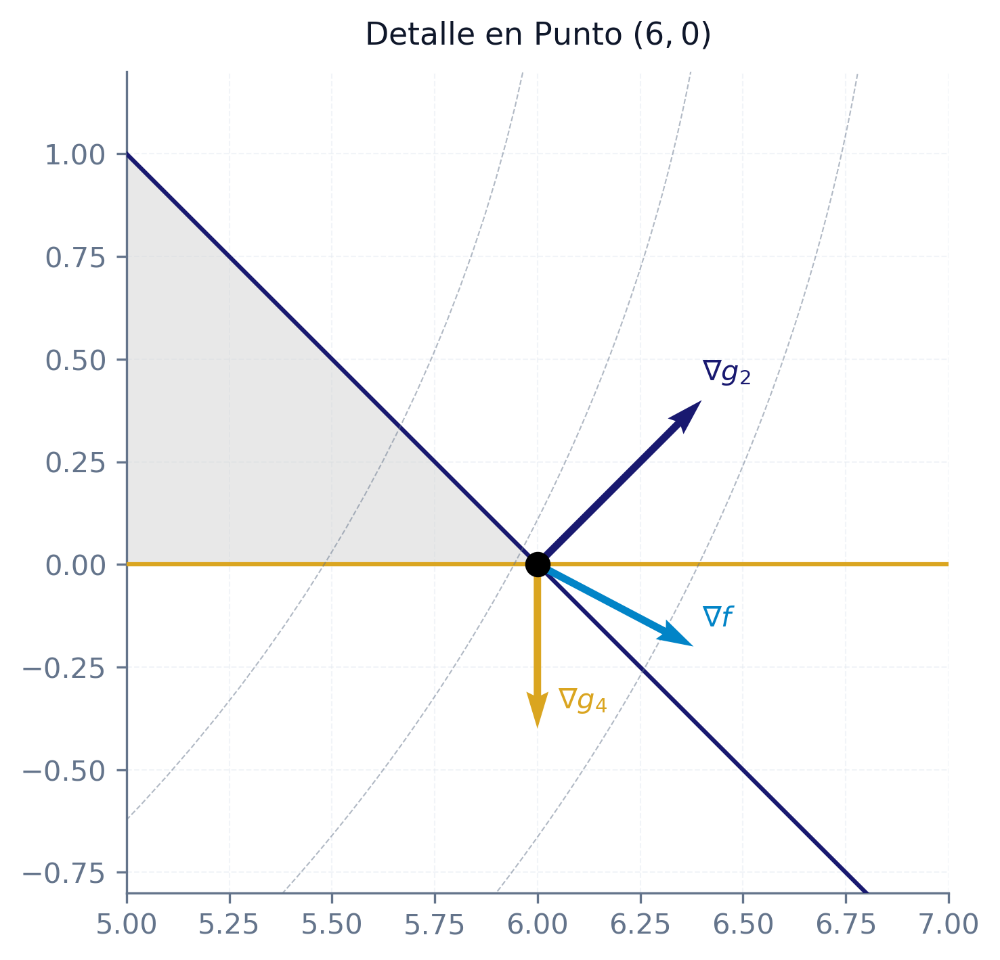{fig-align="center" width="100%"}
:::
:::

---

## Ejemplo 2: Caso 3 – Dos restricciones activas ($g_3, g_4$)

::: {.columns}
::: {.column width="55%"}

*   **Condición**: $u_3, u_4 \neq 0, \ u_1=u_2=0 \implies x = 0, \ y = 0$.
*   **Multiplicadores**:
    $u_3 = -4.50 < 0$ y $u_4 = -4.00 < 0$ (candidato a máximo).
*   **Fallo de LICQ**: En $(0,0)^T$ la restricción $g_1(0,0)=0$ también es activa. Los gradientes son dependientes.
*   **Resultado**: Punto singular Fritz-John con $u_0 = 0$, candidato a máximo local.

:::

::: {.column width="45%"}
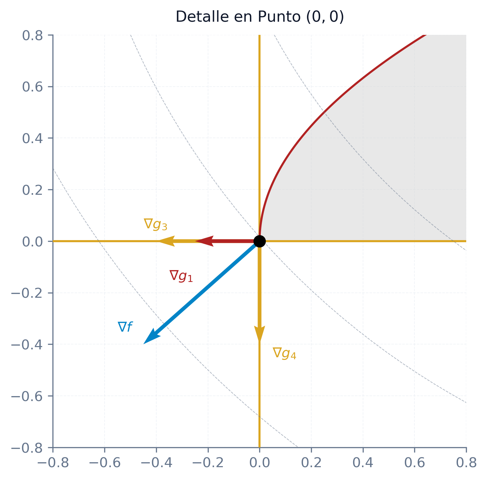{fig-align="center" width="100%"}
:::
:::

---

## Ejemplo 2: Conclusión y Comparación

::: {.columns}
::: {.column width="55%"}

*   **Mínimos**: El único candidato KKT es **$(2.40, 1.55)^T$** con $f(2.40, 1.55) \approx 0.22$. Al ser el objetivo estrictamente convexo, es el **mínimo global**.
*   **Máximos**: Evaluamos candidatos ($u_i \le 0$):
    - $(2.25, 0)^T \implies f(2.25, 0) = 4.00$
    - $(6, 0)^T \implies f(6, 0) = 18.06$ (**Máximo global**)
    - $(0, 0)^T \implies f(0, 0) = 9.06$ (Singular, máximo local)

:::

::: {.column width="45%"}
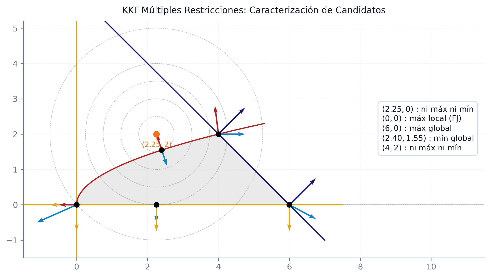{fig-align="center" width="100%"}
:::
:::

---

## Ejemplo 3: Restricción circular y lineal (Planteamiento)

::: {.columns}
::: {.column width="55%"}

*   **Problema de estudio**:
    $$ \min/\max \quad f(x, y) = 3x - y $$
    $$ \text{s.a.} \quad g_1(x, y) = x^2 + y^2 - 1 \le 0 $$
    $$ g_2(x, y) = -4x - y + 1 \le 0 $$
*   **Gradientes**:
    $\nabla f = (3, -1)^T$
    $\nabla g_1 = (2x, 2y)^T$
    $\nabla g_2 = (-4, -1)^T$
*   **Lagrangiana**:
    $$ L = 3x - y + u_1(x^2 + y^2 - 1) + u_2(-4x - y + 1) $$

:::

::: {.column width="45%"}
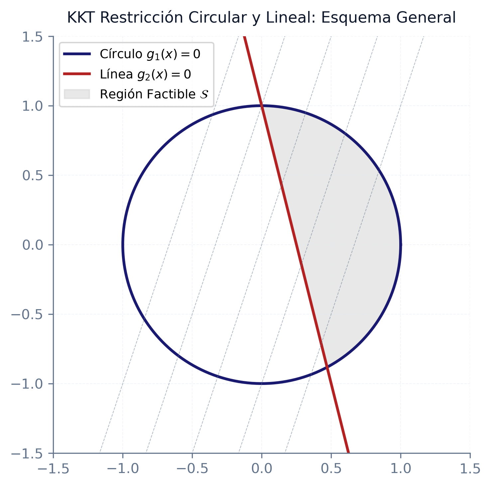{fig-align="center" width="100%"}
:::
:::

---

## Ejemplo 3: Caso 1 – Inactivas y Caso 2 ($g_1$ activa con $u_1 > 0$)

::: {.columns}
::: {.column width="55%"}

*   **Caso 1 (Inactivas)**: Contradicción $3=0$ y $-1=0$.
*   **Caso 2 ($g_1$ activa, $u_2=0$)**:
    $x = -3/(2u_1)$, $y = 1/(2u_1)$ con $x^2+y^2=1$.
    $$ \implies u_1 = \pm\sqrt{10}/2 \approx \pm 1.58 $$
*   **Si $u_1 \approx 1.58 > 0$ (mínimo)**:
    $x \approx -0.95$, $y \approx 0.32$.
*   **Factibilidad primal**:
    $g_2(x, y) \approx 4.48 > 0$ (no factible). Se descarta.

:::

::: {.column width="45%"}
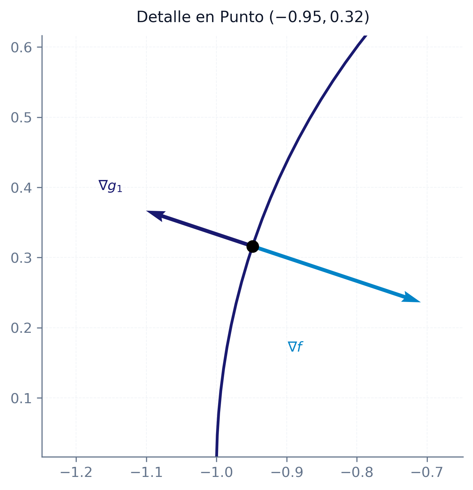{fig-align="center" width="100%"}
:::
:::

---

## Ejemplo 3: Caso 2 – Solo $g_1$ activa con $u_1 < 0$

::: {.columns}
::: {.column width="55%"}

*   **Si $u_1 \approx -1.58 < 0$ (máximo)**:
    $$ x = \frac{3}{\sqrt{10}} \approx 0.95, \quad y = -\frac{1}{\sqrt{10}} \approx -0.32 $$
*   **Factibilidad primal**:
    $g_2(x, y) \approx -2.48 \le 0$ (factible).
*   **Candidato a máximo**: $\left(\frac{3}{\sqrt{10}}, -\frac{1}{\sqrt{10}}\right)^T$ con $u = (-\sqrt{10}/2, 0)^T$.
*   *Subcaso $g_2$ activa, $u_1=0$*: Contradicción $u_2 = 0.75$ y $u_2 = -1$.

:::

::: {.column width="45%"}
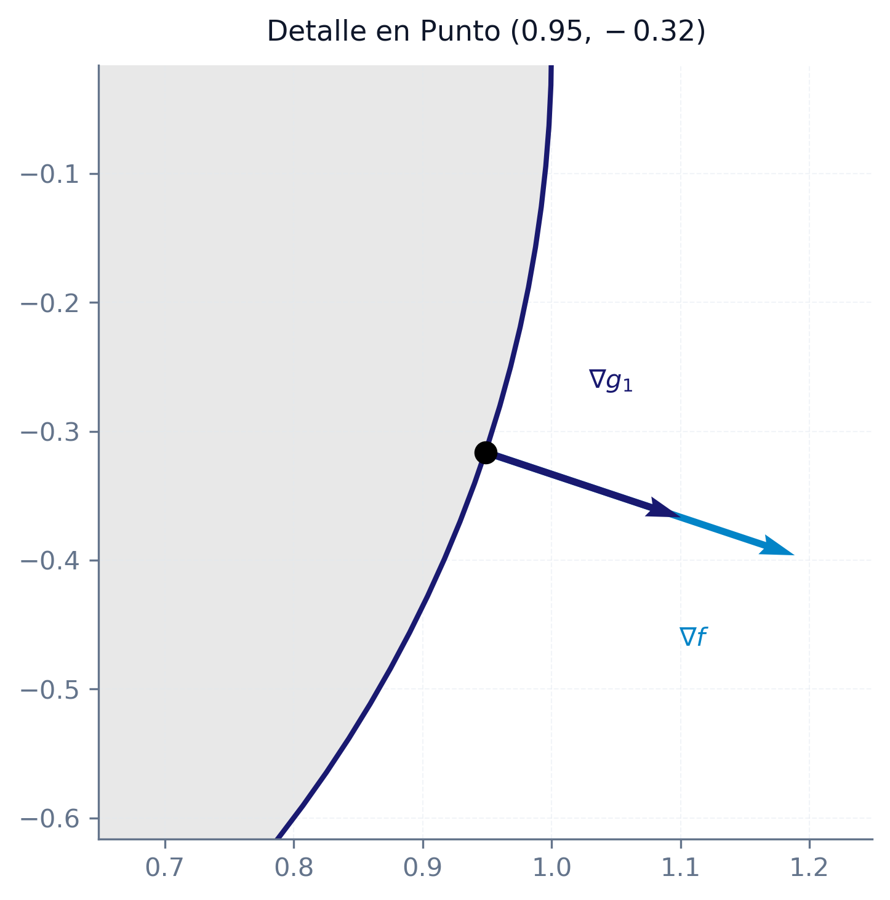{fig-align="center" width="100%"}
:::
:::

---

## Ejemplo 3: Caso 3 – Ambas restricciones activas (Intersección)

::: {.columns}
::: {.column width="55%"}

*   **Intersección**: $x^2+y^2=1$ y $-4x-y+1=0 \implies y=1-4x$.
    $$ \implies 17x^2-8x=0 \implies x=0 \ \text{ó} \ x=8/17 $$
*   **Punto $P_1(0,1)^T$**:
    $3 - 4u_2 = 0 \implies u_2 = 3/4 \ge 0$.
    $-1 + 2u_1 - u_2 = 0 \implies u_1 = 7/8 \ge 0$.
*   **Candidato a mínimo**: $P_1(0,1)^T$ con $u = (7/8, 3/4)^T$.

:::

::: {.column width="45%"}
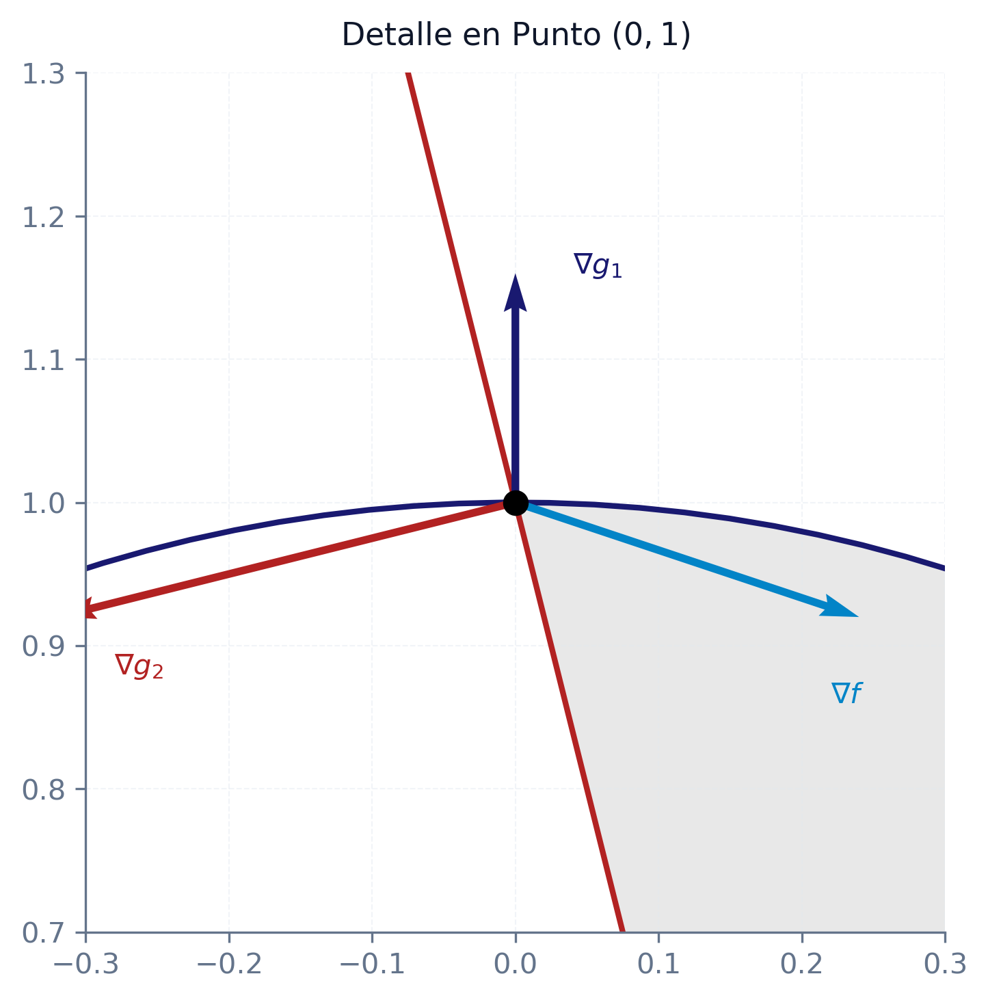{fig-align="center" width="100%"}
:::
:::

---

## Ejemplo 3: Caso 3 – Intersección (Punto $(8/17, -15/17)^T$)

::: {.columns}
::: {.column width="55%"}

*   **Punto $P_2(8/17, -15/17)^T$**:
    $3 + \frac{16}{17}u_1 - 4u_2 = 0$.
    $-1 - \frac{30}{17}u_1 - u_2 = 0$.
*   **Solución**:
    $u_1 = -7/8 < 0$ y $u_2 = 37/68 > 0$.
*   **Conclusión**: Signos opuestos $\implies$ se descarta. No es punto KKT de primer orden.

:::

::: {.column width="45%"}
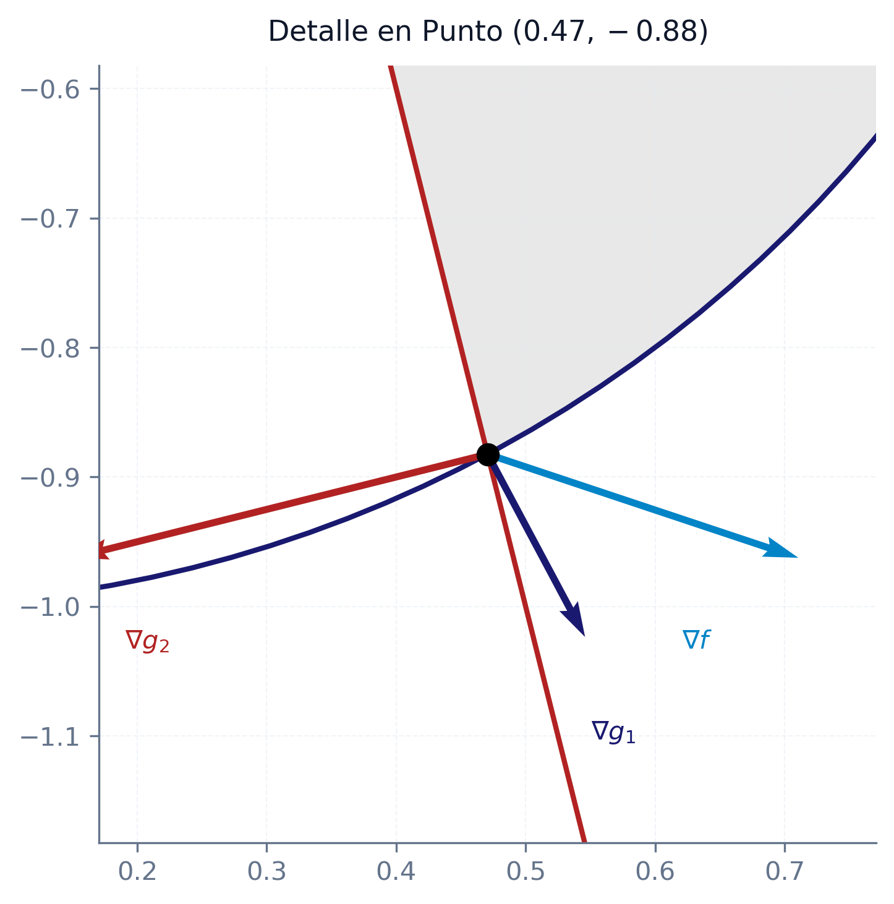{fig-align="center" width="100%"}
:::
:::

---

## Ejemplo 3: Conclusión y Caracterización

::: {.columns}
::: {.column width="55%"}

*   **Mínimo global**:
    $(0, 1)^T$ con $f(0,1) = -1$.
    *   $f$ es lineal (pseudo-convexa).
    *   $g_1$ es estrictamente convexa y $g_2$ es lineal (convexa).
    *   Al tener $u_i \ge 0$, se satisfacen las condiciones suficientes.
*   **Máximo global**:
    $\left(\frac{3}{\sqrt{10}}, -\frac{1}{\sqrt{10}}\right)^T$ con $f(x) \approx 3.16$.
    *   $f$ es lineal (pseudo-cóncava) y $u_1 < 0$.

:::

::: {.column width="45%"}
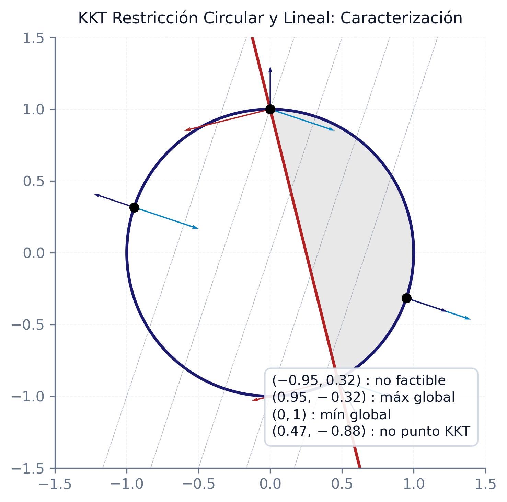{fig-align="center" width="100%"}
:::
:::

# Restricciones de igualdad y desigualdad

## Introducción a las restricciones de igualdad

*   **Restricciones de igualdad**: Formulación del problema general de optimización con restricciones de igualdad $h_j(x) = 0$, para $j=1,\dots,\ell$:
    $$ \min_{x} \{ f(x) \mid x \in \mathcal{X}, \ g_i(x) \le 0, \ i=1,\dots,m, \ h_j(x) = 0, \ j=1,\dots,\ell \} $$
*   **Movimiento admisible**: A diferencia de las desigualdades que permiten movimientos hacia el interior de la región factible, las restricciones de igualdad obligan a que cualquier dirección admisible permanezca tangente a la hipersuperficie definida por $h_j(x) = 0$.
*   **Aproximación lineal**: Localmente, el movimiento admisible debe ser ortogonal a los gradientes de las igualdades.

---

## Cono de direcciones tangentes para igualdades

*   **Definición**: Se define el cono de direcciones tangentes al espacio de igualdad en un punto factible $\bar{x}$ como:
    $$ \mathcal{H}_0(\bar{x}) = \{ d \in \mathbb{R}^n \mid \nabla h_j(\bar{x})^T d = 0, \ j = 1, \dots, \ell \} $$
*   **Interpretación geométrica**: El cono tangente representa el subespacio vectorial ortogonal a los gradientes de todas las restricciones de igualdad.
*   **Intersección con desigualdades**: En problemas con restricciones mixtas, una dirección factible debe pertenecer tanto al cono de restricciones de desigualdad como al cono tangente de igualdades.

---

## Exclusión geométrica generalizada

::: {.callout-important title="Exclusión geométrica generalizada"}

Sea $\bar{x}$ un mínimo local factible de $\min \{f(x) \mid g_i(x) \le 0, \ i=1,\dots,m, \ h_j(x) = 0, \ j=1,\dots,\ell\}$ e $\mathcal{I}$ el conjunto activo en $\bar{x}$. Si $f, g_i$ ($i \in \mathcal{I}$) son diferenciables en $\bar{x}$, $g_i$ ($i \notin \mathcal{I}$) son continuas en $\bar{x}$, y $h_j$ son continuamente diferenciables en $\bar{x}$ con gradientes $\nabla h_j(\bar{x})$ linealmente independientes, entonces la intersección de conos es vacía:

$$ \mathcal{D}_0(\bar{x}) \cap \mathcal{G}_0(\bar{x}) \cap \mathcal{H}_0(\bar{x}) = \emptyset $$

con $\mathcal{G}_0(\bar{x}) = \{ d \mid \nabla g_i(\bar{x})^T d < 0, i \in \mathcal{I} \}$ y $\mathcal{H}_0(\bar{x}) = \{ d \mid \nabla h_j(\bar{x})^T d = 0, \forall j \}$.

:::

---

## Condiciones KKT Generales (LICQ)

::: {.callout-important title="Condiciones necesarias de KKT generales"}

Sea $\bar{x}$ un mínimo local con conjunto activo $\mathcal{I}$ que satisface **LICQ** (los gradientes activos $\{\nabla g_i(\bar{x})\}_{i\in\mathcal{I}}$ y $\{\nabla h_j(\bar{x})\}$ son linealmente independientes). Si $f, g_i$ ($i \in \mathcal{I}$) son diferenciables en $\bar{x}$, $g_i$ ($i \notin \mathcal{I}$) son continuas en $\bar{x}$, y $h_j$ son continuamente diferenciables en $\bar{x}$, existen multiplicadores únicos $u_i \ge 0$ ($i \in \mathcal{I}$) y $v_j \in \mathbb{R}$ (sin restricción de signo) tales que:

$$ \nabla f(\bar{x}) + \sum_{i \in \mathcal{I}} u_i \nabla g_i(\bar{x}) + \sum_{j=1}^\ell v_j \nabla h_j(\bar{x}) = 0 $$
:::

---

## Ejemplo 4: Restricciones mixtas (Planteamiento)

*   **Problema de estudio**:
    $$ \min \quad f(x_1, x_2) $$
    $$ \text{s.a.} \quad g_1(x) = x_1^2 + x_2^2 - 5 \le 0 $$
    $$ g_2(x) = -x_1 \le 0, \quad g_3(x) = -x_2 \le 0 $$
    $$ h_1(x) = x_1 + x_2 - 3 = 0 $$
*   **Geometría**: El dominio factible es el segmento de recta comprendido entre los extremos **$(1,2)^T$** y **$(2,1)^T$** en el primer cuadrante.
*   **Lagrangiana**:
    $$ L(x, u, v) = f(x) + u_1(x_1^2 + x_2^2 - 5) - u_2 x_1 - u_3 x_2 + v_1(x_1 + x_2 - 3) $$

---

## Ejemplo 4: Caso A – Distancia al origen ($f_1 = x_1^2 + x_2^2$)

*   **Caso A.1 (Interior del segmento, $x_1 \in (1, 2)$)**:
    Con $u_i = 0$, la estacionariedad requiere:
    $$ 2x_1 + v_1 = 0, \ 2x_2 + v_1 = 0 \implies x_1 = x_2 $$
    Sustituyendo en $h_1$: $x_1 + x_2 = 3 \implies \mathbf{x}^* = (1.5, 1.5)^T, \ v_1 = -3$ (mínimo KKT, $f_1 = 4.5$).
*   **Caso A.2 (Extremos del segmento)**:
    *   En $(1,2)^T$ (activas $g_1, h_1$): $2 + 2u_1 + v_1 = 0, \ 4 + 4u_1 + v_1 = 0 \implies u_1 = -1 < 0$ (descartado).
    *   En $(2,1)^T$ (activas $g_1, h_1$): Por simetría, $u_1 = -1 < 0$ (descartado).

---

## Ejemplo 4: Caso B – Distancia a $(3,2)$ ($f_2 = (x_1-3)^2 + (x_2-2)^2$)

*   **Caso B.1 (Interior del segmento, $x_1 \in (1, 2)$)**:
    $u_i = 0$. Estacionariedad:
    $2(x_1-3)+v_1 = 0$, $2(x_2-2)+v_1 = 0 \implies x_1 = x_2+1$.
    $$ (x_2+1)+x_2 = 3 \implies x = (2, 1)^T \quad (\text{extremo, se descarta por interior}) $$
*   **Caso B.2 (Extremos del segmento)**:
    *   En $(1,2)^T$: $u_2=u_3=0 \implies u_1 = -2 < 0$ (descartado).
    *   En $(2,1)^T$: Activa $g_1, h_1$. Estacionariedad:
        $$ \left. \begin{aligned} -2 + 4u_1 + v_1 = 0 \\ -2 + 2u_1 + v_1 = 0 \end{aligned} \right\} \implies u_1 = 0 \ge 0, \ v_1 = 2 $$
    *   **$(2,1)^T$** es el candidato a **mínimo local** ($f_2 = 2.0$).

---

## Ejemplo 4: Resumen y Representación Gráfica

::: {.columns}
::: {.column width="50%"}

*   **Función $f_1$ (Distancia al origen)**:
    *   Mínimo KKT e interior en **$(1.5, 1.5)^T$** con $f_1 = 4.5$.
    *   Los extremos de la frontera circular están descartados ($u_1 = -1 < 0$).
*   **Función $f_2$ (Distancia a $(3,2)$)**:
    *   No hay estacionarios interiores.
    *   Mínimo KKT y global en el extremo circular **$(2, 1)^T$** con $f_2 = 2.0$ ($u_1 = 0 \ge 0$).

:::

::: {.column width="50%"}
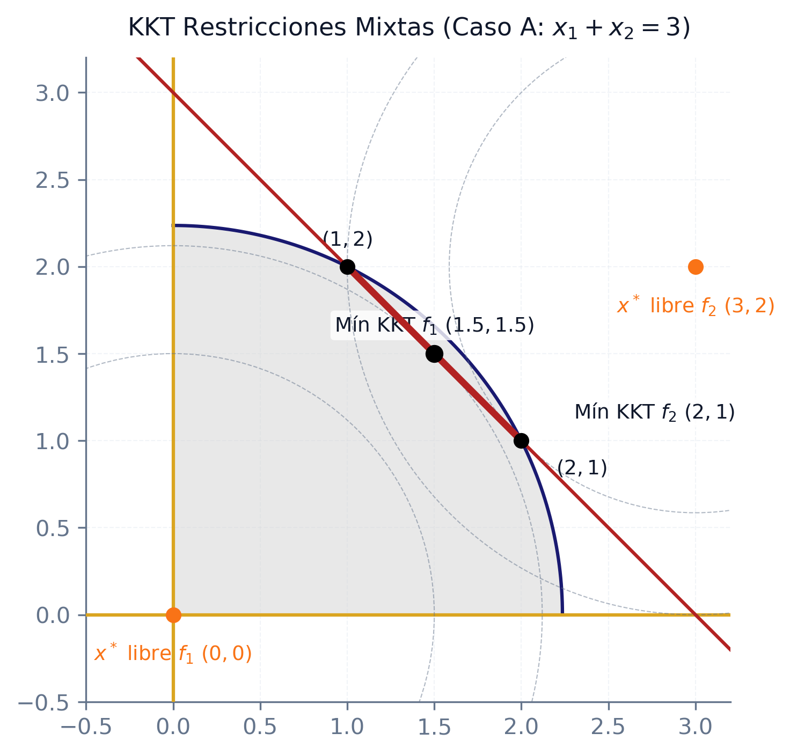{fig-align="center" width="100%"}
:::
:::

---

## Ejemplo 5: Modificación de frontera (Planteamiento)

*   **Recta frontera asimétrica**:
    $$ h_1(x) = x_1 + 2x_2 - 4 = 0 $$
*   **Dominio factible**:
    Sustituyendo $x_1 = 4-2x_2$ en la circunferencia:
    $$ (4-2x_2)^2 + x_2^2 \le 5 \implies 5x_2^2 - 16x_2 + 11 \le 0 \implies x_2 \in [1, 2.2] $$
*   **Primer cuadrante**:
    Exigiendo $x_1 \ge 0 \implies 4 - 2x_2 \ge 0 \implies x_2 \le 2$.
*   **Extremos**: El segmento factible real queda delimitado por los extremos **$(2,1)^T$** y **$(0,2)^T$**.

---

## Ejemplo 5: Caso A – Distancia al origen ($f_1 = x_1^2 + x_2^2$)

*   **Caso A.1 (Interior del segmento, $x_2 \in (1, 2)$)**:
    $u_i = 0$. Estacionariedad:
    $$ 2x_1 + v_1 = 0, \quad 2x_2 + 2v_1 = 0 \implies x_2 = 2x_1 $$
    Sustituyendo en $h_1$:
    $$ x_1 + 2(2x_1) = 4 \implies x^* = (0.8, 1.6)^T, \ v_1 = -1.6 $$
    Satisface KKT y es el candidato a **mínimo local** ($f_1 = 3.2$).
*   **Caso A.2 (Extremos del segmento)**:
    *   En $(2,1)^T$: Activa $g_1, h_1 \implies u_1 = -1 < 0$ (descartado).
    *   En $(0,2)^T$: Activa $g_2, h_1$ ($x_1=0$). Estacionariedad:
        $$ 0 - u_2 + v_1 = 0 \ \text{y} \ 4 + 2v_1 = 0 \implies v_1 = -2 \implies u_2 = -2 < 0 \quad (\text{descartado}) $$

---

## Ejemplo 5: Caso B – Distancia a $(3,2)$ ($f_2 = (x_1-3)^2 + (x_2-2)^2$)

*   **Caso B.1 (Interior del segmento, $x_2 \in (1, 2)$)**:
    $u_i = 0$. Estacionariedad:
    $2(x_1-3)+v_1 = 0$, $2(x_2-2)+2v_1 = 0 \implies x_2 = 2x_1-4$.
    $$ x_1+2(2x_1-4) = 4 \implies x_1 = 2.4, \ x_2 = 0.8 < 1 \quad (\text{no factible, descartado}) $$
*   **Caso B.2 (Extremos del segmento)**:
    *   En $(2,1)^T$: Activa $g_1, h_1$. Estacionariedad:
        $$ \left. \begin{aligned} -2 + 4u_1 + v_1 = 0 \\ -2 + 2u_1 + 2v_1 = 0 \end{aligned} \right\} \implies u_1 = 1/3 \ge 0, \ v_1 = 2/3 $$
        Satisface KKT y es el candidato a **mínimo local** ($f_2 = 2.0$).
    *   En $(0,2)^T$: Activa $g_2, h_1 \implies u_2 = -6 < 0$ (descartado).

---

## Ejemplo 5: Resumen y Representación Gráfica

::: {.columns}
::: {.column width="50%"}

*   **Función $f_1$ (Distancia al origen)**:
    *   Mínimo KKT e interior en **$(0.8, 1.6)^T$** con $f_1 = 3.2$.
    *   Los extremos de la frontera están descartados ($u_1 < 0$ y $u_2 < 0$).
*   **Función $f_2$ (Distancia a $(3,2)$)**:
    *   No hay estacionarios interiores factibles.
    *   Mínimo KKT y global en el extremo circular **$(2, 1)^T$** con $f_2 = 2.0$ ($u_1 = 1/3 \ge 0, \ v_1 = 2/3$).

:::

::: {.column width="50%"}
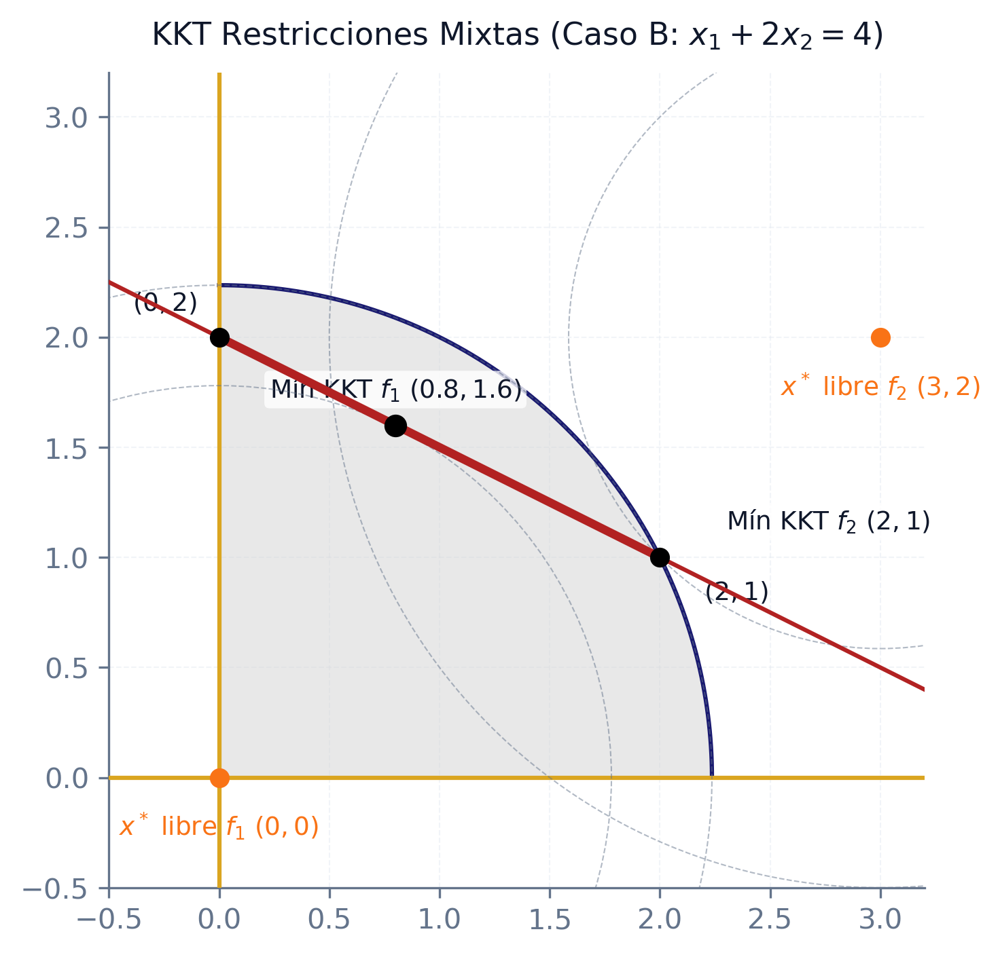{fig-align="center" width="100%"}
:::
:::
