## Objetivos de aprendizaje

1. **Deducir y justificar**: La equivalencia entre los multiplicadores KKT de un problema de programación lineal y las variables óptimas de su problema dual asociado.
2. **Demostrar formalmente**: El teorema de dualidad débil en programación lineal y deducir sus consecuencias sobre el salto dual y la no acotación.
3. **Interpretar económicamente**: Las variables duales como precios sombra (*shadow prices*) de los términos independientes.
4. **Clasificar los tipos de óptimos**: En programación lineal atendiendo a la unicidad, degeneración y acotación tanto del problema primal como del dual.
5. **Formular el sistema KKT**: Para problemas de programación cuadrática (QP) en forma matricial.
6. **Aplicar el algoritmo del Símplex de Wolfe**: (Regla de entrada restringida) para resolver de forma exacta problemas cuadráticos convexos.

# Programación lineal (LP)

## Introducción a la programación lineal

La **Programación Lineal (LP)** representa la piedra angular de la optimización matemática moderna y de la investigación operativa.

*   **Definición**: Consiste en la optimización (minimización o maximización) de un criterio de rendimiento lineal expresado por un vector de costes $c \in \mathbb{R}^n$, sobre un conjunto de soluciones factibles delimitado por hiperplanos y semiespacios afines.
*   **Poliedro convexo**: Desde una perspectiva geométrica, el conjunto factible de un problema de programación lineal constituye un poliedro convexo (un politopo si está acotado).

---

## Propiedades geométricas fundamentales de la LP

Como consecuencia directa de la convexidad del conjunto y de la linealidad de la función objetivo, la programación lineal posee dos propiedades fundamentales:

1.  **Ausencia de óptimos locales disjuntos**: Todo mínimo local es automáticamente un mínimo global.
2.  **Teorema Fundamental de la LP**: Si el problema admite solución óptima finita y la región factible posee al menos un punto extremo (vértice), existe al menos un **vértice extremo** del poliedro donde se alcanza dicho óptimo global.

---

## Geometría del conjunto factible poliédrico

::: {.columns}
::: {.column width="55%"}
*   **Bordes poliédricos**: La región factible poliédrica tiene como bordes las restricciones afines activas.
*   **Desplazamiento de curvas de nivel**: La función objetivo desplaza sus curvas de nivel hiperplánicas en la dirección de máximo descenso dictada por el vector gradiente del coste $c$.
:::

::: {.column width="45%"}
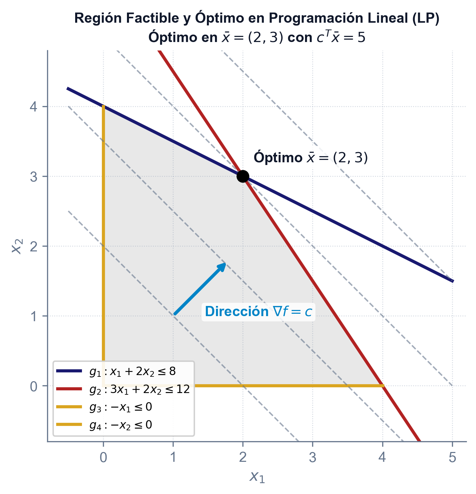
:::
:::

# Dualidad en programación lineal

## Concepto y perspectiva dual en programación lineal

A todo problema de programación lineal (**problema primal**), se le asocia de forma simétrica e involutiva otro problema lineal denominado **problema dual**.

::: {.columns}
::: {.column width="50%"}
**Problema Primal (Asignación)**:

*   **Objetivo**: Asignar niveles de actividad para minimizar un coste total (o maximizar un beneficio).
*   **Restricciones**: Sujeto a restricciones de términos independientes.
:::

::: {.column width="50%"}
**Problema Dual (Valoración)**:

*   **Objetivo**: Determinar la valoración económica óptima de dichos términos independientes.
*   **Restricciones**: Garantizar que el valor atribuido no supere los costes o beneficios marginales.
:::
:::

---

## Formulación canónica del par primal-dual

El problema primal original (P) se formula en su forma canónica de minimización como:

::: {.columns}
::: {.column width="50%"}
**Problema Primal (P)**:
$$
\begin{aligned}
\min_{x \in \mathbb{R}^n} \quad & c^T x \\
\text{sujeto a} \quad & A x \ge b \\
& x \ge 0
\end{aligned}
$$
:::

::: {.column width="50%"}
**Problema Dual (D)**:
$$
\begin{aligned}
\max_{w \in \mathbb{R}^m} \quad & b^T w \\
\text{sujeto a} \quad & A^T w \le c \\
& w \ge 0
\end{aligned}
$$
:::
:::

*   **Involución simétrica**: El problema dual del problema dual es exactamente el problema primal original.

---

## Teorema de dualidad débil en LP

::: {.callout-important title="Dualidad débil en LP"}
Para cualquier solución factible $x$ del problema primal (P) y cualquier solución factible $w$ del problema dual (D), el valor de la función objetivo dual es una cota inferior del valor de la función objetivo primal:
$$ b^T w \le c^T x $$
:::

---

## Consecuencias fundamentales de la dualidad débil

::: {.callout-note title="Consecuencias de la desigualdad $b^T w \le c^T x$"}
1.  **Criterio de Certificación de Optimalidad (Salto Dual Nulo)**: Si para algún par de soluciones factibles $x^*$ (primal) y $w^*$ (dual) el valor de las respectivas funciones objetivo coincide:
    $$ b^T w^* = c^T x^* $$
    entonces $x^*$ es una **solución óptima del primal (P)** y $w^*$ es una **solución óptima del dual (D)**.
2.  **No Acotación e Infactibilidad Recíproca**: Si uno de los dos problemas posee una solución **no acotada**, el otro problema **no tiene solución** (su región factible es vacía).
:::

# Condiciones KKT en programación lineal

## Fundamento analítico de KKT en LP

Expresamos el problema primal (P) en su formato estándar de minimización con restricciones de desigualdad afines reordenadas en la forma $g_i(x) \le 0$:

$$
\begin{aligned}
\min_{x \in \mathbb{R}^n} \quad & c^T x && (1) \\
\text{sujeto a} \quad & b - A x \le 0 && (2) \\
& -x \le 0 && (3)
\end{aligned}
$$

*   **Variables de decisión**: $x = (x_1, \dots, x_n)^T \in \mathbb{R}^n$.
*   **Vector de costes**: $c = (c_1, \dots, c_n)^T \in \mathbb{R}^n$.
*   **Matriz de coeficientes**: $A \in \mathbb{R}^{m \times n}$ (con filas $a^i$).
*   **Vector de disponibilidades**: $b = (b_1, \dots, b_m)^T \in \mathbb{R}^m$.

---

## Propiedades analíticas y suficiencia de KKT en LP

::: {.callout-note title="Propiedades analíticas y suficiencia de KKT en LP"}
1.  **Convexidad del dominio y la función**: La región factible $S$ es un poliedro convexo intersección de semiespacios afines. La función objetivo $f(x) = c^T x$ es afín (convexa), garantizando que cualquier mínimo local sea un óptimo global.
2.  **Suficiencia de las condiciones KKT**: Dado que las restricciones son afines, las cualificaciones de restricciones se satisfacen de forma trivial en todo el espacio. Por tanto, las condiciones KKT son **necesarias y suficientes** para la optimización global.
:::

---

## Gradientes de la función objetivo y restricciones

Calculamos los gradientes individuales de la función objetivo y restricciones:

*   **Gradiente de la función objetivo**: $$ \nabla f(x) = c $$
*   **Gradientes de las $m$ restricciones generales de desigualdad**: $$ \nabla g_i(x) = -(a^i)^T, \quad i = 1, \dots, m $$
*   **Gradientes de las $n$ restricciones de no negatividad**: $$ \nabla g_{m+j}(x) = -e^j, \quad j = 1, \dots, n $$

---

## Función Lagrangiana del problema lineal

Asociamos multiplicadores $u = (u_1, \dots, u_m)^T \ge 0$ a las restricciones afines generales y $v = (v_1, \dots, v_n)^T \ge 0$ a la no negatividad:

$$
L(x, u, v) = c^T x + \sum_{i=1}^m u_i (b_i - a^i x) + \sum_{j=1}^n v_j (-x_j) = c^T x + u^T (b - A x) - v^T x
$$

La condición de estacionariedad exige que el gradiente de la Lagrangiana se anule respecto a $x$:
$$ \nabla_x L(x, u, v) = c - A^T u - v = 0 $$

---

## Conjunto completo de condiciones KKT para LP

Un triplete de vectores $(x, u, v)$ satisface las condiciones KKT si y solo si verifica de forma simultánea:

1.  **Factibilidad primal**: $A x \ge b, \qquad x \ge 0$
2.  **Factibilidad dual y estacionariedad**: $c - A^T u - v = 0 \quad \text{con } u \ge 0 \text{ y } v \ge 0$
3.  **Holgura complementaria**: $$
    \begin{aligned}
    u_i (b_i - a^i x) = 0, \quad & \forall i = 1, \dots, m \\
    v_i x_i = 0, \quad & \forall i = 1, \dots, n
    \end{aligned}
    $$

---

## Estructura matricial y equivalencia dual de KKT

::: {.callout-note title="Componentes clave del sistema KKT"}
*   **Factibilidad primal**: $A x \ge b, x \ge 0 \implies$ Garantiza la pertenencia de $x$ al poliedro factible del problema primal (P).
*   **Factibilidad dual (estacionariedad)**: $c - A^T u - v = 0 \text{ con } u \ge 0, v \ge 0 \implies v = c - A^T u \ge 0 \iff A^T u \le c, u \ge 0$ (Factibilidad en D).
*   **Holgura complementaria**: $u_i (b_i - a^i x) = 0, v_i x_i = 0 \implies$ Vincula la holgura de las restricciones generales con su valoración marginal dual.
:::

---

## Comparación de formulaciones primales y duales

Situando en paralelo la formulación canónica primal y dual:

$$
\text{Primal (P):} \quad \begin{aligned} \min_{x \in \mathbb{R}^n} \quad & c^T x \\ \text{sujeto a} \quad & A x \ge b \\ & x \ge 0 \end{aligned}
\qquad \qquad
\text{Dual (D):} \quad \begin{aligned} \max_{w \in \mathbb{R}^m} \quad & b^T w \\ \text{sujeto a} \quad & A^T w \le c \\ & w \ge 0 \end{aligned}
$$

*   La factibilidad primal de KKT asegura que $x$ es factible en (P).
*   La estacionariedad y no negatividad de KKT aseguran que $u$ es factible en (D).

---

## Factibilidad dual de los multiplicadores KKT

Despejando $v$ de la condición de estacionariedad:

$$
\left. \begin{aligned} c - A^T u - v &= 0 \\ u, v &\ge 0 \end{aligned} \right\} \implies \left. \begin{aligned} v &= c - A^T u \\ u, v &\ge 0 \end{aligned} \right\} \implies \begin{aligned} c - A^T u &\ge 0 \\ u &\ge 0 \end{aligned} \iff \begin{aligned} A^T u &\le c \\ u &\ge 0 \end{aligned}
$$

*   Este desarrollo demuestra que el vector de multiplicadores KKT $u \in \mathbb{R}^m$ **es automáticamente una solución factible para el problema dual (D)**.

---

## Salto dual nulo y relaciones KKT (Parte I)

Para comparar los valores de la función objetivo primal $c^T x$ y dual $b^T u$ en un punto KKT:

1.  **Premultiplicación de estacionariedad**:  
    Premultiplicamos la ecuación de estacionariedad $c - A^T u - v = 0$ por la izquierda por el vector fila $x^T \ge 0$:
    $$ x^T (c - A^T u - v) = 0 $$
2.  **Desarrollo algebraico**:  
    $$ c^T x - x^T A^T u - x^T v = 0 \iff c^T x - u^T A x - v^T x = 0 \qquad (4) $$

---

## Salto dual nulo y relaciones KKT (Parte II)

3.  **Agregación de holguras complementarias**:  
    Sumando las condiciones de holgura complementaria sobre todas las componentes:
    $$ \sum_{i=1}^m u_i (b_i - a^i x) = 0 \implies u^T b - u^T A x = 0 \implies b^T u = u^T A x $$
    $$ \sum_{i=1}^n v_i x_i = 0 \implies v^T x = 0 $$
4.  **Sustitución directa en la ecuación (4)**:  
    Sustituyendo las identidades $u^T A x = b^T u$ y $v^T x = 0$ en la relación de estacionariedad (4):
    $$ c^T x - b^T u - 0 = 0 \iff c^T x = b^T u $$
    demostrando que el salto dual ($c^T x - b^T u$) es exactamente cero.

---

## Certificación de optimalidad mediante KKT

::: {.callout-important title="Certificación de optimalidad mediante KKT"}
Dada una solución $(x, u, v)$ que satisface las condiciones KKT de un problema lineal:

1.  **Factibilidad primal**: $x$ es factible para (P).
2.  **Factibilidad dual**: $u$ es factible para (D).
3.  **Salto dual nulo**: $c^T x = b^T u$.

**Conclusión**: En virtud del Teorema de Dualidad Débil, **$x$ es una solución óptima global del primal (P)** y **$u$ es una solución óptima global del dual (D)**.
:::

# Precios sombra e interpretación económica

## Significado económico de los multiplicadores KKT

En planificación de producción:

*   **Precios sombra (*shadow prices*)**:  
    Los multiplicadores duales $u_i^*$ representan el valor marginal de los términos independientes:
    $$ u_i^* = \frac{\partial (c^T x^*)}{\partial b_i} $$
*   **Variación de la función objetivo**: Mide la tasa instantánea de variación del valor óptimo ante un incremento marginal unitario en $b_i$.

---

## Regla de asignación de términos independientes y holgura complementaria

La condición de holgura complementaria $u_i^* (b_i - a^i x^*) = 0$ formaliza una regla económica intuitiva:

*   **Restricción inactiva o excedentaria**: Si en el óptimo $a^i x^* < b_i \implies b_i - a^i x^* > 0$, existe superávit del término independiente $i$. Aumentar la disponibilidad de un término independiente del cual ya se dispone de excedente no genera beneficio adicional ni reduce el coste óptimo. Por tanto, su valor marginal o precio sombra es nulo ($u_i^* = 0$).
*   **Restricción activa o limitante**: Si $u_i^* > 0$, la restricción limita el espacio factible, por lo que debe satisfacerse como igualdad estricta en el óptimo ($b_i - a^i x^* = 0$).

# Clasificación de óptimos y relaciones de dualidad

## Caracterización teórica de los tipos de solución

La geometría del poliedro factible $S$ y la independencia lineal de restricciones activas clasifican las soluciones según:

1.  **Finitud y existencialidad**: Solución óptima finita, problema no acotado ($f \to -\infty$), o problema no factible ($S = \emptyset$).
2.  **Unicidad frente a multiplicidad**: Solución única en un vértice o múltiples soluciones óptimas sobre una arista o cara de dimensión $d \ge 1$.

---

## Degeneración primal y dual

3.  **Degeneración primal y dual**:

    *   **Degeneración primal**: Es no degenerada si se cortan exactamente $n$ restricciones activas independientes (cumpliendo LICQ). Es **degenerada** si convergen más de $n$ restricciones activas (sobredeterminación geométrica), admitiendo infinitos multiplicadores KKT válidos.
    *   **Degeneración dual**: Es degenerada si presenta al menos un multiplicador dual nulo ($u_i^* = 0$) asociado a una restricción primal estrictamente activa ($b_i - a^i x^* = 0$).

---

## Proposición: Equivalencia entre degeneración y múltiples óptimos

::: {.callout-note title="Proposición: Equivalencia entre degeneración y múltiples óptimos"}
Dado un problema de optimización lineal y su correspondiente problema dual asociado, uno de los dos problemas posee una solución óptima finita **degenerada** si y solo si el otro problema posee **múltiples puntos óptimos**.
:::

---

## Matriz de correspondencia primal-dual

| Estado del Problema Primal | Estado del Problema Dual Asociado |
| :--- | :--- |
| **Óptimo Único No Degenerado** | Óptimo Único No Degenerado |
| **Óptimo Único Degenerado** | Múltiples Soluciones Óptimas |
| **Múltiples Soluciones Óptimas** | Óptimo Único Degenerado |
| **No Acotado ($f \to -\infty$)** | No Factible (Región Dual Vacía) |
| **No Factible (Región Primal Vacía)** | No Factible o No Acotado |

# Ejemplo: Análisis por casos de las condiciones KKT en LP

## Caso 1: Solución óptima finita única no degenerada

::: {.columns}
::: {.column width="50%"}
**Formulación**:
$$
\begin{aligned}
\min \quad & -x - 2y \\
\text{s.a.} \quad & x + y - 4 \le 0 \quad (g_1) \\
& -x + y - 2 \le 0 \quad (g_2) \\
& 2x + y - 7 \le 0 \quad (g_3) \\
& x, y \ge 0
\end{aligned}
$$

*   **Óptimo primal**: $\bar{x} = (1,3)$ con $f(1,3) = -7$.
*   **Restricciones activas**: $g_1$ y $g_2$ ($m_{activas} = 2 = n$).
*   **Estacionariedad KKT**:
    $$ \begin{pmatrix} 1 \\ 2 \end{pmatrix} = u_1 \begin{pmatrix} 1 \\ 1 \end{pmatrix} + u_2 \begin{pmatrix} -1 \\ 1 \end{pmatrix} \implies u_1^* = \frac{3}{2}, \, u_2^* = \frac{1}{2} $$
*   **Conclusión**: Solución dual única no degenerada.
:::

::: {.column width="50%"}
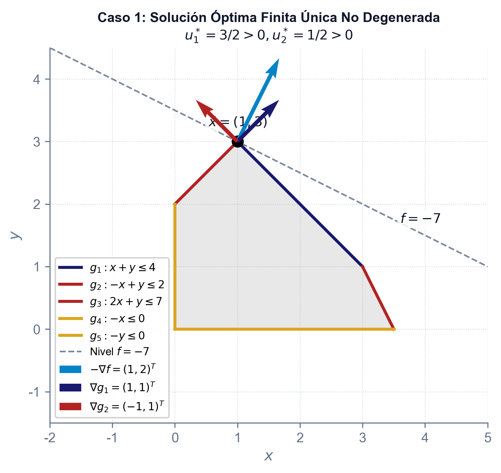
:::
:::

---

## Caso 2: Solución óptima finita única degenerada

::: {.columns}
::: {.column width="50%"}
**Inclusión de restricción redundante**:
$$ g_4(x,y) = y - 3 \le 0 $$

*   **Óptimo primal**: $\bar{x} = (1,3)$ con $f(1,3) = -7$.
*   **Sobredeterminación**: Convergen 3 restricciones activas ($g_1, g_2, g_4$) para $n=2$ variables.
*   **Ruptura de LICQ**: Gradientes linealmente dependientes.
*   **Solución dual**: Múltiples vectores KKT válidos entre $u = (3/2, 1/2, 0)$ y $u' = (1, 0, 1)$.
*   **Conclusión**: **El problema dual tiene múltiples soluciones óptimas**.
:::

::: {.column width="50%"}
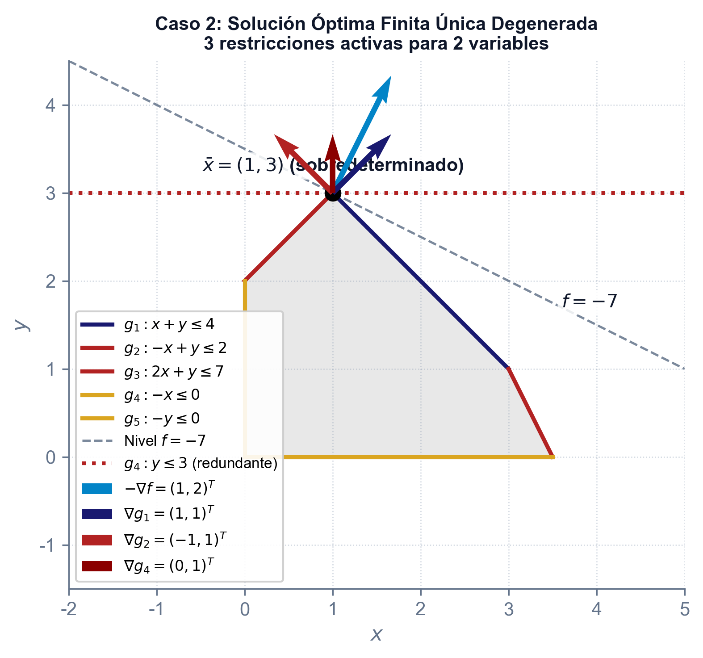
:::
:::

---

## Caso 3: Múltiples soluciones no degeneradas

::: {.columns}
::: {.column width="50%"}
**Función objetivo paralela**:
$$ \min \quad -x - y $$

*   **Gradiente**: $-\nabla f = (1,1)^T$, paralelo a $\nabla g_1 = (1,1)^T$.
*   **Conjunto óptimo**: Arista continua entre $(1,3)$ y $(3,1)$.
*   **Estructura dual**:

    *   En puntos interiores: $u_1^* = 1$, resto nulos.
    *   En vértices: convergen 2 restricciones pero un multiplicador es nulo ($u_2^*=0$ ó $u_3^*=0$).
*   **Conclusión**: **El problema dual tiene una solución degenerada**.
:::

::: {.column width="50%"}
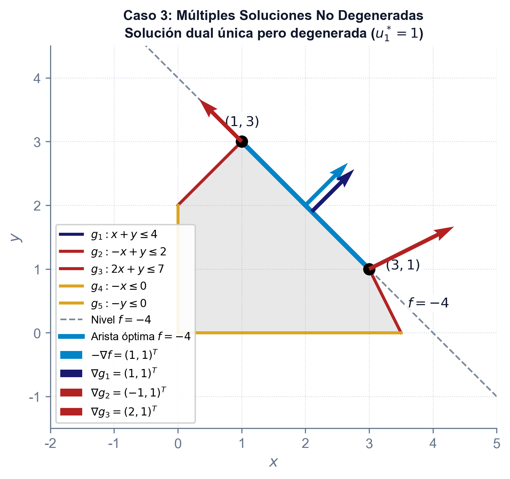
:::
:::

---

## Caso 4A: Geometría de múltiples soluciones degeneradas

::: {.columns}
::: {.column width="50%"}
**Arista óptima con sobredeterminación**:
$$ \min \quad -x - y \quad \text{con } g_4: y - 3 \le 0 $$

*   **Geometría primal**: El segmento continuo entre $(1,3)$ y $(3,1)$ constituye el conjunto de soluciones óptimas primales.
*   **Confiliencia en el vértice**: El vértice $(1,3)$ satisface simultáneamente $g_1, g_2$ y $g_4$.
*   **Conclusión**: Múltiples óptimos primales con degeneración en la frontera.
:::

::: {.column width="50%"}
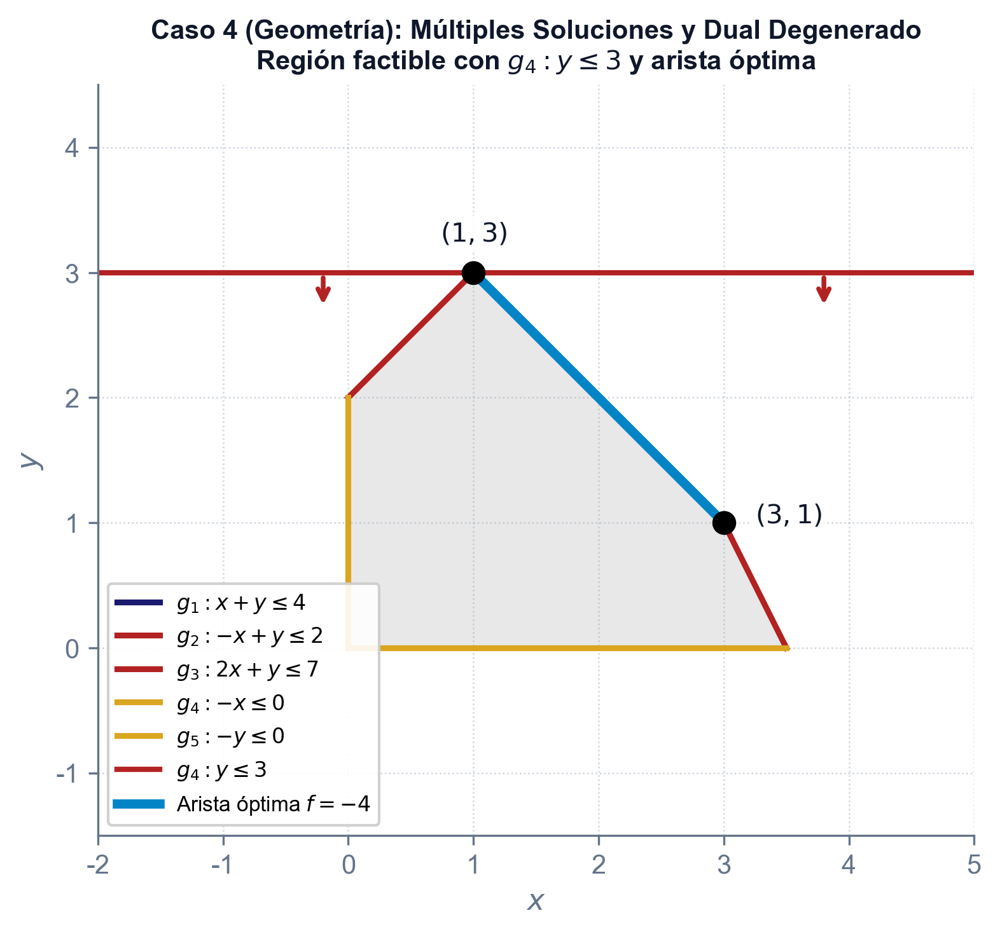
:::
:::

---

## Caso 4B: Gradientes y dualidad degenerada en Caso 4

::: {.columns}
::: {.column width="50%"}
**Análisis de estacionariedad KKT**:

*   **En el vértice sobredeterminado $(1,3)$**:
    $$ -\nabla f = u_1 \nabla g_1 + u_2 \nabla g_2 + u_4 \nabla g_4 $$
    Requiere dos multiplicadores nulos ($u_2 = 0, u_4 = 0$).
*   **En el vértice $(3,1)$**:
    $$ -\nabla f = u_1 \nabla g_1 + u_3 \nabla g_3 \implies u_3 = 0 $$
*   **Conclusión**: **El problema dual posee una solución degenerada**.
:::

::: {.column width="50%"}
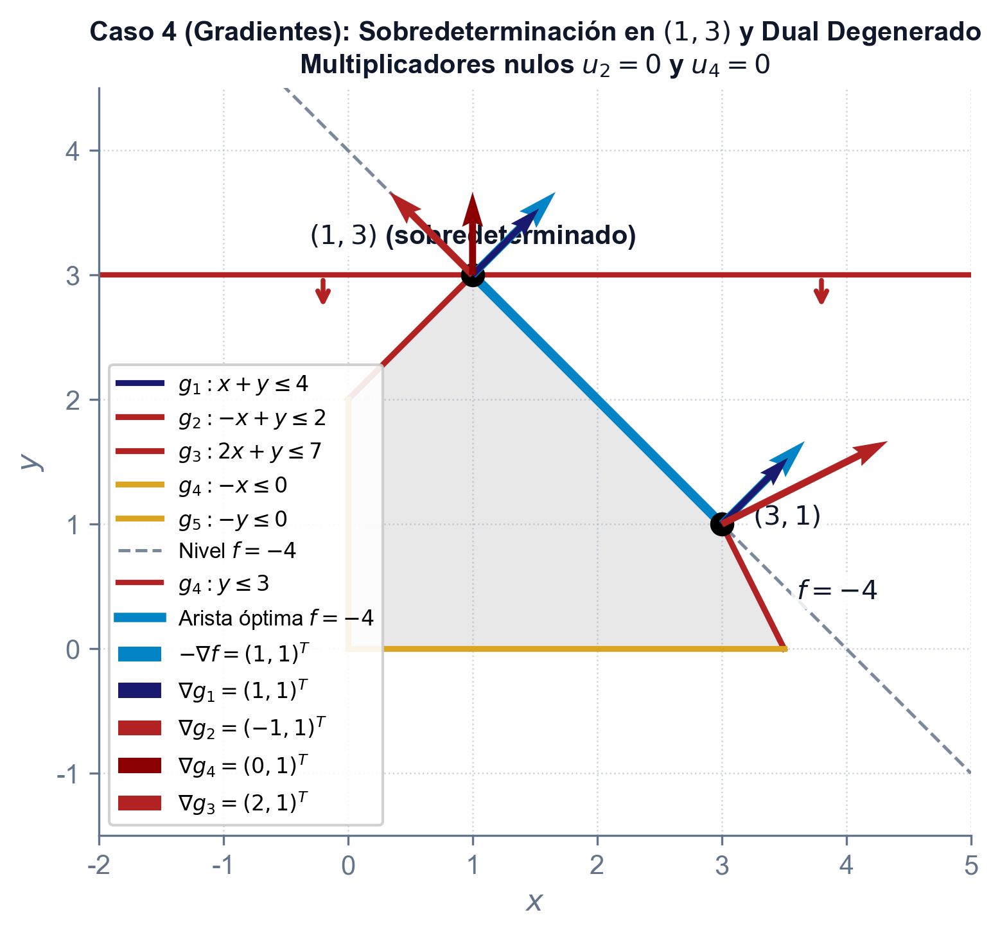
:::
:::

---

## Caso 5: Solución no acotada

::: {.columns}
::: {.column width="50%"}
**Eliminación de la restricción superior $g_1$**:
$$
\begin{aligned}
\min \quad & -x - y \\
\text{s.a.} \quad & -x + y - 2 \le 0 \quad (g_2) \\
& 2x + y - 7 \le 0 \quad (g_3) \\
& x, y \ge 0
\end{aligned}
$$

*   **Comportamiento**: El coste decrece hacia $-\infty$ sobre un rayo de recesión.
*   **Estructura dual**: Imposible satisfacer estacionariedad KKT.
*   **Conclusión**: **El problema dual no tiene solución (es no factible)**.
:::

::: {.column width="50%"}
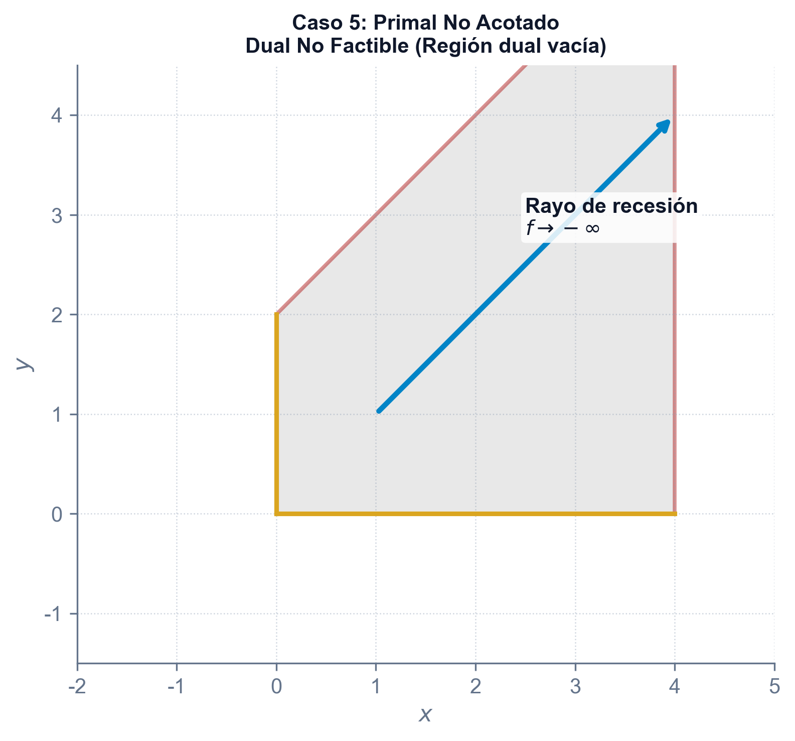
:::
:::

---

## Caso 6: Problema no factible

::: {.columns}
::: {.column width="50%"}
**Restricciones contradictorias**:
$$
\begin{aligned}
\min \quad & -x - 2y \\
\text{s.a.} \quad & x + y - 1 \le 0 \\
& -x - y + 3.5 \le 0 \\
& x, y \ge 0
\end{aligned}
$$

*   **Geometría**: La región factible primal es vacía.
*   **Estructura dual**: El problema dual no puede tener solución óptima finita.
*   **Conclusión**: **El problema dual es no factible o tiene solución no acotada**.
:::

::: {.column width="50%"}
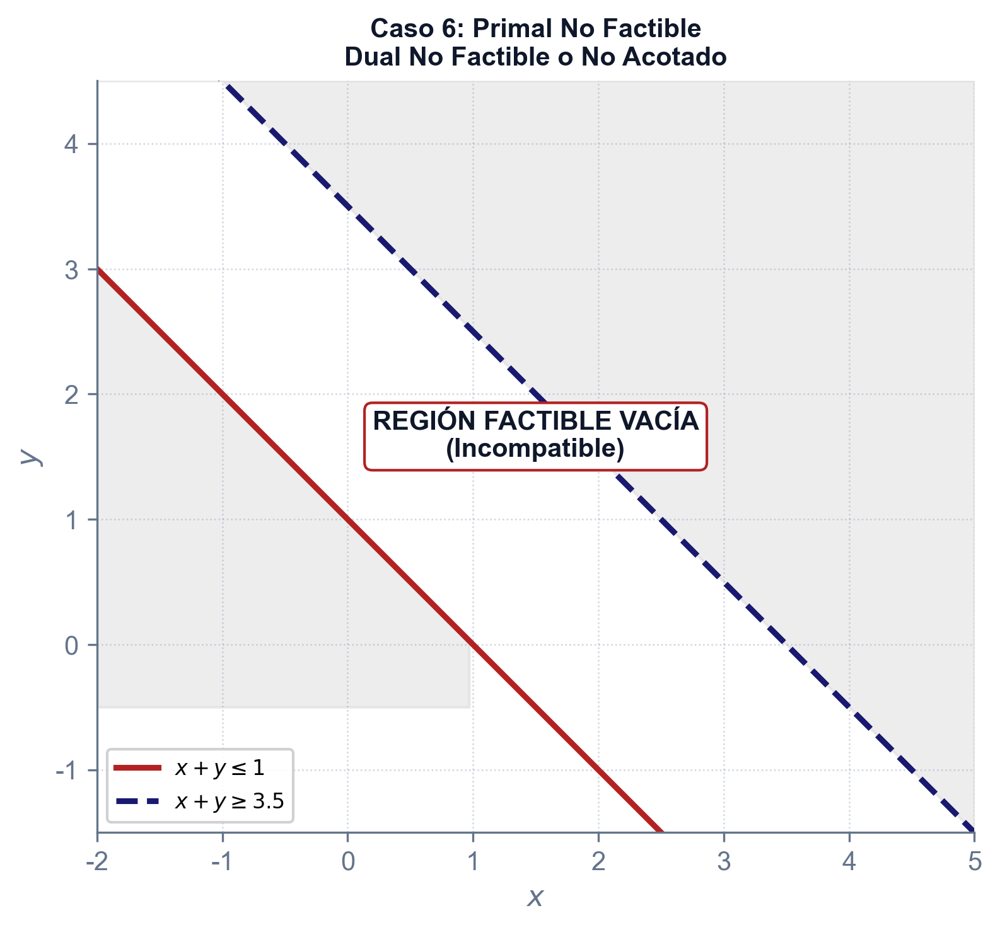
:::
:::

# Programación cuadrática (QP)

## Modelo general de programación cuadrática

Consideremos el modelo estándar general de optimización cuadrática:

$$
\begin{aligned}
\min_{x \in \mathbb{R}^n} \quad & f(x) = c^T x + \frac{1}{2} x^T Q x \\
\text{sujeto a} \quad & A x \ge b \\
& x \ge 0
\end{aligned}
$$

*   **Vector de variables**: $x \in \mathbb{R}^n$, vector de costes $c \in \mathbb{R}^n$.
*   **Matriz Hessiana $Q$**: Matriz cuadrada simétrica $n \times n$ ($Q = Q^T$).
*   **Región factible**: $S = \{x \in \mathbb{R}^n : A x \ge b, x \ge 0\}$, intersección de semiespacios afines, constituyendo un conjunto **convexo y poliédrico**.

---

## Interpretación geométrica de la función objetivo cuadrática

::: {.callout-note title="Observación: Interpretación geométrica en QP"}
Cuando la matriz $Q$ es definida positiva ($Q \succ 0$), la función cuadrática $f(x)$ posee un único mínimo libre no restringido en $x^0 = -Q^{-1} c$. Sus curvas de nivel $f(x) = k$ forman elipsoides concéntricos centrados en $x^0$.

Desde una perspectiva geométrica, resolver el problema cuadrático equivale a encontrar el punto del poliedro factible $S$ más cercano a $x^0$ según la métrica inducida por la matriz $Q$.
:::

# Derivación formal del sistema KKT

## Lagrangiano de la programación cuadrática

Reescribiendo las restricciones en forma canónica $b - A x \le 0$ y $-x \le 0$, construimos la función Lagrangiana extendida con multiplicadores $u \ge 0$ y $v \ge 0$:

$$
L(x, u, v) = c^T x + \frac{1}{2} x^T Q x + u^T (b - A x) - v^T x
$$

Derivando parcialmente respecto al vector primal $x$ e imponiendo las condiciones KKT:

1.  **Factibilidad primal**: $A x \ge b, \quad x \ge 0$.
2.  **Factibilidad dual y estacionariedad**: $\nabla_x L(x, u, v) = c + Q x - A^T u - v = 0$ con $u \ge 0, v \ge 0$.
3.  **Holgura complementaria**: $u_i (b_i - a^i x) = 0 \ (\forall i)$ y $v_i x_i = 0 \ (\forall i)$.

---

## Factibilidad primal en QP

Las condiciones de factibilidad primal en programación cuadrática exigen:

*   **Factibilidad de las restricciones generales de desigualdad**: $b - A x \le 0 \iff A x \ge b$. Exige que la solución $x$ satisfaga la totalidad de las $m$ restricciones afines generales.
*   **Factibilidad de no negatividad**: $-x \le 0 \iff x \ge 0$. Garantiza que el vector de variables pertenezca al ortante no negativo.

---

## Factibilidad dual y estacionariedad en QP

La condición de estacionariedad establece el equilibrio vectorial en el punto óptimo:

$$ \nabla_x L(x, u, v) = c + Q x - A^T u - v = 0 $$

*   **Gradiente objetivo cuadrático**: $\nabla f(x) = c + Q x$. Debe poder expresarse como combinación lineal no negativa de los gradientes de las restricciones activas $A^T u + v$.
*   **No negatividad dual**: $u \ge 0$ y $v \ge 0$ orientan los vectores normales en sentido opuesto a las direcciones de descenso.

---

## Condiciones de holgura complementaria en QP

Las condiciones de holgura complementaria vinculan la actividad primal con los multiplicadores duales:

*   **Complementariedad de recursos**: $u_i (b_i - a^i x) = 0, \quad \forall i = 1, \dots, m$. Si una restricción es inactiva ($b_i - a^i x < 0$), su precio sombra es nulo ($u_i = 0$). Si $u_i > 0$, se verifica como igualdad estricta ($a^i x = b_i$).
*   **Complementariedad de no negatividad**: $v_i x_i = 0, \quad \forall i = 1, \dots, n$. Si $x_i > 0 \implies v_i = 0$. Si $x_i = 0 \implies v_i \ge 0$.

---

## Proposición: Suficiencia y convexidad ($Q \succeq 0$)

::: {.callout-note title="Proposición: Suficiencia de las condiciones KKT en QP convexa"}
Si la matriz de términos cuadráticos $Q$ es semidefinida positiva ($Q \succeq 0$), el problema de programación cuadrática es convexo. En consecuencia, **cualquier solución que satisfaga el sistema de condiciones KKT es una solución óptima global**.
:::

::: {.callout-warning title="Advertencia: Importancia crítica de la convexidad ($Q \succeq 0$)"}
Si la matriz $Q$ no es semidefinida positiva (posee autovalores estrictamente negativos), el problema cuadrático deja de ser convexo. En tal escenario, las condiciones KKT son únicamente necesarias pero no suficientes.
:::

# Transformación mediante variables de holgura y linealidad del sistema

## Introducción de variables primales de holgura

Para transformar las desigualdades primales $b - A x \le 0$ en ecuaciones lineales, introducimos variables primales de holgura no negativas $y = (y_1, \dots, y_m)^T \ge 0$:

$$
b - A x \le 0 \iff b - A x + y = 0, \quad \text{con } y \ge 0
$$

Se verifica la equivalencia analítica directa:
$$ b_i - a^i x < 0 \iff y_i > 0, \quad \forall i = 1, \dots, m $$

Sustituyendo en la holgura complementaria:
$$ u_i y_i = 0, \quad \forall i = 1, \dots, m $$

---

## Equiparación global de holguras complementarias

Dado que todas las variables del sistema son no negativas ($u, v, x, y \ge 0$), la anulación individual $u_i y_i = 0$ y $v_i x_i = 0$ equivale a la anulación de la suma escalar global:

$$
\begin{cases}
u_i y_i = 0, & \forall i = 1, \dots, m \\
v_i x_i = 0, & \forall i = 1, \dots, n
\end{cases}
\iff \sum_{i=1}^m u_i y_i + \sum_{i=1}^n v_i x_i = 0 \iff u^T y + v^T x = 0
$$

---

## Sistema KKT matricial de la programación cuadrática

El sistema KKT para el problema cuadrático convexo se expresa en la siguiente forma estandarizada:

$$
\begin{aligned}
b - A x + y &= 0 \\
c + Q x - A^T u - v &= 0 \\
x, y, u, v &\ge 0 \\
u^T y + v^T x &= 0
\end{aligned}
$$

*   **Linealidad del bloque de igualdad**: Excepto por la restricción no lineal de complementariedad ($u^T y + v^T x = 0$), todo el resto del sistema (factibilidad primal $b - A x + y = 0$ y estacionariedad $c + Q x - A^T u - v = 0$) es **estrictamente lineal**.

# Algoritmo del Símplex de Wolfe

## Principio del Símplex de Wolfe y problema auxiliar

Se adapta el algoritmo del Símplex lineal sobre el sistema KKT ampliado mediante tres pasos:

1.  **Relajar la holgura complementaria** $u^T y + v^T x = 0$.
2.  **Añadir variables artificiales** $z = (z_1, \dots, z_n)^T \ge 0$ a la estacionariedad:
    $$ c + Q x - A^T u - v + z = 0 \quad \text{con } z \ge 0 $$
3.  **Minimizar la suma artificial** resolviendo el problema lineal auxiliar:
    $$ \min \sum_{i=1}^n z_i \quad \text{s.a. } b - A x + y = 0, \ c + Q x - A^T u - v + z = 0, \ x,y,u,v,z \ge 0 $$

---

## Regla de entrada restringida de Wolfe (Complementariedad)

Para garantizar la complementariedad en el problema auxiliar, se modifica el criterio de entrada a la base Símplex (*restricted entry rule*):

*   **Regla de complementariedad primal-dual ($u_i, y_i$)**: La variable multiplicadora dual $u_i$ **no es candidata** a entrar en la base Símplex si su correspondiente variable de holgura primal $y_i$ es básica ($y_i \in \text{Base}$), y viceversa.
*   **Regla de complementariedad de no negatividad ($v_j, x_j$)**: La variable de holgura dual $v_j$ **no es candidata** a entrar en la base Símplex si la correspondiente variable primal $x_j$ es básica ($x_j \in \text{Base}$), y viceversa.

---

## Caracterización de la solución según la suma artificial

Al resolver el problema auxiliar bajo la regla de entrada restringida:

*   **Si el valor óptimo es 0** ($\min \sum z_i = 0$): Todas las variables artificiales salen de la base ($z^* = 0$). Como la regla de pivote impide que variables complementarias formen parte de la base simultáneamente, la solución satisface $u^{*T} y^* + v^{*T} x^* = 0$ y **$x^*$ es la solución óptima global**.
*   **Si el valor óptimo es estrictamente positivo** ($\min \sum z_i > 0$): Resulta imposible reducir las variables artificiales a cero respetando la regla restringida. Por tanto, **el problema cuadrático NO tiene solución (es no factible)**.

---

## Garantía de convergencia finita del algoritmo

::: {.callout-note title="Nota: Garantía de convergencia finita del algoritmo de Wolfe"}
Puesto que el algoritmo del Símplex modificado por Wolfe opera sobre el conjunto de soluciones básicas factibles del sistema de ecuaciones lineales ampliado (el cual consta de un número finito de bases posibles) y la función objetivo auxiliar $\sum z_i$ decrece de manera monótona a cada paso de pivote, se garantiza que el algoritmo finaliza en un número finito de iteraciones.
:::

# Resolución completa mediante el Algoritmo del Símplex de Wolfe

## Enunciado del problema cuadrático

Consideremos el problema de optimización cuadrática en el que se busca minimizar la distancia euclídea al cuadrado desde las variables $(x_1, x_2)$ al punto objetivo $(4,4)$, sobre una región factible poliédrica $S \subset \mathbb{R}^2$:

$$
\begin{aligned}
\min_{x_1, x_2 \in \mathbb{R}} \quad & (x_1 - 4)^2 + (x_2 - 4)^2 \\
\text{sujeto a} \quad & x_1 + x_2 \le 4 \\
& -x_1 + x_2 \le 2 \\
& 2x_1 + x_2 \le 7 \\
& x_1, x_2 \ge 0
\end{aligned}
\qquad \equiv \qquad
\begin{aligned}
\min_{x_1, x_2 \in \mathbb{R}} \quad & (x_1 - 4)^2 + (x_2 - 4)^2 \\
\text{sujeto a} \quad & -4 + x_1 + x_2 \le 0 \\
& -2 - x_1 + x_2 \le 0 \\
& -7 + 2x_1 + x_2 \le 0 \\
& x_1, x_2 \ge 0
\end{aligned}
$$

---

## Formulación del problema auxiliar del Símplex de Wolfe

Identificamos $Q = \begin{pmatrix} 2 & 0 \\ 0 & 2 \end{pmatrix} \succ 0$, $c = (-8, -8)^T$, $A = \begin{pmatrix} -1 & -1 \\ 1 & -1 \\ -2 & -1 \end{pmatrix}$ y $b = (-4, 2, -7)^T$.

Al introducir holguras primales $y_1, y_2, y_3 \ge 0$, multiplicadores duales $u_1, u_2, u_3 \ge 0$, holguras duales $v_1, v_2 \ge 0$ y artificiales $z_1, z_2 \ge 0$:

$$
\begin{aligned}
\min \quad & z_1 + z_2 \\
\text{sujeto a} \quad & -4 + x_1 + x_2 + y_1 = 0 \\
& -2 - x_1 + x_2 + y_2 = 0 \\
& -7 + 2x_1 + x_2 + y_3 = 0 \\
& 2(x_1 - 4) + u_1 - u_2 + 2u_3 - v_1 + z_1 = 0 \\
& 2(x_2 - 4) + u_1 + u_2 + u_3 - v_2 + z_2 = 0 \\
& x_1, x_2, y_1, y_2, y_3, u_1, u_2, u_3, v_1, v_2, z_1, z_2 \ge 0
\end{aligned}
$$

---

## Representación gráfica de la solución

::: {.columns}
::: {.column width="50%"}
*   **Centro no restringido**: Las curvas de nivel de la función objetivo representan círculos concéntricos centrados en el mínimo libre no restringido $(4,4)$.
*   **Tangencia óptima**: La solución óptima del problema corresponde al punto de la región factible $S$ más próximo a $(4,4)$, alcanzándose la tangencia en el punto $\bar{x} = (2,2)$ con $f(2,2) = 8$.
:::

::: {.column width="50%"}
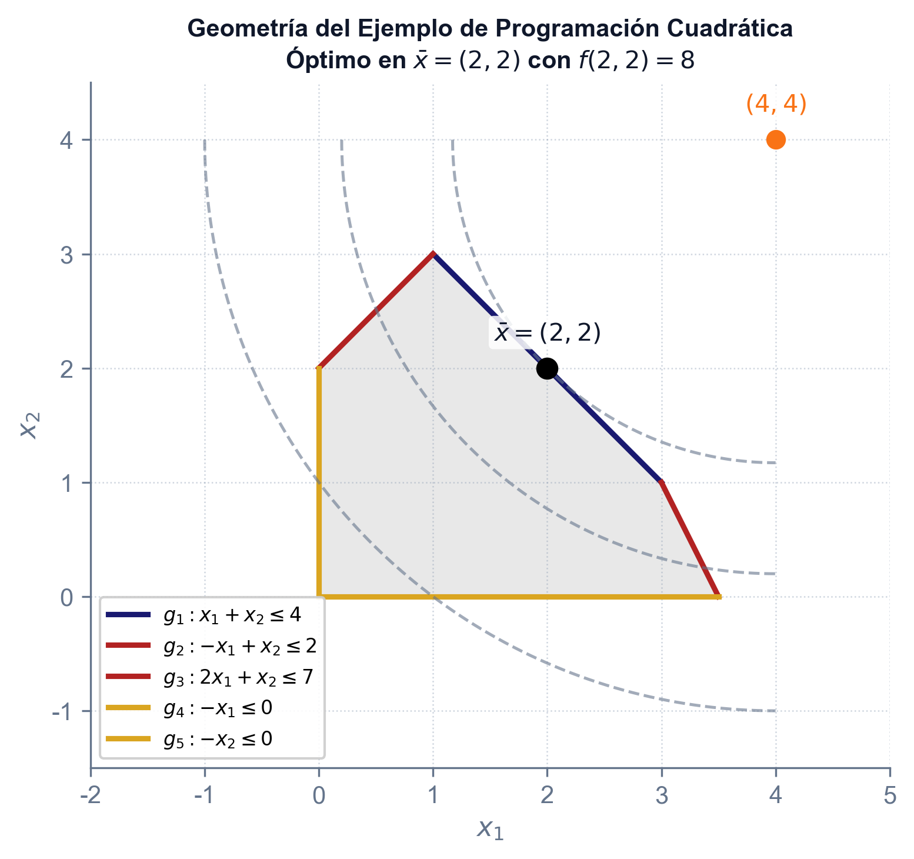
:::
:::

---

## Solución matemática del sistema KKT

Al resolver el sistema KKT, la solución exacta resultante para todas las variables primales, duales, de holgura y artificiales es:

$$
\begin{aligned}
x_1^* &= 2, \quad x_2^* = 2 \\
u_1^* &= 4, \quad u_2^* = 0, \quad u_3^* = 0 \\
y_1^* &= 0, \quad y_2^* = 2, \quad y_3^* = 1 \\
v_1^* &= 0, \quad v_2^* = 0 \\
z_1^* &= 0, \quad z_2^* = 0
\end{aligned}
$$

---

## Progresión iterativa de las tablas del Símplex

A continuación se detalla la progresión iterativa de las tablas del Símplex y su correspondiente traslación geométrica sobre la región factible a cada paso.

*   **Fase I (Pivotes primales)**: Avanza sobre los vértices primales ajustando las variables de decisión $x_1, x_2$.
*   **Fase II (Pivotes duales)**: Desbloquea multiplicadores duales conforme salen las holguras primales asociadas de la base.

---

## Iteración 1: Inicio en el Origen (Explicación)

*   **Solución básica inicial**: $x_1=0, x_2=0$, holguras $y_1=4, y_2=2, y_3=7$, artificiales $z_1=8, z_2=8$.
*   **Base inicial**: $\{y_1, y_2, y_3, z_1, z_2\}$, **Objetivo artificial**: $z_1 + z_2 = 8 + 8 = 16$.
*   **Criterio de entrada**: Los costes reducidos negativos son $x_1 (-2)$, $x_2 (-2)$, $u_1 (-2)$ y $u_3 (-3)$.
*   **Regla de complementariedad dual**: Las variables $u_1$ y $u_3$ están bloqueadas porque sus variables primales asociadas $y_1, y_3$ forman parte de la base actual.
*   **Pivote**: Seleccionamos la variable candidata $x_2 \downarrow$. Por el criterio del cociente mínimo, abandona la base $y_2 \uparrow$ con elemento pivote **1**.

---

## Iteración 1: Tabla del Símplex de Wolfe

| Base | Sol. | $x_1$ | $x_2$ | $y_1$ | $y_2$ | $y_3$ | $u_1$ | $u_2$ | $u_3$ | $v_1$ | $v_2$ | $z_1$ | $z_2$ |
|---|---|---|---|---|---|---|---|---|---|---|---|---|---|
| **$y_1$** | $4$ | $1$ | $1$ | $1$ | $0$ | $0$ | $0$ | $0$ | $0$ | $0$ | $0$ | $0$ | $0$ |
| **$y_2$** | $2$ | $-1$ | **1** | $0$ | $1$ | $0$ | $0$ | $0$ | $0$ | $0$ | $0$ | $0$ | $0$ |
| **$y_3$** | $7$ | $2$ | $1$ | $0$ | $0$ | $1$ | $0$ | $0$ | $0$ | $0$ | $0$ | $0$ | $0$ |
| **$z_1$** | $8$ | $2$ | $0$ | $0$ | $0$ | $0$ | $1$ | $-1$ | $2$ | $-1$ | $0$ | $1$ | $0$ |
| **$z_2$** | $8$ | $0$ | $2$ | $0$ | $0$ | $0$ | $1$ | $1$ | $1$ | $0$ | $-1$ | $0$ | $1$ |
| **Coste** | $16$ | $-2$ | $-2$ | $0$ | $0$ | $0$ | $-2$ | $0$ | $-3$ | $1$ | $1$ | $0$ | $0$ |

---

## Iteración 1: Geometría en el Origen $(0,0)$

::: {.columns}
::: {.column width="45%"}
*   **Estado Primal**: El algoritmo se encuentra en el origen $\bar{x} = (0,0)$.
*   **Costes**: Coste artificial de $\sum z_i = 16$ y valor $f(0,0) = 32$.
:::

::: {.column width="55%"}
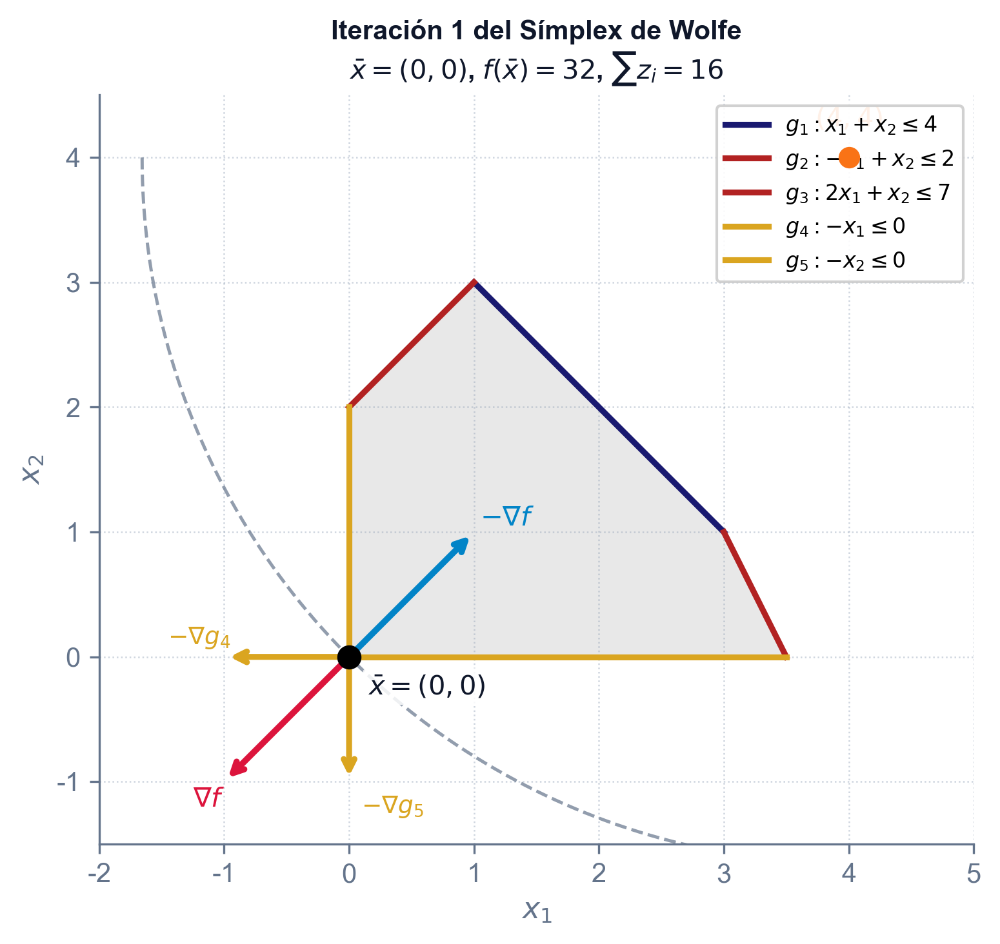
:::
:::

---

## Iteración 2: Avance sobre el eje $X_2$ (Explicación)

*   **Base**: $\{y_1, x_2, y_3, z_1, z_2\}$, con $x_2 = 2$. **Objetivo artificial**: $12$.
*   **Estado Primal**: Avance a lo largo del eje vertical hasta el vértice $\bar{x} = (0,2)$, activando $-x_1 + x_2 \le 2$ ($y_2 = 0$), con $f(0,2) = 20$.
*   **Criterio de entrada**: Entra la variable primal $x_1 \downarrow$ (coste reducidos $-4$). Las variables duales $u_1, u_3$ continúan bloqueadas por $y_1, y_3 \in \text{Base}$.
*   **Pivote**: Abandona la base $y_1 \uparrow$ en la fila 1 con pivote **2**.

---

## Iteración 2: Tabla del Símplex de Wolfe

| Base | Sol. | $x_1$ | $x_2$ | $y_1$ | $y_2$ | $y_3$ | $u_1$ | $u_2$ | $u_3$ | $v_1$ | $v_2$ | $z_1$ | $z_2$ |
|---|---|---|---|---|---|---|---|---|---|---|---|---|---|
| **$y_1$** | $2$ | **2** | $0$ | $1$ | $-1$ | $0$ | $0$ | $0$ | $0$ | $0$ | $0$ | $0$ | $0$ |
| **$x_2$** | $2$ | $-1$ | $1$ | $0$ | $1$ | $0$ | $0$ | $0$ | $0$ | $0$ | $0$ | $0$ | $0$ |
| **$y_3$** | $5$ | $3$ | $0$ | $-1$ | $-1$ | $1$ | $0$ | $0$ | $0$ | $0$ | $0$ | $0$ | $0$ |
| **$z_1$** | $8$ | $2$ | $0$ | $0$ | $0$ | $0$ | $1$ | $-1$ | $2$ | $-1$ | $0$ | $1$ | $0$ |
| **$z_2$** | $4$ | $2$ | $0$ | $0$ | $-2$ | $0$ | $1$ | $1$ | $1$ | $0$ | $-1$ | $0$ | $1$ |
| **Coste** | $12$ | $-4$ | $0$ | $0$ | $2$ | $0$ | $-2$ | $0$ | $-3$ | $1$ | $1$ | $0$ | $0$ |

---

## Iteración 2: Geometría en el Vértice $(0,2)$

::: {.columns}
::: {.column width="45%"}
*   **Estado Primal**: El punto se desplaza sobre el eje $X_2$ hasta el vértice $\bar{x} = (0,2)$, donde se activa $-x_1 + x_2 \le 2$ ($y_2 = 0$).
:::

::: {.column width="55%"}
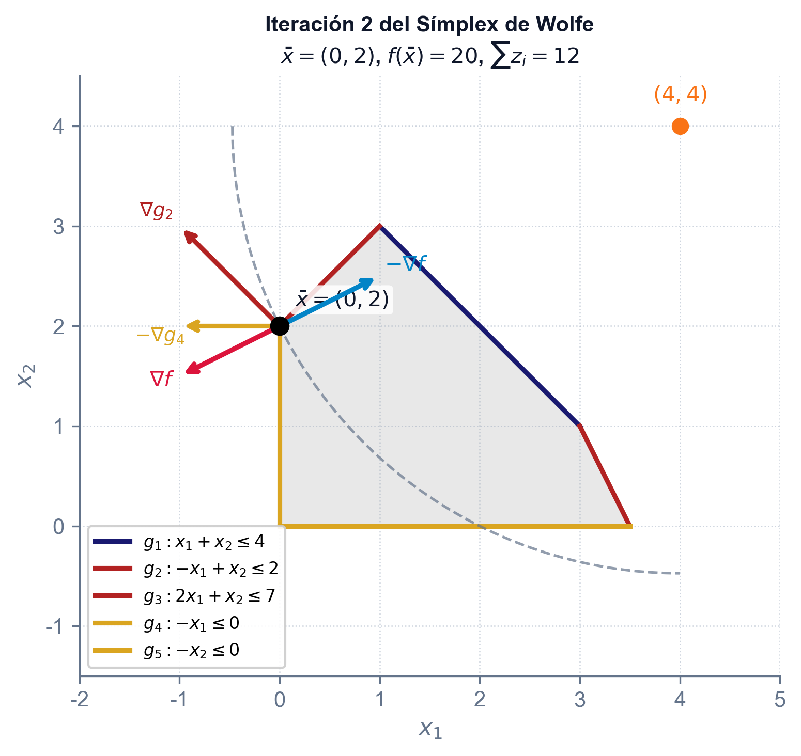
:::
:::

---

## Iteración 3: Desplazamiento a $(1,3)$ y Desbloqueo Dual

*   **Base**: $\{x_1, x_2, y_3, z_1, z_2\}$, **Objetivo artificial**: $8$.
*   **Criterio de entrada**: Al salir $y_1$ de la base en la iteración anterior, la variable dual $u_1 \downarrow$ queda libre y entra en la base (coste reducido $-2$). La variable $u_3$ sigue bloqueada por $y_3 \in \text{Base}$.
*   **Pivote**: Abandona la base la variable artificial $z_2 \uparrow$ en la fila 5 con elemento pivote **1**.

---

## Iteración 3: Tabla del Símplex de Wolfe

| Base | Sol. | $x_1$ | $x_2$ | $y_1$ | $y_2$ | $y_3$ | $u_1$ | $u_2$ | $u_3$ | $v_1$ | $v_2$ | $z_1$ | $z_2$ |
|---|---|---|---|---|---|---|---|---|---|---|---|---|---|
| **$x_1$** | $1$ | $1$ | $0$ | $1/2$ | $-1/2$ | $0$ | $0$ | $0$ | $0$ | $0$ | $0$ | $0$ | $0$ |
| **$x_2$** | $3$ | $0$ | $1$ | $1/2$ | $1/2$ | $0$ | $0$ | $0$ | $0$ | $0$ | $0$ | $0$ | $0$ |
| **$y_3$** | $2$ | $0$ | $0$ | $-5/2$ | $1/2$ | $1$ | $0$ | $0$ | $0$ | $0$ | $0$ | $0$ | $0$ |
| **$z_1$** | $6$ | $0$ | $0$ | $-1$ | $1$ | $0$ | $1$ | $-1$ | $2$ | $-1$ | $0$ | $1$ | $0$ |
| **$z_2$** | $2$ | $0$ | $0$ | $-1$ | $-1$ | $0$ | **1** | $1$ | $1$ | $0$ | $-1$ | $0$ | $1$ |
| **Coste** | $8$ | $0$ | $0$ | $2$ | $0$ | $0$ | $-2$ | $0$ | $-3$ | $1$ | $1$ | $0$ | $0$ |

---

## Iteración 3: Geometría en el Vértice $(1,3)$

::: {.columns}
::: {.column width="45%"}
*   **Estado Primal**: El candidato avanza sobre $-x_1 + x_2 = 2$ hasta alcanzar el vértice $\bar{x} = (1,3)$, donde se activa adicionalmente $x_1 + x_2 \le 4$ ($y_1 = 0$).
:::

::: {.column width="55%"}
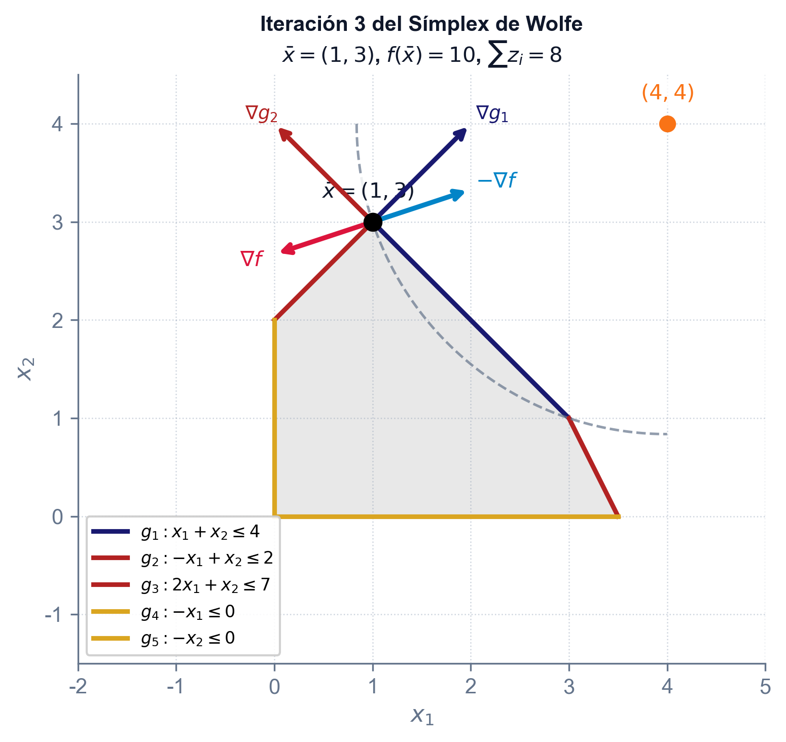
:::
:::

---

## Iteración 4: Ajuste Dual en $(1,3)$ (Explicación)

*   **Base**: $\{x_1, x_2, y_3, z_1, u_1\}$, **Objetivo artificial**: $4$.
*   **Ajuste dual**: La solución primal se mantiene estática en $\bar{x} = (1,3)$, pero $u_1$ entra en la base con valor $u_1 = 2$, eliminando $z_2$.
*   **Criterio de entrada**: Entra la variable de holgura $y_2 \downarrow$ (coste reducido $-2$).
*   **Pivote**: Sale de la base la última variable artificial $z_1 \uparrow$ en la fila 4 con pivote **2**.

---

## Iteración 4: Tabla del Símplex de Wolfe

| Base | Sol. | $x_1$ | $x_2$ | $y_1$ | $y_2$ | $y_3$ | $u_1$ | $u_2$ | $u_3$ | $v_1$ | $v_2$ | $z_1$ | $z_2$ |
|---|---|---|---|---|---|---|---|---|---|---|---|---|---|
| **$x_1$** | $1$ | $1$ | $0$ | $1/2$ | $-1/2$ | $0$ | $0$ | $0$ | $0$ | $0$ | $0$ | $0$ | $0$ |
| **$x_2$** | $3$ | $0$ | $1$ | $1/2$ | $1/2$ | $0$ | $0$ | $0$ | $0$ | $0$ | $0$ | $0$ | $0$ |
| **$y_3$** | $2$ | $0$ | $0$ | $-5/2$ | $1/2$ | $1$ | $0$ | $0$ | $0$ | $0$ | $0$ | $0$ | $0$ |
| **$z_1$** | $4$ | $0$ | $0$ | $0$ | **2** | $0$ | $0$ | $-2$ | $1$ | $-1$ | $-1$ | $1$ | $-1$ |
| **$u_1$** | $2$ | $0$ | $0$ | $-1$ | $-1$ | $0$ | $1$ | $1$ | $1$ | $0$ | $-1$ | $0$ | $1$ |
| **Coste** | $4$ | $0$ | $0$ | $0$ | $-2$ | $0$ | $0$ | $2$ | $-1$ | $1$ | $-1$ | $0$ | $2$ |

---

## Iteración 4: Geometría de Ajuste Dual en $(1,3)$

::: {.columns}
::: {.column width="45%"}
*   **Estado Primal**: El punto en el espacio primal permanece en el vértice $\bar{x} = (1,3)$ mientras se ajusta la tensión del multiplicador dual ($u_1 = 2$).
:::

::: {.column width="55%"}
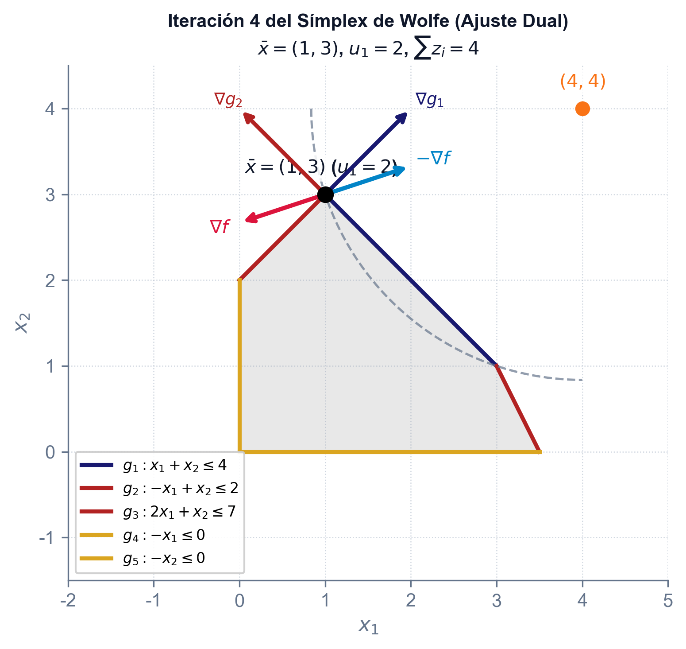
:::
:::

---

## Iteración 5: Óptimo Global y Tangencia en $(2,2)$

*   **Base óptima**: $\{x_1, x_2, y_3, y_2, u_1\}$, **Objetivo artificial**: $0$.
*   **Consecución del óptimo**: La entrada de $y_2$ permite deslizar la solución sobre la cara activa $x_1 + x_2 = 4$ hasta $\bar{x} = (2,2)$.
*   **Tangencia cuadrática**: Se alcanza la tangencia con la superficie de nivel, anulando las variables artificiales ($\sum z_i = 0$), con $u_1^* = 4$ y $f(2,2) = 8$.
*   **Criterio de parada**: Todas las variables artificiales han salido de la base y no existen costes reducidos negativos viables bajo la regla restringida.

---

## Iteración 5: Tabla Óptima Final del Símplex de Wolfe

| Base | Sol. | $x_1$ | $x_2$ | $y_1$ | $y_2$ | $y_3$ | $u_1$ | $u_2$ | $u_3$ | $v_1$ | $v_2$ | $z_1$ | $z_2$ |
|---|---|---|---|---|---|---|---|---|---|---|---|---|---|
| **$x_1$** | $2$ | $1$ | $0$ | $1/2$ | $0$ | $0$ | $0$ | $-1/2$ | $1/4$ | $-1/4$ | $1/4$ | $1/4$ | $-1/4$ |
| **$x_2$** | $2$ | $0$ | $1$ | $1/2$ | $0$ | $0$ | $0$ | $1/2$ | $-1/4$ | $1/4$ | $-1/4$ | $-1/4$ | $1/4$ |
| **$y_3$** | $1$ | $0$ | $0$ | $-5/2$ | $0$ | $1$ | $0$ | $1/2$ | $-1/4$ | $1/4$ | $-1/4$ | $-1/4$ | $1/4$ |
| **$y_2$** | $2$ | $0$ | $0$ | $0$ | $1$ | $0$ | $0$ | $-1$ | $1/2$ | $-1/2$ | $1/2$ | $1/2$ | $-1/2$ |
| **$u_1$** | $4$ | $0$ | $0$ | $-1$ | $0$ | $0$ | $1$ | $0$ | $3/2$ | $-1/2$ | $-1/2$ | $1/2$ | $1/2$ |
| **Coste** | $0$ | $0$ | $0$ | $0$ | $0$ | $0$ | $0$ | $0$ | $0$ | $0$ | $0$ | $1$ | $1$ |

---

## Iteración 5: Geometría del Óptimo Global $(2,2)$

::: {.columns}
::: {.column width="45%"}
*   **Estado Primal**: Óptimo global en $\bar{x} = (2,2)$.
*   **Tangencia Cuadrática**: $\nabla f(2,2) = -u_1^* \nabla g_1(2,2)$ con $u_1^* = 4$.
*   **Coste Mínimo**: $f(2,2) = 8$.
:::

::: {.column width="55%"}
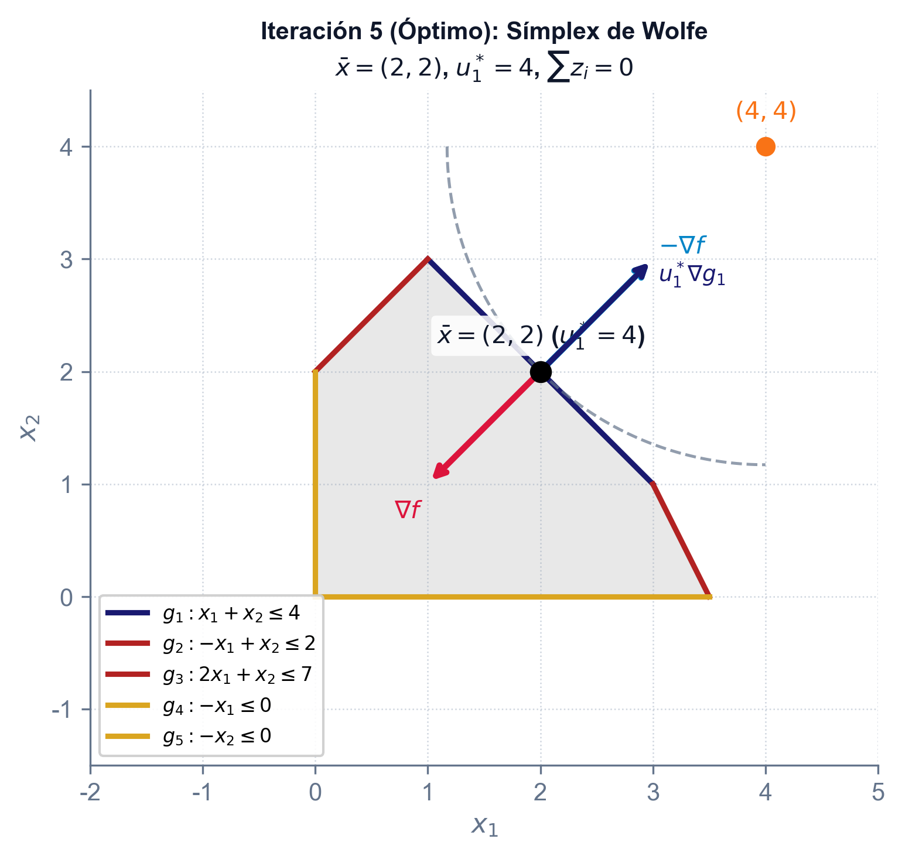
:::
:::

---

## Trayectoria geométrica completa del Símplex de Wolfe

::: {.columns}
::: {.column width="45%"}
*   **Paso 1**: Origen $(0,0)$.
*   **Paso 2**: Vértice $(0,2)$ sobre el eje $X_2$.
*   **Pasos 3-4**: Vértice $(1,3)$ con ajuste dual $u_1=2$.
*   **Paso 5**: Óptimo global $(2,2)$ sobre la arista $x_1+x_2=4$.
:::

::: {.column width="55%"}
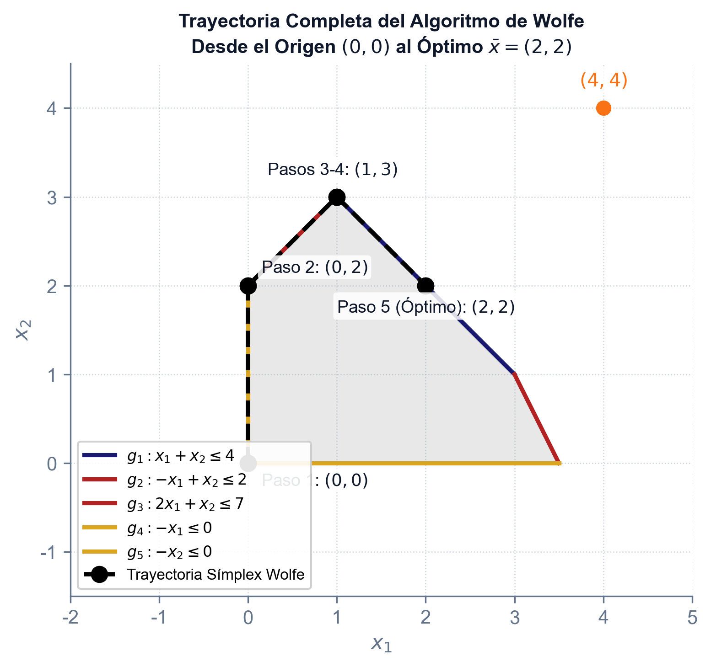
:::
:::

# Consideraciones finales

## Síntesis de la relación entre KKT, dualidad y Wolfe

En este tema se ha completado el estudio de la optimización restringida mediante las condiciones de Karush-Kuhn-Tucker (KKT) en problemas con estructura afín y cuadrática.

*   **Fundamentación de la dualidad en LP**: Las condiciones KKT no solo caracterizan las soluciones óptimas primales, sino que establecen una equivalencia directa con el problema dual. Los multiplicadores de Lagrange actúan como **precios sombra**, cuantificando la sensibilidad del valor óptimo respecto a variaciones en los términos independientes.
*   **Correspondencia geométrica primal-dual**: El análisis por casos en programación lineal demuestra que la degeneración en un espacio implica multiplicidad de soluciones en el espacio dual recíproco.

---

## Conclusión algorítmica de la programación cuadrática

*   **Estructura lineal del sistema KKT**: En problemas cuadráticos convexos ($Q \succeq 0$), el sistema KKT da lugar a un conjunto de ecuaciones lineales salvo por las restricciones bilineales de holgura complementaria ($u^T y = 0, v^T x = 0$).
*   **Eficacia del Símplex de Wolfe**: El algoritmo del Símplex de Wolfe aprovecha esta linealidad introduciendo variables artificiales y resolviendo un problema de minimización auxiliar bajo la **regla de entrada restringida**.
*   **Convergencia finita**: Esto garantiza la convergencia finita a la solución óptima global, navegando a través de los vértices y caras de la región factible poliédrica hasta alcanzar la tangencia cuadrática exacta.
