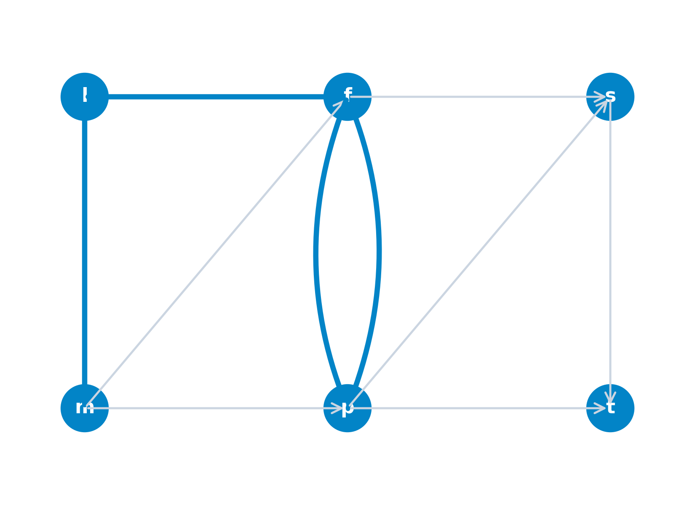
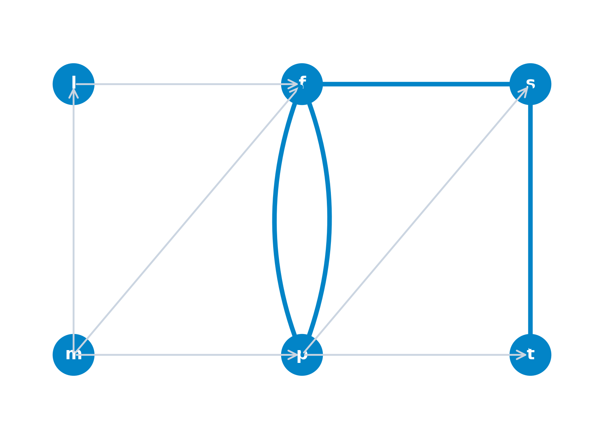
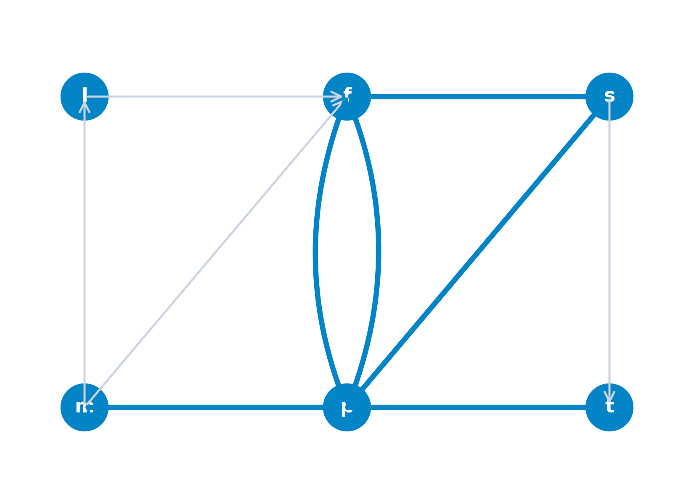

## Objetivos de aprendizaje

1. **Definir** grafos dirigidos y no dirigidos, vecindades, grados e incidencias de corte.
2. **Diferenciar** cadenas, caminos, ciclos y circuitos, y clasificar la conexidad en digrafos.
3. **Caracterizar** grafos planares y bipartitos mediante Euler, Dudeney y Kuratowski.
4. **Formular** matrices de adyacencia e incidencia (TUM), vectores ($\alpha, \beta$) y listas de adyacencia.
5. **Caracterizar** las propiedades equivalentes de árboles y el vector de padres.
6. **Aplicar** Kruskal y Prim para el MST y construir modelos de *Single-Linkage Clustering*.

# El problema de los puentes de Königsberg (Euler, 1736)

## Contexto histórico y los 7 puentes

::: {.columns}
::: {.column width="55%"}
* **Nacimiento de la Teoría de Grafos**: Formulado por Leonhard Euler en 1736.
* **Geografía urbana de Königsberg**: Cuatro regiones ($A, B, C, D$) separadas por el río Pregel y conectadas por 7 puentes de madera.
* **El Desafío**: Determinar si existe un paseo que cruce **cada uno de los 7 puentes exactamente una sola vez** y regrese al punto inicial.
:::

::: {.column width="45%"}

:::
:::

---

## Abstracción topológica de Euler

::: {.columns}
::: {.column width="50%"}

:::

::: {.column width="50%"}

:::
:::

---

## Imposibilidad del recorrido en Königsberg

::: {.columns}
::: {.column width="55%"}
* **Grado de un nodo**: Aristas incidentes en una masa de tierra.
* **Condición de tránsito**: Para no repetir puentes, todo nodo intermedio requiere grado **par**.
* **Grados en Königsberg**: $d(A)=5$, $d(B)=3$, $d(C)=3$, $d(D)=3$ (todos impares).
* **Conclusión**: Al tener 4 nodos impares, el circuito euleriano es **imposible**.
:::

::: {.column width="45%"}
::: {.callout-important title="Principio de Euler" data-kind="teorema"}
Un grafo conexo admite un circuito euleriano s.i.s. **todos sus vértices tienen grado par**.
:::
:::
:::

# Conceptos fundamentales

## Definición formal de grafos no dirigidos y digrafos

::: {.columns}
::: {.column width="50%"}
::: {.callout-note title="Definición: Grafo no dirigido" data-kind="definicion"}
Un **grafo no dirigido** $G = (V, E)$ consiste en un conjunto finito no vacío de **vértices** $V$ y un conjunto $E$ de **aristas** formadas por pares no ordenados $\{u, v\}$ con $u, v \in V$.
:::
:::

::: {.column width="50%"}
::: {.callout-note title="Definición: Grafo dirigido (Digrafo)" data-kind="definicion"}
Un **digrafo** $G = (V, U)$ consiste en un conjunto de vértices $V$ y un conjunto $U$ de **arcos** formados por tuplas ordenadas $(u, v)$ donde $u$ es el nodo origen y $v$ el nodo destino.
:::
:::
:::

---

## Ejemplo: Red de transporte aéreo

::: {.columns}
::: {.column width="55%"}
* **Modelado de infraestructuras**: Los nodos representan aeropuertos y los arcos representan vuelos directos de ida sin escala.
* **Nodos de la red**: Aeropuertos $V = \{\text{MAD}, \text{BCN}, \text{PAR}, \text{LON}\}$.
* **Arcos antiparalelos**: $(\text{PAR}, \text{BCN})$ y $(\text{BCN}, \text{PAR})$ permiten tránsito bidireccional.
:::

::: {.column width="45%"}

:::
:::

---

## Estructura abstracta de digrafos

::: {.columns}
::: {.column width="55%"}
* **Tipología de arcos orientados**:
  * **Bucles (autodirecciones)**: $(2, 2)$ en el nodo 2.
  * **Arcos antiparalelos**: Par de arcos en sentidos opuestos, como $(1, 2)$ y $(2, 1)$ o $(2, 4)$ y $(4, 2)$.
  * **Arcos simples**: Arcos dirigidos en un único sentido, como $(1, 3)$, $(2, 3)$ y $(3, 4)$.
:::

::: {.column width="45%"}

:::
:::

---

## Adyacencia y vecindades de un nodo

::: {.callout-note title="Definición: Adyacencia y vecindades" data-kind="definicion"}
Dado un digrafo $G = (V, U)$ o grafo no dirigido $G = (V, E)$ y un nodo $i \in V$:

* **Nodos adyacentes**: Dos nodos $i, j \in V$ son adyacentes si existe una conexión directa entre ellos ($(i,j) \in U$ ó $(j,i) \in U$).
* **Conjunto de Sucesores**: $\Gamma^+(i) = \{j \in V : (i, j) \in U\}$, nodos hacia los que parten arcos desde $i$.
* **Conjunto de Predecesores**: $\Gamma^-(i) = \{j \in V : (j, i) \in U\}$, nodos desde los que llegan arcos a $i$.
* **Vecindad Total**: $\Gamma(i) = \Gamma^+(i) \cup \Gamma^-(i)$, conjunto combinado de sucesores y predecesores de $i$.
:::

---

## Incidencia de arcos

::: {.callout-note title="Definición: Incidencia de arcos" data-kind="definicion"}
Dado un digrafo $G = (V, U)$ o grafo no dirigido $G = (V, E)$:

* **Arcos adyacentes**: Dos arcos $u_1, u_2 \in U$ son adyacentes cuando comparten al menos un nodo extremo común (por ejemplo, los arcos $(1, 2)$ y $(2, 4)$ en el nodo $2$).
* **Incidencia de salida**: Un arco $u = (i, j) \in U$ es **incidente de salida** en su nodo origen $i$.
* **Incidencia de entrada**: Un arco $u = (i, j) \in U$ es **incidente de entrada** en su nodo destino $j$.
:::

---

## Semigrados exterior e interior

::: {.callout-note title="Definición: Semigrados exterior e interior" data-kind="definicion"}
Dado un digrafo $G = (V, U)$ y un nodo $i \in V$:

* **Semigrado exterior**:
  $$d^+(i) = |\Gamma^+(i)|$$
  Número exacto de arcos salientes que parten del nodo $i$.

* **Semigrado interior**:
  $$d^-(i) = |\Gamma^-(i)|$$
  Número exacto de arcos entrantes que ingresan en el nodo $i$.
:::

---

## Grado total y nodos notables

::: {.callout-note title="Definición: Grado total y nodos notables" data-kind="definicion"}
Dado un grafo $G = (V, E)$ o digrafo $G = (V, U)$ y un nodo $i \in V$:

* **Grado total**:
  $$d(i) = d^+(i) + d^-(i)$$
  Número total de arcos o aristas incidentes en el nodo $i$.
* **Nodo pendiente o hoja**: Nodo con grado total exactamente igual a 1 ($d(i) = 1$).
* **Nodo aislado**: Nodo desprovisto de conexiones incidentes ($d(i) = 0$).
:::

---

## Ilustración de vecindades y semigrados

::: {.columns}
::: {.column width="50%"}
* **Vecindad del nodo 3**:
  * Sucesores: $\Gamma^+(3) = \{2\}$
  * Predecesores: $\Gamma^-(3) = \{1, 4\}$
  * Vecindad total: $\Gamma(3) = \{1, 2, 4\}$
:::

::: {.column width="50%"}
* **Semigrados y Nodos notables**:
  * Entrada y salida: $d^+(3)=1, d^-(3)=2$
  * Grado total: $d(3) = 1 + 2 = 3$
  * Nodo 5: $d^+(5)=0, d^-(5)=1 \implies d(5)=1$
:::
:::

::: {.columns}
::: {.column width="50%"}
{height="250px" fig-align="center"}
:::

::: {.column width="50%"}
{height="250px" fig-align="center"}
:::
:::

---

## Lema del apretón de manos (Handshaking Lemma)

::: {.columns}
::: {.column width="60%"}
::: {.callout-important title="Teorema de la suma de grados (Handshaking Lemma)" data-kind="teorema"}
En todo grafo no dirigido $G = (V, E)$ con $|V| = n$ vértices y $|E| = m$ aristas, la suma de los grados de todos los vértices es igual al doble del número total de aristas:
$$
\sum_{v \in V} d(v) = 2m
$$
:::
:::

::: {.column width="40%"}
* **Significado combinatorio**:
  * Cada arista no dirigida conecta exactamente dos vértices extremos.
  * Al sumar los grados de todos los nodos, cada arista se contabiliza exactamente dos veces (apretón de manos de dos extremos).
:::
:::

---

## Incidencia de conjuntos de nodos y cortes

::: {.callout-note title="Definición: Incidencia y corte de un conjunto A" data-kind="definicion"}
Dado un digrafo $G = (V, U)$ y un subconjunto propio de nodos $A \subset V$:

* **Incidencia Exterior $w^+(A)$**: Conjunto de arcos que parten de $A$ y finalizan fuera de $A$:  
  $w^+(A) = \{(i, j) \in U : i \in A, \, j \in V \setminus A\}$

* **Incidencia Interior $w^-(A)$**: Conjunto de arcos que parten de fuera de $A$ e ingresan en $A$:  
  $w^-(A) = \{(i, j) \in U : i \in V \setminus A, \, j \in A\}$

* **Corte $w(A)$**: Unión de las incidencias exterior e interior de la frontera:  
  $w(A) = w^+(A) \cup w^-(A)$
:::

---

## Ejemplo: Corte e incidencias para A = {2, 3}

::: {.columns}
::: {.column width="55%"}
Para el subconjunto de nodos $A = \{2, 3\}$:

* **Incidencia exterior** (salientes de $A$):
  $$\textcolor{firebrick}{w^+(A) = \{(2,4), (3,1), (3,5)\}}$$
* **Incidencia interior** (entrantes a $A$):
  $$\textcolor{dodgerblue}{w^-(A) = \{(1,2), (4,3)\}}$$
* **Corte total** (frontera cruzada):
  $$
  \begin{aligned}
  w(A) = \{ &\textcolor{dodgerblue}{(1,2)}, \textcolor{firebrick}{(2,4)}, \textcolor{firebrick}{(3,1)}, \\
            &\textcolor{firebrick}{(3,5)}, \textcolor{dodgerblue}{(4,3)} \}
  \end{aligned}
  $$
:::

::: {.column width="45%"}

:::
:::

---

## Multigrafos y p-grafos

::: {.columns}
::: {.column width="55%"}
::: {.callout-note title="Definición: Multigrafo y p-grafo" data-kind="definicion"}
* **Multigrafo / Multidigrafo**: Admite múltiples conexiones o aristas en paralelo entre un mismo par de vértices.
* **Multiplicidad**: Número exacto de conexiones paralelas entre dos nodos.
* **$p$-Grafo**: Multigrafo en el que la máxima multiplicidad de cualquier par de nodos es $p$.
:::
:::

::: {.column width="45%"}

:::
:::

---

## Grafos simples

::: {.callout-note title="Definición: Grafo simple" data-kind="definicion"}
Un **grafo simple** (o **digrafo simple**) es un grafo de multiplicidad 1 desprovisto de autodirecciones o bucles $(i, i)$.

* **Propiedad de exclusión**:
  * Para cualquier par de vértices $i, j \in V$, existe como máximo una única arista $\{i, j\} \in E$ (o un único arco $(i, j) \in U$).
  * Ningún nodo está conectado consigo mismo mediante un bucle $(i, i) \notin U$.
:::

---

## Grafos completos (no dirigidos) y Clanes ($K_n$)

::: {.columns}
::: {.column width="55%"}
::: {.callout-note title="Definición: Grafo completo y Clan Kn" data-kind="definicion"}
Un **grafo completo** $G = (V, E)$ (o **clan / clique** $K_n$) es un grafo simple no dirigido en el que todo par de vértices distintos se encuentra directamente conectado por una arista:
$$
\{i, j\} \in E, \quad \forall i \neq j \in V
$$
:::

* **Número total de aristas**: $m = \binom{n}{2} = \frac{n(n-1)}{2}$.
:::

::: {.column width="45%"}
::: {.columns}
::: {.column width="50%"}
{width="90%" fig-align="center"}
:::
::: {.column width="50%"}
{width="90%" fig-align="center"}
:::
:::
:::
:::

---

## Digrafos completos

::: {.columns}
::: {.column width="55%"}
::: {.callout-note title="Definición: Digrafo completo" data-kind="definicion"}
Un digrafo $G = (V, U)$ se dice **completo** si para todo par de vértices distintos $i \neq j$, la ausencia de un arco en una dirección implica la existencia obligatoria del arco en sentido inverso:
$$
(i, j) \notin U \implies (j, i) \in U \quad (\forall i \neq j)
$$
:::

* **Interpretación orientada**: Se garantiza al menos un sentido de comunicación directa entre cualquier pareja de vértices.
:::

::: {.column width="45%"}

:::
:::

---

## Grafo base original de referencia $G = (V, U)$

::: {.columns}
::: {.column width="50%"}
* **Digrafo original de referencia**: Red orientada $G = (V, U)$ compuesta por $n=5$ nodos ($V=\{1,2,3,4,5\}$) y 7 arcos.
* **Operaciones de subestructura**: A partir de esta red base se definen:
  * **Subgrafos inducidos**: Selección de un subconjunto de nodos $A \subset V$.
  * **Grafos parciales**: Selección de un subconjunto de arcos $W \subset U$.
:::

::: {.column width="50%"}

:::
:::

---

## Subgrafos inducidos (por nodos)

::: {.columns}
::: {.column width="55%"}
::: {.callout-note title="Definición: Subgrafo inducido" data-kind="definicion"}
Dado $G = (V, U)$ y un subconjunto de vértices $A \subset V$, el **subgrafo inducido** $G_A = (A, U_A)$ conserva únicamente los nodos de $A$ y los arcos con ambos extremos en $A$:
$$
U_A = \{(i, j) \in U : i, j \in A\}
$$
:::

* **Ejemplo para $A=\{1,2,5\}$**: Los nodos $\{3, 4\}$ y sus arcos incidentes desaparecen por completo respecto a la red base $G$.
:::

::: {.column width="45%"}

:::
:::

---

## Grafos parciales (por arcos)

::: {.columns}
::: {.column width="55%"}
::: {.callout-note title="Definición: Grafo parcial" data-kind="definicion"}
Dado $G = (V, U)$ y un subconjunto de arcos $W \subset U$, el **grafo parcial** $G(W) = (V, W)$ conserva los $n$ vértices de $V$, restringiendo los arcos a $W$.
:::

* **Ejemplo para $W=\{(1,2),(2,4),(5,4)\}$**: Los $n=5$ nodos de $G$ se preservan intactos. El nodo 3 permanece presente como **nodo aislado** ($d(3)=0$).
:::

::: {.column width="45%"}

:::
:::

---

## Grafo complementario ($\bar{G}$)

::: {.columns}
::: {.column width="50%"}
::: {.callout-note title="Definición: Grafo complementario" data-kind="definicion"}
Dado un grafo simple $G = (V, E)$, su **grafo complementario** $\bar{G} = (V, \bar{E})$ mantiene los mismos vértices y contiene exactamente las aristas no presentes en $E$:
$$
\{i, j\} \in \bar{E} \iff \{i, j\} \notin E \quad (\forall i \neq j)
$$
:::
:::

::: {.column width="50%"}

:::
:::

# Recorridos y conectividad en redes

## Recorridos en redes: Cadenas vs Caminos

::: {.callout-warning title="Diferencia conceptual fundamental" data-kind="advertencia"}
* **Cadena $\mu$**: Secuencia de arcos adyacentes $\mu = (u_1, u_2, \dots, u_q)$ entre dos nodos que **no exige respetar la orientación de las flechas** (se pueden transitar en cualquier sentido). Caracteriza la **conectividad sintáctica/topológica**.
* **Camino $P$**: Secuencia de arcos orientados donde **todos los arcos se transitan strictly a favor de su sentido** ($u_k$ finaliza donde $u_{k+1}$ comienza). Caracteriza la **posibilidad real de transporte o flujo**.
* **En redes no dirigidas**, las nociones de cadena y camino resultan formalmente equivalentes.
:::

---

## Propiedades de recorridos: Elementalidad y Simplicidad

::: {.callout-note title="Definición: Elementalidad y Simplicidad" data-kind="definicion"}
Dado un digrafo $G = (V, U)$ o grafo $G = (V, E)$:

* **Elemental**: Una cadena o camino es **elemental** si **no repite ningún vértice** en su secuencia.
* **Simple**: Una cadena o camino es **simple** si **no repite ningún arco o arista** en su secuencia.
:::

* **Red de aeropuertos de referencia**: $V = \{m, l, p, f, s, t\}$ (Madrid, Londres, París, Frankfurt, Singapur, Tokio).

---

## Ejemplo 1: Cadena elemental y simple ($\mu^1$)

::: {.columns}
::: {.column width="50%"}
* **Cadena $\mu^1[m, p]$ de longitud $q=3$**:
  $$\mu^1 = \{(m, l), (l, f), (p, f)\}$$
* Recorre $\{m, l, f, p\}$ sin repetir ninguno $\implies$ **Elemental**.
* Transita por 3 arcos distintos $\implies$ **Simple**.
* El arco $(p, f)$ en sentido inverso $\implies$ Es una **cadena** (no un camino).
:::

::: {.column width="50%"}

:::
:::

---

## Ejemplo 2: Camino elemental y simple ($\mu^2$)

::: {.columns}
::: {.column width="50%"}
* **Camino $\mu^2[p, t]$ de longitud $q=3$**:
  $$\mu^2 = \{(p, f), (f, s), (s, t)\}$$
* Todos los arcos en sentido directo ($p \to f \to s \to t$) $\implies$ Es un **camino**.
* No repite ningún vértice $\implies$ **Elemental**.
* No repite ningún arco $\implies$ **Simple**.
:::

::: {.column width="50%"}

:::
:::

---

## Ejemplo 3: Cadena simple no elemental ($\mu^3$)

::: {.columns}
::: {.column width="50%"}
* **Cadena $\mu^3[m, p]$ de longitud $q=5$**:
  $$
  \begin{aligned}
  \mu^3 = \{ &(m, p), (p, f), (f, s), \\
             &(p, s), (p, t) \}
  \end{aligned}
  $$
* Visita el nodo París ($p$) dos veces ($m \to p \to f \to s \to p \to t$) $\implies$ **No elemental**.
* No repite ninguno de sus 5 arcos $\implies$ **Simple**.
:::

::: {.column width="50%"}

:::
:::

---

## Ejemplo 4: Cadena ni elemental ni simple ($\mu^4$)

::: {.columns}
::: {.column width="50%"}
* **Cadena $\mu^4$ de longitud $q=6$**:
  $$
  \begin{aligned}
  \mu^4 = \{ &(l, f), (f, s), (p, s), \\
             &(p, f), (f, s), (s, t) \}
  \end{aligned}
  $$
* Visita nodos repetidos ($f, s, p$) $\implies$ **No elemental**.
* Duplica el tránsito por el arco $(f, s)$ dos veces $\implies$ **No simple**.
:::

::: {.column width="50%"}

:::
:::

---

## Ejemplo: Clasificación de cadenas (Análisis analítico)

Evaluación sobre un grafo no dirigido de 5 vértices $V = \{1, 2, 3, 4, 5\}$:

1. **Cadena $\mu_1 = \{\{1,2\}, \{2,3\}, \{3,4\}, \{4,5\}\}$**:
   * Visita 5 vértices distintos sin repetir ninguno $\implies$ **Elemental y simple**.
2. **Cadena $\mu_2 = \{\{1,2\}, \{2,3\}, \{3,4\}, \{4,2\}, \{2,5\}\}$**:
   * Recorre 5 aristas distintas sin repetir ninguna, pero visita el nodo 2 dos veces $\implies$ **Simple pero no elemental**.
3. **Cadena $\mu_3 = \{\{1,2\}, \{2,4\}, \{4,3\}, \{3,2\}, \{2,1\}\}$**:
   * Repite el nodo 2 y duplica la arista $\{1,2\}$ $\implies$ **Ni elemental ni simple**.

---

## Ejemplo: Clasificación de cadenas (Animación)

<iframe src="../images/cadenas_clasificacion_player.html" style="width:100%; height:520px; border:none; display:block; margin:0 auto;" scrolling="no"></iframe>

---

## Ejemplo: Clasificación de caminos dirigidos (Análisis analítico)

Evaluación sobre una red dirigida de 7 vértices $V = \{a, b, c, d, e, f, g\}$:

1. **Camino $P_1 = ((a,b), (b,c), (c,e), (e,f))$**:
   * Transita en sentido directo por 5 vértices distintos y 4 arcos distintos $\implies$ **Elemental y simple**.
2. **Camino $P_2 = ((c,g), (g,f), (f,b), (b,c), (c,e))$**:
   * No repite arcos, pero el nodo $c$ se visita dos veces ($c \to g \to f \to b \to c \to e$) $\implies$ **Simple pero no elemental**.
3. **Camino $P_3 = ((c,e), (e,f), (f,b), (b,c), (c,e), (e,g))$**:
   * Repite vértices ($c, e$) y duplica el arco $(c,e)$ $\implies$ **Ni elemental ni simple**.

---

## Ejemplo: Clasificación de caminos dirigidos (Animación)

<iframe src="../images/caminos_clasificacion_player.html" style="width:100%; height:520px; border:none; display:block; margin:0 auto;" scrolling="no"></iframe>

---

## Métricas de alcance y Diámetro $D(G)$

::: {.columns}
::: {.column width="50%"}
::: {.callout-note title="Definición: Distancia y Diámetro" data-kind="definicion"}
* **Longitud**: Número de arcos $q$ en la cadena.
* **Distancia geodésica $d(i, j)$**: Longitud de la cadena más corta entre $i$ y $j$.
* **Diámetro $D(G)$**: Mayor distancia geodésica entre cualquier par de nodos:
  $$
  D(G) = \max_{i, j \in V} d(i, j)
  $$
:::
:::

::: {.column width="50%"}

* En esta red de 5 nodos, la máxima distancia geodésica requerida para comunicar cualquier par es de 2 arcos $\implies D(G) = 2$.
:::
:::

---

## Conectividad y conexidad fuerte

::: {.callout-note title="Definición: Grafo conexo y conexidad fuerte" data-kind="definicion"}
Dado un grafo $G = (V, E)$ o digrafo $G = (V, U)$:

* **Grafo conexo (no dirigido)**: Existe al menos una **cadena** entre cualquier par de vértices.
* **Digrafo fuertemente conexo**: Existe al menos un **camino dirigido en ambos sentidos** (de $i$ a $j$ y de $j$ a $i$) entre cualquier par de vértices.
* **Digrafo débilmente conexo**: Su grafo no dirigido subyacente es conexo (existen cadenas), pero carece de caminos dirigidos bidireccionales.
:::

---

## Ejemplo: Evaluación de conexidad en digrafos

::: {.columns}
::: {.column width="50%"}
* **Análisis de la red de 7 vértices**:
  * **Conexidad débil**: La red es **débilmente conexa** al existir cadenas no orientadas entre todo par de vértices.
  * **Fallo de conexidad fuerte**: La red **no es fuertemente conexa** porque el nodo $d$ es un **sumidero** al que solo llegan arcos entrantes desde $a, c, g$, sin caminos salientes hacia los demás nodos.
:::

::: {.column width="50%"}

:::
:::

---

## Componentes conexas como relación de equivalencia

::: {.columns}
::: {.column width="55%"}
::: {.callout-note title="Definición: Relación R de conexidad" data-kind="definicion"}
$i \, R \, j \iff \exists \text{ cadena entre } i \text{ y } j$.

Es una **relación de equivalencia**:

1. **Reflexiva**: $i \, R \, i$ (cadena de longitud 0).
2. **Simétrica**: $i \, R \, j \implies j \, R \, i$.
3. **Transitiva**: $i \, R \, j \land j \, R \, k \implies i \, R \, k$.

Las clases de equivalencia definen las **componentes conexas**.
:::
:::

::: {.column width="45%"}

* Grafo descompuesto en 2 componentes conexas disjuntas.
:::
:::

---

## Ciclos, circuitos y árboles

::: {.columns}
::: {.column width="50%"}
::: {.callout-note title="Definición: Recorridos cerrados" data-kind="definicion"}
* **Ciclo**: Cadena simple cerrada ($v_0 = v_k$).
* **Circuito**: Camino simple cerrado ($v_0 = v_k$).
* **Bucle**: Ciclo de un solo arco/arista $(i, i)$.
* **Árbol**: Grafo conexo acíclico.
:::
:::

::: {.column width="50%"}

* Izquierda: Grafo con ciclo en triángulo.
* Derecha: Árbol en estrella acíclico.
:::
:::

---

## Teorema de estructura de ciclos y hojas

::: {.callout-important title="Propiedades estructurales" data-kind="teorema"}
Para todo grafo conexo $G = (V, E)$ con $n > 1$:

1. **Ausencia de hojas**: Si todos los vértices tienen grado $d(v) \ge 2$, $G$ contiene **al menos un ciclo**.
2. **Existencia de hojas**: Todo árbol conexo contiene **al menos un vértice pendiente** (hoja con $d(v) = 1$).
3. **Aristas en ciclos**: Una arista $e$ pertenece a un ciclo si y solo si $G \setminus \{e\}$ sigue siendo conexo.
:::

# Grafos planares y bipartitos

## Grafos planares y regiones

::: {.columns}
::: {.column width="50%"}
::: {.callout-note title="Definición: Grafo planar e incrustación" data-kind="definicion"}
* **Grafo Planar**: Admite un dibujo en $\mathbb{R}^2$ sin intersecciones entre aristas.
* **Incrustación planar**: Dibujo sin cruces que divide el plano en $r$ **caras/regiones** (incluyendo 1 región exterior no acotada).
:::
:::

::: {.column width="50%"}

* El clan $K_4$ es **planar** al incrustar el nodo $a$ dentro de la región $\{b,c,d\}$.
:::
:::

---

## Acertijo de August Möbius (1840): El Rey y sus 5 Hijos

::: {.callout-note title="Testamento del Rey (Acertijo de August Möbius, 1840)" data-kind="definicion"}
> *"Un rey ordenó en su testamento que, tras su muerte, su reino fuera dividido entre sus 5 hijos en 5 regiones contiguas de forma que cada región tuviera frontera común con todas las demás 4 regiones. ¿Es posible cumplir la voluntad del rey?"*
:::

* **Pregunta fundamental**: ¿Puede existir un mapa plano dividido en 5 regiones adyacentes donde todas compartan frontera común con las otras cuatro?

---

## El Acertijo de Möbius y la no planaridad de $K_5$

::: {.columns}
::: {.column width="55%"}
* **Formulación mediante teoría de redes**:
  * Cumplir el testamento exige que el grafo dual de fronteras sea un **grafo completo de 5 vértices ($K_5$)**.
  * $K_5$ integra $n=5$ vértices y $m = \frac{5 \times 4}{2} = 10$ aristas.
* **Resultado matemático**:
  * La respuesta es **negativa**.
  * $K_5$ es un **grafo no planar**: cualquier intento de incrustar sus 10 aristas en el plano produce al menos un cruce inevitable.
:::

::: {.column width="45%"}

:::
:::

---

## Grafos bipartitos y Bipartitos completos

::: {.callout-note title="Definición: Grafo bipartito y bipartito completo" data-kind="definicion"}
Un grafo $G = (V, E)$ es **bipartito** si su conjunto de vértices admite una partición en dos subconjuntos disjuntos:
$$
V = V_1 \cup V_2, \quad V_1 \cap V_2 = \emptyset
$$
tal que toda arista conecta un vértice de $V_1$ con un vértice de $V_2$.

* **Bipartito Completo $K_{n_1, n_2}$**: Contiene todas las $n_1 \cdot n_2$ aristas entre $V_1$ y $V_2$.
:::

::: {.callout-important title="Caracterización" data-kind="teorema"}
Un grafo es bipartito $\iff$ **no contiene ningún ciclo de longitud impar**.
:::

---

## Problema de los tres servicios de Dudeney (1917)

::: {.callout-note title="Acertijo de Henry Ernest Dudeney (1917)" data-kind="definicion"}
> *"¿Es posible canalizar las conducciones subterráneas de tres suministros esenciales (agua, gas y electricidad) hacia tres viviendas independientes de modo que ninguna tubería o cable se cruce con otro en el plano?"*
:::

* **Pregunta fundamental**: ¿Es posible conectar 3 fuentes de suministro ($A, G, E$) a 3 casas ($C_1, C_2, C_3$) sin que los tendidos de tuberías o cables se intercepten en el plano?

---

## El Problema de Dudeney y la no planaridad de $K_{3,3}$

::: {.columns}
::: {.column width="55%"}
* **Formulación mediante teoría de redes**:
  * Modela la incrustación del **grafo bipartito completo $K_{3,3}$** ($n_1=3$ suministros, $n_2=3$ casas, $m = 3 \times 3 = 9$ aristas).
* **Resultado matemático**:
  * La respuesta al acertijo es **negativa**.
  * $K_{3,3}$ es un **grafo no planar**: tras trazar 8 conducciones, la novena queda atrapada en una cara acotada sin poder completarse sin cruzar una tubería previa.
:::

::: {.column width="45%"}

:::
:::

---

## Homeomorfismo y Teorema de Kuratowski (1930)

::: {.columns}
::: {.column width="50%"}
::: {.callout-note title="Definición: Homeomorfismo" data-kind="definicion"}
Dos grafos son **homeomórficos** si se obtienen uno del otro mediante subdivisión elemental de aristas (insertar/suprimir nodos de grado 2).
:::

::: {.callout-important title="Teorema de Kuratowski (1930)" data-kind="teorema"}
Un grafo $G$ es **planar** $\iff$ **no contiene ningún subgrafo homeomórfico a $K_5$ ni a $K_{3,3}$**.
:::
:::

::: {.column width="50%"}

:::
:::

---

## Demostración: Grafo de Petersen

::: {.columns}
::: {.column width="50%"}
* **Grafo de Petersen**: Grafo 3-regular con 10 vértices y 15 aristas.
* **No planaridad**: Contiene un subgrafo parcial homeomórfico a $K_{3,3}$.
* **Subdivisión**: Nodos rojos $V_1 = \{j, a, d\}$, nodos azules $V_2 = \{e, f, b\}$. Vértices $g, h, i, c$ actúan de grado 2.
:::

::: {.column width="50%"}

:::
:::

---

## Fórmula planar de Euler

::: {.columns}
::: {.column width="60%"}
::: {.callout-important title="Fórmula planar de Euler" data-kind="teorema"}
En todo grafo planar conexo con $n$ vértices, $m$ aristas y $r$ regiones (incluyendo la cara exterior no acotada):
$$
n + r = m + 2
$$
:::
:::

::: {.column width="40%"}
* **Significado geométrico**:
  * Relación invariante entre vértices, aristas y caras sobre la superficie del plano.
  * Permite deducir las cotas superiores absolutas sobre la densidad de aristas en grafos planares.
:::
:::

---

## Corolarios de la Fórmula de Euler

::: {.callout-note title="Corolario: Desigualdades de planaridad" data-kind="corolario"}
1. En todo grafo planar conexo simple con $n \ge 3$:
   $$
   m \le 3n - 6
   $$
2. En todo grafo planar conexo simple **bipartito** (sin triángulos):
   $$
   m \le 2n - 4
   $$
:::

---

## Ejemplo: Prueba analítica de no planaridad

::: {.columns}
::: {.column width="50%"}
* **Prueba para $K_5$ ($n=5, m=10$)**:
  * Condición de planaridad para $n \ge 3$:
    $$m \le 3n - 6$$
  * Evaluación:
    $$10 \le 3(5) - 6 = 9 \quad \text{(FALSO)}$$
  * **Conclusión**: $K_5$ es **no planar**.
:::

::: {.column width="50%"}
* **Prueba para $K_{3,3}$ ($n=6, m=9$)**:
  * Grafo bipartito sin triángulos:
    $$m \le 2n - 4$$
  * Evaluación:
    $$9 \le 2(6) - 4 = 8 \quad \text{(FALSO)}$$
  * **Conclusión**: $K_{3,3}$ es **no planar**.
:::
:::

# Representación de grafos

## Matriz de incidencia (Grafo no dirigido)

::: {.columns}
::: {.column width="58%"}
::: {.callout-note title="Definición: Matriz de incidencia nodo-arista" data-kind="definicion"}
Dada una red no dirigida $G = (V, E)$, la **matriz de incidencia** $A \in \mathbb{R}^{n \times m}$ se define como:
$$
\small
a_{ik} = \begin{cases} 
1 & \text{si } i \text{ es extremo de arista } e_k \\
0 & \text{en otro caso}
\end{cases}
$$
:::
:::

::: {.column width="42%"}
{width="90%" fig-align="center"}
:::
:::

* **Suma por columnas**: Toda columna de $A$ suma exactamente $2$ (cada arista posee $2$ extremos).

---

## Matriz de incidencia (Digrafo y TUM)

::: {.columns}
::: {.column width="58%"}
::: {.callout-note title="Definición: Matriz de incidencia nodo-arco" data-kind="definicion"}
Dado un digrafo $G = (V, U)$, la matriz $A \in \mathbb{R}^{n \times m}$ registra la orientación:
$$
\small
a_{ik} = \begin{cases} 
+1 & \text{si } i \text{ es el origen del arco } u_k \\
-1 & \text{si } i \text{ es el destino del arco } u_k \\
0 & \text{en otro caso}
\end{cases}
$$
:::
:::

::: {.column width="42%"}
{width="90%" fig-align="center"}
:::
:::

* **Propiedad de Total Unimodularidad (TUM)**: Todo subdeterminante es $0, \pm 1$, garantizando soluciones enteras en flujos.

---

## Matriz de adyacencia (Grafo no dirigido)

::: {.columns}
::: {.column width="58%"}
::: {.callout-note title="Definición: Matriz de adyacencia no dirigida" data-kind="definicion"}
Dado un grafo simple no dirigido $G = (V, E)$, la **matriz de adyacencia** $B \in \mathbb{R}^{n \times n}$ se define como:
$$
\small
b_{ij} = \begin{cases} 
1 & \text{si } \{i, j\} \in E \\
0 & \text{en otro caso}
\end{cases}
$$
:::
:::

::: {.column width="42%"}
{width="90%" fig-align="center"}
:::
:::

* **Matriz simétrica**: $B = B^T$ con ceros en la diagonal ($b_{ii} = 0$).

---

## Matriz de adyacencia (Digrafo)

::: {.columns}
::: {.column width="58%"}
::: {.callout-note title="Definición: Matriz de adyacencia orientada" data-kind="definicion"}
Dado un digrafo $G = (V, U)$, la matriz $B \in \mathbb{R}^{n \times n}$ es asimétrica:
$$
\small
b_{ik} = \begin{cases} 
1 & \text{si } (i, k) \in U \\
0 & \text{en otro caso}
\end{cases}
$$
:::
:::

::: {.column width="42%"}
{width="90%" fig-align="center"}
:::
:::

* **Conteo de caminos**: El elemento $(B^p)_{ik}$ de la potencia $B^p$ indica el número exacto de caminos de longitud $p$ entre los nodos $i$ y $k$.

---

## Motivación: Redes dispersas y almacenamiento

* **Inconveniente de matrices densas**:
  En redes dispersas (donde el número de arcos es mucho menor que el cuadrado de nodos, $m \ll n^2$), las matrices de adyacencia o incidencia almacenan más del $99\%$ de entradas nulas (ceros).

* **Almacenamiento lineal eficiente**:
  Para optimizar el uso de memoria y la velocidad de cómputo, las matrices se sustituyen por dos vectores unidimensionales de dimensión reducida:
  * **Vector $\beta$** (dimensión $m$): Almacena los nodos de destino.
  * **Vector $\alpha$** (dimensión $n+1$): Almacena los punteros de inicio.

---

## Esquema de punteros ($\alpha, \beta$) en digrafos

::: {.columns}
::: {.column width="50%"}
* **Vector $\beta$** (dimensión $m$):
  Contiene los nodos de destino $j$ de todos los arcos $(i, j) \in U$, agrupados en orden lexicográfico según el nodo origen $i$.

* **Vector $\alpha$** (dimensión $n+1$):
  Punteros que indican la posición en $\beta$ donde comienzan los arcos salientes de cada nodo $i$.
  * **Condición de cierre**: $\alpha(n+1) = m + 1$.
:::

::: {.column width="50%"}

:::
:::

---

## Ejemplo: Evaluación de vectores ($\alpha, \beta$) en redes

::: {.columns}
::: {.column width="50%"}
* **Recurrencia regresiva para $\alpha$**:
  $$
  \alpha(k) = \alpha(k+1) - d^+(k)
  $$
  con la condición inicial $\alpha(n+1) = m + 1$.

* **Evaluación en la red ($n=6, m=10$)**:
  * Condición inicial: $\alpha(7) = 10 + 1 = 11$.
  * Vector de destinos $\beta \in \mathbb{R}^{10}$.
  * Vector de punteros resultante:
    $$\alpha = (1, 4, 5, 7, 10, 11, 11)$$
:::

::: {.column width="50%"}

:::
:::

---

## Representación vectorial en grafos no dirigidos

::: {.columns}
::: {.column width="50%"}
* **Descomposición bidireccional**:
  En grafos no dirigidos $G = (V, E)$, cada arista $\{i, j\}$ se descompone en dos arcos orientados opuestos $(i, j)$ y $(j, i)$.

* **Dimensiones de los vectores**:
  * **Vector $\beta$**: Duplica su dimensión a $2m$ elementos para registrar ambas direcciones.
  * **Vector $\alpha$**: Mantiene la dimensión $n+1$ con $\alpha(n+1) = 2m + 1$.
:::

::: {.column width="50%"}

:::
:::

---

## Listas de adyacencia en digrafos

::: {.columns}
::: {.column width="50%"}
* **Estructura dinámica**:
  Arreglo de punteros $\text{Adj}[i]$ donde cada nodo $i$ encadena la lista de sus nodos sucesores $\Gamma^+(i)$.

* **Propiedades computacionales**:
  * **Memoria óptima**: Complejidad espacial $O(n + m)$.
  * **Eficiencia dinámica**: Permite insertar y eliminar arcos de forma dinámica con tiempo $O(1)$.
:::

::: {.column width="50%"}

:::
:::

---

## Listas de adyacencia en grafos no dirigidos

::: {.columns}
::: {.column width="50%"}
* **Listas enlazadas recíprocas**:
  En grafos no dirigidos $G = (V, E)$, cada arista no dirigida $\{u, v\}$ genera dos entradas recíprocas en las estructuras enlazadas:
  * El nodo $v$ se añade a la lista $\text{Adj}[u]$.
  * Simétricamente, el nodo $u$ se incorpora a la lista $\text{Adj}[v]$.

* **Ejemplo sobre $V = \{a, b, c, d, e\}$**:
  Representación en red de 5 vértices con conexiones simétricas bidireccionales.
:::

::: {.column width="50%"}

:::
:::

# Estructura matemática de los árboles

## Definición de Árbol y Bosque

::: {.columns}
::: {.column width="50%"}
::: {.callout-note title="Definición: Árbol y bosque" data-kind="definicion"}
* **Árbol**: Grafo no dirigido **conexo y acíclico**.
* **Bosque**: Grafo acíclico cuyas componentes conexas son árboles.
* **Matriz de incidencia**: Sus columnas son linealmente independientes.
:::
:::

::: {.column width="50%"}

:::
:::

---

## Teorema: Caracterizaciones de un árbol (Parte 1)

::: {.callout-important title="Caracterizaciones equivalentes (1 a 3)" data-kind="teorema"}
Dado un grafo no dirigido $G = (V, E)$ con $n$ vértices y $m$ aristas, las siguientes propiedades son **equivalentes**:

1. **Conexo y acíclico**: $G$ es un grafo conexo sin ningún ciclo.
2. **Acíclico maximal**: $G$ es acíclico y al añadir una nueva arista entre cualquier par de vértices no adyacentes se crea **exactamente un ciclo**.
3. **Unicidad de cadenas**: Existe una **única cadena simple** entre todo par de vértices de $G$.
:::

---

## Teorema: Caracterizaciones de un árbol (Parte 2)

::: {.callout-important title="Caracterizaciones equivalentes (4 a 6)" data-kind="teorema"}
4. **Mínimamente conexo**: $G$ es conexo y la eliminación de cualquier arista **lo desconecta** ($G \setminus \{e\}$ no es conexo).
5. **Acíclico con $m = n - 1$ aristas**: $G$ es acíclico y el número de aristas satisface exactamente $m = n - 1$.
6. **Conexo con $m = n - 1$ aristas**: $G$ es conexo y el número de aristas satisface exactamente $m = n - 1$.
:::

---

## Fórmula de Cayley y Vector de padres

::: {.columns}
::: {.column width="50%"}
* **Fórmula de Cayley (1889)**: El número de árboles soporte sobre $n$ vértices es:
  $$
  T(n) = n^{n-2}
  $$

* **Representación por Vector de Padres $p(v)$**:
  Al elegir una raíz $x_0$, $p(v)$ almacena el antecesor directo en la cadena desde $x_0$. Ocupa solo $n$ enteros.
:::

::: {.column width="50%"}

* Izquierda: Raíz $x_0 = 1 \implies p = (1, 3, 1, 3, 4)$.
* Derecha: Raíz $x_0 = 5 \implies p = (3, 3, 4, 5, 5)$.
:::
:::

# Árbol soporte de mínimo peso (MST)

## Redes valoradas: Definición y Notación

::: {.callout-note title="Definición: Red valorada y peso de aristas" data-kind="definicion"}
Una **red valorada** es un par $(G, \mathbf{d})$, donde $G = (V, E)$ o $G = (V, U)$ es un grafo o digrafo y $\mathbf{d} \in \mathbb{R}^m$ es un vector cuyas componentes asignan un coste o peso $d(e) = d_e$ a cada arista $e \in E$ (o $c_{ij}$ a cada arco $(i, j) \in U$).
:::

---

## Formulación Primal del Problema del MST

::: {.callout-important title="Formulación Primal del Problema del MST" data-kind="teorema"}
Dada una red valorada conexa no dirigida $(G, \mathbf{d})$ con $G = (V, E)$ y pesos $\{d_e : e \in E\}$, el **Problema del Árbol Soporte de Mínimo Peso** (*Minimum Spanning Tree*, MST) busca un subconjunto de aristas $T \subset E$ tal que $H = (V, T)$ sea un árbol soporte que minimice el peso acumulado:
$$
\begin{aligned}
\min_{T \subset E} \quad & d(T) = \sum_{e \in T} d_e \\
\text{sujeto a} \quad & H = (V, T) \text{ es un árbol soporte de } G
\end{aligned}
$$
:::

---

## Ejemplo: Espacio de soluciones del MST

{fig-align="center" width="85%"}

* Comparación de tres árboles soporte candidatos sobre una red no dirigida de 5 vértices $V = \{a, b, c, d, e\}$.

---

## Ejemplo: Evaluación de coste en árboles candidatos

Evaluación de pesos acumulados sobre la red de 5 vértices:

* **Candidato $T_1$** ($\{a,b\}, \{a,c\}, \{c,d\}, \{b,e\}$):
  $$d(T_1) = 3 + 2 + 4 + 1 = 10$$
* **Candidato $T_2$** ($\{a,b\}, \{b,c\}, \{b,d\}, \{b,e\}$):
  $$d(T_2) = 3 + 6 + 2 + 1 = 12$$
* **Árbol Mínimo $T_3$ (Óptimo)** ($\{a,c\}, \{a,b\}, \{b,e\}, \{e,d\}$):
  $$d(T_3) = 2 + 3 + 1 + 1 = 7$$

---

## Teorema: Propiedad del Corte (Cut Property)

::: {.callout-important title="Teorema: Propiedad del Corte (Cut Property)" data-kind="teorema"}
Sea $(G, \mathbf{d})$ una red valorada conexa no dirigida. Dado cualquier subconjunto propio de vértices $S \subset V$, si la arista $e^* = \{u, v\}$ con $u \in S, v \in V \setminus S$ es la arista de **peso estrictamente mínimo** que cruza el corte $w(S)$, entonces la arista $e^*$ **pertenece obligatoriamente a todo Árbol Soporte de Mínimo Peso** de $G$.
:::

* **Fundamento algorítmico**: La propiedad del corte permite tomar decisiones locales óptimas (*golosas*) sin necesidad de evaluar la cantidad exponencial de árboles soporte ($T(n) = n^{n-2}$).

---

## Algoritmo de Kruskal: Estrategia Golosa

::: {.callout-note title="Filosofía del Algoritmo de Kruskal (1956)" data-kind="definicion"}
* Propuesto por Joseph Kruskal (1956), adopta una **estrategia golosa (*greedy*) global** centrada en el ordenamiento de las aristas.
* Examina secuencialmente las aristas de la red en orden creciente de peso e incorpora a la solución parcial la arista disponible de menor coste, siempre que **no genere ningún ciclo** con las aristas previamente seleccionadas.
:::

* **Bosque disjunto parcial**: En las fases intermedias, las aristas en $T$ no forman una estructura conexa continua, sino un **bosque parcial de árboles disjuntos** que se fusionan progresivamente hasta alcanzar $|T| = n - 1$ aristas.

---

## Esquema de Kruskal: Inicialización y Selección

Dada una red no dirigida valorada $G = (V, E, \mathbf{d})$ con $n = |V| > 1$ vértices:

* **Paso 0 (Inicialización)**:
  * Definir $T = \emptyset$ y conjunto de aristas disponibles $A \leftarrow E$.

* **Paso 1 (Bucle de Selección Golosa)**:
  * Mientras $|T| < n - 1$ y $A \neq \emptyset$:
    1. Identificar la arista $e \in A$ de menor peso global.
    2. Actualizar el conjunto de disponibles: $A \leftarrow A \setminus \{e\}$.
    3. Si el subconjunto $T \cup \{e\}$ **no contiene ningún ciclo**, aceptar: $T \leftarrow T \cup \{e\}$.

---

## Esquema de Kruskal: Criterio de Parada

* **Paso 2 (Criterio de Parada y Verificación)**:

  * **Éxito**: Si $|T| = n - 1$, el par $H = (V, T)$ es un **Árbol Soporte de Mínimo Peso (MST)**.

  * **Desconexión**: Si $A = \emptyset$ y $|T| < n - 1$, la red $G$ no era conexa, obteniéndose el bosque soporte de mínimo peso de sus componentes conexas.

---

## Estructura Union-Find y Complejidad de Kruskal

::: {.columns}
::: {.column width="50%"}
::: {.callout-note title="Detección de ciclos con Union-Find" data-kind="nota"}
* Cada vértice inicia en su propio bloque disjunto: $S_k = \{k\}, \forall k \in V$.
* Para cada arista $e = \{i, j\}$, se consulta $\text{Find}(i)$ y $\text{Find}(j)$.
* Si $\text{Find}(i) \neq \text{Find}(j)$, **no hay ciclo**: se acepta la arista en $T$ y se ejecuta $\text{Union}(S(i), S(j))$.
* Si $\text{Find}(i) = \text{Find}(j)$, la arista se descarta.
:::
:::

::: {.column width="50%"}
::: {.callout-note title="Complejidad computacional" data-kind="nota"}
* **Preordenación de aristas**: Ordenar las $m$ aristas requiere $O(m \log m)$.
* Dado que $m \le n^2 \implies \log m \le 2 \log n$.
* **Complejidad total**: **$O(m \log n)$** o $O(m \cdot \alpha(n))$ si las aristas están preordenadas.
:::
:::
:::

---

## Ejemplo Kruskal: Red de 6 vértices y Matriz de pesos

* **Planteamiento**: Obtener el MST mediante el Algoritmo de Kruskal para una red no dirigida de $n = 6$ vértices y 11 aristas valoradas con costes entre $d=1$ y $d=10$.
* **Topología y Matriz simétrica de pesos $B \in \mathbb{R}^{6 \times 6}$**:

{fig-align="center" width="85%"}

---

## Ejemplo Kruskal: Estado inicial ($k=0$)

* **Vértices de la red**: $V = \{1, 2, 3, 4, 5, 6\}$ ($n=6$).
* **Árbol parcial vacíos**: $T = \emptyset$.
* **Estructura de subconjuntos disjuntos iniciales**:
  $$
  \{1\}, \, \{2\}, \, \{3\}, \, \{4\}, \, \{5\}, \, \{6\}
  $$

* **Aristas candidatas ordenadas por peso creciente**:
  1. $\{1, 2\}$ ($d=1$)
  2. $\{2, 5\}$ ($d=3$), $\{4, 6\}$ ($d=3$)
  3. $\{2, 4\}$ ($d=4$)
  4. $\{1, 3\}$ ($d=5$), $\{3, 4\}$ ($d=5$)
  5. $\{2, 3\}$ ($d=6$), $\{1, 4\}$ ($d=7$), $\{4, 5\}$ ($d=8$), $\{1, 5\}$ ($d=9$), $\{3, 5\}$ ($d=9$), $\{3, 6\}$ ($d=10$)

---

## Ejemplo Kruskal: Iteración 1 ($k=1, d=1$)

* **Selección de la arista de menor peso global**:
  $e_1 = \{1, 2\}$ con $d_{\{1,2\}} = 1$.

* **Consulta Union-Find**:
  $\text{Find}(1) \neq \text{Find}(2) \implies \{1\} \neq \{2\}$.

* **Actualización del árbol parcial**:
  * $T = \{\{1, 2\}\}$.
  * Subconjuntos disjuntos fusionados:
    $$
    \{1, 2\}, \, \{3\}, \, \{4\}, \, \{5\}, \, \{6\}
    $$

---

## Ejemplo Kruskal: Iteraciones 2 y 3 ($d=3$, empates)

* **Iteración $k=2$ ($d=3$)**:
  * Candidatas de peso 3: $\{2, 5\}$ y $\{4, 6\}$. Seleccionar $\{2, 5\}$.
  * $\text{Find}(2) \neq \text{Find}(5) \implies$ Aceptar $\{2, 5\}$.
  * $T = \{\{1, 2\}, \{2, 5\}\}$.
  * Subconjuntos: $\{1, 2, 5\}, \, \{3\}, \, \{4\}, \, \{6\}$.

* **Iteración $k=3$ ($d=3$)**:
  * Seleccionar la arista $\{4, 6\}$ de peso 3.
  * $\text{Find}(4) \neq \text{Find}(6) \implies$ Aceptar $\{4, 6\}$.
  * $T = \{\{1, 2\}, \{2, 5\}, \{4, 6\}\}$.
  * Subconjuntos: $\{1, 2, 5\}, \, \{3\}, \, \{4, 6\}$.

---

## Ejemplo Kruskal: Iteraciones 4 y 5 ($d=4, d=5$)

* **Iteración $k=4$ ($d=4$)**:
  * Arista $\{2, 4\}$ de peso 4.
  * $\text{Find}(2) \in \{1, 2, 5\}$ y $\text{Find}(4) \in \{4, 6\} \implies$ Componentes distintas, no forma ciclo.
  * $T = \{\{1, 2\}, \{2, 5\}, \{4, 6\}, \{2, 4\}\}$.
  * Subconjuntos: $\{1, 2, 4, 5, 6\}, \, \{3\}$.

* **Iteración $k=5$ ($d=5$, empate con $\{3,4\}$)**:
  * Arista $\{1, 3\}$ de peso 5.
  * $\text{Find}(1) \in \{1, 2, 4, 5, 6\}$ y $\text{Find}(3) \in \{3\} \implies$ Aceptar $\{1, 3\}$.
  * $T = \{\{1, 2\}, \{2, 5\}, \{4, 6\}, \{2, 4\}, \{1, 3\}\}$.
  * Subconjuntos: $\{1, 2, 3, 4, 5, 6\}$ (1 sola componente conexa).

---

## Ejemplo Kruskal: Conclusión y Peso Mínimo

* **Criterio de parada**:
  Se alcanzan exactamente $|T| = n - 1 = 5$ aristas en la solución parcial.

* **Cálculo del Peso Óptimo Acumulado**:
  $$
  \begin{aligned}
  d(T) &= d_{\{1,2\}} + d_{\{2,5\}} + d_{\{4,6\}} + d_{\{2,4\}} + d_{\{1,3\}} \\
       &= 1 + 3 + 3 + 4 + 5 = 16
  \end{aligned}
  $$

* **Árbol Soporte Mínimo resultado**: $H = (V, T)$ con $T = \{\{1, 2\}, \{2, 5\}, \{4, 6\}, \{2, 4\}, \{1, 3\}\}$.

---

## Ejemplo Kruskal: Solución Óptima Alternativa $T'$

* **Resolución de empate en $k=5$**:
  En la iteración 5 existía un empate entre $\{1, 3\}$ ($d=5$) y $\{3, 4\}$ ($d=5$).

* **Árbol Soporte Mínimo Alternativo $T'$**:
  Si se hubiese seleccionado $\{3, 4\}$ en lugar de $\{1, 3\}$:
  $$
  T' = \{\{1, 2\}, \{2, 5\}, \{4, 6\}, \{2, 4\}, \{3, 4\}\}
  $$

* **Peso del árbol alternativo**:
  $$d(T') = 1 + 3 + 3 + 4 + 5 = 16$$

* **Conclusión**: Cuando existen pesos duplicados, el árbol mínimo **puede no ser único**, aunque el peso óptimo $d(T)$ es siempre constante e invariable.

---

## Ejemplo Kruskal: Traza animada interactiva

<iframe src="../images/kruskal_player.html" style="width:100%; height:520px; border:none; display:block; margin:0 auto;" scrolling="no"></iframe>

---

## Complejidad del Algoritmo de Kruskal

::: {.callout-note title="Complejidad computacional de Kruskal" data-kind="nota"}
* **Sin ordenación previa de aristas**: $O(m \log m) = O(m \log n)$.
* **Con aristas preordenadas**: $O(m \cdot \alpha(n))$ (casi lineal mediante compresión de caminos en Union-Find).
:::

---

## Algoritmo de Prim (Jarník-Prim-Dijkstra)

::: {.callout-note title="Historia y Filosofía del Algoritmo de Prim (1957)" data-kind="definicion"}
* Descubierto por Vojtěch Jarník (1930), redescubierto por Robert C. Prim (1957) y Edsger W. Dijkstra (1959).
* A diferencia de Kruskal (que gestiona un bosque inconexo), Prim hace crecer **una única arborescencia conexa continua** desde un nodo raíz inicial $v_1 \in V$.
:::

* **Corte de la arborescencia**: Sea $P \subset V$ los nodos ya integrados ($P = \{v_1\}$ inicialmente) y $N = V \setminus P$ los nodos pendientes. En cada iteración se selecciona la arista de peso mínimo del corte $w(P)$.

---

## Esquema de Prim: Inicialización y Selección

Dada una red no dirigida valorada $G = (V, E, \mathbf{d})$ conexa con $n = |V| > 1$:

* **Paso 0 (Inicialización)**:
  * Seleccionar nodo raíz arbitrario $v_1 \in V$.
  * $P = \{v_1\}, N = V \setminus \{v_1\}, T = \emptyset, i = 1$.

* **Paso 1 (Arista Mínima del Corte $w(P)$)**:
  * Identificar $e^* = \{x^*, y^*\}$ con $x^* \in P, y^* \in N$ tal que:
    $$
    d(e^*) = \min \{d(e) : e = \{x, y\}, x \in P, y \in N\}
    $$
  * Actualizar: $P \leftarrow P \cup \{y^*\}, N \leftarrow N \setminus \{y^*\}, T \leftarrow T \cup \{e^*\}$.

---

## Esquema de Prim: Criterio de Parada

* **Paso 2 (Criterio de Parada e Incremento)**:
  * **Éxito**: Si $i = n - 1$, detener el procedimiento: el par $H = (V, T)$ es un **Árbol Soporte de Mínimo Peso (MST)**.
  * **Iteración continua**: Si $i < n - 1$, actualizar $i \leftarrow i + 1$ y regresar al Paso 1.

---

## Ejemplo Prim: Planteamiento y Raíz Inicial ($v_1 = 1$)

* **Misma red de referencia de 6 vértices**: $V = \{1, 2, 3, 4, 5, 6\}$ y 11 aristas.
* **Selección arbitraria del nodo raíz**: $v_1 = 1$.

* **Estado inicial ($i=1$)**:
  * Nodos integrados en la arborescencia: $P = \{1\}$.
  * Nodos pendientes de visitar: $N = \{2, 3, 4, 5, 6\}$.
  * Aristas del árbol parcial: $T = \emptyset$.

---

## Ejemplo Prim: Iteraciones 1 y 2 ($i=1, i=2$)

* **Iteración $i=1$**:
  * Corte $w(P)$ desde $P = \{1\}$ hacia $N$: $\{1, 2\}$ ($d=1$), $\{1, 3\}$ ($d=5$), $\{1, 4\}$ ($d=7$), $\{1, 5\}$ ($d=9$).
  * Arista de peso mínimo: $e^* = \{1, 2\}$ con $d=1$.
  * Actualización: $P = \{1, 2\}$, $N = \{3, 4, 5, 6\}$, $T = \{\{1, 2\}\}$.

* **Iteración $i=2$**:
  * Corte $w(P)$ desde $P = \{1, 2\}$ hacia $N$: $\{1, 3\}$ ($d=5$), $\{1, 4\}$ ($d=7$), $\{1, 5\}$ ($d=9$), $\{2, 3\}$ ($d=6$), $\{2, 4\}$ ($d=4$), $\{2, 5\}$ ($d=3$).
  * Arista de peso mínimo: $e^* = \{2, 5\}$ con $d=3$.
  * Actualización: $P = \{1, 2, 5\}$, $N = \{3, 4, 6\}$, $T = \{\{1, 2\}, \{2, 5\}\}$.

---

## Ejemplo Prim: Iteraciones 3 y 4 ($i=3, i=4$)

* **Iteración $i=3$**:
  * Corte $w(P)$ desde $P = \{1, 2, 5\}$ hacia $N = \{3, 4, 6\}$: $\{1, 3\}$ ($d=5$), $\{2, 4\}$ ($d=4$), $\{5, 4\}$ ($d=8$), etc.
  * Arista de peso mínimo: $e^* = \{2, 4\}$ con $d=4$.
  * Actualización: $P = \{1, 2, 4, 5\}$, $N = \{3, 6\}$, $T = \{\{1, 2\}, \{2, 5\}, \{2, 4\}\}$.

* **Iteración $i=4$**:
  * Corte $w(P)$ desde $P = \{1, 2, 4, 5\}$ hacia $N = \{3, 6\}$: $\{1, 3\}$ ($d=5$), $\{4, 3\}$ ($d=5$), $\{4, 6\}$ ($d=3$).
  * Arista de peso mínimo: $e^* = \{4, 6\}$ con $d=3$.
  * Actualización: $P = \{1, 2, 4, 5, 6\}$, $N = \{3\}$, $T = \{\{1, 2\}, \{2, 5\}, \{2, 4\}, \{4, 6\}\}$.

---

## Ejemplo Prim: Iteración 5 y Cierre ($i=5$)

* **Iteración $i=5$**:
  * Corte $w(P)$ desde $P = \{1, 2, 4, 5, 6\}$ hacia el único nodo restante $N = \{3\}$:
    * $\{1, 3\}$ ($d=5$), $\{4, 3\}$ ($d=5$), $\{2, 3\}$ ($d=6$), $\{5, 3\}$ ($d=9$), $\{6, 3\}$ ($d=10$).
  * **Resolución del empate**: Aristas de peso mínimo 5 ($\{1, 3\}$ y $\{3, 4\}$). Se elige libremente $\{1, 3\}$.
  * Actualización final: $P = V$, $N = \emptyset$, $T = \{\{1, 2\}, \{2, 5\}, \{2, 4\}, \{4, 6\}, \{1, 3\}\}$.

* **Parada**: Al alcanzarse $P = V$ ($|T| = n - 1 = 5$), el proceso concluye.

---

## Ejemplo Prim: Conclusión y Solución Alternativa $T'$

* **Cálculo del Peso Mínimo Óptimo**:
  $$
  \begin{aligned}
  d(T) &= d_{\{1,2\}} + d_{\{2,5\}} + d_{\{2,4\}} + d_{\{4,6\}} + d_{\{1,3\}} \\
       &= 1 + 3 + 4 + 3 + 5 = 16
  \end{aligned}
  $$

* **Solución Alternativa $T'$**:
  Elegir la arista $\{3, 4\}$ ($d=5$) en lugar de $\{1, 3\}$ en la iteración 5 produce el árbol alternativo $T' = \{\{1, 2\}, \{2, 5\}, \{2, 4\}, \{4, 6\}, \{3, 4\}\}$ con peso idéntico $d(T') = 16$.

---

## Ejemplo Prim: Traza animada interactiva

<iframe src="../images/prim_player.html" style="width:100%; height:520px; border:none; display:block; margin:0 auto;" scrolling="no"></iframe>

---

## Complejidad del Algoritmo de Prim

::: {.callout-note title="Complejidad computacional de Prim" data-kind="nota"}
* **Implementación estándar con matriz de adyacencia**: $O(n^2)$.
* **Implementación con Heap binario**: $O(m \log n)$.
* **Implementación con Montículo de Fibonacci (Fib-Heap)**: **$O(m + n \log n)$** (óptimo para redes densas).
:::

---

## Aprendizaje no supervisado y Medidas de Desemejanza

::: {.callout-note title="Definición: Medida de desemejanza y distancia métrica" data-kind="definicion"}
Dada una colección de observaciones $x, y$, una **función de desemejanza** $\delta(x, y)$ cuantifica la divergencia entre ambas observando:

1. **Coincidencia nula**: $\delta(x, y) = 0 \iff x = y$.
2. **No negatividad**: $\delta(x, y) \ge 0, \forall x, y$.
3. **Simetría**: $\delta(x, y) = \delta(y, x)$.

Si satisface la **desigualdad triangular** $\delta(x, y) \le \delta(x, z) + \delta(y, z)$, es una **distancia métrica** (ej. $\|x - y\|_2$).
:::

---

## Algoritmo de las k-Medias (K-Means)

::: {.callout-note title="k-Medias (K-Means)" data-kind="nota"}
* **Objetivo de optimización**: Minimiza la variabilidad intra-grupo ($WCSS$, *within-cluster sum of squares*):
  $$
  W(S, c) = \sum_{k=1}^K W(S_k) = \sum_{k=1}^K \sum_{x_i \in S_k} \|x_i - c_k\|^2
  $$
  donde $c_k$ representa el centroide (media aritmética) del clúster $S_k$.

* **Restricción geométrica**: Al basarse en centroides y regiones de Voronoi delimitadas por hiperplanos, **exige clústeres esféricos y convexos**.
:::

---

## Clustering basado en Árbol Soporte de Mínimo Peso

::: {.callout-note title="Clustering basado en MST (Single-Linkage)" data-kind="nota"}
* **Modelado en red**: Modela la colección de $n$ observaciones como una red completa $G = (V, E, \delta)$ valorada por desemejanzas $\delta(x, y)$ y calcula su MST $T = (V, E')$.

* **Partición por corte**: Elimina las $K - 1$ aristas de mayor peso (mayor desemejanza) del MST.

* **Propiedad clave**: Particiona la red de forma determinista en $K$ componentes conexas de **geometría arbitraria y no lineal**.
:::

---

## Ejemplo: Partición determinista por corte del MST

* **Procedimiento sobre $n = 9$ observaciones**:
  1. Construir el MST completo sobre la red de desemejanzas.
  2. Identificar y cortar las $K - 1 = 2$ aristas de mayor peso: $\{2, 4\}$ (longitud $8.5$) y $\{3, 7\}$ (longitud $7.0$).
  3. **Resultado**: Partición determinista en $K = 3$ clústeres disjuntos.

{fig-align="center" width="85%"}

---

## Detección de estructuras con geometría no lineal

* **Estructuras complejas**: Anillos concéntricos (panel izquierdo) y dos lunas entrelazadas (panel derecho).
* **Superioridad del MST**: Mientras $k$-medias fracasa al trazar hiperplanos lineales rígidos, el MST elimina el puente de mayor desemejanza entre estructuras, capturando la topología no convexa exacta.

{fig-align="center" width="85%"}

---

## Generalización: Funciones de calidad de partición F

* **Enfoque de Optimización Objetivo**:
  En lugar de cortar únicamente las $K - 1$ aristas de mayor peso, se define una **función de calidad o validez** $F : \mathcal{X}_\ell \to \mathbb{R}$ que evalúa la bondad de cada partición posible $C(V, E'')$.

* **Objetivo de Maximización**:
  Encontrar la partición de la red $C(V, E'') \in \mathcal{X}_\ell$ que maximiza el valor de la función de validez $F$.

---

## Maximización de F sobre el MST (Procedimiento Divisivo)

Dada una red de datos $G = (V, E, \delta)$ y una función de calidad $F$:

1. **Obtener el MST**: $T = \text{MST}(G) = (V, E', \delta)$.
2. **Inicializar aristas activas**: $E'' = E'$.
3. **Bucle de Selección Divisiva**: Para $i = 1, \dots, K - 1$:
   * Identificar $\{u, v\} = \arg\max_{e \in E''} F(C(V, E'' \setminus \{e\}))$.
   * Eliminar la arista seleccionada: $E'' \leftarrow E'' \setminus \{\{u, v\}\}$.
4. **Resultado de la partición**: Devolver la partición óptima $C(V, E'')$.

---

## Funciones de Calidad F: Separación y Variabilidad Intra-grupo

* **Criterio de mayor longitud (Separación)**:
  Suma de los costes/pesos de las aristas eliminadas del MST:
  $$
  F(X_1, \dots, X_\ell) = \sum_{i=1}^\ell \sum_{x_j \in X_i} x_j
  $$

* **Suma de cuadrados intra-grupo negativa ($-WCSS$)**:
  Minimización de la dispersión de las observaciones respecto a los centroides $\mu_i$:
  $$
  -WCSS(X_1, \dots, X_\ell) = -\sum_{i=1}^\ell \sum_{x_j \in X_i} \|x_j - \mu_i\|^2
  $$

---

## Funciones de Calidad F: Criterio de Información y Entropía

* **Criterio de Información / Entropía ($IC$)**:
  Balancea la homogeneidad de los subárboles con la proporción de observaciones:
  $$
  IC(X_1, \dots, X_\ell) = -d \sum_{i=1}^\ell \frac{n_i}{n} \log \frac{L_i}{n_i} - \sum_{i=1}^\ell \frac{n_i}{n} \log \frac{n_i}{n}
  $$
  donde $L_i$ representa la suma de los pesos de las aristas en el $i$-ésimo subárbol y $n_i = |X_i|$ es la cardinalidad de dicho clúster.

* **Criterio de dispersión de aristas**:
  Minimización de la desviación típica de las distancias de las aristas intra-clúster.

---

## Estrategias aglomerativas e inestabilidades prácticas

::: {.callout-warning title="Estrategia aglomerativa y corrección de inestabilidad" data-kind="advertencia"}
* **Aproximación aglomerativa**: Comenzar con $E'' = \emptyset$ e ir añadiendo aristas del MST una a una que maximicen la función $F(C(V, E'' \cup \{\{u,v\}\}))$ hasta alcanzar $K$ componentes conexas.
* **Inconveniente práctico**: Puede formar grupos aislados de muy pocas observaciones en las iteraciones iniciales.
* **Solución**: Incorporar penalizaciones o restricciones basadas en el **índice de Gini** que favorezcan el equilibrio cuando exista una disparidad excesiva en la dimensión de los clústeres.
:::

