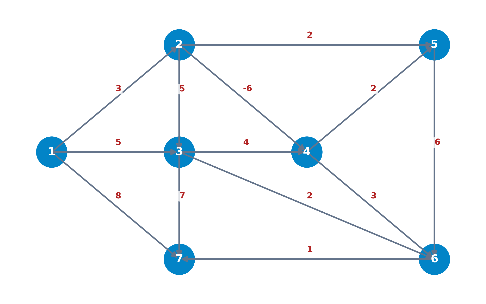

## Objetivos de aprendizaje

1. **Formular** el problema del camino mínimo y la matriz de distancias directas.
2. **Deducir** las ecuaciones de optimalidad de Bellman y su insuficiencia ante circuitos.
3. **Aplicar** la ordenación topológica en redes acíclicas (DAGs) en tiempo lineal $O(|V| + |U|)$.
4. **Ejecutar** el algoritmo de Dijkstra en redes con costes no negativos.
5. **Programar** el algoritmo de Bellman-Ford y detectar circuitos de coste negativo.
6. **Analizar** la formulación en programación lineal primal-dual y la propiedad TUM.
7. **Calcular** distancias entre todos los pares mediante Floyd-Warshall y min-suma.

# Definición formal y condiciones de existencia

## Contexto y trascendencia del problema del camino mínimo

* **Propósito fundamental**:
  Determinar la ruta de menor coste, distancia geodésica o tiempo acumulado desde un nodo origen $s$ a un nodo destino $t$, o desde un origen único hacia todos los vértices.

* **Ámbitos de aplicación directa**:
  * Navegación GPS e infraestructuras de transporte multimodal.
  * Enrutamiento de paquetes de datos en redes de telecomunicaciones (IP/BGP).
  * Planificación logística de flotas de distribución y suministro.

* **Rol como subproblema crítico**:
  * Generación de columnas en Programación Entera y *Branch-and-Price*.
  * Algoritmos de Flujo de Coste Mínimo en redes.
  * Programación Dinámica multietapa.

---

## Definición formal de red valorada

::: {.callout-note title="Red valorada y coste acumulado de un camino" data-kind="definicion"}
Sea un digrafo conexo valorado $G = (V, U, \mathbf{d})$ con $V = \{1, \dots, n\}$ y $|U| = m$:

* **Vector de costes $\mathbf{d} \in \mathbb{R}^m$**:
  Asigna a cada arco dirigido $u = (i, j) \in U$ un peso, tiempo o coste $d(u) = d_{ij}$.

* **Coste acumulado de un camino $\mu = (v_0, v_1, \dots, v_k)$**:
  $$d(\mu) = \sum_{u \in \mu} d_u = \sum_{j=1}^k d_{v_{j-1}, v_j}$$
:::

---

## Matriz de distancias directas

::: {.callout-note title="Matriz de distancias directas" data-kind="definicion"}
La **matriz de distancias directas** $D \in \overline{\mathbb{R}}^{n \times n}$ contiene las conexiones directas entre todo par de vértices $i, j \in V$:

$$
d_{ij} = \begin{cases} 
0 & \text{si } i = j \\ 
d_u & \text{si } u = (i, j) \in U \\ 
+\infty & \text{si } (i, j) \notin U \text{ y } i \neq j 
\end{cases}
$$
:::

* Representa la información elemental de conectividad y coste de la red antes de aplicar los algoritmos de optimización.

---

## Ejemplo: Red de itinerarios de vuelos internacionales

::: {.columns}
::: {.column width="50%"}
* **Objetivo**:
  Encontrar el itinerario de tarifa mínima desde Madrid ($M$) hasta Tokio ($T$).

* **Escalas disponibles**:
  Londres ($L$), París ($P$), Frankfurt ($F$) o Singapur ($S$).

* **Tarifas de arcos (en €)**:
  * Desde $M$: $(M, L): 20$, $(M, F): 40$, $(M, P): 27$.
  * Conexiones intercontinentales: $(L, F): 10$, $(F, P): 11$, $(P, F): 9$.
  * Vuelos a Asia: $(F, S): 90$, $(P, S): 100$, $(P, T): 150$.
  * Tramo final: $(S, T): 35$.
:::

::: {.column width="50%"}
{fig-align="center" width="100%"}
:::
:::

---

## Ejemplo: Transporte marítimo con costes y beneficios

::: {.columns}
::: {.column width="55%"}
* **Planteamiento**: Itinerario óptimo de navegación entre un puerto origen $O$ y un puerto destino $D$.
* **Modelado dual de pesos**:
  * **Costes de combustible**: Valores positivos ($d_{ij} > 0$).
  * **Beneficios de recarga**: Valores negativos ($d_{ij} < 0$).
* **Solución**: Minimizar costes en la red equivale a maximizar el beneficio neto total acumulado.
:::

::: {.column width="45%"}
::: {.callout-note title="Diferencia fundamental con el MST" data-kind="nota"}
A diferencia del MST (solución siempre finita), el camino mínimo con arcos negativos puede presentar **divergencia a $-\infty$**.
:::
:::
:::

---

## Paradoja del camino en grafos con circuitos negativos

::: {.columns}
::: {.column width="50%"}
* **Ruta simple inicial**:
  $\mu_1 = (a, b, e, f)$ con coste:
  $$d(\mu_1) = 3 + (-6) + 2 = -1$$

* **Circuito de coste negativo**:
  $\mu_C = (b, e, f, b)$ con coste:
  $$d(\mu_C) = -6 + 2 + 2 = -2 < 0$$

* **Divergencia a $-\infty$**:
  Dar $k$ vueltas a $\mu_C$ reduce el coste a:
  $$d(\mu_k) = -1 - 2k \xrightarrow[k \to \infty]{} -\infty$$
:::

::: {.column width="50%"}
<iframe src="../images/circuito_negativo_player.html" style="width:100%; height:480px; border:none; display:block; margin:0 auto;" scrolling="no"></iframe>
:::
:::

---

## Condición de existencia de solución óptima finita

::: {.callout-important title="Condición de existencia de solución óptima finita" data-kind="teorema"}
Dada una red dirigida $G = (V, U, \mathbf{d})$ y dos vértices $s, t \in V$, existe una solución óptima finita al problema del camino mínimo si y sólo si se cumplen:

* **Hipótesis $H_1$ (Accesibilidad)**:
  Existe al menos un camino dirigido que conecta el nodo origen $s$ con el destino $t$.

* **Hipótesis $H_2$ (Ausencia de circuitos de coste negativo)**:
  Ningún camino dirigido de $s$ a $t$ contiene un circuito de coste total estrictamente negativo.
:::

# Ecuaciones de optimalidad de Bellman

## Principio de Optimalidad de Bellman (1957)

::: {.callout-note title="Principio de Optimalidad de Bellman" data-kind="definicion"}
Una secuencia óptima de decisiones que resuelve un problema de optimización multietapa debe cumplir la propiedad de que, cualquiera que sea el estado inicial y la decisión inicial adoptada, las decisiones restantes deben constituir una **política óptima** respecto al estado resultante.

*(Toda subpolítica de una política óptima es a su vez una subpolítica óptima)*
:::

* **Interpretación en caminos mínimos**:
  Si el camino mínimo entre $s$ y $t$ es $\mu^*[s, t]$ y pasa por los vértices intermedios $i$ y $j$, la subruta $\mu^*[i, j]$ es obligatoriamente el camino mínimo entre $i$ y $j$.

---

## Ecuaciones de optimalidad de Bellman

::: {.callout-important title="Ecuaciones de optimalidad de Bellman" data-kind="teorema"}
En una red dirigida sin circuitos de coste negativo, las distancias mínimas $u_j$ desde el origen $s = 1$ a los vértices $j = 2, \dots, n$ satisfacen:

$$
\begin{aligned}
u_1 &= 0 \\
u_j &= \min_{k \neq j} \{ u_k + d_{kj} \}, \quad \forall j = 2, \dots, n
\end{aligned}
$$
:::

* Físicamente expresan que la distancia a $j$ es el mínimo entre las distancias acumuladas a sus predecesores $k$ más el coste del arco directo $(k, j)$.

---

## Ejemplo: Planteamiento de las ecuaciones de Bellman

::: {.columns}
::: {.column width="50%"}
{fig-align="center" width="95%"}
:::

::: {.column width="50%"}
* **Formulación del sistema para $s = 1$**:
  $$
  \begin{aligned}
  u_1 &= 0 \\
  u_5 &= \min \{ u_1 + 4 \} = 4 \\
  u_3 &= \min \{ u_1 + 10, u_5 + 3 \} = \min \{ 10, 7 \} = 7 \\
  u_4 &= \min \{ u_5 + 8 \} = 12 \\
  u_2 &= \min \{ u_3 + 2, u_4 + 2 \} = \min \{ 9, 14 \} = 9
  \end{aligned}
  $$

* **Resultados**:
  * $\mathbf{u} = (0, 9, 7, 12, 4)$.
  * $\text{Pred} = (1, 3, 5, 5, 1)$.
  * Arborescencia: $\{ (1,5), (5,3), (5,4), (3,2) \}$.
:::
:::

---

## Insuficiencia y no unicidad ante circuitos de coste nulo

::: {.columns}
::: {.column width="45%"}
{fig-align="center" width="95%"}
:::

::: {.column width="55%"}
* **Circuito de coste nulo**:
  $2 \rightleftarrows 3$ con $d_{23} + d_{32} = 1 + (-1) = 0$.

* **Sistema de ecuaciones de Bellman**:
  $$
  \begin{aligned}
  u_1 &= 0 \\
  u_2 &= \min \{ 10, u_3 - 1 \} \\
  u_3 &= u_2 + 1
  \end{aligned}
  $$

* **Múltiples soluciones algebraicas**:
  * $\mathbf{u} = (0, 10, 11) \implies$ **Solución física real**.
  * $\mathbf{u} = (0, 5, 6) \implies$ Satisface las ecuaciones pero **es falsa**.
:::
:::

---

## Proposición: Arborescencia asociada a Bellman

::: {.callout-note title="Construcción de la arborescencia soporte" data-kind="corolario"}
Las ecuaciones de optimalidad de Bellman:

$$
u_1 = 0, \quad u_j = \min_{k \neq j} \{ u_k + d_{kj} \}, \quad \forall j \neq 1
$$

permiten construir de forma **única** la arborescencia de caminos mínimos con raíz en $1$ si y sólo si en la red **no existen circuitos dirigidos de coste nulo ni negativo**.
:::

---

## Ejemplo: Ecuaciones de Bellman en la red de aeropuertos

::: {.columns}
::: {.column width="35%"}
{fig-align="center" width="95%"}
:::

::: {.column width="65%"}
* **Ecuaciones desde Madrid ($M$) - Nodos iniciales**:

  * **Madrid ($M$)**: $u_M = 0$
  * **Londres ($L$)**:
    $$ \small u_L = \min \{ u_M + 20 \} = 20 $$
  * **París ($P$)**:
    $$ \small u_P = \min \{ u_M + 27, \, u_F + 9 \} = \min \{ 27, 39 \} = 27 $$
  * **Frankfurt ($F$)**:
    $$ \small
    \begin{aligned}
    u_F &= \min \{ u_M + 40, \, u_L + 10, \, u_P + 11 \} \\
        &= \min \{ 40, 30, 38 \} = 30
    \end{aligned}
    $$
:::
:::

---

## Ejemplo: Ecuaciones de Bellman en la red de aeropuertos (cont.)

::: {.columns}
::: {.column width="35%"}
{fig-align="center" width="95%"}
:::

::: {.column width="65%"}
* **Ecuaciones hacia el destino final**:
  $$ \small
  \begin{aligned}
  u_S &= \min \{ u_F + 90, \, u_P + 100 \} = \min \{ 120, 127 \} = 120 \\
  u_T &= \min \{ u_P + 150, \, u_S + 35 \} = \min \{ 177, 155 \} = 155
  \end{aligned}
  $$

* **Solución y Arborescencia Óptima $T^*$**:
  * **Ruta a Tokio**: $M \to L \to F \to S \to T$ (155 €).
  * **Predecesores**: $L \gets M, \, P \gets M, \, F \gets L, \, S \gets F, \, T \gets S$.
  * **Arcos de $T^*$**: $\{(M,L), (M,P), (L,F), (F,S), (S,T)\}$.
:::
:::

---

## Complejidad computacional de las ecuaciones de Bellman

* **Complejidad factorial $O(n!)$ en redes generales**:
  Sin conocer el orden secuencial de resolución de los vértices, explorar las combinaciones de predecesores requiere $O(n!)$ comparaciones.

* **Reducción de complejidad mediante ordenación topológica**:
  Si los nodos se ordenan secuencialmente de forma adecuada, la complejidad se reduce a **$O(n^2)$** o tiempo estrictamente **lineal $O(|V| + |U|)$**.

* **Condición necesaria**:
  La ordenación topológica secuencial exige que el digrafo **no contenga circuitos dirigidos** (DAGs).

# Redes sin circuitos (DAGs) y ordenación topológica

## Caracterización de digrafos acíclicos (DAGs)

::: {.callout-note title="Caracterización mediante ordenación topológica" data-kind="proposicion"}
Un digrafo $G = (V, U)$ no tiene circuitos dirigidos si y sólo si existe una numeración de sus $n$ vértices $v_1, v_2, \dots, v_n$ tal que para todo arco dirigidos $(i, j) \in U$ se cumple:

$$i < j$$
:::

* **Consecuencia matemática**:
  Todos los arcos de la red avanzan estrictamente de izquierda a derecha. No existen arcos de retroceso que puedan formar bucles.

---

## Ejemplo: Verificación de ordenación topológica

::: {.columns}
::: {.column width="50%"}
{fig-align="center" width="90%"}
:::

::: {.column width="50%"}
* **Secuencia propuesta**: $(1, 5, 3, 4, 2)$

* **Chequeo de arcos**:
  * $(1, 5) \implies 1^\circ \to 2^\circ$ (cumple $i < j$)
  * $(1, 3) \implies 1^\circ \to 3^\circ$ (cumple $i < j$)
  * $(5, 4) \implies 2^\circ \to 4^\circ$ (cumple $i < j$)
  * $(5, 3) \implies 2^\circ \to 3^\circ$ (cumple $i < j$)
  * $(4, 2) \implies 4^\circ \to 5^\circ$ (cumple $i < j$)
  * $(3, 2) \implies 3^\circ \to 5^\circ$ (cumple $i < j$)
:::
:::

---

## Esquema del algoritmo de ordenación topológica

::: {.callout-note title="Algoritmo de numeración topológica" data-kind="esquema"}
Dada la red dirigida $G = (V, U)$ con $n = |V|$ vértices:

1. **Paso 0**: Hacer $k \leftarrow 1$, $V' \leftarrow V$, $U' \leftarrow U$.
2. **Paso 1**: Seleccionar un nodo fuente $i \in V'$ con grado de entrada $d^-(i) = 0$ en $U'$.
3. **Paso 2**: Asignar al nodo $i$ el orden $k$. Eliminar $i$ y sus arcos incidentes:
   $$V' \leftarrow V' \setminus \{i\}, \quad U' \leftarrow U' \setminus \{ (i, j) \}$$
4. **Paso 3**: Si $k = n$, **parar**. En otro caso, hacer $k \leftarrow k + 1$ y regresar al Paso 1.
:::

---

## Resolución de Bellman en tiempo lineal en DAGs

* **Fórmula de recurrencia en orden topológico**:
  $$
  \begin{aligned}
  u_1 &= 0 \\
  u_j &= \min_{i < j, \, (i, j) \in U} \{ u_i + d_{ij} \}, \quad \forall j = 2, \dots, n
  \end{aligned}
  $$

* **Complejidad algorítmica**:
  Cada arco de la red se examina exactamente una vez durante el recorrido secuencial.
  $$\text{Tiempo total} = O(|V| + |U|)$$

---

## Ejemplo DAG: Grafo acíclico de 7 nodos

* **Grafo acíclico valorado**: Vértices $V = \{1, 2, 3, 4, 5, 6, 7\}$ con costes positivos y negativos.

{fig-align="center" width="85%"}

---

## Ejemplo DAG: Iteraciones analíticas nodo por nodo

* **$u_1 = 0$** (Origen).
* **$u_2 = u_1 + d_{12} = 0 + 3 = 3$** ($\text{Pred}(2) = 1$).
* **$u_3 = \min \{ u_1 + d_{13}, u_2 + d_{23} \} = \min \{ 0+5, 3+5 \} = 5$** ($\text{Pred}(3) = 1$).
* **$u_4 = \min \{ u_2 + d_{24}, u_3 + d_{34} \} = \min \{ 3-6, 5+4 \} = -3$** ($\text{Pred}(4) = 2$).
* **$u_5 = \min \{ u_2 + d_{25}, u_4 + d_{45} \} = \min \{ 3+2, -3+2 \} = -1$** ($\text{Pred}(5) = 4$).
* **$u_6 = \min \{ u_3 + d_{36}, u_4 + d_{46}, u_5 + d_{56} \} = \min \{ 5+2, -3+3, -1+6 \} = 0$** ($\text{Pred}(6) = 4$).
* **$u_7 = \min \{ u_1 + d_{17}, u_3 + d_{37}, u_6 + d_{67} \} = \min \{ 0+8, 5+7, 0+1 \} = 1$** ($\text{Pred}(7) = 6$).

---

## Ejemplo DAG: Traza animada interactiva

<iframe src="../images/dag_ejemplo_7nodos_player.html" style="width:100%; height:520px; border:none; display:block; margin:0 auto;" scrolling="no"></iframe>

# Redes con pesos no negativos: Algoritmo de Dijkstra

## Filosofía del Algoritmo de Dijkstra (1959)

::: {.callout-note title="Estrategia voraz de etiquetado permanente" data-kind="definicion"}
Para redes con costes no negativos ($d_{ij} \ge 0$), se dividen los vértices en dos conjuntos:

* **Nodos Permanentes $\mathcal{P}$**: Vértices con distancia óptima definitiva conocida ($u_j = d(1, j)$).
* **Nodos Transitorios $\mathcal{T} = V \setminus \mathcal{P}$**: Vértices con cota de distancia provisional $u_j$.
:::

* **Mecanismo voraz (*Greedy*)**:
  En cada etapa se transfiere a $\mathcal{P}$ el nodo $k \in \mathcal{T}$ con etiqueta mínima:
  $$u_k = \min_{j \in \mathcal{T}} \{ u_j \}$$

---

## Definición de cota provisional $u_j^P$

::: {.callout-note title="Cota de distancia provisional" data-kind="definicion"}
Dado el subconjunto permanente $\mathcal{P}$, la cota $u_j^P$ asociada a un nodo $j \in \mathcal{T}$ representa la longitud del camino mínimo desde el origen $1$ al nodo $j$ utilizando como vértices intermedios **únicamente elementos de $\mathcal{P}$**:

$$
u_j^P \equiv \text{distancia mínima de } 1 \text{ a } j \text{ pasando solo por } \mathcal{P}
$$
:::

* Al incorporar $k$ a $\mathcal{P}$, las cotas de los vecinos transitorios se actualizan mediante:
  $$u_j \leftarrow \min \{ u_j, \, u_k + d_{kj} \}$$

---

## Esquema del Algoritmo de Dijkstra

::: {.callout-note title="Algoritmo de Dijkstra" data-kind="esquema"}
Dada la red con costes no negativos $d_{ij} \ge 0$:

1. **Paso 0 (Inicialización)**:
   * $u_1 = 0$, $u_j = d_{1j}$ ($\forall j \ge 2$), $\mathcal{P} = \{1\}$, $\mathcal{T} = \{2, \dots, n\}$, $\text{Pred}(j) = 1$.

2. **Paso 1 (Etiquetado permanente)**:
   * Seleccionar $k \in \mathcal{T}$ tal que $u_k = \min_{j \in \mathcal{T}} \{ u_j \}$.
   * Hacer $\mathcal{P} \leftarrow \mathcal{P} \cup \{k\}$, $\mathcal{T} \leftarrow \mathcal{T} \setminus \{k\}$.
   * Si $\mathcal{T} = \emptyset$ o $u_k = \infty$, **parar**.

3. **Paso 2 (Relajación de etiquetas)**:
   * Para cada $j \in \mathcal{T}$ vecino de $k$: $u_j \leftarrow \min \{ u_j, \, u_k + d_{kj} \}$. Si cambia, hacer $\text{Pred}(j) \leftarrow k$. Ir al Paso 1.
:::

---

## Correctitud del Algoritmo de Dijkstra

::: {.callout-important title="Correctitud del algoritmo de Dijkstra" data-kind="teorema"}
Si $d_{ij} \ge 0$ para todo $(i, j) \in U$, la etiqueta $u_k$ asignada por el Algoritmo de Dijkstra en el momento en que un nodo $k$ pasa a ser permanente ($\mathcal{P} \leftarrow \mathcal{P} \cup \{k\}$) es la **distancia mínima exacta** desde el origen $1$ al nodo $k$.
:::

* **Interpretación y fundamento de la no negatividad**:
  * Como $d_{ij} \ge 0$, la función de distancia a lo largo de cualquier camino es **monótona no decreciente**.
  * Ningún camino que atraviese un nodo transitorio $y \in \mathcal{T}$ puede ofrecer un coste menor que la etiqueta mínima $u_k = \min_{j \in \mathcal{T}} \{ u_j \}$.
  * Al pasar $k$ a permanente, su distancia $u_k$ queda **definitivamente fijada y garantizada como óptima**.

---

## Complejidad computacional de Dijkstra

| Estructura de Datos | Complejidad Temporal | Contexto de Aplicación |
| :--- | :--- | :--- |
| **Matriz de distancias** | $O(n^2)$ | Redes densas ($m \approx n^2$) |
| **Heap binario (Min-Heap)** | $O(m \log n)$ | Redes dispersas ($m \ll n^2$) |
| **Fibonacci Heap** | **$O(m + n \log n)$** | Máxima eficiencia teórica |

* **Justificación de la voracidad**:
  Si $d_{ij} \ge 0$, ningún nodo en $\mathcal{T}$ puede ofrecer un camino más corto hacia $k$ que la propia cota actual $u_k = \min_{j \in \mathcal{T}} \{ u_j \}$.

---

## Ejemplo Dijkstra: Red de 5 nodos

::: {.columns}
::: {.column width="50%"}
{fig-align="center" width="95%"}
:::

::: {.column width="50%"}
* **Digrafo de 5 nodos**:
  Costes estrictamente no negativos.

* **Objetivo**:
  Determinar el árbol de caminos mínimos desde el nodo origen 1.
:::
:::

---

## Ejemplo Dijkstra: Iteración 0 e Iteración 1

* **Paso 0 (Inicialización)**:
  * $\mathcal{P} = \{1\}$, $\mathcal{T} = \{2, 3, 4, 5\}$.
  * $u = (0, 100, 30, \infty, \infty)$, $\text{Pred} = (1, 1, 1, 1, 1)$.

* **Iteración 1**:
  * Mínimo en $\mathcal{T}$: $k = 3$ con $u_3 = 30 \implies \mathcal{P} = \{1, 3\}$, $\mathcal{T} = \{2, 4, 5\}$.
  * Relajación de vecinos de 3:
    * $u_2 \leftarrow \min \{100, 30 + 20\} = 50$ ($\text{Pred}(2) = 3$).
    * $u_4 \leftarrow \min \{\infty, 30 + 10\} = 40$ ($\text{Pred}(4) = 3$).
    * $u_5 \leftarrow \min \{\infty, 30 + 60\} = 90$ ($\text{Pred}(5) = 3$).

---

## Ejemplo Dijkstra: Iteraciones 2 a 4

* **Iteración 2**:
  * Mínimo en $\mathcal{T}$: $k = 4$ con $u_4 = 40 \implies \mathcal{P} = \{1, 3, 4\}$, $\mathcal{T} = \{2, 5\}$.
  * Vecinos de 4: (arco $(4,2)$ peso 15: $40+15=55 > 50$, sin cambio; $(4,5)$ peso 50: $40+50=90$, sin cambio).

* **Iteración 3**:
  * Mínimo en $\mathcal{T}$: $k = 2$ con $u_2 = 50 \implies \mathcal{P} = \{1, 3, 4, 2\}$, $\mathcal{T} = \{5\}$.

* **Iteración 4**:
  * Mínimo en $\mathcal{T}$: $k = 5$ con $u_5 = 90 \implies \mathcal{P} = \{1, 2, 3, 4, 5\}$, $\mathcal{T} = \emptyset$. **PARADA**.

---

## Ejemplo Dijkstra: Tabla resumen de desarrollo

| Etapa $k$ | Nodo Permanetizado | $u_k$ | Conjunto $\mathcal{P}$ | Etiquetas $(u_1, u_2, u_3, u_4, u_5)$ | Predecesores $\text{Pred}(1..5)$ |
| :--- | :--- | :--- | :--- | :--- | :--- |
| **Inicio** | $1$ | $0$ | $\{1\}$ | $(0, 100, 30, \infty, \infty)$ | $(1, 1, 1, 1, 1)$ |
| **Iter 1** | $3$ | $30$ | $\{1, 3\}$ | $(0, 50, 30, 40, 90)$ | $(1, 3, 1, 3, 3)$ |
| **Iter 2** | $4$ | $40$ | $\{1, 3, 4\}$ | $(0, 50, 30, 40, 90)$ | $(1, 3, 1, 3, 3)$ |
| **Iter 3** | $2$ | $50$ | $\{1, 3, 4, 2\}$ | $(0, 50, 30, 40, 90)$ | $(1, 3, 1, 3, 3)$ |
| **Iter 4** | $5$ | $90$ | $\{1, 3, 4, 2, 5\}$ | $(0, 50, 30, 40, 90)$ | $(1, 3, 1, 3, 3)$ |

* **Arborescencia Óptima**: $\{ (1,3), (3,4), (3,2), (3,5) \}$.

---

## Ejemplo Dijkstra: Traza animada interactiva

<iframe src="../images/dijkstra_player.html" style="width:100%; height:520px; border:none; display:block; margin:0 auto;" scrolling="no"></iframe>

# Redes con pesos negativos: Algoritmo de Bellman-Ford

## Concepto: Aproximación por número de arcos (1956-1959)

::: {.callout-note title="Aproximación iterativa por longitud de arcos" data-kind="definicion"}
Para redes que contienen arcos con costes negativos (sin circuitos negativos), el **Algoritmo de Bellman-Ford** define:

* **Etiqueta $u_j^m$**:
  Longitud del camino mínimo desde el origen $1$ al nodo $j$ utilizando **a lo sumo $m$ arcos**.

* **Relación de Recurrencia**:
  $$u_j^m = \min \left\{ u_j^{m-1}, \ \min_{k \neq j} \{ u_k^{m-1} + d_{kj} \} \right\}, \quad m = 1, \dots, n-1$$
:::

* **Complejidad**: $O(|V| \cdot |U|) = O(n^3)$ para redes densas.

---

## Esquema del Algoritmo de Bellman-Ford (I: Inicialización)

::: {.callout-note title="Algoritmo de Bellman-Ford — Paso 1: Inicialización" data-kind="esquema"}
Dada una red valorada dirigida $G = (V, U, \mathbf{d})$ con $n = |V|$ vértices:

* **Paso 1 (Inicialización para $m = 1$)**:
  Definir las etiquetas iniciales de distancia directa desde el origen $1$:
  $$
  u_j^1 = \begin{cases} 
  0 & \text{si } j = 1 \\ 
  d_{1j} & \text{si } (1, j) \in U \\ 
  \infty & \text{si } (1, j) \notin U 
  \end{cases}
  $$
  y establecer el vector de predecesores iniciales $\text{Pred}(j) = 1$.
  Inicializar el contador de arcos: $m \leftarrow 1$.
:::

---

## Esquema del Algoritmo de Bellman-Ford (II: Relajación)

::: {.callout-note title="Algoritmo de Bellman-Ford — Paso 2: Relajación de arcos" data-kind="esquema"}
* **Paso 2 (Iteración de relajación)**:
  * Incrementar la longitud máxima permitida del camino: $m \leftarrow m + 1$.
  * Para cada nodo $j = 2, \dots, n$, evaluar si es más ventajoso mantener la cota anterior o acceder a $j$ pasando por un nodo intermedio $k$:
    $$
    u_j^m = \min \left\{ u_j^{m-1}, \ \min_{k \neq j} \{ u_k^{m-1} + d_{kj} \} \right\}
    $$
  * Si la etiqueta cambia ($u_j^m < u_j^{m-1}$), actualizar el predecesor: $\text{Pred}(j) \leftarrow k$.
:::

---

## Esquema del Algoritmo de Bellman-Ford (III: Parada)

::: {.callout-note title="Algoritmo de Bellman-Ford — Paso 3: Criterios de Parada" data-kind="esquema"}
* **Paso 3 (Criterio de Parada y Convergencia)**:

  * **Parada Anticipada (Estabilidad)**:
    Si $u_j^m = u_j^{m-1}$ para todo $j = 2, \dots, n$, la solución es **óptima y estable** $\implies$ **PARAR**.

  * **Criterio Límite ($m = n - 1$)**:
    Si $m = n - 1$, se ha alcanzado el número máximo de arcos de un camino simple $\implies$ **PARAR**.

  * **Continuación**:
    Si $m < n - 1$ y $u^m \neq u^{m-1}$, **regresar al Paso 2**.
:::

* **Interpretación teórica**:
  Cualquier camino simple entre dos nodos contiene a lo sumo $n-1$ arcos. Si la red no posee circuitos de coste negativo, la solución óptima se alcanza en $m \le n-1$ iteraciones.

---

## Ejemplo Bellman-Ford: Red de 4 nodos con costes negativos

::: {.columns}
::: {.column width="50%"}
{fig-align="center" width="95%"}
:::

::: {.column width="50%"}
* **Arco negativo**:
  $(4, 2)$ con coste $d_{42} = -3$.

* **Objetivo**:
  Obtener las distancias mínimas desde el nodo 1.
:::
:::

---

## Ejemplo Bellman-Ford: Desarrollo iterativo m=1 y m=2

* **Paso 1 ($m=1$)**:
  * $u^1 = (0, 5, 2, \infty)$, $\text{Pred} = (1, 1, 1, 1)$.

* **Iteración $m=2$**:
  * $u_2^2 = \min \{ u_2^1, u_3^1 + d_{32}, u_4^1 + d_{42} \} = \min \{ 5, 2+\infty, \infty-3 \} = 5$.
  * $u_3^2 = \min \{ u_3^1, u_2^1 + d_{23}, u_4^1 + d_{43} \} = \min \{ 2, 5+3, \infty+6 \} = 2$.
  * $u_4^2 = \min \{ u_4^1, u_2^1 + d_{24}, u_3^1 + d_{34} \} = \min \{ \infty, 5+4, 2+1 \} = 3$.
  * Vector resultante: $u^2 = (0, 5, 2, 3)$, $\text{Pred} = (1, 1, 1, 3)$.

---

## Ejemplo Bellman-Ford: Desarrollo iterativo m=3 y m=4

* **Iteración $m=3$**:
  * $u_2^3 = \min \{ 5, u_3^2 + d_{32}, u_4^2 + d_{42} \} = \min \{ 5, 2+\infty, 3 - 3 \} = 0$ ($\text{Pred}(2) = 4$).
  * $u_3^3 = \min \{ 2, u_2^2 + d_{23}, u_4^2 + d_{43} \} = \min \{ 2, 5+3, 3+6 \} = 2$.
  * $u_4^3 = \min \{ 3, u_2^2 + d_{24}, u_3^2 + d_{34} \} = \min \{ 3, 5+4, 2+1 \} = 3$.
  * Vector resultante: $u^3 = (0, 0, 2, 3)$, $\text{Pred} = (1, 4, 1, 3)$.

* **Iteración $m=4$**:
  * $u^4 = (0, 0, 2, 3) = u^3 \implies$ **CONVERGENCIA ALCANZADA**.

---

## Ejemplo Bellman-Ford: Tabla resumen de iteraciones

| Iteración $m$ | $u_1^m$ | $u_2^m$ | $u_3^m$ | $u_4^m$ | Vector de Predecesores $\text{Pred}$ | Estado de Convergencia |
| :--- | :--- | :--- | :--- | :--- | :--- | :--- |
| **$m=1$** | $0$ | $5$ | $2$ | $\infty$ | $(1, 1, 1, 1)$ | Inicialización |
| **$m=2$** | $0$ | $5$ | $2$ | $3$ | $(1, 1, 1, 3)$ | Relajación de $u_4$ |
| **$m=3$** | $0$ | **$0$** | $2$ | $3$ | $(1, 4, 1, 3)$ | Relajación de $u_2$ vía $(4,2)$ |
| **$m=4$** | $0$ | $0$ | $2$ | $3$ | $(1, 4, 1, 3)$ | $u^4 = u^3 \implies$ **Parada** |

* **Distancias Óptimas**: $\mathbf{u}^* = (0, 0, 2, 3)$.
* **Arborescencia**: $\{ (1,3), (3,4), (4,2) \}$.

---

## Ejemplo Bellman-Ford: Traza animada interactiva

<iframe src="../images/bellman_ford_player.html" style="width:100%; height:520px; border:none; display:block; margin:0 auto;" scrolling="no"></iframe>

---

## Detección de circuitos de coste negativo

::: {.callout-important title="Criterio de detección de circuitos de coste negativo" data-kind="teorema"}
Existe un circuito de coste negativo accesible desde el origen si y sólo si en la iteración $m = n$:

$$u_j^n \neq u_j^{n-1} \quad \text{para algún } j \in V$$
:::

* **Fundamento teórico**: Si no existen circuitos negativos, las distancias mínimas se alcanzan en a lo sumo $n-1$ arcos. Si la iteración $n$ modifica alguna distancia ($u^n \neq u^{n-1}$), existe un circuito de peso estrictamente negativo.

---

## Esquema: Algoritmo de Bellman-Ford adaptado

::: {.callout-note title="Algoritmo adaptado para detección de circuitos negativos" data-kind="esquema"}
Dada una red valorada general $G = (V, U, \mathbf{d})$ con $n = |V|$ vértices:

1. **Inicialización ($m=1$)**: $u_1^1 = 0$, $u_j^1 = d_{1j}$ ($\forall j \ge 2$), $m \leftarrow 1$.
2. **Relajación iterativa**: Hacer $m \leftarrow m + 1$. Para cada nodo $j = 2, \dots, n$:
   $$u_j^m = \min \left\{ u_j^{m-1}, \, \min_{k \neq j} \{ u_k^{m-1} + d_{kj} \} \right\}$$
3. **Criterio de parada**:
   * Si $u^m = u^{m-1}$, **PARAR**: Solución óptima alcanzada.
   * Si $m = n$ y $u^n \neq u^{n-1}$, **PARAR**: Existen circuitos de coste negativo.
   * En otro caso ($m < n$), regresar al Paso 2.
:::

---

## Ejemplo: Detección de circuito negativo (7 nodos)

::: {.columns}
::: {.column width="45%"}
{fig-align="center" width="95%"}
:::

::: {.column width="55%"}
* **Circuito negativo**:
  $b \to e \to f \to b$ con coste acumulado $-6 + 2 + 2 = -2 < 0$.

* **Iteración $m = 6$ ($n-1$)**:
  $u^6 = (0, 6, 5, 3, 0, 2, 3)$.

* **Iteración suplementaria $m = n = 7$**:
  $u_b^7 = \min \{ u_b^6, u_f^6 + 2 \} = \min \{ 6, 2+2 \} = 4$.

* **Conclusión**: $u_b^7 = 4 \neq 6 = u_b^6 \implies \mathbf{u}^7 \neq \mathbf{u}^6$.
  Demostrada formalmente la presencia del circuito negativo.
:::
:::

# Formulación en Programación Lineal Primal-Dual

## Modelo Primal: Flujo de coste mínimo continuo

* **Planteamiento**: Enviar 1 unidad de flujo desde el origen $s$ al destino $t$ al menor coste.

* **Variables de decisión**: $x_{ij} \in \{0, 1\}$ (1 si el arco $(i,j)$ forma parte del camino mínimo, 0 en otro caso).

$$
\begin{aligned}
\min_{\mathbf{x}} \quad & \sum_{(i,j) \in U} d_{ij} x_{ij} \\
\text{sujeto a} \quad & \sum_{k \mid (s,k) \in U} x_{sk} = 1 \quad (\text{Salida del nodo origen } s) \\
& \sum_{k \mid (k,t) \in U} x_{kt} = 1 \quad (\text{Entrada al nodo destino } t) \\
& \sum_{i \mid (i,k) \in U} x_{ik} = \sum_{j \mid (k,j) \in U} x_{kj}, \quad \forall k \neq s, t \quad (\text{Conservación de flujo}) \\
& x_{ij} \ge 0, \quad \forall (i, j) \in U
\end{aligned}
$$

---

## Teorema: Total Unimodularidad e Integridad (TUM)

::: {.callout-important title="Total Unimodularidad de la matriz de incidencia" data-kind="teorema"}
La matriz de incidencia nodo-arco $\mathbf{A} \in \{-1, 0, 1\}^{n \times m}$ de cualquier digrafo es **totalmente unimodular** (TUM).

Puesto que el vector de balances nodales $\mathbf{b} = (1, 0, \dots, 0, -1)^T$ es entero, todas las soluciones básicas del poliedro continuo son **estrictamente enteras**:

$$x_{ij}^* \in \{0, 1\}$$
:::

* **Garantía matemática**: La relajación continua de PL resuelve exactamente el problema combinatorio discreto sin necesitar restricciones de programación entera.

---

## Modelo Dual: Potenciales nodales

* **Variables duales $u_i \in \mathbb{R}$ asociadas a la ecuación de balance de cada nodo $i \in V$**:

$$
\begin{aligned}
\max_{\mathbf{u}} \quad & u_t - u_s \\
\text{sujeto a} \quad & u_j - u_i \le d_{ij}, \quad \forall (i, j) \in U \\
& u_i \in \mathbb{R}, \quad \forall i \in V
\end{aligned}
$$

* **Fijación de Referencia y Distancia Óptima**:
  Al fijar el origen en $u_s = 0$, la variable dual óptima $u_j^*$ coincide exactamente con la **distancia mínima $d(s, j)$** desde $s$ hasta $j$.

---

## Holgura complementaria e interpretación geométrica

* **Condiciones de Holgura Complementaria KKT**:
  $$x_{ij}^* \left( d_{ij} - (u_j^* - u_i^*) \right) = 0, \quad \forall (i, j) \in U$$

* **Significado geométrico de la dualidad**:
  * **Arco en la ruta óptima ($x_{ij}^* = 1$)**: La restricción dual se satisface con **igualdad estricta**: $u_j^* - u_i^* = d_{ij}$.
  * **Arco no utilizado ($x_{ij}^* = 0$)**: La diferencia de potencial entre extremos no supera la distancia directa: $u_j^* - u_i^* < d_{ij}$.

---

## Ejemplo: Formulación primal completa (7 nodos)

::: {.columns}
::: {.column width="45%"}
{fig-align="center" width="95%"}
:::

::: {.column width="55%"}
* **Función Objetivo**:
  $$ \small
  \begin{aligned}
  \min z = \ & 5 x_{s1} + 4 x_{s2} + 4 x_{12} + 2 x_{13} + 7 x_{14} + 3 x_{21} \\
  & + 4 x_{23} + 5 x_{25} + 7 x_{34} + 7 x_{35} + 13 x_{3t} \\
  & + 5 x_{4t} + 2 x_{5t}
  \end{aligned}
  $$

* **Restricción Origen ($s$)**: $x_{s1} + x_{s2} = 1$
* **Restricción Destino ($t$)**: $x_{3t} + x_{4t} + x_{5t} = 1$
:::
:::

---

## Ejemplo: Formulación primal completa (cont.)

::: {.columns}
::: {.column width="45%"}
{fig-align="center" width="95%"}
:::

::: {.column width="55%"}
* **Conservación de flujo en nodos intermedios**:
  $$ \small
  \begin{aligned}
  \text{Nodo 1:} \quad & x_{s1} + x_{21} = x_{12} + x_{13} + x_{14} \\
  \text{Nodo 2:} \quad & x_{s2} + x_{12} = x_{21} + x_{23} + x_{25} \\
  \text{Nodo 3:} \quad & x_{13} + x_{23} = x_{34} + x_{35} + x_{3t} \\
  \text{Nodo 4:} \quad & x_{14} + x_{34} = x_{4t} \\
  \text{Nodo 5:} \quad & x_{25} + x_{35} = x_{5t}
  \end{aligned}
  $$

* **Naturaleza de las variables**:
  $$x_{ij} \in \{0, 1\}, \quad \forall (i, j) \in U$$
:::
:::

# Caminos mínimos entre todos los pares de nodos

## Motivación y estrategia global

* **Necesidad práctica**:
  Determinar las distancias mínimas entre **todos los pares de vértices $(i, j) \in V \times V$**.

* **Aproximaciones preliminares**:
  * Repetir $n$ veces un algoritmo de origen único (Dijkstra o Bellman-Ford).
  * Con Dijkstra ($d_{ij} \ge 0$): $n \times O(m + n \log n) = O(nm + n^2 \log n)$.
  * Con Bellman-Ford: $n \times O(n^3) = O(n^4)$.

* **Desaprovechamiento de información**:
  La resolución independiente no reutiliza la información de subcaminos compartidos.

---

## Álgebra Min-Suma o Tropical (Definición y Operador)

::: {.callout-note title="Producto matricial Min-Suma" data-kind="definicion"}
Dadas dos matrices $A, B \in \overline{\mathbb{R}}^{n \times n}$, se define el **producto matricial Min-Suma** $C = A \otimes B$ en el semianillo $(\mathbb{R} \cup \{\infty\}, \min, +)$ mediante la sustitución operatoria $\sum \to \min$ y $\cdot \to +$:

$$ \small
\begin{aligned}
\text{Producto Estándar: } & c_{ij} = \sum_{k=1}^n a_{ik} \cdot b_{kj} \\
\implies \quad \text{Producto Min-Suma: } & c_{ij} = \min_{1 \le k \le n} \left\{ a_{ik} + b_{kj} \right\}
\end{aligned}
$$
:::

* **Matriz Inicial $D^{(1)} = D$**:
  $$d_{ij}^{(1)} = d_{ij} \quad (\text{distancias directas de los arcos})$$

---

## Potencias Matriciales $D^m$ y Paralelismo con Bellman-Ford

::: {.columns}
::: {.column width="52%"}
::: {.callout-note title="Relación de recurrencia en álgebra Min-Suma" data-kind="definicion"}
La componente $(d_{ij})^m$ de $D^m = D^{m-1} \otimes D$ contiene la **distancia mínima entre $i$ y $j$ en a lo sumo $m$ arcos**:

$$ \small
\begin{aligned}
(d_{ij})^{m} = \min \Big\{ & (d_{ij})^{m-1}, \\
& \min_{k \in V} \{ (d_{ik})^{m-1} + d_{kj} \} \Big\}
\end{aligned}
$$
:::
:::

::: {.column width="48%"}
* **Equivalencia Didáctica con Bellman-Ford**:
  * La fila $i$-ésima de la matriz $D^m$ equivale exactamente a resolver la iteración $m$ de Bellman-Ford con el **vértice $i$ como origen**.
  * El cálculo $D^m$ resuelve en paralelo el problema para los **$n$ posibles nodos origen** de la red.
:::
:::

---

## Convergencia y Exponenciación Binaria (*Repeated Squaring*)

::: {.columns}
::: {.column width="50%"}
* **Convergencia y Complejidad Secuencial**:
  * **Cota de finitud en $D^{n-1}$**:
    Cualquier camino simple en una red de $n$ vértices contiene a lo sumo $n-1$ arcos.
  * **Convergencia**: Sin circuitos de coste negativo, el algoritmo converge en $D^{n-1}$.
  * **Complejidad Secuencial**:
    $n-1$ productos matriciales $\implies \mathbf{O(n^4)}$.
:::

::: {.column width="50%"}
* **Optimización por Exponenciación Binaria**:
  * Evaluamos potencias cuadráticas:
    $$ \small D^1 \to D^2 \to D^4 \to D^8 \dots \to D^{2^{\lceil \log_2(n-1) \rceil}} $$
  * **Complejidad Optimizada**:
    Se realizan únicamente $\lceil \log_2(n-1) \rceil$ productos $\implies \mathbf{O(n^3 \log n)}$.
:::
:::

---

## Ejemplo: Multiplicación de matrices min-suma — Matriz D^(1)

::: {.columns}
::: {.column width="42%"}
{fig-align="center" width="95%"}
:::

::: {.column width="58%"}
* **Matriz Inicial de Distancias Directas $D^{(1)}$**:
  $$ \small
  D^{(1)} = \begin{pmatrix}
  0 & 4 & 5 & 6 \\
  -3 & 0 & \infty & 7 \\
  \infty & \infty & 0 & -1 \\
  \infty & \infty & \infty & 0
  \end{pmatrix}
  $$

* Contiene las distancias directas entre todo par de vértices $i, j \in V$ (caminos de a lo sumo 1 arco).
:::
:::

---

## Ejemplo: Multiplicación de matrices min-suma — Matriz D^(2)

::: {.columns}
::: {.column width="42%"}
{fig-align="center" width="95%"}
:::

::: {.column width="58%"}
* **Iteración 2 ($D^{(2)} = D^{(1)} \otimes D^{(1)}$ - 2 arcos o menos)**:
  $$ \small
  D^{(2)} = \begin{pmatrix}
  0 & 4 & 5 & \textcolor{forestgreen}{\mathbf{4}} \\
  -3 & 0 & \textcolor{forestgreen}{\mathbf{2}} & \textcolor{forestgreen}{\mathbf{3}} \\
  \infty & \infty & 0 & -1 \\
  \infty & \infty & \infty & 0
  \end{pmatrix}
  $$

* **Relajaciones destacadas**:
  * $(d_{14})^2 = \min \{ 6, \ 5 + (-1) \} = \textcolor{forestgreen}{\mathbf{4}}$ (vía $1 \to 3 \to 4$).
  * $(d_{23})^2 = \min \{ \infty, \ -3 + 5 \} = \textcolor{forestgreen}{\mathbf{2}}$ (vía $2 \to 1 \to 3$).
:::
:::

---

## Ejemplo: Multiplicación de matrices min-suma — Matriz D^(3)

::: {.columns}
::: {.column width="42%"}
{fig-align="center" width="95%"}
:::

::: {.column width="58%"}
* **Iteración 3 ($D^{(3)} = D^{(2)} \otimes D^{(1)}$ - 3 arcos o menos)**:
  $$ \small
  D^{(3)} = \begin{pmatrix}
  0 & 4 & 5 & 4 \\
  -3 & 0 & 2 & \textcolor{forestgreen}{\mathbf{1}} \\
  \infty & \infty & 0 & -1 \\
  \infty & \infty & \infty & 0
  \end{pmatrix}
  $$

* **Relajación de $(d_{24})^3$**: $\min \{ 3, \ -3 + 4 \} = \textcolor{forestgreen}{\mathbf{1}}$ (vía $2 \to 1 \to 3 \to 4$).

* **Convergencia final**:
  Al ser $n = 4$, el algoritmo finaliza en $D^{(n-1)} = D^{(3)}$.
:::
:::

---

## Algoritmo de Floyd-Warshall (1959-1962)

::: {.callout-note title="Relación de recurrencia de Programación Dinámica" data-kind="definicion"}
Sea $d_{ij}^{(k)}$ la distancia mínima de $i$ a $j$ utilizando como vértices intermedios exclusivamente elementos del subconjunto $\{1, 2, \dots, k\}$:

$$
d_{ij}^{(k)} = \min \left\{ d_{ij}^{(k-1)}, \ d_{ik}^{(k-1)} + d_{kj}^{(k-1)} \right\}, \quad \forall i, j \in V
$$
:::

* **Complejidad algorítmica**:
  **$O(n^3)$** con $n$ iteraciones simples sobre matrices $n \times n$.

---

## Esquema del Algoritmo de Floyd-Warshall

::: {.callout-note title="Algoritmo de Floyd-Warshall" data-kind="esquema"}
Dada la matriz de distancias $D^{(0)} = D$ y la matriz de predecesores $P^{(0)}$ con $P_{ij} = j$:

1. **Bucle externo**: Para $k = 1, 2, \dots, n$:
2. **Bucles internos**: Para $i = 1, 2, \dots, n$:
3. Para $j = 1, 2, \dots, n$:
   $$\text{Si } d_{ik}^{(k-1)} + d_{kj}^{(k-1)} < d_{ij}^{(k-1)} \text{ entonces}:$$
   $$d_{ij}^{(k)} \leftarrow d_{ik}^{(k-1)} + d_{kj}^{(k-1)}, \quad P_{ij}^{(k)} \leftarrow P_{ik}^{(k-1)}$$
:::

---

## Ejemplo Floyd-Warshall: Red de 5 nodos

::: {.columns}
::: {.column width="50%"}
{fig-align="center" width="95%"}
:::

::: {.column width="50%"}
* **Digrafo de 5 nodos**:
  Pivotes secuenciales $k = 1, 2, 3, 4, 5$.

* **Objetivo**:
  Obtener la matriz de distancias absolutas $D^{(5)}$ y reconstruir rutas óptimas.
:::
:::

---

## Ejemplo Floyd-Warshall: Matriz Inicial D^(0)

::: {.columns}
::: {.column width="42%"}
{fig-align="center" width="95%"}
:::

::: {.column width="58%"}
* **Matriz Inicial de Distancias Directas $D^{(0)}$**:
  $$ \small
  D^{(0)} = \begin{pmatrix}
  0 & 5 & \infty & 2 & \infty \\
  \infty & 0 & 2 & \infty & \infty \\
  3 & \infty & 0 & \infty & 7 \\
  \infty & \infty & 4 & 0 & 1 \\
  1 & 3 & \infty & \infty & 0
  \end{pmatrix}
  $$

* Contiene las distancias directas entre todo par de vértices $i, j \in V$ antes de aplicar ningún pivote intermedio.
:::
:::

---

## Ejemplo Floyd-Warshall: Iteración k=1 (Pivote nodo 1)

::: {.columns}
::: {.column width="48%"}
* **Evaluación del pivote intermedio $k=1$**:
  * **Fila 1**: $(0, 5, \infty, 2, \infty)$
  * **Columna 1**: $(0, \infty, 3, \infty, 1)^T$

* **Relajaciones de etiquetas**:
  * $d_{32}^{(1)} = \min \{\infty, 3 + 5\} = \mathbf{8}$
  * $d_{34}^{(1)} = \min \{\infty, 3 + 2\} = \mathbf{5}$
  * $d_{54}^{(1)} = \min \{\infty, 1 + 2\} = \mathbf{3}$
:::

::: {.column width="52%"}
* **Matriz Resultante $D^{(1)}$**:
  $$ \small
  D^{(1)} = \begin{pmatrix}
  0 & 5 & \infty & 2 & \infty \\
  \infty & 0 & 2 & \infty & \infty \\
  3 & \mathbf{8} & 0 & \mathbf{5} & 7 \\
  \infty & \infty & 4 & 0 & 1 \\
  1 & 3 & \infty & \mathbf{3} & 0
  \end{pmatrix}
  $$
:::
:::

---

## Ejemplo Floyd-Warshall: Iteración k=2 (Pivote nodo 2)

::: {.columns}
::: {.column width="48%"}
* **Evaluación del pivote intermedio $k=2$**:
  * **Fila 2**: $(\infty, 0, 2, \infty, \infty)$
  * **Columna 2**: $(5, 0, 8, \infty, 3)^T$

* **Relajaciones de etiquetas**:
  * $d_{13}^{(2)} = \min \{\infty, 5 + 2\} = \mathbf{7}$
  * $d_{53}^{(2)} = \min \{\infty, 3 + 2\} = \mathbf{5}$
:::

::: {.column width="52%"}
* **Matriz Resultante $D^{(2)}$**:
  $$ \small
  D^{(2)} = \begin{pmatrix}
  0 & 5 & \mathbf{7} & 2 & \infty \\
  \infty & 0 & 2 & \infty & \infty \\
  3 & 8 & 0 & 5 & 7 \\
  \infty & \infty & 4 & 0 & 1 \\
  1 & 3 & \mathbf{5} & 3 & 0
  \end{pmatrix}
  $$
:::
:::

---

## Ejemplo Floyd-Warshall: Iteración k=3 (Pivote nodo 3)

::: {.columns}
::: {.column width="48%"}
* **Evaluación del pivote intermedio $k=3$**:
  * **Fila 3**: $(3, 8, 0, 5, 7)$
  * **Columna 3**: $(7, 2, 0, 4, 5)^T$

* **Relajaciones de etiquetas**:
  * $d_{15}^{(3)} = \min \{\infty, 7 + 7\} = \mathbf{14}$
  * $d_{21}^{(3)} = \min \{\infty, 2 + 3\} = \mathbf{5}$
  * $d_{24}^{(3)} = \min \{\infty, 2 + 5\} = \mathbf{7}$
  * $d_{25}^{(3)} = \min \{\infty, 2 + 7\} = \mathbf{9}$
  * $d_{41}^{(3)} = \min \{\infty, 4 + 3\} = \mathbf{7}$
  * $d_{42}^{(3)} = \min \{\infty, 4 + 8\} = \mathbf{12}$
:::

::: {.column width="52%"}
* **Matriz Resultante $D^{(3)}$**:
  $$ \small
  D^{(3)} = \begin{pmatrix}
  0 & 5 & 7 & 2 & \mathbf{14} \\
  \mathbf{5} & 0 & 2 & \mathbf{7} & \mathbf{9} \\
  3 & 8 & 0 & 5 & 7 \\
  \mathbf{7} & \mathbf{12} & 4 & 0 & 1 \\
  1 & 3 & 5 & 3 & 0
  \end{pmatrix}
  $$
:::
:::

---

## Ejemplo Floyd-Warshall: Iteración k=4 (Pivote nodo 4)

::: {.columns}
::: {.column width="48%"}
* **Evaluación del pivote intermedio $k=4$**:
  * **Fila 4**: $(7, 12, 4, 0, 1)$
  * **Columna 4**: $(2, 7, 5, 0, 3)^T$

* **Relajaciones de etiquetas**:
  * $d_{13}^{(4)} = \min \{7, 2 + 4\} = \mathbf{6}$
  * $d_{15}^{(4)} = \min \{14, 2 + 1\} = \mathbf{3}$
  * $d_{25}^{(4)} = \min \{9, 7 + 1\} = \mathbf{8}$
  * $d_{35}^{(4)} = \min \{7, 5 + 1\} = \mathbf{6}$
:::

::: {.column width="52%"}
* **Matriz Resultante $D^{(4)}$**:
  $$ \small
  D^{(4)} = \begin{pmatrix}
  0 & 5 & \mathbf{6} & 2 & \mathbf{3} \\
  5 & 0 & 2 & 7 & \mathbf{8} \\
  3 & 8 & 0 & 5 & \mathbf{6} \\
  7 & 12 & 4 & 0 & 1 \\
  1 & 3 & 5 & 3 & 0
  \end{pmatrix}
  $$
:::
:::

---

## Ejemplo Floyd-Warshall: Iteración k=5 (Matriz Final D^(5))

::: {.columns}
::: {.column width="48%"}
* **Evaluación del pivote intermedio $k=5$**:
  * **Fila 5**: $(1, 3, 5, 3, 0)$
  * **Columna 5**: $(3, 8, 6, 1, 0)^T$

* **Relajaciones finales**:
  * $d_{41}^{(5)} = \min \{7, 1 + 1\} = \mathbf{2}$
  * $d_{42}^{(5)} = \min \{12, 1 + 3\} = \mathbf{4}$

* **Conclusión**:
  $D^{(5)}$ determina la distancia geodésica exacta entre todo par de vértices.
:::

::: {.column width="52%"}
* **Matriz Final $D^{(5)}$**:
  $$ \small
  D^{(5)} = \begin{pmatrix}
  0 & 5 & 6 & 2 & 3 \\
  5 & 0 & 2 & 7 & 8 \\
  3 & 8 & 0 & 5 & 6 \\
  \mathbf{2} & \mathbf{4} & 4 & 0 & 1 \\
  1 & 3 & 5 & 3 & 0
  \end{pmatrix}
  $$
:::
:::

---

## Ejemplo Floyd-Warshall: Reconstrucción de la ruta óptima (4, 2)

* **Matriz de predecesores final $P^{(5)}$**:
  $$\text{Para el par }(4, 2): \quad P_{42} = 5$$

* **Traza de reconstrucción**:
  1. De 4 a 2: El primer paso intermedio pasa por el nodo 5 $\implies$ segmento $4 \to 5$.
  2. De 5 a 2: Inspeccionar $P_{52} = 2 \implies$ segmento directo $5 \to 2$.

* **Ruta elemental óptima**:
  $$4 \to 5 \to 2$$
  * Coste acumulado: $d_{45} + d_{52} = 1 + 3 = \mathbf{4}$ (coincide con $d_{42}^{(5)} = 4$).

---

## Ejemplo Floyd-Warshall: Traza animada interactiva

<iframe src="../images/floyd_warshall_player.html" style="width:100%; height:520px; border:none; display:block; margin:0 auto;" scrolling="no"></iframe>
