## Objetivos de aprendizaje

::: {.columns}
::: {.column width="50%"}
1. **Definir** y **clasificar** emparejamientos maximales, de máximo cardinal y perfectos.
2. **Demostrar** y **aplicar** el Teorema de Berge mediante cadenas incrementales.
3. **Analizar** la descomposición del grafo diferencia simétrica $G' = (V, K_1 \bigtriangleup K_2)$.
4. **Construir** árboles y bosques alternantes con niveles $Y^0$ e $Y^1$.
:::
::: {.column width="50%"}
5. **Ejecutar** el algoritmo de contracción y descompresión de flores de Edmonds.
6. **Demostrar** y **aplicar** el Teorema de Dualidad de Gallai ($|K_0| + |F_0| = |V|$).
7. **Formular** y **resolver** emparejamientos de máximo peso por costes reducidos.
:::
:::

# Fundamentos y conceptos de emparejamiento

## Asignación de tripulaciones de la RAF (1940)

::: {.columns}
::: {.column width="52%"}
* **Contexto de la Batalla de Inglaterra (1940)**:
  * Formar parejas de dos pilotos para cazas biplaza de combate.

* **Restricción de comunicación lingüística**:
  * Ambos aviadores deben dominar al menos un idioma común para coordinar maniobras en cabina.

* **Objetivo de optimización**:
  * Maximizar el número total de aviones biplaza que pueden despegar simultáneamente.
:::
::: {.column width="48%"}
* **Competencias lingüísticas (7 aviadores)**:
  * **$P$**, **$P'$**: Solo polaco.
  * **$PI$**: Polaco e inglés.
  * **$I$**: Solo inglés.
  * **$A$**: Solo alemán.
  * **$AI$**: Alemán e inglés.
  * **$FI$**: Francés e inglés.
:::
:::

---

## Ejemplo RAF: Construcción del grafo de compatibilidad

* **Grafo simple no dirigido $G = (V, E)$**:
  * $V = \{P, PI, P', I, A, AI, FI\}$ (los 7 aviadores disponibles).
  * Aristas: Existe arista $\{u, v\} \in E$ si los pilotos $u$ y $v$ comparten al menos un idioma.

$$
\begin{aligned}
E = \bigl\{ & \{P, PI\}, \, \{P, P'\}, \, \{PI, P'\}, \, \{PI, I\}, \, \{PI, AI\}, \\
& \{PI, FI\}, \, \{I, FI\}, \, \{I, AI\}, \, \{FI, AI\}, \, \{A, AI\} \bigr\}
\end{aligned}
$$

* **Cota superior teórica**: Con 7 pilotos, el número máximo de parejas disjuntas es $\lfloor 7/2 \rfloor = 3$.

---

## Ejemplo RAF: Asignación codiciosa subóptima (Maximal)

* **Estrategia codiciosa (*greedy*)**:
  * Emparejar inmediatamente a los primeros aviadores compatibles disponibles:
    $$K_1 = \bigl\{ \{P, PI\}, \, \{A, AI\} \bigr\} \quad (|K_1| = 2)$$

* **Bloqueo del resto de aviadores**:
  * Al saturar a los bilingües $PI$ y $AI$, los 3 aviadores restantes ($P', FI, I$) quedan aislados en tierra sin idioma común compartido.

* **Evaluación de maximalidad subóptima**:
  * Aviones biplaza operativos: **2**. Pilotos libres en tierra: **3** ($P', FI, I$).
  * $K_1$ es **maximal** por inclusión (no se puede añadir ninguna arista más directamente), pero no alcanza el máximo cardinal global.

---

## Ejemplo RAF: Reasignación de máximo cardinal

* **Reasignación coordinada de parejas**:
  * Deshacer las asignaciones codiciosas para compartir los idiomas puente (polaco e inglés):
    $$K_2 = \bigl\{ \{P, P'\}, \, \{PI, I\}, \, \{AI, FI\} \bigr\} \quad (|K_2| = 3)$$

* **Alineación lingüística lograda**:
  * $\{P, P'\}$ se comunican en polaco; $\{PI, I\}$ y $\{AI, FI\}$ se comunican en inglés.

* **Resultado óptimo global**:
  * Aviones biplaza operativos: **3**. Piloto libre: solo **1** ($A$).
  * Se alcanza la cota teórica superior $\lfloor 7/2 \rfloor = 3$, demostrando que $K_2$ es de **máximo cardinal**.

---

## Ejemplo RAF: Comparación gráfica de soluciones

* **Subóptimo $K_1$ (izq.)**: 2 aristas en azul; bloquea a $P', FI, I$.
* **Óptimo $K_2$ (der.)**: 3 aristas en rojo; emparejamiento de máximo cardinal con único libre $A$.

  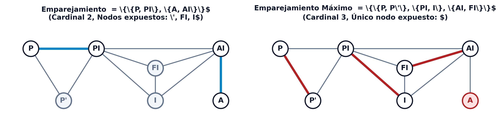

---

## Definición: Emparejamiento en un grafo

::: {.callout-note title="Emparejamiento en un grafo" data-kind="definicion"}
Dado un grafo no dirigido simple $G = (V, E)$, un **emparejamiento** (*matching*) es un subconjunto de aristas $K \subseteq E$ tal que ninguna pareja de aristas comparte vértices:

$$
e_1 \cap e_2 = \emptyset, \quad \forall e_1, e_2 \in K, \; e_1 \neq e_2
$$
:::

* **Grado en $G_K = (V, K)$**: $\operatorname{gr}_{G_K}(v) \le 1, \; \forall v \in V$.
* **Independencia**: Las aristas de $K$ son mutuamente disjuntas en sus extremos.

---

## Formulación algebraica y de programación lineal

* **Representación mediante vector binario**:
  * $\mathbf{x} \in \{0, 1\}^{|E|}$, donde $x_e = 1$ si $e \in K$, y $x_e = 0$ en caso contrario.

* **Restricción de no adyacencia nodal**:
  $$
  \sum_{e \in \delta(v)} x_e \le 1, \quad \forall v \in V
  $$

* **Modelo en Programación Lineal Entera (PLE)**:
  $$
  \max \left\{ \sum_{e \in E} x_e : \sum_{e \in \delta(v)} x_e \le 1 \; \forall v \in V, \; x_e \in \{0, 1\} \; \forall e \in E \right\}
  $$

---

## Hereditariedad de los emparejamientos

::: {.callout-note title="Hereditariedad de los emparejamientos" data-kind="corolario"}
Dado un grafo $G = (V, E)$ y un emparejamiento $K \subseteq E$, cualquier subconjunto $K' \subseteq K$ es también un emparejamiento de $G$.
:::

* **Estructura de complejo simplicial**:
  * La familia $\mathcal{I}$ de todos los emparejamientos de $G$ forma un sistema de independencia.
  * El conjunto vacío $\emptyset \in \mathcal{I}$ y cada arista individual $\{e\} \in \mathcal{I}$.
* **Espacio factible**: Las soluciones factibles son subconjuntos independientes de aristas.

---

## Definición: Problema de emparejamiento de máximo cardinal

::: {.callout-note title="Problema de emparejamiento de máximo cardinal" data-kind="definicion"}
Dado un grafo no dirigido $G = (V, E)$, el **problema de emparejamiento de máximo cardinal** consiste en determinar un emparejamiento $K \subseteq E$ que maximice $|K|$.
:::

* **Objetivo de optimización global**: Hallar $K^* \in \mathcal{I}$ tal que $|K^*| = \max_{K \in \mathcal{I}} |K|$.
* **Cota superior general**: $|K| \le \lfloor |V| / 2 \rfloor$.

---

## Definición: Vértices saturados y vértices expuestos

::: {.callout-note title="Vértices saturados y vértices expuestos" data-kind="definicion"}
Dado un grafo $G = (V, E)$ y un emparejamiento $K \subseteq E$:

* Un vértice $x \in V$ está **saturado** por $K$ si existe alguna arista $\{x, y\} \in K$ incidente en $x$.
* Un vértice $x \in V$ está **expuesto** (o libre) si ninguna arista de $K$ incide en $x$.
:::

* **Balance nodal**: Vértices saturados = $2|K|$; Vértices expuestos = $|V| - 2|K|$.

---

## Condición de parada por cardinalidad de expuestos

::: {.callout-note title="Condición de parada por cardinalidad de expuestos" data-kind="corolario"}
Dado un grafo $G = (V, E)$ con $n = |V|$ vértices y un emparejamiento $K \subseteq E$, si el número de vértices no saturados (expuestos) es $0$ o $1$, entonces $K$ es un **emparejamiento de máximo cardinal**.
:::

* **Criterio determinista**:
  * Añadir una arista disjunta exige disponer de al menos $2$ vértices libres disponibles.
  * Con $\le 1$ vértice libre, no es posible añadir ninguna arista más.

---

## Emparejamiento maximal vs. Máximo cardinal

::: {.columns}
::: {.column width="50%"}
* **Emparejamiento maximal (por inclusión)**:
  * No se le puede añadir ninguna arista más de $E$ de forma directa:
  $$
  \nexists e \in E \setminus K : K \cup \{e\} \in \mathcal{I}
  $$
  * Es un óptimo local alcanzado por algoritmos codiciosos (*greedy*).
:::
::: {.column width="50%"}
* **Emparejamiento de máximo cardinal**:
  * Alcanza el máximo valor absoluto de $|K|$ entre todos los emparejamientos:
  $$
  |K^*| \ge |K|, \quad \forall K \in \mathcal{I}
  $$
  * Exige **reorganizar y reasignar parejas** a lo largo del grafo.
:::
:::

---

## Definición: Emparejamiento perfecto

::: {.callout-note title="Emparejamiento perfecto (1-factor)" data-kind="definicion"}
Dado un grafo $G = (V, E)$ con $n = |V|$ vértices, un emparejamiento $K \subseteq E$ se dice **perfecto** (o 1-factor) si satura a todos los vértices del grafo ($|V| - 2|K| = 0$):

$$
|K| = \frac{n}{2}
$$
:::

* **Condición de paridad**: Requiere obligatoriamente que el orden $n = |V|$ sea un número **par**.

# Resolución mediante cadenas alternantes e incrementales

## Cadenas alternantes, cadenas incrementales y transferencias

* **Principio de mejora local iterativa**:
  * Modificar el emparejamiento actual intercambiando asignaciones para aumentar su tamaño.

* **Reasignación en cascada**:
  * Alternar aristas no emparejadas con emparejadas para reajustar aristas adyacentes.

* **Herramienta combinatoria**:
  * Las **cadenas alternantes** actúan como conductos de reasignación de parejas.

---

## Definición: Cadena alternante e incremental

::: {.callout-note title="Cadena alternante e incremental" data-kind="definicion"}
Dado un grafo $G = (V, E)$ y un emparejamiento $K \subseteq E$:

* Una **cadena alternante** es una cadena simple $\mu = (v_1, v_2, \dots, v_k)$ cuyas aristas pertenecen y no pertenecen alternativamente a $K$ (alternan entre $K$ y $E \setminus K$).
* Una **cadena incremental** (o de aumento) $\mu[x, y]$ con $x \neq y$ es una cadena alternante cuyos dos vértices extremos $x$ e $y$ son **vértices expuestos** respecto de $K$.
:::

---

## Propiedades algebraicas de las cadenas incrementales

* **1. Longitud impar de aristas**:
  * Toda cadena incremental contiene un **número impar de aristas** ($2k + 1$).
  * Sus aristas primera y última pertenecen obligatoriamente a $E \setminus K$.

* **2. Balance asimétrico de aristas**:
  * Exactamente $k + 1$ aristas pertenecen a $E \setminus K$.
  * Exactamente $k$ aristas pertenecen a $K$.
  $$|\mu \setminus K| = |\mu \cap K| + 1$$

---

## Definición: Operación de transferencia

::: {.callout-note title="Operación de transferencia" data-kind="definicion"}
Dado un emparejamiento $K$ y una cadena incremental $\mu[x, y]$, la **transferencia** sustituye las aristas de $\mu \cap K$ por las de $\mu \setminus K$:

$$
K' = K \bigtriangleup \mu[x, y] = (K \setminus \mu) \cup (\mu \setminus K)
$$

El emparejamiento resultante satisface estrictamente:
$$|K'| = |K| + 1$$
:::

---

## Ejemplo Transferencia: Grafo de 6 nodos y estado inicial

* **Grafo simple $G=(V, E)$**:
  * Vértices: $V = \{1, 2, 3, 4, 5, 6\}$ (6 nodos).
  * Emparejamiento inicial: $K = \bigl\{ \{2,3\}, \, \{5,6\} \bigr\}$ ($|K| = 2$).

* **Estado de saturación nodal**:
  * Vértices saturados ($sat = 1$): $\{2, 3, 5, 6\}$.
  * Vértices expuestos ($sat = 0$, libres): $\{1, 4\}$.

* **Objetivo algorítmico**:
  * Buscar un camino alternante que conecte los dos extremos libres $1$ y $4$ para aumentar el tamaño del emparejamiento.

---

## Ejemplo Transferencia: Detección de la cadena incremental

* **Cadena alternante entre vértices libres 1 y 4**:
  $$\mu = (1, 2, 3, 4)$$

* **Análisis de alternancia de aristas**:
  * $\{1, 2\} \in E \setminus K$ (no pertenece a $K$).
  * $\{2, 3\} \in K$ (pertenece a $K$).
  * $\{3, 4\} \in E \setminus K$ (no pertenece a $K$).

* **Propiedad fundamental de aumento**:
  * Longitud $3$ (impar): contiene 2 aristas fuera de $K$ frente a 1 dentro de $K$.
  * Al permutar la pertenencia de las aristas, el balance neto aportará $+1$ arista al emparejamiento.

---

## Ejemplo Transferencia: Ejecución y emparejamiento perfecto

* **Diferencia simétrica $K' = K \bigtriangleup \mu$**:
  * Sale de $K$: $\{2, 3\}$. Entran a $K$: $\{1, 2\}$ y $\{3, 4\}$. Permanece: $\{5, 6\}$.
  $$K' = \bigl\{ \{1,2\}, \, \{3,4\}, \, \{5,6\} \bigr\} \quad (|K'| = 3, \text{perfecto})$$

  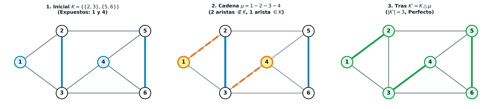

---

## Estructura del grafo diferencia simétrica

::: {.callout-note title="Lema: Estructura del grafo diferencia simétrica" data-kind="lema"}
Dados dos emparejamientos cualesquiera $K_1$ y $K_2$ en un grafo simple $G = (V, E)$, el subgrafo generado por la diferencia simétrica $G' = (V, K_1 \bigtriangleup K_2)$ está compuesto exclusivamente por:

1. **Vértices aislados** (grado $0$).
2. **Ciclos elementales alternantes** de longitud estrictamente par.
3. **Cadenas elementales alternantes** de longitud par o impar.
:::

---

## Análisis de grados en la diferencia simétrica

* **Grados nodales en $G' = (V, K_1 \bigtriangleup K_2)$**:
  * **$d_{G'}(v) = 0$**: Vértice no saturado por $K_1$ ni $K_2$, o saturado por la misma arista ($e \in K_1 \cap K_2$).
  * **$d_{G'}(v) = 1$**: Vértice saturado solo por uno de los dos emparejamientos (**extremos de cadenas**).
  * **$d_{G'}(v) = 2$**: Vértice saturado por aristas distintas en $K_1$ y $K_2$.

* **Consecuencia topológica**: $\Delta(G') \le 2$, impidiendo ramificaciones de grado $\ge 3$.

---

## Componentes conexas en la diferencia simétrica

  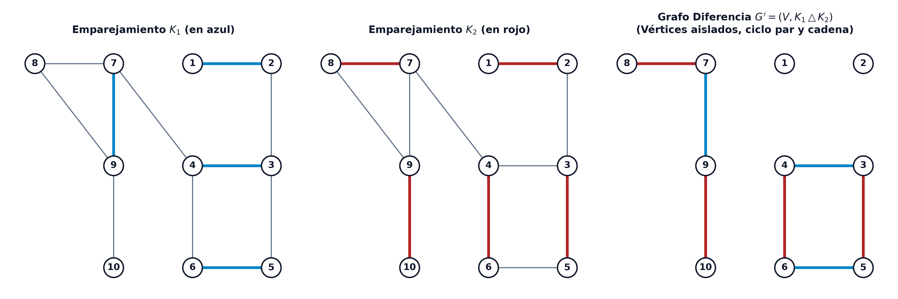

* Los ciclos deben tener longitud par obligatoria para alternar entre $K_1$ y $K_2$.

---

## Ejemplo Diferencia Simétrica: Grafo bipartito de 10 vértices

* **Estructura bipartita**:
  * Conjunto superior: $\{1, 2, 3, 4, 5\}$; Conjunto inferior: $\{6, 7, 8, 9, 10\}$.

* **Emparejamientos a comparar**:
  * **$K_1$ (azul, 3 aristas)**: $K_1 = \bigl\{ \{2,7\}, \, \{3,8\}, \, \{5,10\} \bigr\}$.
  * **$K_2$ (rojo, 2 aristas)**: $K_2 = \bigl\{ \{3,10\}, \, \{5,8\} \bigr\}$.

* **Objetivo de análisis**:
  * Superponer $K_1$ y $K_2$ en el subgrafo de discrepancias $G' = (V, K_1 \bigtriangleup K_2)$ y clasificar sus componentes conexas.

---

## Ejemplo Diferencia Simétrica: Descomposición de componentes

* **Componentes en $G' = (V, K_1 \bigtriangleup K_2)$**:
  1. **Ciclo alternante par**: $(3, 8, 5, 10, 3)$ de longitud 4 (2 aristas azules de $K_1$ y 2 rojas de $K_2$).
  2. **Cadena alternante**: $(2, 7)$ de longitud 1 (arista de $K_1$).
  3. **Vértices aislados**: $1, 4, 6, 9$.

  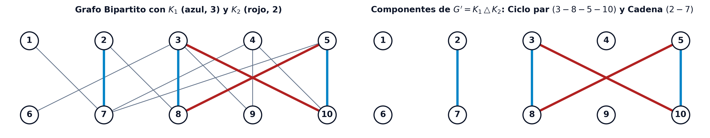

---

## Teorema de caracterización de Berge

::: {.callout-important title="Caracterización de Berge (1957)" data-kind="teorema"}
Dado un grafo $G = (V, E)$, un emparejamiento $K \subseteq E$ es de **máximo cardinal** si y solo si el grafo $G$ **no contiene ninguna cadena incremental** con respecto a $K$.
:::

* **Condición necesaria y suficiente**:
  * Si existe cadena incremental $\mu$, la transferencia $K \bigtriangleup \mu$ aumenta el cardinal.
  * Si no existen cadenas incrementales, la descomposición de $K \bigtriangleup K^*$ certifica $|K| = |K^*|$.

---

## Interpretación y analogías del Teorema de Berge

* **Certificado de optimalidad global**:
  * Una condición local determinista (ausencia de cadenas incrementales) certifica la optimalidad global.

* **Analogías fundamentales en Investigación Operativa**:
  * **Ford-Fulkerson (Capítulo 8)**: La ausencia de caminos de aumento en la red residual certifica el flujo máximo.
  * **Método del Símplex (Capítulo 3)**: La no negatividad de los costes reducidos certifica el óptimo lineal.

# Algoritmo del árbol alternante y contracción de flores (Edmonds)

## Variable indicadora de saturación y estructura de K

* **Variable indicadora de saturación $sat(x)$**:
  $$
  sat(x) = \begin{cases} 1, & \text{si } x \text{ está saturado por } K \\ 0, & \text{si } x \text{ es un vértice expuesto} \end{cases}
  $$

* **Bipartición de $G_K = (V, K)$**:
  * El subgrafo parcial formado exclusivamente por las aristas de $K$ es siempre un **grafo bipartito**, pues cada arista forma una componente $K_2$ independiente.

---

## Definición: Árbol alternante y bosque alternante

::: {.callout-note title="Árbol alternante y bosque alternante" data-kind="definicion"}
Dados un grafo $G = (V, E)$ y un emparejamiento $K \subseteq E$, un **árbol alternante** es un subgrafo parcial $H = (W, T)$ que satisface:

1. $H$ es un árbol (conexo y sin ciclos).
2. Existe un único vértice distinguido $r \in W$ (**raíz expuesta**, $sat(r) = 0$).
3. Cualquier cadena en $H$ que une un vértice $w \in W$ con la raíz $r$ es una **cadena alternante**.

Un conjunto de árboles alternantes disjuntos cuyas raíces son vértices expuestos forma un **bosque alternante** $\{H(r) : r \in R\}$.
:::

---

## Gestión computacional: Vector de antecesores p

* **Caracterización mediante el vector de padres $\mathbf{p} \in V^n$**:
  * Cada raíz $r \in R$ se identifica por la autorreferencia $p(r) = r$.
  * La única cadena alternante entre cualquier nodo $w$ y su raíz $r$ se recupera encadenando $\mathbf{p}$:
  $$
  w \longleftrightarrow p(w) \longleftrightarrow p(p(w)) \longleftrightarrow \cdots \longleftrightarrow r
  $$

---

## Ejemplo Bosque Alternante: Planteamiento y raíces en 6 nodos

* **Grafo de 6 vértices**:
  * $V = \{1, 2, 3, 4, 5, 6\}$ con aristas $\{\{1,4\}, \{1,5\}, \{1,6\}, \{2,5\}, \{3,5\}\}$.
  * Emparejamiento actual: $K = \bigl\{ \{1,4\}, \, \{2,5\} \bigr\}$ ($|K| = 2$).

* **Raíces expuestas ($sat = 0$)**:
  * $R = \{3, 6\}$. Iniciar dos árboles alternantes independientes: $H(3)$ y $H(6)$.
  * Desde raíz $3$: explorar $\{3,5\} \notin K$ y $\{5,2\} \in K$.
  * Desde raíz $6$: explorar $\{6,1\} \notin K$ y $\{1,4\} \in K$.

---

## Ejemplo Bosque Alternante: Vector p y Optimalidad

* **Árboles alternantes**: $H(3) = (\{2,3,5\}, \{\{3,5\}, \{2,5\}\})$; $H(6) = (\{1,4,6\}, \{\{6,1\}, \{1,4\}\})$.
* **Vector de padres**: $\mathbf{p}^T = (6, 5, 3, 1, 3, 6)$.
* **Optimalidad**: Al no alcanzarse más nodos libres, por Berge $K$ es de **máximo cardinal** ($|K|=2$).

  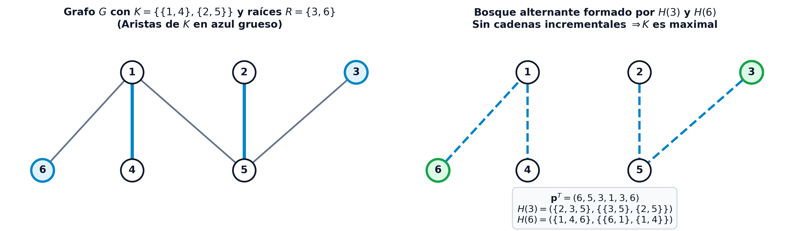

---

## Ejemplo Árbol 10 Nodos: Planteamiento y exploración desde raíz 1

* **Grafo bipartito con $K_1$ inicial**:
  $$K_1 = \bigl\{ \{2,7\}, \, \{3,8\}, \, \{5,10\} \bigr\} \quad (|K_1| = 3)$$

* **Exploración por niveles desde raíz expuesta $r = 1$ ($sat(1) = 0$)**:
  * $1 \to 7$ ($\notin K$) $\to 2$ ($\in K$).
  * $2 \to 8$ ($\notin K$) $\to 3$ ($\in K$).
  * $3 \to 10$ ($\notin K$) $\to 5$ ($\in K$).

* **Hojas libres alcanzadas desde nodo 3**:
  * $3 \to 6$ ($\notin K$, nodo libre $6$) y $3 \to 9$ ($\notin K$, nodo libre $9$).
  * Se detectan **dos cadenas incrementales disyuntivas** hacia la raíz 1.

---

## Ejemplo Árbol 10 Nodos: Vector p y Transferencia

* **Vector de padres**: $\mathbf{p}^T = (1, 7, 8, 0, 10, 3, 1, 2, 3, 3)$.
* **Transferencia por nodo 6**: $\mu = (6, 3, 8, 2, 7, 1) \implies K'_1 = \bigl\{ \{6,3\}, \{8,2\}, \{7,1\}, \{5,10\} \bigr\}$ ($|K'_1|=4$).

  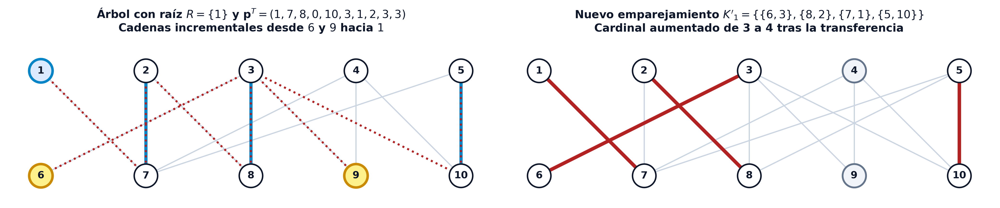

---

## El desafío de los ciclos impares en grafos generales

::: {.columns}
::: {.column width="50%"}
* **Grafos bipartitos**:
  * Todos los ciclos tienen longitud par.
  * La búsqueda con árboles alternantes progresa siempre de forma directa hacia nuevos vértices o detecta cadenas incrementales.
:::
::: {.column width="50%"}
* **Grafos generales y ciclos impares**:
  * Los ciclos de longitud impar (**flores** o *blossoms*) introducen una dificultad estructural.
  * Un ciclo impar puede hacer que un nodo sea alcanzable por caminos alternantes pares e impares.
:::
:::

---

## Propiedad de la flor en ciclos impares

  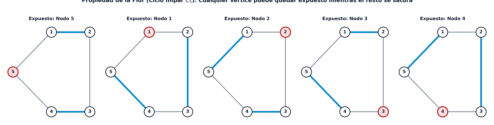

* En un ciclo impar de $2k + 1$ vértices ($C_5$), el emparejamiento maximal satura a $2k$ vértices con $k$ aristas.
* **Propiedad clave**: **Cualquiera de los $2k+1$ vértices del ciclo puede elegirse libremente como el vértice expuesto**.

---

## Definición: Grafo comprimido G/W

::: {.callout-note title="Contracción de un grafo (Grafo comprimido)" data-kind="definicion"}
Dado un grafo no dirigido $G = (V, E)$ y un subconjunto de vértices $W \subset V$ correspondiente a un ciclo impar, se define el **grafo comprimido** $G/W$ como:

$$
G/W = \bigl( (V \setminus W) \cup \{w\}, \, E/W \bigr)
$$

donde $w$ es un nuevo pseudovértice y $E/W$ reasigna las aristas incidentes en $W$ hacia $w$.
:::

---

## Teorema: Contracción de ciclos impares de Edmonds

::: {.callout-important title="Contracción de ciclos impares de Edmonds (1965)" data-kind="teorema"}
Sea $G = (V, E)$ un grafo, $W \subset V$ un subconjunto de vértices asociado a un ciclo de longitud impar, y sea $K_1$ un emparejamiento en el grafo comprimido $G/W$.

Entonces, existe un emparejamiento $K_W$ en el subgrafo generado por $W$ tal que:

$$
K = K_1 \cup K_W
$$

es un emparejamiento válido de $G$.
:::

---

## Reglas operativas de descompresión de flores

* **1. Existencia de vértice expuesto**:
  * Al ser $W$ un ciclo impar, siempre queda exactamente un vértice no saturado en $W$ respecto de $K_W$.

* **2. Libertad de selección**:
  * Siempre es posible elegir de forma determinista qué vértice del ciclo queda no saturado.

* **3. Alineación con la arista exterior**:
  * Si el pseudonodo $w$ está saturado en $K_1$, se deja no saturado en el ciclo el vértice $i \in W$ incidente en la arista exterior que satura a $w$.

---

## Advertencia: Maximalidad en grafos comprimidos

::: {.columns}
::: {.column width="55%"}
* **Advertencia teórica**:
  * Que $K_1$ sea **maximal** en $G/W$ no implica necesariamente que $K$ sea de **máximo cardinal** en $G$.

* **Contraejemplo**:
  * Ciclo $\{1, 2, 3\}$ y aristas exteriores $\{ \{1,6\}, \{2,4\}, \{3,5\} \}$.
  * En $G/W$, $K_1 = \bigl\{ \{w, 6\} \bigr\}$ es maximal pero produce $|K| = 2$ en $G$, cuando el óptimo en $G$ es $|K^*| = 3$.
:::
::: {.column width="45%"}

  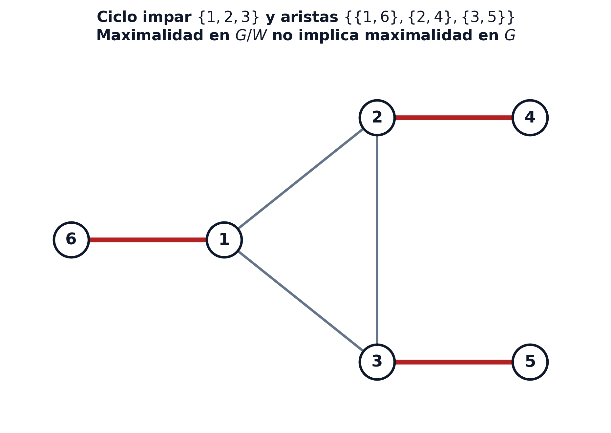

:::
:::

---

## Niveles en el árbol alternante: Vértices pares e impares

* **Estructura jerárquica $(Y, T)$**:
  * $Y \subseteq V$: Vértices explorados por el árbol.
  * $T \subseteq E$: Aristas del árbol alternante.

* **Conjunto de vértices pares ($Y^0 \subset Y$)**:
  * Vértices a distancia alternante par desde la raíz (incluye a la raíz a distancia 0).

* **Propiedad estructural de las hojas**:
  * Todas las hojas del árbol alternante deben ser obligatoriamente vértices pares ($Y^0$).

---

## Jerarquía de niveles del árbol alternante

  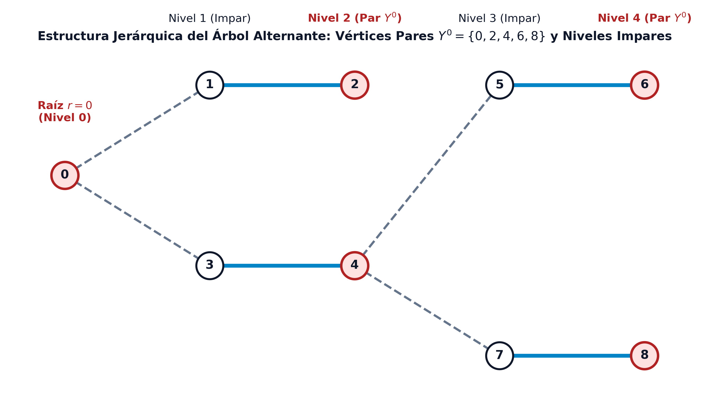

* Árbol alternante con raíz en $r = 0$. Vértices pares $Y^0 = \{0, 2, 4, 6, 8\}$ (en rojo).

---

## Reglas de exploración desde vértices pares Y0

* **1. Detección de Ciclos Impares (Flores)**:
  * Si existen dos vértices de $Y^0$ conectados por una arista $\{i, j\} \in E$, se detecta un **ciclo impar** (flor). Se contrae en un supernodo $w$.

* **2. Expansión del Árbol hacia $j \notin Y$**:
  * **Hacia adyacente no saturado ($sat(j) = 0$)**: Se detecta una **cadena alternante incremental** entre la raíz y $j$.
  * **Hacia adyacente saturado ($sat(j) = 1$)**: Si $\{j, k\} \in K$, se incorporan $\{i, j\}$ y $\{j, k\}$, añadiendo $k$ a $Y^0$.

---

## Algoritmo de Flor de Edmonds: Paso A y Paso B

::: {.callout-note title="Esquema: Algoritmo de Flor de Edmonds (Parte 1)" data-kind="esquema"}
* **Paso A (Inicialización)**:
  * Encontrar un emparejamiento inicial factible $K$ en $G$ (por ejemplo, $K = \emptyset$).

* **Paso B (Condición de parada elemental)**:
  * Si el número de vértices no saturados por $K$ es $0$ o $1$, **PARAR**: $K$ es de máximo cardinal. En caso contrario, ir al **Paso C**.
:::

---

## Algoritmo de Flor de Edmonds: Paso C (Casos 1 y 2)

::: {.callout-note title="Esquema: Algoritmo de Flor de Edmonds (Paso C - Casos 1 y 2)" data-kind="esquema"}
* **Paso C.1**: Seleccionar una raíz expuesta $i_0 \in V$ ($sat(i_0) = 0$). Inicializar $Y = Y^0 = \{i_0\}$, $T = \emptyset$.
* **Paso C.2 (Exploración desde $Y^0$)**:
  * **Caso 1 (Detección de Flor)**: Si existen $i, j \in Y^0$ con $\{i, j\} \in E$, contraer el ciclo impar $W$ en $G/W$, actualizar $Y$ y $Y^0$ y volver al Paso C.2.
  * **Caso 2 (Extensión del Árbol)**: Si existe $i \in Y^0$ y $j \notin Y$ saturado por $\{j, k\} \in K$ con $\{i, j\} \in E$, incorporar $\{i, j\}$ y $\{j, k\}$ al árbol: $Y \leftarrow Y \cup \{j, k\}$, $Y^0 \leftarrow Y^0 \cup \{k\}$ y volver al Paso C.2.
:::

---

## Algoritmo de Flor de Edmonds: Paso C (Casos 3 y 4)

::: {.callout-note title="Esquema: Algoritmo de Flor de Edmonds (Paso C - Casos 3 y 4)" data-kind="esquema"}
* **Caso 3 (Detección de Cadena Incremental)**:
  * Si existe $i \in Y^0$ y $j \notin Y$ expuesto ($sat(j) = 0$) con $\{i, j\} \in E$, se detecta una **cadena incremental** $\mu$.
  * Realizar la transferencia $K \leftarrow K \bigtriangleup \mu$, descontraer todas las flores activas y volver al **Paso B**.

* **Caso 4 (Árbol Bloqueado / Húngaro)**:
  * Si no es posible aplicar ningún caso desde $Y^0$, fijar $i_0$ como no aumentable. Si quedan raíces sin explorar, ir a C.1; si no, **PARAR**: $K$ es de **máximo cardinal**.
:::

---

## Ejemplo Edmonds: Traza completa en grafo de 8 nodos

* **Grafo $G=(V, E)$ de 8 vértices y 10 aristas**:
  * $V = \{1, 2, 3, 4, 5, 6, 7, 8\}$.
  * $E = \bigl\{ \{6,7\}, \{7,8\}, \{1,2\}, \{2,3\}, \{3,4\}, \{4,5\}, \{4,6\}, \{1,5\}, \{1,7\}, \{2,8\} \bigr\}$.

* **Fase Inicial**:
  * **Paso A**: $K = \emptyset$. Vértices expuestos: $\{1, 2, 3, 4, 5, 6, 7, 8\}$.
  * **Paso B**: 8 vértices expuestos ($> 1$) $\implies$ Proceder al Paso C.

---

## Ejemplo Edmonds: Iteración 1 - Estado inicial K0

::: {.columns}
::: {.column width="50%"}
* **Paso C.1**: Raíz expuesta $i_0 = 1$. $Y = Y^0 = \{1\}$, $T = \emptyset$.
* **Paso C.2**:
  * Para $1 \in Y^0$, vecino expuesto $2 \notin Y$ con $\{1,2\} \in E$ (Caso 3).
  * Cadena incremental: $\mu_1 = (1, 2)$.
* **Transferencia**:
  $$K^1 = \bigl\{ \{1,2\} \bigr\}$$
:::
::: {.column width="50%"}

  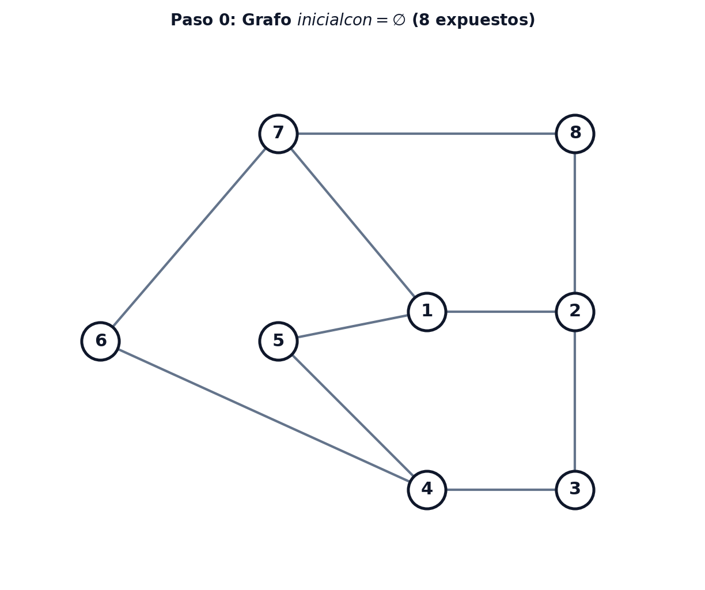

:::
:::

---

## Ejemplo Edmonds: Iteración 1 - Transferencia a K1

::: {.columns}
::: {.column width="50%"}
* **Nuevo estado $K^1 = \{\{1, 2\}\}$**:
  * Cardinal $|K^1| = 1$.
  * Vértices saturados: $\{1, 2\}$.
  * Vértices expuestos: $\{3, 4, 5, 6, 7, 8\}$.
:::
::: {.column width="50%"}

  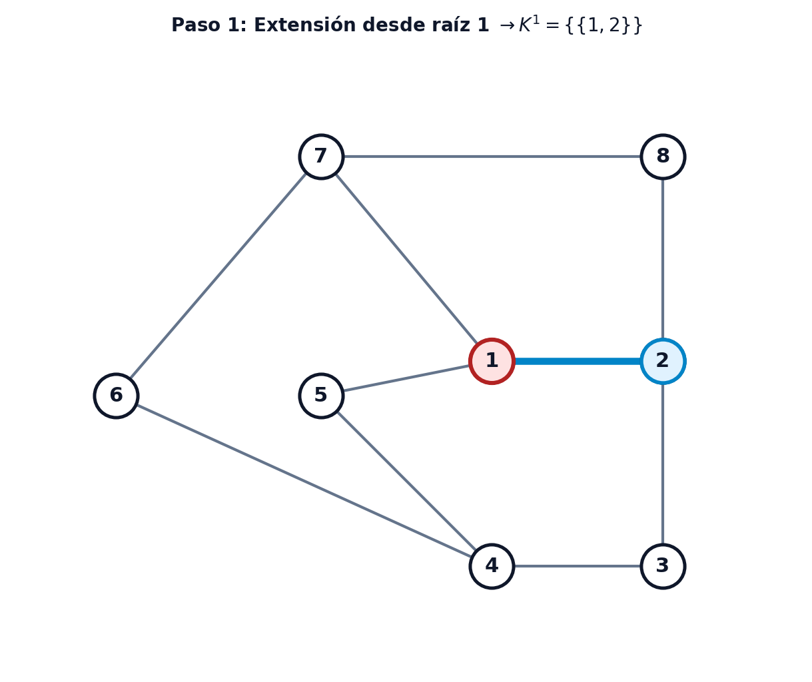

:::
:::

---

## Ejemplo Edmonds: Iteración 2 - Exploración desde raíz 3

::: {.columns}
::: {.column width="50%"}
* **Paso B**: 6 expuestos $\implies$ Paso C.
* **Paso C.1**: Raíz expuesta $i_0 = 3$. $Y = Y^0 = \{3\}$.
* **Paso C.2 (Extensión del árbol)**:
  * Vecino saturado $2 \notin Y$ (por $\{1,2\} \in K$).
  * Se incorporan $\{2,3\}$ y $\{1,2\}$:
    $$Y = \{1, 2, 3\}, \quad Y^0 = \{1, 3\}$$
:::
::: {.column width="50%"}

  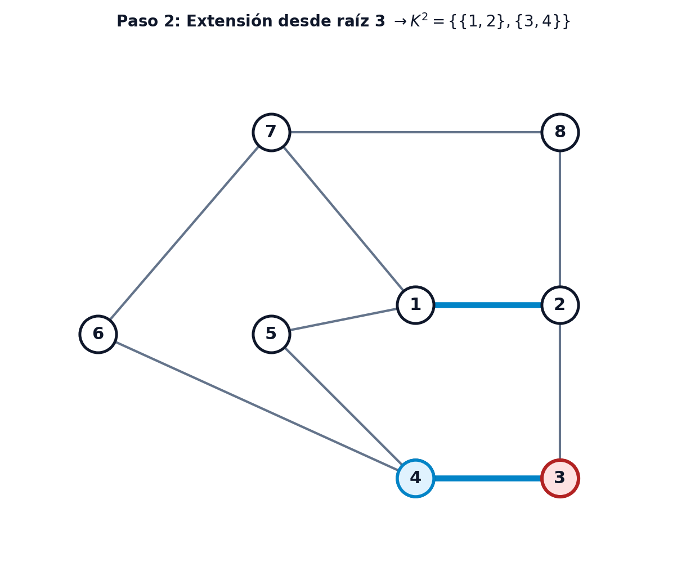

:::
:::

---

## Ejemplo Edmonds: Iteración 2 - Transferencia a K2

::: {.columns}
::: {.column width="50%"}
* **Detección de cadena incremental**:
  * Desde $3 \in Y^0$, vecino expuesto $4 \notin Y$ con $\{3,4\} \in E$ (Caso 3).
  * Cadena incremental: $\mu_2 = (3, 4)$.

* **Transferencia**:
  $$K^2 = \bigl\{ \{1,2\}, \, \{3,4\} \bigr\} \quad (|K^2| = 2)$$
  * Vértices libres restantes: $\{5, 6, 7, 8\}$.
:::
::: {.column width="50%"}

  

:::
:::

---

## Ejemplo Edmonds: Iteración 3 - Exploración desde raíz 5

::: {.columns}
::: {.column width="50%"}
* **Paso B**: 4 expuestos $\{5, 6, 7, 8\}$.
* **Paso C.1**: Raíz expuesta $i_0 = 5$. $Y = Y^0 = \{5\}$.
* **Paso C.2 (Extensiones sucesivas)**:
  * Vecino saturado $1 \implies$ añadir $\{5,1\}$ y $\{1,2\}$.
  * Vecino saturado $4 \implies$ añadir $\{5,4\}$ y $\{4,3\}$.
  $$Y = \{1, 2, 3, 4, 5\}, \quad Y^0 = \{2, 3, 5\}$$
:::
::: {.column width="50%"}

  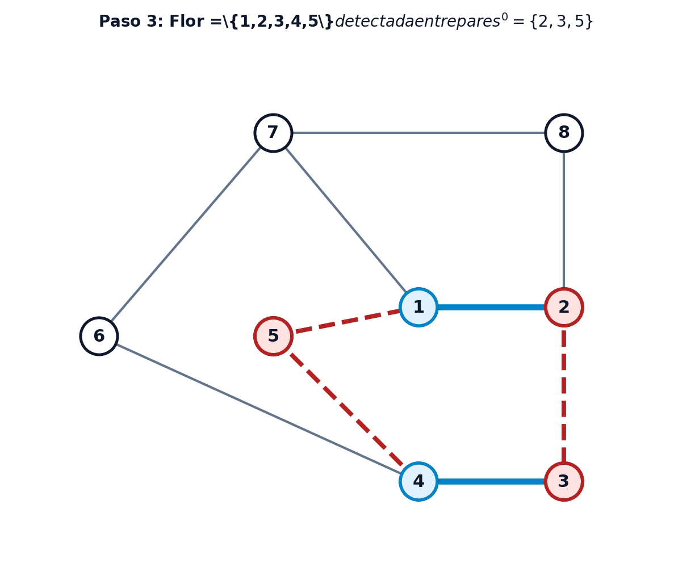

:::
:::

---

## Ejemplo Edmonds: Iteración 3 - Detección de la Flor W

::: {.columns}
::: {.column width="50%"}
* **Caso 1 (Detección de Flor)**:
  * Entre los nodos pares $Y^0 = \{2, 3, 5\}$, existe la arista $\{2, 3\} \in E$.
  * Se identifica el ciclo impar de 5 vértices:
    $$W = \{1, 2, 3, 4, 5\}$$
:::
::: {.column width="50%"}

  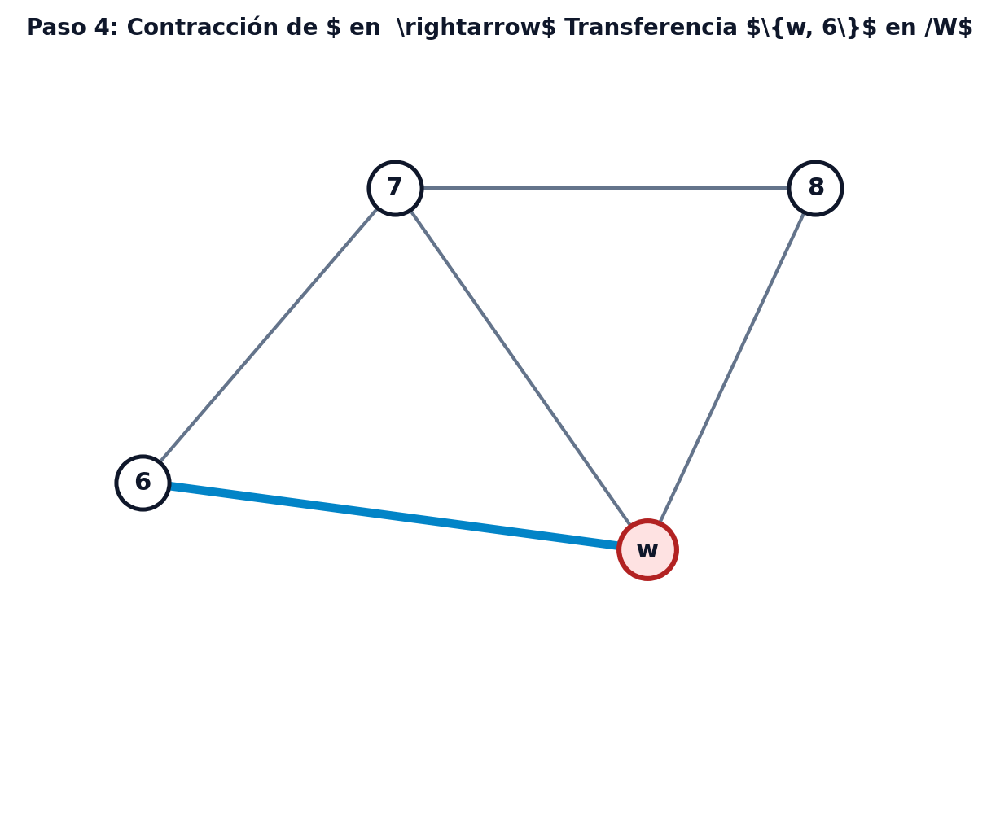

:::
:::

---

## Ejemplo Edmonds: Iteración 3 - Contracción al pseudonodo w

::: {.columns}
::: {.column width="50%"}
* **Contracción de $W$**:
  * Comprimimos $W$ en el pseudonodo $w$.
  * Grafo comprimido $G/W$ con vértices $\{w, 6, 7, 8\}$.
  * Árbol actualizado: $Y = Y^0 = \{w\}$, $K = \emptyset$.
* **Transferencia en $G/W$**:
  * Arista $\{w, 6\}$ a nodo expuesto $6 \implies K = \bigl\{ \{w, 6\} \bigr\}$.
:::
::: {.column width="50%"}

  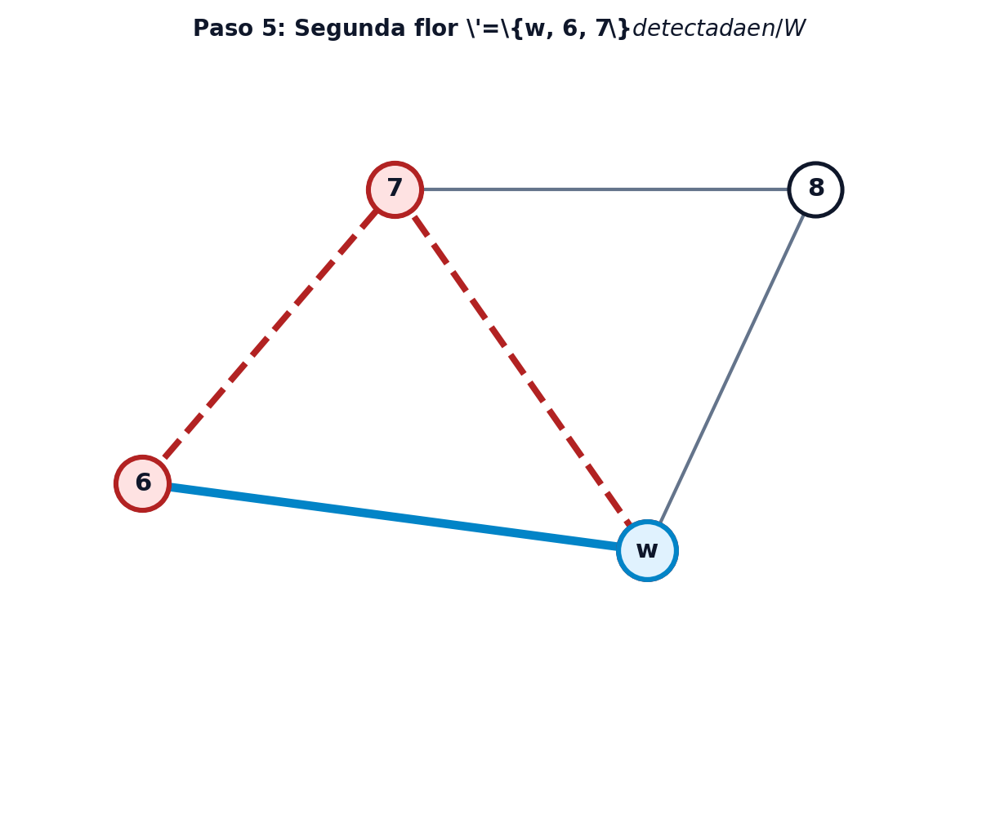

:::
:::

---

## Ejemplo Edmonds: Iteración 4 - Exploración en G/W

::: {.columns}
::: {.column width="50%"}
* **Paso B en $G/W$**: Expuestos $\{7, 8\}$.
* **Paso C.1**: Raíz $i_0 = 7$. $Y = Y^0 = \{7\}$.
* **Paso C.2 (Extensión)**:
  * Vecino saturado $w \implies$ añadir $\{7,w\}$ y $\{w,6\}$.
  $$Y = \{w, 6, 7\}, \quad Y^0 = \{6, 7\}$$
* **Detección de Segunda Flor**:
  * Arista $\{6, 7\} \in E$ entre pares $\implies W' = \{w, 6, 7\}$.
:::
::: {.column width="50%"}

  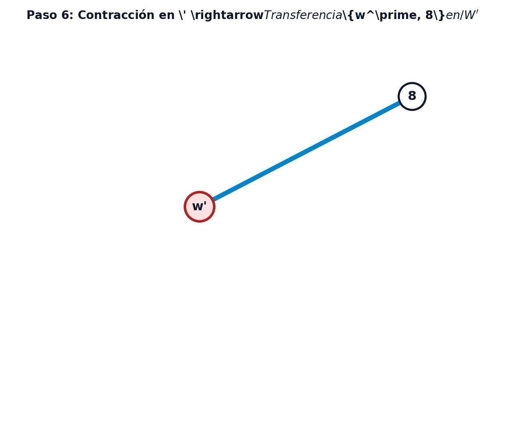

:::
:::

---

## Ejemplo Edmonds: Fase de Descompresión de W'

::: {.columns}
::: {.column width="50%"}
* **Segunda contracción y parada**:
  * Comprimir $W'$ en $w'$. Arista $\{w', 8\} \implies K = \bigl\{ \{w', 8\} \bigr\}$.
  * 0 vértices libres en $G/W' \implies$ ¡Parada alcanzada!

* **Descompresión de $W'$**:
  * $\{w', 8\} \to \{7, 8\} \in E$.
  * En $W'$, arista interna $\{w, 6\}$.
  $$K = \bigl\{ \{w, 6\}, \, \{7, 8\} \bigr\} \text{ en } G/W$$
:::
::: {.column width="50%"}

  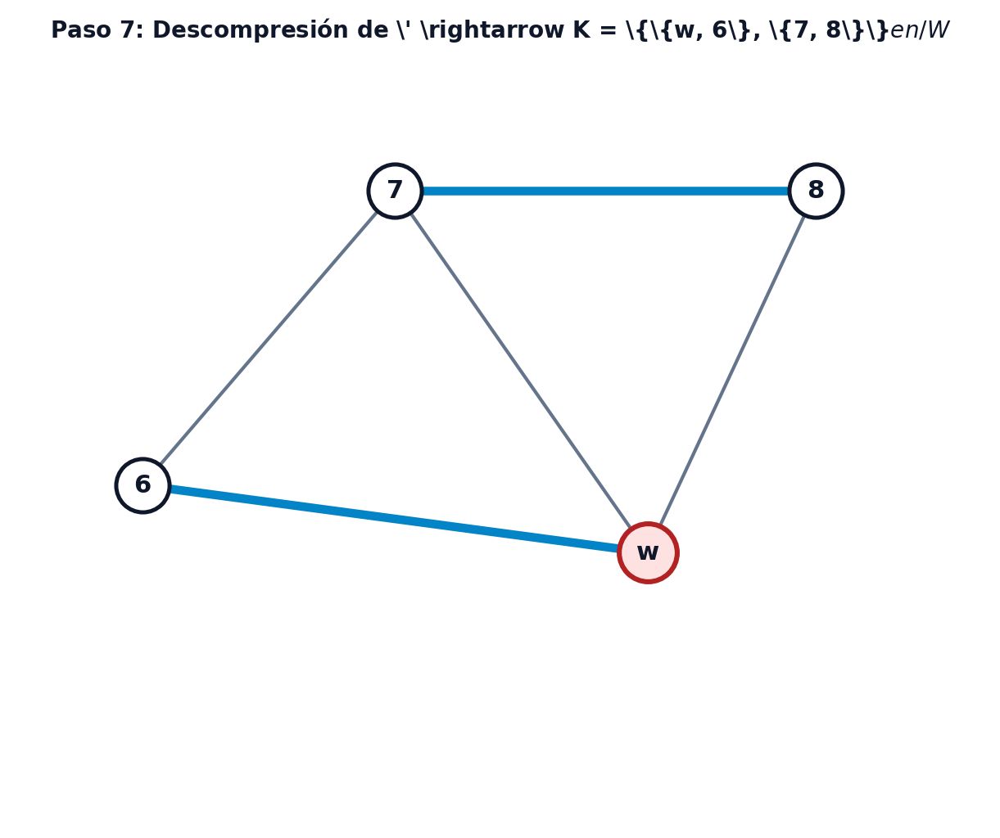

:::
:::

---

## Ejemplo Edmonds: Descompresión de W y Solución Perfecta

::: {.columns}
::: {.column width="50%"}
* **Descompresión de $W = \{1, 2, 3, 4, 5\}$**:
  * $\{w, 6\} \to \{4, 6\} \in E$.
  * Nodo 4 saturado exteriormente.
  * En $W$, emparejamiento interno $\{1, 5\}$ y $\{2, 3\}$.

* **Emparejamiento Óptimo Final**:
  $$K^* = \bigl\{ \{1, 5\}, \, \{2, 3\}, \, \{4, 6\}, \, \{7, 8\} \bigr\}$$
  * Cardinal $|K^*| = 4$ (**emparejamiento perfecto**).
:::
::: {.column width="50%"}

  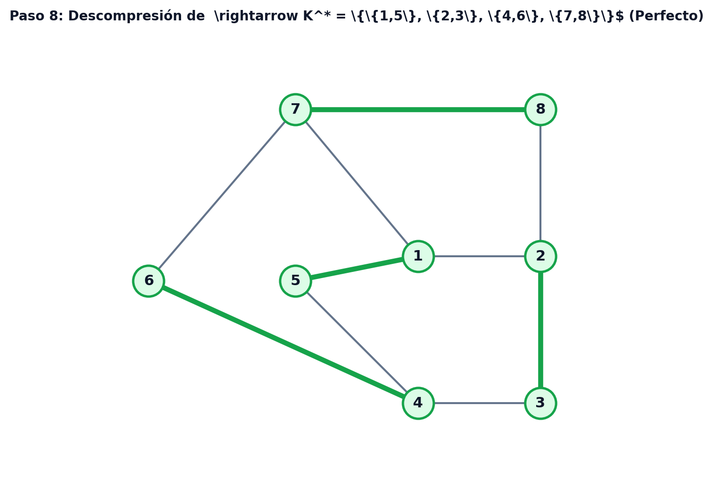

:::
:::

---

## Ejemplo Edmonds: Animación de la traza completa

<iframe src="../images/edmonds_blossom_player.html" style="width:100%; height:520px; border:none; display:block; margin:0 auto;" scrolling="no"></iframe>

---

## Complejidad y síntesis del Algoritmo de Edmonds

* **Complejidad polinomial**:
  * Búsqueda por árbol y contracciones: $\mathcal{O}(|V|^2 |E|)$ o $\mathcal{O}(|E|\sqrt{|V|})$ con estructuras avanzadas.
  * Pertenece estrictamente a la clase de complejidad **P**.

* **Síntesis metodológica**:
  1. Construir árboles alternantes desde raíces expuestas.
  2. Contraer ciclos impares (flores) entre nodos pares $Y^0$.
  3. Transferir al hallar vértices expuestos y descomprimir flores.

# Problemas de recubrimiento en grafos y relaciones de dualidad

## Ejemplo: Vigilancia de murallas en la fortaleza

* **Recinto de 12 torres**: Cada guardia asignado a una muralla $\{u, v\}$ vigila las dos torres extremas ($u$ y $v$).
* **Objetivo**: Hallar el **número mínimo de guardias** necesarios para que **todas las torres queden vigiladas**.

  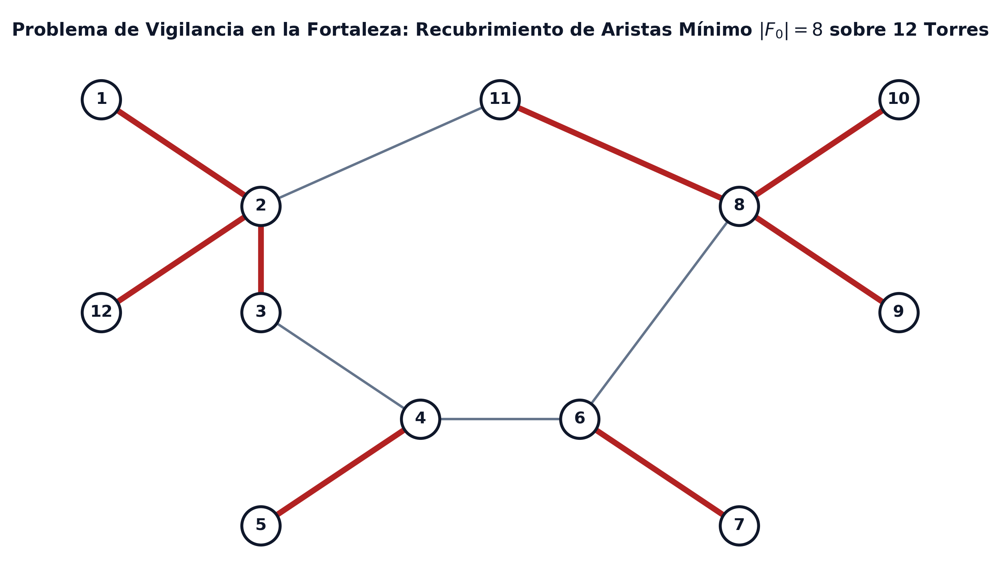

---

## Ejemplo: Solución de recubrimiento mínimo en la fortaleza

* **Modelo como recubrimiento de aristas $F \subseteq E$**:
  * Todo vértice $v \in V$ debe ser incidente en al menos una arista de $F$ ($\sum x_e \ge 1$).

* **Selección óptima de 8 aristas (en rojo)**:
  $$
  F_0 = \bigl\{ \{1,2\}, \, \{2,12\}, \, \{2,3\}, \, \{4,5\}, \, \{6,7\}, \, \{8,9\}, \, \{8,10\}, \, \{8,11\} \bigr\}
  $$

* **Resultado**:
  * Se cubren las 12 torres con $|F_0| = 8$ guardias a coste mínimo.

---

## Definición: Recubrimiento de aristas (Edge Cover)

::: {.callout-note title="Recubrimiento de aristas (Edge Cover)" data-kind="definicion"}
Dado un grafo no dirigido $G = (V, E)$ sin vértices aislados, un **recubrimiento de aristas** (o *edge cover*) es un subconjunto de aristas $F \subseteq E$ tal que todo vértice $v \in V$ es incidente en al menos una arista de $F$:

$$
\bigcup_{e \in F} e = V
$$
:::

* **Condición de existencia**: Requiere que $G$ no contenga vértices aislados ($\operatorname{gr}(v) \ge 1, \; \forall v \in V$).

---

## Monotonía del recubrimiento

::: {.callout-note title="Monotonía del recubrimiento" data-kind="corolario"}
Dado un grafo $G = (V, E)$ y un recubrimiento de aristas $F \subseteq E$, si $F' \subseteq E$ satisface $F \subseteq F'$, entonces $F'$ es también un recubrimiento de aristas de $G$.
:::

* **Contraste dual con emparejamientos**:
  * **Emparejamientos**: Hereditarios hacia abajo ($K' \subseteq K \implies K'$ emparejamiento).
  * **Recubrimientos**: Monótonos crecientes hacia arriba ($F \subseteq F' \implies F'$ recubrimiento).

---

## Teorema: Dualidad de Gallai para emparejamientos y recubrimientos

::: {.callout-important title="Dualidad de Gallai para emparejamientos y recubrimientos (1959)" data-kind="teorema"}
Sea $G = (V, E)$ un grafo simple conexo con $n = |V|$ vértices y sin nodos aislados. Sean $K_0 \subseteq E$ un emparejamiento de **máximo cardinal** y $F_0 \subseteq E$ un recubrimiento de aristas de **mínimo cardinal**. Entonces se verifica la identidad exacta:

$$
|K_0| + |F_0| = n
$$
:::

---

## Construcción del recubrimiento mínimo F1 a partir de K0

* **Algoritmo constructivo directo**:
  1. Obtener el emparejamiento de máximo cardinal $K_0$.
  2. $K_0$ satura a $2|K_0|$ vértices, dejando $n - 2|K_0|$ vértices expuestos.
  3. Añadir una arista incidente $e_v \in E$ para cada vértice expuesto $v \notin V(K_0)$:
  $$
  F_1 = K_0 \cup \bigl\{ e_v \in E \mid v \in V \setminus V(K_0) \bigr\}
  $$

* **Cardinal mínimo**: $|F_1| = |K_0| + (n - 2|K_0|) = n - |K_0| \implies |K_0| + |F_1| = n$.

---

## Construcción del emparejamiento máximo K1 a partir de F0

* **Algoritmo constructivo recíproco**:
  1. Sea $F_0$ un recubrimiento de aristas de mínimo cardinal.
  2. El subgrafo $(V, F_0)$ está formado exclusivamente por estrellas conexas (árboles de profundidad 1).
  3. Para cada estrella con $k \ge 2$ aristas, eliminar $k - 1$ aristas redundantes, conservando una única arista por componente:
  $$
  K_1 = F_0 \setminus \bigl\{ \text{aristas sobrantes en vértices de grado } > 1 \text{ en } F_0 \bigr\}
  $$
  4. $K_1$ es un **emparejamiento de máximo cardinal** ($|K_1| = |K_0|$).

---

## Significado combinatorio: Relación de conservación de Gallai

* **Dualidad entre Packing y Covering**:
  * Cada arista de un emparejamiento satura a $2$ vértices distintos.
  * Cada arista adicional de un recubrimiento cubre a $1$ vértice libre.

* **Conservación estructural**:
  * El déficit de aristas en el emparejamiento respecto del total de nodos se traduce exactamente en el superávit de aristas requeridas para el recubrimiento mínimo.

---

## Ejemplo: Ilustración de la Dualidad de Gallai en 11 vértices

* **Grafo de 11 vértices**: $K_0 = \{\{1,2\}, \{3,4\}, \{5,6\}, \{7,8\}\}$ ($|K_0|=4$). Expuestos: $9, 10, 11$.
* **Recubrimiento mínimo**: Se añaden 3 aristas $\implies |F_0| = 4 + 3 = 7$ (en rojo). **Identidad**: $|K_0| + |F_0| = 4 + 7 = 11 = |V|$.

  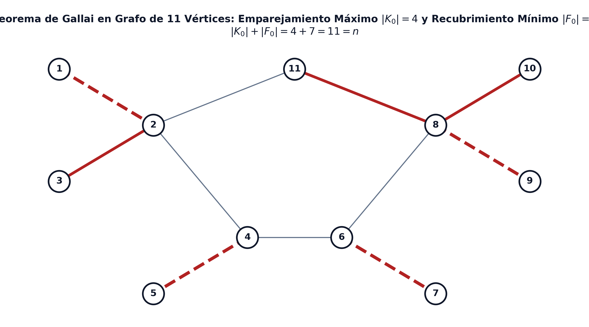

# Emparejamiento de máximo peso y algoritmo primal-dual

## Definición: Problema de emparejamiento de máximo peso

::: {.callout-note title="Problema de emparejamiento de máximo peso" data-kind="definicion"}
Dado un grafo simple no dirigido $G = (V, E)$ y un vector de pesos $\mathbf{p} = \{p(e) \mid e \in E\}$, el **problema de emparejamiento de máximo peso** consiste en determinar un emparejamiento $K \subseteq E$ que maximice:

$$
p(K) = \sum_{e \in K} p(e)
$$
:::

* **Ponderación vs Cardinalidad**:
  * Un emparejamiento óptimo en peso no tiene por qué saturar el mayor número de vértices si aristas individuales concentran pesos superiores.

---

## Definición: Coste reducido de una cadena alternante

::: {.callout-note title="Coste reducido de una cadena alternante" data-kind="definicion"}
Dado un grafo $G = (V, E)$ con pesos $p(e)$, un emparejamiento $K \subseteq E$ y una cadena alternante $L$, se define el **coste reducido** de $L$ respecto de $K$, denotado por $\delta_L$, como:

$$
\delta_L = p(L \cap \overline{K}) - p(L \cap K) = \sum_{e \in L \setminus K} p(e) - \sum_{e \in L \cap K} p(e)
$$

donde $\overline{K} = E \setminus K$.
:::

---

## Definición: Ciclo alternante y signo del coste reducido

::: {.callout-note title="Ciclo alternante" data-kind="definicion"}
Dado un grafo $G = (V, E)$ y un emparejamiento $K \subseteq E$, un **ciclo alternante** es una cadena alternante cerrada y simple de longitud estrictamente par, cuyas aristas pertenecen y no pertenecen alternativamente a $K$.
:::

* **Impacto económico**:
  * Si $\delta_L > 0$, la transferencia incrementa el peso: $p(K') = p(K) + \delta_L$.
  * Si $\delta_L = 0$, mantiene invariable el peso acumulado.

---

## Teorema: Optimalidad por costes reducidos

::: {.callout-important title="Optimalidad por costes reducidos" data-kind="teorema"}
Dado un grafo $G = (V, E)$ con pesos $p(e)$ sobre las aristas, un emparejamiento $K \subseteq E$ es de **máximo peso** si y solo si **no existe ninguna cadena alternante** (abierta o cerrada) con coste reducido estrictamente positivo ($\delta_L \le 0$ para toda cadena alternante $L$).
:::

* **Generalización de Berge**:
  * Cardinal: Cadenas incrementales (ganancia $+1$ arista).
  * Ponderado: Cadenas con ganancia neta de peso positiva ($\delta_L > 0$).

---

## Algoritmo de aumento por cardinalidad fija

* **Construcción inductiva por cardinalidades $m = 1, 2, \dots, \lfloor n/2 \rfloor$**:
  * **$K^1$**: Arista individual de mayor peso en $E$.
  * **$K^2$**: Par de aristas disjuntas de mayor suma de pesos en $E$.
  * **$K^{m+1}$**: Se obtiene inductivamente a partir de $K^m$ mediante transferencias de coste reducido máximo.

---

## Teorema: Progresión de emparejamientos de peso máximo

::: {.callout-important title="Progresión de emparejamientos de peso máximo" data-kind="teorema"}
Sea $G = (V, E)$ un grafo, sea $K^m$ el emparejamiento de máximo peso entre todos los de cardinal $m$, y sea $L$ una **cadena alternante incremental** respecto de $K^m$ que posea el **coste reducido máximo** ($\delta(L) = \max \delta$).

Entonces, el emparejamiento $K^{m+1} = K^m \bigtriangleup L$ obtenido por la transferencia de $L$ es el **emparejamiento de máximo peso entre todos los de cardinal $m + 1$**.
:::

---

## Ejemplo: Emparejamiento de peso máximo en grafo de 6 nodos

* **Grafo ponderado de 6 vértices y 9 aristas**:
  $$
  \begin{aligned}
  & p(4,5)=5, \quad p(3,4)=4, \quad p(2,3)=3, \quad p(6,3)=3, \quad p(6,5)=2, \\
  & p(1,2)=2, \quad p(6,2)=2, \quad p(1,6)=1, \quad p(2,4)=1
  \end{aligned}
  $$

* **Objetivo algorítmico**: Determinar inductivamente la sucesión de emparejamientos óptimos $K^1, K^2, K^3$.

  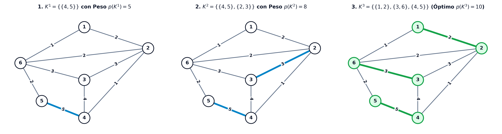

---

## Ejemplo Peso Máximo: Paso 1 (Cardinal m = 1)

::: {.columns}
::: {.column width="50%"}
* **Arista de peso máximo**:
  $$e^* = \{4, 5\} \quad \text{con } p(4, 5) = 5$$

* **Emparejamiento $K^1$**:
  $$K^1 = \bigl\{ \{4, 5\} \bigr\}, \quad p(K^1) = 5$$

* **Vértices expuestos**: $\{1, 2, 3, 6\}$.
:::
::: {.column width="50%"}

  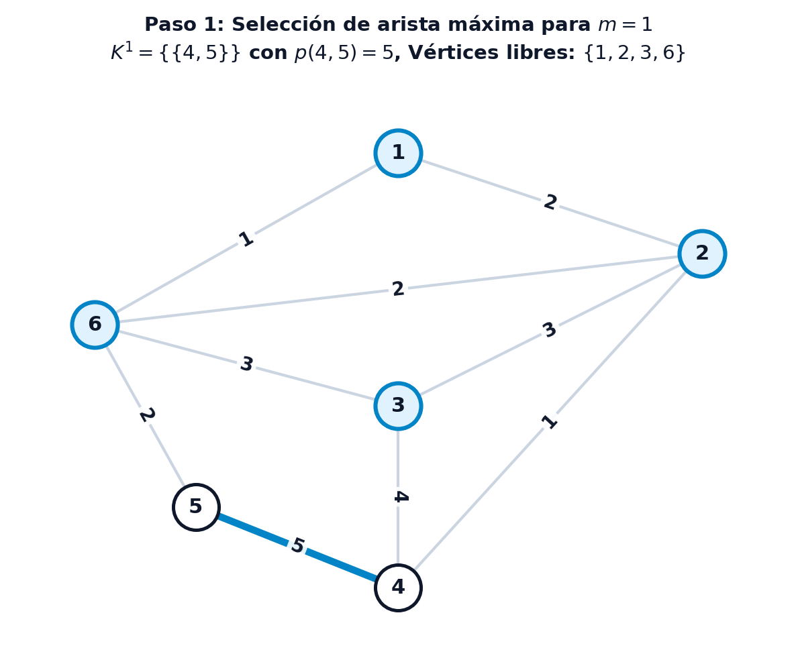

:::
:::

---

## Ejemplo Peso Máximo: Paso 2a - Búsqueda de aumento para m = 2

::: {.columns}
::: {.column width="50%"}
* **Evaluación de aristas disjuntas a $\{4,5\}$**:
  * $\{2, 3\}$: $\delta = p(2, 3) = 3$.
  * $\{6, 3\}$: $\delta = p(6, 3) = 3$.
  * $\{1, 2\}$: $\delta = p(1, 2) = 2$.

* **Selección de la arista óptima**:
  * Se selecciona $L_1 = \{2, 3\}$ con incremento máximo $\delta(L_1) = 3$.
:::
::: {.column width="50%"}

  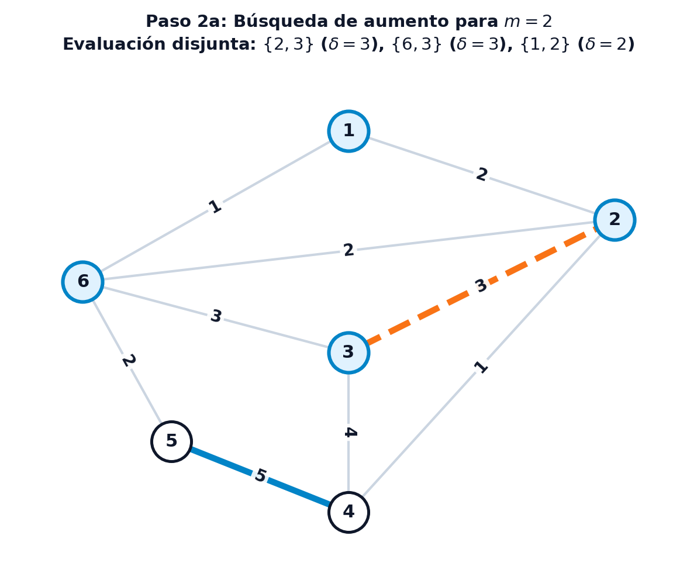

:::
:::

---

## Ejemplo Peso Máximo: Paso 2b - Transferencia a K2

::: {.columns}
::: {.column width="50%"}
* **Nuevo estado $K^2$**:
  $$K^2 = K^1 \cup \bigl\{ \{2, 3\} \bigr\} = \bigl\{ \{4, 5\}, \, \{2, 3\} \bigr\}$$
  $$p(K^2) = 5 + 3 = 8$$

* **Vértices expuestos restantes**:
  * Vértices libres: $\{1, 6\}$.
:::
::: {.column width="50%"}

  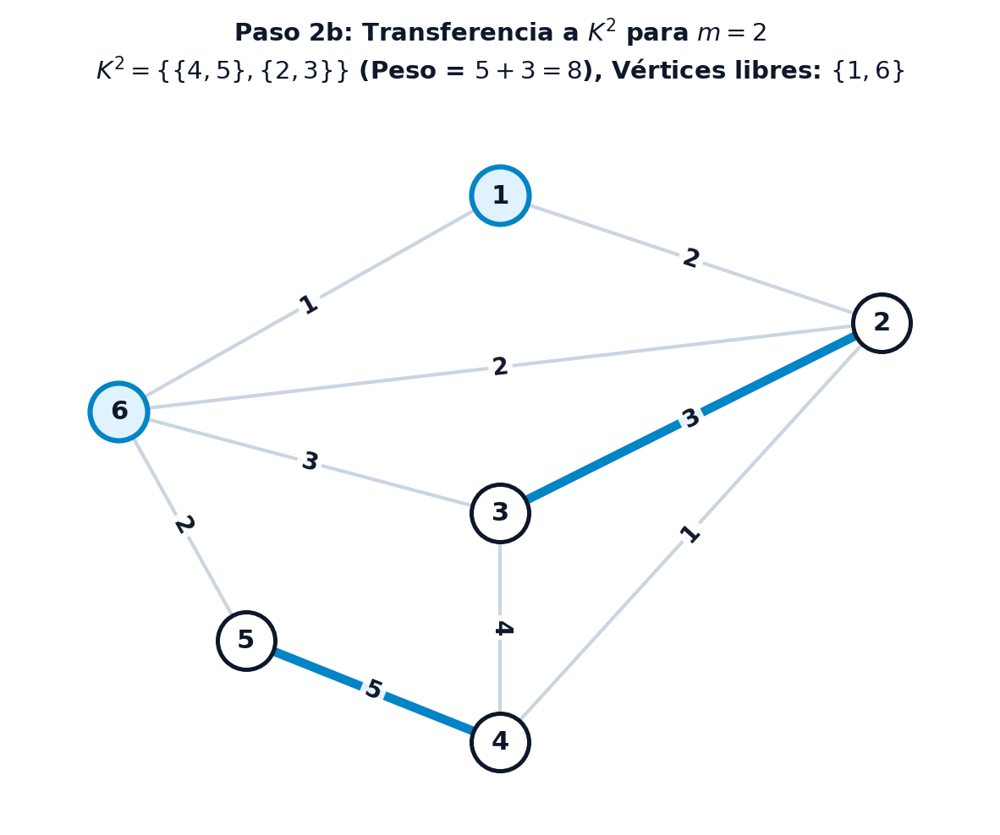

:::
:::

---

## Ejemplo Peso Máximo: Paso 3a - Evaluación de cadenas para m = 3

::: {.columns}
::: {.column width="50%"}
* **Cadenas entre expuestos 1 y 6**:
  1. $L_A = 1 - 6$: $\delta = p(1, 6) = 1$.
  2. **$L_B = 1 - 2 - 3 - 6$**:
     $$\delta(L_B) = (2 + 3) - 3 = \mathbf{2}$$
  3. $L_C = 1 - 2 - 3 - 4 - 5 - 6$:
     $$\delta(L_C) = (2 + 4 + 2) - (3 + 5) = \mathbf{0}$$

* **Selección de la cadena máxima**:
  * Cadena de ganancia máxima: **$L_B$** ($\delta = 2$).
:::
::: {.column width="50%"}

  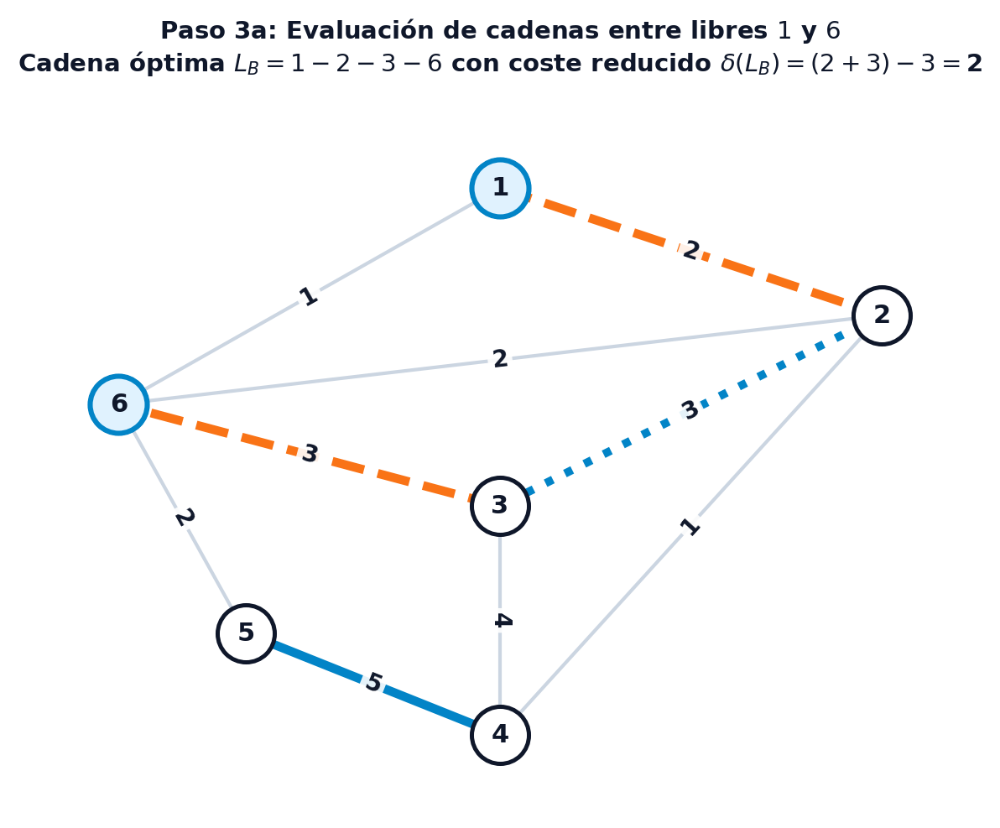

:::
:::

---

## Ejemplo Peso Máximo: Paso 3b - Transferencia a K3 y Solución Óptima

::: {.columns}
::: {.column width="50%"}
* **Transferencia $K^3 = K^2 \bigtriangleup (1-2-3-6)$**:
  * Entran $\{1, 2\}$ y $\{3, 6\}$; sale $\{2, 3\}$.
  $$K^3 = \bigl\{ \{1, 2\}, \, \{3, 6\}, \, \{4, 5\} \bigr\}$$
  $$p(K^3) = p(K^2) + \delta(L_B) = 8 + 2 = \mathbf{10}$$

* **Optimalidad global absoluta**:
  * $K^3$ es **perfecto** y de **máximo peso global**.
:::
::: {.column width="50%"}

  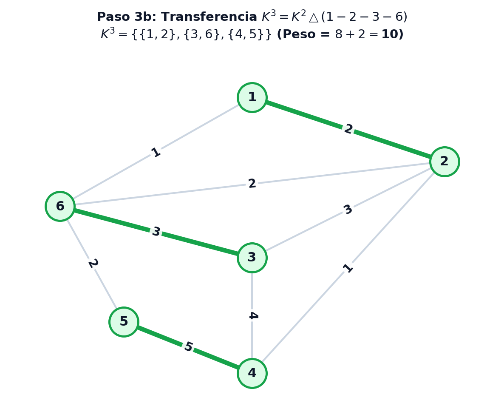

:::
:::

---

## Ejemplo Peso Máximo: Animación de la traza completa

<iframe src="../images/emparejamiento_peso_player.html" style="width:100%; height:520px; border:none; display:block; margin:0 auto;" scrolling="no"></iframe>

---

## Resumen de la traza y síntesis del Tema 9

* **Evolución por cardinalidades**:

| Cardinal $m$ | Emparejamiento óptimo $K^m$ | Cadena aplicada $\mu^*$ | Ganancia $\delta$ | Peso Total $p(K^m)$ |
| :---: | :---: | :---: | :---: | :---: |
| **$m = 1$** | $\{\{4, 5\}\}$ | Arista máxima $\{4, 5\}$ | $+5$ | **5** |
| **$m = 2$** | $\{\{4, 5\}, \{2, 3\}\}$ | $\{2, 3\}$ | $+3$ | **8** |
| **$m = 3$** | $\{\{1, 2\}, \{3, 6\}, \{4, 5\}\}$ | $1 - 2 - 3 - 6$ | $+2$ | **10** |

* **Conclusiones del capítulo**:
  * **Berge**: Ausencia de cadenas incrementales $\iff$ Máximo cardinal.
  * **Edmonds**: Contracción de flores para grafos generales en tiempo polinomial.
  * **Gallai**: Identidad exacta $|K_0| + |F_0| = n$.
  * **Pesos**: Progresión inductiva por costes reducidos $\delta_L$.
