# Rutas eulerianas, hamiltonianas y problemas de rutas

El diseño y optimización de rutas sobre redes valoradas constituye uno de los pilares más fascinantes y de mayor repercusión industrial de la investigación operativa, la ciencia de la computación y la logística moderna [@papadimitriou1998combinatorial; @wolsey1998integer]. Desde una perspectiva teórica y algorítmica, los problemas de recorridos permiten estudiar la profunda frontera que separa los problemas resolubles en tiempo polinomial (clase $\mathcal{P}$), como la determinación de trayectorias que inspeccionan la totalidad de las aristas o calles de una red (el **Problema del Cartero Chino**), frente a los problemas computacionalmente intratables de naturaleza $\mathcal{NP}$-completa y $\mathcal{NP}$-dura, como la secuenciación óptima de visitas a un conjunto de clientes o nodos sin repetición (el **Problema del Viajante de Comercio** o TSP, y sus extensiones multi-vehículo VRP).

En este capítulo, desarrollaremos de forma rigurosa la teoría matemática y las técnicas algorítmicas que sustentan el análisis de recorridos en grafos. Comenzaremos explorando los orígenes históricos de la teoría de grafos en los puentes de Königsberg y la caracterización exacta de los **grafos eulerianos**, formalizando un algoritmo constructivo de cadenas eulerianas basado en estructuras de punteros. A continuación, estudiaremos el **Problema del Cartero Chino (CPP)** en redes no eulerianas, demostrando la descomposición de aristas duplicadas y resolviendo el modelo mediante emparejamientos perfectos de peso mínimo. Posteriormente, abordaremos los **ciclos hamiltonianos**, analizando la condición necesaria de 2-conexidad, la proposición fundamental de adyacencia y el Teorema de la **Clausura de Bondy y Chvátal**. Seguidamente, formularemos el **Problema del Viajante (TSP)** mediante tres modelos lineales enteros fundamentales (el modelo tridimensional por tramos, la formulación con eliminación exponencial de subciclos de Dantzig-Fulkerson-Johnson y el modelo polinomial compacto de Miller-Tucker-Zemlin), analizando además heurísticas locales (2-opt) y el algoritmo de aproximación métrica de **Christofides** con la demostración de su garantía de factor $1.5$. Finalmente, estableceremos la taxonomía global de los **Problemas de Rutas de Vehículos (VRP)** y sus múltiples variantes operativas.

::: {.callout-important title="Objetivos de aprendizaje" data-kind="objetivos"}
Al finalizar este capítulo, serás capaz de:

1. **Diferenciar** formalmente entre grafos eulerianos (recorridos por aristas en tiempo polinomial) y grafos hamiltonianos (recorridos por vértices de complejidad $\mathcal{NP}$-completa).
2. **Aplicar** el teorema fundamental de caracterización de Euler y ejecutar el algoritmo constructivo de punteros para determinar cadenas y ciclos eulerianos.
3. **Formular y resolver** el Problema del Cartero Chino (CPP) sobre grafos generales, modelando la eulerización óptima mediante emparejamientos perfectos de peso mínimo sobre el grafo auxiliar de nodos impares.
4. **Demostrar** la proposición fundamental de adyacencia hamiltoniana y evaluar la existencia de ciclos hamiltonianos mediante el operador de clausura de Bondy-Chvátal y los teoremas clásicos de Dirac y Ore.
5. **Formular** el Problema del Viajante (TSP) comparando las formulaciones de eliminación exponencial de subtours (DFJ) y la formulación polinomial compacta (MTZ), justificando el compromiso entre fortaleza poliédrica y dimensión.
6. **Clasificar** los problemas generales de rutas de vehículos (VRP/VSP, rutas por nodos frente a rutas por arcos) identificando sus dimensiones operativas (flotas, depósitos, demandas, ventanas de tiempo y funciones objetivo).
:::

---

## Grafos eulerianos y el problema de los puentes de Königsberg

El nacimiento formal de la teoría de grafos y de la topología matemática se sitúa en 1736, cuando el célebre matemático suizo **Leonhard Euler** presentó en la Academia de San Petersburgo su memoria titulada *Solutio Problematis ad Geometriam Situs Pertinentis* [@euler1741solutio]. En dicho trabajo, Euler abordó el célebre enigma planteado por los ciudadanos de la ciudad prusiana de **Königsberg** (actual Kaliningrado), atravesada por el río Pregel, el cual dividía la urbe en cuatro masas terrestres conectadas entre sí mediante siete puentes. El problema consistía en determinar si era posible diseñar un paseo urbano que recorriera la ciudad cruzando **cada uno de los siete puentes exactamente una vez y regresando al punto de partida**.

Euler demostró de forma analítica que tal recorrido cerrado era físicamente imposible. Su genialidad radicó en abstraer por completo los detalles geométricos (longitudes de calles, formas de las orillas o distancias reales) y modelar la topología del sistema mediante un **multigrafo**, donde las cuatro regiones terrestres se representaban como vértices ($A, B, C, D$) y los siete puentes como aristas que conectaban dichas regiones, tal como se ilustra en la @fig-puentes-konigsberg-grafo.

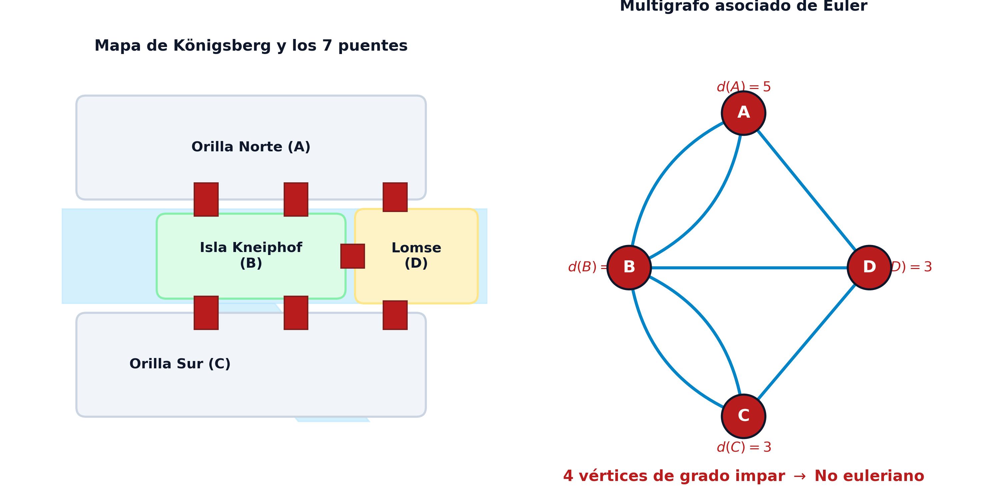{#fig-puentes-konigsberg-grafo fig-align="center" width="95%"}

El análisis de Euler demostró que, para que un vértice cualquiera actúe como punto de paso intermedio de un recorrido continuo sin repetir puentes, cada vez que el caminante entra en dicho vértice por un puente debe existir necesariamente otro puente disponible sin cruzar para salir de él. En consecuencia, cada visita intermedia consume exactamente dos conexiones, lo que exige que el número de aristas incidentes en cada nodo intermedio (**grado del vértice**) sea obligatoriamente un **número par**.

::: {.callout-note title="Definición: Cadenas y ciclos eulerianos" data-kind="definicion"}
Dado un multigrafo finito conexo no dirigido $G = (V, E)$:

*   **Cadena euleriana**: Es una secuencia ordenada de vértices y aristas que recorre **todas las aristas** del conjunto $E$ pasando por cada una de ellas **exactamente una vez** (sin repetir ninguna arista).
*   **Ciclo euleriano**: Es una cadena euleriana **cerrada**, es decir, una cadena euleriana cuyo vértice inicial coincide con su vértice final.
*   **Grafo euleriano**: Un multigrafo $G = (V, E)$ se denomina **euleriano** si admite al menos un ciclo euleriano.
:::

La caracterización matemática completa de la existencia de tales trayectorias sobre redes conexas se formaliza en el teorema fundamental de Euler, extendido posteriormente por Carl Hierholzer en 1873.

::: {.callout-important title="Teorema: Teorema de Euler de caracterización euleriana" data-kind="teorema"}
Sea $G = (V, E)$ un multigrafo finito y conexo. Entonces:

1.  $G$ contiene un **ciclo euleriano** si y solo si **todos los vértices de $V$ tienen grado par**:
    $$
    d(i) \equiv 0 \pmod 2, \quad \forall i \in V
    $$

2.  $G$ contiene una **cadena euleriana abierta** (no cerrada) si y solo si el número de vértices de grado impar es **exactamente dos**. En tal caso, los dos vértices de grado impar constituyen necesariamente los extremos inicial y final de la cadena.

*Demostración*:
Demostremos en primer lugar la condición necesaria para la existencia de un ciclo euleriano. Supongamos que $G$ admite un ciclo euleriano $C$. Al recorrer el ciclo arista por arista desde el origen hasta el retorno final, cada paso a través de un vértice intermedio $i \in V$ utiliza una arista entrante y otra arista saliente no explorada previamente. Por tanto, cada tránsito a través de $i$ incrementa su grado local en dos unidades. Como todas las aristas de $E$ son visitadas exactamente una vez, el grado total $d(i)$ de cada vértice es el doble del número de veces que el ciclo pasa por él, resultando un número estrictamente par. Si la cadena es abierta y une dos vértices distintos $u$ y $v$, el vértice inicial $u$ tiene una arista saliente neta adicional (grado impar), el vértice final $v$ tiene una arista entrante neta adicional (grado impar), y todos los demás vértices intermedios conservan balance par de entrada y salida.

Para demostrar la suficiencia en el caso de que todos los vértices tengan grado par, seleccionamos un vértice cualquiera $v_0$ y construimos un camino simple avanzando por aristas no utilizadas. Dado que cada vértice tiene grado par, al entrar en cualquier vértice siempre existirá al menos una arista libre para salir, a menos que regresemos al vértice de partida $v_0$. Así, se forma un ciclo inicial $C_1$. Si $C_1$ contiene todas las aristas de $E$, hemos terminado. Si no es así, al ser $G$ conexo, existe algún vértice $v_k \in C_1$ que incide en aristas no pertenecientes a $C_1$. El subgrafo residual $G \setminus E(C_1)$ sigue teniendo todos sus vértices de grado par. Repitiendo el proceso desde $v_k$, obtenemos un nuevo ciclo $C_2$ que puede empalmarse en $v_k$ dentro de $C_1$. Reiterando esta descomposición sobre el número finito de aristas, se obtiene un ciclo euleriano que integra la totalidad de $E$. $\blacksquare$
:::

En el multigrafo de los puentes de Königsberg mostrado en la @fig-puentes-konigsberg-grafo, los grados de los cuatro vértices son $d(A)=5$, $d(B)=3$, $d(C)=3$ y $d(D)=3$. Al existir cuatro vértices de grado impar (ninguno con grado par), el teorema de Euler certifica formalmente la imposibilidad de trazar ni un ciclo ni una cadena euleriana abierta.

::: {.callout-note title="Nota: Distinción entre cadenas y ciclos eulerianos según la paridad" data-kind="nota"}
Es conveniente clarificar con precisión la relación entre la noción general de **cadena euleriana** y la de **ciclo euleriano**:

* **Existencia de cadena euleriana en general**: Un grafo conexo admite una cadena euleriana (cerrada o abierta) si y solo si el número de vértices de grado impar pertenece al conjunto $\{0, 2\}$.
* **Caso $|V_{\text{impar}}| = 0$ (Ciclo euleriano)**: Si todos los vértices tienen grado par, la cadena es **cerrada** (un ciclo euleriano) y puede iniciarse y concluirse en cualquier vértice arbitrario de la red.
* **Caso $|V_{\text{impar}}| = 2$ (Cadena euleriana abierta)**: La cadena es **abierta** (no puede cerrarse sobre sí misma sin duplicar aristas) y sus extremos inicial y final son obligatoriamente los dos únicos vértices con grado impar.
* **Caso $|V_{\text{impar}}| \ge 4$**: No existe ninguna cadena euleriana, ni abierta ni cerrada (el caso de $|V_{\text{impar}}| = 1$ o cualquier número impar de vértices impares es topológicamente imposible en cualquier grafo por el Lema del apretón de manos).
:::

### Algoritmo constructivo para la determinación de cadenas eulerianas

Para determinar de forma computacional una cadena o ciclo euleriano en un multigrafo que cumple las condiciones de Euler, se requiere una estructura de datos algorítmica eficiente que permita extender un recorrido inicial e insertar recursivamente los ciclos secundarios que surjan en los vértices intermedios.

Presentamos a continuación el algoritmo formal de construcción de cadenas eulerianas mediante un vector de punteros de aristas sucesoras $\mathbf{\sigma} = (\sigma(1), \dots, \sigma(m), \sigma(m+1))$, donde $m = |E|$ denota el número total de aristas del grafo. En esta estructura, cada componente $\sigma(e)$ almacena el identificador de la arista que sigue a la arista $e$ en la secuencia del recorrido, y la posición auxiliar $\sigma(m+1)$ almacena el índice de la primera arista de la cadena.

::: {.callout-note title="Esquema: Algoritmo de construcción de cadenas y ciclos eulerianos" data-kind="esquema"}
Dado un grafo conexo $G = (V, E)$ con $m = |E|$ aristas numeradas $\{1, 2, \dots, m\}$, sean las siguientes estructuras de datos y parámetros auxiliares:

*   $d(i)$: Grado del vértice $i \in V$.
*   $w(i)$: Conjunto ordenado de aristas incidentes en el vértice $i$.
*   $\delta_i(e) = j$: Función de incidencia que devuelve el vértice opuesto al que conecta la arista $e = \{i, j\}$ desde el nodo $i$.
*   $\alpha(i)$: Contador dinámico del número de aristas incidentes en $i$ que aún **no han sido exploradas** (inicialmente $\alpha(i) = d(i)$).
*   $v$: Longitud acumulada del recorrido actual (número de aristas incorporadas).
*   $\phi(i)$: Identificador de la arista utilizada para alcanzar por primera vez el vértice $i$ dentro de la cadena (para el vértice inicial $a$, se define $\phi(a) = m+1$).

El procedimiento algorítmico se articula en cuatro pasos:

1.  **Paso 1 (Inicialización)**:
    *   Si el grafo posee dos vértices de grado impar, se selecciona uno de ellos como vértice inicial $a$ y el otro como vértice terminal $b$ (fijando $i = a$ y $t = b$). Si todos los vértices son pares, se escoge un vértice arbitrario fijando $a = b$ ($i = a, t = a$).
    *   Inicializar $\sigma(e) = 0$ para todo $e \in \{1, \dots, m, m+1\}$, $\alpha(i) = d(i)$ y $\phi(j) = 0$ para todo $j \in V \setminus \{a\}$, fijando $\phi(a) = m+1$, $v = 0$, $e_1 = m+1$ y $e_2 = -1$.
2.  **Paso 2 (Extensión secuencial del recorrido)**:
    *   Si $\alpha(i) = 0$, ir al **Paso 4**.
    *   En caso contrario, sea $e$ la arista que ocupa la posición actual $\alpha(i)$ en la lista de incidencias $w(i)$. Decrementar el contador: $\alpha(i) \leftarrow \alpha(i) - 1$.
    *   Si $e = e_1$ o $\sigma(e) \neq 0$ (arista ya explorada en sentido inverso), repetir el **Paso 2**.
    *   En otro caso (arista nueva disponible):
        $$
        \begin{aligned}
        j &= \delta_i(e), \quad \phi(j) = e, \quad \sigma(e_1) = e, \\
        v &\leftarrow v + 1, \quad \alpha(j) \leftarrow \alpha(j) - 1, \quad i \leftarrow j
        \end{aligned}
        $$

    *   Si el nuevo nodo alcanzado es el nodo objetivo ($i = t$), ir al **Paso 3**. En caso contrario, actualizar la última arista incorporada $e_1 \leftarrow e$ y continuar en el **Paso 2**.
3.  **Paso 3 (Cierre de subcadena y verificación de parada)**:
    *   Enlazar la última arista con la continuación del ciclo: $\sigma(e) = e_2$.
    *   Si la longitud total alcanza el número total de aristas ($v = m$), el algoritmo **FINALIZA con éxito**: el vector $\mathbf{\sigma}$ describe la cadena euleriana completa.
    *   Si $v < m$, quedan aristas no exploradas, por lo que se avanza al **Paso 4**.
4.  **Paso 4 (Búsqueda y empalme de ciclos adyacentes)**:
    *   Buscar un vértice $k \in V$ que satisfaga simultáneamente:
        1.  $\alpha(k) \neq 0$ (le restan aristas incidentes sin explorar).
        2.  $\phi(k) \neq 0$ (es un vértice perteneciente a la cadena ya construida).
    *   Configurar los punteros de inserción para abrir un ciclo secundario en dicho nodo:
        $$
        i \leftarrow k, \quad t \leftarrow k, \quad e_1 \leftarrow \phi(k), \quad e_2 \leftarrow \sigma(e_1)
        $$

    *   Regresar al **Paso 2** para construir el ciclo euleriano adyacente que se intercalará en la posición de $k$.
:::

En el siguiente ejemplo, analizamos la ejecución detallada de este algoritmo sobre un grafo de 4 nodos.

::: {.callout-tip title="Ejemplo: Construcción paso a paso de una cadena euleriana" data-kind="ejemplo" collapse="true"}
Consideremos el grafo conexo $G = (V, E)$ de $4$ vértices $V = \{a, b, c, d\}$ y $4$ aristas $E = \{1, 2, 3, 4\}$ ilustrado en la @fig-euler-algoritmo-traza (panel izquierdo), cuyas aristas e incidencias son:

*   Arista 1: $\{a, b\} \implies \delta_a(1) = b, \delta_b(1) = a$.
*   Arista 2: $\{b, c\} \implies \delta_b(2) = c, \delta_c(2) = b$.
*   Arista 3: $\{c, d\} \implies \delta_c(3) = d, \delta_d(3) = c$.
*   Arista 4: $\{b, d\} \implies \delta_b(4) = d, \delta_d(4) = b$.

Evaluando los grados nodales:
$$
d(a) = 1, \quad d(b) = 3, \quad d(c) = 2, \quad d(d) = 2
$$
Al existir exactamente dos vértices de grado impar ($a$ y $b$), el teorema de Euler garantiza la existencia de una cadena euleriana abierta que comenzará en $a$ y finalizará en $b$.

1. **Inicialización (Paso 1)**:
   * Vértice inicial: $i = a$, vértice final: $t = b$.
   * Arista ficticia de cabecera: $m+1 = 5$. Punteros iniciales: $e_1 = 5, e_2 = -1, v = 0$.
   * Contadores: $\alpha(a)=1, \alpha(b)=3, \alpha(c)=2, \alpha(d)=2$.
   * Punteros de llegada: $\phi(a) = 5, \phi(b)=0, \phi(c)=0, \phi(d)=0$.
2. **Primera extensión (Paso 2)**:
   * En $i = a$, $\alpha(a)=1$. Arista disponible $e = 1$. Se actualiza $\alpha(a) = 0$.
   * Como $e=1 \neq e_1=5$, se conecta la arista:
     $$
     \begin{aligned}
     j &= \delta_a(1) = b, \quad \phi(b) = 1, \quad \sigma(5) = 1, \\
     v &= 1, \quad \alpha(b) = 3 - 1 = 2, \quad i = b
     \end{aligned}
     $$

   * Como el nodo actual $b$ coincide con el destino $t=b$, se deriva al **Paso 3**.
3. **Cierre de tramo inicial (Paso 3)**:
   * Se fija $\sigma(1) = e_2 = -1$.
   * Como la longitud acumulada $v = 1 < 4$, la cadena no está completa. Se pasa al **Paso 4**.
4. **Búsqueda de vértice de bifurcación (Paso 4)**:
   * Se evalúa el nodo $k = b$: cumple $\alpha(b) = 2 \neq 0$ y $\phi(b) = 1 \neq 0$.
   * Se reconfiguran los punteros para intercalar un ciclo cerrado en $b$:
     $$
     i = b, \quad t = b, \quad e_1 = \phi(b) = 1, \quad e_2 = \sigma(1) = -1
     $$

   * Se regresa al **Paso 2**.
5. **Construcción del ciclo secundario (Pasos 2 y 3)**:
   * *Iteración desde $b$*: $\alpha(b)=2$, arista $e = w_2(b) = 4$. Se actualiza $\alpha(b)=1$.
     $$
     \begin{aligned}
     j &= \delta_b(4) = d, \quad \phi(d) = 4, \quad \sigma(1) = 4, \\
     v &= 2, \quad \alpha(d) = 2 - 1 = 1, \quad i = d, \quad e_1 = 4
     \end{aligned}
     $$

   * *Iteración desde $d$*: $\alpha(d)=1$, arista $e = w_1(d) = 3$. Se actualiza $\alpha(d)=0$.
     $$
     \begin{aligned}
     j &= \delta_d(3) = c, \quad \phi(c) = 3, \quad \sigma(4) = 3, \\
     v &= 3, \quad \alpha(c) = 2 - 1 = 1, \quad i = c, \quad e_1 = 3
     \end{aligned}
     $$

   * *Iteración desde $c$*: $\alpha(c)=1$, arista $e = w_1(c) = 2$. Se actualiza $\alpha(c)=0$.
     $$
     \begin{aligned}
     j &= \delta_c(2) = b, \quad \phi(b) = 2, \quad \sigma(3) = 2, \\
     v &= 4, \quad \alpha(b) = 1 - 1 = 0, \quad i = b
     \end{aligned}
     $$

   * Al alcanzar de nuevo el destino intermedio $i = t = b$, se pasa al **Paso 3**:
     $$
     \sigma(2) = e_2 = -1
     $$

   * Como la longitud acumulada $v = 4 = m$, el algoritmo **termina con éxito**.

El vector resultante de punteros $\mathbf{\sigma}$ es:
$$
\mathbf{\sigma} = (\sigma(1), \sigma(2), \sigma(3), \sigma(4), \sigma(5)) = (4, -1, 2, 3, 1)
$$
Siguiendo la cadena desde el puntero inicial $\sigma(5)=1 \to \sigma(1)=4 \to \sigma(4)=3 \to \sigma(3)=2 \to \sigma(2)=-1$, la secuencia ordenada de aristas es $(1, 4, 3, 2)$, correspondiente a la cadena euleriana de vértices:
$$
a \xrightarrow{e=1} b \xrightarrow{e=4} d \xrightarrow{e=3} c \xrightarrow{e=2} b
$$

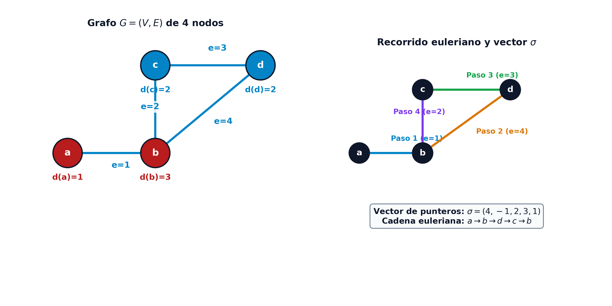{#fig-euler-algoritmo-traza fig-align="center" width="85%"}
:::

---

## El Problema del Cartero Chino (CPP)

En la inmensa mayoría de las aplicaciones prácticas de transporte y servicios urbanos (tales como el reparto postal a domicilio, la recogida selectiva de residuos sólidos urbanos, la limpieza y barrido mecanizado de calles, el esparcimiento de sal en vías nevadas o la inspección de redes de tendido eléctrico y canalizaciones de agua), las redes viales reales no son eulerianas, ya que suelen contener múltiples intersecciones con un número impar de calles convergentes.

El **Problema del Cartero Chino** (conocido en la literatura internacional como *Chinese Postman Problem*, CPP, o problema del circuito de inspección de aristas) plantea determinar el recorrido cerrado de **longitud o coste total mínimo** que visite **cada arista de la red al menos una vez**, regresando al punto de partida [@kwan1962programming]. El problema fue formulado originalmente en 1960 por el matemático chino **Mei-Ko Kwan**, y su denominación en lengua inglesa fue propuesta en 1962 por el investigador operativo Alan J. Goldman.

::: {.callout-note title="Definición: Problema del Cartero Chino (CPP)" data-kind="definicion"}
Dada una red valorada no dirigida $G = (V, E, p)$, donde $V$ es el conjunto de vértices, $E$ es el conjunto de aristas y $p: E \to \mathbb{R}^+$ asigna un peso o longitud no negativa $p(e)$ a cada arista $e \in E$:

El **Problema del Cartero Chino** consiste en encontrar un circuito cerrado $C$ que recorra todas las aristas de $E$ al menos una vez de tal manera que la longitud total del circuito sea mínima:
$$
\min_{C} \sum_{e \in C} p(e) \quad \text{sujeto a} \quad E \subseteq C
$$
:::

Si la red original $G$ es euleriana (todos sus vértices tienen grado par), cualquier ciclo euleriano constituye una solución óptima exacta del problema, y la longitud de la ruta óptima coincide exactamente con la suma de las longitudes de todas las aristas de la red: $\sum_{e \in E} p(e)$.

Sin embargo, si $G$ contiene vértices de grado impar, resulta imposible recorrer la red pasando exactamente una sola vez por cada arista. Por tanto, el cartero se ve obligado a **repetir (duplicar) ciertas aristas** de la red. La resolución del CPP radica precisamente en determinar qué colección de aristas debe duplicarse para que el coste añadido sea el menor posible.

Para ilustrar este principio de forma intuitiva, consideremos la red valorada de 9 nodos mostrada en la @fig-cartero-chino-grafo-original. Al evaluar los grados de sus vértices, se comprueba que cuatro de ellos ($a, b, c, d$) tienen grado impar ($d=3$), el nodo central $e$ tiene grado par ($d=4$) y las cuatro esquinas ($i, f, h, g$) tienen grado $2$. Al contener 4 nodos impares, la red no es euleriana.

Una solución directa para habilitar un ciclo cerrado consiste en añadir aristas duplicadas $E'$ (copias exactas de aristas originales de $E$) hasta lograr que en el multigrafo resultante $G' = (V, E \cup E')$ todos los vértices tengan grado par. Por ejemplo, si duplicamos tentativamente las cuatro aristas que conectan los nodos impares con el nodo central $e$ ($\{a, e\}, \{b, e\}, \{e, c\}, \{e, d\}$), como se ilustra en la @fig-cartero-chino-eulerizacion-conceptual, los grados en $G'$ pasan a ser:
$$
\begin{aligned}
& d_{G'}(a)=4, \quad d_{G'}(b)=4, \quad d_{G'}(c)=4, \quad d_{G'}(d)=4, \quad d_{G'}(e)=8, \\
& d_{G'}(i)=d_{G'}(f)=d_{G'}(h)=d_{G'}(g)=2
\end{aligned}
$$

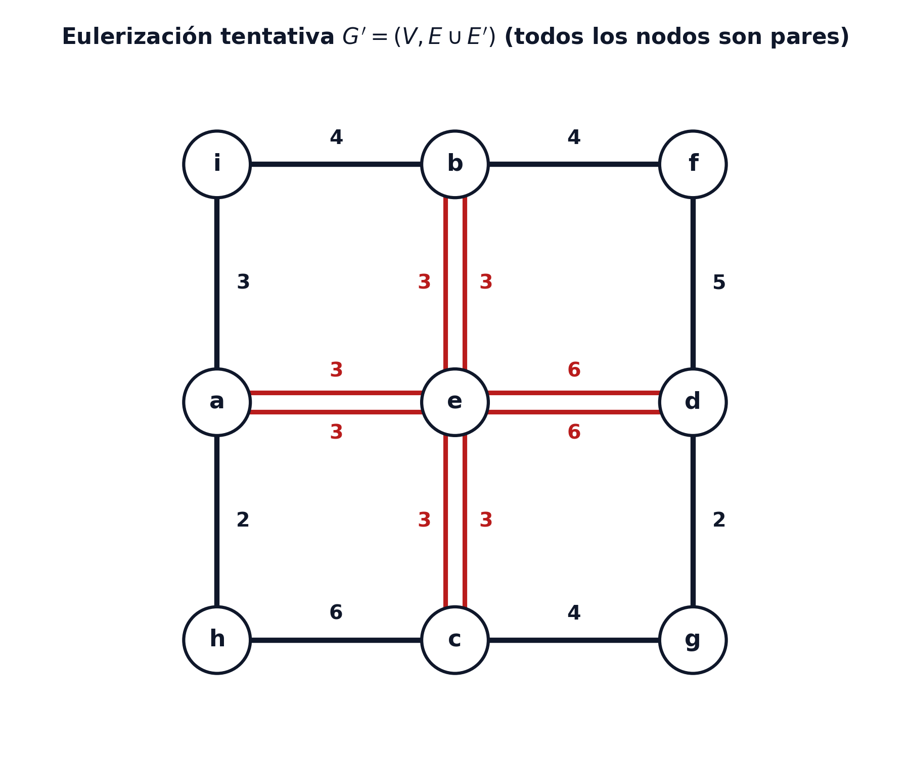{#fig-cartero-chino-eulerizacion-conceptual fig-align="center" width="60%"}

En este multigrafo $G'$, **todos los vértices son pares**, por lo que ya admite un ciclo euleriano continuo. El coste añadido por esta eulerización tentativa es:
$$
\text{Coste}(E') = p(a, e) + p(b, e) + p(e, c) + p(e, d) = 3 + 3 + 3 + 6 = 15
$$
Ahora bien, surge la cuestión central: *¿Es este conjunto $E'$ el de menor coste posible, o existe otra combinación de aristas que eulerice la red con un incremento de distancia inferior?* Para responder a esta pregunta de forma óptima, formalizaremos a continuación la estructura analítica del problema.

### Caracterización analítica y eulerización óptima

Para duplicar aristas de manera óptima, debemos formalizar la estructura combinatoria de los vértices impares y de las aristas repetidas.

::: {.callout-note title="Proposición: Paridad del número de vértices de grado impar" data-kind="corolario"}
En cualquier multigrafo finito $G = (V, E)$, el número de vértices con grado impar es estrictamente un **número par**.

*Demostración*:
Por el lema del apretón de manos (*Handshaking Lemma*), la suma de los grados de todos los vértices es igual al doble del número de aristas:
$$
\sum_{i \in V} d(i) = 2 |E|
$$
Dado que $2|E|$ es un número par, podemos descomponer la suma entre el conjunto de vértices de grado par $V_{\text{par}}$ y el conjunto de vértices de grado impar $V_{\text{impar}}$:
$$
\sum_{i \in V_{\text{impar}}} d(i) + \sum_{i \in V_{\text{par}}} d(i) = 2 |E|
$$
Como la suma de términos pares $\sum_{i \in V_{\text{par}}} d(i)$ es par, la suma $\sum_{i \in V_{\text{impar}}} d(i)$ debe ser obligatoriamente un número par. Puesto que la suma de una colección de números impares es par si y solo si la cantidad de sumandos es par, se concluye que el cardinal $|V_{\text{impar}}|$ es necesariamente par. $\blacksquare$
:::

Sea $V' = \{v \in V \mid d(v) \equiv 1 \pmod 2\}$ el subconjunto de vértices de grado impar en $G$, con $|V'| = 2k$. Para transformar $G$ en un multigrafo euleriano $G' = (V, E \cup E')$, debemos añadir un conjunto de aristas copia $E'$ (donde cada arista de $E'$ es un duplicado de una arista original de $E$) de forma que en $G'$ todos los vértices tengan grado par.

::: {.callout-note title="Proposición: Estructura de caminos de las aristas duplicadas" data-kind="lema"}
Sea $G = (V, E)$ un grafo no euleriano y sea $E'$ un conjunto minimal de aristas duplicadas que convierte a $G' = (V, E \cup E')$ en un grafo euleriano. Entonces, para todo vértice $i_1 \in V'$, el conjunto $E'$ contiene una cadena que une $i_1$ con otro vértice $i_2 \in V'$.

*Demostración*:
Por construcción, en el multigrafo eulerizado $G'$ se cumple que $d_{G'}(i) \ge d_G(i)$ para todo $i \in V$, y todos los vértices en $G'$ tienen grado par.
Dado que $i_1 \in V'$ tenía grado impar en $G$, en el grafo de aristas añadidas $G_{E'} = (V, E')$ el grado de $i_1$ debe ser impar (para que la suma $d_G(i_1) + d_{E'}(i_1) = d_{G'}(i_1)$ sea par). Por tanto, existe al menos una arista añadida en $E'$ que incide en $i_1$, denotada por $\{i_1, j\}$.
Si el nodo $j \in V'$, hemos encontrado una cadena directa que une dos nodos de $V'$ y el resultado queda demostrado.
Si $j \notin V'$, el nodo $j$ tenía grado par en $G$. Al añadir la arista $\{i_1, j\}$, su grado en $G'$ se volvería impar a menos que exista otra arista $\{j, k\} \in E'$ incidente en $j$.
Repitiendo este razonamiento de forma secuencial sobre los nodos intermedios, como el conjunto de vértices de la red es finito y no se pueden generar ramas infinitas, la cadena de aristas de $E'$ debe terminar obligatoriamente en otro vértice $i_2 \in V'$. $\blacksquare$
:::

Esta proposición demuestra algebraicamente que **la eulerización óptima de una red equivale a encontrar un conjunto de caminos de longitud mínima en $G$ que emparejen los $2k$ vértices de grado impar de dos en dos**. Para formalizar esta optimización combinatoria sobre el grafo auxiliar de distancias, recordamos las definiciones canónicas de la teoría de emparejamientos:

::: {.callout-note title="Definición: Emparejamientos y emparejamiento perfecto de peso mínimo" data-kind="definicion"}
Dado un grafo no dirigido $G = (V, E)$:

* **Emparejamiento (*matching*)**: Es un subconjunto de aristas $M \subseteq E$ tales que ningún par de aristas de $M$ comparte vértices en común (es decir, no existen aristas adyacentes en $M$).
* **Vértice saturado**: Un vértice $v \in V$ se dice saturado por $M$ si incide en alguna arista de $M$.
* **Emparejamiento perfecto**: Un emparejamiento $M$ es perfecto si **satura a todos los vértices de $V$** (cada nodo de $V$ es extremo de exactamente una arista de $M$). Para que un grafo admita un emparejamiento perfecto, es condición necesaria que $|V|$ sea par.
* **Problema del emparejamiento perfecto de peso mínimo**: En una red valorada $G = (V, E, p)$, consiste en determinar un emparejamiento perfecto $M^*$ que minimice la suma de los pesos de sus aristas:
  $$
  \begin{aligned}
  \min_{M \subseteq E} \quad & \sum_{e \in M} p(e) \\
  \text{sujeto a} \quad & M \text{ es emparejamiento perfecto}
  \end{aligned}
  $$
:::

Dado que el grafo auxiliar $G'' = (V', E'')$ construido sobre el conjunto de vértices impares es completo y posee un número estrictamente par de nodos ($|V'| = 2k$), siempre admite al menos un emparejamiento perfecto. Por tanto, el procedimiento sistemático de resolución se articula en las siguientes etapas:

::: {.callout-note title="Esquema: Procedimiento general de resolución del Problema del Cartero Chino" data-kind="esquema"}
Dado un grafo conexo valorado $G = (V, E, p)$:

1.  **Identificación de vértices impares**: Determinar el grado $d(i)$ de cada vértice en $G$ e identificar el subconjunto de nodos impares $V' = \{v \in V \mid d(v) \text{ es impar}\}$. Si $V' = \emptyset$, el grafo es euleriano y se pasa directamente al paso 5.
2.  **Cálculo de distancias mínimas**: Calcular las distancias del camino mínimo $d_G(u, v)$ entre todo par de vértices $u, v \in V'$ utilizando el algoritmo de Dijkstra o Floyd-Warshall.
3.  **Construcción del grafo auxiliar de emparejamiento**: Construir un **grafo auxiliar completo** $G'' = (V', E'')$, cuyos vértices son exclusivamente los elementos de $V'$ y donde cada arista $\{u, v\} \in E''$ tiene un peso igual a la distancia mínima $d_G(u, v)$ calculada en el paso anterior.
4.  **Resolución del emparejamiento perfecto de peso mínimo**: Determinar en $G''$ un **emparejamiento perfecto de peso mínimo** (utilizando el algoritmo de la Flor de Edmonds o enumeración de combinaciones si $|V'|$ es pequeño).
5.  **Construcción del multigrafo euleriano y circuito final**: Para cada pareja de nodos $\{u, v\}$ seleccionada en el emparejamiento óptimo, duplicar en $G$ las aristas que integran el camino mínimo entre $u$ y $v$. El multigrafo resultante $G'$ es euleriano. Aplicar el algoritmo de construcción euleriana para obtener la ruta final del cartero.
:::

A continuación, aplicamos este procedimiento a un caso práctico de 9 nodos.

::: {.callout-tip title="Ejemplo: Resolución completa del Problema del Cartero Chino en una red de 9 nodos" data-kind="ejemplo" collapse="true"}
Consideremos la red valorada de 9 nodos $V = \{a, b, c, d, e, f, g, h, i\}$ y 12 aristas mostrada en la @fig-cartero-chino-grafo-original, con los siguientes pesos de arista:
$$
\begin{aligned}
& p(i, b) = 4, \quad p(b, f) = 4, \quad p(i, a) = 3, \quad p(b, e) = 3, \quad p(f, d) = 5, \\
& p(a, e) = 3, \quad p(e, d) = 6, \quad p(a, h) = 2, \quad p(e, c) = 3, \quad p(d, g) = 2, \\
& p(h, c) = 6, \quad p(c, g) = 4
\end{aligned}
$$
La suma del coste de todas las aristas originales del grafo es:
$$
\sum_{e \in E} p(e) = 4 + 4 + 3 + 3 + 5 + 3 + 6 + 2 + 3 + 2 + 6 + 4 = 38
$$

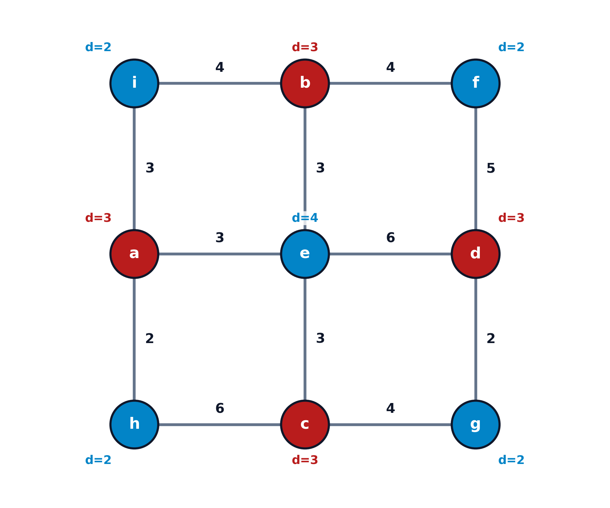{#fig-cartero-chino-grafo-original fig-align="center" width="60%"}

1. **Identificación de nodos impares ($V'$)**:
   Calculando los grados de los 9 vértices:
   $$
   d(i)=2, \ d(b)=3, \ d(f)=2, \ d(a)=3, \ d(e)=4, \ d(d)=3, \ d(h)=2, \ d(c)=3, \ d(g)=2
   $$
   El subconjunto de vértices con grado impar contiene 4 nodos: $V' = \{a, b, c, d\}$.

2. **Cálculo de caminos mínimos entre vértices de $V'$**:
   * Camino $a \leftrightarrow b$: Vía $a - e - b$, coste $d(a, b) = 3 + 3 = 6$.
   * Camino $a \leftrightarrow c$: Vía $a - e - c$, coste $d(a, c) = 3 + 3 = 6$.
   * Camino $a \leftrightarrow d$: Vía $a - e - d$, coste $d(a, d) = 3 + 6 = 9$.
   * Camino $b \leftrightarrow c$: Vía $b - e - c$, coste $d(b, c) = 3 + 3 = 6$.
   * Camino $b \leftrightarrow d$: Vía $b - f - d$, coste $d(b, d) = 4 + 5 = 9$ (o vía $b-e-d$: $3+6=9$).
   * Camino $c \leftrightarrow d$: Vía $c - g - d$, coste $d(c, d) = 4 + 2 = 6$.
3. **Construcción de $G''$ y evaluación de emparejamientos perfectos**:
   El grafo auxiliar completo $G'' = (V', E'')$ sobre los 4 nodos $\{a, b, c, d\}$ admite exactamente tres emparejamientos perfectos posibles, ilustrados en la @fig-cartero-chino-grafo-auxiliar-matching:

   * **Emparejamiento $M_1 = \{ \{a, b\}, \{c, d\} \}$**:
     $$
     \text{Coste}(M_1) = d(a, b) + d(c, d) = 6 + 6 = \mathbf{12} \quad \text{[ÓPTIMO]}
     $$

   * **Emparejamiento $M_2 = \{ \{a, c\}, \{b, d\} \}$**:
     $$
     \text{Coste}(M_2) = d(a, c) + d(b, d) = 6 + 9 = 15
     $$

   * **Emparejamiento $M_3 = \{ \{a, d\}, \{b, c\} \}$**:
     $$
     \text{Coste}(M_3) = d(a, d) + d(b, c) = 9 + 6 = 15
     $$

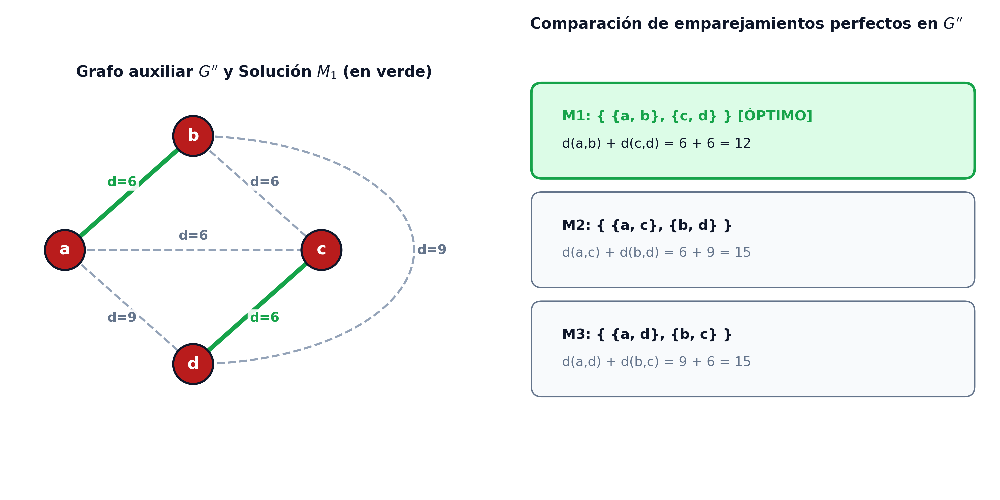{#fig-cartero-chino-grafo-auxiliar-matching fig-align="center" width="90%"}

4. **Eulerización y longitud óptima del circuito**:
   El emparejamiento óptimo $M_1$ prescribe duplicar las aristas que componen el camino entre $a$ y $b$ (aristas $\{a, e\}$ y $\{e, b\}$) y las que componen el camino entre $c$ y $d$ (aristas $\{c, g\}$ y $\{g, d\}$), como se ilustra en la @fig-cartero-chino-solucion-optima.
   
   La longitud mínima de la ruta del cartero chino resulta:
   $$
   \text{Longitud Óptima} = \sum_{e \in E} p(e) + \text{Coste}(M_1) = 38 + 12 = \mathbf{50}
   $$

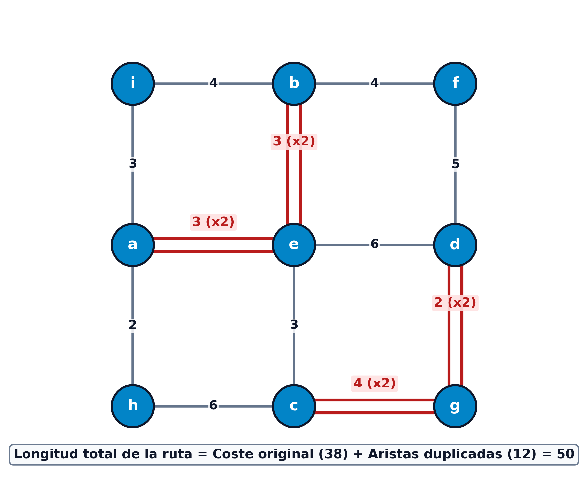{#fig-cartero-chino-solucion-optima fig-align="center" width="60%"}
:::

Veamos ahora un segundo ejemplo clásico de aplicación en ingeniería civil y delimitación de parcelas.

::: {.callout-tip title="Ejemplo: Problema de examen: Vallado perimetral continuo de parcelas" data-kind="ejemplo" collapse="true"}
Se desea cercar un terreno dividiéndolo en cuatro parcelas $A, B, C$ y $D$, según se indica en la @fig-examen-parcelas-terreno (cada tramo de los bordes indica la longitud del mismo). Por motivos de seguridad, el cerramiento se hace mediante una cerca prefabricada que se extiende a lo largo de todos los bordes, que no se puede partir y debe terminar exactamente donde empieza.

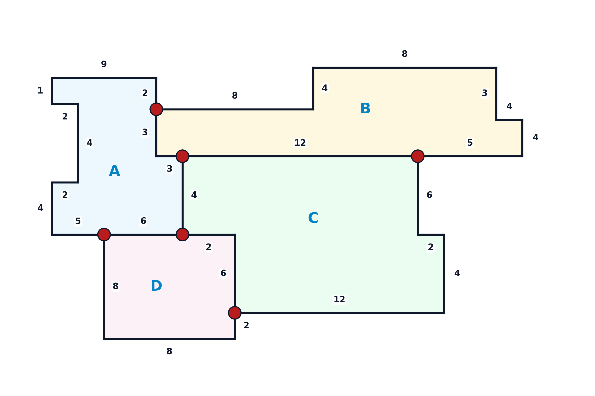{#fig-examen-parcelas-terreno fig-align="center" width="85%"}

1. **(0.5 puntos) ¿Qué problema de grafos se está planteando?**:
   Se trata formalmente del **Problema del Cartero Chino (CPP)** (o problema de inspección de rutas). El objetivo es encontrar el circuito cerrado de longitud mínima que recorra todas las aristas de un grafo al menos una vez y regrese al punto de partida. Dado que se exige instalar una cerca continua que cubra todos los bordes, es necesario trazar un ciclo euleriano. Al contar el mapa con intersecciones donde confluyen tres bordes (**vértices de grado impar**), el grafo no es euleriano de origen. El problema consiste, por tanto, en determinar qué tramos deben duplicarse (para tender la cerca dos veces por el mismo borde) garantizando que la longitud extra sea la mínima posible.

2. **(1.0 punto) Describir el procedimiento de solución**:
   El procedimiento general de resolución se articula en las siguientes cinco etapas sistemáticas:

   * **Paso 1 (Identificación de vértices impares)**: Modelar la red topológica $G = (V, E, p)$, determinar el grado $d(v)$ de cada vértice e identificar el subconjunto de nodos con grado impar $V' = \{v \in V \mid d(v) \equiv 1 \pmod 2\}$.
   * **Paso 2 (Cálculo de distancias mínimas)**: Calcular las distancias del camino mínimo $d_G(u, v)$ entre todo par de vértices $u, v \in V'$ utilizando el algoritmo de Dijkstra.
   * **Paso 3 (Construcción del grafo auxiliar de emparejamiento)**: Construir el grafo auxiliar completo $G'' = (V', E'')$ sobre el conjunto de nodos impares $V'$, asignando a cada arista $\{u, v\} \in E''$ un peso igual a la distancia mínima $d_G(u, v)$ calculada en el paso anterior.
   * **Paso 4 (Resolución del emparejamiento perfecto de peso mínimo)**: Determinar en $G''$ un **emparejamiento perfecto de peso mínimo** $M^*$.
   * **Paso 5 (Construcción del multigrafo euleriano y cálculo de la longitud final)**: Duplicar en $G$ las aristas que integran los caminos mínimos asociados a cada pareja de $M^*$. La longitud total de la valla continua será la suma de las longitudes de todos los tramos originales más el coste del emparejamiento óptimo:
     $$
     L_{\text{total}} = \sum_{e \in E} p(e) + \text{Coste}(M^*)
     $$

3. **(1.0 punto) ¿Cuál es la solución para el caso planteado?**:
   Aplicamos de forma secuencial las 5 etapas del procedimiento descrito:

   * **Paso 1 (Identificación de vértices impares $V'$)**:
     Se calculan las longitudes de los tramos que delimitan el terreno:

     * *Aristas internas (fronteras entre parcelas)*: Entre $A$ y $B$ ($3$), entre $A$ y $C$ ($4$), entre $B$ y $C$ ($12$), entre $A$ y $D$ ($6$), entre $C$ y $D$ ($2 + 6 = 8$). Suma interna = $33\text{ m}$.
     * *Aristas externas (perímetro exterior)*: Borde exterior de $A$ ($2 + 9 + 1 + 2 + 4 + 2 + 4 + 5 = 29$), borde de $B$ ($8 + 4 + 8 + 3 + 4 + 4 + 5 = 36$), borde de $C$ ($6 + 2 + 4 + 12 = 24$), borde de $D$ ($8 + 8 + 2 = 18$). Suma externa = $107\text{ m}$.
     * *Longitud base de la red*: $L_{\text{base}} = 33 + 107 = \mathbf{140} \text{ m}$.
     
     Analizando la topología, las esquinas exteriores tienen grado 2 (par), mientras que en los 6 puntos de intersección donde confluyen tres lindes (puntos rojos en la @fig-examen-parcelas-terreno), el grado es estrictamente $3$ (impar). Por tanto, el conjunto de vértices impares contiene $6$ nodos: $|V'| = 6$.

   * **Paso 2 (Cálculo de distancias mínimas entre vértices de $V'$)**:
     * Camino entre el punto superior ($A$-$B$) y el central ($A$-$B$-$C$): Arista interior directa con distancia $d = \mathbf{3}$.
     * Camino entre el punto inferior ($A$-$D$) y el central inferior ($A$-$C$-$D$): Arista interior directa con distancia $d = \mathbf{6}$.
     * Camino entre los dos extremos de la derecha (extremo de $B$-$C$ y extremo de $C$-$D$): Distancia mínima $d = \mathbf{24}$, alcanzable tanto por el contorno exterior de $C$ ($6 + 2 + 4 + 12 = 24$) como por el interior $(B\text{-}C) + (A\text{-}C) + (C\text{-}D) = 12 + 4 + 8 = 24$.
   * **Paso 3 (Construcción del grafo auxiliar $G''$)**:
     Se construye el grafo auxiliar completo $G'' = (V', E'')$ sobre los 6 vértices impares ponderado con la matriz de distancias mínimas.

   * **Paso 4 (Resolución del emparejamiento perfecto de peso mínimo $M^*$)**:
     Evaluando las combinaciones de emparejamientos perfectos posibles sobre los 6 vértices, el emparejamiento óptimo es aquel que selecciona las tres parejas mínimas identificadas:
     $$
     \text{Coste}(M^*) = 3 + 6 + 24 = \mathbf{33} \text{ m}
     $$

   * **Paso 5 (Construcción del multigrafo euleriano y longitud total óptima)**:
     Duplicando las aristas de los caminos mínimos asociados a $M^*$, todos los vértices pasan a tener grado par en el multigrafo resultante. La longitud mínima de la cerca prefabricada continua es:
     $$
     \begin{aligned}
     L_{\text{total}} &= L_{\text{base}} + \text{Coste}(M^*) \\
     &= 140 \text{ (base)} + 33 \text{ (duplicados)} = \mathbf{173} \text{ m}
     \end{aligned}
     $$
:::

### Variantes del Problema del Cartero Chino

El modelo clásico no dirigido del cartero chino admite diversas extensiones operativas de gran relevancia:

*   **Cartero chino dirigido / motorizado (Directed CPP)**:
    En cascos urbanos con calles de sentido único, la red se modela como un digrafo $G = (V, U)$. El digrafo es euleriano si y solo si para todo vértice $i \in V$ el grado de entrada coincide con el de salida ($d^-(i) = d^+(i)$). Si la red no es euleriana, la eulerización no se resuelve por emparejamiento, sino mediante un **modelo de transbordo y flujo a coste mínimo**, donde los nodos con exceso de salida ($d^+(i) > d^-(i)$) actúan como fuentes de oferta $b_i = d^+(i) - d^-(i)$ y los nodos con exceso de entrada ($d^-(i) > d^+(i)$) actúan como sumideros de demanda $b_j = -(d^-(j) - d^+(j))$.

*   **Cartero chino con costes asimétricos / viento (Windy Postman Problem)**:
    El coste o tiempo de transitar por una calle depende de la dirección de avance debido a pendientes pronunciadas o corrientes de viento predominantes ($c(i, j) \neq c(j, i)$). Este problema es $\mathcal{NP}$-duro en el caso general.

*   **Cartero rural y problemas con beneficios y pérdidas (Rural Postman Problem - RPP)**:
    En muchas aplicaciones (como la lectura de contadores rurales o el mantenimiento de autopistas), solo un subconjunto de aristas prioritarias $E_R \subseteq E$ debe ser recorrido de forma obligatoria, mientras que las restantes aristas $E \setminus E_R$ pueden utilizarse libremente como vías de tránsito si abaratan el recorrido global. El RPP es un problema $\mathcal{NP}$-completo.

---

## Ciclos hamiltonianos y condiciones de hamiltonianidad

A diferencia de los ciclos eulerianos, cuyo objetivo es recorrer todas las aristas de una red sin repetición, existen numerosos problemas donde el objetivo consiste en visitar **todos los vértices** de la red exactamente una vez.

El concepto de **ciclo hamiltoniano** debe su nombre al matemático y astrónomo irlandés **Sir William Rowan Hamilton**, quien en 1857 patentó un juego didáctico denominado el *Juego Icosiano* (*Icosian Game*) [@hamilton1857icosian]. El pasatiempo consistía en un tablero de madera que representaba la estructura de un dodecaedro regular de 20 vértices (identificados con nombres de ciudades del mundo), y el reto planteaba encontrar un recorrido a lo largo de las aristas del poliedro que visitara las 20 ciudades exactamente una vez sin repetir ninguna, regresando a la ciudad de origen.

::: {.callout-note title="Definición: Ciclos y caminos hamiltonianos" data-kind="definicion"}
Dado un grafo $G = (V, E)$ con $n = |V|$ vértices:

*   **Ciclo hamiltoniano**: Es un ciclo simple en $G$ que contiene **todos los vértices de $V$** exactamente una vez (excepto el vértice de partida, al que regresa para cerrar el ciclo).
*   **Camino hamiltoniano**: Es una trayectoria o camino simple en $G$ que visita todos los vértices de $V$ exactamente una vez (sin regresar al origen).
*   **Grafo hamiltoniano**: Un grafo que admite al menos un ciclo hamiltoniano.
:::

A pesar de la aparente similitud conceptual entre el problema euleriano (visitar todas las aristas) y el problema hamiltoniano (visitar todos los vértices), existe un abismo infranqueable en su **complejidad computacional**:

*   El problema de determinar si un grafo es euleriano se resuelve de forma instantánea en tiempo lineal $\mathcal{O}(|V| + |E|)$ comprobando la paridad de los grados. Pertenece a la clase $\mathcal{P}$.
*   El problema de determinar si un grafo general contiene un ciclo hamiltoniano (**HAMILTONIAN-CYCLE**) es uno de los 21 problemas clásicos demostrados como **$\mathcal{NP}$-completos** por Richard Karp en 1972 [@karp1972reducibility].

No se conocen condiciones necesarias y suficientes simultáneamente que puedan verificarse en tiempo polinomial. Por ello, el análisis formal se apoya en condiciones necesarias de corte y condiciones suficientes basadas en la densidad de grados.

### Condiciones necesarias: 2-conexidad y cortes nodales

Para que un grafo admita un ciclo hamiltoniano, debe poseer una estructura de conectividad robusta que garantice la existencia de rutas alternativas.

::: {.callout-note title="Definición: Conjuntos de corte y k-conexidad" data-kind="definicion"}
Dado un grafo conexo $G = (V, E)$:

*   **Conjunto de corte de vértices**: Un subconjunto de vértices $A \subset V$ es un conjunto de corte si el subgrafo inducido por los restantes vértices $V \setminus A$ es disconexo.
*   **Grafo $k$-conexo**: Un grafo $G$ es $k$-conexo si $|V| \ge k+1$ y no contiene ningún conjunto de corte de cardinal menor que $k$ (es decir, se requiere eliminar al menos $k$ vértices para desconectar el grafo). En particular, todo grafo $k$-conexo satisface $d_G(i) \ge k$ para todo $i \in V$.
:::

::: {.callout-note title="Proposición: Condición necesaria de 2-conexidad" data-kind="corolario"}
Si un grafo $G = (V, E)$ es hamiltoniano, entonces $G$ es obligatoriamente **2-conexo** (no posee vértices de corte o puntos de articulación).

*Demostración*:
Demostremos el resultado por reducción al absurdo. Supongamos que $G$ es hamiltoniano pero no es 2-conexo. Entonces, existe un conjunto de corte $A = \{v\}$ formado por un único vértice (punto de articulación), cuya eliminación divide al grafo en al menos dos componentes conexas disyuntas $G_1$ y $G_2$.
Cualquier ciclo hamiltoniano $C$ debe visitar la totalidad de los vértices de $G_1$ y de $G_2$. Para transitar desde los vértices de $G_1$ hacia los de $G_2$, el ciclo debe pasar obligatoriamente por el único vértice conector $v$. Asimismo, para regresar de $G_2$ a $G_1$ y poder cerrar el ciclo, el recorrido debe transitar una segunda vez por $v$. Por tanto, el ciclo pasaría al menos dos veces por $v$, contradiciendo la definición de ciclo simple hamiltoniano. $\blacksquare$
:::

La 2-conexidad es una condición estrictamente **necesaria pero no suficiente**. En la @fig-hamilton-2conexo-contraejemplo se muestra un contraejemplo clásico: un grafo de 5 nodos formado por tres caminos paralelos entre los nodos $a$ y $e$. El grafo es 2-conexo (no se desconecta eliminando un solo nodo y todos sus vértices cumplen $d(v) \ge 2$), pero no es hamiltoniano porque cualquier ciclo que visite $b, c$ y $d$ (que tienen grado 2) requeriría pasar tres veces por $a$ y por $e$.

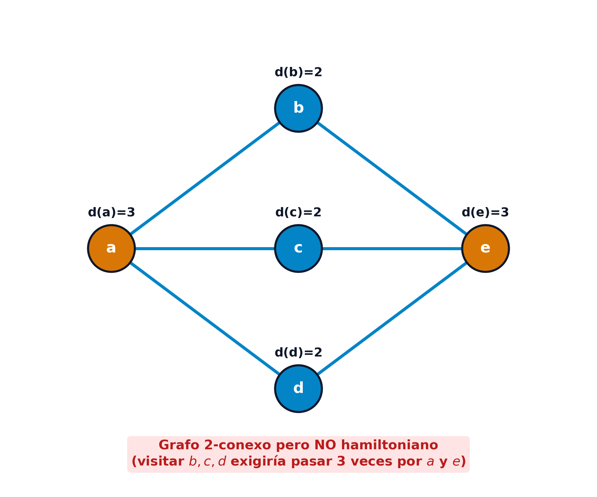{#fig-hamilton-2conexo-contraejemplo fig-align="center" width="50%"}

### Condiciones suficientes: Proposición de adyacencia y Teorema de Bondy y Chvátal

Para establecer condiciones suficientes de hamiltonianidad, se estudian los grafos completos y el efecto de añadir aristas entre vértices de grado elevado.

::: {.callout-note title="Proposición: Hamiltonianidad del grafo completo" data-kind="lema"}
Todo grafo simple completo $K_n$ con $n \ge 3$ vértices es hamiltoniano y contiene exactamente:
$$
\frac{(n-1)!}{2}
$$
ciclos hamiltonianos distintos no orientados ($n!$ si se considera el orden y sentido de recorrido).
:::

El resultado teórico fundamental que sustenta las condiciones modernas de suficiencia establece que añadir una arista entre dos nodos cuya suma de grados supera el número total de vértices no altera la condición de hamiltonianidad del grafo.

::: {.callout-important title="Teorema: Proposición fundamental de adyacencia de Bondy y Chvátal" data-kind="teorema"}
Sea $G = (V, E)$ un grafo simple con $n = |V| \ge 3$ vértices y sean $s, t \in V$ dos vértices **no adyacentes** tales que la suma de sus grados cumple:
$$
d_G(s) + d_G(t) \ge n
$$
Se define el grafo ampliado $G + \{s, t\} = (V, E \cup \{\{s, t\}\})$. Entonces:
$$
G \text{ es hamiltoniano} \iff G + \{s, t\} \text{ es hamiltoniano}
$$

*Demostración*:
La implicación directa ($\implies$) es trivial: si $G$ ya contiene un ciclo hamiltoniano, dicho ciclo existe igualmente en el supergrafo $G + \{s, t\}$.

Demostremos la implicación recíproca ($\impliedby$). Supongamos que $G + \{s, t\}$ contiene un ciclo hamiltoniano $C$.
Si la arista añadida $\{s, t\}$ no forma parte de $C$, entonces $C$ está contenido íntegramente en $G$ y el resultado queda demostrado.
Supongamos ahora que $\{s, t\} \in C$. Numeramos los vértices a lo largo del ciclo $C$ comenzando en $s = x_1$ y terminando en $t = x_n$, de modo que el ciclo en $G + \{s, t\}$ es:
$$
s = x_1 \to x_2 \to x_3 \to \dots \to x_{n-1} \to x_n = t \xrightarrow{\{s, t\}} s
$$
Para reconstruir un ciclo hamiltoniano en el grafo original $G$ sin utilizar la arista $\{s, t\}$, buscamos un índice intermedio $i \in \{2, 3, \dots, n-2\}$ tal que en $G$ existan simultáneamente la arista $\{s, x_{i+1}\}$ y la arista $\{t, x_i\}$, como se ilustra en la @fig-hamilton-adyacencia-demostracion.

Definimos los siguientes dos subconjuntos de vértices:
$$
\begin{aligned}
A &= \{ x_i \in V \mid \{s, x_{i+1}\} \in E, \ i \in \{2, \dots, n-2\} \} \\
B &= \{ x_i \in V \mid \{t, x_i\} \in E, \ i \in \{2, \dots, n-2\} \}
\end{aligned}
$$
Evaluemos los cardinales de estos conjuntos:

* El vértice $s$ puede ser adyacente a lo sumo a los nodos $\{x_2, \dots, x_{n-1}\}$. Dado que $\{s, t\} \notin E$ y descontando la arista $\{s, x_2\}$ (cuyo predecesor es $x_1$), el número de vecinos de $s$ entre los nodos $\{x_3, \dots, x_{n-1}\}$ es $|A| = d_G(s) - 1$.
* De igual forma, el vértice $t$ no está conectado a $s$, y descontando su conexión con $x_{n-1}$, se tiene $|B| = d_G(t) - 1$.

Sumando ambos cardinales:
$$
|A| + |B| = (d_G(s) - 1) + (d_G(t) - 1) = d_G(s) + d_G(t) - 2 \ge n - 2
$$
Por otra parte, ambos conjuntos están contenidos en el universo $U = \{x_2, x_3, \dots, x_{n-2}\}$, cuyo cardinal es $|U| = n - 3$. Por tanto, la unión satisface $|A \cup B| \le n - 3$.
Aplicando el principio de inclusión-exclusión:
$$
|A \cap B| = |A| + |B| - |A \cup B| \ge (n - 2) - (n - 3) = 1
$$
Como $|A \cap B| \ge 1$, la intersección es **no vacía** ($A \cap B \neq \emptyset$). Existe al menos un vértice $x_i$ tal que $\{s, x_{i+1}\} \in E$ y $\{t, x_i\} \in E$.

Eliminando del ciclo $C$ las aristas $\{s, t\}$ y $\{x_i, x_{i+1}\}$ e insertando las aristas $\{s, x_{i+1}\}$ y $\{t, x_i\}$, se obtiene el ciclo:
$$
s \to x_2 \to \dots \to x_i \to t \to x_{n-1} \to x_{n-2} \to \dots \to x_{i+1} \to s
$$
Este ciclo recorre todos los vértices de $V$ una sola vez y está compuesto exclusivamente por aristas de $E$. Por tanto, $G$ es hamiltoniano. $\blacksquare$

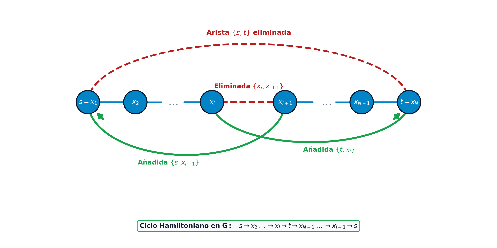{#fig-hamilton-adyacencia-demostracion fig-align="center" width="75%"}
:::

La aplicación iterativa de esta proposición conduce de forma natural al concepto de **clausura**.

::: {.callout-note title="Definición: Clausura de Bondy y Chvátal" data-kind="definicion"}
Dado un grafo simple $G = (V, E)$ con $n$ vértices, la **clausura de $G$**, denotada por $[G]$, es el grafo obtenido añadiendo recursivamente aristas entre parejas de vértices no adyacentes $u, v$ que satisfacen $d(u) + d(v) \ge n$, hasta que no sea posible añadir ninguna arista adicional. La clausura $[G]$ es única e independiente del orden en que se añadan las aristas.
:::

::: {.callout-important title="Teorema: Teorema de Bondy y Chvátal (1976)" data-kind="teorema"}
Un grafo simple $G$ es **hamiltoniano si y solo si su clausura $[G]$ es hamiltoniana**.
En particular, si la clausura de $G$ es el grafo completo ($[G] = K_n$), entonces $G$ es **hamiltoniano** [@bondy1976graph].
:::

La caracterización de Bondy y Chvátal establece una equivalencia lógica exacta ($G$ hamiltoniano $\iff [G]$ hamiltoniano). No obstante, cuando se utiliza la condición simplificada de clausura completa $[G] = K_n$ como criterio práctico de verificación, debe tenerse en cuenta su naturaleza asimétrica:

::: {.callout-warning title="Advertencia: El criterio $[G] = K_n$ es condición suficiente, pero no necesaria" data-kind="advertencia"}
Es crucial resaltar que la condición de que la clausura alcance el grafo completo ($[G] = K_n$) es una **condición suficiente pero no necesaria** para la existencia de ciclos hamiltonianos.

Como contraejemplo fundamental, consideremos el **grafo ciclo** $C_5 = (a, b, d, e, c, a)$ de $n=5$ vértices ilustrado en la @fig-hamilton-clausura-contraejemplo-c5. Este grafo es **evidentemente hamiltoniano** (el propio ciclo recorre todos sus vértices una sola vez). Sin embargo, al ser un ciclo simple regular de grado 2, todos sus vértices satisfacen $d(v) = 2$. Por tanto, para cualquier par de vértices no adyacentes $u, v$, la suma de grados resulta:
$$
d(u) + d(v) = 2 + 2 = 4 < n = 5
$$
Al no cumplirse la condición en ningún par, no es posible añadir ninguna arista, por lo que la clausura coincide con el grafo original: $[C_5] = C_5 \neq K_5$. Por consiguiente, si la clausura de un grafo no es completa ($[G] \neq K_n$), **no se puede deducir que el grafo no sea hamiltoniano** (el criterio de clausura completa resulta no concluyente).

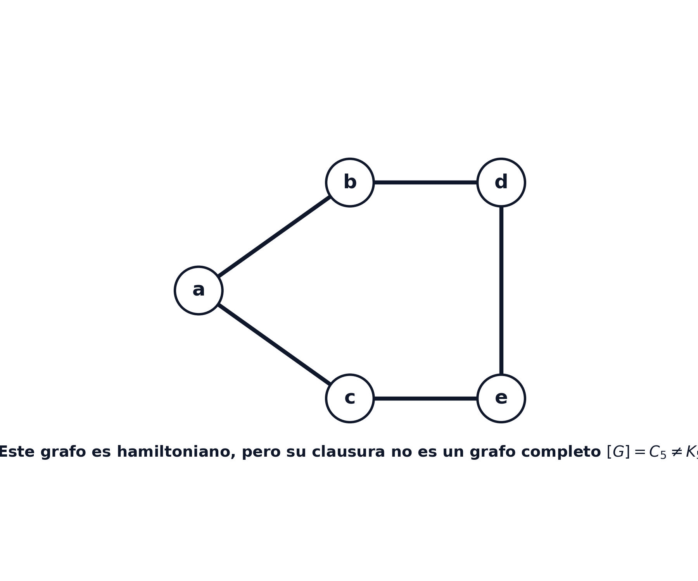{#fig-hamilton-clausura-contraejemplo-c5 fig-align="center" width="60%"}
:::

Como corolarios directos del teorema de Bondy y Chvátal se deducen de forma inmediata los teoremas clásicos de suficiencia más célebres de la literatura:

::: {.callout-note title="Corolario: Teoremas clásicos de Dirac (1952) y Ore (1960)" data-kind="corolario"}
Sea $G = (V, E)$ un grafo simple con $n \ge 3$ vértices:

*   **Teorema de Ore (1960)**: Si para todo par de vértices no adyacentes $u, v \in V$ se cumple $d(u) + d(v) \ge n$, entonces $G$ es hamiltoniano (su clausura es directamente el grafo completo $K_n$).
*   **Teorema de Dirac (1952)**: Si el grado mínimo de todo vértice cumple $d(v) \ge \frac{n}{2}$ para todo $v \in V$, entonces para cualquier par no adyacente $d(u) + d(v) \ge \frac{n}{2} + \frac{n}{2} = n$, y por tanto $G$ es hamiltoniano [@dirac1952some; @ore1960note].
:::

En el siguiente ejemplo, ilustramos el cálculo de la clausura en dos grafos distintos.

::: {.callout-tip title="Ejemplo: Cálculo y evaluación de la clausura de Bondy y Chvátal" data-kind="ejemplo" collapse="true"}
Analicemos los dos grafos representados en la @fig-bondy-chvatal-ejemplos:

1. **Ejemplo 1 (Grafo de 4 nodos, panel izquierdo)**:
   * Vértices: $V = \{a, b, c, d\}$, con $n = 4$.
   * Aristas originales: $\{a, b\}, \{a, c\}, \{a, d\}, \{b, c\}, \{b, d\}$.
   * Grados iniciales: $d(a)=3, d(b)=3, d(c)=2, d(d)=2$.
   * El único par de vértices no adyacentes es $\{c, d\}$.
   * Evaluando la condición: $d(c) + d(d) = 2 + 2 = 4 \ge n = 4$.
   * Se añade la arista $\{c, d\}$. El grafo resultante es el grafo completo $K_4$.
   * Por el Teorema de Bondy y Chvátal, $[G] = K_4 \implies G$ **es hamiltoniano**.
2. **Ejemplo 2 (Grafo de 5 nodos, panel derecho)**:
   * Vértices: $V = \{a, b, c, d, e\}$, con $n = 5$.
   * Aristas iniciales: $\{a, b\}, \{b, e\}, \{a, c\}, \{c, e\}, \{a, d\}, \{d, e\}$.
   * Grados iniciales: $d(a)=3, d(e)=3, d(b)=2, d(c)=2, d(d)=2$.
   * Evaluando pares no adyacentes:
     * Para $\{a, e\}$: $d(a) + d(e) = 3 + 3 = 6 \ge 5$. Se añade la arista $\{a, e\}$.
     * Los grados se actualizan a $d(a)=4, d(e)=4$.
     * Evaluando los restantes pares no adyacentes $\{b, c\}, \{c, d\}, \{b, d\}$:
       $d(b) + d(c) = 2 + 2 = 4 < 5$, $d(c) + d(d) = 4 < 5$, $d(b) + d(d) = 4 < 5$.

   * No es posible añadir más aristas. La clausura $[G]$ no es completa ($[G] \neq K_5$). La condición de suficiencia no permite certificar la hamiltonianidad (el grafo no es hamiltoniano).

![Cálculo de la clausura de Bondy y Chvátal: clausura completa $[G]=K_4$ (izquierda) y clausura incompleta (derecha)](images/bondy_chvatal_ejemplos.png){#fig-bondy-chvatal-ejemplos fig-align="center" width="90%"}
:::

---

## El Problema del Viajante de Comercio (TSP)

El **Problema del Viajante de Comercio** (conocido mundialmente como *Traveling Salesperson Problem*, TSP) es, sin lugar a dudas, el problema más emblemático, estudiado y emblemático de la optimización combinatoria y la programación entera [@dantzig1954solution; @applegate2006traveling].

El problema modela la situación de un agente comercial que debe partir de una ciudad base, visitar un conjunto de $n$ ciudades exactamente una vez y regresar al punto de partida, de modo que la **distancia, tiempo o coste económico total acumulado sea mínimo**.

Las aplicaciones reales del TSP trascienden con creces el ruteo físico de personas y vehículos. Entre sus aplicaciones industriales más destacadas figuran:

*   **Fabricación de circuitos impresos (PCB drilling)**: Optimización del orden de perforación de decenas de miles de orificios en placas electrónicas mediante brazos robóticos láser para minimizar el tiempo de desplazamiento del cabezal.
*   **Secuenciación de tareas en máquinas (Sequence-dependent scheduling)**: Programación de lotes de producción en una máquina industrial donde el tiempo de limpieza y ajuste entre tareas depende de la tarea inmediatamente precedente (tiempos de cambio de matriz en prensas o purga de color en pintura).
*   **Astronomía y observación espacial**: Secuenciación óptima de apuntado de telescopios orbitales (como el Hubble o James Webb) entre constelaciones celestes para minimizar el consumo de combustible en maniobras giroscópicas.
*   **Biología computacional y genómica**: Reconstrucción y alineamiento de secuencias de fragmentos de ADN en el ensamblaje de genomas.

::: {.callout-note title="Definición: Problema del Viajante de Comercio (TSP)" data-kind="definicion"}
Dado un conjunto de $n$ ciudades $V = \{1, 2, \dots, n\}$ y una matriz de costes o distancias $D = (d_{ij})_{n \times n}$, donde $d_{ij} \ge 0$ representa el coste de desplazarse directamente desde la ciudad $i$ hasta la ciudad $j$:

El **TSP** consiste en encontrar una permutación $\pi = (\pi(1), \pi(2), \dots, \pi(n))$ de las $n$ ciudades que minimice el coste total del ciclo hamiltoniano:
$$
\min_{\pi} \left( \sum_{k=1}^{n-1} d_{\pi(k), \pi(k+1)} + d_{\pi(n), \pi(1)} \right)
$$
:::

Para abordar el TSP mediante optimizadores matemáticos (*solvers* de programación lineal entera), se han desarrollado diversas formulaciones con propiedades teóricas y computacionales muy dispares. Analizaremos las tres formulaciones fundamentales: el modelo por etapas o tramos ($x_{ijk}$), el modelo clásico de eliminación exponencial de subciclos de Dantzig, Fulkerson y Johnson (DFJ), y la formulación compacta polinomial de Miller, Tucker y Zemlin (MTZ).

### Modelo 1 del TSP: Variables de posición de tramo ($x_{ijk}$)

Una primera aproximación intuitiva para modelar el TSP mediante Programación Lineal Entera consiste en concebir el itinerario del agente como una secuencia ordenada de $n$ etapas o tramos temporales sucesivos.

**Variables de decisión**: Para formular este modelo, se introducen las variables binarias con triple subíndice $x_{ijk} \in \{0, 1\}$, definidas como:
$$
x_{ijk} = \begin{cases} 
1 & \text{si el agente se desplaza directamente de } i \text{ a } j \text{ en la etapa } k \\ 
0 & \text{en otro caso} 
\end{cases}
$$
para todo $i, j, k \in \{1, \dots, n\}$.

**Construcción pedagógica de las restricciones**: A partir de estas variables, la exigencia de que la solución forme un ciclo hamiltoniano válido y continuo se traduce en cinco condiciones estructurales fundamentales:

1.  **Minimización de la distancia total (Función objetivo)**: Cada desplazamiento entre $i$ y $j$ devenga un coste $d_{ij}$ independientemente de la etapa $k$ en la que se realice. La distancia total acumulada a lo largo de las $n$ etapas del viaje es:
    $$
    \min_{x} \sum_{i=1}^n \sum_{j=1}^n \sum_{k=1}^n d_{ij} x_{ijk}
    $$

2.  **Salida única de cada ciudad**: El agente debe abandonar cada ciudad $i$ exactamente una vez a lo largo del viaje completo, dirigiéndose hacia alguna ciudad $j$ en alguna de las $n$ etapas $k$:
    $$
    \sum_{j=1}^n \sum_{k=1}^n x_{ijk} = 1, \quad \forall i = 1, \dots, n
    $$

3.  **Llegada única a cada ciudad**: El agente debe acceder a cada ciudad $j$ exactamente una vez a lo largo del viaje completo, proviniendo de alguna ciudad $i$ en alguna etapa $k$:
    $$
    \sum_{i=1}^n \sum_{k=1}^n x_{ijk} = 1, \quad \forall j = 1, \dots, n
    $$

4.  **Ocupación exclusiva de cada etapa temporal**: En cada etapa $k \in \{1, \dots, n\}$ del itinerario solo puede llevarse a cabo exactamente un trayecto entre un par de ciudades:
    $$
    \sum_{i=1}^n \sum_{j=1}^n x_{ijk} = 1, \quad \forall k = 1, \dots, n
    $$

5.  **Continuidad espacial del recorrido entre etapas consecutivas**: Si en la etapa $k$ el agente llega a la ciudad $j$ (sumando sobre todos los posibles orígenes $i \neq j$), en la siguiente etapa $k+1$ debe partir obligatoriamente desde esa misma ciudad $j$ (sumando sobre todos los posibles destinos $l \neq j$):
    $$
    \sum_{i \neq j} x_{ijk} = \sum_{l \neq j} x_{j,l,k+1}, \quad \forall j = 1, \dots, n, \quad \forall k = 1, \dots, n
    $$
    Para la última etapa $k = n$, la etapa subsiguiente $k+1$ se identifica circularmente con la etapa inicial $1$.

**Formulación matemática consolidada del Modelo 1**: Reuniendo todas las condiciones analizadas, el modelo completo de programación lineal entera queda formulado de la siguiente manera:
$$
\begin{aligned}
\min_{x} \quad & \sum_{i=1}^n \sum_{j=1}^n \sum_{k=1}^n d_{ij} x_{ijk} \\
\text{sujeto a} \quad & \sum_{j=1}^n \sum_{k=1}^n x_{ijk} = 1, \quad \forall i = 1, \dots, n \\
& \sum_{i=1}^n \sum_{k=1}^n x_{ijk} = 1, \quad \forall j = 1, \dots, n \\
& \sum_{i=1}^n \sum_{j=1}^n x_{ijk} = 1, \quad \forall k = 1, \dots, n \\
& \sum_{i \neq j} x_{ijk} = \sum_{l \neq j} x_{j,l,k+1}, \quad \forall j = 1, \dots, n, \ k = 1, \dots, n \\
& x_{ijk} \in \{0, 1\}, \quad \forall i, j, k = 1, \dots, n
\end{aligned}
$$

Desde el punto de vista computacional, este modelo requiere $n^3$ variables binarias y $3n + n^2$ restricciones para una red de $n$ ciudades. Aunque su planteamiento resulta transparente e intuitivo, el crecimiento cúbico de las variables limita su aplicación práctica a problemas de escala reducida.

### Modelo 2 del TSP: Eliminación exponencial de subciclos (DFJ)

Para reducir drásticamente el número de variables de decisión, George Dantzig, Delbert Fulkerson y Selmer Johnson propusieron en 1954 prescindir del subíndice temporal $k$ y trabajar exclusivamente con variables de arco [@dantzig1954solution].

**Variables de decisión y grado de asignación**: En este enfoque, la elección de las rutas se describe mediante variables binarias con doble subíndice:
$$
x_{ij} = \begin{cases} 
1 & \text{si el arco dirigido } (i, j) \text{ forma parte de la ruta} \\ 
0 & \text{en otro caso} 
\end{cases}
$$
para todo $i, j \in \{1, \dots, n\}$ con $i \neq j$.

Si imponemos únicamente las restricciones clásicas del problema de asignación:

*   **Conservación de salida (Grado exterior 1)**: $\sum_{j=1, j \neq i}^n x_{ij} = 1, \quad \forall i = 1, \dots, n$
*   **Conservación de entrada (Grado interior 1)**: $\sum_{i=1, i \neq j}^n x_{ij} = 1, \quad \forall j = 1, \dots, n$

cada ciudad tiene garantizado un único predecesor y un único sucesor. Sin embargo, estas dos condiciones no garantizan la conectividad global, permitiendo que la solución óptima se fracture en múltiples subciclos desconectados (*subtours*), como se ilustra en la @fig-tsp-subtours-asignacion.

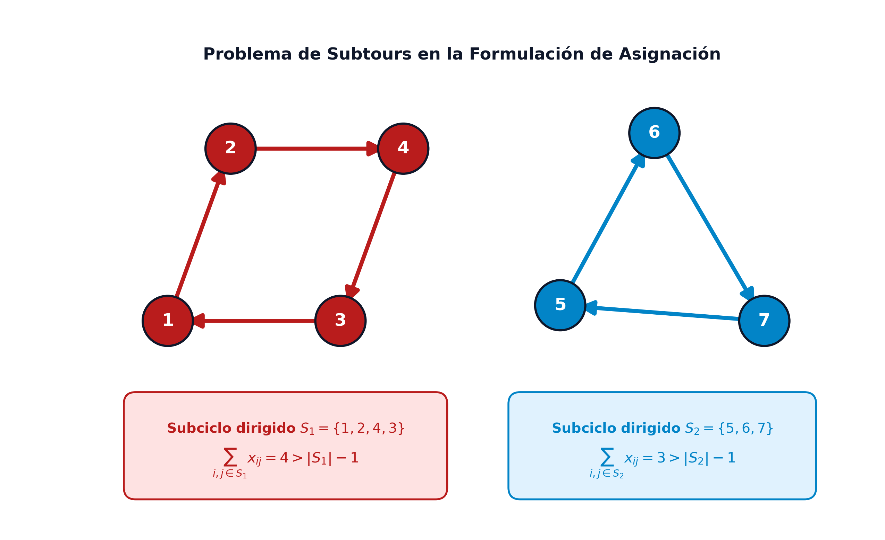{#fig-tsp-subtours-asignacion fig-align="center" width="75%"}

**Restricciones de eliminación de subciclos (SEC)**: Para erradicar cualquier subciclo aislado, Dantzig, Fulkerson y Johnson establecieron que para todo subconjunto propio no vacío de ciudades $S \subset V$ con cardinal $2 \le |S| \le n-1$, el número de arcos dirigidos cuyos dos extremos pertenezcan a $S$ no puede alcanzar el valor $|S|$, ya que ello formaría un ciclo cerrado aislado dentro de $S$. Esta condición da lugar a las **restricciones de eliminación de subciclos** (SEC):
$$
\sum_{i \in S} \sum_{j \in S} x_{ij} \le |S| - 1, \quad \forall S \subset V, \ 2 \le |S| \le n-1
$$

**Formulación matemática consolidada del Modelo DFJ**: Integrando la función objetivo, las restricciones de grado y las restricciones SEC, la formulación clásica DFJ se consolida como:
$$
\begin{aligned}
\min_{x} \quad & \sum_{i=1}^n \sum_{j=1}^n d_{ij} x_{ij} \\
\text{sujeto a} \quad & \sum_{j=1, j \neq i}^n x_{ij} = 1, \quad \forall i = 1, \dots, n \\
& \sum_{i=1, i \neq j}^n x_{ij} = 1, \quad \forall j = 1, \dots, n \\
& \sum_{i \in S} \sum_{j \in S} x_{ij} \le |S| - 1, \quad \forall S \subset V, \ 2 \le |S| \le n-1 \\
& x_{ij} \in \{0, 1\}, \quad \forall i, j = 1, \dots, n, \ i \neq j
\end{aligned}
$$

Aunque el modelo DFJ requiere únicamente $n(n-1)$ variables binarias, el número de restricciones SEC es de orden exponencial ($2^n - 2$). No obstante, este modelo posee la relajación lineal continua más ajustada y fuerte conocida en optimización combinatoria. En la práctica, los algoritmos modernos de ramificación y corte (*Branch-and-Cut*) resuelven instancias de decenas de miles de ciudades incorporando las restricciones SEC de forma perezosa y dinámica (*lazy constraints*) únicamente cuando se detecta un subciclo violado.

### Modelo 3 del TSP: Formulación compacta MTZ (Miller-Tucker-Zemlin)

En 1960, Clair Miller, Albert Tucker y Richard Zemlin desarrollaron una formulación alternativa que elimina los subciclos utilizando un número estrictamente polinomial de restricciones ($\mathcal{O}(n^2)$), permitiendo introducir el modelo completo directamente en cualquier optimizador lineal estándar sin necesidad de generadores de cortes dinámicos [@miller1960integer].

**Variables continuas de orden secuencial**: El modelo MTZ toma una ciudad de referencia como depósito base (fijando habitualmente $u_1 = 1$) y define variables continuas auxiliares $u_i \ge 0$ para $i = 2, \dots, n$, las cuales representan la posición o número de orden en el que la ciudad $i$ es visitada a lo largo del recorrido (satisfaciendo $2 \le u_i \le n$).

**Mecánica algebraica de las restricciones MTZ**: La eliminación de subciclos se consigue imponiendo la siguiente familia de inecuaciones cuadráticas en el número de nodos:
$$
u_i - u_j + n x_{ij} \le n - 1, \quad \forall i, j \in \{2, \dots, n\}, \ i \neq j
$$

Para comprender el fundamento algebraico de esta inecuación, analizamos los dos valores posibles de la variable binaria $x_{ij}$:

1.  **Si el arco $(i, j)$ forma parte de la ruta ($x_{ij} = 1$)**: Sustituyendo $x_{ij} = 1$ en la inecuación se obtiene $u_i - u_j + n(1) \le n - 1 \iff u_j \ge u_i + 1$. La restricción fuerza de manera estricta a que el orden de visita de la ciudad $j$ sea al menos una unidad mayor que el orden de la ciudad $i$. Como los índices deben crecer estrictamente a lo largo de cualquier subrecorrido, es imposible formar un subciclo cerrado que no contenga al depósito 1 (pues un subciclo $i_1 \to i_2 \to \dots \to i_m \to i_1$ exigiría $u_{i_1} < u_{i_2} < \dots < u_{i_m} < u_{i_1}$, lo cual constituye una imposibilidad matemática).

2.  **Si el arco $(i, j)$ no se utiliza ($x_{ij} = 0$)**: Sustituyendo $x_{ij} = 0$, la inecuación queda $u_i - u_j + 0 \le n - 1 \iff u_i - u_j \le n - 1$. Dado que las variables de orden satisfacen $2 \le u_i \le n$, la máxima diferencia posible entre dos índices cualesquiera es $(n) - (2) = n - 2 \le n - 1$. Por consiguiente, la restricción queda completamente desactivada y resulta redundante, no imponiendo ninguna limitación artificial sobre nodos no conectados.

**Formulación matemática consolidada del Modelo MTZ**: El modelo compacto MTZ se consolida formalmente como:
$$
\begin{aligned}
\min_{x, u} \quad & \sum_{i=1}^n \sum_{j=1}^n d_{ij} x_{ij} \\
\text{sujeto a} \quad & \sum_{j=1, j \neq i}^n x_{ij} = 1, \quad \forall i = 1, \dots, n \\
& \sum_{i=1, i \neq j}^n x_{ij} = 1, \quad \forall j = 1, \dots, n \\
& u_i - u_j + n x_{ij} \le n - 1, \quad \forall i, j \in \{2, \dots, n\}, \ i \neq j \\
& u_i \ge 0, \quad \forall i = 2, \dots, n \\
& x_{ij} \in \{0, 1\}, \quad \forall i, j = 1, \dots, n, \ i \neq j
\end{aligned}
$$

En la comparativa entre MTZ y DFJ destacan dos factores determinantes:

*   **Ventaja de MTZ**: Es un modelo compacto con $n^2 + n - 1$ variables y $n^2 - n + 2$ restricciones, resoluble directamente por cualquier *solver* estándar sin rutinas auxiliares de separación de cortes.
*   **Desventaja de MTZ**: Su relajación lineal continua es significativamente más débil que la de DFJ, lo que provoca que los algoritmos de ramificación y acotación (*Branch-and-Bound*) requieran explorar un árbol de búsqueda mucho mayor para instancias medianas o grandes.

### Heurísticas y el Algoritmo de Aproximación de Christofides

Dada la complejidad $\mathcal{NP}$-dura del TSP, en problemas de gran tamaño se recurre a heurísticas y algoritmos de aproximación con garantías teóricas:

*   **Heurística constructiva del Vecino más Cercano (Nearest Neighbor)**: Parte de un nodo inicial y en cada paso salta al nodo no visitado más cercano en tiempo $\mathcal{O}(n^2)$. Aunque es muy rápida, suele dejar nodos aislados lejanos para el final, generando un retorno final de coste elevado.
*   **Heurística de mejora local 2-Opt**: Parte de una ruta inicial válida y evalúa parejas de aristas $\{ (u, v), (x, y) \}$. Si sustituirlas por $\{ (u, x), (v, y) \}$ reduce la distancia total (lo que equivale a invertir el sentido de recorrido del subsegmento intermedio), se aplica el intercambio. Se itera hasta alcanzar un óptimo local 2-óptimo.

Para el **TSP métrico** (donde las distancias satisfacen la desigualdad triangular $d_{ij} \le d_{ik} + d_{kj}$), el matemático greco-británico **Nicos Christofides** desarrolló en 1976 un célebre algoritmo de aproximación polinomial [@christofides1976worst].

::: {.callout-note title="Esquema: Algoritmo de aproximación de Christofides (1976)" data-kind="esquema"}
Dado un grafo completo con distancias no negativas que satisfacen la desigualdad triangular:

1.  **Árbol Soporte de Mínimo Peso (MST)**: Calcular un árbol generador de mínimo peso $T$ sobre el conjunto de nodos $V$ mediante el algoritmo de Kruskal o Prim.
2.  **Identificación de vértices impares**: Identificar el subconjunto $O \subset V$ de vértices que tienen grado impar en el árbol $T$ (el número $|O|$ es necesariamente par).
3.  **Emparejamiento perfecto de peso mínimo**: Calcular el emparejamiento perfecto de peso mínimo $M$ sobre el subgrafo inducido por los vértices de $O$ en el grafo original.
4.  **Construcción del multigrafo euleriano**: Unir las aristas del árbol $T$ y las del emparejamiento $M$ para formar el multigrafo $H = T \cup M$. En $H$, todos los vértices tienen grado par.
5.  **Ciclo euleriano y atajos hamiltonianos**: Hallar un ciclo euleriano en $H$ y transformarlo en un ciclo hamiltoniano recorriendo sus vértices y aplicando **atajos** (*shortcuts*), es decir, saltando directamente a nodos no visitados omitiendo nodos repetidos.
:::

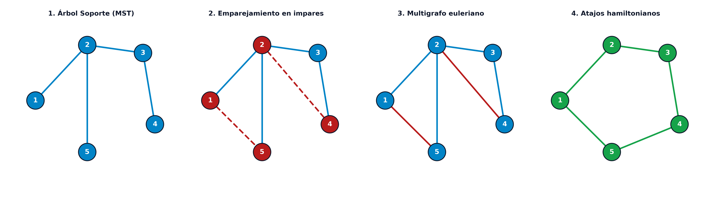{#fig-christofides-pasos-esquema fig-align="center" width="95%"}

::: {.callout-important title="Teorema: Garantía de aproximación de factor 1.5 de Christofides" data-kind="teorema"}
En cualquier grafo métrico, el algoritmo de Christofides garantiza una solución cuyo coste no supera **1.5 veces el coste de la solución óptima global**:
$$
\text{Coste}(C_{\text{Christofides}}) \le \frac{3}{2} \text{Coste}(C^*)
$$

*Demostración*:
Sea $C^*$ el ciclo hamiltoniano óptimo global del TSP.

1.  **Cota del MST**: Si eliminamos una arista arbitraria del ciclo óptimo $C^*$, obtenemos un camino simple que conecta todos los vértices. Dado que cualquier camino generador es un árbol soporte, y el MST $T$ es por definición el árbol generador de menor peso:
    $$
    \text{Coste}(T) \le \text{Coste}(\text{camino}) < \text{Coste}(C^*)
    $$

2.  **Cota del Emparejamiento**: Consideremos el ciclo óptimo $C^*$ proyectado únicamente sobre el subconjunto de nodos impares $O$, omitiendo mediante atajos los nodos que no pertenecen a $O$. Por la desigualdad triangular, el coste de este ciclo inducido $C^*_O$ cumple $\text{Coste}(C^*_O) \le \text{Coste}(C^*)$.
    Al tener $|O|$ un número par de vértices, el ciclo $C^*_O$ puede descomponerse en dos emparejamientos perfectos disjuntos y alternos $M_1$ y $M_2$. La suma de sus costes satisface:
    $$
    \text{Coste}(M_1) + \text{Coste}(M_2) = \text{Coste}(C^*_O) \le \text{Coste}(C^*)
    $$
    Como $M$ es el emparejamiento perfecto de peso mínimo sobre $O$:
    $$
    \text{Coste}(M) \le \min \{ \text{Coste}(M_1), \text{Coste}(M_2) \} \le \frac{1}{2} \text{Coste}(C^*)
    $$

3.  **Combinación y atajos**: Sumando las aristas del multigrafo euleriano $H = T \cup M$:
    $$
    \begin{aligned}
    \text{Coste}(H) &= \text{Coste}(T) + \text{Coste}(M) \\
    &< \text{Coste}(C^*) + \frac{1}{2} \text{Coste}(C^*) = \frac{3}{2} \text{Coste}(C^*)
    \end{aligned}
    $$
    Al aplicar atajos para convertir el recorrido euleriano en el ciclo hamiltoniano $C$, la desigualdad triangular garantiza que el coste no aumenta: $\text{Coste}(C) \le \text{Coste}(H) \le 1.5 \text{Coste}(C^*)$. $\blacksquare$
:::

---

## Taxonomía y características de los Problemas de Rutas de Vehículos (VRP)

Tanto el Problema del Viajante de Comercio (TSP) como el Problema del Cartero Chino (CPP) constituyen los bloques fundacionales de una disciplina de extraordinaria amplitud en la ingeniería de sistemas, la investigación operativa y la logística de distribución: la familia de los **Problemas de Rutas de Vehículos** (*Vehicle Routing Problems*, VRP), introducidos formalmente por George Dantzig y John Ramser en 1959 [@dantzig1959truck].

Mientras que el TSP tradicional asume un único agente con capacidad infinita que visita un conjunto cerrado de ciudades, los problemas de distribución industrial involucran flotas heterogéneas, restricciones de capacidad volumétrica o de tonelaje, ventanas temporales estrictas de entrega y múltiples centros logísticos de origen y destino.

Desde la perspectiva topológica, la primera distinción conceptual básica radica en la localización espacial de las demandas que deben ser atendidas dentro de la infraestructura de transporte, dando lugar a dos grandes familias complementarias esquematizadas en la @fig-vrp-taxonomia-topologica:

*   **Problemas de rutas por nodos (Node Routing)**: Los puntos de demanda o clientes se sitúan exclusivamente en los **vértices** de la red, mientras que las aristas actúan únicamente como vías transitables de desplazamiento. Esta categoría engloba desde el TSP elemental hasta el **Problema de Rutas de Vehículos con Capacidad** (*Capacitated VRP*, CVRP) (donde una flota de vehículos con capacidad limitada $Q$ abastece a múltiples clientes partiendo de un depósito), el **VRP con Ventanas de Tiempo** (VRPTW) y los problemas de **recogida y entrega simultánea** (*Pickup and Delivery Problem*, PDP).
*   **Problemas de rutas por arcos (Arc Routing)**: Las demandas o servicios se encuentran distribuidos de manera continua a lo largo de las **aristas o arcos** de la red viaria. Mientras que el **Problema del Cartero Chino (CPP)** exige transitar por todas las aristas de la red (inspección de tuberías, líneas eléctricas o pavimentos), el **Problema del Cartero Rural (RPP)** atiende únicamente a un subconjunto prioritario de tramos. Cuando se consideran flotas con capacidad de carga finita, se formula el **Problema de Rutas por Arcos con Capacidad** (CARP), estándar en la recogida municipal de residuos sólidos urbanos y el esparcimiento de sal en vialidad invernal.
*   **Problemas de rutas mixtos (General Routing Problems - GRP)**: Combinan servicios puntuales concentrados en ciertos vértices con demandas continuas distribuidas a lo largo de aristas específicas de la red.

{#fig-vrp-taxonomia-topologica fig-align="center" width="85%"}

Por otra parte, la traslación de estos problemas a modelos matemáticos computables y aplicables a la logística real requiere caracterizar con precisión seis dimensiones operativas fundamentales, ilustradas en la @fig-vrp-dimensiones-operativas:

*   **Composición y capacidad de la flota**: Se distingue entre *flotas homogéneas*, donde todos los vehículos son idénticos en capacidad de carga, autonomía y costes operativos, y *flotas heterogéneas*, donde coexisten vehículos de diversas tipologías con posibles restricciones de gálibo o acceso físico a cascos urbanos históricos.
*   **Topología de las instalaciones y depósitos**: En los esquemas *monodepósito*, todos los vehículos inician y concluyen su recorrido en una base central única. En los esquemas *multidepósito* (*Multi-Depot VRP*), la distribución se coordina desde múltiples centros territoriales, pudiendo los vehículos pernoctar en su base de origen o admitir reubicación libre entre depósitos.
*   **Certidumbre y dinamismo de la demanda**: Frente a los modelos *deterministas*, donde las cantidades requeridas por cada cliente se conocen con exactitud antes de iniciar las expediciones, los entornos *estocásticos o dinámicos* modelan la demanda como variables aleatorias o procesan solicitudes de última hora recibidas telemáticamente durante la ejecución en curso de la ruta.
*   **Modalidad de las operaciones de transporte**: Comprende desde la *entrega pura* (el vehículo parte cargado y se vacía progresivamente) y la *recogida pura* (el vehículo parte vacío y va acumulando mercancía o residuos) hasta las *operaciones combinadas de recogida y entrega simultánea*, que exigen monitorizar la capacidad residual disponible en cada tramo intermedio de la ruta.
*   **Restricciones temporales y ventanas de servicio**: Varían desde horizontes abiertos sin limitaciones horarias hasta *ventanas de tiempo rígidas* (*Hard Time Windows*), donde el servicio fuera del intervalo $[a_i, b_i]$ está estrictamente prohibido, o *ventanas flexibles* (*Soft Time Windows*), donde los adelantos o retrasos se penalizan económicamente en la función objetivo.
*   **Estructura de costes y objetivos de optimización**: Aunque el objetivo clásico consiste en minimizar la distancia total recorrida, el tiempo de conducción o el consumo de combustible, los modelos avanzados integran la minimización del número total de vehículos activos, la reducción de emisiones de $\text{CO}_2$ y el *equilibrio de las cargas de trabajo* (*fair workload balancing*) entre los conductores.

{#fig-vrp-dimensiones-operativas fig-align="center" width="90%"}
