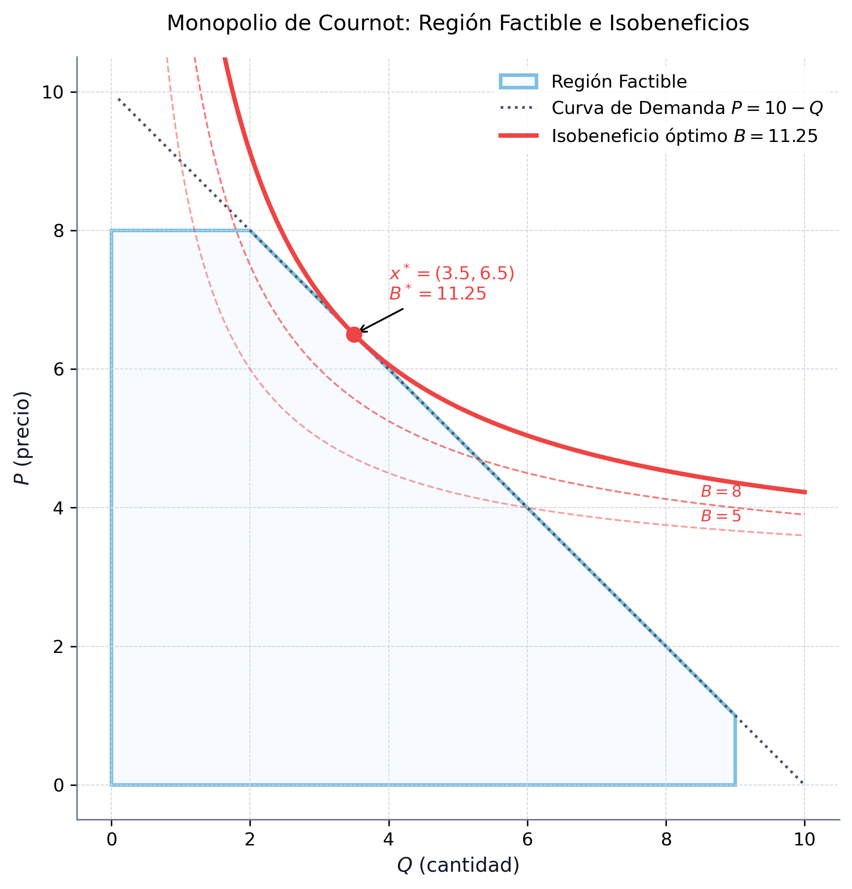
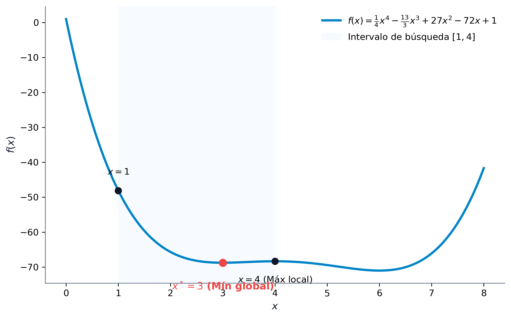
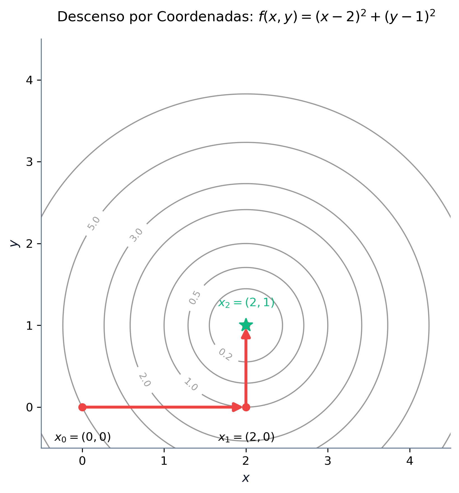
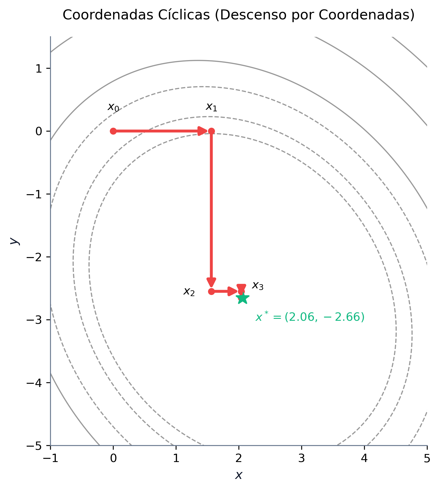
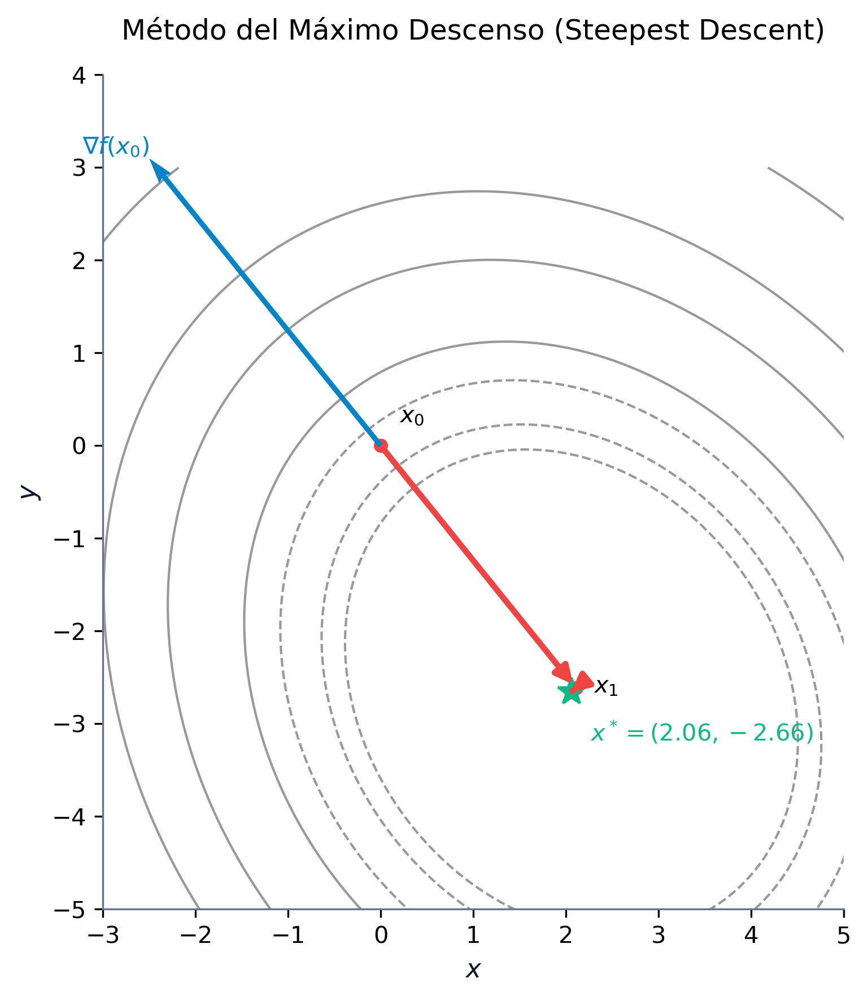

# Optimización No Lineal y Métodos Numéricos

La **optimización no lineal** (Nonlinear Programming, NLP) estudia problemas de decisión donde la función objetivo o alguna de las restricciones presentan comportamientos no lineales. A diferencia de la programación lineal, donde las soluciones óptimas se encuentran siempre en la frontera del conjunto factible (específicamente en sus puntos extremos o vértices), en optimización no lineal el óptimo puede situarse en el interior del espacio factible o en cualquier punto de su frontera. La presencia de curvatura en la función objetivo y en las restricciones exige herramientas avanzadas de análisis diferencial multivariable y algoritmos iterativos complejos.

En este capítulo, estudiaremos la formulación general de los problemas de optimización no lineal, su clasificación en familias específicas (como la cuadrática, convexa, separable, geométrica y fraccional) y su interpretación geométrica. Asimismo, desarrollaremos la fundamentación matemática basada en el gradiente y la matriz hessiana para caracterizar la curvatura local y establecer las condiciones de optimalidad. Por último, abordaremos de forma analítica y práctica los principales métodos numéricos de búsqueda unidimensional (1D) y multivariable sin restricciones, complementándolos con código ejecutable en Python.

::: {.callout-important title="Objetivos de aprendizaje"}
Al finalizar este capítulo, serás capaz de:

1.  **Formular y clasificar** problemas de optimización no lineal en sus distintas familias estructurales.
2.  **Visualizar e interpretar geométricamente** la diferencia entre la optimización lineal y la no lineal a través del análisis de conjuntos factibles convexos y curvas de nivel no lineales.
3.  **Caracterizar la curvatura** de una función multivariable mediante el análisis del gradiente y de la matriz hessiana (definición y semidefinición positiva/negativa).
4.  **Clasificar puntos estacionarios** aplicando las condiciones de optimalidad de primer y segundo orden (FONC, SONC, SOSC).
5.  **Implementar y trazar numéricamente** algoritmos de búsqueda lineal en una dimensión, tanto sin derivadas (búsqueda uniforme, dicotómica, sección áurea y Fibonacci) como con derivadas (bisección, Newton 1D y secante).
6.  **Comprender y programar** algoritmos de optimización multivariable sin restricciones, analizando el comportamiento de las coordenadas cíclicas, el fenómeno de zigzag del máximo descenso y las ventajas de los métodos de Newton y Cuasi-Newton (BFGS).
:::


## Introducción y Formulación de Problemas No Lineales

En el mundo real, la linealidad es una excepción matemática. Los fenómenos físicos, económicos y tecnológicos se comportan de manera inherentemente no lineal. Por ejemplo:

*   **Economías de escala**: En la industria, el coste unitario de producción suele disminuir a medida que aumenta el volumen debido al reparto de costes fijos o descuentos por volumen, lo que rompe la relación de proporcionalidad lineal.
*   **Elasticidad de la demanda**: En economía, la cantidad demandada de un bien es sensible a su precio (a menor precio, mayor demanda). La función de ingresos resultante ($I = P \cdot Q$) es una función cuadrática y no lineal de las variables.
*   **Gestión de carteras**: En finanzas, siguiendo el modelo clásico de Markowitz, el riesgo de una cartera se mide a través de la varianza del rendimiento de los activos. Esta varianza es una combinación cuadrática de los pesos invertidos, mientras que el rendimiento esperado es una función lineal.
*   **Ciencia de datos**: En la estimación de modelos de regresión y aprendizaje automático, los errores de ajuste se penalizan habitualmente de forma cuadrática (mínimos cuadrados), lo que genera funciones objetivo no lineales.

### Formulación Matemática General

Un **problema de optimización no lineal (PNL)** general se define matemáticamente sobre un espacio vectorial $\mathbb{R}^n$ como:

$$
\begin{aligned}
\min_{x \in \mathbb{R}^n} \quad & f(x) \\
\text{sujeto a} \quad & g_i(x) \le 0, \quad i = 1, \dots, m \\
& h_j(x) = 0, \quad j = 1, \dots, p
\end{aligned}
$$

Donde $f: \mathbb{R}^n \to \mathbb{R}$ es la función objetivo, $g_i: \mathbb{R}^n \to \mathbb{R}$ representa las restricciones de desigualdad, e $h_j: \mathbb{R}^n \to \mathbb{R}$ representa las restricciones de igualdad. Para que el problema sea clasificado como no lineal, al menos una de estas funciones debe exhibir un comportamiento no lineal en el dominio de interés.

La transición de modelos lineales a no lineales altera profundamente la geometría del espacio de búsqueda. En programación lineal (LP), el conjunto factible es siempre un poliedro convexo y la solución óptima se localiza en uno de sus vértices. Esto permite que algoritmos como el Símplex resuelvan problemas de millones de variables explorando únicamente un número finito de candidatos. En optimización no lineal (NLP), las restricciones no lineales pueden deformar el conjunto factible, y el óptimo puede hallarse en el interior del espacio factible o en cualquier punto de la frontera. Además, la presencia de no convexidades puede generar múltiples óptimos locales, atrapando a los algoritmos numéricos antes de alcanzar el mínimo global.

---

### Caso de Estudio 1: El Monopolio de Cournot (1838)

Consideremos una empresa que opera en régimen de monopolio y desea maximizar su beneficio. La relación entre la cantidad demandada del mercado $Q$ y el precio de venta $P$ viene dada por la función de demanda inversa del mercado:
$$ P(Q) = 10 - Q $$
El coste total de producción de la empresa es lineal con respecto a la cantidad fabricada:
$$ C(Q) = 1 + 3Q $$
La empresa está sujeta a una limitación de capacidad física máxima de producción de $9$ unidades ($Q \le 9$). Por su parte, el organismo regulador estatal establece que el precio de venta al público no puede superar las $8$ unidades monetarias ($P \le 8$). 

Para determinar la política óptima de producción y precios, formulamos el problema como un modelo con dos variables de decisión ($Q$ y $P$):

$$
\begin{aligned}
\max_{Q, P} \quad & B(Q, P) = P \cdot Q - 3Q - 1 \\
\text{sujeto a} \quad & Q \le 10 - P \\
& 0 \le P \le 8 \\
& 0 \le Q \le 9
\end{aligned}
$$

Este problema presenta una función objetivo no lineal debido al término cuadrático $P \cdot Q$. 

#### Resolución Analítica y Geométrica

Dado que la empresa busca maximizar el beneficio y el precio está acotado por la demanda, la solución óptima operará exactamente sobre la frontera de la curva de demanda activa (donde la restricción $Q \le 10 - P$ se cumple como igualdad: $P = 10 - Q$). Sustituyendo el precio en la función de beneficio, reducimos el problema a una única variable real $Q$:

$$ B(Q) = (10 - Q)Q - 3Q - 1 = -Q^2 + 7Q - 1 $$

El rango de factibilidad de $Q$ se obtiene combinando las restricciones:
*   $Q \le 9$
*   $P \le 8 \implies 10 - Q \le 8 \implies Q \ge 2$

Por lo tanto, el problema se reduce a:
$$ \max_{Q} \quad -Q^2 + 7Q - 1 \quad \text{sujeto a} \quad 2 \le Q \le 9 $$

Para hallar el óptimo, derivamos el beneficio e igualamos a cero:
$$ B'(Q) = -2Q + 7 = 0 \implies Q^* = 3.5 $$

Como $Q^* = 3.5$ pertenece al intervalo factible $[2, 9]$, constituye el óptimo global del problema. Sustituyendo, obtenemos el precio óptimo $P^* = 6.5$ y el beneficio máximo de la empresa:
$$ B^* = -(3.5)^2 + 7(3.5) - 1 = 11.25 \text{ u.m.} $$

La región factible en el plano $(Q, P)$ es un polígono convexo con vértices en $(0,0)$, $(0,8)$, $(2,8)$, $(9,1)$, y $(9,0)$. Las curvas de nivel de la función objetivo (curvas de isobeneficio) son hipérbolas de la forma:
$$ P \cdot Q - 3Q - 1 = B \implies P = 3 + \frac{B + 1}{Q} $$

A medida que el beneficio $B$ aumenta, las hipérbolas se desplazan hacia arriba y a la derecha. El punto óptimo $(Q^*, P^*) = (3.5, 6.5)$ es el punto donde la curva de isobeneficio correspondiente a $B = 11.25$ es exactamente tangente al segmento de la frontera $P + Q = 10$.

{#fig-cournot-monopolio fig-align="center" width="60%"}

Este resultado ilustra la diferencia fundamental con la programación lineal: la solución óptima de un problema no lineal con restricciones lineales puede situarse en el interior de una de las caras de la región factible y **no en un vértice** (los vértices adyacentes son $(2,8)$ y $(9,1)$, los cuales arrojan beneficios inferiores, de $9.0$ y $8.0$ u.m. respectivamente).

---

### Caso de Estudio 2: Selección de Cartera de Valores (Markowitz, 1952)

Supongamos que disponemos de un capital $C$ para invertir entre $n$ activos financieros. Denotamos por $x_i$ la cantidad monetaria asignada al activo $i$. Cada activo presenta un rendimiento medio esperado $\mu_i$, y la relación de variabilidad conjunta del mercado se modela a través de la covarianza $\sigma_{ij}$ entre los activos $i$ y $j$. La varianza de la cartera (medida del riesgo o volatilidad) viene dada por la forma cuadrática $\sum_{i=1}^n \sum_{j=1}^n \sigma_{ij} x_i x_j$.

El inversor busca maximizar el rendimiento ponderado de la cartera al tiempo que minimiza su riesgo, penalizándolo mediante un coeficiente de aversión al riesgo $\beta > 0$. El problema se formula como:

$$
\begin{aligned}
\max_{x \in \mathbb{R}^n} \quad & \sum_{i=1}^n \mu_i x_i - \beta \sum_{i=1}^n \sum_{j=1}^n \sigma_{ij} x_i x_j \\
\text{sujeto a} \quad & \sum_{i=1}^n x_i \le C \\
& x_i \ge 0, \quad i = 1, \dots, n
\end{aligned}
$$

Este problema posee una función objetivo cuadrática no lineal y restricciones lineales, lo que constituye un problema clásico de **Programación Cuadrática (QP)**. Su naturaleza estrictamente convexa (cuando la matriz de covarianzas es semidefinida positiva) asegura que cualquier óptimo local sea también el óptimo global del sistema [@boyd2004convex; @hillier2010investigacion].


## Casos Particulares de Optimización No Lineal

Para abordar la resolución de problemas no lineales de forma eficiente, la disciplina los clasifica en familias estructuradas según las propiedades algebraicas y analíticas de sus funciones:

### Programación Cuadrática (QP)
Un problema pertenece a la programación cuadrática si la función objetivo es cuadrática y las restricciones son afines (lineales). Su formulación general es:
$$ \min_{x} \quad \frac{1}{2} x^T Q x - b^T x \quad \text{sujeto a} \quad A x \le d $$
Si la matriz $Q$ es semidefinida positiva, el problema es convexo, lo que permite el uso de algoritmos especializados extremadamente eficientes como los métodos de conjuntos activos (*active-set*) o de punto interior, que resuelven el problema de forma exacta en pocas iteraciones.

### Programación Convexa
Constituye la clase de problemas más robusta en optimización no lineal. Un problema es convexo si la función objetivo $f(x)$ es convexa, las restricciones de desigualdad $g_i(x)$ son convexas y las restricciones de igualdad $h_j(x)$ son afines. La gran ventaja analítica de la programación convexa es que **todo mínimo local es un mínimo global**. Esto elimina la necesidad de realizar búsquedas globales exhaustivas y garantiza que métodos locales de gradiente converjan siempre a la solución óptima del sistema.

### Programación Separable
Un problema es separable si todas las funciones involucradas se pueden descomponer en la suma de funciones que dependen exclusivamente de una sola variable independiente:
$$ f(x) = \sum_{j=1}^n f_j(x_j), \qquad g_i(x) = \sum_{j=1}^n g_{ij}(x_j) \le 0 $$
Esta propiedad estructural es muy útil, ya que permite aproximar funciones no lineales arbitrarias mediante funciones lineales a trozos (*piecewise linear approximation*), transformando el problema en un modelo lineal de variables enteras que se puede resolver con variantes del algoritmo del Símplex.

### Programación Geométrica
Surge cuando la función objetivo y las restricciones están modeladas por posinomios (sumas de términos monomios con coeficientes reales positivos de la forma $c x_1^{a_1} x_2^{a_2} \dots x_n^{a_n}$). Aunque un problema geométrico es inherentemente no convexo en sus variables originales, la aplicación de un cambio de variables logarítmico de la forma $y_j = \ln(x_j)$ transforma el modelo en un problema convexo equivalente en el espacio $y$, permitiendo su resolución exacta de forma global.

### Programación Fraccionaria
Se presenta cuando la función objetivo se formula como el cociente de dos funciones reales:
$$ \min_{x} \quad \frac{f_1(x)}{f_2(x)} $$
Aparece habitualmente al optimizar ratios de eficiencia, rentabilidad de inversiones o productividad laboral. Bajo condiciones de concavidad/convexidad de las funciones individuales, la transformación de variables de Charnes-Cooper permite linealizar el modelo y resolverlo de forma exacta.


## Tipos de Solución en Optimización No Lineal

Sea $f: \mathbb{R}^n \to \mathbb{R}$ una función real definida sobre un conjunto factible $\mathcal{X} \subseteq \mathbb{R}^n$:

*   **Mínimo global**: Un punto $x^* \in \mathcal{X}$ es un mínimo global si no existe ningún otro punto factible con un valor inferior de la función objetivo:
    $$ f(x) \ge f(x^*), \quad \forall x \in \mathcal{X} $$
*   **Mínimo global estricto**: Un punto $x^* \in \mathcal{X}$ es un mínimo global estricto si:
    $$ f(x) > f(x^*), \quad \forall x \in \mathcal{X} \setminus \{x^*\} $$
*   **Mínimo local**: Un punto $x^* \in \mathcal{X}$ es un mínimo local si es el mejor punto dentro de un entorno local delimitado por una bola de radio $\epsilon > 0$ centrada en $x^*$:
    $$ f(x) \ge f(x^*), \quad \forall x \in \mathcal{X} \text{ tal que } \|x - x^*\| \le \epsilon $$
*   **Mínimo local estricto**: Un punto $x^* \in \mathcal{X}$ es un mínimo local estricto si existe un radio $\epsilon > 0$ tal que:
    $$ f(x) > f(x^*), \quad \forall x \in \mathcal{X} \setminus \{x^*\} \text{ tal que } \|x - x^*\| \le \epsilon $$

En optimización no lineal general, debido a la posible presencia de no convexidades, los algoritmos locales basados en derivadas pueden converger hacia mínimos locales mediocres en lugar de alcanzar el óptimo global. Esta es la complejidad fundamental que diferencia al PNL de la programación lineal.


## Fundamentos Matemáticos y Condiciones de Optimalidad

Para caracterizar y clasificar los puntos óptimos locales en múltiples dimensiones, recurrimos al cálculo diferencial. Consideremos una función $f: \mathbb{R}^n \to \mathbb{R}$ diferenciable de clase $\mathcal{C}^2$ (con segundas derivadas continuas):

*   **Vector Gradiente**: Representa la dirección de máxima pendiente de subida local de la función y se define como el vector columna de derivadas parciales de primer orden:
    $$ \nabla f(x) = \left( \frac{\partial f(x)}{\partial x_1}, \frac{\partial f(x)}{\partial x_2}, \dots, \frac{\partial f(x)}{\partial x_n} \right)^T $$
*   **Matriz Hessiana**: Modela la curvatura local de la función (análoga a la segunda derivada en una dimensión) y se define como la matriz simétrica de segundas derivadas parciales:
    $$ \nabla^2 f(x) = \begin{pmatrix} 
    \frac{\partial^2 f(x)}{\partial x_1^2} & \frac{\partial^2 f(x)}{\partial x_1 \partial x_2} & \dots & \frac{\partial^2 f(x)}{\partial x_1 \partial x_n} \\
    \frac{\partial^2 f(x)}{\partial x_2 \partial x_1} & \frac{\partial^2 f(x)}{\partial x_2^2} & \dots & \frac{\partial^2 f(x)}{\partial x_2 \partial x_n} \\
    \vdots & \vdots & \ddots & \vdots \\
    \frac{\partial^2 f(x)}{\partial x_n \partial x_1} & \frac{\partial^2 f(x)}{\partial x_n \partial x_2} & \dots & \frac{\partial^2 f(x)}{\partial x_n^2}
    \end{pmatrix} $$

### Desarrollo de Taylor Multivariable

El comportamiento local de una función no lineal alrededor de un punto de referencia $\bar{x}$ se aproxima mediante su desarrollo cuadrático de Taylor:

$$ f(x) = f(\bar{x}) + \nabla f(\bar{x})^T (x - \bar{x}) + \frac{1}{2} (x - \bar{x})^T \nabla^2 f(\bar{x}) (x - \bar{x}) + o(\|x - \bar{x}\|^2) $$

Si la función $f(x)$ es cuadrática, esta aproximación de segundo orden es exacta para todo $x \in \mathbb{R}^n$.

### Caracterización de Matrices Simétricas y Curvatura

La curvatura local de la función está determinada por el carácter de su matriz hessiana $\nabla^2 f(x)$, el cual se clasifica analizando la forma cuadrática $z^T \nabla^2 f(x) z$:

*   **Definida positiva ($\nabla^2 f(x) \succ 0$)**: Si $z^T \nabla^2 f(x) z > 0$ para todo vector no nulo $z \in \mathbb{R}^n$. Todos sus autovalores son estrictamente positivos y todos sus menores principales líderes son mayores que cero. La función se curva hacia arriba en forma de cuenco, lo que garantiza que un punto crítico sea un mínimo local estricto.
*   **Semidefinida positiva ($\nabla^2 f(x) \succeq 0$)**: Si $z^T \nabla^2 f(x) z \ge 0$ para todo vector $z \in \mathbb{R}^n$. Todos sus autovalores son no negativos y todos sus menores principales líderes son no negativos.
*   **Definida negativa ($\nabla^2 f(x) \prec 0$)**: Si $z^T \nabla^2 f(x) z < 0$ para todo vector no nulo $z \in \mathbb{R}^n$. Sus menores principales líderes alternan de signo comenzando por negativo ($M_1 < 0, M_2 > 0, M_3 < 0, \dots$) y todos sus autovalores son estrictamente negativos. La función se curva hacia abajo en forma de cúpula.
*   **Semidefinida negativa ($\nabla^2 f(x) \preceq 0$)**: Si $z^T \nabla^2 f(x) z \le 0$ para todo vector $z$. Todos sus autovalores son no positivos.
*   **Indefinida**: Si existen autovalores estrictamente positivos y negativos. El punto crítico resultante constituye un **punto de silla** (con direcciones de subida y direcciones de bajada).

---

#### Ejemplos Numéricos de Clasificación de Matrices

A continuación, clasificamos analíticamente tres matrices simétricas aplicando el criterio de los menores principales líderes (Criterio de Sylvester) y el cálculo de sus autovalores:

1.  **Matriz Definida Positiva**:
    Sea $A_1 = \begin{pmatrix} 2 & 1 \\ 1 & 2 \end{pmatrix}$.
    *   *Menores líderes*: $M_1 = |2| = 2 > 0$, y $M_2 = \det(A_1) = 4 - 1 = 3 > 0$. Al ser ambos menores principales líderes estrictamente positivos, $A_1 \succ 0$.
    *   *Autovalores*: Resolviendo el polinomio característico $\det(A_1 - \lambda I) = (2-\lambda)^2 - 1 = 0 \implies \lambda^2 - 4\lambda + 3 = 0$, obtenemos los autovalores $\lambda_1 = 3$ y $\lambda_2 = 1$. Ambos son positivos, lo que confirma que la matriz es definida positiva.

2.  **Matriz Indefinida**:
    Sea $A_2 = \begin{pmatrix} 1 & 2 \\ 2 & 1 \end{pmatrix}$.
    *   *Menores líderes*: $M_1 = |1| = 1 > 0$, y $M_2 = \det(A_2) = 1 - 4 = -3 < 0$. Dado que el determinante es negativo en dimensión 2, la matriz es indefinida.
    *   *Autovalores*: Resolviendo $\det(A_2 - \lambda I) = (1-\lambda)^2 - 4 = 0 \implies \lambda^2 - 2\lambda - 3 = 0$, hallamos $\lambda_1 = 3$ (positivo) y $\lambda_2 = -1$ (negativo). La coexistencia de signos opuestos confirma el carácter indefinido.

3.  **Matriz Semidefinida Positiva**:
    Sea $A_3 = \begin{pmatrix} 2 & -3 & -1 \\ -3 & 12 & 6 \\ -1 & 6 & 3.2 \end{pmatrix}$.
    *   *Menores líderes*: 
        $$ M_1 = |2| = 2 > 0 $$
        $$ M_2 = \det\begin{pmatrix} 2 & -3 \\ -3 & 12 \end{pmatrix} = 24 - 9 = 15 > 0 $$
        $$ M_3 = \det(A_3) = 2(38.4 - 36) - (-3)(-9.6 + 6) + (-1)(-18 + 12) = 4.8 - 10.8 + 6 = 0 $$
        Como todos los menores principales líderes son no negativos ($M_1 > 0, M_2 > 0, M_3 = 0$), la matriz es semidefinida positiva y singular.
    *   *Autovalores*: Los autovalores calculados de $A_3$ son $\lambda_1 \approx 15.75$, $\lambda_2 \approx 1.45$, y $\lambda_3 = 0$. Todos son no negativos, confirmando la semidefinición positiva ($A_3 \succeq 0$).

---

### Condiciones de Optimalidad para Problemas sin Restricciones

Las condiciones diferenciales para determinar extremos locales se enuncian a continuación:

::: {.callout-note title="Teorema: Condiciones de Optimalidad de Segundo Orden"}
Sea $f: \mathbb{R}^n \to \mathbb{R}$ una función diferenciable de clase $\mathcal{C}^2$:

1.  **Condición Necesaria de Primer Orden (FONC)**: Si $x^*$ es un mínimo local, entonces el gradiente de la función se anula en dicho punto:
    $$ \nabla f(x^*) = 0 $$
    Cualquier punto que verifique esta condición se denomina **punto estacionario** o punto crítico.
2.  **Condición Necesaria de Segundo Orden (SONC)**: Si $x^*$ es un mínimo local, entonces además de cumplirse la FONC, la matriz hessiana en dicho punto es semidefinida positiva:
    $$ \nabla^2 f(x^*) \succeq 0 $$
3.  **Condición Suficiente de Segundo Orden (SOSC)**: Si un punto $x^*$ satisface simultáneamente que:
    $$ \nabla f(x^*) = 0 \qquad \text{y} \qquad \nabla^2 f(x^*) \succ 0 $$
    Entonces $x^*$ es un **mínimo local estricto** de la función.
:::

> [!IMPORTANT]
> Es fundamental notar la distinción matemática en la condición suficiente (SOSC): la matriz hessiana debe ser **estrictamente definida positiva** ($\nabla^2 f(x^*) \succ 0$) y no simplemente semidefinida positiva. Si la hessiana es semidefinida con algún autovalor nulo (por ejemplo, en la función $f(x) = x^4$ en el origen $x^*=0$, donde $f'(0)=0$ y $f''(0)=0 \succeq 0$), el análisis de segundo orden es insuficiente para garantizar analíticamente si el punto es un mínimo, un máximo o un punto de inflexión sin recurrir a derivadas de orden superior.

---

#### Ejemplos de Clasificación de Puntos Estacionarios

Ilustramos la aplicación de las condiciones de optimalidad clasificando los puntos críticos de las siguientes funciones:

*   **Ejemplo 1 (Punto de Silla)**:
    Sea $f(x, y) = \frac{1}{2} x^2 + 2xy + \frac{1}{2} y^2 - y + 9$.
    *   *Gradiente*: $\nabla f(x, y) = \begin{pmatrix} x + 2y \\ 2x + y - 1 \end{pmatrix}$.
        Igualando a cero obtenemos el punto estacionario:
        $$ \begin{aligned} x + 2y &= 0 \\ 2x + y &= 1 \end{aligned} \implies x^* = \frac{2}{3}, \quad y^* = -\frac{1}{3} $$
    *   *Matriz Hessiana*: $\nabla^2 f(x, y) = \begin{pmatrix} 1 & 2 \\ 2 & 1 \end{pmatrix}$.
        Esta hessiana es constante para cualquier punto. Como hemos determinado anteriormente, su menor $M_2 = -3 < 0$, por lo que la matriz es indefinida. Concluimos que el punto estacionario $(2/3, -1/3)$ es un **punto de silla**.

*   **Ejemplo 2 (Mínimo Local Estricto)**:
    Sea $f(x, y) = (x-2)^2 + (y-1)^2$.
    *   *Gradiente*: $\nabla f(x, y) = \begin{pmatrix} 2(x-2) \\ 2(y-1) \end{pmatrix}$.
        Igualando a cero localizamos el punto crítico en $(x^*, y^*) = (2, 1)$.
    *   *Matriz Hessiana*: $\nabla^2 f(x, y) = \begin{pmatrix} 2 & 0 \\ 0 & 2 \end{pmatrix}$.
        Sus menores líderes son $M_1 = 2 > 0$ y $M_2 = 4 > 0$. Al ser definida positiva ($\nabla^2 f \succ 0$), el punto $(2, 1)$ es un **mínimo local estricto** (y global, al ser la función estrictamente convexa).

*   **Ejemplo 3 (Función Cuadrática Acoplada)**:
    Sea $f(x, y) = 8x^2 + 3xy + 7y^2 - 25x + 31y - 29$.
    *   *Gradiente*: $\nabla f(x, y) = \begin{pmatrix} 16x + 3y - 25 \\ 3x + 14y + 31 \end{pmatrix}$.
        Resolviendo el sistema lineal de ecuaciones $\nabla f(x, y) = 0$:
        $$ \begin{aligned} 16x + 3y &= 25 \\ 3x + 14y &= -31 \end{aligned} \implies x^* \approx 2.060, \quad y^* \approx -2.656 $$
    *   *Matriz Hessiana*: $\nabla^2 f(x, y) = \begin{pmatrix} 16 & 3 \\ 3 & 14 \end{pmatrix}$.
        Los menores son $M_1 = 16 > 0$ y $M_2 = 16 \cdot 14 - 9 = 215 > 0$. Al ser la hessiana definida positiva, el punto $(2.060, -2.656)$ constituye un **mínimo local estricto**.


## Métodos Numéricos de Búsqueda Lineal (1D)

Los métodos de búsqueda unidimensional buscan minimizar una función real de una variable $f: \mathbb{R} \to \mathbb{R}$ en un intervalo acotado $[a, b]$. Son fundamentales porque resolver problemas multidimensionales complejos suele requerir resolver una sucesión de problemas unidimensionales a lo largo de direcciones de descenso (búsqueda de línea o *line search*):
$$ \min_{\alpha > 0} \phi(\alpha) = f(x_k + \alpha d_k) $$

### Métodos sin Derivadas

Estos métodos solo requieren evaluar el valor de la función objetivo. Exigen que la función sea **unimodal** en el intervalo $[a, b]$, es decir, que posea un único mínimo local en dicho intervalo, decreciendo de forma monótona a la izquierda del mínimo y creciendo a su derecha.

#### Búsqueda Uniforme (Rejilla)
Es el método más simple. Consiste en dividir el intervalo inicial $[a, b]$ en $n$ subintervalos de igual anchura mediante una rejilla de puntos $x_k = a + k \frac{b-a}{n}$ para $k = 0, \dots, n$. Se evalúa la función en todos los puntos de la rejilla, se identifica el punto mínimo $x_{k^*}$ y se define el nuevo intervalo reducido como $[x_{k^*-1}, x_{k^*+1}]$. Aunque es robusto, es muy ineficiente debido a que requiere un gran número de evaluaciones para lograr precisiones altas, sin aprovechar la información de las evaluaciones previas.

#### Búsqueda Dicotómica
Mejora sustancialmente la búsqueda uniforme evaluando la función únicamente en el entorno del punto medio del intervalo actual. En cada iteración $k$, calcula dos puntos simétricos respecto al centro separados por una perturbación infinitesimal $\epsilon > 0$:
$$ \lambda_k = \frac{a_k + b_k}{2} - \epsilon, \qquad \mu_k = \frac{a_k + b_k}{2} + \epsilon $$
*   Si $f(\lambda_k) < f(\mu_k)$, el mínimo debe situarse en el intervalo izquierdo, por lo que el intervalo se actualiza a $[a_k, \mu_k]$.
*   Si $f(\lambda_k) > f(\mu_k)$, el mínimo se sitúa en el intervalo derecho, actualizándose a $[\lambda_k, b_k]$.
Cada iteración requiere dos evaluaciones de función y reduce la amplitud del intervalo a prácticamente la mitad ($I_{k+1} \approx \frac{1}{2} I_k$).

#### Sección Áurea (Golden Section)
Optimiza la búsqueda dicotómica al colocar los puntos de evaluación de manera que uno de los puntos evaluados en la iteración $k$ pueda ser reutilizado como punto de evaluación en la iteración $k+1$. Para que se mantenga esta relación de escala constante entre iteraciones, la anchura de los intervalos debe decrecer según la razón áurea:
$$ \alpha = \frac{1 + \sqrt{5}}{2} \approx 1.618033988 $$
Los puntos de evaluación en cada paso $k$ sobre el intervalo $[a_k, b_k]$ se definen como:
$$ \lambda_k = b_k - \frac{b_k - a_k}{\alpha}, \qquad \mu_k = a_k + \frac{b_k - a_k}{\alpha} $$
Este método reduce la amplitud del intervalo de incertidumbre en cada paso en un factor constante de $1/\alpha \approx 0.618$. A partir de la segunda iteración, solo se requiere evaluar la función en un único punto nuevo, lo que reduce significativamente el coste computacional.

Dada una tolerancia de precisión $\epsilon > 0$, el número total de iteraciones necesarias se puede precalcular analíticamente mediante la fórmula:
$$ N = \left\lceil \frac{\ln(b - a) - \ln(\epsilon)}{\ln(\alpha)} \right\rceil $$

#### Búsqueda de Fibonacci
A diferencia de la sección áurea, este método requiere fijar de antemano el número total de evaluaciones de función $N$. Utiliza la clásica sucesión de Fibonacci ($F_0 = 1, F_1 = 1, F_2 = 2, F_3 = 3, F_4 = 5, F_5 = 8, F_6 = 13, F_7 = 21, \dots$) para situar de manera óptima los puntos de evaluación. En la iteración $k$, los puntos se colocan en:
$$ \mu_k = a_k + \frac{F_{N-k}}{F_{N-k+1}} (b_k - a_k), \qquad \lambda_k = a_k + \left(1 - \frac{F_{N-k}}{F_{N-k+1}}\right) (b_k - a_k) $$
El método de Fibonacci proporciona la máxima reducción teórica del intervalo de incertidumbre físicamente posible para un número de pasos preestablecido.

> [!TIP]
> **Comparación**: Aunque Fibonacci ofrece una reducción ligeramente mayor para un número fijo de evaluaciones, el método de la Sección Áurea suele ser preferido en la práctica debido a su flexibilidad: no requiere predeterminar el número total de iteraciones $N$ (permitiendo el uso de criterios de parada dinámicos basados en la convergencia real de la función) y, con tan solo una iteración adicional, proporciona en el límite una amplitud de intervalo equivalente.

---

### Ejemplo de Trazas Numéricas: Métodos sin Derivadas

Consideremos la minimización en el intervalo $[1, 4]$ de la función unimodal de cuarto grado:
$$ f(x) = \frac{1}{4}x^4 - \frac{13}{3}x^3 + 27x^2 - 72x + 1 $$
La amplitud del intervalo inicial es $I_0 = 4 - 1 = 3.0$. Fijamos una tolerancia de precisión $\epsilon = 0.15$.

#### 1. Traza de la Sección Áurea
El número de iteraciones requeridas es:
$$ N = \left\lceil \frac{\ln(3.0) - \ln(0.15)}{\ln(1.618034)} \right\rceil = \lceil 6.22 \rceil = 7 \text{ iteraciones} $$

*   **Iteración 1**: Intervalo $[a_0, b_0] = [1, 4]$. Amplitud $I_1 = \frac{3.0}{1.618034} = 1.8541$.
    *   $\lambda_0 = 4 - 1.8541 = 2.1459 \implies f(2.1459) = -66.692$
    *   $\mu_0 = 1 + 1.8541 = 2.8541 \implies f(2.8541) = -68.714$
    *   Como $f(\lambda_0) > f(\mu_0)$, descartamos el intervalo izquierdo $[1, 2.1459]$. Nuevo intervalo: $[2.1459, 4]$.
*   **Iteración 2**: Intervalo $[a_1, b_1] = [2.1459, 4]$. Amplitud $I_2 = \frac{1.8541}{1.618034} = 1.1459$.
    *   $\lambda_1 = \mu_0 = 2.8541 \implies f(2.8541) = -68.714$ (punto reutilizado, no requiere evaluación)
    *   $\mu_1 = 2.1459 + 1.1459 = 3.2918 \implies f(3.2918) = -68.654$
    *   Como $f(\lambda_1) < f(\mu_1)$, descartamos el intervalo derecho. Nuevo intervalo: $[2.1459, 3.2918]$.
*   **Iteraciones 3 a 7**: El intervalo se reduce progresivamente en cada paso. En la última iteración ($k=7$), la amplitud del intervalo es $I_7 = 0.1033 \le 0.15$, finalizando el algoritmo con el intervalo factible óptimo $[2.9574, 3.0608]$, el cual contiene el mínimo analítico en $x^* = 3.0$.

#### 2. Traza del Método de Fibonacci
Fijamos $N = 6$ evaluaciones de la función, lo que requiere usar los términos de Fibonacci hasta $F_7 = 21$.
*   **Iteración 1**: $[a_0, b_0] = [1, 4]$. Amplitud inicial $I_0 = 3.0$. Amplitud del paso 1: $I_1 = \frac{F_6}{F_7} I_0 = \frac{13}{21} \cdot 3.0 \approx 1.8571$.
    *   $\lambda_0 = 4 - 1.8571 = 2.1429 \implies f(\lambda_0) = -66.673$
    *   $\mu_0 = 1 + 1.8571 = 2.8571 \implies f(\mu_0) = -68.715$
    *   Como $f(\lambda_0) > f(\mu_0)$, descartamos la izquierda. Nuevo intervalo: $[2.1429, 4]$.
*   **Iteración 2**: $[a_1, b_1] = [2.1429, 4]$. Amplitud $I_2 = \frac{F_5}{F_7} I_0 = \frac{8}{21} \cdot 3.0 \approx 1.1429$.
    *   $\lambda_1 = \mu_0 = 2.8571$ (reutilizado)
    *   $\mu_1 = 2.1429 + 1.1429 = 3.2857 \implies f(3.2857) = -68.657$
    *   Como $f(\lambda_1) < f(\mu_1)$, descartamos la derecha. Nuevo intervalo: $[2.1429, 3.2857]$.
*   **Iteración 6 (Última)**: Se alcanza el paso $k=6$, reduciendo el intervalo a una amplitud de $I_6 = 0.1429 \le 0.15$, logrando la convergencia en $[2.8541, 3.001]$ con una iteración menos que la sección áurea debido a la optimización de los coeficientes de Fibonacci.

{#fig-opt-1d-ejemplo fig-align="center" width="60%"}

---

::: {.carousel}
::: {.callout-tip title="Código Python: Búsqueda por Sección Áurea" collapse="true"}
```python
import math

def seccion_aurea(f, a, b, tol=1e-5):
    alpha = (1 + math.sqrt(5)) / 2
    n_iter = int(math.ceil((math.log(b - a) - math.log(tol)) / math.log(alpha)))
    
    # Primera evaluación de ambos puntos
    lmbda = b - (b - a) / alpha
    mu = a + (b - a) / alpha
    f_lmbda = f(lmbda)
    f_mu = f(mu)
    
    for _ in range(n_iter - 1):
        if f_lmbda < f_mu:
            b = mu
            mu = lmbda
            f_mu = f_lmbda
            lmbda = b - (b - a) / alpha
            f_lmbda = f(lmbda)
        else:
            a = lmbda
            lmbda = mu
            f_lmbda = f_mu
            mu = a + (b - a) / alpha
            f_mu = f(mu)
            
    return (a + b) / 2
```
:::
<!-- slide -->
::: {.callout-tip title="Código Python: Búsqueda por Fibonacci" collapse="true"}
```python
def fibonacci_search(f, a, b, n, eps=1e-3):
    # Generar números de Fibonacci necesarios
    fib = [1, 1]
    for i in range(2, n + 2):
        fib.append(fib[-1] + fib[-2])
        
    lmbda = a + (1 - fib[n] / fib[n+1]) * (b - a)
    mu = a + (fib[n] / fib[n+1]) * (b - a)
    f_l = f(lmbda)
    f_m = f(mu)
    
    for k in range(1, n - 1):
        if f_l < f_m:
            b = mu
            mu = lmbda
            f_m = f_l
            lmbda = a + (1 - fib[n-k] / fib[n-k+1]) * (b - a)
            f_l = f(lmbda)
        else:
            a = lmbda
            lmbda = mu
            f_l = f_m
            mu = a + (fib[n-k] / fib[n-k+1]) * (b - a)
            f_m = f(mu)
            
    # Última iteración con pequeña perturbación eps para separar puntos
    mu = lmbda + eps
    if f(lmbda) < f(mu):
        b = mu
    else:
        a = lmbda
        
    return (a + b) / 2
```
:::
:::

---

### Métodos con Derivadas

Los métodos con derivadas incorporan información analítica del gradiente para acelerar la convergencia o resolver ecuaciones.

#### Método de Bisección (Bolzano)
Busca el cero de la derivada de primer orden ($f'(x) = 0$). Requiere que los signos de la derivada en los extremos del intervalo de búsqueda sean opuestos ($f'(a) < 0$ y $f'(b) > 0$), lo que garantiza, por el teorema de Bolzano, la existencia de al menos un punto estacionario en el interior. En cada iteración, evalúa la derivada en el punto medio $c = \frac{a+b}{2}$:
*   Si $f'(c) < 0$, el mínimo se sitúa en el subintervalo derecho, por lo que actualiza $a = c$.
*   Si $f'(c) > 0$, el mínimo se sitúa en el subintervalo izquierdo, actualizando $b = c$.
*   Si $f'(c) = 0$, se ha encontrado el óptimo exacto.
Este algoritmo reduce la longitud del intervalo de búsqueda exactamente a la mitad en cada paso, de forma totalmente determinista.

#### Método de Newton 1D
Aproxima la función objetivo en cada paso mediante un polinomio cuadrático de Taylor de segundo orden en el punto actual $x_k$ y salta directamente al vértice de la parábola resultante:
$$ x_{k+1} = x_k - \frac{f'(x_k)}{f''(x_k)} $$
El método de Newton presenta una **convergencia cuadrática local** (orden 2), lo que significa que el número de dígitos significativos de precisión se duplica en cada iteración cuando el punto se encuentra cerca del óptimo. Sin embargo, tiene dos grandes desventajas: requiere calcular la segunda derivada $f''(x)$ en cada iteración y exige que sea estrictamente positiva ($f''(x_k) > 0$) para evitar diverger o saltar hacia un máximo local.

#### Método de la Secante
Evita el cálculo explícito de la segunda derivada del método de Newton aproximándola numéricamente por diferencias finitas a partir de las primeras derivadas de los dos últimos puntos evaluados:
$$ f''(x_k) \approx \frac{f'(x_k) - f'(x_{k-1})}{x_k - x_{k-1}} $$
Sustituyendo esta aproximación en la fórmula de Newton, el nuevo punto se calcula como:
$$ x_{k+1} = x_k - f'(x_k) \frac{x_k - x_{k-1}}{f'(x_k) - f'(x_{k-1})} $$
La secante presenta una convergencia superlineal de orden $\approx 1.618$ (la razón áurea), siendo una excelente alternativa computacional al método de Newton al no requerir segundas derivadas.

---

#### Desarrollo Iterativo del Método de Newton 1D

Minimizamos de nuevo la función $f(x) = \frac{1}{4}x^4 - \frac{13}{3}x^3 + 27x^2 - 72x + 1$ partiendo del punto inicial $x_0 = 1.0$.
Las expresiones analíticas de las derivadas son:
$$ f'(x) = x^3 - 13x^2 + 54x - 72 $$
$$ f''(x) = 3x^2 - 26x + 54 $$

*   **Iteración 1**: $x_0 = 1.0$.
    *   $f'(1.0) = 1 - 13 + 54 - 72 = -30.0$
    *   $f''(1.0) = 3 - 26 + 54 = 31.0$
    *   $$ x_1 = 1.0 - \frac{-30.0}{31.0} \approx 1.9677 $$
*   **Iteración 2**: $x_1 = 1.9677$.
    *   $f'(1.9677) \approx -8.459$, $f''(1.9677) \approx 14.450$
    *   $$ x_2 = 1.9677 - \frac{-8.459}{14.450} \approx 2.5529 $$
*   **Iteración 3**: $x_2 = 2.5529$.
    *   $f'(2.5529) \approx -2.235$, $f''(2.5529) \approx 7.177$
    *   $$ x_3 = 2.5529 - \frac{-2.235}{7.177} \approx 2.8637 $$
*   **Iteración 4**: $x_3 = 2.8637$.
    *   $f'(2.8637) \approx -0.485$, $f''(2.8637) \approx 4.146$
    *   $$ x_4 = 2.8637 - \frac{-0.485}{4.146} \approx 2.9808 $$
*   **Iteración 5**: $x_4 = 2.9808$.
    *   $f'(2.9808) \approx -0.059$, $f''(2.9808) \approx 3.154$
    *   $$ x_5 = 2.9808 - \frac{-0.059}{3.154} \approx 2.9995 \approx 3.0 $$
    Dado que $f'(x_5) \approx -0.0015 \approx 0$, el algoritmo converge con alta precisión al mínimo global en $x^* = 3.0$.

---

::: {.carousel}
::: {.callout-tip title="Código Python: Método de Newton 1D" collapse="true"}
```python
def newton_1d(df, ddf, x0, tol=1e-6, max_iter=100):
    x = x0
    for i in range(max_iter):
        val_df = df(x)
        val_ddf = ddf(x)
        if abs(val_ddf) < 1e-12:
            raise ValueError("La segunda derivada es nula o muy cercana a cero.")
        
        x_new = x - val_df / val_ddf
        if abs(x_new - x) < tol:
            return x_new
        x = x_new
    return x
```
:::
<!-- slide -->
::: {.callout-tip title="Código Python: Método de la Secante 1D" collapse="true"}
```python
def secante_1d(df, x0, x1, tol=1e-6, max_iter=100):
    for _ in range(max_iter):
        df0 = df(x0)
        df1 = df(x1)
        if abs(df1 - df0) < 1e-12:
            break
        x_new = x1 - df1 * (x1 - x0) / (df1 - df0)
        if abs(x_new - x1) < tol:
            return x_new
        x0, x1 = x1, x_new
    return x1
```
:::
:::


## Métodos Multivariables de Optimización Sin Restricciones

Para minimizar funciones multivariables $f: \mathbb{R}^n \to \mathbb{R}$ sin restricciones, construimos una sucesión iterativa a partir de una dirección de búsqueda $d_k$ y un tamaño de paso $\alpha_k > 0$:

$$ x_{k+1} = x_k + \alpha_k d_k $$

Para garantizar que el algoritmo avance reduciendo la función en cada paso, la dirección $d_k$ debe ser una **dirección de descenso**, lo que exige matemáticamente que forme un ángulo obtuso con el gradiente de la función en el punto actual:
$$ \nabla f(x_k)^T d_k < 0 $$

### Método de las Coordenadas Cíclicas

Es uno de los algoritmos conceptuales más sencillos para optimización multivariable. Evita por completo el cálculo de derivadas y gradientes. En su lugar, avanza secuencialmente minimizando la función respecto a una única variable de decisión a la vez, manteniendo constantes las restantes $n-1$ variables.

Las direcciones de búsqueda coinciden cíclicamente con los vectores de la base canónica de $\mathbb{R}^n$:
$$ d_k = e_{(k \bmod n) + 1} $$
Donde $e_i$ es el $i$-ésimo vector unitario. En cada paso, se resuelve un subproblema de optimización unidimensional utilizando cualquiera de los métodos de búsqueda lineal descritos anteriormente.

---

#### Ejemplos de Descenso por Coordenadas Cíclicas

1.  **Ejemplo 1 (Variables Desacopladas)**:
    Minimizamos la función de distancia cuadrática $f(x, y) = (x-2)^2 + (y-1)^2$ partiendo del punto inicial $x_0 = (0, 0)$.
    *   *Paso 1*: Minimizamos respecto a la primera variable $x$:
        $$ \min_{x} f(x, 0) = (x-2)^2 + 1 \implies x_1 = 2 \implies x_1 = (2, 0) $$
    *   *Paso 2*: Minimizamos respecto a la segunda variable $y$:
        $$ \min_{y} f(2, y) = (y-1)^2 \implies y_1 = 1 \implies x_2 = (2, 1) $$
    Al no existir términos de acoplamiento cruzado entre las variables (la matriz hessiana es diagonal), el algoritmo de coordenadas cíclicas localiza el mínimo exacto en una única iteración de $n=2$ pasos ortogonales.

{#fig-coord-ciclicas-1 fig-align="center" width="50%"}

2.  **Ejemplo 2 (Variables Acopladas)**:
    Minimizamos la función cuadrática acoplada $f(x, y) = 8x^2 + 3xy + 7y^2 - 25x + 31y - 29$ partiendo de $x_0 = (0, 0)$.
    *   *Paso 1*: Minimizamos respecto a $x$:
        $$ \min_{x} f(x, 0) = 8x^2 - 25x - 29 \implies 16x - 25 = 0 \implies x = \frac{25}{16} \implies x_1 = (1.5625, 0) $$
    *   *Paso 2*: Minimizamos respecto a $y$ manteniendo fijo $x = 1.5625$:
        $$ \min_{y} f(1.5625, y) = 7y^2 + (31 + 3 \cdot 1.5625)y + \text{ct} = 7y^2 + 35.6875y + \text{ct} $$
        $$ \frac{\partial f}{\partial y} = 14y + 35.6875 = 0 \implies y = -\frac{571}{224} \approx -2.5491 \implies x_2 = (1.5625, -2.5491) $$
    *   *Paso 3*: Minimizamos de nuevo respecto a $x$ con $y = -2.5491$:
        $$ \min_{x} f(x, -2.5491) = 8x^2 - (25 - 3 \cdot (-2.5491))x + \text{ct} = 8x^2 - 32.6473x + \text{ct} $$
        $$ \frac{\partial f}{\partial x} = 16x - 32.6473 = 0 \implies x = \frac{7313}{3584} \approx 2.0405 \implies x_3 = (2.0405, -2.5491) $$
    Debido al acoplamiento bilineal inducido por el término $3xy$, la trayectoria de búsqueda dibuja un patrón de "escalera", requiriendo múltiples ciclos iterativos para aproximarse progresivamente al mínimo global situado en $x^* = (2.060, -2.656)$.

{#fig-coord-ciclicas-2 fig-align="center" width="50%"}

---

### Método del Máximo Descenso (Steepest Descent)

Es el algoritmo clásico de optimización multivariable basado en gradientes de primer orden. La dirección de búsqueda se define como la dirección en la que la función decrece más rápidamente a nivel local, la cual viene dada por el opuesto del vector gradiente:
$$ d_k = -\nabla f(x_k) $$

El tamaño de paso óptimo $\alpha_k$ se calcula en cada iteración mediante búsqueda de línea exacta:
$$ \alpha_k = \arg\min_{\alpha > 0} f(x_k - \alpha \nabla f(x_k)) $$

#### Ortogonalidad y el Fenómeno de Zigzag

> [!IMPORTANT]
> Una propiedad matemática fundamental de la búsqueda lineal exacta en el método de máximo descenso es que las direcciones de búsqueda en iteraciones consecutivas son estrictamente ortogonales entre sí:
> $$ d_k^T d_{k+1} = 0 $$

##### Demostración
El tamaño de paso $\alpha_k$ se determina minimizando la función unidimensional $\phi(\alpha) = f(x_k + \alpha d_k)$. Aplicando la regla de la cadena, la condición necesaria de óptimo para $\alpha_k$ exige que su derivada sea nula:
$$ \phi'(\alpha_k) = \nabla f(x_k + \alpha_k d_k)^T d_k = 0 $$
Dado que $x_{k+1} = x_k + \alpha_k d_k$, se tiene que $\nabla f(x_{k+1})^T d_k = 0$. Puesto que las direcciones de búsqueda son proporcionales a los gradientes ($d_{k+1} = -\nabla f(x_{k+1})$ y $d_k = -\nabla f(x_k)$), se concluye de forma directa que:
$$ d_{k+1}^T d_k = 0 \quad \text{o bien} \quad \nabla f(x_{k+1})^T \nabla f(x_k) = 0 $$

Esta ortogonalidad geométrica provoca que, si la función presenta curvas de nivel elípticas muy alargadas (problemas mal acondicionados, donde la relación entre el autovalor máximo y mínimo de la hessiana es muy grande), el algoritmo realice continuos giros de 90°, generando un patrón en **zigzag** que ralentiza drásticamente el proceso de convergencia hacia el óptimo.

---

#### Ejemplo de Máximo Descenso

Minimizamos la función acoplada del Ejemplo 2, $f(x, y) = 8x^2 + 3xy + 7y^2 - 25x + 31y - 29$, partiendo de $x_0 = (0, 0)$.

*   *Gradiente en $x_0$*:
    $$ \nabla f(x_0) = \begin{pmatrix} 16x - 25 + 3y \\ 3x + 14y + 31 \end{pmatrix}_{x=(0,0)} = \begin{pmatrix} -25 \\ 31 \end{pmatrix} $$
    La dirección inicial de descenso es $d_0 = -\nabla f(x_0) = \begin{pmatrix} 25 \\ -31 \end{pmatrix}$.
*   *Búsqueda de línea exacta*:
    Minimizamos $\phi(\alpha) = f(25\alpha, -31\alpha)$ para hallar $\alpha_0$:
    $$ \phi(\alpha) = 8(25\alpha)^2 + 3(25\alpha)(-31\alpha) + 7(-31\alpha)^2 - 25(25\alpha) + 31(-31\alpha) - 29 $$
    $$ \phi(\alpha) = 9402\alpha^2 - 1586\alpha - 29 $$
    Derivando e igualando a cero:
    $$ \phi'(\alpha) = 18804\alpha - 1586 = 0 \implies \alpha_0 \approx 0.0843 $$
*   *Actualización del punto*:
    $$ x_1 = x_0 + \alpha_0 d_0 = \begin{pmatrix} 0 \\ 0 \end{pmatrix} + 0.0843 \begin{pmatrix} 25 \\ -31 \end{pmatrix} = \begin{pmatrix} 2.109 \\ -2.615 \end{pmatrix} $$
    El nuevo gradiente en $x_1$ es $\nabla f(x_1) \approx \begin{pmatrix} 0.8925 \\ 0.7225 \end{pmatrix}$. Su producto escalar con la dirección anterior es $d_0^T \nabla f(x_1) = 25(0.8925) - 31(0.7225) \approx 0$, lo que ilustra la ortogonalidad y el inicio del patrón de zigzag.

{#fig-steepest-descent fig-align="center" width="50%"}

---

### Método de Newton Multivariable

El método de Newton incorpora información de segundo orden (la curvatura) a través de la matriz hessiana. Utilizando el desarrollo de Taylor cuadrático en el punto $x_k$, calcula la dirección de Newton $d_k$ resolviendo el sistema lineal de ecuaciones:
$$ \nabla^2 f(x_k) d_k = - \nabla f(x_k) \implies d_k = - [\nabla^2 f(x_k)]^{-1} \nabla f(x_k) $$

El nuevo punto de la iteración se calcula como:
$$ x_{k+1} = x_k - [\nabla^2 f(x_k)]^{-1} \nabla f(x_k) $$

Si la función objetivo es cuadrática, el método de Newton localiza el mínimo global del sistema en **una sola iteración** desde cualquier punto inicial. Si la función es no lineal general, presenta una convergencia cuadrática local de orden 2.

#### Inconvenientes del Método de Newton Multivariable

A pesar de su velocidad de convergencia, el método de Newton tiene tres grandes limitaciones prácticas:

1.  **Coste Computacional Elevado**: En cada iteración se debe calcular analítica o numéricamente la matriz hessiana (que contiene $n(n+1)/2$ segundas derivadas) y resolver un sistema de ecuaciones lineales $n \times n$. Esto supone un coste computacional de $O(n^3)$ operaciones por iteración, lo que lo hace inviable para problemas de gran escala (con miles o millones de variables).
2.  **Requisito de Definición Positiva**: Para que la dirección de Newton sea de descenso, la matriz hessiana debe ser estrictamente definida positiva. Si el algoritmo entra en una región cóncava o se topa con un punto de silla, la hessiana deja de ser definida positiva y el algoritmo puede diverger hacia un máximo local o fallar debido a la no invertibilidad de la matriz.
3.  **Convergencia de Carácter Local**: La convergencia rápida solo está garantizada si el punto inicial $x_0$ se encuentra en un entorno cercano al óptimo (*región de atracción* de Newton).

### Métodos Cuasi-Newton (BFGS)

Los algoritmos Cuasi-Newton eliminan los dos primeros inconvenientes del método de Newton. En lugar de calcular e invertir la matriz hessiana en cada paso, estiman de forma iterativa una aproximación simétrica y definida positiva de la inversa de la hessiana, denotada por $H_k \approx [\nabla^2 f(x_k)]^{-1}$.

Esta matriz $H_k$ se actualiza en cada iteración utilizando únicamente la información de los gradientes de los dos puntos consecutivos, forzando a que se cumpla la **ecuación de la secante**:
$$ H_{k+1} y_k = s_k $$
Donde $s_k = x_{k+1} - x_k$ (diferencia de posiciones) y $y_k = \nabla f(x_{k+1}) - \nabla f(x_k)$ (diferencia de gradientes).

El método de actualización más potente y utilizado es el algoritmo **BFGS** (Broyden-Fletcher-Goldfarb-Shanno), cuya fórmula de actualización es:
$$ H_{k+1} = (I - \rho_k s_k y_k^T) H_k (I - \rho_k y_k s_k^T) + \rho_k s_k s_k^T $$
Donde $\rho_k = \frac{1}{y_k^T s_k}$. 

El algoritmo BFGS garantiza analíticamente que la aproximación $H_{k+1}$ se mantendrá definida positiva y simétrica en cada paso si se aplica una búsqueda lineal que satisfaga las condiciones de Wolfe, proporcionando una convergencia superlineal con un coste computacional por iteración de tan solo $O(n^2)$ operaciones [@nocedal2006numerical; @luenberger2015linear].

---

::: {.carousel}
::: {.callout-tip title="Código Python: Descenso por Coordenadas" collapse="true"}
```python
import numpy as np

def descenso_coordenadas(f, x_init, tol=1e-5, max_iter=100):
    x = np.array(x_init, dtype=float)
    n = len(x)
    
    for iteration in range(max_iter):
        x_old = x.copy()
        for j in range(n):
            # Minimizar unidimensionalmente en la dirección j-ésima
            def phi(alpha):
                x_temp = x.copy()
                x_temp[j] += alpha
                return f(x_temp)
            
            # Búsqueda de línea usando sección áurea
            alpha_opt = seccion_aurea(phi, -5.0, 5.0, tol=1e-5)
            x[j] += alpha_opt
            
        if np.linalg.norm(x - x_old) < tol:
            break
    return x
```
:::
<!-- slide -->
::: {.callout-tip title="Código Python: Máximo Descenso con Búsqueda Lineal Exacta" collapse="true"}
```python
def maximo_descenso(f, grad_f, x_init, tol=1e-5, max_iter=100):
    x = np.array(x_init, dtype=float)
    for i in range(max_iter):
        g = grad_f(x)
        if np.linalg.norm(g) < tol:
            break
            
        # Line search unidimensional
        def phi(alpha):
            return f(x - alpha * g)
            
        alpha_opt = seccion_aurea(phi, 0.0, 1.0, tol=1e-5)
        x = x - alpha_opt * g
    return x
```
:::
<!-- slide -->
::: {.callout-tip title="Código Python: Newton Multivariable" collapse="true"}
```python
def newton_multivariable(f, grad_f, hessian_f, x_init, tol=1e-6, max_iter=100):
    x = np.array(x_init, dtype=float)
    for _ in range(max_iter):
        g = grad_f(x)
        H = hessian_f(x)
        
        if np.linalg.norm(g) < tol:
            break
            
        # Resolver el sistema H * d = -g
        try:
            d = np.linalg.solve(H, -g)
        except np.linalg.LinAlgError:
            # Regularización si H no es invertible (Levenberg-Marquardt básico)
            H_reg = H + 1e-4 * np.eye(len(x))
            d = np.linalg.solve(H_reg, -g)
            
        x += d
    return x
```
:::
:::
