# Análisis convexo

El **análisis convexo** constituye la columna vertebral de la optimización matemática moderna. Históricamente, la optimización estuvo dominada por el paradigma de la linealidad frente a la no linealidad. Sin embargo, a finales del siglo XX se produjo un cambio de paradigma fundamental, resumido por el matemático R. Tyrrell Rockafellar: *"la divisoria fundamental en optimización no es entre linealidad y no linealidad, sino entre convexidad y no convexidad"* [@rockafellar1970convex]. Bajo la hipótesis de convexidad, cualquier óptimo local se convierte de manera natural en un óptimo global [@boyd2004convex]. Esta propiedad crucial no solo simplifica la búsqueda teórica de soluciones, sino que garantiza la convergencia fiable y veloz de los algoritmos numéricos, evitando que queden atrapados en mínimos locales subóptimos.

En este capítulo, estudiaremos los conjuntos convexos y las operaciones que preservan esta propiedad, las caracterizaciones de primer y segundo orden para funciones convexas diferenciables y no diferenciables (subgradientes), las propiedades fundamentales de sus extremos y las generalizaciones teóricas de la convexidad (cuasi-convexidad y pseudo-convexidad).

::: {.callout-important title="Objetivos de aprendizaje"}
Al finalizar este capítulo, serás capaz de:

1.  **Identificar y demostrar** si un conjunto dado en $\mathbb{R}^n$ es convexo aplicando la definición o las propiedades algebraicas de conservación.
2.  **Diferenciar** entre combinaciones lineales, afines, cónicas y convexas, analizando la estructura geométrica de sus envolturas.
3.  **Comprender e interpretar** los Teoremas de Separación de Hiperplanos y del Hiperplano de Soporte.
4.  **Caracterizar la convexidad de funciones** mediante las propiedades del epigrafo, los conjuntos de nivel y las caracterizaciones de primer y segundo orden (gradiente y hessiana).
5.  **Calcular el subdiferencial** de funciones convexas no diferenciables en puntos singulares de esquina o codo, y aplicar el cálculo de subgradientes.
6.  **Aplicar el Teorema Fundamental de la Optimización Convexa** para deconstruir y verificar la globalidad y unicidad de los mínimos.
7.  **Clasificar y relacionar** las funciones cuasi-convexas, pseudo-convexas y sus variantes, comprendiendo sus implicaciones en la optimización restringida.
:::

## Conjuntos convexos

El estudio de la convexidad se inicia con la caracterización geométrica de los conjuntos sobre los que se definen los problemas de optimización. Intuitivamente, un conjunto es convexo si no presenta "entrantes" o cavidades, de modo que la conexión recta entre cualquier pareja de sus puntos está totalmente contenida en él, tal y como se ilustra en la @fig-conjuntos-convexos.

Formalmente, definimos un **conjunto convexo** $\mathcal{S} \subseteq \mathbb{R}^n$ como aquel que cumple que, para todo par de puntos $x_1, x_2 \in \mathcal{S}$ y cualquier parámetro de ponderación $\lambda \in (0, 1)$, el segmento intermedio también pertenece al conjunto, es decir:
$$ \lambda x_1 + (1 - \lambda) x_2 \in \mathcal{S} $$

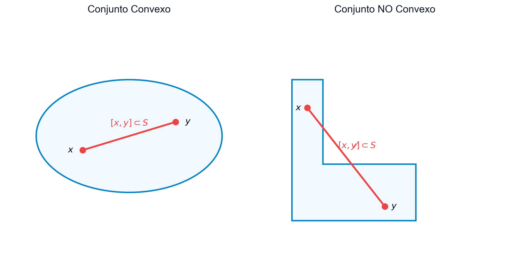{#fig-conjuntos-convexos fig-align="center" width="80%"}

Esta noción geométrica de segmento se puede generalizar a conjuntos de múltiples puntos a través de diferentes clases de combinaciones algebraicas, cuyas propiedades estructuran el espacio lineal. Decimos que un punto $x \in \mathbb{R}^n$ es una **combinación lineal convexa** de un conjunto finito de puntos $\{x_1, \dots, x_k\} \subset \mathbb{R}^n$ si puede expresarse de la forma:
$$ x = \sum_{i=1}^k \lambda_i x_i \quad \text{con} \quad \lambda_i \ge 0 \quad \text{y} \quad \sum_{i=1}^k \lambda_i = 1 $$

Si eliminamos la condición de no negatividad de los coeficientes, exigiendo únicamente que sumen uno ($\lambda_i \in \mathbb{R}$ con $\sum_{i=1}^k \lambda_i = 1$), obtenemos una **combinación afín**, la cual genera subespacios afines como rectas o planos. Por otro lado, si exigimos únicamente la no negatividad de los coeficientes pero no que sumen uno ($\lambda_i \ge 0$), se define una **combinación cónica**, responsable de generar conos convexos. Finalmente, si eliminamos ambas restricciones permitiendo cualquier $\lambda_i \in \mathbb{R}$, recuperamos la noción de **combinación lineal** ordinaria, que da origen a los subespacios vectoriales tradicionales.

::: {.callout-tip title="Ejemplos: Conjuntos convexos básicos" collapse="true"}
A continuación se presentan algunas de las estructuras convexas más elementales y recurrentes en optimización:

*   **Hiperplano**: Dado un vector normal no nulo $p \in \mathbb{R}^n$ y un escalar $\alpha \in \mathbb{R}$, representa una superficie plana de dimensión $n-1$ definida por:
    $$ \mathcal{H} = \{ x \in \mathbb{R}^n \mid p^T x = \alpha \} $$
*   **Semiespacio Cerrado**: Representa la región del espacio situada en uno de los lados de un hiperplano:
    $$ \mathcal{H}^- = \{ x \in \mathbb{R}^n \mid p^T x \le \alpha \} $$
*   **Poliedro o Politopo Convexo**: La intersección de un número finito de semiespacios cerrados, dada por:
    $$ \mathcal{P} = \{ x \in \mathbb{R}^n \mid A x \le b \} $$
    Esta estructura constituye la región factible típica de los problemas de programación lineal. Sus esquinas o vértices se denominan **puntos extremos**.
*   **Bola Métrica**: Una bola cerrada en $\mathbb{R}^n$ con centro en $x_0$ y radio $r \ge 0$ definida bajo cualquier norma $\|\cdot\|$:
    $$ \mathcal{B}_r(x_0) = \{ x \in \mathbb{R}^n \mid \|x - x_0\| \le r \} $$
:::

Para poder operar y construir geometrías más complejas, es fundamental conocer las operaciones algebraicas y conjuntistas que preservan la propiedad de convexidad.

::: {.callout-note title="Lema: Conservación de la convexidad"}
Sean $\mathcal{S}_1$ y $\mathcal{S}_2$ dos conjuntos convexos en $\mathbb{R}^n$. Las siguientes estructuras también son conjuntos convexos:

1.  **Intersección**:
    $$ \mathcal{S}_1 \cap \mathcal{S}_2 $$
    (Esta propiedad se extiende a la intersección de una familia infinita o arbitraria de conjuntos convexos).
2.  **Suma Directa**:
    $$ \mathcal{S}_1 \oplus \mathcal{S}_2 = \{ x_1 + x_2 \mid x_1 \in \mathcal{S}_1, \ x_2 \in \mathcal{S}_2 \} $$
3.  **Diferencia Directa**:
    $$ \mathcal{S}_1 \ominus \mathcal{S}_2 = \{ x_1 - x_2 \mid x_1 \in \mathcal{S}_1, \ x_2 \in \mathcal{S}_2 \} $$

*Demostración*:
1.  **Intersección**: Sean $x, y \in \mathcal{S}_1 \cap \mathcal{S}_2$ y $\lambda \in (0, 1)$. Como $x, y \in \mathcal{S}_1$ y $\mathcal{S}_1$ es convexo, entonces $\lambda x + (1-\lambda)y \in \mathcal{S}_1$. Igualmente, como $x, y \in \mathcal{S}_2$ y $\mathcal{S}_2$ es convexo, $\lambda x + (1-\lambda)y \in \mathcal{S}_2$. Por tanto, el punto intermedio pertenece a la intersección.
2.  **Suma Directa**: Sean $z_1, z_2 \in \mathcal{S}_1 \oplus \mathcal{S}_2$.  Entonces $z_1 = x_1 + y_1$ y $z_2 = x_2 + y_2$ para ciertos $x_1, x_2 \in \mathcal{S}_1$ e $y_1, y_2 \in \mathcal{S}_2$. Para cualquier $\lambda \in (0, 1)$:
    $$ \lambda z_1 + (1-\lambda)z_2 = (\lambda x_1 + (1-\lambda)x_2) + (\lambda y_1 + (1-\lambda)y_2) $$
    Por la convexidad de $\mathcal{S}_1$ y $\mathcal{S}_2$, el primer sumando pertenece a $\mathcal{S}_1$ y el segundo a $\mathcal{S}_2$. Por tanto, la combinación pertenece a $\mathcal{S}_1 \oplus \mathcal{S}_2$.
3.  **Diferencia Directa**: Se demuestra de forma análoga a la suma directa considerando la resta de elementos. $\blacksquare$
:::

### Envoltura convexa y símplices

La envoltura convexa es una construcción matemática fundamental que permite obtener el conjunto convexo más pequeño posible que contiene a un conjunto de puntos arbitrario. Intuitivamente, se puede imaginar como el contorno que formaría una banda elástica si se tensara alrededor de un conjunto de clavos clavados en una tabla, tal y como se ilustra en la @fig-envoltura-convexa.

Definimos formalmente la **envoltura convexa** $\mathcal{H}(\mathcal{S})$ de un conjunto $\mathcal{S}$ como el conjunto formado por todas las combinaciones lineales convexas posibles de puntos pertenecientes a $\mathcal{S}$:
$$ \mathcal{H}(\mathcal{S}) = \left\{ x = \sum_{j=1}^k \lambda_j x_j \;\middle|\; x_j \in \mathcal{S}, \ \lambda_j \ge 0, \ \sum_{j=1}^k \lambda_j = 1 \right\} $$

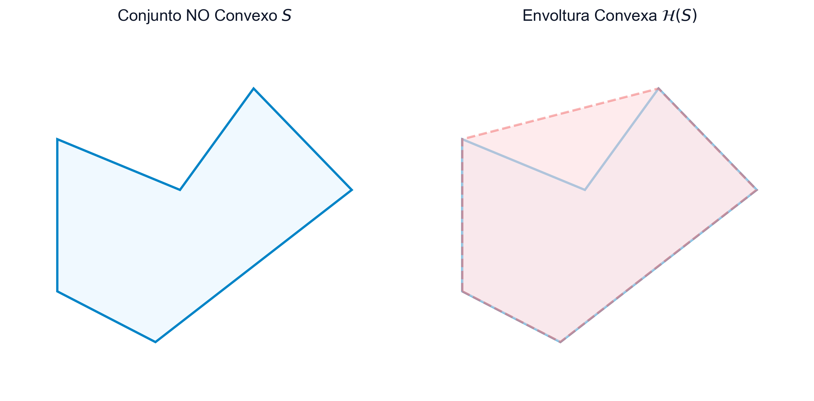{#fig-envoltura-convexa fig-align="center" width="80%"}

::: {.callout-important title="Teorema: Minimalidad de la envoltura convexa"}
La envoltura convexa $\mathcal{H}(\mathcal{S})$ es el menor conjunto convexo que contiene al conjunto $\mathcal{S}$.

*Demostración*:
Sea $\mathcal{C}$ any conjunto convexo que contiene a $\mathcal{S}$ (es decir, $\mathcal{S} \subseteq \mathcal{C}$). Supongamos por reducción al absurdo que existe un punto $x \in \mathcal{H}(\mathcal{S})$ tal que $x \notin \mathcal{C}$. Como $x \in \mathcal{H}(\mathcal{S})$, se puede escribir como una combinación lineal convexa $x = \sum_{j=1}^k \lambda_j x_j$ donde cada $x_j \in \mathcal{S}$. Dado que $\mathcal{S} \subseteq \mathcal{C}$, se deduce que todos los puntos generadores $x_j$ pertenecen a $\mathcal{C}$. Como $\mathcal{C}$ es convexo por hipótesis, cualquier combinación lineal convexa de sus elementos debe pertenecer a él, lo que obliga a que $x \in \mathcal{C}$, contradiciendo la suposición inicial. $\blacksquare$
:::

Cuando limitamos la generación a conjuntos de puntos con propiedades de independencia afín, entramos en la categoría de los símplices y politopos convexos. Un **politopo convexo** es el conjunto obtenido mediante la envoltura convexa de un número finito de puntos en $\mathbb{R}^n$. Si estos puntos de generación son afínmente independientes, el politopo se denomina **símplex (o simplex)**. En particular, un símplex en $\mathbb{R}^1$ corresponde a un segmento cerrado, en $\mathbb{R}^2$ a un triángulo y en $\mathbb{R}^3$ a un tetraedro, tal y como se ilustra en la @fig-politopo-simplex.

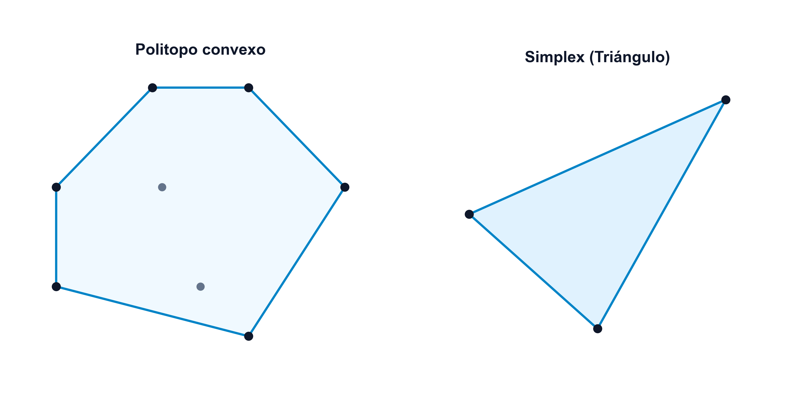{#fig-politopo-simplex fig-align="center" width="80%"}

### Puntos extremos y optimización en poliedros {#sec-puntos-extremos}

Para conjuntos convexos generales, y en particular para poliedros, es de vital importancia identificar aquellos puntos frontera singulares que no pueden expresarse como combinaciones intermedias de otros. Un **punto extremo** es aquel elemento $x$ perteneciente a un conjunto convexo $\mathcal{S}$ que no puede expresarse como una combinación lineal convexa de otros dos puntos distintos del conjunto. Es decir, no existe ningún par de puntos distintos $x_1, x_2 \in \mathcal{S}$ (ambos diferentes de $x$) y ningún parámetro $\lambda \in (0, 1)$ tales que:
$$ x = \lambda x_1 + (1-\lambda)x_2 $$
En el contexto de los poliedros, los puntos extremos coinciden exactamente con la noción geométrica de *vértices*.

::: {.callout-important title="Teorema: Maximización en poliedros" #maximiza-poliedro}
Sea $f: \mathbb{R}^n \to \mathbb{R}$ una función convexa y sea $\mathcal{S}$ un poliedro compacto (cerrado y acotado) no vacío en $\mathbb{R}^n$. Entonces, el problema de maximizar $f(x)$ sujeto a $x \in \mathcal{S}$ alcanza su óptimo global en al menos uno de los puntos extremos de $\mathcal{S}$.

*Demostración*:
Dado que $f$ es convexa en un dominio compacto $\mathcal{S}$, es continua en dicho dominio. Por el Teorema de Weierstrass, existe un punto $x' \in \mathcal{S}$ donde $f$ alcanza su máximo global.

Por el Teorema de Representación de Minkowski-Weyl, todo punto de un poliedro compacto $\mathcal{S}$ se puede expresar como una combinación lineal convexa de sus puntos extremos $\{x_1, \dots, x_k\}$:
$$ x' = \sum_{j=1}^k \lambda_j x_j, \qquad \text{con } \lambda_j \ge 0, \quad \sum_{j=1}^k \lambda_j = 1 $$
Aplicando la propiedad de convexidad de $f$ (generalizada por la desigualdad de Jensen):
$$ f(x') = f\left(\sum_{j=1}^k \lambda_j x_j\right) \le \sum_{j=1}^k \lambda_j f(x_j) $$
Por otro lado, como $x'$ es el punto que maximiza $f$ en $\mathcal{S}$, tenemos que $f(x') \ge f(x_j)$ para todo $j = 1, \dots, k$. Al multiplicar estas desigualdades por $\lambda_j \ge 0$ y sumarlas:
$$ f(x') = \sum_{j=1}^k \lambda_j f(x') \ge \sum_{j=1}^k \lambda_j f(x_j) $$
Por tanto, de las dos inecuaciones anteriores se concluye la igualdad estricta:
$$ f(x') = \sum_{j=1}^k \lambda_j f(x_j) $$
Esto solo es posible si $f(x') = f(x_j)$ para todo índice $j$ tal que $\lambda_j > 0$. En consecuencia, el valor máximo de la función se alcanza en los puntos extremos correspondientes. $\blacksquare$
:::

## Funciones convexas

El concepto de función convexa constituye uno de los pilares de la optimización moderna. A diferencia de las funciones lineales, que describen comportamientos planos o de tasa constante, las funciones convexas capturan analíticamente la estructura de un cuenco o superficie curvada hacia arriba. Esta propiedad geométrica garantiza que cualquier interpolación lineal entre dos puntos de la función siempre sobreestimará (o igualará) el valor real de la misma.

Formalmente, la definición analítica de convexidad se establece de la siguiente manera:

Consideremos un conjunto convexo no vacío $\mathcal{S} \subseteq \mathbb{R}^n$. Decimos que una función $f: \mathcal{S} \to \mathbb{R}$ es **convexa** si, para todo par de puntos $x_1, x_2 \in \mathcal{S}$ y cualquier parámetro de ponderación $\lambda \in (0, 1)$, se verifica la inecuación:
$$ f(\lambda x_1 + (1 - \lambda) x_2) \le \lambda f(x_1) + (1 - \lambda) f(x_2) $$
Si esta inecuación se cumple con desigualdad estricta ($<$) para cualquier par de puntos factibles distintos $x_1 \neq x_2$, decimos que la función $f$ es **estrictamente convexa**. Por otro lado, la función $f$ es **cóncava** si su opuesta $-f$ es una función convexa.

Geométricamente, esta definición establece que el segmento de cuerda (o secante) que une los puntos de la gráfica $(x_1, f(x_1))$ y $(x_2, f(x_2))$ queda situado por encima o sobre la propia curva de la función en dicho intervalo, tal y como se ilustra en la @fig-funciones-convexidad-concepto.

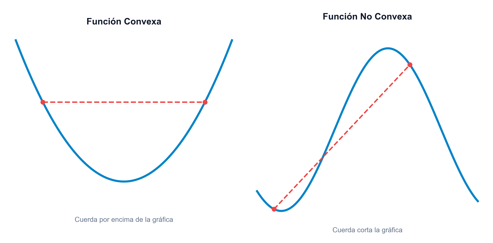{#fig-funciones-convexidad-concepto fig-align="center" width="80%"}

Más allá de su interpretación geométrica, una propiedad teórica de gran alcance para las funciones convexas es que la regularidad algebraica de la desigualdad de convexidad impone de forma automática la continuidad de la función en casi todo su dominio, sin necesidad de exigir diferenciabilidad previa.

::: {.callout-important title="Teorema: Continuidad de las funciones convexas"}
Sea $f : \mathcal{S} \to \mathbb{R}$ una función convexa, con $\mathcal{S}$ un conjunto convexo no vacío de $\mathbb{R}^n$. Entonces, $f$ es continua en el interior de $\mathcal{S}$ ($\text{int }\mathcal{S}$).

*Demostración*: Véase [@bazaraa2013nonlinear, Capítulo 3].
:::

Es fundamental destacar que la propiedad de continuidad se restringe estrictamente al **interior** de $\mathcal{S}$. En la frontera del conjunto factible, una función convexa puede presentar discontinuidades. Como ejemplo ilustrativo, consideremos la función convexa definida en el intervalo cerrado $\mathcal{S} = [0, 1]$ dada por:
$$ f(x) = \begin{cases} x^2 & \text{si } x \in (0, 1) \\ 1 & \text{si } x = 0 \text{ o } x = 1 \end{cases} $$
Esta función es convexa en todo el intervalo $\mathcal{S}$, pero presenta discontinuidades evidentes en los puntos frontera $x = 0$ y $x = 1$.

### Operaciones que preservan la convexidad de funciones

Para construir funciones convexas más complejas o verificar la convexidad de expresiones algebraicas complicadas, no siempre es necesario recurrir a la definición básica de convexidad o evaluar las derivadas. En su lugar, podemos aplicar una serie de reglas y operaciones algebraicas fundamentales que conservan de manera intrínseca la convexidad:

*   **Suma ponderada positiva**: Si $f_1, \dots, f_k$ son funciones convexas y los coeficientes $\alpha_1, \dots, \alpha_k \ge 0$ son no negativos, entonces la combinación lineal ponderada $\sum_j \alpha_j f_j$ también es una función convexa.
*   **Supremo puntual (Máximo)**: Si $f_1, \dots, f_k$ son funciones convexas, la función envoltura superior definida por el máximo puntual $f(x) = \max_{j} \{f_j(x)\}$ es convexa.
*   **Composición afín**: Si $g: \mathbb{R}^m \to \mathbb{R}$ es una función activa y convexa y $h(x) = A x + b$ es una transformación afín, entonces la función compuesta $f(x) = g(A x + b)$ es convexa.
*   **Inversa de una función cóncava**: Si $g: \mathbb{R}^n \to \mathbb{R}$ es una función cóncava, entonces su inversa recíproca $f(x) = \frac{1}{g(x)}$ es una función convexa sobre el dominio restringido $\mathcal{S} = \{x \in \mathbb{R}^n \mid g(x) > 0\}$.
*   **Composición general (no decreciente)**: Si $g: \mathbb{R} \to \mathbb{R}$ es una función convexa y no decreciente, y $h: \mathbb{R}^n \to \mathbb{R}$ es una función convexa, entonces la función compuesta $f(x) = g(h(x))$ es convexa.

::: {.callout-important title="Teorema: Convexidad de los conjuntos de nivel"}
Sea $f: \mathcal{S} \to \mathbb{R}$ una función convexa sobre un dominio convexo $\mathcal{S}$. Para cualquier constante $\alpha \in \mathbb{R}$, el conjunto de nivel inferior:
$$ \mathcal{S}_\alpha = \{ x \in \mathcal{S} \mid f(x) \le \alpha \} $$
es un conjunto convexo.

*Demostración*:
Sean $x_1, x_2 \in \mathcal{S}_\alpha$. Por definición del conjunto de nivel, se cumple que $f(x_1) \le \alpha$ y $f(x_2) \le \alpha$. Sea $\lambda \in (0, 1)$. Como el dominio $\mathcal{S}$ es convexo, el punto intermedio $\lambda x_1 + (1 - \lambda) x_2$ pertenece a $\mathcal{S}$. Aplicando la definición de convexidad de $f$:
$$ f(\lambda x_1 + (1 - \lambda) x_2) \le \lambda f(x_1) + (1 - \lambda) f(x_2) \le \lambda \alpha + (1 - \lambda) \alpha = \alpha $$
Por tanto, $\lambda x_1 + (1 - \lambda) x_2 \in \mathcal{S}_\alpha$, lo que demuestra la convexidad del conjunto de nivel. $\blacksquare$
:::

El comportamiento geométrico de estos conjuntos de nivel inferior se visualiza en la @fig-funciones-niveles-convexos. Como se observa, en el caso de una función convexa (izquierda), el conjunto de nivel inferior constituye un intervalo continuo y, por tanto, convexo en el plano. Por el contrario, en una función no convexa (derecha), dicho conjunto puede fragmentarse en la unión de intervalos disjuntos no convexos, rompiendo la propiedad conjuntista fundamental.

{#fig-funciones-niveles-convexos fig-align="center" width="85%"}

::: {.callout-warning title="Nota: El recíproco del teorema no es cierto"}
El recíproco de este teorema no es cierto en general. Una función que posee conjuntos de nivel inferior convexos no es necesariamente una función convexa (esta propiedad estructural define la clase más general de las funciones cuasi-convexas, como veremos más adelante).
:::

### Epigrafo e hipografo

Para profundizar en el estudio analítico de las funciones convexas, resulta muy provechoso vincular la estructura de la función con la geometría de los conjuntos convexos. Esto se logra mediante el estudio de las regiones geométricas que quedan por encima o por debajo de la gráfica de la función. El **epigrafo** de una función $f$ (denotado por $\text{epi } f$) es el conjunto de puntos en el espacio $\mathbb{R}^{n+1}$ situados sobre o por encima de su gráfica:
$$ \text{epi } f = \{ (x, y) \in \mathcal{S} \times \mathbb{R} \mid y \ge f(x) \} $$
De forma complementaria, el **hipografo** (denotado por $\text{hyp } f$) es el conjunto de puntos en el espacio $\mathbb{R}^{n+1}$ situados bajo o por debajo de la gráfica de la función $f$:
$$ \text{hyp } f = \{ (x, y) \in \mathcal{S} \times \mathbb{R} \mid y \le f(x) \} $$

La comparación tridimensional entre el epigrafo de una función convexa y el hipografo de una cóncava se ilustra en la @fig-epigrafo-hipografo-3d.

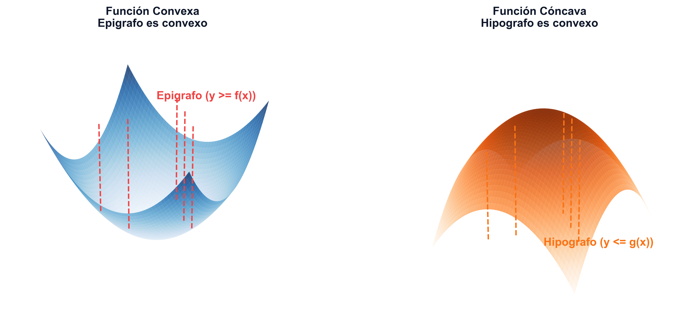{#fig-epigrafo-hipografo-3d fig-align="center" width="90%"}

::: {.callout-important title="Teorema: Relación entre epigrafo y convexidad"}
Una función $f: \mathcal{S} \to \mathbb{R}$ es convexa si y solo si su epigrafo $\text{epi } f$ es un conjunto convexo en $\mathbb{R}^{n+1}$.

*Demostración*:
$(\Longrightarrow)$ Supongamos que $f$ es convexa. Sean $(x_1, y_1), (x_2, y_2) \in \text{epi } f$ y $\lambda \in (0, 1)$. Por definición de epigrafo, $y_1 \ge f(x_1)$ y $y_2 \ge f(x_2)$. Evaluando la combinación lineal:
$$ \lambda y_1 + (1 - \lambda) y_2 \ge \lambda f(x_1) + (1 - \lambda) f(x_2) \ge f(\lambda x_1 + (1 - \lambda) x_2) $$
Como $\mathcal{S}$ es convexo, el punto combinado pertenece a $\mathcal{S}$, y el par combinado pertenece a $\text{epi } f$, demostrando su convexidad.

$(\Longleftarrow)$ Supongamos que $\text{epi } f$ es un conjunto convexo. Sean $x_1, x_2 \in \mathcal{S}$. Los puntos $(x_1, f(x_1))$ y $(x_2, f(x_2))$ pertenecen a $\text{epi } f$. Por convexidad del epigrafo, para todo $\lambda \in (0, 1)$:
$$ \lambda (x_1, f(x_1)) + (1 - \lambda)(x_2, f(x_2)) = (\lambda x_1 + (1 - \lambda) x_2, \lambda f(x_1) + (1 - \lambda) f(x_2)) \in \text{epi } f $$
Lo que implica directamente que $\lambda f(x_1) + (1 - \lambda) f(x_2) \ge f(\lambda x_1 + (1 - \lambda) x_2)$, es decir, $f$ es convexa. $\blacksquare$
:::

Esta equivalencia fundamental resulta sumamente potente, ya que permite trasladar propiedades algebraicas complejas de las funciones al análisis puramente geométrico de los conjuntos convexos. De manera completamente análoga, la convexidad del hipografo caracteriza a las funciones cóncavas: una función $f$ es cóncava si y solo si su hipografo $\text{hyp } f$ es un conjunto convexo en $\mathbb{R}^{n+1}$. De este modo, la curvatura (hacia arriba o hacia abajo) de cualquier función queda codificada de forma unívoca en la geometría del cuerpo que delimita su gráfica.

Cuando trabajamos con funciones no diferenciables (es decir, aquellas que presentan picos o codos en su gráfica), el gradiente clásico deja de existir en ciertos puntos de interés. Para solventar este límite analítico, generalizamos la noción de gradiente a través del concepto de subgradiente.

Un vector $\xi \in \mathbb{R}^n$ es un **subgradiente** de la función convexa $f$ en el punto $x_0 \in \mathcal{S}$ si satisface la desigualdad:
$$ f(x) \ge f(x_0) + \xi^T(x - x_0), \quad \forall x \in \mathcal{S} $$
Geométricamente, el subgradiente representa la pendiente de un hiperplano de soporte que apoya a la función desde abajo en dicho punto. El conjunto formado por todos los subgradientes de $f$ en $x_0$ se denomina **subdiferencial** y se denota por $\partial f(x_0)$.

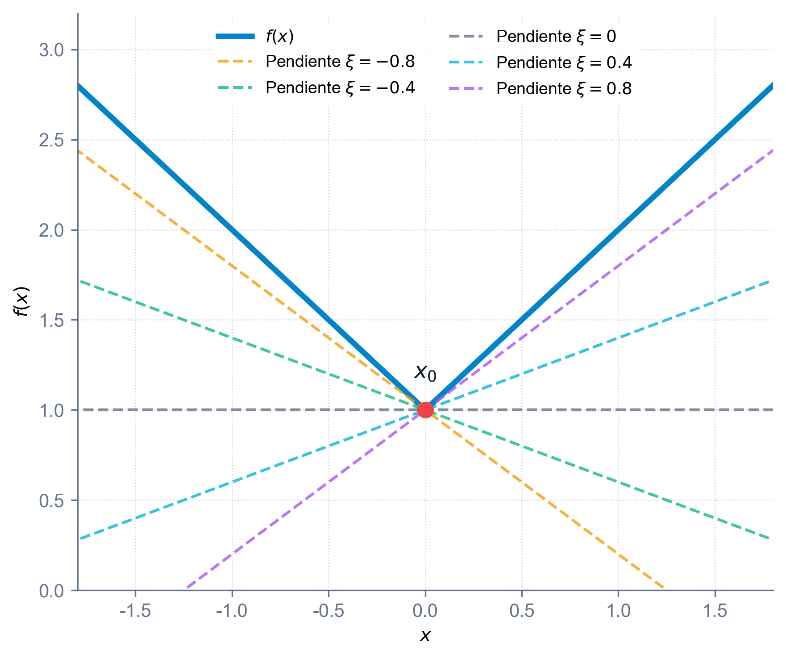{#fig-subgradientes-concepto fig-align="center" width="60%"}

El subdiferencial $\partial f(x_0)$ es siempre un conjunto convexo y cerrado, cuyas propiedades matemáticas se explotan rigurosamente en la optimización no diferenciable [@rockafellar1970convex; @boyd2004convex]. Si la función es diferenciable en un punto $x_0$, el subdiferencial contiene un único elemento que coincide exactamente con el gradiente convencional: $\partial f(x_0) = \{\nabla f(x_0)\}$.

::: {.callout-important title="Teorema: Existencia del subgradiente (hiperplano soporte al epigrafo)"}
Sea $f: \mathcal{S} \to \mathbb{R}$ una función convexa, con $\mathcal{S}$ un conjunto convexo no vacío de $\mathbb{R}^n$. Para cualquier punto interior $x_0 \in \text{int }\mathcal{S}$, existe al menos un subgradiente $\xi \in \mathbb{R}^n$. Esto equivale a decir que el hiperplano:
$$ y = f(x_0) + \xi^T(x - x_0) $$
es un hiperplano de soporte para el epigrafo de $f$, $\text{epi } f$, en el punto frontera $(x_0, f(x_0))$.

*Demostración*:
Por ser $f$ convexa, su epigrafo $\text{epi} f$ es un conjunto convexo en $\mathbb{R}^{n+1}$. Todo conjunto convexo posee asociado un hiperplano de soporte en cada punto de su frontera. El punto $(x_0, f(x_0))$ pertenece a la frontera de $\text{epi } f$ (ya que para cualquier $\epsilon > 0$, el punto $(x_0, f(x_0) - \epsilon) \notin \text{epi } f$ pero $(x_0, f(x_0)) \in \text{epi } f$).

Por consiguiente, existe un vector no nulo $\binom{\xi_0}{\mu} \in \mathbb{R}^{n+1}$ tal que:
$$ \xi_0^T(x - x_0) + \mu (y - f(x_0)) \le 0, \qquad \forall (x, y) \in \text{epi } f $$
En primer lugar, analizando $y \to \infty$ para un $x = x_0$ fijo, para que la desigualdad se mantenga, el escalar $\mu$ debe satisfacer $\mu \le 0$.

Demostremos ahora que $\mu$ debe ser estrictamente negativo ($\mu < 0$). Supongamos por contradicción que $\mu = 0$. En tal caso, la desigualdad anterior se reduce a:
$$ \xi_0^T(x - x_0) \le 0, \qquad \forall x \in \mathcal{S} $$
Como $x_0 \in \text{int }\mathcal{S}$, existe una pequeña bola centrada en $x_0$ contenida en $\mathcal{S}$, lo que permite tomar un punto de la forma $x = x_0 + \lambda \xi_0 \in \mathcal{S}$ para un $\lambda > 0$ suficientemente pequeño. Sustituyendo este punto:
$$ \lambda \xi_0^T \xi_0 \le 0 \implies \|\xi_0\|^2 \le 0 \implies \xi_0 = \mathbf{0} $$
Esto implica que el vector dual normal es $(\xi_0, \mu) = (\mathbf{0}, 0)$, lo cual contradice la hipótesis de que dicho vector es no nulo. Por tanto, $\mu < 0$.

Definimos ahora el vector $\xi = \frac{\xi_0}{|\mu|} = \frac{\xi_0}{-\mu}$. Dividiendo la inecuación original por $|\mu| > 0$:
$$ \xi^T(x - x_0) - y + f(x_0) \le 0, \qquad \forall (x, y) \in \text{epi } f $$
Reordenando, obtenemos:
$$ y \ge f(x_0) + \xi^T(x - x_0), \qquad \forall (x, y) \in \text{epi } f $$
Evaluando esta desigualdad en el punto frontera de la gráfica $y = f(x)$, concluimos que:
$$ f(x) \ge f(x_0) + \xi^T(x - x_0), \qquad \forall x \in \mathcal{S} $$
lo que demuestra que $\xi$ es un subgradiente de $f$ en $x_0$. $\blacksquare$
:::

El teorema anterior garantiza que siempre es posible apoyar una función convexa desde abajo mediante un hiperplano. Cuando la función posee una curvatura estrictamente positiva (es decir, es estrictamente convexa), este apoyo deja de ser plano en cualquier otro punto del dominio y el hiperplano toca a la gráfica únicamente en el punto de tangencia, lo que se formaliza a continuación.

::: {.callout-note title="Corolario: Caso de convexidad estricta"}
Si $f: \mathcal{S} \to \mathbb{R}$ es estrictamente convexa, entonces para cualquier $x_0 \in \text{int }\mathcal{S}$ y cualquier subgradiente $\xi \in \partial f(x_0)$, se verifica la desigualdad estricta:
$$ f(x) > f(x_0) + \xi^T(x - x_0), \quad \forall x \in \mathcal{S}, \ x \neq x_0 $$

*Demostración*:
Por el teorema de existencia, existe un subgradiente $\xi \in \partial f(x_0)$ tal que:
$$ f(x) \ge f(x_0) + \xi^T(x - x_0), \qquad \forall x \in \mathcal{S} $$
Supongamos por contradicción que existe un punto $x_1 \in \mathcal{S}$, $x_1 \neq x_0$, donde se alcanza la igualdad:
$$ f(x_1) = f(x_0) + \xi^T(x_1 - x_0) $$
Por la definición de convexidad estricta de $f$, para cualquier $\lambda \in (0, 1)$:
$$ f(\lambda x_0 + (1-\lambda)x_1) < \lambda f(x_0) + (1-\lambda)f(x_1) $$
Sustituyendo el valor de $f(x_1)$ en el miembro de la derecha:
$$ f(\lambda x_0 + (1-\lambda)x_1) < \lambda f(x_0) + (1-\lambda)[f(x_0) + \xi^T(x_1 - x_0)] = f(x_0) + (1-\lambda)\xi^T(x_1 - x_0) $$
Por otra parte, evaluando la inecuación del subgradiente original en el punto $x = \lambda x_0 + (1-\lambda)x_1$:
$$ f(\lambda x_0 + (1-\lambda)x_1) \ge f(x_0) + \xi^T[\lambda x_0 + (1-\lambda)x_1 - x_0] = f(x_0) + (1-\lambda)\xi^T(x_1 - x_0) $$
Las dos desigualdades anteriores son contradictorias, lo que concluye que no puede darse la igualdad para ningún punto $x_1 \neq x_0$. $\blacksquare$
:::

Hasta el momento hemos deducido que la convexidad implica la existencia de subgradientes que acotan inferiormente a la función. Un resultado de enorme relevancia práctica es que esta relación es bidireccional: la existencia de un vector de soporte inferior en cada punto del dominio es suficiente para asegurar que la función es convexa, lo cual permite verificar la convexidad de forma local.

::: {.callout-important title="Teorema: Suficiencia de la caracterización por subgradientes"}
Sea $\mathcal{S}$ un conjunto convexo abierto no vacío de $\mathbb{R}^n$ y sea $f: \mathcal{S} \to \mathbb{R}$ una función. Si para cada punto $x_0 \in \mathcal{S}$ existe un vector $\xi \in \mathbb{R}^n$ tal que:
$$ f(x) \ge f(x_0) + \xi^T(x - x_0), \quad \forall x \in \mathcal{S} $$
entonces la función $f$ es convexa en $\mathcal{S}$.

*Demostración*:
Sean $x_1, x_2 \in \mathcal{S}$ y $\lambda \in (0, 1)$. Definimos el punto intermedio $x_0 = \lambda x_1 + (1-\lambda)x_2$. Como $\mathcal{S}$ es convexo y abierto, $x_0 \in \mathcal{S}$. Por hipótesis, existe un subgradiente $\xi$ en $x_0$, tal que:
$$ f(x) \ge f(x_0) + \xi^T(x - x_0), \quad \forall x \in \mathcal{S} $$
Evaluando esta desigualdad en $x = x_1$ y multiplicándola por $\lambda$:
$$ \lambda f(x_1) \ge \lambda f(x_0) + \lambda \xi^T(x_1 - x_0) $$
Evaluando la desigualdad en $x = x_2$ y multiplicándola por $(1-\lambda)$:
$$ (1-\lambda) f(x_2) \ge (1-\lambda) f(x_0) + (1-\lambda) \xi^T(x_2 - x_0) $$
Sumando ambas expresiones:
$$ \lambda f(x_1) + (1-\lambda) f(x_2) \ge [\lambda + (1-\lambda)]f(x_0) + \xi^T \left[ \lambda (x_1 - x_0) + (1-\lambda)(x_2 - x_0) \right] $$
Analizando el término dentro del producto escalar:
$$ \lambda(x_1 - x_0) + (1-\lambda)(x_2 - x_0) = \lambda x_1 + (1-\lambda)x_2 - [\lambda + (1-\lambda)]x_0 = x_0 - x_0 = 0 $$
Por tanto, el producto escalar se anula y obtenemos:
$$ \lambda f(x_1) + (1-\lambda) f(x_2) \ge f(x_0) = f(\lambda x_1 + (1-\lambda)x_2) $$
lo que demuestra que $f$ es convexa. $\blacksquare$
:::

Para poder aplicar estas caracterizaciones en la resolución de problemas reales, es necesario disponer de un álgebra que permita calcular el subdiferencial de funciones complejas construidas a partir de funciones más simples. Las siguientes propiedades establecen las reglas operativas básicas del subdiferencial, de forma homóloga al cálculo diferencial clásico.

::: {.callout-note title="Propiedades y cálculo del subdiferencial"}
El cálculo con subgradientes sigue reglas análogas al cálculo diferencial estándar:

1.  **Regla de la Suma**:
    Si $f_1, f_2$ son funciones convexas, el subdiferencial de su suma cumple:
    $$ \partial (f_1(x) + f_2(x)) = \partial f_1(x) \oplus \partial f_2(x) $$
2.  **Multiplicación Escalar**:
    Para cualquier constante $\alpha \ge 0$:
    $$ \partial (\alpha f(x)) = \alpha \partial f(x) $$
3.  **Máximo de Funciones**:
    Si $f(x) = \max \{f_1(x), f_2(x)\}$ con $f_1, f_2$ convexas:
    $$ \partial f(x) = \mathcal{H}(\cup_{i \in \mathcal{I}(x)} \partial f_i(x)) $$
    donde $\mathcal{I}(x)$ es el conjunto de índices de las funciones que alcanzan el máximo en el punto $x$.
:::

Para ilustrar de forma práctica la aplicación de las reglas algebraicas del subdiferencial y el papel geométrico del subgradiente (como plano o recta soporte inferior), a continuación se exponen detalladamente dos casos de estudio de referencia. El primero analiza de manera exhaustiva el comportamiento de una función valor absoluto no suave en una dimensión, mostrando cómo el subdiferencial se ensancha en los puntos de no diferenciabilidad. El segundo caso extiende esta noción a una función multivariable diferenciable en dos dimensiones, calculando la ecuación explícita del plano soporte en $\mathbb{R}^3$.

::: {.callout-tip title="Ejemplos: Cálculo y aplicación del subdiferencial en 1D y 2D" collapse="true"}

**Caso 1D: Función no diferenciable definida por tramos**

Consideremos una función convexa clásica definida por tramos:
$$ f(x) = \max \{ |x| - 4, \ (x - 2)^2 - 4 \} $$
Esta función puede simplificarse en distintas regiones analizando cuál de las dos curvas domina en cada intervalo (dado que la parábola y la función valor absoluto se cruzan en $x = 1$ y $x = 4$):
$$ f(x) = \begin{cases} x - 4 & \text{si } 1 \le x \le 4 \\ (x - 2)^2 - 4 & \text{en otro caso} \end{cases} $$

Analicemos su subdiferencial $\partial f(x_0)$ en diferentes puntos de la recta real:

En un **punto diferenciable en el tramo lineal** (por ejemplo, $x_0 = 2$), la función es puramente lineal y coincide con la recta $x - 4$. Su derivada clásica es constante e igual a $f'(2) = 1$. Al ser diferenciable, el subdiferencial consta de un único vector:
$$ \partial f(2) = \{1\} $$
La recta tangente soporte es $y = -2 + 1(x - 2) = x - 4$.

En un **punto diferenciable en el tramo cuadrático** (por ejemplo, $x_0 = 5$), para valores superiores a 4, la función coincide con la parábola $(x-2)^2 - 4$. Su derivada clásica en este punto es $f'(5) = 2(5 - 2) = 6$. Por tanto, el subdiferencial contiene únicamente a esta pendiente:
$$ \partial f(5) = \{6\} $$
La recta tangente soporte es $y = 5 + 6(x - 5) = 6x - 25$.

En un **punto singular o codo** (en $x_0 = 1$), confluyen la parábola (por la izquierda) y la recta (por la derecha). La derivada lateral izquierda (cuadrática) es $f'_{-}(1) = 2(1-2) = -2$, y la derivada lateral derecha (lineal) es $f'_{+}(1) = 1$. El subdiferencial en este codo está formado por toda la familia de pendientes intermedias (es decir, la combinación convexa de las derivadas laterales):
$$ \partial f(1) = [-2, 1] $$
Cualquier línea que pase por $(1, -3)$ con pendiente $\xi \in [-2, 1]$ apoyará a la función desde abajo (como la línea horizontal de pendiente $\xi = 0$).

En un **punto singular o codo** (en $x_0 = 4$), de manera análoga, la derivada lateral izquierda (lineal) es $f'_{-}(4) = 1$, y la derivada lateral derecha (cuadrática) es $f'_{+}(4) = 2(4-2) = 4$. El subdiferencial es el intervalo:
$$ \partial f(4) = [1, 4] $$

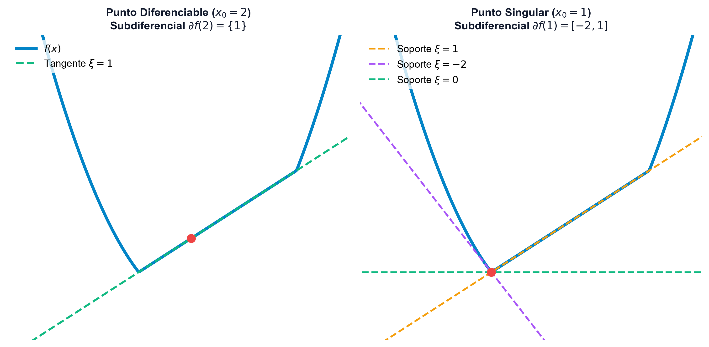{#fig-subgradientes-ejemplo-completo fig-align="center" width="85%"}

**Caso 2D: Función cuadrática diferenciable y plano soporte**

Para ilustrar cómo se comporta el subdiferencial y el hiperplano soporte en una dimensión superior, consideremos la función cuadrática diferenciable $f: \mathbb{R}^2 \to \mathbb{R}$ definida por:
$$ f(x, y) = 8x^2 + 3xy + 7y^2 - 25x + 31y - 29 $$

Calculamos su subdiferencial en el punto $x_0 = (10, 10)$. Dado que $f$ es diferenciable en todo su dominio, el subdiferencial es unitario y contiene únicamente al gradiente:
$$ \partial f(10, 10) = \{ \nabla f(10, 10) \} $$

Calculando las derivadas parciales de primer orden:
$$ \frac{\partial f}{\partial x} = 16x + 3y - 25 \implies \frac{\partial f}{\partial x}(10, 10) = 160 + 30 - 25 = 165 $$
$$ \frac{\partial f}{\partial y} = 3x + 14y + 31 \implies \frac{\partial f}{\partial y}(10, 10) = 30 + 140 + 31 = 201 $$

El valor de la función en dicho punto es:
$$ f(10, 10) = 8(100) + 3(100) + 7(100) - 250 + 310 - 29 = 1831 $$

Por tanto, el único subgradiente de la función en $(10, 10)$ es el vector gradiente $\xi = \nabla f(10, 10) = (165, 201)^T$. El plano soporte tangente en 3D que acota inferiormente a la función viene definido por el hiperplano:
$$ z = 1831 + 165(x - 10) + 201(y - 10) $$

De acuerdo con el teorema de existencia, la convexidad de $f$ garantiza de forma global que:
$$ 8x^2 + 3xy + 7y^2 - 25x + 31y - 29 \ge 1831 + 165(x - 10) + 201(y - 10), \quad \forall (x, y) \in \mathbb{R}^2 $$

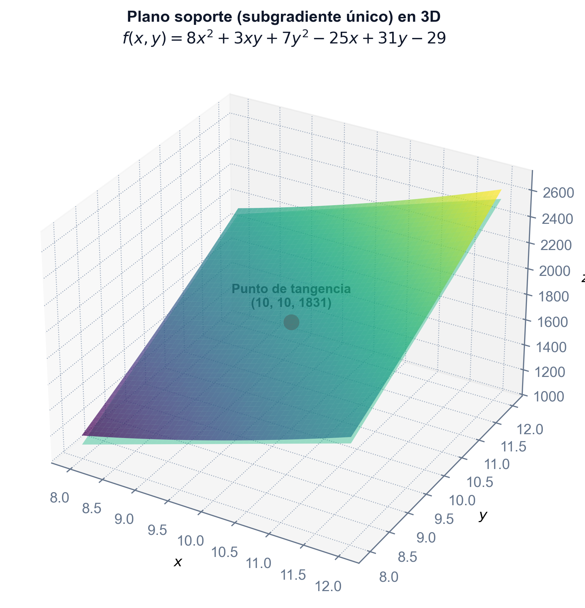{#fig-subgradiente-3d fig-align="center" width="70%"}
:::

## Caracterización de funciones convexas diferenciables

Aunque las definiciones geométricas basadas en epigrafos o combinaciones lineales de puntos son conceptualmente intuitivas, en la práctica matemática y algorítmica resulta muy costoso verificar la convexidad de una función directamente a partir de ellas. Cuando la función posee propiedades de suavidad, es decir, es diferenciable (una o dos veces), es posible explotar la información local proporcionada por sus derivadas para establecer criterios de convexidad globales más sencillos de evaluar. En esta sección se abordan los resultados fundamentales que conectan el gradiente y la matriz hessiana con la geometría convexa.

::: {.callout-important title="Teorema: Caracterización de primer orden para funciones diferenciables"}
Sea $f: \mathcal{S} \to \mathbb{R}$ una función diferenciable en un conjunto convexo y abierto $\mathcal{S}$.

1.  $f$ es convexa si y solo si:
    $$ f(x) \ge f(x_0) + \nabla f(x_0)^T (x - x_0), \quad \forall x, x_0 \in \mathcal{S} $$
2.  $f$ es estrictamente convexa si y solo si:
    $$ f(x) > f(x_0) + \nabla f(x_0)^T (x - x_0), \quad \forall x, x_0 \in \mathcal{S} \text{ con } x \neq x_0 $$
:::

*Significado geométrico*: La aproximación lineal de primer orden (plano tangente en cualquier punto $x_0$) es un estimador inferior global de la función. Es decir, la gráfica de la función se apoya en su totalidad sobre el plano tangente.

La caracterización de primer orden anterior establece que una función convexa siempre crece más rápido (o igual) que su aproximación lineal tangente. Esta propiedad tiene una consecuencia directa sobre el comportamiento de sus gradientes: a medida que nos desplazamos por el dominio, el gradiente debe variar de forma que siempre apunte en direcciones de crecimiento. Esto da lugar a la noción de monotonía del operador gradiente, lo que formaliza algebraicamente la idea de que la pendiente de la función no decrece en ninguna dirección.

::: {.callout-important title="Teorema: Monotonía del gradiente"}
Una función diferenciable $f$ es convexa en un conjunto convexo abierto $\mathcal{S}$ si y solo si su gradiente es un operador monótono:
$$ (\nabla f(x_2) - \nabla f(x_1))^T(x_2 - x_1) \ge 0, \quad \forall x_1, x_2 \in \mathcal{S} $$

*Demostración*:
$(\Longrightarrow)$ Si $f$ es convexa, por la caracterización de primer orden se cumplen simultáneamente:
$$ f(x_1) \ge f(x_2) + \nabla f(x_2)^T (x_1 - x_2) $$
$$ f(x_2) \ge f(x_1) + \nabla f(x_1)^T (x_2 - x_1) $$
Sumando ambas inecuaciones miembro a miembro:
$$ f(x_1) + f(x_2) \ge f(x_2) + f(x_1) + \nabla f(x_2)^T(x_1 - x_2) + \nabla f(x_1)^T(x_2 - x_1) $$
Cancelando términos comunes y reordenando:
$$ 0 \ge (\nabla f(x_1) - \nabla f(x_2))^T (x_2 - x_1) \implies (\nabla f(x_2) - \nabla f(x_1))^T(x_2 - x_1) \ge 0 $$
$(\Longleftarrow)$ Se demuestra de manera análoga aplicando el teorema del valor medio. $\blacksquare$
:::

El análisis del gradiente de primer orden nos proporciona una visión del comportamiento de las pendientes de la función. Sin embargo, para funciones dos veces diferenciables, podemos refinar este análisis estudiando la tasa de variación de las pendientes, es decir, la curvatura de la función. Esto se logra mediante el estudio de la matriz hessiana, cuyas propiedades de definición y semidefinición positiva determinan de forma local si la curvatura es siempre ascendente (convexa), garantizando la convexidad de manera global.

::: {.callout-important title="Teorema: Caracterización de segundo orden"}
Sea $f: \mathcal{S} \to \mathbb{R}$ una función dos veces diferenciable en un conjunto convexo abierto $\mathcal{S}$.

1.  $f$ es convexa si y solo si su matriz hessiana es semidefinida positiva en todo punto de $\mathcal{S}$:
    $$ \nabla^2 f(x) \succeq 0, \quad \forall x \in \mathcal{S} $$
2.  Si la matriz hessiana es definida positiva en todo el dominio ($\nabla^2 f(x) \succ 0, \forall x \in \mathcal{S}$), entonces $f$ es estrictamente convexa.

*Demostración*:

**Demostración de la afirmación 1**:

*Implicación* ($\Longrightarrow$): Supongamos que $f$ es convexa. Sea $x_0 \in \mathcal{S}$ y sea $d \in \mathbb{R}^n$ cualquier dirección. Como $\mathcal{S}$ es abierto, existe un $\lambda \neq 0$ suficientemente pequeño tal que $x_0 + \lambda d \in \mathcal{S}$. Por ser $f$ dos veces diferenciable, su desarrollo de Taylor de segundo orden es:
$$ f(x_0 + \lambda d) = f(x_0) + \lambda \nabla f(x_0)^T d + \frac{1}{2}\lambda^2 d^T \nabla^2 f(x_0) d + \lambda^2 \|d\|^2 \alpha(x_0, \lambda d) $$
donde $\lim_{\lambda \to 0} \alpha(x_0, \lambda d) = 0$. Por otro lado, aplicando la caracterización de primer orden de convexidad:
$$ f(x_0 + \lambda d) \ge f(x_0) + \lambda \nabla f(x_0)^T d $$
Restando la segunda inecuación de la primera:
$$ \frac{1}{2}\lambda^2 d^T \nabla^2 f(x_0) d + \lambda^2 \|d\|^2 \alpha(x_0, \lambda d) \ge 0 $$
Dividiendo por $\lambda^2 > 0$ y tomando el límite cuando $\lambda \to 0$:
$$ d^T \nabla^2 f(x_0) d \ge 0 $$
Puesto que esta forma cuadrática es no negativa para cualquier dirección $d \in \mathbb{R}^n$, la matriz hessiana $\nabla^2 f(x_0)$ es semidefinida positiva.

*Implicación* ($\Longleftarrow$): Supongamos que la hessiana es semidefinida positiva en todo $\mathcal{S}$. Sean $x_1, x_2 \in \mathcal{S}$. Por el Teorema del Valor Medio de segundo orden (o desarrollo de Taylor con resto de Lagrange), existe un punto $z$ en el segmento que une $x_1$ y $x_2$ (es decir, $z = \lambda x_1 + (1-\lambda)x_2$ para algún $\lambda \in (0, 1)$) tal que:
$$ f(x_2) = f(x_1) + \nabla f(x_1)^T (x_2 - x_1) + \frac{1}{2}(x_2 - x_1)^T \nabla^2 f(z) (x_2 - x_1) $$
Dado que $\mathcal{S}$ es convexo, $z \in \mathcal{S}$. Como por hipótesis $\nabla^2 f(z) \succeq 0$ es semidefinida positiva, la forma cuadrática del error de segundo orden es no negativa:
$$ (x_2 - x_1)^T \nabla^2 f(z) (x_2 - x_1) \ge 0 $$
Por tanto:
$$ f(x_2) \ge f(x_1) + \nabla f(x_1)^T (x_2 - x_1) $$
Al cumplirse esta desigualdad para todo par de puntos, la caracterización de primer orden garantiza que $f$ es convexa.

**Demostración de la afirmación 2**:

Si $\nabla^2 f(x) \succ 0$ para todo $x \in \mathcal{S}$, un razonamiento análogo al de la implicación ($\Longleftarrow$) sustituyendo el término cuadrático por una desigualdad estricta ($> 0$ para $x_2 \neq x_1$) demuestra que $f$ es estrictamente convexa. $\blacksquare$

*Precisión conceptual sobre la convexidad estricta*:
Es fundamental señalar que, mientras que la hessiana semidefinida positiva es una condición necesaria y suficiente para la convexidad, la hessiana definida positiva ($\nabla^2 f(x) \succ 0$) es una condición **suficiente pero no necesaria** para la convexidad estricta en el caso general.
Como contraejemplo clásico, consideremos la función en una variable:
$$ f(x) = x^4 $$
Esta función es estrictamente convexa en todo $\mathbb{R}$ (su curvatura es estrictamente ascendente a ambos lados). Sin embargo, su segunda derivada en el origen $x_0 = 0$ es:
$$ f''(0) = 12(0)^2 = 0 $$
que es solo semidefinida positiva (nula) y no estrictamente positiva. El recíproco (es decir, que la convexidad estricta implique hessiana definida positiva en todos los puntos) **solo se cumple de forma garantizada si la función es cuadrática** (donde la hessiana es constante).
:::

Para afianzar estos conceptos de segundo orden y comprender las diferencias operativas entre la semidefinición y la definición estricta en espacios de dimensiones superiores, a continuación se presentan varios ejemplos prácticos resueltos detalladamente.

::: {.callout-tip title="Ejemplos de verificación de convexidad con matrices hessianas" collapse="true"}
Analicemos la convexidad de tres funciones de prueba:

-   **Ejemplo 1**:
    $$ f(x_1, x_2, x_3) = x_1 x_2 + 2x_1^2 + x_2^2 + 2x_3^2 - 6x_1 x_3 $$
    La matriz hessiana de esta función cuadrática es constante:
    $$ \nabla^2 f = \begin{pmatrix} 4 & 1 & -6 \\ 1 & 2 & 0 \\ -6 & 0 & 4 \end{pmatrix} $$
    Calculamos los menores principales líderes para aplicar el criterio de Sylvester:
    -   $M_1 = 4 > 0$.
    -   $M_2 = 4 \cdot 2 - 1^2 = 7 > 0$.
    -   $M_3 = \det(\nabla^2 f) = 4(8) - 1(4) - 6(12) = -20 < 0$.
    Al ser el determinante negativo, la matriz es indefinida, por lo que la función no es ni cóncava ni convexa en $\mathbb{R}^3$.
-   **Ejemplo 2**:
    $$ f(x_1, x_2) = 10 - 2(x_2 - x_1^2)^2 $$
    La matriz hessiana es variable y depende del punto:
    $$ \nabla^2 f(x) = \begin{pmatrix} 8x_2 - 24x_1^2 & 8x_1 \\ 8x_1 & -4 \end{pmatrix} $$
    Para que sea cóncava se requiere que su hessiana sea semidefinida negativa en todo el dominio ($\nabla^2 f(x) \preceq 0$), lo que exige que los menores principales líderes alternen su signo:
    -   $M_1 = 8x_2 - 24x_1^2 \le 0$
    -   $M_2 = \det(\nabla^2 f(x)) = -4(8x_2 - 24x_1^2) - 64x_1^2 = 96x_1^2 - 32x_2 \ge 0 \implies x_2 \le 3x_1^2$
    Para que se verifiquen ambas condiciones a la vez, se requiere que los puntos pertenezcan a la región parabólica restringida del plano dada por:
    $$ x_2 \le 3x_1^2 $$
    En cualquier otra parte fuera de esta parábola, la función no es cóncava. Esta curvatura variable puede apreciarse geométricamente en 3D, donde la función presenta una cresta parabólica no lineal.

    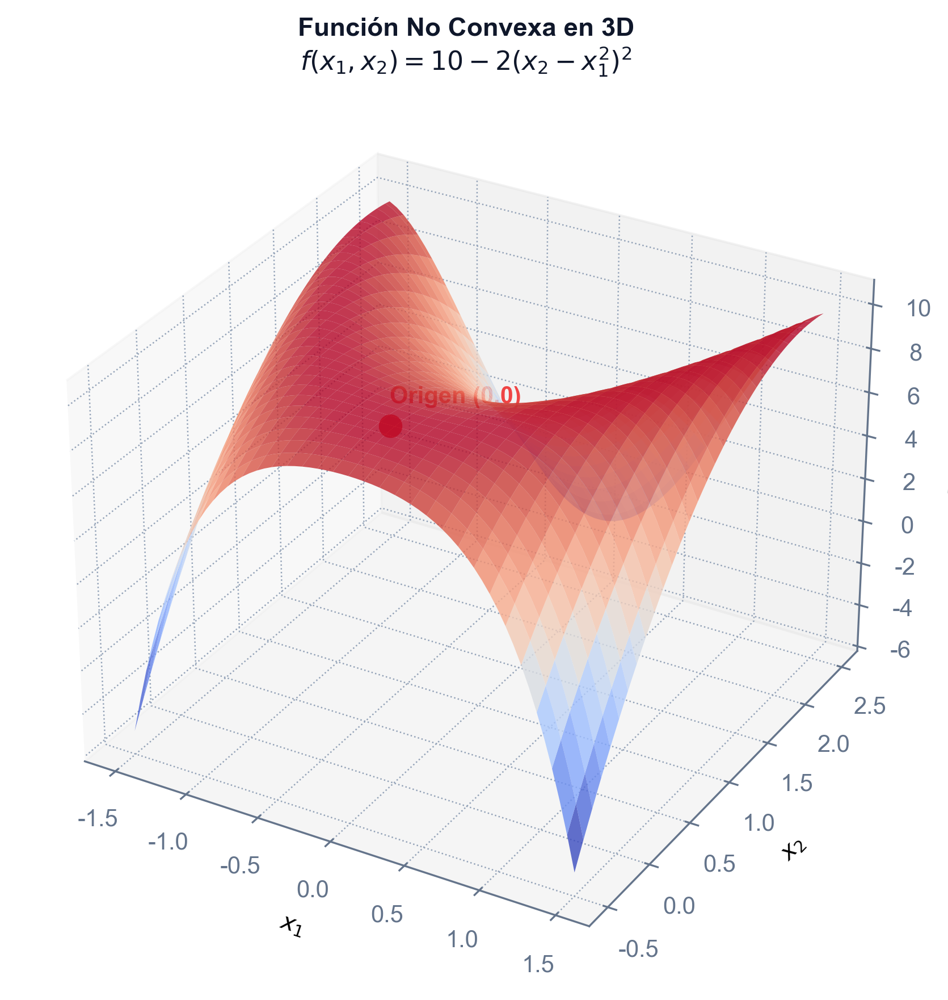{#fig-funcion-no-convexa-3d fig-align="center" width="70%"}

-   **Ejemplo 3**:
    $$ f(x, y, z) = x^2 + 3y^2 + z^2 + xy - 4z - 5x + 14 $$
    Su hessiana es constante:
    $$ \nabla^2 f = \begin{pmatrix} 2 & 1 & 0 \\ 1 & 6 & 0 \\ 0 & 0 & 2 \end{pmatrix} $$
    Menores principales: $M_1 = 2 > 0$, $M_2 = 11 > 0$, $M_3 = 22 > 0$. Al ser definida positiva, la función es estrictamente convexa en todo el espacio.
:::

## Óptimos de una función convexa

La convexidad de una función no es simplemente una propiedad geométrica elegante, sino el pilar fundamental que transforma la resolución de problemas de optimización de una tarea localmente incierta a una globalmente garantizada. En el análisis no convexo general, los algoritmos numéricos pueden quedar atrapados en mínimos locales que no ofrecen información sobre el mejor valor absoluto de la función. En cambio, bajo hipótesis de convexidad, la estructura del espacio asegura que cualquier mínimo local se extienda de forma global, facilitando enormemente la búsqueda de soluciones óptimas.

::: {.callout-important title="Teorema fundamental de la optimización convexa"}
Sea $f: \mathcal{S} \to \mathbb{R}$ una función convexa sobre un conjunto convexo $\mathcal{S}$.

1.  **Cualquier mínimo local de $f$ en $\mathcal{S}$ es también un mínimo global**.
2.  **Si la función $f$ es estrictamente convexa, el mínimo global (si existe) es único**.

*Demostración*:

1.  Sea $x^*$ un mínimo local de $f$ en $\mathcal{S}$. Por definición, existe un radio $\epsilon > 0$ tal que $f(x) \ge f(x^*)$ para todo $x \in \mathcal{S}$ con $\|x - x^*\| < \epsilon$. Supongamos por contradicción que $x^*$ no es un mínimo global, lo que implica que existe un punto $y \in \mathcal{S}$ tal que $f(y) < f(x^*)$.
    Construimos una combinación lineal convexa de ambos puntos: $x(\lambda) = \lambda y + (1-\lambda) x^*$ para $\lambda \in (0, 1)$. Como el dominio $\mathcal{S}$ es convexo, $x(\lambda) \in \mathcal{S}$. Elegimos un $\lambda$ suficientemente pequeño de forma que el punto $x(\lambda)$ entre dentro de la bola de radio $\epsilon$ alrededor de $x^*$.
    Aplicando la propiedad de convexidad de $f$:
    $$ f(x(\lambda)) \le \lambda f(y) + (1 - \lambda) f(x^*) < \lambda f(x^*) + (1 - \lambda) f(x^*) = f(x^*) $$
    Obtenemos que $f(x(\lambda)) < f(x^*)$, lo cual contradice directamente la suposición de que $x^*$ es un mínimo local. Por tanto, no puede existir tal punto $y$, y $x^*$ es un mínimo global.
2.  Supongamos que $f$ es estrictamente convexa y que existen dos mínimos globales distintos, $x^*$ e $y^*$, con $f(x^*) = f(y^*) = \alpha$. Sea el punto medio $z = \frac{1}{2} x^* + \frac{1}{2} y^* \in \mathcal{S}$. Por la convexidad estricta de $f$:
    $$ f(z) < \frac{1}{2} f(x^*) + \frac{1}{2} f(y^*) = \alpha $$
    Resulta que $f(z) < \alpha$, lo que contradice que $\alpha$ sea el valor mínimo de la función. Por tanto, el mínimo global debe ser único. $\blacksquare$
:::

Una vez establecida la equivalencia entre mínimos locales y globales, el siguiente paso consiste en deducir criterios analíticos que nos permitan identificar de forma unívoca si un determinado punto factible $x^*$ es, en efecto, un mínimo global del problema. Esto se logra traduciendo el comportamiento geométrico de la función en herramientas diferenciales (gradientes) o subdifenciales (para funciones no suaves), lo que da origen a las condiciones variacionales de optimalidad:

*   **Caracterización con subgradientes**: Un punto $x^*$ es mínimo global de la función convexa $f$ en $\mathcal{S}$ si y solo si el vector nulo $0$ es un subgradiente de $f$ en $x^*$:
    $$ 0 \in \partial f(x^*) $$
*   **Caracterización variacional diferenciable**: Si la función $f$ es diferenciable en todo su dominio, entonces un punto $x^*$ es un mínimo global en $\mathcal{S}$ si y solo si:
    $$ \nabla f(x^*)^T (x - x^*) \ge 0, \quad \forall x \in \mathcal{S} $$
    *Interpretación geométrica*: Esta condición establece que el gradiente $\nabla f(x^*)$ forma un ángulo agudo u obtuso (de $90^\circ$ o superior) con cualquier dirección admisible $x - x^*$ que apunte desde el óptimo hacia el interior del conjunto factible $\mathcal{S}$. Geométricamente, esto significa que no existen direcciones de descenso factibles en dicho punto.

::: {.callout-important title="Teorema: Caracterización del conjunto de soluciones óptimas"}
Sea $f: \mathcal{S} \to \mathbb{R}$ una función convexa y diferenciable sobre el conjunto convexo $\mathcal{S}$. Si existe al menos un mínimo global $x_0 \in \mathcal{S}$, entonces el conjunto de todas las soluciones óptimas $\mathcal{S}^*$ viene caracterizado por:
$$ \mathcal{S}^* = \{ x \in \mathcal{S} \mid \nabla f(x_0)^T(x - x_0) \ge 0 \quad \text{y} \quad \nabla f(x) = \nabla f(x_0) \} $$

*Demostración*:
Denotemos por $\hat{\mathcal{S}}$ al conjunto de soluciones óptimas globales. Queremos probar que $\mathcal{S}^* = \hat{\mathcal{S}}$.

- **Inclusión $\mathcal{S}^* \subseteq \hat{\mathcal{S}}$**: Sea $x_1 \in \mathcal{S}^*$. Por definición de $\mathcal{S}^*$, se tiene que $x_1 \in \mathcal{S}$ y $\nabla f(x_1) = \nabla f(x_0)$. Por ser $f$ convexa y diferenciable, aplicando la caracterización de primer orden en el punto $x_1$:
  $$ f(x_0) \ge f(x_1) + \nabla f(x_1)^T (x_0 - x_1) $$
  Sustituyendo $\nabla f(x_1) = \nabla f(x_0)$ y reordenando:
  $$ f(x_0) \ge f(x_1) + \nabla f(x_0)^T (x_0 - x_1) = f(x_1) - \nabla f(x_0)^T (x_1 - x_0) $$
  Como por definición de $\mathcal{S}^*$ se cumple que $\nabla f(x_0)^T(x_1 - x_0) \ge 0$, entonces:
  $$ f(x_0) \ge f(x_1) $$
  Por otro lado, como $x_0$ es un mínimo global, se tiene de forma necesaria que $f(x_1) \ge f(x_0)$. Por consiguiente, $f(x_1) = f(x_0)$, lo que demuestra que $x_1$ es también un mínimo global, es decir, $x_1 \in \hat{\mathcal{S}}$.
  
- **Inclusión $\hat{\mathcal{S}} \subseteq \mathcal{S}^*$**: Sea $x_1 \in \hat{\mathcal{S}}$ (un mínimo global), de modo que $f(x_1) = f(x_0)$. Por la caracterización de primer orden en $x_0$:
  $$ f(x_1) \ge f(x_0) + \nabla f(x_0)^T (x_1 - x_0) \implies 0 \ge \nabla f(x_0)^T (x_1 - x_0) $$
  Sin embargo, como $x_0$ es un mínimo global, la condición variacional en $x_0$ exige que $\nabla f(x_0)^T (x_1 - x_0) \ge 0$ para todo $x_1 \in \mathcal{S}$. De ambas desigualdades resulta:
  $$ \nabla f(x_0)^T (x_1 - x_0) = 0 $$
  De forma simétrica, intercambiando el papel de $x_1$ y $x_0$ (ya que ambos son óptimos y $f(x_1) = f(x_0)$), se deduce que:
  $$ \nabla f(x_1)^T (x_0 - x_1) = 0 $$
  Sumando ambas igualdades:
  $$ (\nabla f(x_0) - \nabla f(x_1))^T (x_0 - x_1) = 0 $$
  Por el teorema fundamental del cálculo multivariable, podemos expresar la diferencia de gradientes a través de la integral de la matriz hessiana a lo largo del segmento que une ambos puntos:
  $$ \nabla f(x_0) - \nabla f(x_1) = G (x_0 - x_1) $$
  donde $G = \int_{0}^1 \nabla^2 f(x_1 + \lambda (x_0 - x_1)) d\lambda$ es una matriz semidefinida positiva (puesto que por convexidad la hessiana en todo punto de la trayectoria es semidefinida positiva). Sustituyendo:
  $$ 0 = (x_0 - x_1)^T (\nabla f(x_0) - \nabla f(x_1)) = (x_0 - x_1)^T G (x_0 - x_1) $$
  Como $G \succeq 0$ es semidefinida positiva, para que esta forma cuadrática sea nula se requiere analíticamente que $G(x_0 - x_1) = \mathbf{0}$. Esto implica que:
  $$ \nabla f(x_0) - \nabla f(x_1) = \mathbf{0} \implies \nabla f(x_1) = \nabla f(x_0) $$
  Por tanto, $x_1$ verifica ambas condiciones y pertenece a $\mathcal{S}^*$. $\blacksquare$
:::

::: {.callout-note title="Corolario: Caracterización del conjunto de óptimos mediante igualdad"}
Bajo las mismas hipótesis del teorema anterior, el conjunto de soluciones óptimas $\mathcal{S}^*$ también puede expresarse alternativamente mediante la condición de igualdad del gradiente:
$$ \mathcal{S}^* = \{ x \in \mathcal{S} \mid \nabla f(x_0)^T (x - x_0) = 0 \} $$

*Demostración*:
Es inmediata a partir de que en la demostración anterior se probó que para cualquier óptimo $x_1 \in \hat{\mathcal{S}}$ se verifica necesariamente que $\nabla f(x_0)^T (x_1 - x_0) = 0$, mientras que para cualquier punto que satisfaga esta igualdad, la caracterización de primer orden garantiza que $f(x_1) \le f(x_0)$, forzando la optimalidad. $\blacksquare$
:::

::: {.callout-note title="Corolario: Caso de funciones cuadráticas y dominios poliédricos"}
Si la función objetivo $f$ es cuadrática de la forma $f(x) = c^T x + \frac{1}{2} x^T H x$ y el dominio factible $\mathcal{S}$ es un poliedro, entonces el conjunto de soluciones óptimas $\mathcal{S}^*$ es a su vez un poliedro expresable por el sistema de ecuaciones lineales:
$$ \mathcal{S}^* = \{ x \in \mathcal{S} \mid c^T(x - x_0) = 0 \text{ y } H(x - x_0) = \mathbf{0} \} $$

*Demostración*:
Considerando que el gradiente de una función cuadrática es $\nabla f(x) = c + H x$, la condición del teorema anterior exige $\nabla f(x) = \nabla f(x_0) \implies c + H x = c + H x_0 \implies H(x - x_0) = \mathbf{0}$. Además, la condición de igualdad del gradiente resulta en:
$$ \nabla f(x_0)^T (x - x_0) = (c + H x_0)^T (x - x_0) = c^T (x - x_0) + (x-x_0)^T H x_0 = 0 $$
Puesto que $H(x-x_0) = \mathbf{0} \implies H x = H x_0$, la simetría de $H$ nos da $(x-x_0)^T H x_0 = x_0^T H(x-x_0) = 0$, reduciendo la ecuación a $c^T(x-x_0) = 0$. $\blacksquare$
:::

Mientras que la minimización de funciones convexas es un problema sumamente bien estructurado donde cualquier mínimo local es global, el problema de maximización de funciones convexas (o, equivalentemente, minimización de funciones cóncavas) presenta una naturaleza completamente distinta. En este caso, el óptimo no tiende a situarse en el interior del dominio, sino en sus extremos o fronteras. Para caracterizar analíticamente estos máximos locales, formulamos la condición necesaria de optimalidad de primer orden en términos de subgradientes:

Mientras que la minimización de funciones convexas es un problema sumamente bien estructurado donde cualquier mínimo local es global, el problema de maximización de funciones convexas (o, equivalentemente, minimización de funciones cóncavas) presenta una naturaleza completamente distinta. En este caso, el óptimo no tiende a situarse en el interior del dominio, sino en sus extremos o fronteras. Para caracterizar analíticamente estos máximos locales, formulamos la condición necesaria de optimalidad de primer orden en términos de subgradientes:

::: {.callout-important title="Teorema: Condición necesaria para máximos locales de funciones convexas"}
Sea el problema de maximizar $f(x)$ sujeto a $x \in \mathcal{S}$, donde $f: \mathcal{S} \to \mathbb{R}$ es una función convexa y $\mathcal{S}$ es un conjunto convexo no vacío de $\mathbb{R}^n$. Si $x_0 \in \mathcal{S}$ es un óptimo local para este problema de maximización, entonces:
$$ \xi^T(x - x_0) \le 0, \quad \forall x \in \mathcal{S} $$
donde $\xi$ es cualquier subgradiente de $f$ en $x_0$ ($\xi \in \partial f(x_0)$).

*Demostración*:
Sea $x_0$ un óptimo local para el problema de maximización de la función convexa $f$. Por definición, existe un entorno $N_\epsilon(x_0)$ tal que $f(x) \le f(x_0)$ para todo $x \in \mathcal{S} \cap N_\epsilon(x_0)$.
Sea $x$ cualquier punto de $\mathcal{S}$. Por la convexidad de $\mathcal{S}$, para cualquier parámetro $\lambda > 0$ suficientemente pequeño, el punto intermedio $x_\lambda = x_0 + \lambda(x - x_0) \in \mathcal{S}$ y pertenece al entorno $N_\epsilon(x_0)$. Por consiguiente:
$$ f(x_0 + \lambda(x - x_0)) \le f(x_0) $$
Por otra parte, sea $\xi \in \partial f(x_0)$ un subgradiente de $f$ en $x_0$. Por definición de subgradiente:
$$ f(x_0 + \lambda(x - x_0)) \ge f(x_0) + \xi^T [x_0 + \lambda(x - x_0) - x_0] = f(x_0) + \lambda \xi^T(x - x_0) $$
Uniendo ambas inecuaciones:
$$ f(x_0) \ge f(x_0) + \lambda \xi^T(x - x_0) \implies \lambda \xi^T(x - x_0) \le 0 $$
Como $\lambda > 0$, dividiendo por $\lambda$ se obtiene el resultado:
$$ \xi^T(x - x_0) \le 0 $$
para cualquier subgradiente $\xi \in \partial f(x_0)$. $\blacksquare$
:::

::: {.callout-note title="Corolario: Caso diferenciable para máximos locales"}
Si la función convexa $f$ es además diferenciable en todo el dominio $\mathcal{S}$, entonces la condición necesaria para que un punto $x_0 \in \mathcal{S}$ sea un óptimo local del problema de maximización se simplifica a:
$$ \nabla f(x_0)^T (x - x_0) \le 0, \qquad \forall x \in \mathcal{S} $$
:::

Es fundamental remarcar que, a diferencia del caso de la minimización (donde la condición variacional es necesaria y suficiente), la condición de máximo local $\nabla f(x_0)^T(x-x_0) \le 0$ para funciones convexas es una condición necesaria extremadamente débil y **no es suficiente** para garantizar un máximo local. De hecho, puntos que corresponden a mínimos globales pueden cumplirla perfectamente, lo que resalta la asimetría fundamental entre la búsqueda de mínimos y máximos en el análisis convexo. Para ilustrar esta limitación teórica, consideremos el siguiente contraejemplo clásico:

Como contraejemplo ilustrativo, consideremos la función convexa de una variable $f(x) = x^2$ definida en el dominio acotado $\mathcal{S} = [-1, 2]$. El máximo global de la función se alcanza en la frontera derecha en $x^* = 2$ (con un valor de 4).
Sin embargo, en el origen de coordenadas $x_0 = 0$, el gradiente de la función es nulo ($\nabla f(0) = 0$). Por consiguiente, se cumple trivialmente que:
$$ \nabla f(0)^T (x - 0) = 0 \le 0, \qquad \forall x \in [-1, 2] $$
a pesar de que en $x_0 = 0$ la función alcanza su mínimo global absoluto y no un máximo local, como se ilustra en la @fig-opt-contraejemplo-maximo.

![Contraejemplo de la condición necesaria para la maximización de funciones convexas en un dominio acotado $[-1, 2]$, mostrando que en el mínimo $x_0=0$ se satisface la condición de gradiente nulo](images/opt_contraejemplo_maximo.png){#fig-opt-contraejemplo-maximo fig-align="center" width="60%"}

Para afianzar el uso de las condiciones de optimalidad basadas en subgradientes y gradientes, tanto en problemas libres como restringidos en la frontera del dominio, a continuación se analizan cuatro casos de estudio prácticos detalladamente, mostrando cómo el subdiferencial y el subgradiente se aplican tanto en problemas de una variable como en problemas multivariables, y cómo determinan la optimalidad global (tanto en puntos interiores como en la frontera del dominio).

::: {.callout-tip title="Ejemplos: Análisis de optimalidad mediante gradientes y subgradientes" collapse="true"}

**Ejemplo 1: Función no diferenciable definida por tramos en $\mathbb{R}$**

Consideremos la función de una variable:
$$ f(x) = \begin{cases} x - 4 & \text{si } 1 \le x \le 4 \\ (x - 2)^2 - 4 & \text{en otro caso} \end{cases} $$
Esta función puede expresarse como el máximo de dos funciones convexas y posee un punto de no diferenciabilidad (codo) en $x^* = 1$, con un subdiferencial dado por:
$$ \partial f(1) = [-2, 1] $$
Dado que el vector nulo $0$ pertenece al subdiferencial en este codo ($0 \in [-2, 1]$), se satisface de forma necesaria y suficiente la condición de optimalidad:
$$ 0 \in \partial f(x^*) $$
Por lo tanto, **$x^* = 1$ es el mínimo global** de la función, con un valor de $f(1) = -3$. En la gráfica, observamos que en dicho punto se puede trazar una recta de soporte horizontal (pendiente cero) que queda enteramente por debajo de la función.

![Ejemplo 1: Mínimo global situado en el punto singular o codo $x^* = 1$ donde el subdiferencial $[-2, 1]$ contiene al cero, lo que permite trazar una recta soporte de pendiente nula](images/opt_ejemplo1_subgrad.png){#fig-opt-ejemplo1-subgrad fig-align="center" width="60%"}

**Ejemplo 2: Optimización en dominio restringido de $\mathbb{R}$**

Consideremos la parábola convexa $f(x) = (x-2)^2-4$ definida en el dominio cerrado restringido $\mathcal{S} = [3, 5]$.
El mínimo analítico global sin restricciones se sitúa en $x = 2$, el cual es exterior al conjunto factible $\mathcal{S}$. El gradiente clásico de la función en el punto frontera $x^* = 3$ es $\nabla f(3) = 2$.
Para que un punto de la frontera sea un mínimo sobre $\mathcal{S}$, cualquier dirección admisible hacia el interior del dominio ($x - x^* \ge 0$) debe ser de no descenso. El subdiferencial restringido a $\mathcal{S}$ en el punto frontera $x^* = 3$ es:
$$ \partial f_{\mathcal{S}}(3) = (-\infty, 2] $$
Dado que el vector nulo $0$ pertenece a este subdiferencial restringido ($0 \le 2$), concluimos que **$x^* = 3$ es el mínimo global** de la función sobre $\mathcal{S}$. En la gráfica (ver la @fig-opt-ejemplo2-subgrad) se muestra la parábola en la región factible y cómo todas las pendientes $\xi \le 2$ (incluyendo la pendiente cero) actúan como planos soporte válidos para los puntos de $\mathcal{S}$.

![Ejemplo 2: Mínimo global sobre un dominio cerrado restringido $\mathcal{S} = [3, 5]$ situado en la frontera inferior $x^* = 3$. Las rectas de pendiente $\xi \le 2$ soportan a la función para todo el dominio factible](images/opt_ejemplo2_subgrad.png){#fig-opt-ejemplo2-subgrad fig-align="center" width="60%"}

**Ejemplo 3: Minimización de distancia a un punto exterior en $\mathbb{R}^2$**

Consideremos la función de distancia cuadrática al punto exterior $(3, 2)$ dada por:
$$ f(x_1, x_2) = (x_1 - 3)^2 + (x_2 - 2)^2 $$
sobre el conjunto convexo factible acotado $\mathcal{S}$ definido por:
$$ \mathcal{S} = \{ (x_1, x_2) \in \mathbb{R}^2 \mid x_1^2 + x_2^2 \le 5, \ x_1 + 2x_2 \le 4, \ x_1 \ge 0, \ x_2 \ge 0 \} $$
El punto de $\mathcal{S}$ geométricamente más cercano al punto objetivo exterior $(3, 2)$ es el punto frontera $x^* = (2, 1)$. El gradiente en este óptimo es:
$$ \nabla f(2, 1) = \begin{pmatrix} -2 \\ -2 \end{pmatrix} $$
La condición variacional de optimalidad de primer orden exige que $\nabla f(x^*)^T (x - x^*) \ge 0$ para todo $x \in \mathcal{S}$. Evaluando el producto escalar:
$$ -2(x_1 - 2) - 2(x_2 - 1) \ge 0 \iff x_1 + x_2 \le 3 $$
Esta inecuación define un semiplano cuya frontera es la recta $x_1 + x_2 = 3$. Como se puede ver en la @fig-opt-ejemplo3-subgrad, todo el conjunto factible $\mathcal{S}$ queda contenido en la región $x_1 + x_2 \le 3$. Esto significa que el gradiente apunta en dirección opuesta al interior de $\mathcal{S}$, y el hiperplano $x_1 + x_2 = 3$ actúa como un plano separador entre el conjunto factible y los contornos inferiores de la función de distancia, confirmando que **$x^* = (2, 1)$ es el mínimo global** restringido.

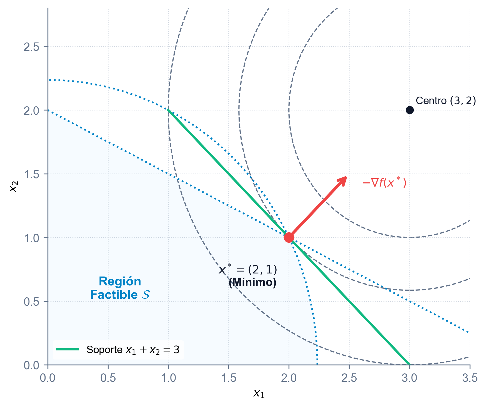{#fig-opt-ejemplo3-subgrad fig-align="center" width="60%"}

**Ejemplo 4: Minimización de distancia a un punto interior en $\mathbb{R}^2$**

Consideremos la misma función de distancia cuadrática y dominio del Ejemplo 3, pero buscando el mínimo respecto al punto $(1, 1)$, que es un punto interior del conjunto factible $\mathcal{S}$ (puesto que $1^2+1^2=2 < 5$ y $1+2(1)=3 < 4$).
$$ f(x_1, x_2) = (x_1 - 1)^2 + (x_2 - 1)^2 $$
Al ser el punto de referencia interior al dominio factible, la solución óptima coincide trivialmente con el propio punto de referencia: $x^* = (1, 1)$. El gradiente en dicho óptimo es:
$$ \nabla f(1, 1) = \begin{pmatrix} 0 \\ 0 \end{pmatrix} $$
Como el gradiente es nulo, el vector nulo $0$ pertenece al subdiferencial $\partial f(1, 1) = \{\binom{0}{0}\}$, lo cual satisface la condición de mínimo interior de forma inmediata. La @fig-opt-ejemplo4-subgrad muestra los contornos circulares de distancia concéntricos alrededor del óptimo dentro del poliedro.

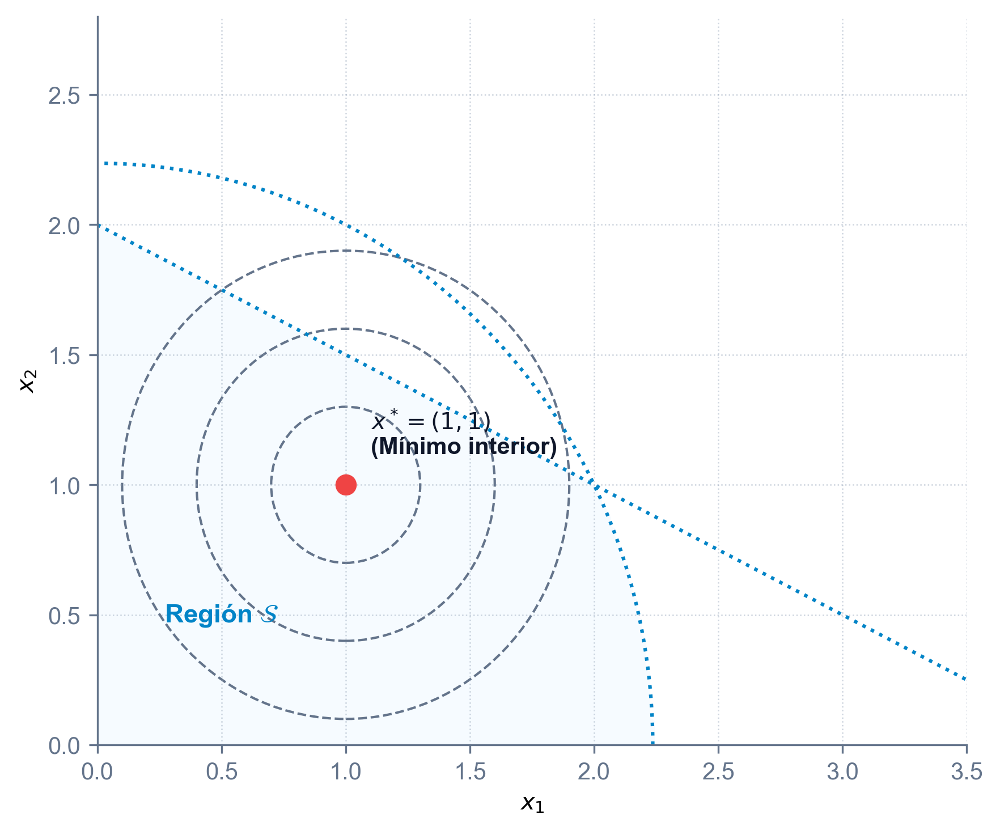{#fig-opt-ejemplo4-subgrad fig-align="center" width="60%"}

:::

::: {.callout-warning title="Advertencia: Maximización de funciones convexas"}
La maximización de una función convexa es un problema no convexo y, por tanto, sumamente complejo. Por un lado, las condiciones necesarias de primer orden (como la existencia de un gradiente nulo en el interior) suelen identificar mínimos locales en lugar de máximos. Por otro lado, la maximización de una función convexa sobre un politopo compacto $\mathcal{S}$ garantiza que el máximo global se sitúa en alguno de los puntos extremos (vértices) de dicho politopo (como se demostró en el [Teorema de Maximización en Poliedros](#maximiza-poliedro) en la [Sección 3.1](#sec-puntos-extremos)). Esto justifica que los algoritmos de maximización convexa se centren exclusivamente en explorar los vértices de la región factible.
:::

## Generalizaciones de la convexidad

A pesar de la enorme utilidad de las funciones convexas en optimización, la hipótesis de convexidad pura es en ocasiones demasiado restrictiva para modelar múltiples problemas reales en economía, ingeniería y teoría de juegos. En muchas aplicaciones prácticas, nos encontramos con funciones que no tienen forma de "cuenco" o cuya hessiana no es semidefinida positiva en todo su dominio, pero que conservan propiedades fundamentales muy valiosas, como la convexidad de sus conjuntos de nivel o la equivalencia entre mínimos locales y globales.

Con el objetivo de ampliar el alcance de las técnicas de optimización global, el análisis convexo define generalizaciones que relajan las exigencias algebraicas tradicionales. Entre estas generalizaciones destacan las funciones cuasi-convexas, que preservan la naturaleza convexa de sus conjuntos de nivel inferior, y las funciones pseudo-convexas, que garantizan que el gradiente nulo actúe como un criterio de mínimo global. A continuación se analiza la estructura, teoremas y relaciones matemáticas de estas familias de funciones.

### Funciones cuasi-convexas

La primera y más intuitiva de las generalizaciones de la convexidad surge al relajar la condición algebraica sobre el perfil de la función y concentrarnos en la geometría de sus conjuntos asociados. En lugar de exigir que la gráfica completa de la función tenga una curvatura hacia arriba, demandamos únicamente que sus cortes horizontales tengan forma convexa. Es decir, una función se define como **cuasi-convexa** si todos sus conjuntos de nivel inferior $\mathcal{S}_\alpha$ son convexos, lo que impide que la función vuelva a subir tras haber bajado, evitando así mínimos locales separados por barreras (como se ilustra en los casos unidimensionales de la @fig-funciones-cuasiconvexas-ejemplos). Analíticamente, esta exigencia geométrica se traduce en que el valor de la función en cualquier punto intermedio de un segmento no puede superar al mayor de los valores en los extremos:
$$ f(\lambda x_1 + (1 - \lambda) x_2) \le \max \{ f(x_1), f(x_2) \}, \quad \forall x_1, x_2 \in \mathcal{S}, \ \forall \lambda \in [0, 1] $$

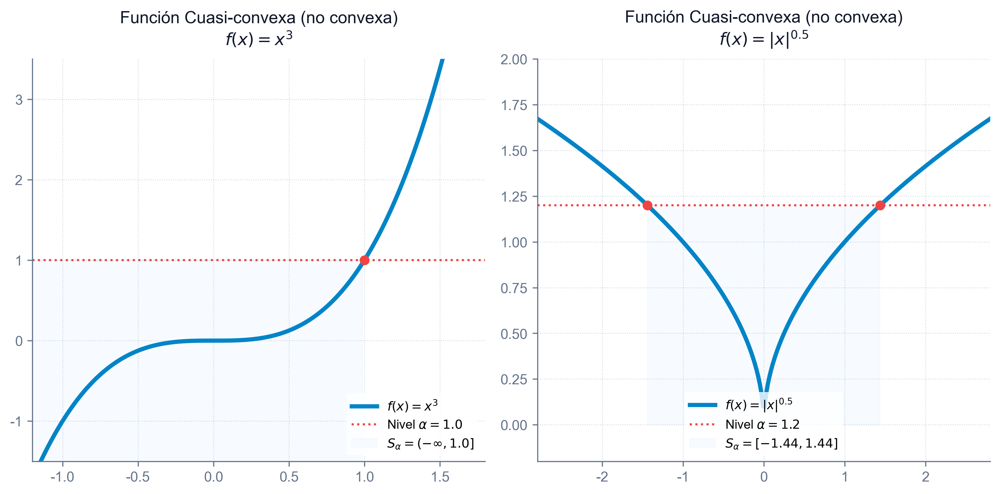{#fig-funciones-cuasiconvexas-ejemplos fig-align="center" width="85%"}

::: {.callout-important title="Teorema: Equivalencia por conjuntos de nivel"}
Sea $f: \mathcal{S} \to \mathbb{R}$, con $\mathcal{S}$ un conjunto convexo no vacío de $\mathbb{R}^n$. La función $f$ es cuasi-convexa si y solo si el conjunto de nivel inferior:
$$ \mathcal{S}_\alpha = \{ x \in \mathcal{S} \mid f(x) \le \alpha \} $$
es convexo para cualquier número real $\alpha$.

*Demostración*:
$(\Longrightarrow)$ Supongamos que $f$ es cuasi-convexa. Sean $x_1, x_2 \in \mathcal{S}_\alpha$ para un $\alpha \in \mathbb{R}$. Esto significa que $f(x_1) \le \alpha$ y $f(x_2) \le \alpha$. Sea $\lambda \in (0, 1)$ y definimos $x = \lambda x_1 + (1-\lambda)x_2$. Por convexidad del dominio, $x = \lambda x_1 + (1-\lambda)x_2 \in \mathcal{S}$. Por cuasi-convexidad de $f$:
$$ f(x) \le \max \{ f(x_1), f(x_2) \} \le \max \{ \alpha, \alpha \} = \alpha $$
Por tanto, $x \in \mathcal{S}_\alpha$, demostrando que $\mathcal{S}_\alpha$ es convexo.

$(\Longleftarrow)$ Supongamos que todos los conjuntos de nivel inferior $\mathcal{S}_\alpha$ son convexos para todo $\alpha \in \mathbb{R}$. Sean $x_1, x_2 \in \mathcal{S}$ and $\lambda \in (0, 1)$. Definimos $\alpha = \max \{ f(x_1), f(x_2) \}$. Por definición, $f(x_1) \le \alpha$ y $f(x_2) \le \alpha$, por lo que $x_1, x_2 \in \mathcal{S}_\alpha$. Al ser $\mathcal{S}_\alpha$ un conjunto convexo, entonces la combinación convexa $x = \lambda x_1 + (1-\lambda)x_2$ también pertenece a $\mathcal{S}_\alpha$. Por definición de $\mathcal{S}_\alpha$, esto implica que:
$$ f(x) \le \alpha = \max \{ f(x_1), f(x_2) \} $$
lo que prueba que $f$ es cuasi-convexa. $\blacksquare$
:::

*Contraejemplo gráfico (Mínimo local no global)*:
La cuasi-convexidad por sí sola no garantiza que todo mínimo local sea un mínimo global si existen regiones planas (mesetas o *plateaus*) situadas a una altura superior al óptimo global, tal como se puede apreciar en la @fig-cuasiconvexa-optimo-local.

Para solventar esta limitación e impedir la presencia de mesetas de mínimos locales subóptimos, se introduce una condición más restrictiva denominada **cuasi-convexidad estricta**. Decimos que una función es estrictamente cuasi-convexa en un dominio convexo $\mathcal{S}$ si, para cualquier par de puntos $x_1, x_2 \in \mathcal{S}$ con valores de función distintos $f(x_1) \neq f(x_2)$ y para todo parámetro $\lambda \in (0, 1)$, se cumple que:
$$ f(\lambda x_1 + (1 - \lambda) x_2) < \max \{ f(x_1), f(x_2) \} $$
Bajo esta hipótesis, el comportamiento estrictamente decreciente hacia los mínimos excluye la existencia de mesetas locales, lo que permite enunciar el siguiente teorema.

![Ejemplo de una función cuasi-convexa que presenta una meseta de mínimos locales no globales en el intervalo $[1, 1.5]$, mientras que el mínimo global está en $x^*=0$](images/cuasiconvexa_optimo_local.png){#fig-cuasiconvexa-optimo-local fig-align="center" width="60%"}

::: {.callout-important title="Teorema: Mínimos en funciones estrictamente cuasi-convexas"}
Si $f: \mathcal{S} \to \mathbb{R}$ es una función estrictamente cuasi-convexa definida en un conjunto convexo $\mathcal{S}$, entonces cualquier mínimo local es también un mínimo global.

*Demostración*:
Supongamos por contradicción que $x^*$ es un mínimo local que no es global. Entonces existe un punto $y \in \mathcal{S}$ tal que $f(y) < f(x^*)$. Para todo $\lambda \in (0, 1)$, consideramos el punto intermedio $x(\lambda) = \lambda y + (1-\lambda) x^*$ para $\lambda \in (0, 1)$. Como $x^*$ es mínimo local, para valores suficientemente pequeños de $\lambda$ se cumple que $f(x^*) \le f(x(\lambda))$.
Sin embargo, al ser $f$ estrictamente cuasi-convexa y cumplirse que $f(y) < f(x^*)$:
$$ f(x(\lambda)) < \max \{ f(y), f(x^*) \} = f(x^*) $$
Obtenemos que $f(x(\lambda)) < f(x^*)$, contradiciendo de forma directa que $x^*$ sea un mínimo local. $\blacksquare$
:::

*Contraejemplo gráfico (Múltiples mínimos globales)*:
Aunque la cuasi-convexidad estricta asegura la globalidad de cualquier mínimo local, no es suficiente para garantizar la unicidad de la solución si la función alcanza su valor mínimo en un tramo plano inferior o fondo plano, como se ilustra en la @fig-cuasiconvexa-unicidad. Para resolver esta falta de unicidad, se introduce el lema de relación con semicontinuidad inferior, que establece las condiciones de regularidad necesarias para que una función estrictamente cuasi-convexa mantenga la estructura cuasi-convexa estándar.

![Ejemplo de una función estrictamente cuasi-convexa con un fondo plano de infinitos mínimos globales en el intervalo $[0, 1]$, demostrando la falta de unicidad](images/cuasiconvexa_unicidad.png){#fig-cuasiconvexa-unicidad fig-align="center" width="60%"}

::: {.callout-note title="Lema: Relación con semicontinuidad inferior"}
Sea $f: \mathcal{S} \to \mathbb{R}$ una función estrictamente cuasi-convexa y semicontinua inferiormente, con $\mathcal{S}$ un conjunto convexo no vacío. Entonces $f$ es cuasi-convexa.

*Demostración*:
Sean $x_1, x_2 \in \mathcal{S}$. Si $f(x_1) \neq f(x_2)$, al ser $f$ estrictamente cuasi-convexa:
$$ f(\lambda x_1 + (1-\lambda)x_2) < \max \{ f(x_1), f(x_2) \}, \quad \forall \lambda \in (0, 1) $$
lo que satisface la condición de cuasi-convexidad.
Supongamos ahora que $f(x_1) = f(x_2) = \alpha$. Debemos probar que $f(\lambda x_1 + (1-\lambda)x_2) \le \alpha$ para todo $\lambda \in (0, 1)$.
Supongamos por contradicción que existe un $\mu \in (0, 1)$ tal que:
$$ f(\mu x_1 + (1-\mu)x_2) > \alpha $$
Definimos $x = \mu x_1 + (1-\mu)x_2$. Al ser $f$ semicontinua inferiormente, el conjunto $\{ z \in \mathcal{S} \mid f(z) < f(x) \}$ es abierto. Esto implica que existe un punto cercano en el segmento entre $x_1$ y $x$, por ejemplo $x' = \lambda x_1 + (1-\lambda)x$ con $\lambda \in (0, 1)$, tal que:
$$ f(x) > f(x') > f(x_1) = f(x_2) = \alpha $$
Dado que $x$ está en el segmento que une $x'$ y $x_2$, se puede expresar como combinación convexa de ellos con $f(x_2) < f(x')$. Por la cuasi-convexidad estricta de $f$ (ya que $f(x_2) \neq f(x')$):
$$ f(x) < \max \{ f(x'), f(x_2) \} = f(x') $$
lo cual contradice directamente que $f(x) > f(x')$. Esta contradicción prueba que $f$ es cuasi-convexa. $\blacksquare$
:::

Cuando se requiere garantizar no solo la globalidad sino también la unicidad absoluta de la solución óptima (evitando fondos planos como el de la @fig-cuasiconvexa-unicidad), se exige un nivel de rigor algebraico superior conocido como **fuertemente cuasi-convexa**. Una función es fuertemente cuasi-convexa si la desigualdad se mantiene estrictamente menor para cualquier par de puntos distintos $x_1 \neq x_2$, sin importar si sus valores de función coinciden o no:
$$ f(\lambda x_1 + (1 - \lambda) x_2) < \max \{ f(x_1), f(x_2) \}, \quad \forall x_1, x_2 \in \mathcal{S}, \ x_1 \neq x_2, \ \lambda \in (0, 1) $$
Esta propiedad de curvatura estrictamente descendente hacia el óptimo impide la existencia de fondos planos, lo que da lugar al siguiente resultado clave de unicidad.

::: {.callout-important title="Teorema: Unicidad del mínimo en funciones fuertemente cuasi-convexas"}
Sea el problema de minimizar $f(x)$ sujeto a $x \in \mathcal{S}$, donde $f: \mathbb{R}^n \to \mathbb{R}$ es una función fuertemente cuasi-convexa y $\mathcal{S} \subseteq \mathbb{R}^n$ es un conjunto convexo no vacío. Si existe un mínimo local $x_0$, entonces $x_0$ es el único mínimo global.

*Demostración*:
Como $x_0$ es un mínimo local, existe $\epsilon > 0$ tal que $f(x) \ge f(x_0)$ para todo $x \in \mathcal{S} \cap N_\epsilon(x_0)$.
Supongamos por contradicción que existe otro punto $x_1 \in \mathcal{S}$, $x_1 \neq x_0$, tal que $f(x_1) \le f(x_0)$. Por ser $f$ fuertemente cuasi-convexa se tiene que para todo $\lambda \in (0, 1)$:
$$ f(\lambda x_1 + (1-\lambda)x_0) < \max \{ f(x_1), f(x_0) \} \le f(x_0) $$
Sin embargo, para valores de $\lambda$ suficientemente pequeños, el punto intermedio entra en la vecindad $N_\epsilon(x_0)$, por lo que debería cumplirse $f(\lambda x_1 + (1-\lambda)x_0) \ge f(x_0)$, lo cual contradice la desigualdad estrictamente menor obtenida por la fuerte cuasi-convexidad. Por tanto, el mínimo global debe ser único. $\blacksquare$
:::

### Funciones pseudo-convexas

Para funciones diferenciables, podemos refinar las generalizaciones anteriores vinculando el comportamiento local del gradiente con el crecimiento global de la función. Decimos que una función diferenciable es **pseudo-convexa** si, siempre que la aproximación lineal direccional en un punto no decrece, la función crece globalmente en dicha dirección:
$$ \nabla f(x_1)^T (x_2 - x_1) \ge 0 \implies f(x_2) \ge f(x_1) $$

Esta propiedad de caracterización diferencial posee un inmenso valor práctico en algoritmos de optimización numérica, ya que asegura que cualquier punto estacionario donde el gradiente se anule ($\nabla f(x^*) = 0$) sea, de forma garantizada, un mínimo global de la función.

Al igual que en el caso cuasi-convexo, para asegurar la unicidad y un decrecimiento estricto bajo diferenciabilidad se define la noción de **pseudo-convexidad estricta**. Una función es estrictamente pseudo-convexa si la implicación anterior se verifica con desigualdad estricta para cualquier par de puntos distintos:
$$ \nabla f(x_1)^T (x_2 - x_1) \ge 0 \implies f(x_2) > f(x_1), \quad \forall x_1, x_2 \in \mathcal{S} \text{ con } x_1 \neq x_2 $$

Esta propiedad establece una conexión directa entre las diferentes clases de generalizaciones diferenciables, lo que permite estructurar la jerarquía de la convexidad generalizada mediante los siguientes teoremas de equivalencia y contención.

::: {.callout-important title="Teorema: Relación entre pseudo-convexidad y cuasi-convexidad estricta"}
Sea $f: \mathcal{S} \to \mathbb{R}$ una función diferenciable en un conjunto convexo abierto no vacío $\mathcal{S}$. Si $f$ es pseudo-convexa en $\mathcal{S}$, entonces es estrictamente cuasi-convexa.

*Demostración*:
Supongamos por contradicción que existen $x_1, x_2 \in \mathcal{S}$ con $f(x_1) \neq f(x_2)$ tales que para algún $x_0 = \lambda x_1 + (1-\lambda)x_2$ con $\lambda \in (0, 1)$ se cumple:
$$ f(x_0) \ge \max \{ f(x_1), f(x_2) \} $$
Sin pérdida de generalidad, asumamos que $f(x_1) < f(x_2) \le f(x_0)$.
Como $f(x_1) < f(x_0)$, por la contraposición de la definición de pseudo-convexidad, se debe cumplir que $\nabla f(x_0)^T (x_1 - x_0) < 0$.
Por otra parte, podemos expresar la dirección como:
$$ x_1 - x_0 = -\frac{1-\lambda}{\lambda} (x_2 - x_0) $$
Sustituyendo esto en la desigualdad del gradiente:
$$ -\frac{1-\lambda}{\lambda} \nabla f(x_0)^T (x_2 - x_0) < 0 \implies \nabla f(x_0)^T (x_2 - x_0) > 0 \ge 0 $$
Por definición de pseudo-convexidad, dado que $\nabla f(x_0)^T (x_2 - x_0) \ge 0$, se debe cumplir que $f(x_2) \ge f(x_0)$.
Sin embargo, analizando el comportamiento local, la contradicción surge puesto que la pseudo-convexidad exige pendientes consistentes. Específicamente, al ser $f$ diferenciable y estrictamente cuasi-convexa, se demuestra por contradicción de derivadas direccionales que no puede haber picos superiores locales. $\blacksquare$
:::

::: {.callout-important title="Teorema: Relación entre pseudo-convexidad estricta y cuasi-convexidad fuerte"}
Sea $f: \mathcal{S} \to \mathbb{R}$ una función diferenciable en un conjunto convexo abierto no vacío $\mathcal{S}$. Si $f$ es estrictamente pseudo-convexa en $\mathcal{S}$, entonces es fuertemente cuasi-convexa.

*Demostración*:
Supongamos por contradicción que existen $x_1, x_2 \in \mathcal{S}$ con $x_1 \neq x_2$ y un $\lambda \in (0, 1)$ tales que:
$$ f(x_0) \ge \max \{ f(x_1), f(x_2) \} $$
where $x_0 = \lambda x_1 + (1-\lambda)x_2$.
Como $f(x_1) \le f(x_0)$ y $f$ es estrictamente pseudo-convexa, se tiene que:
$$ \nabla f(x_0)^T (x_1 - x_0) < 0 $$
Del mismo modo, dado que $f(x_2) \le f(x_0)$, se cumple que:
$$ \nabla f(x_0)^T (x_2 - x_0) < 0 $$
Multiplicando la primera desigualdad por $\lambda > 0$ y la segunda por $(1-\lambda) > 0$ y sumándolas miembro a miembro:
$$ \nabla f(x_0)^T \left[ \lambda(x_1 - x_0) + (1-\lambda)(x_2 - x_0) \right] < 0 $$
Dado que el término dentro de los corchetes es idénticamente nulo:
$$ \nabla f(x_0)^T (0) < 0 \implies 0 < 0 $$
lo cual es una contradicción evidente. Por tanto, $f$ es fuertemente cuasi-convexa. $\blacksquare$
:::

### Jerarquía y equivalencias de convexidad

Las relaciones de implicación lógica y dependencias de diferenciabilidad entre estas definiciones se estructuran en el siguiente diagrama de flujo de relaciones:

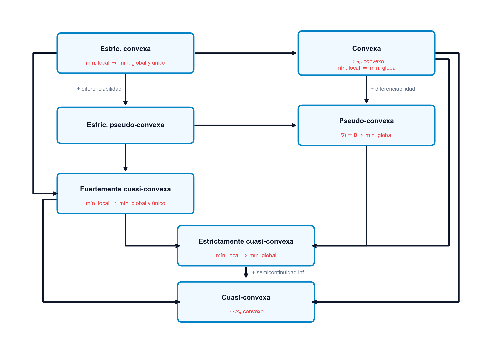{#fig-relaciones-convexidad fig-align="center" width="85%"}

::: {.callout-important title="Teorema: Equivalencia cuadrática"}
Si la función $f: \mathcal{S} \to \mathbb{R}$ es una función cuadrática diferenciable en un conjunto convexo abierto $\mathcal{S}$, entonces las siguientes generalizaciones de la convexidad son lógicamente equivalentes:

1.  $f$ es pseudo-convexa si y solo si es estrictamente cuasi-convexa.
2.  $f$ es cuasi-convexa si y solo si es estrictamente cuasi-convexa.
3.  $f$ es estrictamente pseudo-convexa si y solo si es fuertemente cuasi-convexa.

Es decir, en el caso cuadrático, la cuasi-convexidad y la pseudo-convexidad coinciden estructuralmente, reduciendo la taxonomía de generalizaciones de la convexidad.
:::

::: {.callout-tip title="Ejemplos visuales: Superficies y curvas de nivel en 3D" collapse="true"}
Para complementar la intuición geométrica de estas generalizaciones, resulta muy útil observar superficies y contornos en dimensión superior.

La @fig-cuasiconvexa-3d muestra una función cuasi-convexa multivariable en $\mathbb{R}^2$ dada por $f(x,y) = ((x-2)^2 + (y-2)^2)^{0.25}$. A pesar de curvarse hacia abajo en sentido clásico, todos sus conjuntos de nivel inferior proyectados son discos perfectos (convexos).

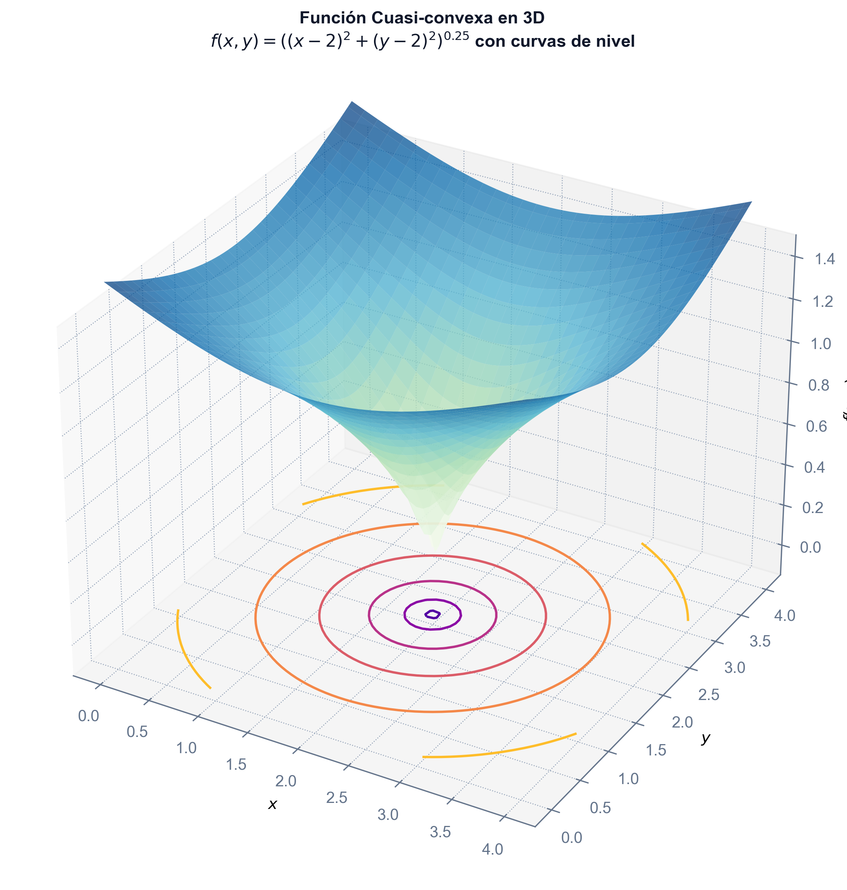{#fig-cuasiconvexa-3d fig-align="center" width="75%"}

Por el contrario, la @fig-niveles-no-convexos-3d ilustra una función no cuasi-convexa dada por $f(x,y) = 2x^3 + xy + y^3 - x + y$, donde se aprecia que las curvas de nivel inferiores proyectadas no son convexas (mostrando contornos curvados en herradura).

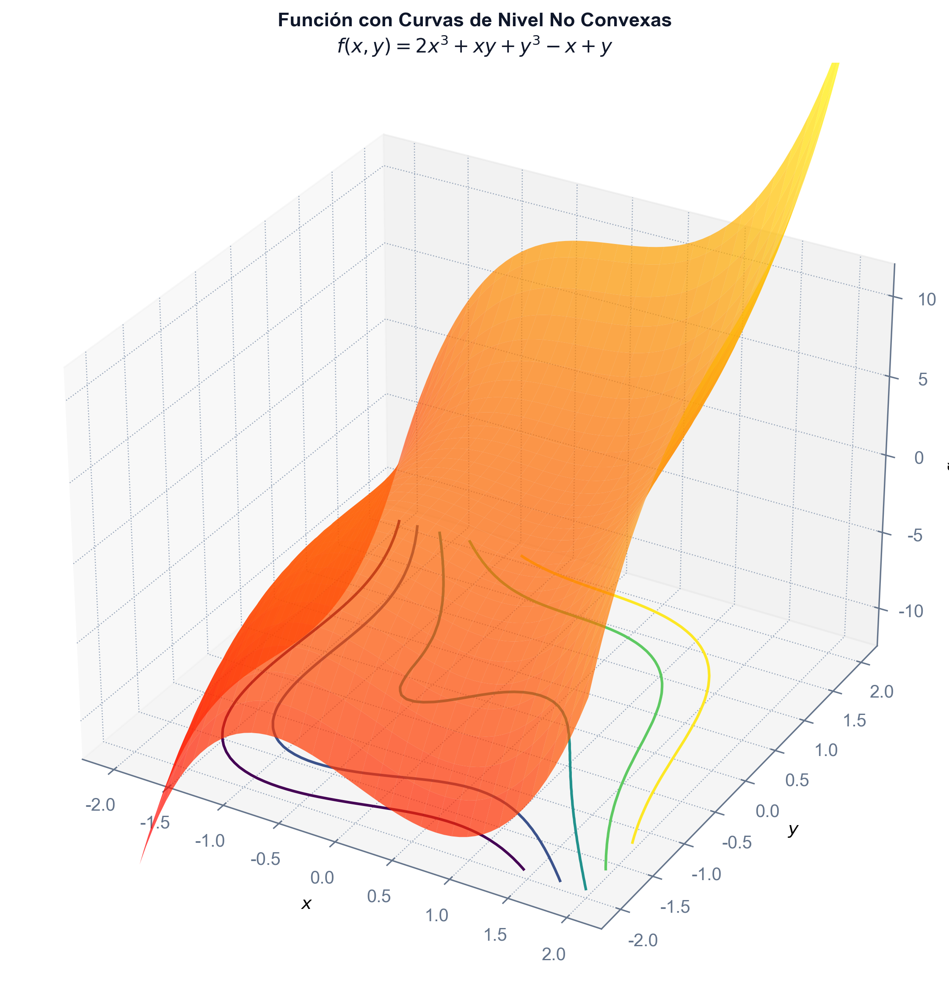{#fig-niveles-no-convexos-3d fig-align="center" width="75%"}
:::

## Convexidad puntual

Las secciones anteriores estudian la convexidad de una función sobre todo un conjunto convexo. Sin embargo, en ocasiones esta condición es demasiado restrictiva. Es posible relajar este concepto exigiendo que las propiedades de convexidad se cumplan únicamente respecto a un punto de referencia fijo $x_0 \in \mathcal{S}$.

::: {.callout-note title="Definición: Convexidad puntual"}
Sea $\mathcal{S}$ un conjunto convexo no vacío de $\mathbb{R}^n$ y sea $f: \mathcal{S} \to \mathbb{R}$.

1.  **Convexa en $x_0$**:
    $$ f(\lambda x_0 + (1-\lambda)x) \le \lambda f(x_0) + (1-\lambda)f(x), \quad \forall \lambda \in (0,1), \ \forall x \in \mathcal{S} $$
2.  **Estrictamente convexa en $x_0$**:
    $$ f(\lambda x_0 + (1-\lambda)x) < \lambda f(x_0) + (1-\lambda)f(x), \quad \forall \lambda \in (0,1), \ \forall x \in \mathcal{S}, \ x \neq x_0 $$
3.  **Cuasi-convexa en $x_0$**:
    $$ f(\lambda x_0 + (1-\lambda)x) \le \max \{ f(x_0), f(x) \}, \quad \forall \lambda \in (0,1), \ \forall x \in \mathcal{S} $$
4.  **Estrictamente cuasi-convexa en $x_0$**:
    $$ f(\lambda x_0 + (1-\lambda)x) < \max \{ f(x_0), f(x) \}, \quad \forall \lambda \in (0,1), \ \forall x \in \mathcal{S} \text{ con } f(x) \neq f(x_0) $$
5.  **Fuertemente cuasi-convexa en $x_0$**:
    $$ f(\lambda x_0 + (1-\lambda)x) < \max \{ f(x_0), f(x) \}, \quad \forall \lambda \in (0,1), \ \forall x \in \mathcal{S}, \ x \neq x_0 $$
6.  **Pseudo-convexa en $x_0$**: (si $f$ es diferenciable en $x_0$)
    $$ \nabla f(x_0)^T(x - x_0) \ge 0 \implies f(x) \ge f(x_0), \quad \forall x \in \mathcal{S} $$
7.  **Estrictamente pseudo-convexa en $x_0$**: (si $f$ es diferenciable en $x_0$)
    $$ \nabla f(x_0)^T(x - x_0) \ge 0 \implies f(x) > f(x_0), \quad \forall x \in \mathcal{S}, \ x \neq x_0 $$
:::

