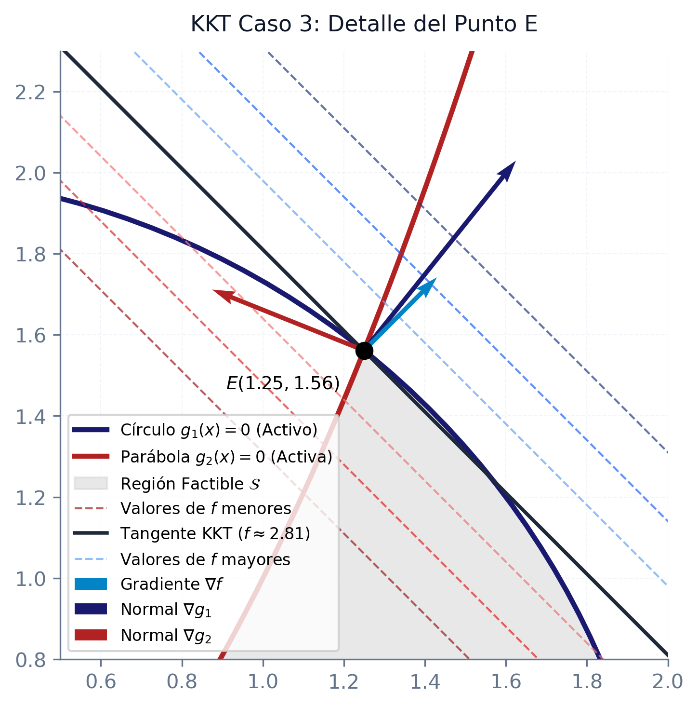

# Condiciones de optimalidad y KKT

En las aplicaciones prácticas de la optimización, la inmensa mayoría de los problemas incorporan restricciones sobre los recursos, el presupuesto o las condiciones físicas del sistema. En este capítulo, estudiaremos la caracterización analítica y geométrica de los puntos óptimos. Comenzaremos analizando los problemas sin restricciones para asentar las bases diferenciales, introduciremos el formalismo geométrico de los conos de direcciones factibles y de descenso, y derivaremos las célebres condiciones necesarias de Fritz-John (FJ) y las condiciones necesarias y suficientes de Karush-Kuhn-Tucker (KKT).

::: {.callout-important title="Objetivos de aprendizaje"}
Al finalizar este capítulo, serás capaz de:

1.  **Diferenciar** las condiciones necesarias y suficientes de primer y segundo orden (FONC, SONC y SOSC) para optimización sin restricciones.
2.  **Caracterizar geométricamente** las direcciones de descenso y factibles a través de conos de direcciones algebraicos.
3.  **Analizar las condiciones de Fritz-John**, interpretando su significado geométrico y su sensibilidad ante restricciones redundantes.
4.  **Deducir y aplicar las condiciones de Karush-Kuhn-Tucker (KKT)** como fundamento analítico de la optimización restringida.
5.  **Resolver analíticamente** problemas con restricciones de igualdad y desigualdad por medio de la cualificación de restricciones (LICQ) y el análisis sistemático por casos.
:::

## Optimización sin restricciones

Aunque la mayoría de los problemas prácticos en ingeniería y economía incorporan restricciones sobre las variables de decisión, el estudio de la optimización sin restricciones ($\min f(x)$ para $x \in \mathbb{R}^n$) constituye la piedra angular de la teoría de la optimización. Esto se debe a dos motivos fundamentales: en primer lugar, los conceptos de aproximación local y curvatura que se desarrollan aquí se extienden directamente al caso restringido; en segundo lugar, muchos algoritmos numéricos resuelven problemas complejos con restricciones transformándolos en una secuencia de subproblemas no restringidos (como los métodos de barrera o de penalización). El estudio de estos problemas nos permite comprender cómo se comporta localmente una función basándose en la información de sus derivadas.

### Direcciones de descenso

Para buscar el valor mínimo de una función $f$, una estrategia básica consiste en ubicarse en un punto actual $\bar{x}$ y desplazarse en una dirección a lo largo de la cual la función decrezca. Analíticamente, una dirección de descenso es un vector que apunta hacia regiones del espacio donde el valor de la función disminuye localmente. Si la función es diferenciable en $\bar{x}$, podemos emplear el gradiente (que representa la dirección de máximo crecimiento local) para identificar de manera sistemática tales direcciones mediante el siguiente teorema:

::: {.callout-important title="Teorema: Condición de dirección de descenso"}
Dada una función $f: \mathbb{R}^n \to \mathbb{R}$ diferenciable en $\bar{x}$, si existe un vector $d \in \mathbb{R}^n$ tal que:
$$ \nabla f(\bar{x})^T d < 0 $$
Entonces existe un escalar $\delta > 0$ tal que:
$$ f(\bar{x} + \lambda d) < f(\bar{x}), \quad \forall \lambda \in (0, \delta) $$

*Demostración*:
Por la diferenciabilidad de $f$ en el punto $\bar{x}$, podemos escribir el desarrollo de Taylor de primer orden como:
$$ f(\bar{x} + \lambda d) = f(\bar{x}) + \lambda \nabla f(\bar{x})^T d + \lambda \|d\| \alpha(\bar{x}, \lambda d) $$
Donde $\alpha(\bar{x}, \lambda d) \to 0$ cuando $\lambda \to 0$. Reordenando los términos y dividiendo ambos miembros por el parámetro $\lambda > 0$, obtenemos:
$$ \frac{f(\bar{x} + \lambda d) - f(\bar{x})}{\lambda} = \nabla f(\bar{x})^T d + \|d\| \alpha(\bar{x}, \lambda d) $$
Puesto que $\nabla f(\bar{x})^T d < 0$ por hipótesis, y dado que el término residual $\alpha(\bar{x}, \lambda d)$ tiende a cero conforme $\lambda \to 0$, existe un entorno de radio $\delta > 0$ tal que para todo $\lambda \in (0, \delta)$ el lado derecho de la igualdad permanece estrictamente negativo:
$$ \nabla f(\bar{x})^T d + \|d\| \alpha(\bar{x}, \lambda d) < 0 $$
Esto implica que $f(\bar{x} + \lambda d) - f(\bar{x}) < 0$, lo que demuestra la tesis. $\blacksquare$
:::

El teorema anterior nos proporciona una herramienta geométrica muy potente: para que un vector $d$ sea una dirección de descenso local en $\bar{x}$, basta con que forme un cono abierto de direcciones que hagan un ángulo obtuso con el vector gradiente, es decir, que su producto escalar sea estrictamente negativo ($\nabla f(\bar{x})^T d < 0$). Esta propiedad constituye la base del método clásico del descenso del gradiente (o máxima pendiente), donde se elige la dirección opuesta al gradiente $d = -\nabla f(\bar{x})$.

### Condiciones necesarias y suficientes de segundo orden

Cuando nos encontramos en un punto que ya es un extremo local (mínimo o máximo), la geometría del problema exige que no sea posible encontrar ninguna dirección de descenso o de ascenso factible. Esto se traduce analíticamente en las condiciones clásicas de optimalidad de primer y segundo orden. El primer resultado fundamental establece que el plano tangente a la función en un extremo local debe ser completamente horizontal, anulando la aproximación lineal de primer orden:

::: {.callout-note title="Corolario: Condición necesaria de primer orden (FONC)"}
Dada $f: \mathbb{R}^n \to \mathbb{R}$ diferenciable en $\bar{x}$, si $\bar{x}$ es un mínimo (o máximo) local de $f$, entonces el gradiente en dicho punto se anula:
$$ \nabla f(\bar{x}) = 0 $$

*Demostración*:
Supóngase por contradicción que $\nabla f(\bar{x}) \neq 0$. Definamos la dirección $d = -\nabla f(\bar{x})$. Entonces:
$$ \nabla f(\bar{x})^T d = -\|\nabla f(\bar{x})\|^2 < 0 $$
Por la Condición de Dirección de Descenso, existe un $\delta > 0$ tal que $f(\bar{x} + \lambda d) < f(\bar{x})$ para todo $\lambda \in (0, \delta)$, lo que contradice directamente que $\bar{x}$ sea un mínimo local de la función. $\blacksquare$
:::

La anulación del gradiente ($\nabla f(\bar{x}) = 0$) define a $\bar{x}$ como un **punto estacionario**. Sin embargo, la información de primer orden es insuficiente para distinguir entre mínimos locales, máximos locales o puntos de silla (donde la función crece en algunas direcciones y decrece en otras). Para caracterizar la naturaleza de un punto estacionario, necesitamos recurrir a la curvatura local de la función mediante la información de segundo orden proporcionada por la matriz Hessiana:

::: {.callout-important title="Teorema: Condición necesaria de segundo orden (SONC)"}
Sea $f: \mathbb{R}^n \to \mathbb{R}$ una función dos veces diferenciable en $\bar{x}$. Si $\bar{x}$ es un mínimo local de $f$, entonces:
$$ \nabla f(\bar{x}) = 0 \qquad \text{y} \qquad \nabla^2 f(\bar{x}) \succeq 0 \quad (\text{semidefinida positiva}) $$

*Demostración*:
Por ser $\bar{x}$ un extremo local, el corolario anterior garantiza que $\nabla f(\bar{x}) = 0$. Sea $d \in \mathbb{R}^n$ una dirección cualquiera. Por ser $f$ dos veces diferenciable en $\bar{x}$, escribimos el desarrollo de Taylor de segundo orden:
$$ f(\bar{x} + \lambda d) = f(\bar{x}) + \lambda \nabla f(\bar{x})^T d + \frac{1}{2} \lambda^2 d^T \nabla^2 f(\bar{x}) d + \lambda^2 \|d\|_2^2 \alpha(\bar{x}, \lambda d) $$
Donde $\alpha(\bar{x}, \lambda d) \to 0$ cuando $\lambda \to 0$. Puesto que $\nabla f(\bar{x}) = 0$, sustituimos y reordenamos los términos dividiendo por $\lambda^2 > 0$:
$$ \frac{f(\bar{x} + \lambda d) - f(\bar{x})}{\lambda^2} = \frac{1}{2} d^T \nabla^2 f(\bar{x}) d + \|d\|_2^2 \alpha(\bar{x}, \lambda d) $$
Dado que $\bar{x}$ es un mínimo local, existe un entorno donde $f(\bar{x} + \lambda d) \ge f(\bar{x})$ para $\lambda$ suficientemente pequeño. Por tanto:
$$ \frac{1}{2} d^T \nabla^2 f(\bar{x}) d + \|d\|_2^2 \alpha(\bar{x}, \lambda d) \ge 0 $$
Tomando el límite cuando $\lambda \to 0$, el término residual $\alpha(\bar{x}, \lambda d)$ se desvanece, obteniendo:
$$ d^T \nabla^2 f(\bar{x}) d \ge 0 $$
Como esta desigualdad es válida para cualquier dirección $d \in \mathbb{R}^n$, la matriz Hessiana $\nabla^2 f(\bar{x})$ es semidefinida positiva. $\blacksquare$
:::

La condición necesaria de segundo orden (SONC) establece que en un mínimo local, la curvatura de la función no puede apuntar hacia abajo en ninguna dirección. No obstante, esta condición sigue siendo meramente necesaria (por ejemplo, en un punto de inflexión la segunda derivada también puede ser cero). Para certificar que un punto es de forma inequívoca un mínimo local, debemos exigir una condición suficiente más fuerte:

::: {.callout-important title="Teorema: Condición suficiente de segundo orden (SOSC)"}
Sea $f: \mathbb{R}^n \to \mathbb{R}$ una función dos veces diferenciable en $\bar{x}$. Si en un punto $\bar{x}$ se cumple que el gradiente es nulo y la matriz Hessiana es definida positiva:
$$ \nabla f(\bar{x}) = 0 \qquad \text{y} \qquad \nabla^2 f(\bar{x}) \succ 0 $$
Entonces $\bar{x}$ es un mínimo local estricto de la función.

*Demostración*:
Por ser $f$ dos veces diferenciable:
$$ f(x) = f(\bar{x}) + \nabla f(\bar{x})^T (x - \bar{x}) + \frac{1}{2} (x - \bar{x})^T \nabla^2 f(\bar{x}) (x - \bar{x}) + \|x - \bar{x}\|_2^2 \alpha(\bar{x}, x - \bar{x}) $$
con $\alpha(\bar{x}, x - \bar{x}) \to 0$ cuando $x \to \bar{x}$. Supongamos por reducción al absurdo que $\bar{x}$ no es un mínimo local; esto es, existe una sucesión de puntos $\{x_k\}$ que converge a $\bar{x}$ tal que $f(x_k) < f(\bar{x})$ para cada $k$. Denotando la dirección normalizada de la sucesión como $d_k = \frac{x_k - \bar{x}}{\|x_k - \bar{x}\|_2}$, se cumple que $\|d_k\|_2 = 1$. Escribiendo la relación de Taylor:
$$ \frac{f(x_k) - f(\bar{x})}{\|x_k - \bar{x}\|_2^2} = \frac{1}{2} d_k^T \nabla^2 f(\bar{x}) d_k + \alpha(\bar{x}, x_k - \bar{x}) < 0 $$
Dado que $\{d_k\}$ pertenece a la esfera unidad (que es un conjunto compacto), existe una subsucesión $\{d_k\}_{k \in \mathcal{K}}$ que converge a una dirección $d$ con $\|d\|_2 = 1$. Tomando el límite en dicha subsucesión y puesto que $\alpha(\bar{x}, x_k - \bar{x}) \to 0$, se obtiene:
$$ d^T \nabla^2 f(\bar{x}) d \le 0 $$
Esto contradice la hipótesis de que la Hessiana $\nabla^2 f(\bar{x})$ es definida positiva, ya que $\|d\|_2 = 1 \neq 0$. Por tanto, $\bar{x}$ es un mínimo local estricto. $\blacksquare$
:::

La condición suficiente de segundo orden (SOSC) requiere que la Hessiana sea estrictamente definida positiva en el punto estacionario, garantizando que la función se curva hacia arriba en todas las direcciones alrededor de $\bar{x}$. 

Es importante subrayar que estas condiciones (tanto necesarias como suficientes) son de carácter **local**, ya que se derivan del desarrollo de Taylor en un entorno infinitesimal de $\bar{x}$. Si deseamos certificar la optimalidad **global** (es decir, asegurar que no existe ningún otro punto en todo el dominio con un valor menor de la función), debemos exigir propiedades globales sobre la estructura de la función, siendo la más representativa la generalización de la convexidad:

::: {.callout-important title="Teorema: Suficiencia de optimalidad bajo pseudo-convexidad"}
Sea $f: \mathcal{S} \to \mathbb{R}$ una función pseudo-convexa definida sobre un conjunto convexo $\mathcal{S}$. Un punto $\bar{x} \in \mathcal{S}$ es un mínimo global de $f$ si y solo si es un punto estacionario:
$$ \nabla f(\bar{x}) = 0 $$

*Demostración*:
La implicación directa ($\implies$) es consecuencia directa del Corolario de Condición Necesaria de Primer Orden (FONC). Para probar la suficiencia ($\impliedby$), supongamos que $\nabla f(\bar{x}) = 0$. Por definición de pseudo-convexidad, si para cualquier $x \in \mathcal{S}$ se cumple que:
$$ \nabla f(\bar{x})^T (x - \bar{x}) \ge 0 \implies f(x) \ge f(\bar{x}) $$
Dado que $\nabla f(\bar{x}) = 0$, se tiene que $\nabla f(\bar{x})^T (x - \bar{x}) = 0 \ge 0$, lo que implica directamente que $f(x) \ge f(\bar{x})$ para todo $x \in \mathcal{S}$. Por tanto, $\bar{x}$ es un mínimo global. $\blacksquare$
:::

### Derivadas de orden superior para una variable

En los casos en que la segunda derivada (o la matriz Hessiana) es únicamente semidefinida pero no definida positiva (es decir, contiene autovalores nulos), la curvatura de segundo orden no es suficiente para clasificar el punto estacionario. Para funciones de una sola variable ($f: \mathbb{R} \to \mathbb{R}$), podemos resolver esta ambigüedad analizando las derivadas de orden superior en el punto estacionario. La clave reside en identificar la primera derivada de orden superior que sea diferente de cero, lo que formaliza el siguiente teorema:

::: {.callout-important title="Teorema: Extremos univariantes de orden superior"}
Sea $f: \mathbb{R} \to \mathbb{R}$ una función infinitamente diferenciable. Un punto $\bar{x} \in \mathbb{R}$ es un mínimo local de $f$ si y solo si se verifica alguna de las dos siguientes condiciones:

1.  $f^{(j)}(\bar{x}) = 0$ para todo $j = 1, 2, \dots$
2.  Existe un entero par $n \ge 2$ tal que $f^{(n)}(\bar{x}) > 0$ y $f^{(j)}(\bar{x}) = 0$ para todo $j = 1, \dots, n-1$.

*Demostración*:
Véase [@bazaraa2013nonlinear, Capítulo 2].
:::

Este resultado nos muestra que la naturaleza local del punto depende del carácter par o impar del orden de la primera derivada no nula: un orden impar indica que la función cruza el plano tangente (punto de inflexión), mientras que un orden par preserva el carácter extremo (mínimo si la derivada es positiva, máximo si es negativa), como se ilustra en el siguiente ejemplo:

::: {.callout-tip title="Ejemplo: Análisis de puntos estacionarios" collapse="true"}
Consideremos la función univariante $f(x) = (x^2 - 1)^3$. Sus dos primeras derivadas son:
$$ f'(x) = 6x(x^2 - 1)^2, \qquad f''(x) = 24x^2(x^2 - 1) + 6(x^2 - 1)^2 $$
Igualando la primera derivada a cero, localizamos los puntos estacionarios candidatos:
$$ x^* = 0, \qquad x^* = 1, \qquad x^* = -1 $$
Analicemos la curvatura de segundo orden en cada candidato:

*   **En $x^* = 0$**:
    $f''(0) = 6 > 0$. Al ser la segunda derivada estrictamente positiva, se cumple la condición suficiente de segundo orden (SOSC), confirmando que $x^* = 0$ es un mínimo local.
*   **En $x^* = \pm 1$**:
    $f''(\pm 1) = 0$. Al anularse la segunda derivada, acudimos a las derivadas de orden superior. Se tiene que:
    $$ f'''(x) = 48x(x^2-1) + 24x^2(2x) + 12(x^2-1)(2x) \implies f'''(\pm 1) = \pm 48 \neq 0 $$
    Al ser la primera derivada no nula de orden impar ($n=3$), concluimos que $x^* = \pm 1$ son puntos de inflexión y no extremos locales, como se muestra en la @fig-opt-sin-rest-inflexion.

{#fig-opt-sin-rest-inflexion fig-align="center" width="70%"}
:::

## Optimización con restricciones

En la práctica, la optimización matemática adquiere su verdadera complejidad cuando introducimos limitaciones sobre las variables de decisión. Para analizar formalmente estos problemas, inicialmente consideraremos el marco general en el que la región factible $\mathcal{S} \subseteq \mathbb{R}^n$ es un conjunto genérico:
$$ \min \{ f(x) \mid x \in \mathcal{S} \} $$
Posteriormente, nos centraremos en problemas donde la región factible está definida explícitamente mediante una serie de desigualdades analíticas:
$$ \min \{ f(x) \mid x \in \mathcal{X}, \ g_i(x) \le 0, \ i = 1, \dots, m \} $$
donde el dominio de partida $\mathcal{X}$ es un abierto no vacío de $\mathbb{R}^n$ y tanto la función objetivo $f$ como las restricciones $g_i$ son funciones diferenciables.

Para caracterizar si un punto frontera $\bar{x} \in \mathcal{S}$ puede ser un mínimo local, debemos analizar si es posible realizar un movimiento infinitesimal a partir de él que cumpla dos condiciones: permanecer dentro de la región factible $\mathcal{S}$ y, simultáneamente, disminuir el valor de la función objetivo $f(x)$. En términos geométricos, esto se estudia a través del concepto de **conos de direcciones**:

**Cono de Direcciones Factibles ($\mathcal{F}(\bar{x})$)**
El conjunto de direcciones a lo largo de las cuales un paso infinitesimal no abandona la región factible $\mathcal{S}$:
$$ \mathcal{F}(\bar{x}) = \{ d \in \mathbb{R}^n \mid d \neq 0, \ \exists \delta_d > 0 \text{ tal que } \bar{x} + \lambda d \in \mathcal{S}, \ \forall \lambda \in (0, \delta_d) \} $$

**Cono de Direcciones de Mejora/Descenso ($\mathcal{D}(\bar{x})$)**
El conjunto de direcciones a lo largo de las cuales el valor de la función objetivo disminuye localmente:
$$ \mathcal{D}(\bar{x}) = \{ d \in \mathbb{R}^n \mid d \neq 0, \ \exists \delta_d > 0 \text{ tal que } f(\bar{x} + \lambda d) < f(\bar{x}), \ \forall \lambda \in (0, \delta_d) \} $$

La condición básica de optimalidad geométrica establece que, si $\bar{x}$ es un mínimo local, es imposible encontrar una dirección que nos permita adentrarnos en la región factible y, al mismo tiempo, mejorar la función. En términos de conjuntos, esto significa que ambos conos son disjuntos:
$$ \bar{x} \text{ es mínimo local} \implies \mathcal{F}(\bar{x}) \cap \mathcal{D}(\bar{x}) = \emptyset $$

Como se ilustra en la @fig-cono-direcciones, en un punto mínimo local $\bar{x}$ situado en la frontera de la región factible $\mathcal{S}$, el cono de direcciones factibles $\mathcal{F}(\bar{x})$ (que apunta hacia el interior de $\mathcal{S}$) y el cono de direcciones de descenso analítico $\mathcal{D}_0(\bar{x})$ (que apunta en la dirección opuesta al gradiente de la función objetivo $\nabla f(\bar{x})$) están completamente separados, compartiendo únicamente el origen $\bar{x}$. Esto representa geométricamente que ninguna dirección admisible puede disminuir localmente el valor del objetivo.

{#fig-cono-direcciones fig-align="center" width="60%"}

Sin embargo, comprobar la exclusión geométrica directa es muy complejo porque no siempre es fácil determinar analíticamente el cono de direcciones de descenso real $\mathcal{D}(\bar{x})$. Si la función $f$ es diferenciable en $\bar{x}$, podemos simplificar la caracterización del cono de descenso aproximándolo mediante un semiespacio abierto definido por el gradiente. Definimos el cono de direcciones de descenso analítico como el conjunto de direcciones que forman un ángulo obtuso con el gradiente de la función en dicho punto:
$$ \mathcal{D}_0(\bar{x}) = \{ d \in \mathbb{R}^n \mid \nabla f(\bar{x})^T d < 0 \} $$
Este cono analítico siempre es un subconjunto del cono de descenso real ($\mathcal{D}_0(\bar{x}) \subseteq \mathcal{D}(\bar{x})$). Esta relación nos permite formular el primer criterio necesario de optimalidad bajo restricciones diferenciables:

::: {.callout-important title="Teorema: Exclusión de direcciones de descenso y factibilidad"}
Si $\bar{x} \in \mathcal{S}$ es un mínimo local de una función diferenciable $f$, entonces el cono de direcciones factibles y el semiespacio de descenso analítico son disjuntos:
$$ \mathcal{D}_0(\bar{x}) \cap \mathcal{F}(\bar{x}) = \emptyset $$

*Demostración*:
Supóngase por contradicción que existe un vector $d \in \mathcal{D}_0(\bar{x}) \cap \mathcal{F}(\bar{x})$.
1.  Como $d \in \mathcal{D}_0(\bar{x})$, se cumple que $\nabla f(\bar{x})^T d < 0$. Por el Teorema de Dirección de Descenso, existe un paso $\delta_1 > 0$ tal que $f(\bar{x} + \lambda d) < f(\bar{x})$ para todo $\lambda \in (0, \delta_1)$.
2.  Como $d \in \mathcal{F}(\bar{x})$, por definición de cono factible, existe un paso $\delta_2 > 0$ tal que $\bar{x} + \lambda d \in \mathcal{S}$ para todo $\lambda \in (0, \delta_2)$.
Tomando el paso mínimo $\delta = \min \{\delta_1, \delta_2\} > 0$, se deduce que para todo $\lambda \in (0, \delta)$ el punto $\bar{x} + \lambda d$ es factible y además $f(\bar{x} + \lambda d) < f(\bar{x})$, lo que contradice directamente que $\bar{x}$ sea un mínimo local de $f$ en la región factible. $\blacksquare$
:::

La condición de exclusión anterior ($\mathcal{D}_0(\bar{x}) \cap \mathcal{F}(\bar{x}) = \emptyset$) es de carácter necesario. La implicación inversa (suficiencia) no se cumple en general debido a que si el gradiente se anula ($\nabla f(\bar{x}) = 0$), el cono analítico se vacía ($\mathcal{D}_0(\bar{x}) = \emptyset$), pero el punto podría ser un máximo o un punto de silla y no un mínimo. Sin embargo, si la función objetivo es pseudo-convexa y la región factible cumple condiciones locales de regularidad, esta condición necesaria se convierte también en suficiente para garantizar la optimalidad, tal como establece el siguiente teorema:

::: {.callout-important title="Teorema: Suficiencia geométrica bajo pseudo-convexidad"}
Sea el problema de optimización $\min\{f(x) \mid x \in \mathcal{S}\}$, con $f$ diferenciable y pseudo-convexa en $\bar{x} \in \mathcal{S}$. Si $\mathcal{D}_0(\bar{x}) \cap \mathcal{F}(\bar{x}) = \emptyset$ y existe un entorno $N_\epsilon(\bar{x})$ de radio $\epsilon > 0$ tal que $d = (x - \bar{x}) \in \mathcal{F}(\bar{x})$ para cualquier $x \in \mathcal{S} \cap N_\epsilon(\bar{x})$, entonces $\bar{x}$ es un mínimo local de $f$.

*Demostración*:
Supóngase por contradicción que $\bar{x}$ no es mínimo local. Entonces existe un punto $\hat{x} \in \mathcal{S} \cap N_\epsilon(\bar{x})$ tal que $f(\hat{x}) < f(\bar{x})$. Por la hipótesis del entorno, el vector $d = \hat{x} - \bar{x}$ pertenece al cono factible $\mathcal{F}(\bar{x})$. Por ser $f$ pseudo-convexa en $\bar{x}$, se cumple que:
$$ f(\hat{x}) < f(\bar{x}) \implies \nabla f(\bar{x})^T d < 0 \implies d \in \mathcal{D}_0(\bar{x}) $$
Por tanto, $d \in \mathcal{D}_0(\bar{x}) \cap \mathcal{F}(\bar{x})$, lo cual contradice que dicha intersección sea vacía. $\blacksquare$
:::

Aunque la caracterización $\mathcal{D}_0(\bar{x}) \cap \mathcal{F}(\bar{x}) = \emptyset$ simplifica el cono de descenso gracias al uso del gradiente $\nabla f(\bar{x})$, seguimos teniendo el inconveniente principal de no disponer de una representación algebraica manejable del cono de direcciones factibles $\mathcal{F}(\bar{x})$.

::: {.callout-warning title="Limitación del cono de direcciones factibles"}
El cono de direcciones factibles $\mathcal{F}(\bar{x})$ se define de forma puramente geométrica y depende del comportamiento infinitesimal de la frontera de la región factible $\mathcal{S}$. En la práctica, determinar analíticamente si una dirección $d$ pertenece a $\mathcal{F}(\bar{x})$ requiere analizar la existencia de un paso $\delta > 0$ tal que $\bar{x} + \lambda d \in \mathcal{S}$ para todo $\lambda \in (0, \delta)$. Esto resulta extremadamente difícil e ineficiente cuando las restricciones son no lineales. 

Para resolver esta limitación, si la región factible está definida por restricciones de desigualdad diferenciables, aproximamos localmente el cono factible $\mathcal{F}(\bar{x})$ mediante el cono de restricciones activas $\mathcal{G}_0(\bar{x})$, el cual se define de forma puramente algebraica a partir de los gradientes de las restricciones activas.
:::

## Restricciones de desigualdad y cono de restricciones activas

A partir de este momento, nos centraremos en el caso en el que la región factible $\mathcal{S}$ está definida explícitamente mediante una serie de desigualdades analíticas:
$$ \mathcal{S} = \{ x \in \mathcal{X} \mid g_i(x) \le 0, \ i = 1, \dots, m \} $$
donde $\mathcal{X} \subseteq \mathbb{R}^n$ es un conjunto abierto no vacío. En este marco, las direcciones a lo largo de las cuales nos podemos mover localmente desde un punto $\bar{x} \in \mathcal{S}$ dependen de qué restricciones se satisfacen con igualdad en dicho punto, ya que las restricciones estrictamente negativas ($g_i(\bar{x}) < 0$) no limitan el movimiento infinitesimal en un entorno suficientemente pequeño.

**Restricciones Activas ($\mathcal{I}$)**
Dado un punto factible $\bar{x} \in \mathcal{S}$, el conjunto de índices de las restricciones activas en $\bar{x}$ se define como:
$$ \mathcal{I} = \{ i \in \{1, \dots, m\} \mid g_i(\bar{x}) = 0 \} $$
Por conveniencia, si no da lugar a confusión, denotaremos este conjunto simplemente como $\mathcal{I}$.

Para las restricciones activas, si $g_i$ es diferenciable, el vector gradiente $\nabla g_i(\bar{x})$ señala la dirección de máximo crecimiento local de la restricción. Puesto que las restricciones son de tipo "menor o igual que" ($g_i(x) \le 0$), el gradiente $\nabla g_i(\bar{x})$ apunta hacia el exterior de la región factible. Si una dirección $d$ forma un ángulo obtuso con este gradiente ($\nabla g_i(\bar{x})^T d < 0$), nos moveremos localmente hacia el interior factible de dicha restricción.

::: {.callout-tip title="Ejemplo: Identificación de restricciones activas, gradientes y direcciones factibles" collapse="true"}
Consideremos el siguiente problema bidimensional:
$$
\begin{aligned}
\min \quad & f(x_1, x_2) = (x_1 - 3)^2 + (x_2 - 2)^2 \\
\text{s.a.} \quad & g_1(x_1, x_2) = x_1^2 + x_2^2 - 5 \le 0 \\
& g_2(x_1, x_2) = -x_1 \le 0 \\
& g_3(x_1, x_2) = -x_2 \le 0 \\
& g_4(x_1, x_2) = x_1 + x_2 - 3 \le 0
\end{aligned}
$$
En la @fig-active-constraints-intro se representa la región factible $\mathcal{S}$ y las fronteras de las restricciones. Dependiendo de la ubicación del punto factible de interés, el conjunto de restricciones activas $\mathcal{I}$ varía considerablemente:

*   **En el punto $(1,1)$**: El punto es estrictamente interior, por lo que ninguna restricción se cumple con igualdad y $\mathcal{I} = \emptyset$.
*   **En el punto $(0,0)$**: El punto está en el origen, lo que activa las fronteras del primer cuadrante, resultando $\mathcal{I} = \{2, 3\}$.
*   **En el punto $(2,1)$**: El punto está sobre la intersección de la circunferencia y la recta inclinada, activando simultáneamente ambas fronteras, resultando $\mathcal{I} = \{1, 4\}$.
*   **En el punto $(0,1)$**: El punto está en el eje vertical, lo que activa únicamente la restricción de no negatividad de $x_1$, resultando $\mathcal{I} = \{2\}$.

{#fig-active-constraints-intro fig-align="center" width="60%"}

Si evaluamos los gradientes de las restricciones activas en los puntos de la frontera, observamos que, debido a que el problema está formulado con desigualdades de tipo menor o igual ($g_i(x) \le 0$), dichos vectores apuntan siempre hacia el exterior del conjunto factible $\mathcal{S}$. 

Por ejemplo, en el punto $(1,2)$, la restricción circular $g_1$ y la restricción lineal $g_4$ son activas. Sus respectivos gradientes en dicho punto son $\nabla g_1(1,2) = (2,4)^T$ y $\nabla g_4(1,2) = (1,1)^T$. Como se ilustra en la @fig-active-constraints-gradients, ambos vectores señalan hacia fuera de la región factible.

{#fig-active-constraints-gradients fig-align="center" width="60%"}

Además, consideremos qué ocurre cuando una dirección $d$ es ortogonal al gradiente de una restricción activa lineal, es decir, $\nabla g_i(\bar{x})^T d = 0$. Como se observa en la @fig-active-constraints-orthogonality:

*   **En el punto $(0,1)$** de la frontera vertical (eje $x_2$), la restricción $g_2(x) = -x_1 \le 0$ está activa, con gradiente $\nabla g_2(0,1) = (-1,0)^T$. La dirección $d = (0,1)^T$ (que apunta verticalmente hacia arriba) es ortogonal a dicho gradiente ($\nabla g_2^T d = 0$). Sin embargo, moverse en la dirección $d$ mantiene al punto sobre la frontera, por lo que $d$ es una dirección factible.
*   **En el punto $(1,2)$** de la frontera lineal oblicua, la restricción $g_4(x) = x_1+x_2-3 \le 0$ está activa, con gradiente $\nabla g_4(1,2) = (1,1)^T$. La dirección $d = (1,-1)^T$ (que apunta hacia abajo y a la derecha a lo largo de la recta) es ortogonal al gradiente ($\nabla g_4^T d = 0$). No obstante, al ser la restricción lineal, la dirección $d$ es completamente factible.

{#fig-active-constraints-orthogonality fig-align="center" width="60%"}
:::

Esto nos permite definir el cono de direcciones factibles analíticas o algebraicas asociado a las restricciones activas como:
$$ \mathcal{G}_0(\bar{x}) = \{ d \in \mathbb{R}^n \mid \nabla g_i(\bar{x})^T d < 0, \ \forall i \in \mathcal{I} \} $$

La relación entre este cono algebraico y el cono factible geométrico $\mathcal{F}(\bar{x})$ es estrecha, pero presenta matices importantes. Si una dirección $d$ pertenece a $\mathcal{G}_0(\bar{x})$, es factible respecto a todas las restricciones activas. No obstante, $\mathcal{G}_0(\bar{x})$ es, en general, un subconjunto estricto del cono factible geométrico ($\mathcal{G}_0(\bar{x}) \subseteq \mathcal{F}(\bar{x})$). La igualdad no siempre se cumple: por ejemplo, si una restricción $g_i$ es lineal y el vector $d$ es ortogonal a su gradiente ($\nabla g_i(\bar{x})^T d = 0$), la dirección $d$ puede seguir siendo factible (moviéndose por la frontera), pero no pertenecerá al cono abierto $\mathcal{G}_0(\bar{x})$.

A partir de esta inclusión $\mathcal{G}_0(\bar{x}) \subseteq \mathcal{F}(\bar{x})$, podemos establecer una condición necesaria de optimalidad local más débil y de más fácil verificación algebraica que la exclusión geométrica directa:

::: {.callout-important title="Teorema: Intersección vacía con el cono de restricciones activas"}
Sea el problema de optimización bajo restricciones de desigualdad, $\bar{x}$ una solución factible e $\mathcal{I}$ el conjunto de restricciones activas en $\bar{x}$. Si se verifican las siguientes propiedades:

1.  $f$ y las restricciones activas $g_i$ ($i \in \mathcal{I}$) son diferenciables en $\bar{x}$,
2.  Las restricciones inactivas $g_j$ ($j \notin \mathcal{I}$) son continuas en $\bar{x}$,
3.  $\bar{x}$ es un mínimo local del problema,

entonces el cono de descenso analítico y el cono de restricciones activas son disjuntos:
$$ \mathcal{D}_0(\bar{x}) \cap \mathcal{G}_0(\bar{x}) = \emptyset $$

*Demostración*:
Sea $d \in \mathcal{G}_0(\bar{x})$. Por definición, se cumple que $\nabla g_i(\bar{x})^T d < 0$ para todo $i \in \mathcal{I}$. Como las funciones $g_i$ ($i \in \mathcal{I}$) son diferenciables en $\bar{x}$, aplicando el Teorema de Dirección de Descenso, existe un paso $\delta_1 > 0$ tal que:
$$ g_i(\bar{x} + \lambda d) < g_i(\bar{x}) = 0, \quad \forall \lambda \in (0, \delta_1), \ \forall i \in \mathcal{I} $$
Para las restricciones inactivas ($j \notin \mathcal{I}$), dado que $g_j(\bar{x}) < 0$ y por la continuidad de $g_j$ en $\bar{x}$, existe un entorno $\delta_2 > 0$ tal que:
$$ g_j(\bar{x} + \lambda d) < 0, \quad \forall \lambda \in (0, \delta_2), \ \forall j \notin \mathcal{I} $$
Asimismo, por ser $\mathcal{X}$ un conjunto abierto y $\bar{x} \in \mathcal{X}$, existe un paso $\delta_3 > 0$ tal que:
$$ \bar{x} + \lambda d \in \mathcal{X}, \quad \forall \lambda \in (0, \delta_3) $$
Tomando el paso mínimo común $\delta = \min \{\delta_1, \delta_2, \delta_3\} > 0$, concluimos que para todo $\lambda \in (0, \delta)$ el punto $\bar{x} + \lambda d$ pertenece a $\mathcal{X}$ y satisface todas las restricciones de desigualdad ($g_i(\bar{x} + \lambda d) < 0$, $\forall i$). Por tanto, $\bar{x} + \lambda d \in \mathcal{S}$ para todo $\lambda \in (0, \delta)$, lo que por definición implica que la dirección es factible ($d \in \mathcal{F}(\bar{x})$).

Hemos demostrado así que $\mathcal{G}_0(\bar{x}) \subseteq \mathcal{F}(\bar{x})$. Por ser $\bar{x}$ un mínimo local del problema, el Teorema de Exclusión de Direcciones de Descenso y Factibilidad garantiza que $\mathcal{D}_0(\bar{x}) \cap \mathcal{F}(\bar{x}) = \emptyset$. Dado que $\mathcal{G}_0(\bar{x})$ es un subconjunto de $\mathcal{F}(\bar{x})$, se concluye inmediatamente que su intersección con el cono de descenso también debe ser vacía:
$$ \mathcal{D}_0(\bar{x}) \cap \mathcal{G}_0(\bar{x}) = \emptyset $$
lo que completa la demostración. $\blacksquare$
:::

La condición necesaria $\mathcal{D}_0(\bar{x}) \cap \mathcal{G}_0(\bar{x}) = \emptyset$ es más débil que la geométrica $\mathcal{D}_0(\bar{x}) \cap \mathcal{F}(\bar{x}) = \emptyset$ (al ser $\mathcal{G}_0$ un cono más restrictivo). Sin embargo, bajo hipótesis de convexidad generalizada sobre las restricciones y el objetivo, esta condición es también suficiente para garantizar que un punto es mínimo local, como establece el siguiente resultado:

::: {.callout-important title="Teorema: Suficiencia geométrica sin KKT"}
Sea el problema de optimización bajo restricciones de desigualdad, con $f$ y $g_i$ diferenciables en el punto factible $\bar{x}$. Si se verifican las siguientes condiciones:

1.  $f$ es pseudo-convexa en $\bar{x}$,
2.  Las restricciones activas $g_i$ ($i \in \mathcal{I}$) son estrictamente pseudo-convexas en $\bar{x}$,
3.  $\mathcal{D}_0(\bar{x}) \cap \mathcal{G}_0(\bar{x}) = \emptyset$,

entonces $\bar{x}$ es un mínimo local del problema.

*Demostración*:
Supongamos por contradicción que $\bar{x}$ no es un mínimo local. Entonces existe un punto factible $x \in \mathcal{S}$ tal que $f(x) < f(\bar{x})$. Por la diferenciabilidad y pseudo-convexidad de $f$ en $\bar{x}$, se cumple que:
$$ f(x) < f(\bar{x}) \implies \nabla f(\bar{x})^T (x - \bar{x}) < 0 $$
Definiendo la dirección $d = x - \bar{x}$, esto implica directamente que $d \in \mathcal{D}_0(\bar{x})$.

Por otro lado, para cualquier restricción activa $i \in \mathcal{I}$, dado que $x \in \mathcal{S}$, se tiene que $g_i(x) \le 0$. Al ser la restricción activa en el punto de comparación, $g_i(\bar{x}) = 0$, lo que implica que $g_i(x) \le g_i(\bar{x})$. Dado que las restricciones activas $g_i$ son estrictamente pseudo-convexas en $\bar{x}$, se tiene por definición de estricta pseudo-convexidad:
$$ g_i(x) \le g_i(\bar{x}) \implies \nabla g_i(\bar{x})^T (x - \bar{x}) < 0 $$
Como esta relación se verifica para todos los índices activos $i \in \mathcal{I}$, se concluye que:
$$ \nabla g_i(\bar{x})^T d < 0, \quad \forall i \in \mathcal{I} \implies d \in \mathcal{G}_0(\bar{x}) $$
Por consiguiente, $d \in \mathcal{D}_0(\bar{x}) \cap \mathcal{G}_0(\bar{x})$, lo cual contradice de forma directa la hipótesis de que la intersección $\mathcal{D}_0(\bar{x}) \cap \mathcal{G}_0(\bar{x})$ es vacía. Por tanto, $\bar{x}$ es un mínimo local. $\blacksquare$
:::

Este teorema de suficiencia establece que la ausencia de direcciones factibles de descenso es garantía de optimalidad local bajo ciertas condiciones de regularidad y convexidad en las restricciones. Para comprender de forma práctica cómo opera esta condición de intersección vacía de conos y sus limitaciones teóricas, analizaremos a continuación detalladamente dos puntos candidatos sobre la frontera de una región factible bidimensional.

::: {.callout-tip title="Ejemplo: Análisis analítico y geométrico de conos" collapse="true"}
Consideremos el problema:
$$
\begin{aligned}
\min \quad & f(x_1, x_2) = (x_1 - 3)^2 + (x_2 - 2)^2 \\
\text{s.a.} \quad & g_1(x_1, x_2) = x_1^2 + x_2^2 - 5 \le 0 \\
& g_2(x_1, x_2) = -x_1 \le 0 \\
& g_3(x_1, x_2) = -x_2 \le 0 \\
& g_4(x_1, x_2) = x_1 + x_2 - 3 \le 0
\end{aligned}
$$
Analicemos la geometría y la expresión analítica de los conos de direcciones de descenso $\mathcal{D}_0(\bar{x})$ y factibles algebraicas $\mathcal{G}_0(\bar{x})$ en dos puntos candidatos de la frontera de la región factible:

*   **Punto $\bar{x} = (9/5, 6/5)$**:
    Al evaluar las restricciones en este punto:
    $$ g_1(9/5, 6/5) = -8/25 < 0, \quad g_2(9/5, 6/5) < 0, \quad g_3(9/5, 6/5) < 0, \quad g_4(9/5, 6/5) = 0 $$
    El único índice activo es $\mathcal{I} = \{4\}$. Los gradientes relevantes en dicho punto son:
    $$ \nabla g_4(\bar{x}) = \begin{pmatrix} 1 \\ 1 \end{pmatrix}, \qquad \nabla f(\bar{x}) = \begin{pmatrix} 2(9/5 - 3) \\ 2(6/5 - 2) \end{pmatrix} = \begin{pmatrix} -12/5 \\ -8/5 \end{pmatrix} $$
    Los conos analíticos en el espacio de direcciones $d = (d_1, d_2)^T$ resultan:
    $$ \mathcal{G}_0(\bar{x}) = \{ d \in \mathbb{R}^2 \mid d_1 + d_2 < 0 \} $$
    $$ \mathcal{D}_0(\bar{x}) = \{ d \in \mathbb{R}^2 \mid -\nabla f(\bar{x})^T d > 0 \} = \{ d \in \mathbb{R}^2 \mid 3d_1 + 2d_2 > 0 \} $$
    Como se muestra en la @fig-cono-interseccion-no-optimo, existe una región de intersección no vacía (el sector morado). Por ejemplo, la dirección $d = (1, -1.3)^T$ satisface simultáneamente ambas condiciones:
    $$ d_1 + d_2 = -0.3 < 0 \quad (d \in \mathcal{G}_0) \qquad \text{y} \qquad 3d_1 + 2d_2 = 0.4 > 0 \quad (d \in \mathcal{D}_0) $$
    Al existir direcciones factibles que a la vez son de descenso, concluimos que la intersección $\mathcal{D}_0(\bar{x}) \cap \mathcal{G}_0(\bar{x})$ es no vacía y, por ende, el punto no es óptimo.

    {#fig-cono-interseccion-no-optimo fig-align="center" width="60%"}

*   **Punto $\bar{x} = (2, 1)$**:
    Al evaluar las restricciones en este punto:
    $$ g_1(2, 1) = 0 \text{ (activa)}, \quad g_2(2, 1) < 0, \quad g_3(2, 1) < 0, \quad g_4(2, 1) = 0 \text{ (activa)} $$
    El conjunto de índices de restricciones activas es $\mathcal{I} = \{1, 4\}$. Sus gradientes y el de la función objetivo son:
    $$ \nabla g_1(\bar{x}) = \begin{pmatrix} 4 \\ 2 \end{pmatrix}, \qquad \nabla g_4(\bar{x}) = \begin{pmatrix} 1 \\ 1 \end{pmatrix}, \qquad \nabla f(\bar{x}) = \begin{pmatrix} -2 \\ -2 \end{pmatrix} $$
    Los conos analíticos en este caso se definen como:
    $$ \mathcal{G}_0(\bar{x}) = \{ d \in \mathbb{R}^2 \mid 2d_1 + d_2 < 0 \text{ y } d_1 + d_2 < 0 \} $$
    $$ \mathcal{D}_0(\bar{x}) = \{ d \in \mathbb{R}^2 \mid -\nabla f(\bar{x})^T d > 0 \} = \{ d \in \mathbb{R}^2 \mid d_1 + d_2 > 0 \} $$
    Nótese que cualquier dirección factible algebraica $d \in \mathcal{G}_0(\bar{x})$ debe verificar en particular que $d_1 + d_2 < 0$, lo que implica la inclusión $\mathcal{G}_0(\bar{x}) \subseteq \{d \in \mathbb{R}^2 \mid d_1+d_2 < 0\}$. Al ser el cono de descenso $\mathcal{D}_0(\bar{x}) = \{d \in \mathbb{R}^2 \mid d_1+d_2 > 0\}$, se hace evidente que ambos conos son mutuamente excluyentes (separados por la recta frontera $d_1+d_2 = 0$).
    
    Por lo tanto, la intersección es vacía:
    $$ \mathcal{D}_0(\bar{x}) \cap \mathcal{G}_0(\bar{x}) = \emptyset $$
    Como se ilustra en la @fig-cono-interseccion-optimo, los conos representados en el espacio de direcciones son disjuntos, lo que califica a $\bar{x} = (2,1)$ como candidato a óptimo.
    
    {#fig-cono-interseccion-optimo fig-align="center" width="60%"}

    **Nota:** En este punto no se cumple la condición del Teorema de Suficiencia geométrica sin KKT, debido a que la restricción lineal activa $g_4(x) = x_1+x_2-3 \le 0$ no es *estrictamente* pseudo-convexa (las funciones lineales son pseudo-convexas pero no estrictamente pseudo-convexas, ya que admiten puntos distintos con el mismo valor de la función y gradientes ortogonales al vector de desplazamiento). Sin embargo, al tratarse de un problema con objetivo estrictamente convexo y región factible convexa (intersección de conjuntos convexos), la condición necesaria de intersección vacía de conos es también suficiente para garantizar que $\bar{x} = (2,1)$ es el mínimo global y único del problema.
:::

::: {.callout-tip title="Ejemplo: Caso singular de tangencia cúbica" collapse="true"}
Considérese el siguiente problema:
$$
\begin{aligned}
\min \quad & f(x_1, x_2) = (x_1 - 1)^2 + (x_2 - 1)^2 \\
\text{s.a.} \quad & g_1(x_1, x_2) = (x_1 + x_2 - 1)^3 \le 0 \\
& g_2(x_1, x_2) = -x_1 \le 0 \\
& g_3(x_1, x_2) = -x_2 \le 0
\end{aligned}
$$
La región factible geométrica de este problema es el triángulo $\mathcal{S} = \{ (x_1, x_2) \in \mathbb{R}^2 \mid x_1 + x_2 \le 1, \ x_1 \ge 0, \ x_2 \ge 0 \}$. Al ser $f$ estrictamente convexa (las curvas de nivel son circunferencias concéntricas con centro en $(1,1)$) y la región factible convexa, existe un único mínimo global. Geométricamente, el punto factible más cercano al óptimo no restringido $(1,1)$ es el punto medio de la hipotenusa (como se muestra en la @fig-tangencia-cubica-region):
$$ \bar{x} = \left(\frac{1}{2}, \frac{1}{2}\right) $$

{#fig-tangencia-cubica-region fig-align="center" width="60%"}

En todos los puntos de la frontera definidos por la recta $x_1 + x_2 = 1$, la primera restricción es activa ($g_1(x) = 0$). Evaluemos el gradiente de esta restricción activa en cualquier punto de dicha recta:
$$ \nabla g_1(x_1, x_2) = \begin{pmatrix} 3(x_1 + x_2 - 1)^2 \\ 3(x_1 + x_2 - 1)^2 \end{pmatrix} $$
Puesto que en la recta se cumple $x_1 + x_2 - 1 = 0$, el gradiente se anula idénticamente para todos los puntos de la misma:
$$ \nabla g_1(x_1, x_2) = \begin{pmatrix} 0 \\ 0 \end{pmatrix}, \quad \forall (x_1, x_2) \text{ tal que } x_1 + x_2 = 1 $$
En consecuencia, para cualquier punto $\bar{x}$ sobre esta frontera (incluyendo puntos no óptimos como el $(1,0)$ o el $(0,1)$), el cono de restricciones activas algebraico resulta:
$$ \mathcal{G}_0(\bar{x}) = \{ d \in \mathbb{R}^2 \mid \nabla g_1(\bar{x})^T d < 0 \} = \{ d \in \mathbb{R}^2 \mid 0 < 0 \} = \emptyset $$
Al ser $\mathcal{G}_0(\bar{x})$ el conjunto vacío, se cumple de manera trivial que:
$$ \mathcal{D}_0(\bar{x}) \cap \mathcal{G}_0(\bar{x}) = \emptyset $$
para **todos** los puntos de la recta $x_1 + x_2 = 1$. Esto ilustra que la condición necesaria de optimalidad $\mathcal{D}_0(\bar{x}) \cap \mathcal{G}_0(\bar{x}) = \emptyset$ se satisface trivialmente en puntos que no son mínimos, perdiendo toda su capacidad selectiva debido al carácter singular de la restricción (tangencia cúbica).

Sin embargo, si reescribimos algebraicamente la región factible con una restricción equivalente pero de primer orden:
$$ g_1(x_1, x_2) = x_1 + x_2 - 1 \le 0 $$
su gradiente pasa a ser $\nabla g_1(x_1, x_2) = (1, 1)^T \neq (0,0)^T$. Bajo esta nueva formulación:
$$ \mathcal{G}_0(\bar{x}) = \{ d \in \mathbb{R}^2 \mid d_1 + d_2 < 0 \} $$
y el cono de descenso es:
$$ \mathcal{D}_0(\bar{x}) = \{ d \in \mathbb{R}^2 \mid 2(x_1 - 1)d_1 + 2(x_2 - 1)d_2 < 0 \} $$
Al evaluar la condición de intersección vacía $\mathcal{D}_0(\bar{x}) \cap \mathcal{G}_0(\bar{x}) = \emptyset$, esta se verifica **únicamente** en el punto $\bar{x} = (1/2, 1/2)$, identificando de forma unívoca el mínimo local (como se ilustra en la @fig-tangencia-cubica-optimo).

{#fig-tangencia-cubica-optimo fig-align="center" width="60%"}
:::

## Condiciones de Fritz-John (FJ)

La necesidad de encontrar un método algebraico sistemático para verificar la optimalidad nos lleva a formular el problema de manera dual. En la sección anterior comprobamos geométricamente que un punto candidato es óptimo si y solo si la intersección de su cono de descenso y su cono de restricciones activas es vacía ($\mathcal{D}_0(\bar{x}) \cap \mathcal{G}_0(\bar{x}) = \emptyset$). Sin embargo, esta verificación directa en el espacio de direcciones requiere evaluar infinitos vectores, lo cual es impracticable. Para superar esta limitación, las condiciones de Fritz-John (FJ) traducen esta exclusión geométrica en un sistema de ecuaciones algebraicas sobre los gradientes de las funciones, permitiendo comprobar la optimalidad mediante multiplicadores asociados a cada restricción. Este paso fundamental se logra formalmente gracias a los lemas de alternativas.

Los lemas de alternativas son resultados clásicos del álgebra lineal y la convexidad que establecen que de dos sistemas de desigualdades lineales, uno y solo uno de ellos tiene solución. Permiten asociar coeficientes (multiplicadores) a las restricciones del problema a partir de la ausencia de direcciones comunes. Dos de los resultados más célebres son los siguientes:

::: {.callout-note title="Lema: Alternativa de Farkas"}
Sean $A$ una matriz de dimensiones $m \times n$ y $c \in \mathbb{R}^n$. Uno y solo uno de los siguientes sistemas de restricciones tiene solución:

1.  Existe $x \in \mathbb{R}^n$ tal que $A x \le 0$ y $c^T x > 0$.
2.  Existe $y \in \mathbb{R}^m$ tal que $A^T y = c$ e $y \ge 0$.
:::

::: {.callout-note title="Lema: Alternativa de Gordan"}
Sea $A$ una matriz de dimensiones $m \times n$. Uno y solo uno de los siguientes sistemas de restricciones tiene solución:

1.  Existe $x \in \mathbb{R}^n$ tal que $A x < 0$.
2.  Existe $y \in \mathbb{R}^m$ tal que $A^T y = 0$, $y \ge 0$ e $y \neq 0$.
:::

La utilidad de estos lemas radica en que nos permiten reformular la disyunción geométrica en términos de combinaciones lineales de gradientes. En particular, la condición de optimalidad geométrica exige que no exista ninguna dirección $d$ que satisfaga simultáneamente $\nabla f(\bar{x})^T d < 0$ y $\nabla g_i(\bar{x})^T d < 0$ para las restricciones activas. Si representamos estos gradientes como las filas de una matriz $A$, esta condición equivale a afirmar que el sistema de desigualdades estrictas $Ad < 0$ no tiene solución. Al aplicar el Lema de Gordan a este sistema sin solución, este nos garantiza de forma dual la existencia de un vector de coeficientes no negativos y no todos nulos que anula la combinación lineal de las filas. De este modo, la ausencia de una dirección factible de descenso se traduce en la existencia de un equilibrio de fuerzas entre los gradientes del objetivo y de las restricciones activas, dando origen al teorema de Fritz-John [@john1948extremum]:

::: {.callout-important title="Teorema: Condiciones necesarias de Fritz-John (1948)"}
Sea $\bar{x}$ un mínimo local del problema restringido por desigualdades. Si $f$ y las restricciones activas $g_i$ ($i \in \mathcal{I}$) son diferenciables en $\bar{x}$, y las inactivas son continuas, existen escalares $u_0, u_1, \dots, u_m$ tales que:

1.  **Factibilidad dual (Ecuación de Fritz-John)**:
    $$ u_0 \nabla f(\bar{x}) + \sum_{i=1}^m u_i \nabla g_i(\bar{x}) = 0 $$
2.  **Holgura complementaria**:
    $$ u_i g_i(\bar{x}) = 0, \quad \forall i = 1, \dots, m $$
3.  **No negatividad**:
    $$ u_0, u_i \ge 0, \quad \forall i = 1, \dots, m $$
4.  **No trivialidad**:
    $$ (u_0, u_1, \dots, u_m) \neq (0, 0, \dots, 0) $$

*Demostración*:
Puesto que $\bar{x}$ es un mínimo local del problema, se cumple que $\mathcal{D}_0(\bar{x}) \cap \mathcal{G}_0(\bar{x}) = \emptyset$. Esto equivale a afirmar que el sistema de desigualdades estrictas:
$$ \nabla f(\bar{x})^T d < 0 \qquad \text{y} \qquad \nabla g_i(\bar{x})^T d < 0, \quad \forall i \in \mathcal{I} $$
no tiene solución $d \in \mathbb{R}^n$. Definamos la matriz $A$ cuyas filas son $\nabla f(\bar{x})^T$ y $\nabla g_i(\bar{x})^T$ para cada $i \in \mathcal{I}$. El hecho de que no exista ninguna dirección $d$ implica que el sistema lineal $A d < 0$ no tiene solución.

Aplicando el Lema de Gordan a la matriz $A$, existe un vector de multiplicadores no trivial $p = (u_0, u_{\mathcal{I}})^T \ge 0$ con $p \neq 0$ tal que:
$$ A^T p = u_0 \nabla f(\bar{x}) + \sum_{i \in \mathcal{I}} u_i \nabla g_i(\bar{x}) = 0 $$
Definiendo $u_j = 0$ para todos los índices de restricciones inactivas ($j \notin \mathcal{I}$), se satisfacen de forma automática las condiciones de holgura complementaria y se obtiene la relación general para todo $i = 1, \dots, m$, lo que demuestra el teorema. $\blacksquare$
:::

El aspecto clave de este teorema es que introduce el multiplicador $u_0$ para la función objetivo. Si $u_0 > 0$, las condiciones necesarias de Fritz-John equivalen a las condiciones de Karush-Kuhn-Tucker (KKT). Sin embargo, si $u_0 = 0$, el objetivo desaparece de la ecuación dual y las condiciones se satisfacen de forma puramente geométrica por la disposición de las restricciones en la frontera, perdiendo su utilidad para encontrar mínimos.

Para interpretar físicamente este equilibrio de gradientes, resulta de gran valor analizar cómo actúan y qué significan estos multiplicadores en el plano coordenado. Dependiendo de la disposición geométrica de las restricciones y de la orientación de las curvas de nivel del objetivo, el sistema dual de Fritz-John puede comportarse de maneras muy distintas. A través del siguiente ejemplo interactivo en el punto de intersección $(7/3, 4/3)$, exploraremos los cuatro escenarios fundamentales que caracterizan esta relación dual, comprendiendo cómo los signos y la dependencia lineal de los gradientes determinan si el punto es un mínimo regular, un punto redundante con múltiples multiplicadores, una singularidad de la frontera o un máximo descartado.

::: {.callout-tip title="Ejemplo: Interpretación geométrica de Fritz-John en cuatro casos" collapse="true"}
Consideremos el punto de intersección $\bar{x} = (7/3, 4/3)$ bajo diferentes problemas de optimización con restricciones lineales activas $g_1(x, y) = 2x+y-6 \le 0$ y $g_2(x, y) = x-y-1 \le 0$, cuyos gradientes en $\bar{x}$ son $\nabla g_1 = (2, 1)^T$ y $\nabla g_2 = (1, -1)^T$. Analizaremos la relación entre el gradiente del objetivo $\nabla f(\bar{x})$, el opuesto $-\nabla f(\bar{x})$ y los gradientes de las restricciones en cuatro escenarios.

**Caso 1: Restricciones Linealmente Independientes (Mínimo Local Regular)**
Estudiamos la minimización de $f(x, y) = (x-5)^2+(y-1)^2$ sujeto a $g_1$ y $g_2$. El opuesto del gradiente del objetivo en $\bar{x}$ es $-\nabla f(\bar{x}) = (16/3, -2/3)^T$, el cual se encuentra dentro del cono convexo generado por los gradientes de las restricciones activas (véase la @fig-fj-caso1-li). Al resolver la ecuación dual:
$$ u_0 \begin{pmatrix} 16/3 \\ -2/3 \end{pmatrix} = u_1 \begin{pmatrix} 2 \\ 1 \end{pmatrix} + u_2 \begin{pmatrix} 1 \\ -1 \end{pmatrix} $$
obtenemos la solución única en función de $u_0$: $u_1 = \frac{14}{9}u_0 > 0$ y $u_2 = \frac{20}{9}u_0 > 0$. Al poder fijar $u_0 = 1$, el punto es un mínimo regular válido.

{#fig-fj-caso1-li fig-align="center" width="60%"}

**Caso 2: Restricción Activa Redundante (Linealmente Dependiente)**
Añadimos al problema anterior la restricción redundante $g_3(x, y) = x \le 7/3$, activa en $\bar{x}$ con gradiente $\nabla g_3 = (1, 0)^T$. Como se ilustra en la @fig-fj-caso2-redundante, los tres gradientes de las restricciones son linealmente dependientes. La ecuación dual admite infinitas combinaciones válidas para expresar $-\nabla f(\bar{x})$. Por ejemplo, con $u_0 = 1$, la familia de soluciones está dada por $u_1 \in [0, 14/9]$, $u_2 = u_1 + 2/3$, y $u_3 = 14/3 - 3u_1$, perdiendo la unicidad de los multiplicadores.

{#fig-fj-caso2-redundante fig-align="center" width="60%"}

**Caso 3: Conos de Restricción Contradictorios (Singularidad con $u_0 = 0$)**
Añadimos la restricción opuesta $g_3(x, y) = -x \le -7/3$, con gradiente $\nabla g_3 = (-1, 0)^T$. Los tres gradientes activos cubren el espacio imposibilitando cualquier dirección factible ($\mathcal{G}_0 = \emptyset$). En este caso, la @fig-fj-caso3-contradictorio muestra que podemos equilibrar los gradientes de las restricciones de forma interna sin la participación del objetivo:
$$ u_1 \begin{pmatrix} 2 \\ 1 \end{pmatrix} + u_2 \begin{pmatrix} 1 \\ -1 \end{pmatrix} + u_3 \begin{pmatrix} -1 \\ 0 \end{pmatrix} = \begin{pmatrix} 0 \\ 0 \end{pmatrix} \implies u_1 = u_2 = 1, \ u_3 = 3 $$
Esto nos da una solución no trivial con $u_0 = 0$, $u_1 = 1$, $u_2 = 1$, $u_3 = 3$. Las condiciones FJ se cumplen de forma trivial e independiente del objetivo.

{#fig-fj-caso3-contradictorio fig-align="center" width="60%"}

**Caso 4: Punto de Máximo Local (Multiplicadores Negativos)**
Si intentamos minimizar $f(x, y) = -(x-5)^2-(y-1)^2$ (o equivalentemente, maximizar la distancia a $(5,1)$), el opuesto del gradiente apunta hacia fuera del cono generado por los gradientes de las restricciones activas: $-\nabla f(\bar{x}) = (-16/3, 2/3)^T$ (véase la @fig-fj-caso4-maximo). Al resolver la ecuación dual con $u_0 > 0$, los multiplicadores resultan negativos ($u_1 = -14/9u_0 < 0$), lo que permite descartar correctamente este candidato a mínimo local.

{#fig-fj-caso4-maximo fig-align="center" width="60%"}
:::

El análisis de estos cuatro casos revela que las condiciones de Fritz-John no solo identifican mínimos locales regulares, sino que actúan como un "filtro" analítico que captura cualquier punto singular de la frontera de la región factible, independientemente de la función objetivo. Esto nos permite clasificar los candidatos seleccionados por el formalismo dual de Fritz-John en tres grandes familias según su origen físico y geométrico:

1.  **Vértices o puntos de esquina**: Puntos de la frontera donde coinciden múltiples restricciones activas linealmente independientes que bloquean cualquier dirección de movimiento físico, independientemente de la dirección de la función objetivo.
2.  **Puntos de tangencia regular**: Puntos de la frontera lisa de una restricción donde el gradiente de la función objetivo $\nabla f(\bar{x})$ y el gradiente de la restricción activa $\nabla g_i(\bar{x})$ son colineales y apuntan en sentidos opuestos, cumpliendo directamente la condición de tangencia con $u_0 > 0$.
3.  **Puntos singulares o de cúspide**: Puntos donde la geometría de la frontera es tan restrictiva que la cualificación de restricciones falla (los gradientes activos son linealmente dependientes), permitiendo resolver el sistema con $u_0 = 0$ sin importar cómo se comporte localmente la función objetivo.

Esta capacidad para identificar singularidades es a la vez una virtud y una debilidad del formalismo de Fritz-John. En puntos singulares, el sistema dual se satisface de forma espuria con un multiplicador de la función objetivo nulo ($u_0 = 0$), lo que significa que el gradiente de la función que deseamos minimizar no ejerce ninguna influencia en las ecuaciones de optimalidad. Este fenómeno de insensibilidad se vuelve evidente cuando la frontera presenta tangencias singulares o cuando se introducen restricciones redundantes artificiales, como se analiza en la siguiente advertencia teórica:

::: {.callout-warning title="Nota teórica sobre vulnerabilidad por redundancia trivial"}
Es importante notar que siempre es posible transformar de forma artificial cualquier punto factible en un candidato Fritz-John añadiendo una restricción redundante inútil. Por ejemplo, si añadimos la restricción $\|x - \bar{x}\| \ge 0$, que es universalmente cierta, en el punto $\bar{x}$ esta restricción se activa y su gradiente es nulo. Esto provoca que el cono de restricciones active $\mathcal{G}_0$ se vuelva vacío, forzando a que las condiciones de Fritz-John se satisfagan de manera trivial con multiplicadores no nulos e $u_0 = 0$.
:::

Para ilustrar este comportamiento patológico y entender cómo se rompe la sensibilidad del objetivo, analizaremos detalladamente un problema con una tangencia de orden superior (cúbica) en la frontera, donde el multiplicador de la función objetivo se anula obligatoriamente en el óptimo:

::: {.callout-tip title="Ejemplo: Fallo de Fritz-John por multiplicador nulo" collapse="true"}
Consideremos el problema:
$$
\begin{aligned}
\min_{x} \quad & -x_1 \\
\text{sujeto a} \quad & g_1(x_1, x_2) = x_2 - (1 - x_1)^3 \le 0 \\
& g_2(x_1, x_2) = -x_2 \le 0
\end{aligned}
$$
La solución óptima de este problema es $\bar{x} = (1, 0)$ (como se ilustra en la @fig-fj-ejemplo-cuba), donde ambas restricciones son activas ($\mathcal{I} = \{1, 2\}$). Planteando las ecuaciones de Fritz-John:
$$ u_0 \begin{pmatrix} -1 \\ 0 \end{pmatrix} + u_1 \begin{pmatrix} 3(1 - x_1)^2 \\ 1 \end{pmatrix} + u_2 \begin{pmatrix} 0 \\ -1 \end{pmatrix} = \begin{pmatrix} 0 \\ 0 \end{pmatrix} $$
Evaluando en el punto óptimo $\bar{x} = (1, 0)$:
$$ u_0 \begin{pmatrix} -1 \\ 0 \end{pmatrix} + u_1 \begin{pmatrix} 0 \\ 1 \end{pmatrix} + u_2 \begin{pmatrix} 0 \\ -1 \end{pmatrix} = \begin{pmatrix} 0 \\ 0 \end{pmatrix} \implies \begin{aligned} -u_0 &= 0 \\ u_1 - u_2 &= 0 \end{aligned} $$
De donde se deduce obligatoriamente que $u_0 = 0$, e $u_1 = u_2 = \alpha > 0$. La función objetivo no influye en las ecuaciones debido a la geometría singular de la región factible en dicho punto (la tangencia de las curvas de restricción).

{#fig-fj-ejemplo-cuba fig-align="center" width="60%"}
:::

Para apreciar la diferencia que introduce una formulación regular en la frontera, consideremos ahora el mismo problema pero sustituyendo la restricción cúbica singular por una restricción lineal equivalente. Al regularizar la frontera, el punto singular desaparece, lo que permite que el objetivo vuelva a participar activamente en la caracterización del óptimo:

::: {.callout-tip title="Ejemplo: Fritz-John regular con objetivo activo" collapse="true"}
Si modificamos el problema anterior sustituyendo la restricción cúbica por una restricción lineal regular:
$$
\begin{aligned}
\min \quad & -x_1 \\
\text{s.a.} \quad & g_1(x_1, x_2) = x_1 + x_2 - 1 \le 0 \\
& g_2(x_1, x_2) = -x_2 \le 0
\end{aligned}
$$
En el óptimo $\bar{x} = (1, 0)$ (véase la @fig-fj-ejemplo-lineal), ambas restricciones son activas. La ecuación de Fritz-John es:
$$ u_0 \begin{pmatrix} -1 \\ 0 \end{pmatrix} + u_1 \begin{pmatrix} 1 \\ 1 \end{pmatrix} + u_2 \begin{pmatrix} 0 \\ -1 \end{pmatrix} = \begin{pmatrix} 0 \\ 0 \end{pmatrix} \implies \begin{aligned} -u_0 + u_1 &= 0 \\ u_1 - u_2 &= 0 \end{aligned} $$
Lo que nos da $u_1 = u_2 = u_0$. Podemos fijar $u_0 = 1$ para obtener la solución regular $u_1 = u_2 = 1 > 0$, donde la función objetivo influye activamente en el óptimo.

{#fig-fj-ejemplo-lineal fig-align="center" width="60%"}
:::

Los ejemplos anteriores muestran que existen puntos que verifican las condiciones de Fritz-John de forma trivial, perdiendo toda la sensibilidad respecto a la función objetivo. La teoría general identifica tres escenarios habituales de esta vulnerabilidad dual:

1.  **Estacionariedad simultánea**: Si en el punto candidato coinciden un mínimo local libre del objetivo y un punto de tangencia de restricciones, de manera que $\nabla f(\bar{x}) = 0$ y $\nabla g_i(\bar{x}) = 0$ para algún $i \in \mathcal{I}$, entonces es posible tomar $u_0 > 0$ e $u_i > 0$ con el resto de los multiplicadores nulos. Esto satisface las condiciones de Fritz-John de forma trivial sin reflejar la influencia real del acoplamiento de las restricciones.
2.  **Desdoblamiento de restricciones de igualdad**: Si una restricción de igualdad $h(x) = 0$ se sustituye por dos desigualdades $h(x) \le 0$ y $-h(x) \le 0$, en cualquier punto factible ambas restricciones son activas con gradientes opuestos $\nabla h(\bar{x})$ y $-\nabla h(\bar{x})$. Esto permite anular el sistema dual de Fritz-John de forma trivial asignando un valor positivo a los multiplicadores de estas restricciones y cero al resto, independientemente de la función objetivo (provocando $u_0 = 0$).
3.  **Redundancia trivial en la frontera**: Como vimos en la advertencia teórica, siempre es posible añadir una restricción redundante del tipo $\|x - \bar{x}\| \ge 0$, que es universalmente cierta. En el punto $\bar{x}$, esta restricción se activa y su gradiente es nulo, lo que anula el cono de restricciones activas $\mathcal{G}_0 = \emptyset$ y fuerza $u_0 = 0$ en el sistema dual.

## Condiciones de Karush-Kuhn-Tucker (KKT)

Existen problemas de optimización en los que se hallan puntos de Fritz-John con multiplicador $u_0 = 0$. Esto ocurre, por ejemplo, cuando el cono de direcciones factibles es vacío ($\mathcal{G}_0 = \emptyset$), ya que en tal escenario las condiciones duales se verifican de manera trivial independientemente de la función objetivo. En estas situaciones, el objetivo no interviene en la caracterización del punto óptimo.

Para solventar esta anomalía y garantizar que la función objetivo participe activamente en las condiciones de optimalidad ($u_0 \neq 0$), William Karush en 1939 (en su tesis de maestría inédita [@karush1939minima]) e independientemente Harold W. Kuhn y Albert W. Tucker en 1951 [@kuhntucker1951nonlinear], desarrollaron condiciones que imponen nuevas hipótesis de regularidad geométrica en las restricciones del punto óptimo, denominadas **cualificaciones de restricciones**.

La cualificación de restricciones más habitual y de mayor relevancia didáctica es la **Independencia Lineal de las Restricciones Activas (LICQ)**, la cual exige que los gradientes de todas las restricciones activas en el punto de estudio $\{\nabla g_i(\bar{x}), \forall i \in \mathcal{I}\}$ sean linealmente independientes. Al añadir esta condición de regularidad, la ecuación de Fritz-John obliga a que $u_0 > 0$, lo que permite caracterizar el óptimo con la participación directa de la función objetivo:

::: {.callout-important title="Teorema: Condiciones necesarias de KKT"}
Sea el problema:
$$ \min \{f(x) \mid x \in \mathcal{X}, \ g_i(x) \le 0, \ i=1,\dots,m\} $$
y sea $\bar{x}$ una solución factible, con el conjunto de restricciones activas $\mathcal{I} = \{i \mid g_i(\bar{x}) = 0\}$. Supongamos que:

1. Las funciones $f$ y $g_i$ ($i \in \mathcal{I}$) son diferenciables en $\bar{x}$.
2. Las restricciones inactivas $g_i$ ($i \notin \mathcal{I}$) son continuas en $\bar{x}$.
3. Se verifica la cualificación de restricciones (LICQ) en $\bar{x}$; es decir, los gradientes de las restricciones activas $\{\nabla g_i(\bar{x}), i \in \mathcal{I}\}$ son linealmente independientes.

Entonces, si $\bar{x}$ es un mínimo local de $f$, existen escalares únicos $\{u_i, i \in \mathcal{I}\}$, con $u_i \ge 0$, $\forall i \in \mathcal{I}$ tales que:
$$ \nabla f(\bar{x}) + \sum_{i \in \mathcal{I}} u_i \nabla g_i(\bar{x}) = 0 $$

Si además se verifica que las restricciones inactivas $\{g_i, i \notin \mathcal{I}\}$ son también diferenciables en $\bar{x}$, las condiciones anteriores se extienden a todo el conjunto de restricciones y se expresan de la forma estándar de KKT:

1.  **Factibilidad dual (Estacionariedad)**:
    $$ \nabla f(\bar{x}) + \sum_{i=1}^m u_i \nabla g_i(\bar{x}) = 0 $$
2.  **Factibilidad primal**:
    $$ g_i(\bar{x}) \le 0, \quad \forall i = 1, \dots, m $$
3.  **Holgura complementaria**:
    $$ u_i g_i(\bar{x}) = 0, \quad \forall i = 1, \dots, m $$
4.  **No negatividad (Factibilidad dual de multiplicadores)**:
    $$ u_i \ge 0, \quad \forall i = 1, \dots, m $$

Los escalares $u_i$ reciben el nombre de **multiplicadores de Lagrange**. Los puntos $\bar{x}$ que satisfacen las condiciones KKT anteriores (factibilidad primal, factibilidad dual y holgura complementaria) se denominan **puntos KKT**.

*Demostración*:
Por las condiciones necesarias de Fritz-John, existen multiplicadores no todos nulos $u_0, \hat{u}_i \ge 0$ (para $i \in \mathcal{I}$) tales que:
$$ u_0 \nabla f(\bar{x}) + \sum_{i \in \mathcal{I}} \hat{u}_i \nabla g_i(\bar{x}) = 0 $$
Probaremos por contradicción que $u_0 > 0$. Si $u_0 = 0$, la ecuación se reduce a:
$$ \sum_{i \in \mathcal{I}} \hat{u}_i \nabla g_i(\bar{x}) = 0 $$
Dado que por la cualificación de restricciones (LICQ), los gradientes $\{\nabla g_i(\bar{x}), i \in \mathcal{I}\}$ son linealmente independientes, la única combinación lineal que se anula es la trivial, lo que exige que $\hat{u}_i = 0$ para todo $i \in \mathcal{I}$. Como también habíamos supuesto $u_0 = 0$, esto implica que todos los multiplicadores son nulos, lo que contradice la condición de no trivialidad de Fritz-John ($(u_0, \hat{u}) \neq 0$).

Por tanto, se cumple que $u_0 > 0$. Definiendo los multiplicadores normalizados para las restricciones activas como $u_i = \frac{\hat{u}_i}{u_0} \ge 0$ (para $i \in \mathcal{I}$), se obtiene la primera parte de la demostración. Tomando además $u_j = 0$ para las restricciones inactivas ($j \notin \mathcal{I}$), se obtiene la segunda parte (formulación estándar de KKT). La unicidad de los multiplicadores se deriva de la independencia lineal de los gradientes de las restricciones activas. $\blacksquare$

{#fig-condiciones-kkt fig-align="center" width="60%"}
:::

::: {.callout-warning}
### Las condiciones KKT son únicamente necesarias

Las condiciones KKT son únicamente **necesarias** en problemas generales. Es fundamental señalar que no se aplican a todos los puntos, sino que excluyen a aquellos que violan la cualificación de restricciones (LICQ). Por consiguiente, existe la posibilidad de que el óptimo global del problema se encuentre precisamente entre los puntos excluidos (por ejemplo, en un punto singular de la frontera donde los gradientes de las restricciones activas sean linealmente dependientes). En cualquier resolución analítica, estos puntos singulares deben analizarse de manera independiente.

Sin embargo, cabe destacar que para **problemas lineales**, las condiciones KKT sí resultan ser necesarias y suficientes.
:::

::: {.callout-note title="Observación: Extensión a máximos locales"}
Si el punto $\bar{x}$ es un máximo local, entonces las condiciones necesarias de KKT siguen siendo válidas sin más que exigir que los multiplicadores de Lagrange sean no positivos ($u_i \le 0$, $\forall i = 1, \dots, m$).
:::

Para dar el paso de condiciones necesarias a **suficientes** en problemas generales no lineales y garantizar el carácter **global** del mínimo, debemos exigir condiciones adicionales sobre la curvatura de las funciones implicadas:

::: {.callout-important title="Teorema: Condiciones suficientes de KKT bajo convexidad"}
Sea $\bar{x}$ un punto factible que satisface las condiciones necesarias de KKT con multiplicadores $u_i$. Si:

1.  La función objetivo $f(x)$ es **pseudo-convexa** en $\bar{x}$.
2.  Las restricciones activas $g_i(x)$ ($i \in \mathcal{I}$) son **cuasi-convexas** y diferenciables en $\bar{x}$.

Entonces $\bar{x}$ es un mínimo global del problema.

*Demostración*:
Sea $x$ un punto factible cualquiera del problema, lo que implica que $g_i(x) \le 0$ para todo $i = 1, \dots, m$. Para las restricciones activas ($i \in \mathcal{I}$), se cumple que $g_i(\bar{x}) = 0$, lo que nos da:
$$ g_i(x) \le g_i(\bar{x}) = 0, \quad \forall i \in \mathcal{I} $$
Puesto que las restricciones activas $g_i$ ($i \in \mathcal{I}$) son cuasi-convexas y diferenciables en $\bar{x}$, por la definición de cuasi-convexidad se tiene que para cualquier $\lambda \in [0, 1]$:
$$ g_i(\bar{x} + \lambda(x - \bar{x})) \le \max\{g_i(x), g_i(\bar{x})\} \le g_i(\bar{x}) = 0 $$
Esto implica que la función $g_i$ no crece cuando nos desplazamos desde el punto óptimo $\bar{x}$ en la dirección de factibilidad $(x - \bar{x})$. Por lo tanto, $(x - \bar{x})$ es una dirección de no ascenso (o dirección de descenso) en $\bar{x}$, lo que se traduce en:
$$ \nabla g_i(\bar{x})^T (x - \bar{x}) \le 0, \quad \forall i \in \mathcal{I} $$
Como los multiplicadores KKT son no negativos ($u_i \ge 0$), al multiplicar cada una de estas expresiones y sumarlas sobre el conjunto de restricciones activas $\mathcal{I}$, obtenemos:
$$ \sum_{i \in \mathcal{I}} u_i \nabla g_i(\bar{x})^T (x - \bar{x}) \le 0 $$
Por la condición de estacionariedad (factibilidad dual) de KKT, se tiene que $\sum_{i \in \mathcal{I}} u_i \nabla g_i(\bar{x}) = -\nabla f(\bar{x})$. Sustituyendo esta igualdad en la desigualdad anterior:
$$ \nabla f(\bar{x})^T (x - \bar{x}) = -\sum_{i \in \mathcal{I}} u_i \nabla g_i(\bar{x})^T (x - \bar{x}) \ge 0 $$
Finalmente, puesto que la función objetivo $f$ es pseudo-convexa en $\bar{x}$, la condición de primer orden $\nabla f(\bar{x})^T (x - \bar{x}) \ge 0$ garantiza que:
$$ f(x) \ge f(\bar{x}) $$
Como esta desigualdad es válida para todo punto factible $x$, concluimos que $\bar{x}$ es un mínimo global del problema. \blacksquare
:::

::: {.callout-note title="Observación sobre suficiencia local y unicidad"}
* Si las condiciones de pseudo-convexidad, cuasi-convexidad y diferenciabilidad se verifican sólo localmente en un entorno de $\bar{x}$, entonces $\bar{x}$ será un mínimo local.
* Si el punto $\bar{x}$ es un máximo local, entonces, para que sea máximo global en la primera condición hay que exigir que la función objetivo $f$ sea **pseudo-cóncava** (o equivalentemente, $-f$ sea pseudo-convexa).
* Asimismo, si la función objetivo es estrictamente pseudo-convexa, el punto mínimo global $\bar{x}$ es único.
:::

::: {.callout-tip title="Ejemplo: Análisis por casos de KKT" collapse="true"}
Consideremos el problema de encontrar los candidatos a mínimos y máximos locales y globales de:
$$
\begin{aligned}
\min/\max \quad & f(x_1, x_2) = x_1 + x_2 \\
\text{s.a.} \quad & g_1(x_1, x_2) = x_1^2 + x_2^2 - 4 \le 0 \\
& g_2(x_1, x_2) = -x_1^2 + x_2 \le 0
\end{aligned}
$$

Calculamos en primer lugar los gradientes de las funciones implicadas:
$$
\nabla f(x) = \begin{pmatrix} 1 \\ 1 \end{pmatrix}, \quad \nabla g_1(x) = \begin{pmatrix} 2x_1 \\ 2x_2 \end{pmatrix}, \quad \nabla g_2(x) = \begin{pmatrix} -2x_1 \\ 1 \end{pmatrix}
$$

La función Lagrangiana del problema es:
$$ L(x_1, x_2, u_1, u_2) = x_1 + x_2 + u_1(x_1^2 + x_2^2 - 4) + u_2(-x_1^2 + x_2) $$

El sistema de condiciones KKT (que integra estacionariedad, factibilidad primal, ortogonalidad y no negatividad) se plantea como:

1.  **Estacionariedad (Factibilidad dual)**:
    $$ \frac{\partial L}{\partial x_1} = 1 + 2u_1 x_1 - 2u_2 x_1 = 0 \implies 1 + 2x_1(u_1 - u_2) = 0 $$
    $$ \frac{\partial L}{\partial x_2} = 1 + 2u_1 x_2 + u_2 = 0 $$
2.  **Factibilidad primal**:
    $$ x_1^2 + x_2^2 - 4 \le 0 $$
    $$ -x_1^2 + x_2 \le 0 $$
3.  **Ortogonalidad (Holgura complementaria)**:
    $$ u_1(x_1^2 + x_2^2 - 4) = 0 $$
    $$ u_2(-x_1^2 + x_2) = 0 $$
4.  **No negatividad / No positividad**:

    *   Para **mínimos**: $u_1, u_2 \ge 0$.
    *   Para **máximos**: $u_1, u_2 \le 0$.

En la @fig-kkt-ejemplo-circ-parab-general se representa la geometría general del problema. La región factible $\mathcal{S}$ está sombreada en gris (delimitada por la circunferencia en azul oscuro y la parábola en rojo brick), y las líneas discontinuas paralelas representan las curvas de nivel del objetivo $f(x_1, x_2) = x_1 + x_2$, cuyo gradiente $\nabla f$ apunta a 45 grados en dirección noreste.

{#fig-kkt-ejemplo-circ-parab-general fig-align="center" width="60%"}

Observamos que no es posible que ambas restricciones sean inactivas ($u_1 = 0, u_2 = 0$), ya que en tal caso la condición de estacionariedad exigiría $\nabla f(x) = (1,1)^T = (0,0)^T$, lo cual es imposible. Por tanto, procedemos a analizar los casos restantes:

Analizamos a continuación la resolución por casos combinatorios de restricciones activas para desgranar paso a paso el problema:

**Caso 1: Círculo inactivo ($u_1 = 0 \implies u_2 \neq 0$)**
El sistema de estacionariedad se reduce a:
$$ 1 - 2u_2 x_1 = 0 \quad \text{y} \quad 1 + u_2 = 0 \implies u_2 = -1 $$
Con $u_2 = -1$, sustituimos en la primera ecuación: $1 - 2(-1)x_1 = 0 \implies x_1 = -1/2$.
Dado que $u_2 = -1 \neq 0$, la holgura complementaria exige que la restricción $g_2$ sea activa ($g_2(x) = 0$), lo que nos da $x_2 = x_1^2 = (-1/2)^2 = 1/4$.
Esto nos da el punto candidato $A = (-1/2, 1/4)$.

*   **Análisis del signo del multiplicador**: Obtenemos $u_2 = -1$.
    *   Para **mínimos**, requerimos $u_i \ge 0$, por lo que $A$ queda descartado.
    *   Para **máximos**, requerimos $u_i \le 0$. Dado que $u_2 = -1 \le 0$, el punto $A = (-1/2, 1/4)$ es un candidato de primer orden a máximo local. Sin embargo, al realizar un análisis de segundo orden a lo largo de la frontera parabólica activa $g_2(x) = 0$, observamos que la función restringida a esta frontera es $f(t, t^2) = t + t^2$, la cual presenta un mínimo local en $t = -0.5$ (con $f(A) = -0.25$). Esto implica que en cualquier entorno de $A$ existen puntos factibles en la frontera parabólica con valores mayores que $f(A)$ (por ejemplo, para $t = -0.5 + \epsilon$). Por lo tanto, el punto $A$ **no es un máximo local** (ni tampoco un mínimo), siendo un punto que no es ni máximo ni mínimo o "ni máx ni mín".
*   **Comprobación de factibilidad primal**: Verificamos si $A$ cumple la restricción inactiva $g_1$:
    $$ g_1(-1/2, 1/4) = (-1/2)^2 + (1/4)^2 - 4 = 1/4 + 1/16 - 4 = -59/16 < 0 \quad (\text{factible}) $$

Geométricamente (ver @fig-kkt-ejemplo-circ-parab-caso-a), en el punto $A(-1/2, 1/4)$ el gradiente de la función objetivo $\nabla f(A) = (1,1)^T$ apunta en la misma dirección que la normal de la restricción activa $\nabla g_2(A) = (1,1)^T$. Al apuntar en el mismo sentido, se cumple la condición necesaria de primer orden de KKT para máximo. Sin embargo, dado que la frontera de la restricción es convexa (la parábola se curva "alejándose" de las curvas de nivel superiores), al movernos a lo largo de ella la función $f$ comienza a crecer, impidiendo que $A$ sea un máximo local. El gráfico de detalle con las curvas de nivel en gradiente ilustra esta tangencia crítica (ver @fig-kkt-ejemplo-circ-parab-caso-a-general y @fig-kkt-ejemplo-circ-parab-caso-a-detalle).

::: {#fig-kkt-ejemplo-circ-parab-caso-a layout-ncol=2}
{#fig-kkt-ejemplo-circ-parab-caso-a-general}

{#fig-kkt-ejemplo-circ-parab-caso-a-detalle}

Caso 1: Alineación de gradientes con círculo inactivo y parábola activa
:::

---

**Caso 2: Parábola inactiva ($u_2 = 0 \implies u_1 \neq 0$)**
El sistema se simplifica a:
$$ 1 + 2u_1 x_1 = 0 \quad \text{y} \quad 1 + 2u_1 x_2 = 0 \implies x_1 = x_2 = -\frac{1}{2u_1} $$
Como $u_1 \neq 0$, la holgura complementaria exige que la restricción $g_1$ sea activa ($g_1(x) = 0$):
$$ x_1^2 + x_2^2 = 4 \implies 2x_1^2 = 4 \implies x_1^2 = 2 \implies x_1 = \pm\sqrt{2} $$
Esto nos proporciona dos puntos de estudio:

1.  **Punto $B(-\sqrt{2}, -\sqrt{2})$**:
    Sustituyendo $x_1 = -\sqrt{2}$ obtenemos $u_1 = \frac{1}{2\sqrt{2}} > 0$.
    *   Dado que $u_1 > 0$, es un **candidato a mínimo**.
    *   Comprobamos factibilidad primal en $g_2$: $$g_2(-\sqrt{2}, -\sqrt{2}) = -(-\sqrt{2})^2 - \sqrt{2} = -2 - \sqrt{2} < 0$$ (factible).
    *   Por tanto, el punto $B(-\sqrt{2}, -\sqrt{2})$ es un **candidato KKT a mínimo global**.
2.  **Punto $C(\sqrt{2}, \sqrt{2})$**:
    Sustituyendo $x_1 = \sqrt{2}$ obtenemos $u_1 = -\frac{1}{2\sqrt{2}} < 0$.
    *   Dado que $u_1 < 0$, es un **candidato a máximo**.
    *   Comprobamos factibilidad primal en $g_2$: $$g_2(\\sqrt{2}, \\sqrt{2}) = -(\\sqrt{2})^2 + \\sqrt{2} = -2 + \\sqrt{2} \\approx -0.59 < 0$$ (factible).
    *   Por tanto, el punto $C(\sqrt{2}, \sqrt{2})$ es un **candidato KKT a máximo global**.

Geométricamente (ver @fig-kkt-ejemplo-circ-parab-caso-b), en $B(-\sqrt{2}, -\sqrt{2})$ el gradiente del objetivo $\nabla f(B) = (1,1)^T$ apunta en dirección opuesta al vector normal exterior del círculo $\nabla g_1(B) = (-2\sqrt{2}, -2\sqrt{2})^T$, por lo que se compensan con un multiplicador positivo $u_1 > 0$, lo que caracteriza a $B$ como un mínimo (ver @fig-kkt-ejemplo-circ-parab-caso-b-detalle-b). En cambio, en $C(\sqrt{2}, \sqrt{2})$ el gradiente del objetivo $\nabla f(C)$ apunta en el mismo sentido que la normal del círculo $\nabla g_1(C) = (2\sqrt{2}, 2\sqrt{2})^T$, cancelándose con un multiplicador negativo $u_1 < 0$, lo que caracteriza a $C$ como un máximo (ver @fig-kkt-ejemplo-circ-parab-caso-b-detalle-c).

::: {#fig-kkt-ejemplo-circ-parab-caso-b layout-ncol=3}
{#fig-kkt-ejemplo-circ-parab-caso-b-general}

{#fig-kkt-ejemplo-circ-parab-caso-b-detalle-b}

{#fig-kkt-ejemplo-circ-parab-caso-b-detalle-c}

Caso 2: Alineación de gradientes con parábola inactiva y círculo activo
:::

---

**Caso 3: Ambas restricciones activas ($u_1 \neq 0, u_2 \neq 0$)**
Dado que $u_1 \neq 0$ y $u_2 \neq 0$, la holgura complementaria exige que ambas restricciones sean activas ($g_1(x) = 0$ y $g_2(x) = 0$). Por lo tanto, los puntos candidatos se encuentran en la intersección de ambas curvas, es decir, resolviendo $x_2 = x_1^2$ en la circunferencia:
$$ x_1^2 + (x_1^2)^2 = 4 \implies x_1^4 + x_1^2 - 4 = 0 \implies x_1^2 = \frac{-1 + \sqrt{17}}{2} \approx 1.56 \implies x_1 \approx \pm 1.25 $$
El valor de la coordenada $x_2$ en las intersecciones es $x_2 = x_1^2 \approx 1.56$. Los puntos de intersección son $E(1.25, 1.56)$ y $D(-1.25, 1.56)$.

Planteamos el sistema de estacionariedad para resolver $u_1$ y $u_2$:
$$ 1 + 2u_1 x_1 - 2u_2 x_1 = 0 \implies 2x_1(u_1 - u_2) = -1 $$
$$ 1 + 2u_1 x_2 + u_2 = 0 $$

*   Para $E(1.25, 1.56)$:
    $$ 2.5(u_1 - u_2) = -1 \implies u_1 - u_2 = -0.4 \implies u_2 = u_1 + 0.4 $$
    Sustituyendo en la segunda ecuación:
    $$ 1 + 2(1.56)u_1 + (u_1 + 0.4) = 0 \implies 4.12 u_1 + 1.4 = 0 \implies u_1 \approx -0.34 < 0 $$
    $$ u_2 = -0.34 + 0.4 = 0.06 > 0 $$
    Al tener multiplicadores con signos opuestos ($u_1 < 0, u_2 > 0$), el punto $E$ no cumple las condiciones necesarias para ser ni mínimo (requiere $u_i \ge 0$) ni máximo (requiere $u_i \le 0$).
*   Para $D(-1.25, 1.56)$:
    $$ -2.5(u_1 - u_2) = -1 \implies u_1 - u_2 = 0.4 \implies u_2 = u_1 - 0.4 $$
    Sustituyendo en la segunda ecuación:
    $$ 1 + 3.12 u_1 + u_1 - 0.4 = 0 \implies 4.12 u_1 + 0.6 = 0 \implies u_1 \approx -0.15 < 0 $$
    $$ u_2 = -0.15 - 0.4 = -0.55 < 0 $$
    Dado que $u_1, u_2 < 0$, el punto $D(-1.25, 1.56)$ es un **candidato a máximo local**. No obstante, al evaluar el valor de la función objetivo:
    $$ f(D) \approx -1.25 + 1.56 = 0.31 $$
    mientras que en el candidato a máximo global $C$ tenemos $f(C) = 2\sqrt{2} \approx 2.83$, y en el máximo local $A$ tenemos $f(A) = -0.5 + 0.25 = -0.25$.

Geométricamente (ver @fig-kkt-ejemplo-circ-parab-caso-c), en la intersección $E(1.25, 1.56)$ los vectores normales $\nabla g_1$ (azul oscuro) y $\nabla g_2$ (rojo brick) apuntan en direcciones que impiden que se contrarreste el gradiente de la función objetivo $\nabla f$ con multiplicadores del mismo signo, resultando en un multiplicador del círculo negativo y uno de la parábola positivo (ver @fig-kkt-ejemplo-circ-parab-caso-c-detalle-e). En cambio, en la intersección $D(-1.25, 1.56)$ sí se logra un balance con ambos multiplicadores negativos ($u_1, u_2 < 0$), lo que consolida a $D$ como un candidato a máximo local (ver @fig-kkt-ejemplo-circ-parab-caso-c-detalle-d).

::: {#fig-kkt-ejemplo-circ-parab-caso-c layout-ncol=3}
{#fig-kkt-ejemplo-circ-parab-caso-c-general}

{#fig-kkt-ejemplo-circ-parab-caso-c-detalle-e}

{#fig-kkt-ejemplo-circ-parab-caso-c-detalle-d}

Caso 3: Ambas restricciones activas (intersección)
:::

**Conclusión del análisis**

Al comparar los valores de la función objetivo en los candidatos obtenidos:

*   **Mínimos**: El único candidato KKT es $B(-\sqrt{2}, -\sqrt{2})$ con $f(B) = -2\sqrt{2} \approx -2.83$. Dado que la región factible es cerrada y acotada (compacta) y las funciones son continuas, el teorema de Weierstrass garantiza la existencia de extremos globales. Por tanto, **$B$ es el mínimo global**.
*   **Máximos**: Evaluamos los candidatos a máximo ($u_i \le 0$):
    *   $C(\sqrt{2}, \sqrt{2}) \implies f(C) = 2\sqrt{2} \approx 2.83$ (Frontera circular).
    *   $D(-1.25, 1.56) \implies f(D) \approx 0.31$ (Esquina de intersección).
    *   $A(-1/2, 1/4) \implies f(A) = -0.25$ (Descartado por análisis de segundo orden).
    Por lo tanto, **$C(\sqrt{2}, \sqrt{2})$ es el máximo global** y **$D$ es el único máximo local** (el punto $A$ es un punto que no es ni máximo ni mínimo).

**Aplicación de las condiciones suficientes de KKT**

Para corroborar analíticamente la naturaleza de estos candidatos utilizando el teorema de suficiencia, estudiamos la curvatura de la función objetivo y de las restricciones activas en cada caso:

*   La función objetivo $f(x_1, x_2) = x_1 + x_2$ es lineal y, por tanto, es cóncava y convexa simultáneamente en todo $\mathbb{R}^2$.
*   Las matrices Hessiana de las restricciones son:
    $$ H_1 = \nabla^2 g_1(x) = \begin{pmatrix} 2 & 0 \\ 0 & 2 \end{pmatrix} \qquad \text{y} \qquad H_2 = \nabla^2 g_2(x) = \begin{pmatrix} -2 & 0 \\ 0 & 0 \end{pmatrix} $$
    *   $H_1$ es definida positiva, por lo que la restricción $g_1$ es **estrictamente convexa**.
    *   $H_2$ es semidefinida negativa, por lo que la restricción $g_2$ es **cóncava**.

Aplicando este análisis a cada uno de los candidatos:

*   **Punto $A(-1/2, 1/4)$**:
    *   Multiplicadores: $u_1 = 0$ y $u_2 = -1 < 0$ (candidato a máximo).
    *   Análisis: La restricción $g_2$ es activa y cóncava.
    *   Conclusión: **No verifica las condiciones suficientes** de KKT para máximo (requeriría que $g_2$ fuera convexa). Como vimos en el análisis de segundo orden, no es un extremo local.
*   **Punto $B(-\sqrt{2}, -\sqrt{2})$**:
    *   Multiplicadores: $u_1 = \frac{\sqrt{2}}{4} > 0$ y $u_2 = 0$ (candidato a mínimo).
    *   Análisis: La restricción $g_1$ es activa y estrictamente convexa.
    *   Conclusión: Al ser $f$ convexa y la restricción activa $g_1$ convexa con multiplicador positivo, se satisfacen las condiciones suficientes, garantizando que **$B$ es el mínimo global**.
*   **Punto $C(\sqrt{2}, \sqrt{2})$**:
    *   Multiplicadores: $u_1 = -\frac{\sqrt{2}}{4} < 0$ y $u_2 = 0$ (candidato a máximo).
    *   Análisis: La restricción $g_1$ es activa y estrictamente convexa.
    *   Conclusión: Al ser $f$ cóncava y la restricción activa $g_1$ convexa con multiplicador negativo (equivalente a minimizar $-f$ con restricción convexa), se satisfacen las condiciones suficientes, garantizando que **$C$ es el máximo global**.
*   **Punto $D\left(-\sqrt{\frac{-1+\sqrt{17}}{2}}, \frac{-1+\sqrt{17}}{2}\right)$** (es decir, $D(-1.25, 1.56)$):
    *   Multiplicadores: $u_1 \approx -0.15 < 0$ y $u_2 \approx -0.55 < 0$ (candidato a máximo).
    *   Análisis: La restricción $g_1$ es activa y convexa, pero la restricción $g_2$ es activa y cóncava.
    *   Conclusión: **No verifica las condiciones suficientes** de KKT porque la restricción activa $g_2$ es cóncava. No obstante, gráficamente se comprueba que el punto $D$ es un **máximo local**.

En la @fig-kkt-ejemplo-circ-parab-conclusiones se resume gráficamente el resultado de la caracterización y la condición de cada uno de los cinco candidatos estudiados.

{#fig-kkt-ejemplo-circ-parab-conclusiones fig-align="center" width="75%"}
:::

Con el propósito de estructurar y sistematizar la búsqueda práctica de óptimos analíticos aplicando estas condiciones matemáticas, resulta útil resumir todo el proceso combinatorio y de comprobación en un algoritmo ordenado. El siguiente esquema destacado recoge las fases fundamentales de esta estrategia:

::: {.callout-note title="Esquema general de resolución KKT"}
El procedimiento analítico para resolver problemas de optimización con restricciones de desigualdad mediante las condiciones KKT se fundamenta en los siguientes pasos:

1.  **Construir la función Lagrangiana**:
    $$ L(x, u) = f(x) + \sum_{i=1}^m u_i g_i(x) $$
2.  **Hallar los puntos KKT**, resolviendo el sistema dual-primal integrado por las siguientes condiciones:
    *   **Condición de gradiente (Estacionariedad / Factibilidad dual)**: $\nabla_x L(x, u) = 0$ (es decir, $\frac{\partial L}{\partial x_j} = 0$, $\forall j = 1, \dots, n$).
    *   **Condición de factibilidad (Primal)**: $g_i(x) \le 0$, $\forall i = 1, \dots, m$.
    *   **Condición de ortogonalidad (Holgura complementaria)**: $u_i g_i(x) = 0$, $\forall i = 1, \dots, m$.
    *   **Condición de no negatividad (Factibilidad dual de multiplicadores)**: $u_i \ge 0$, $\forall i = 1, \dots, m$.
3.  **Análisis por casos combinatorios**:
    Para resolver el sistema, para cada restricción $i$ se evalúan las dos ramas posibles de la holgura complementaria:
    *   *Caso A (Restricción inactiva)*: $g_i(x) < 0 \implies u_i = 0$.
    *   *Caso B (Restricción activa)*: $g_i(x) = 0 \implies u_i \ge 0$.
4.  **Descartar candidatos** que violen la factibilidad primal o que resulten en multiplicadores con signo incorrecto.
5.  **Comprobar la cualificación de restricciones (LICQ)** en los candidatos y aplicar las **condiciones suficientes por convexidad** (si las restricciones activas $g_i$ son cuasi-convexas diferenciables y la función objetivo $f$ es pseudo-convexa en el candidato, este es un mínimo global; en caso contrario, se debe realizar un análisis individual de los puntos, incluyendo los puntos singulares excluidos donde LICQ falla).

*Observaciones adicionales*:

*   **Problemas de Maximización**: El único cambio en este procedimiento consiste en exigir que los multiplicadores de Lagrange sean no positivos ($u_i \le 0$, $\forall i = 1, \dots, m$).
*   **Identificación de puntos Fritz-John**: Los puntos de Fritz-John corresponden a la generalización dual. Para identificarlos todos, se deben distinguir los casos en los que $u_0 > 0$ (que equivalen a los puntos KKT hallados) y aquellos en los que $u_0 = 0$ (puntos Fritz-John estrictos/singulares donde falla la cualificación de restricciones y la función objetivo no interviene).
:::

::: {.callout-tip title="Ejemplo: Optimización con múltiples restricciones de desigualdad" collapse="true"}
Consideremos el problema de encontrar los mínimos y máximos locales y globales de:
$$
\begin{aligned}
\min/\max \quad & f(x, y) = \left(x - \frac{9}{4}\right)^2 + (y - 2)^2 \\
\text{s.a.} \quad & g_1(x, y) = -x + y^2 \le 0 \\
& g_2(x, y) = x + y - 6 \le 0 \\
& g_3(x, y) = -x \le 0 \\
& g_4(x, y) = -y \le 0
\end{aligned}
$$

El gradiente de la función objetivo y de las restricciones son:
$$
\nabla f = \begin{pmatrix} 2\left(x - \frac{9}{4}\right) \\ 2(y - 2) \end{pmatrix}, \quad \nabla g_1 = \begin{pmatrix} -1 \\ 2y \end{pmatrix}, \quad \nabla g_2 = \begin{pmatrix} 1 \\ 1 \end{pmatrix}, \quad \nabla g_3 = \begin{pmatrix} -1 \\ 0 \end{pmatrix}, \quad \nabla g_4 = \begin{pmatrix} 0 \\ -1 \end{pmatrix}
$$

La función Lagrangiana es:
$$ L(x, y, u) = \left(x - \frac{9}{4}\right)^2 + (y - 2)^2 + u_1(-x + y^2) + u_2(x + y - 6) - u_3 x - u_4 y $$

El sistema de condiciones KKT se plantea como:

1.  **Estacionariedad (Factibilidad dual)**:
    $$ \frac{\partial L}{\partial x} = 2\left(x - \frac{9}{4}\right) - u_1 + u_2 - u_3 = 0 $$
    $$ \frac{\partial L}{\partial y} = 2(y - 2) + 2y u_1 + u_2 - u_4 = 0 $$
2.  **Factibilidad primal**:
    $$ -x + y^2 \le 0, \quad x + y - 6 \le 0, \quad -x \le 0, \quad -y \le 0 $$
3.  **Ortogonalidad (Holgura complementaria)**:
    $$ u_1(-x + y^2) = 0, \quad u_2(x + y - 6) = 0, \quad u_3 x = 0, \quad u_4 y = 0 $$
4.  **Signo de los multiplicadores**:
    *   Para **mínimos**: $u_i \ge 0, \ \forall i = 1, \dots, m$.
    *   Para **máximos**: $u_i \le 0, \ \forall i = 1, \dots, m$.

Geométricamente, el problema representa la minimización o maximización de la distancia al punto $(2.25, 2)^T$ sobre la región factible delimitada por una parábola, una recta y los ejes de coordenadas (ver @fig-kkt-ejemplo-multiple-general).

{#fig-kkt-ejemplo-multiple-general fig-align="center" width="60%"}

**Resolución combinatoria por casos**

Analizamos las combinaciones de restricciones activas e inactivas mediante la holgura complementaria:

*   **Caso 1: Todas las restricciones inactivas ($u_1 = u_2 = u_3 = u_4 = 0$)**:
    De las ecuaciones de estacionariedad obtenemos de forma inmediata $x = 9/4 = 2.25$ e $y = 2$.
    Verificamos la factibilidad primal en la primera restricción:
    $$ g_1(2.25, 2) = -2.25 + 4 = 1.75 > 0 \quad (\text{no factible}) $$
    Por lo tanto, el punto $(2.25, 2)^T$ se descarta.

*   **Caso 2: Una única restricción activa**:
    *   *Subcaso $g_1$ activa ($u_1 \neq 0, u_2=u_3=u_4=0$)*:
        El sistema de estacionariedad es:
        $$ 2(x - 2.25) - u_1 = 0 \implies u_1 = 2x - 4.5 $$
        $$ 2(y - 2) + 2y u_1 = 0 \implies 2y - 4 + 2y(2x - 4.5) = 0 \implies 4xy - 7y - 4 = 0 $$
        Como $g_1$ es activa, se cumple $x = y^2$. Sustituyendo en la ecuación:
        $$ 4y^3 - 7y - 4 = 0 $$
        La única raíz real de esta ecuación cúbica es $y \approx 1.55$, lo que nos da $x = y^2 \approx 2.40$.
        Calculamos el multiplicador: $u_1 = 2(2.40) - 4.5 = 0.30 > 0$.
        Comprobamos la factibilidad primal en el resto de restricciones:
        $$ g_2(2.40, 1.55) = 2.40 + 1.55 - 6 = -2.05 \le 0 \quad (\text{factible}) $$
        Dado que $u_1 = 0.30 \ge 0$, el punto **$(2.40, 1.55)$** es un candidato a mínimo local (ver detalle en @fig-kkt-ejemplo-multiple-zoom-d).

        {#fig-kkt-ejemplo-multiple-zoom-d fig-align="center" width="60%"}

    *   *Subcaso $g_2$ activa ($u_2 \neq 0, u_1=u_3=u_4=0$)*:
        El sistema es:
        $$ 2(x - 2.25) + u_2 = 0 \qquad \text{y} \qquad 2(y - 2) + u_2 = 0 \implies x - 2.25 = y - 2$$
        $$\implies x = y + 0.25 $$
        Como $g_2$ es activa, $x + y = 6 \implies y + 0.25 + y = 6 \implies 2y = 5.75 \implies y = 2.875$, lo que da $x = 3.125$.
        Calculamos el multiplicador: $u_2 = -2(3.125 - 2.25) = -1.75 < 0$.
        Al ser negativo, es candidato a máximo, pero debemos comprobar la factibilidad primal:
        $$ g_1(3.125, 2.875) = -3.125 + (2.875)^2 \approx -3.125 + 8.27 = 5.14 > 0 \quad (\text{no factible}) $$
        Por lo tanto, se descarta.
    *   *Subcaso $g_3$ activa ($u_3 \neq 0, u_1=u_2=u_4=0$)*:
        Gives $x = 0$ y $2(y - 2) = 0 \implies y = 2$.
        El multiplicador es $u_3 = 2(0 - 2.25) = -4.5 < 0$.
        Verificamos factibilidad en $g_1$:
        $$ g_1(0, 2) = 0 + 4 = 4 > 0 \quad (\text{no factible}) $$
        Por lo tanto, se descarta.
    *   *Subcaso $g_4$ activa ($u_4 \neq 0, u_1=u_2=u_3=0$)*:
        Gives $y = 0$ y $2(x - 2.25) = 0 \implies x = 2.25$.
        El multiplicador es $u_4 = 2(0 - 2) + u_2 = 2(0 - 2) + 0 = -4 < 0$ (candidato a máximo).
        Comprobamos la factibilidad primal:
        $$ g_1(2.25, 0) = -2.25 + 0 = -2.25 \le 0 \quad (\text{factible}) $$
        $$ g_2(2.25, 0) = 2.25 + 0 - 6 = -3.75 \le 0 \quad (\text{factible}) $$
        Por lo tanto, el punto **$(2.25, 0)$** es un candidato a máximo local (ver detalle en @fig-kkt-ejemplo-multiple-zoom-a).

        {#fig-kkt-ejemplo-multiple-zoom-a fig-align="center" width="60%"}

*   **Caso 3: Dos restricciones activas**:
    *   *Subcaso $g_1, g_2$ activas ($u_1 \neq 0, u_2 \neq 0, u_3=u_4=0$)*:
        Intersección de la parábola y la recta: $x = y^2$ y $x+y=6 \implies y^2+y-6=0 \implies y=2$ (puesto que $y \ge 0$), lo que da $x=4$.
        El sistema de estacionariedad queda:
        $$ 2(4 - 2.25) - u_1 + u_2 = 0 \implies 3.5 - u_1 + u_2 = 0 $$
        $$ 2(2 - 2) + 4u_1 + u_2 = 0 \implies 4u_1 + u_2 = 0 \implies u_2 = -4u_1 $$
        Sustituyendo: $3.5 - 5u_1 = 0 \implies u_1 = 0.70 > 0$ y $u_2 = -2.80 < 0$.
        Al tener signos opuestos, el punto **$(4, 2)$** no es candidato a mínimo ni a máximo (ver detalle en @fig-kkt-ejemplo-multiple-zoom-e).

        {#fig-kkt-ejemplo-multiple-zoom-e fig-align="center" width="60%"}

    *   *Subcaso $g_2, g_4$ activas ($u_2 \neq 0, u_4 \neq 0, u_1=u_3=0$)*:
        Gives $y = 0$ y $x + y = 6 \implies x = 6$.
        Estacionariedad:
        $$ u_2 = -2(6 - 2.25) = -7.50 < 0 $$
        $$ u_4 = 2(0 - 2) + u_2 = -4 - 7.50 = -11.50 < 0 $$
        Ambos multiplicadores son negativos, por lo que el punto **$(6, 0)$** es un candidato a máximo local (ver detalle en @fig-kkt-ejemplo-multiple-zoom-c). Comprobamos factibilidad en $g_1$:
        $$ g_1(6, 0) = -6 + 0 = -6 \le 0 \quad (\text{factible}) $$
        Por tanto, el candidato es válido.

        {#fig-kkt-ejemplo-multiple-zoom-c fig-align="center" width="60%"}

    *   *Subcaso $g_3, g_4$ activas ($u_3 \neq 0, u_4 \neq 0, u_1=u_2=0$)*:
        Gives $x = 0, y = 0$.
        Estacionariedad:
        $$ u_3 = 2(0 - 2.25) = -4.50 < 0 $$
        $$ u_4 = 2(0 - 2) = -4.00 < 0 $$
        Ambos multiplicadores son negativos, por lo que el punto **$(0, 0)$** es candidato a máximo (ver detalle en @fig-kkt-ejemplo-multiple-zoom-b). Sin embargo, en $(0,0)$ la restricción $g_1(0,0) = 0$ también es activa, lo que significa que hay tres restricciones activas y los gradientes correspondientes son linealmente dependientes (fallo de LICQ). No es un punto KKT regular, pero es un punto Fritz-John con $u_0=0$ (candidato a máximo).

        {#fig-kkt-ejemplo-multiple-zoom-b fig-align="center" width="60%"}

**Conclusión y Caracterización de Candidatos**

Al evaluar las condiciones suficientes y comparar los valores de la función objetivo:

*   **Mínimos**: El único candidato KKT es **$(2.40, 1.55)$** con $f(2.40, 1.55) \approx 0.22$.
    *   La función objetivo $f$ es cuadrática estrictamente convexa.
    *   La restricción activa $g_1(x, y) = -x + y^2$ es convexa en todo su dominio (su Hessiana $H_1 = \begin{pmatrix} 0 & 0 \\ 0 & 2 \end{pmatrix} \succeq 0$ es semidefinida positiva).
    *   Al ser $f$ convexa y la restricción activa convexa con multiplicador positivo, se satisfacen las condiciones suficientes, confirmando que **$(2.40, 1.55)$ es el mínimo global**.
*   **Máximos**: Evaluamos los candidatos a máximo ($u_i \le 0$):
    *   $(6,0) \implies f(6,0) = 18.06$ (Máximo global).
    *   $(0,0) \implies f(0,0) \approx 9.06$ (Máximo local, verificado como punto singular).
    *   $(2.25, 0) \implies f(2.25,0) = 4.00$ (No verifica las condiciones suficientes).

En la @fig-kkt-ejemplo-multiple-conclusiones se resume gráficamente el resultado de la caracterización y la condición de cada uno de los cinco candidatos estudiados.

{#fig-kkt-ejemplo-multiple-conclusiones fig-align="center" width="75%"}
:::

::: {.callout-tip title="Ejemplo: Optimización con restricción circular y lineal" collapse="true"}
Consideremos el problema de encontrar los mínimos y máximos locales y globales de:
$$
\begin{aligned}
\min/\max \quad & f(x, y) = 3x - y \\
\text{s.a.} \quad & g_1(x, y) = x^2 + y^2 - 1 \le 0 \\
& g_2(x, y) = -4x - y + 1 \le 0
\end{aligned}
$$

El gradiente de la función objetivo y de las restricciones son:
$$
\nabla f = \begin{pmatrix} 3 \\ -1 \end{pmatrix}, \quad \nabla g_1 = \begin{pmatrix} 2x \\ 2y \end{pmatrix}, \quad \nabla g_2 = \begin{pmatrix} -4 \\ -1 \end{pmatrix}
$$

La función Lagrangiana es:
$$ L(x, y, u) = 3x - y + u_1(x^2 + y^2 - 1) + u_2(-4x - y + 1) $$

El sistema de condiciones KKT se plantea como:

1.  **Estacionariedad (Factibilidad dual)**:
    $$ \frac{\partial L}{\partial x} = 3 + 2x u_1 - 4u_2 = 0 $$
    $$ \frac{\partial L}{\partial y} = -1 + 2y u_1 - u_2 = 0 $$
2.  **Factibilidad primal**:
    $$ x^2 + y^2 - 1 \le 0, \quad -4x - y + 1 \le 0 $$
3.  **Ortogonalidad (Holgura complementaria)**:
    $$ u_1(x^2 + y^2 - 1) = 0, \quad u_2(-4x - y + 1) = 0 $$
4.  **Signo de los multiplicadores**:
    *   Para **mínimos**: $u_i \ge 0, \ \forall i = 1, 2$.
    *   Para **máximos**: $u_i \le 0, \ \forall i = 1, 2$.

Geométricamente, el problema representa la minimización o maximización de la función lineal $3x - y$ sobre una región factible $\mathcal{S}$ acotada por la circunferencia unitaria y la recta $4x+y \ge 1$ (ver @fig-kkt-ejemplo-circ-lineal-general).

{#fig-kkt-ejemplo-circ-lineal-general fig-align="center" width="60%"}

**Resolución combinatoria por casos**

Analizamos las combinaciones de restricciones activas e inactivas mediante la holgura complementaria:

*   **Caso 1: Ambas restricciones inactivas ($u_1 = 0, u_2 = 0$)**:
    De las ecuaciones de estacionariedad obtenemos:
    $$ 3 = 0 \qquad \text{y} \qquad -1 = 0 $$
    lo cual representa una contradicción inmediata. Por lo tanto, no existen puntos estacionarios en el interior de la región factible.

*   **Caso 2: Una única restricción activa**:
    *   *Subcaso $g_1$ activa ($u_1 \neq 0, u_2 = 0$)*:
        El sistema de estacionariedad se reduce a:
        $$ 3 + 2x u_1 = 0 \implies x = -\frac{3}{2u_1} $$
        $$ -1 + 2y u_1 = 0 \implies y = \frac{1}{2u_1} $$
        Como $g_1$ es activa, se cumple $x^2 + y^2 = 1$. Sustituyendo las expresiones en la ecuación de la circunferencia:
        $$ \left(-\frac{3}{2u_1}\right)^2 + \left(\frac{1}{2u_1}\right)^2 = 1 \implies \frac{9}{4u_1^2} + \frac{1}{4u_1^2} = 1 \implies \frac{10}{4u_1^2} = 1 \implies u_1^2 = \frac{10}{4}$$ $$\implies u_1 = \pm \frac{\sqrt{10}}{2} $$
        
        Analizamos las dos posibles soluciones para $u_1$:
        
        1.  **Si $u_1 = \frac{\sqrt{10}}{2} \approx 1.58 > 0$ (candidato a mínimo)**:
            Obtenemos las coordenadas del punto:
            $$ x = -\frac{3}{\sqrt{10}} \approx -0.95, \qquad y = \frac{1}{\sqrt{10}} \approx 0.32 $$
            Comprobamos la factibilidad primal en la restricción inactiva $g_2$:
            $$ g_2(-0.95, 0.32) = -4(-0.95) - 0.32 + 1 $$ $$ = 3.8 - 0.32 + 1 = 4.48 > 0 \quad (\text{no factible}) $$
            Al violar la restricción lineal, este punto se descarta (ver detalle en @fig-kkt-ejemplo-circ-lineal-zoom-a).

            {#fig-kkt-ejemplo-circ-lineal-zoom-a fig-align="center" width="60%"}
            
        2.  **Si $u_1 = -\frac{\sqrt{10}}{2} \approx -1.58 < 0$ (candidato a máximo)**:
            Obtenemos las coordenadas del punto:
            $$ x = \frac{3}{\sqrt{10}} \approx 0.95, \qquad y = -\frac{1}{\sqrt{10}} \approx -0.32 $$
            Comprobamos la factibilidad primal en la restricción inactiva $g_2$:
            $$ g_2(0.95, -0.32) = -4(0.95) - (-0.32) + 1 = $$ $$-3.8 + 0.32 + 1 = -2.48 \le 0 \quad (\text{factible}) $$
            Como es factible y $u_1 < 0$ (con $u_2 = 0$), el punto **$\left(\frac{3}{\sqrt{10}}, -\frac{1}{\sqrt{10}}\right)$** es un candidato válido a máximo local (ver detalle en @fig-kkt-ejemplo-circ-lineal-zoom-b).

            {#fig-kkt-ejemplo-circ-lineal-zoom-b fig-align="center" width="60%"}

    *   *Subcaso $g_2$ activa ($u_2 \neq 0, u_1 = 0$)*:
        El sistema de estacionariedad se reduce a:
        $$ 3 - 4u_2 = 0 \implies u_2 = \frac{3}{4} = 0.75 $$
        $$ -1 - u_2 = 0 \implies u_2 = -1 $$
        Lo cual es una contradicción ($0.75 \neq -1$). Por lo tanto, no existen candidatos con únicamente la restricción lineal activa.

*   **Caso 3: Ambas restricciones activas ($u_1 \neq 0, u_2 \neq 0$)**:
    Los puntos de intersección de la circunferencia y la recta satisfacen $x^2 + y^2 = 1$ y $-4x - y + 1 = 0 \implies y = 1 - 4x$.
    Sustituyendo $y$ en la circunferencia:
    $$ x^2 + (1 - 4x)^2 = 1 \implies x^2 + 1 - 8x + 16x^2 = 1 \implies 17x^2 - 8x = 0 $$
    Esto nos da las soluciones:
    1.  $x = 0 \implies y = 1$.
    2.  $x = 8/17 \approx 0.47 \implies y = -15/17 \approx -0.88$.
    
    Evaluamos los multiplicadores para cada uno de estos dos puntos de intersección:
    
    *   *Punto $(0, 1)$*:
        Sustituyendo en el sistema de estacionariedad:
        $$ 3 + 2(0)u_1 - 4u_2 = 0 \implies 3 - 4u_2 = 0 \implies u_2 = \frac{3}{4} \ge 0 $$
        $$ -1 + 2(1)u_1 - u_2 = 0 \implies 2u_1 = 1 + u_2 = 1 + \frac{3}{4} = \frac{7}{4} \implies u_1 = \frac{7}{8} \ge 0 $$
        Como ambos multiplicadores son no negativos ($u_1 = 7/8 \ge 0, \ u_2 = 3/4 \ge 0$), el punto **$(0, 1)$** es un candidato a mínimo local (ver detalle en @fig-kkt-ejemplo-circ-lineal-zoom-c).

        {#fig-kkt-ejemplo-circ-lineal-zoom-c fig-align="center" width="60%"}
        
    *   *Punto $(8/17, -15/17)$*:
        Sustituyendo en el sistema de estacionariedad:
        $$ 3 + \frac{16}{17} u_1 - 4u_2 = 0 $$
        $$ -1 - \frac{30}{17} u_1 - u_2 = 0 \implies u_2 = -1 - \frac{30}{17} u_1 $$
        Sustituyendo la segunda en la primera:
        $$ 3 + \frac{16}{17} u_1 - 4\left(-1 - \frac{30}{17} u_1\right) = 0 \implies 7 + \frac{136}{17} u_1 = 0 \implies 7 + 8u_1 = 0 \implies$$
        $$u_1 = -\frac{7}{8} \approx -0.88 $$
        Calculamos $u_2$:
        $$ u_2 = -1 - \frac{30}{17} \left(-\frac{7}{8}\right) = -1 + \frac{105}{68} = \frac{37}{68} \approx 0.54 $$
        Dado que los multiplicadores tienen signos opuestos ($u_1 = -7/8 < 0$ y $u_2 = 37/68 > 0$), el punto $(8/17, -15/17)$ no cumple los requisitos de signos para ser candidato a mínimo ni a máximo (no es punto KKT de primer orden, ver detalle en @fig-kkt-ejemplo-circ-lineal-zoom-d).

        {#fig-kkt-ejemplo-circ-lineal-zoom-d fig-align="center" width="60%"}

**Conclusión y Caracterización de Candidatos**

Evaluamos las condiciones suficientes y comparamos los valores de la función objetivo:

*   **Mínimos**: El único candidato KKT a mínimo local es **$(0, 1)$** con $f(0, 1) = -1$.
    *   La función objetivo $f(x, y) = 3x - y$ es lineal (y por tanto, pseudo-convexa).
    *   La restricción $g_1$ es estrictamente convexa y la restricción $g_2$ es lineal (convexa), por lo que las restricciones activas en el punto son convexas (cuasi-convexas).
    *   Dado que $u_1 = 7/8 > 0$ y $u_2 = 3/4 > 0$, se satisfacen las condiciones suficientes de optimalidad global, lo que confirma que **$(0, 1)$ es el mínimo global**.
*   **Máximos**: El único candidato KKT a máximo local es **$\left(\frac{3}{\sqrt{10}}, -\frac{1}{\sqrt{10}}\right)$** con $f\left(\frac{3}{\sqrt{10}}, -\frac{1}{\sqrt{10}}\right) = \sqrt{10} \approx 3.16$.
    *   La función objetivo $f(x, y) = 3x - y$ es lineal (y por tanto, pseudo-cóncava).
    *   Las restricciones activas son cuasi-convexas.
    *   Dado que el multiplicador de la restricción activa es negativo ($u_1 = -\sqrt{10}/2 < 0$), se satisfacen las condiciones suficientes para máximos, confirmando que **$\left(\frac{3}{\sqrt{10}}, -\frac{1}{\sqrt{10}}\right)$ es el máximo global**.

En la @fig-kkt-ejemplo-circ-lineal-conclusiones se resume gráficamente la caracterización final de los candidatos en este problema.

{#fig-kkt-ejemplo-circ-lineal-conclusiones fig-align="center" width="75%"}
:::

## Restricciones de igualdad y desigualdad

Hasta este punto, el análisis de optimalidad se ha centrado en problemas donde las restricciones limitan el espacio factible mediante desigualdades ($g_i(x) \le 0$). Sin embargo, la formulación general de los problemas de optimización matemática requiere frecuentemente la inclusión de restricciones de igualdad de la forma $h_j(x) = 0$, para $j=1,\dots,\ell$. Así, el problema general se define como:
$$ \min_{x} \{ f(x) \mid x \in \mathcal{X}, \ g_i(x) \le 0, \ i=1,\dots,m, \ h_j(x) = 0, \ j=1,\dots,\ell \} $$

Para extender las condiciones geométricas de optimalidad a este escenario mixto, es necesario caracterizar la influencia de las restricciones de igualdad sobre el conjunto de direcciones admisibles. A diferencia de las desigualdades, que permiten movimientos hacia el interior de la región factible, las restricciones de igualdad obligan a que cualquier dirección admisible permanezca tangente a la hipersuperficie definida por $h_j(x) = 0$. Por ello, se define el cono de direcciones tangentes al espacio de igualdad en un punto factible $\bar{x}$ como:
$$ \mathcal{H}_0(\bar{x}) = \{ d \in \mathbb{R}^n \mid \nabla h_j(\bar{x})^T d = 0, \ j = 1, \dots, \ell \} $$

Bajo esta definición, la condición necesaria de optimalidad geométrica se formaliza mediante la exclusión de conos, estableciendo que en el óptimo no pueden existir direcciones que desciendan la función objetivo, que sean factibles para las desigualdades activas y que sean tangentes a las igualdades simultáneamente.

::: {.callout-important title="Teorema: Exclusión geométrica generalizada"}
Sea el problema:
$$ \min \{f(x) \mid x \in \mathcal{X}, \ g_i(x) \le 0, \ i=1,\dots,m, \ h_i(x) = 0, \ i=1,\dots,\ell\} $$
$\bar{x}$ una solución factible del problema e $\mathcal{I}$ el conjunto de índices de las restricciones activas en $\bar{x}$. Si se verifican las siguientes propiedades:
1. $f, g_i, \ i \in \mathcal{I}$, son diferenciables en $\bar{x}$,
2. $g_i, \ i \notin \mathcal{I}$, son continuas en $\bar{x}$,
3. $h_i, \ i = 1, \dots, \ell$, son continuamente diferenciables en $\bar{x}$,
4. $\nabla h_i, \ i = 1, \dots, \ell$, son linealmente independientes en $\bar{x}$,
5. $\bar{x}$ es un mínimo local de $f$,

entonces, $\mathcal{D}_0(\bar{x}) \cap \mathcal{G}_0(\bar{x}) \cap \mathcal{H}_0(\bar{x}) = \emptyset$, donde:
$$ \mathcal{G}_0(\bar{x}) = \{ d \in \mathbb{R}^n \mid \nabla g_i(\bar{x})^T d < 0, \ \forall i \in \mathcal{I} \} \quad \text{y} \quad \mathcal{H}_0(\bar{x}) = \{ d \in \mathbb{R}^n \mid \nabla h_i(\bar{x})^T d = 0, \ i = 1, \dots, \ell \} $$
:::

Esta exclusión geométrica se traduce al plano algebraico mediante la aplicación de teoremas de alternativa, lo que da lugar a las condiciones necesarias de Karush-Kuhn-Tucker (KKT) generales, siempre y cuando se satisfaga la condición de regularidad (LICQ) en el punto óptimo.

::: {.callout-important title="Teorema: Condiciones necesarias de Karush-Kuhn-Tucker (KKT)"}
Sea el problema $\min\{f(x) \mid x \in \mathcal{X}, \ g_i(x) \le 0, \ i=1,\dots,m, \ h_i(x)=0, \ i=1,\dots,\ell\}$, $\bar{x}$ una solución factible, e $\mathcal{I}=\{i \mid g_i(\bar{x}) = 0\}$ tal que:

1. $f, g_i, \ i \in \mathcal{I}$ son diferenciables en $\bar{x}$,
2. $g_i, \ i \notin \mathcal{I}$ son continuas en $\bar{x}$,
3. $h_i, \ i=1,\dots,\ell$ son continuamente diferenciables en $\bar{x}$, y
4. $\nabla g_i(\bar{x}), \ i \in \mathcal{I}$ y $\nabla h_i(\bar{x}), \ i=1,\dots,\ell$ son linealmente independientes en $\bar{x}$.

Entonces, si $\bar{x}$ es un mínimo local de $f$, existen escalares $\{u_i, \ i \in \mathcal{I}, \ v_j, \ j=1,\dots,\ell\}$, con $u_i \ge 0$, $\forall i \in \mathcal{I}$ tales que:
$$ \nabla f(\bar{x}) + \sum_{i \in \mathcal{I}} u_i \nabla g_i(\bar{x}) + \sum_{j=1}^\ell v_j \nabla h_j(\bar{x}) = 0 $$

Si además se verifica que las funciones $\{g_i, \ i \notin \mathcal{I}\}$ son diferenciables en $\bar{x}$, las condiciones anteriores se pueden escribir de la forma:
$$
\begin{aligned}
\nabla f(\bar{x}) + \sum_{i=1}^m u_i \nabla g_i(\bar{x}) + \sum_{j=1}^\ell v_j \nabla h_j(\bar{x}) &= 0 \\
u_i g_i(\bar{x}) &= 0, \quad \forall i=1,\dots,m \\
u_i &\ge 0, \quad \forall i=1,\dots,m
\end{aligned}
$$
:::

Es fundamental resaltar la diferencia matemática y física entre ambos tipos de multiplicadores: mientras que los multiplicadores $u_i$ correspondientes a las desigualdades deben ser obligatoriamente no negativos ($u_i \ge 0$) para asegurar que las direcciones de descenso no se solapen con las factibles, los multiplicadores $v_j$ asociados a las restricciones de igualdad no poseen restricción de signo ($v_j \in \mathbb{R}$), puesto que el movimiento admisible sobre la hipersuperficie está restringido en ambas direcciones (tanto a favor como en contra de $\nabla h_j(\bar{x})$).

Para ilustrar el funcionamiento de estas condiciones en presencia de restricciones mixtas, resolveremos detalladamente dos problemas de optimización sobre la misma región factible acotada por un círculo, la restricción de no negatividad de las variables (primer cuadrante) y una restricción lineal de igualdad, considerando dos configuraciones lineales distintas.

::: {.callout-tip title="Ejemplo: Restricciones mixtas con frontera $x_1 + x_2 - 3 = 0$" collapse="true"}
Consideremos el problema de encontrar los mínimos locales de dos funciones objetivo distintas sobre la región definida en $\mathbb{R}^2$ por:
$$
\begin{aligned}
\min \quad & f(x_1, x_2) \\
\text{s.a.} \quad & g_1(x_1, x_2) = x_1^2 + x_2^2 - 5 \le 0 \\
& g_2(x_1, x_2) = -x_1 \le 0 \\
& g_3(x_1, x_2) = -x_2 \le 0 \\
& h_1(x_1, x_2) = x_1 + x_2 - 3 = 0
\end{aligned}
$$
Las funciones objetivo a evaluar son:
1.  $f_1(x_1, x_2) = x_1^2 + x_2^2$ (que representa la distancia al origen al cuadrado).
2.  $f_2(x_1, x_2) = (x_1 - 3)^2 + (x_2 - 2)^2$ (que representa la distancia al cuadrado al punto $(3,2)$).

Geométricamente (ver @fig-kkt-mixtas-ejemplo1), la región factible $\mathcal{S}$ se reduce al segmento de la recta $x_1 + x_2 = 3$ que yace dentro de la circunferencia de radio $\sqrt{5}$ en el primer cuadrante. Para determinar dicho segmento, sustituimos $x_2 = 3 - x_1$ en la circunferencia:
$$ x_1^2 + (3-x_1)^2 \le 5 \implies 2x_1^2 - 6x_1 + 4 \le 0 \implies (x_1 - 1)(x_1 - 2) \le 0 \implies x_1 \in [1, 2] $$
Por tanto, el dominio factible es el segmento de extremos $(1,2)$ y $(2,1)$. La función Lagrangiana común es:
$$ L(x_1, x_2, u, v) = f(x_1, x_2) + u_1(x_1^2 + x_2^2 - 5) + u_2(-x_1) + u_3(-x_2) + v_1(x_1 + x_2 - 3) $$

**Resolución para $f_1(x_1, x_2) = x_1^2 + x_2^2$:**

*   **Caso A (Interior del segmento factible, $x_1 \in (1, 2)$)**:
    Las restricciones de desigualdad son inactivas ($u_1 = u_2 = u_3 = 0$). El sistema de estacionariedad exige:
    $$ \begin{aligned} 2x_1 + v_1 &= 0 \\ 2x_2 + v_1 &= 0 \end{aligned} \implies x_1 = x_2 $$
    Dado que la igualdad $h_1$ exige $x_1 + x_2 = 3$, obtenemos el punto **$(1.5, 1.5)$** con $v_1 = -3$. Dado que este punto es factible, constituye un candidato KKT a mínimo local (siendo el mínimo global con $f_1 = 4.5$).
*   **Caso B (Extremos del segmento factible)**:
    *   *Punto $(1, 2)$*: Activa $g_1$ y $h_1$ ($u_2 = u_3 = 0$). La estacionariedad plantea:
        $$ \begin{aligned} 2 + 2u_1 + v_1 &= 0 \\ 4 + 4u_1 + v_1 &= 0 \end{aligned} \implies 2 + 2u_1 = 0 \implies u_1 = -1 < 0 $$
        Dado que el multiplicador $u_1$ es negativo, este punto no es candidato a mínimo.
    *   *Punto $(2, 1)$*: Por simetría directa, se obtiene igualmente $u_1 = -1 < 0$, descartándolo como candidato a mínimo.

**Resolución para $f_2(x_1, x_2) = (x_1 - 3)^2 + (x_2 - 2)^2$:**

*   **Caso A (Interior del segmento factible, $x_1 \in (1, 2)$)**:
    Con $u_1 = u_2 = u_3 = 0$, la estacionariedad es:
    $$ \begin{aligned} 2(x_1 - 3) + v_1 &= 0 \\ 2(x_2 - 2) + v_1 &= 0 \end{aligned} \implies x_1 - 3 = x_2 - 2 \implies x_1 = x_2 + 1 $$
    Sustituyendo en la igualdad: $(x_2 + 1) + x_2 = 3 \implies 2x_2 = 2 \implies x_2 = 1, x_1 = 2$. Dado que esta solución corresponde al extremo del segmento, no existen puntos estacionarios en el interior del mismo.
*   **Caso B (Extremos del segmento factible)**:
    *   *Punto $(1, 2)$*: Con $u_2=u_3=0$, la estacionariedad plantea:
        $$ \begin{aligned} 2(1-3) + 2u_1 + v_1 &= 0 \implies -4 + 2u_1 + v_1 = 0 \\ 2(2-2) + 4u_1 + v_1 &= 0 \implies 4u_1 + v_1 = 0 \end{aligned} $$
        Restando ambas ecuaciones: $-4 - 2u_1 = 0 \implies u_1 = -2 < 0$. Se descarta por el signo del multiplicador.
    *   *Punto $(2, 1)$*: Con $u_2=u_3=0$, la estacionariedad plantea:
        $$ \begin{aligned} 2(2-3) + 4u_1 + v_1 &= 0 \implies -2 + 4u_1 + v_1 = 0 \\ 2(1-2) + 2u_1 + v_1 &= 0 \implies -2 + 2u_1 + v_1 = 0 \end{aligned} $$
        Restando ambas ecuaciones: $2u_1 = 0 \implies u_1 = 0$. Sustituyendo, obtenemos $v_1 = 2$. Como $u_1 = 0 \ge 0$, el punto **$(2, 1)$** satisface las condiciones KKT y es el candidato a mínimo local (mínimo global con $f_2 = 2.0$).

{#fig-kkt-mixtas-ejemplo1 fig-align="center" width="60%"}
:::

::: {.callout-tip title="Ejemplo: Restricciones mixtas con frontera $x_1 + 2x_2 - 4 = 0$" collapse="true"}
Consideremos ahora el mismo problema de optimización pero modificando la restricción de igualdad a:
$$ h_1(x_1, x_2) = x_1 + 2x_2 - 4 = 0 $$
Las funciones objetivo siguen siendo $f_1(x_1, x_2) = x_1^2 + x_2^2$ y $f_2(x_1, x_2) = (x_1 - 3)^2 + (x_2 - 2)^2$.

Geométricamente (ver @fig-kkt-mixtas-ejemplo2), la región factible $\mathcal{S}$ se reduce al segmento de la recta $x_1 + 2x_2 = 4$ dentro del primer cuadrante y del círculo de radio $\sqrt{5}$. Determinemos el rango factible de $x_2$ sustituyendo $x_1 = 4 - 2x_2$ en la circunferencia:
$$ (4 - 2x_2)^2 + x_2^2 \le 5 \implies 5x_2^2 - 16x_2 + 11 \le 0 \implies (x_2 - 1)(5x_2 - 11) \le 0 \implies x_2 \in [1, 2.2] $$
No obstante, para asegurar la factibilidad en el primer cuadrante, también debe cumplirse $x_1 \ge 0 \implies 4 - 2x_2 \ge 0 \implies x_2 \le 2$. Así, la región factible real es el segmento de extremos $(2,1)$ (para $x_2 = 1$) y $(0,2)$ (para $x_2 = 2$).

**Resolución para $f_1(x_1, x_2) = x_1^2 + x_2^2$:**

*   **Caso A (Interior del segmento factible, $x_2 \in (1, 2)$)**:
    Las restricciones de desigualdad son inactivas ($u_1 = u_2 = u_3 = 0$). La estacionariedad con $h_1$ exige:
    $$ \begin{aligned} 2x_1 + v_1 &= 0 \\ 2x_2 + 2v_1 &= 0 \end{aligned} \implies x_2 = 2x_1 $$
    Sustituyendo en la restricción de igualdad: $x_1 + 2(2x_1) = 4 \implies 5x_1 = 4 \implies x_1 = 0.8$, lo que da $x_2 = 1.6$. El punto obtenido es **$(0.8, 1.6)$** con $v_1 = -1.6$. Dado que es factible, constituye un candidato KKT a mínimo local (y mínimo global con $f_1 = 3.2$).
*   **Caso B (Extremos del segmento factible)**:
    *   *Punto $(2, 1)$*: Activa $g_1$ y $h_1$ ($u_2 = u_3 = 0$). La estacionariedad plantea:
        $$ \begin{aligned} 4 + 4u_1 + v_1 &= 0 \\ 2 + 2u_1 + 2v_1 &= 0 \implies 1 + u_1 + v_1 = 0 \implies v_1 = -1 - u_1 \end{aligned} $$
        Sustituyendo en la primera: $4 + 4u_1 - 1 - u_1 = 0 \implies u_1 = -1 < 0$. Se descarta.
    *   *Punto $(0, 2)$*: Activa el eje $g_2(x) = -x_1 \le 0$ y la recta $h_1 = 0$ ($u_1 = u_3 = 0$). La estacionariedad plantea:
        $$ \begin{aligned} 0 - u_2 + v_1 &= 0 \implies u_2 = v_1 \\ 4 + 2v_1 &= 0 \implies v_1 = -2 \implies u_2 = -2 < 0 \end{aligned} $$
        Se descarta por tener un multiplicador de desigualdad negativo.

**Resolución para $f_2(x_1, x_2) = (x_1 - 3)^2 + (x_2 - 2)^2$:**

*   **Caso A (Interior del segmento factible, $x_2 \in (1, 2)$)**:
    Con $u_1 = u_2 = u_3 = 0$, la estacionariedad plantea:
    $$ \begin{aligned} 2(x_1 - 3) + v_1 &= 0 \\ 2(x_2 - 2) + 2v_1 &= 0 \end{aligned} \implies x_2 - 2 = 2(x_1 - 3) \implies x_2 = 2x_1 - 4 $$
    Sustituyendo en la igualdad: $x_1 + 2(2x_1 - 4) = 4 \implies 5x_1 = 12 \implies x_1 = 2.4, x_2 = 0.8$. Dado que $x_2 = 0.8 < 1$, esta solución cae fuera del segmento factible y se descarta.
*   **Caso B (Extremos del segmento factible)**:
    *   *Punto $(2, 1)$*: Activa $g_1$ y $h_1$ ($u_2 = u_3 = 0$). La estacionariedad plantea:
        $$ \begin{aligned} 2(2-3) + 4u_1 + v_1 &= 0 \implies -2 + 4u_1 + v_1 = 0 \\ 2(1-2) + 2u_1 + 2v_1 &= 0 \implies -2 + 2u_1 + 2v_1 = 0 \implies -1 + u_1 + v_1 = 0 \end{aligned} $$
        De la segunda obtenemos $v_1 = 1 - u_1$. Sustituyendo en la primera:
        $-2 + 4u_1 + 1 - u_1 = 0 \implies 3u_1 = 1 \implies u_1 = 1/3 \ge 0$. Esto nos da $v_1 = 2/3$. Al obtener multiplicadores factibles, el punto **$(2, 1)$** es un candidato KKT a mínimo local (mínimo global con $f_2 = 2.0$).
    *   *Punto $(0, 2)$*: Activa $g_2$ y $h_1$ ($u_1 = u_3 = 0$). La estacionariedad plantea:
        $$ \begin{aligned} 2(0-3) - u_2 + v_1 &= 0 \implies -6 - u_2 + v_1 = 0 \\ 2(2-2) + 2v_1 &= 0 \implies 2v_1 = 0 \implies v_1 = 0 \end{aligned} $$
        Lo que da $u_2 = -6 < 0$. Se descarta.

{#fig-kkt-mixtas-ejemplo2 fig-align="center" width="60%"}
:::
