# Grafos y árboles soporte

El análisis y la optimización en redes constituye una de las disciplinas más fértiles y de mayor aplicación práctica en la investigación operativa, la ingeniería de sistemas, la logística y la ciencia de datos moderna. El lenguaje formal de la **teoría de grafos** permite abstraer la estructura matemática subyacente de sistemas complejos caracterizados por un conjunto de entidades interconectadas. Desde la planificación de rutas de transporte aéreo, la gestión del flujo de carga en redes eléctricas o la distribución de datos en internet, hasta el agrupamiento no supervisado (*clustering*) en aprendizaje automático, los grafos proporcionan un marco analítico unificado para modelar, optimizar y extraer conocimiento sobre la conectividad y la topología de la información.

::: {.callout-important title="Objetivos de aprendizaje" data-kind="objetivos"}
Al finalizar este capítulo, serás capaz de:

1. **Definir** formalmente grafos dirigidos y no dirigidos, especificando vecindades, grados de nodos e incidencias de corte.
2. **Diferenciar** rigurosamente entre cadenas, caminos, ciclos y circuitos, así como clasificar la conectividad en redes no dirigidas y la conexidad fuerte/débil en digrafos.
3. **Demostrar** la Fórmula Planar de Euler y caracterizar la topología de grafos planares y bipartitos mediante las construcciones de Dudeney y Kuratowski.
4. **Formular** la representación en memoria mediante matrices de incidencia con la propiedad de Total Unimodularidad (TUM), matrices de adyacencia y la estructura compacta de estrella saliente (*Forward Star*).
5. **Caracterizar** las seis propiedades matemáticas equivalentes que definen la estructura abstracta de los árboles y bosques.
6. **Aplicar** y comparar los algoritmos de Kruskal y Prim para la resolución del problema del Árbol Soporte de Mínimo Peso (MST), y **construir** modelos de agrupamiento jerárquico no supervisado (*Single-Linkage Clustering*) en Python.
:::

## El problema de los puentes de Königsberg (Euler, 1736)

La teoría de grafos nació históricamente en 1736 con la célebre resolución del **Problema de los Puentes de Königsberg** formulado y resuelto por el matemático suizo Leonhard Euler [@euler1736solutio]. La antigua ciudad de Königsberg (actual Kaliningrado) estaba dividida por el río Pregel en cuatro masas de tierra diferenciadas: la Isla Kneiphof ($A$), dos orillas principales ($B$ y $C$) y la región oriental de la bifurcación ($D$). Estas cuatro regiones estaban interconectadas mediante siete puentes de madera, como se ilustra históricamente en las figuras @fig-koenigsberg-a, @fig-koenigsberg-aa y @fig-koenigsberg-aaa.

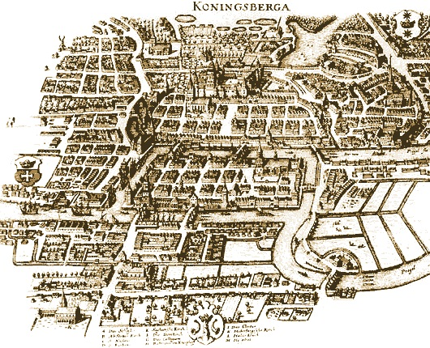{#fig-koenigsberg-a fig-align="center" width="70%"}

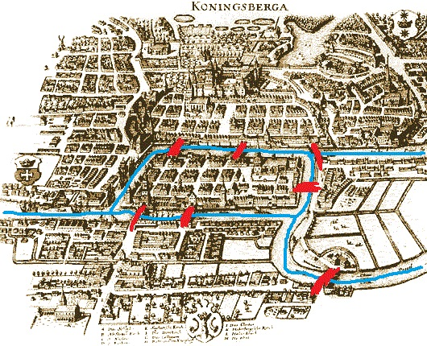{#fig-koenigsberg-aa fig-align="center" width="70%"}

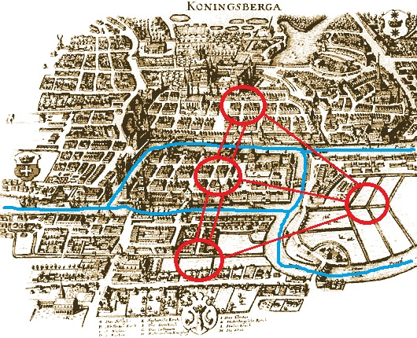{#fig-koenigsberg-aaa fig-align="center" width="70%"}

El desafío popular consistía en determinar si era posible trazar un recorrido continuo a pie por la ciudad que cruzase **cada uno de los siete puentes exactamente una sola vez** y regresase al punto de origen. Euler demostró la imposibilidad lógica de dicho recorrido abstrayendo la posición geográfica real y reduciendo la configuración espacial a un diagrama puramente topológico formado por nodos (las 4 regiones) y aristas (los 7 puentes), como se observa en la @fig-puentes-konigsberg-grafo.

{#fig-puentes-konigsberg-grafo fig-align="center" width="50%"}

La genialidad del argumento de Euler radicó en observar que para que un nodo intermedio admita un paso de entrada y salida sin repetir aristas, el número de conexiones incidentes en dicho nodo debe ser necesariamente **par**. Dado que las cuatro regiones de Königsberg poseen un grado impar de conexiones ($d(A)=5, d(B)=3, d(C)=3, d(D)=3$), el circuito euleriano deseado resulta matemáticamente imposible.

---

## Conceptos fundamentales

El estudio formal de las redes requiere definir con precisión los elementos constitutivos de un grafo, las relaciones de adyacencia e incidencia entre sus componentes y las diferentes tipologías estructurales que adopta la información según la densidad y naturaleza de sus conexiones.

### Definición formal de grafos no dirigidos y dirigidos

Desde un punto de vista algebraico y de teoría de conjuntos, un grafo es un par ordenado formado por un conjunto finitos de elementos discretos denominados vértices o nodos, y una colección de relaciones que conectan dichos nodos.

::: {.callout-note title="Definición: Grafo no dirigido y digrafo" data-kind="definicion"}
**Grafo No Dirigido**
Un **grafo no dirigido** es un par $G = (V, E)$, donde $V = \{1, 2, \dots, n\}$ representa el conjunto finito de vértices o nodos (con $|V| = n$), y $E \subseteq \{\{i, j\} : i, j \in V, i \neq j\}$ denota el conjunto de **aristas** no ordenadas (con $|E| = m$). Una arista $e = \{i, j\}$ representa una relación simétrica entre los nodos $i$ y $j$.

**Grafo Dirigido o Digrafo**
Un **digrafo** o **grafo dirigido** es un par $G = (V, U)$, donde $V = \{1, 2, \dots, n\}$ representa el conjunto de vértices, y $U \subseteq V \times V$ denota el conjunto de **arcos dirigidos** u ordenados. Un arco $u = (i, j) \in U$ parte del nodo de origen o cola $i$ y se dirige hacia el nodo de destino o cabeza $j$.
:::

Para ilustrar de forma intuitiva estas definiciones, consideremos el modelado de una red de transporte aéreo internacional representada en la @fig-red-vuelos-ejemplo.

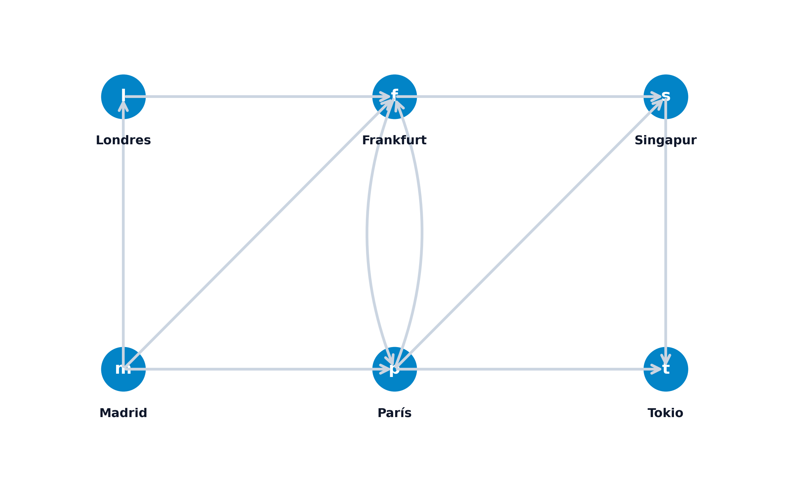{#fig-red-vuelos-ejemplo fig-align="center" width="75%"}

En la @fig-red-vuelos-ejemplo, los nodos representan los aeropuertos $V = \{m, l, p, f, s, t\}$ correspondientes a Madrid, Londres, París, Frankfurt, Singapur y Tokio. Los arcos dirigidos representan conexiones de vuelo directo de ida sin escala. Nótese que entre París ($p$) y Frankfurt ($f$) existen arcos dirigidos antiparalelos $(p, f)$ y $(f, p)$, lo que permite el tránsito bidireccional entre ambas capitales.

Por otro lado, la estructura formal de un digrafo abstracto $G=(V,U)$ puede incorporar arcos dirigidos simples, arcos antiparalelos y bucles (arcos que nacen y terminan en el mismo vértice, $(i, i) \in U$), como se detalla en la @fig-digrafo-definicion.

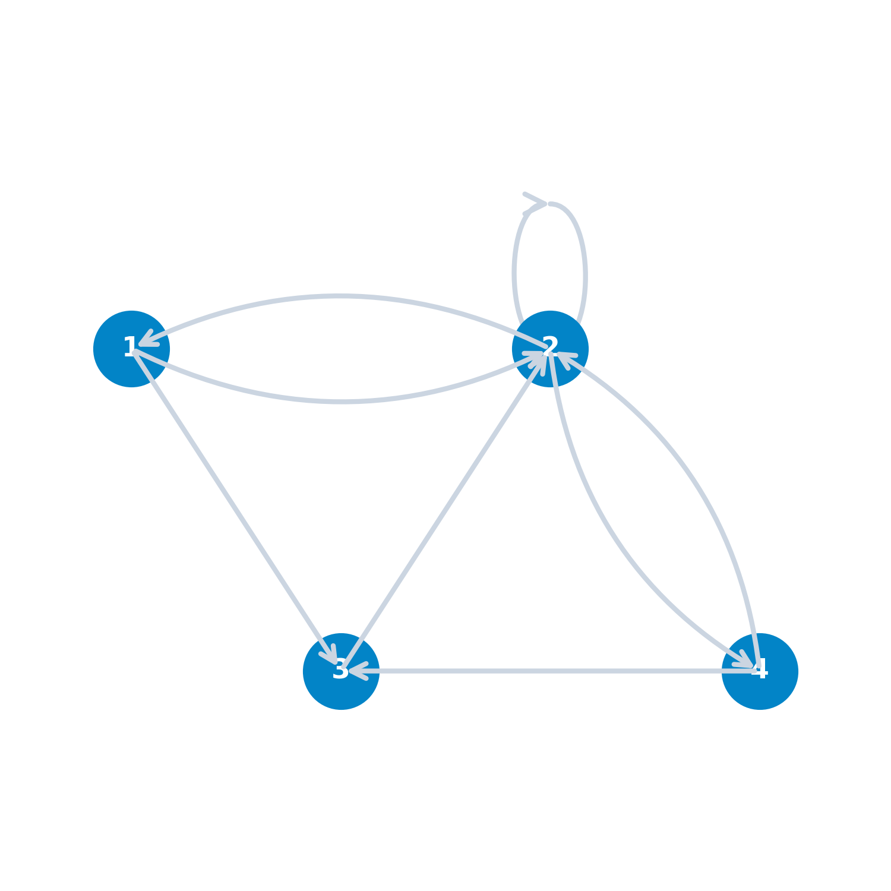{#fig-digrafo-definicion fig-align="center" width="50%"}

### Vecindades, adyacencia y grados de un nodo

Las propiedades locales de un nodo en un grafo se caracterizan analíticamente a través de sus relaciones de vecindad y su grado de conexión.

::: {.callout-note title="Definición: Adyacencia, grados e incidencia" data-kind="definicion"}
Dado un digrafo $G = (V, U)$ y un nodo $i \in V$:

*   **Nodos Adyacentes**: Dos nodos $i, j \in V$ son **adyacentes** si existe una conexión directa entre ellos, es decir, si $(i, j) \in U$ o $(j, i) \in U$. El conjunto de todos los nodos adyacentes a $i$ conforma su **vecindad total** $\Gamma(i) = \Gamma^+(i) \cup \Gamma^-(i)$.

*   **Arcos Adyacentes**: Dos arcos $u_1, u_2 \in U$ son **adyacentes** cuando comparten al menos un nodo extremo común (por ejemplo, los arcos $(1, 2)$ y $(2, 4)$ son adyacentes al conectarse en el nodo $2$).

*   **Incidencia de un Arco**: Un arco $u = (i, j) \in U$ es **incidente de salida** en su nodo origen $i$, e **incidente de entrada** en su nodo destino $j$.

**Conjunto de Sucesores y Predecesores**

*   **Sucesores**: $\Gamma^+(i) = \{j \in V : (i, j) \in U\}$, conjunto de nodos hacia los que parten arcos desde $i$.
*   **Predecesores**: $\Gamma^-(i) = \{j \in V : (j, i) \in U\}$, conjunto de nodos desde los que llegan arcos a $i$.
*   **Vecindad Total**: $\Gamma(i) = \Gamma^+(i) \cup \Gamma^-(i)$.

**Semigrados y Grado Total**

*   **Semigrado Exterior**: $d^+(i) = |\Gamma^+(i)|$, número de arcos que parten del nodo $i$.
*   **Semigrado Interior**: $d^-(i) = |\Gamma^-(i)|$, número de arcos que ingresan al nodo $i$.
*   **Grado Total**: $d(i) = d^+(i) + d^-(i)$, número total de arcos incidentes en el nodo $i$.

Un nodo $i$ con grado total $d(i) = 1$ se denomina **nodo pendiente** o **hoja**. Un nodo con $d(i) = 0$ se denomina **nodo aislado**.
:::

Como se observa geométricamente en la @fig-adyacencia-vecindades, para el nodo 3 del digrafo, su conjunto de sucesores es $\Gamma^+(3)=\{2\}$, su conjunto de predecesores es $\Gamma^-(3)=\{1, 4\}$, y su vecindad total combinada es $\Gamma(3)=\{1, 2, 4\}$.

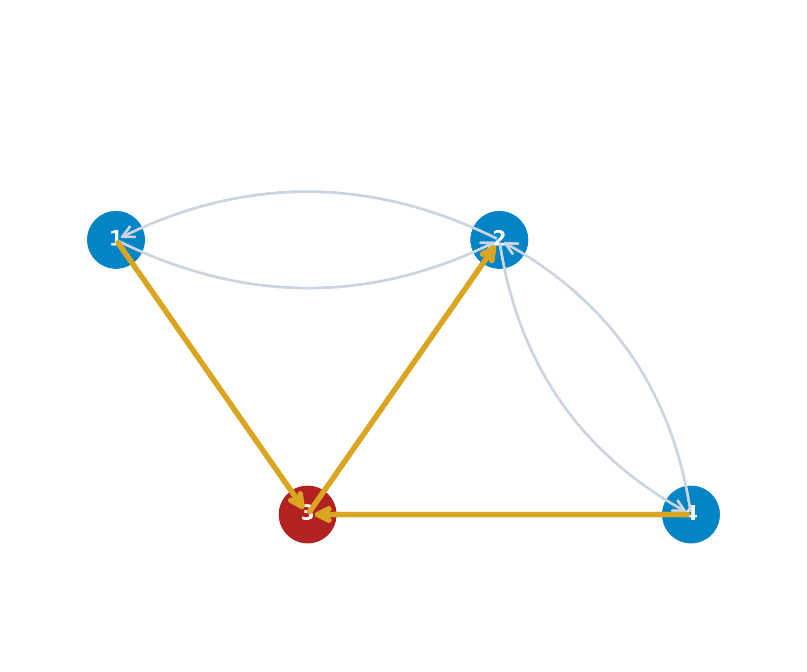{#fig-adyacencia-vecindades fig-align="center" width="60%"}

Asimismo, en la @fig-grado-nodos se representa la evaluación de los semigrados de los nodos de la red, donde el nodo 5 se identifica como un nodo pendiente al tener un grado total $d(5)=1$ ($d^+(5)=0, d^-(5)=1$).

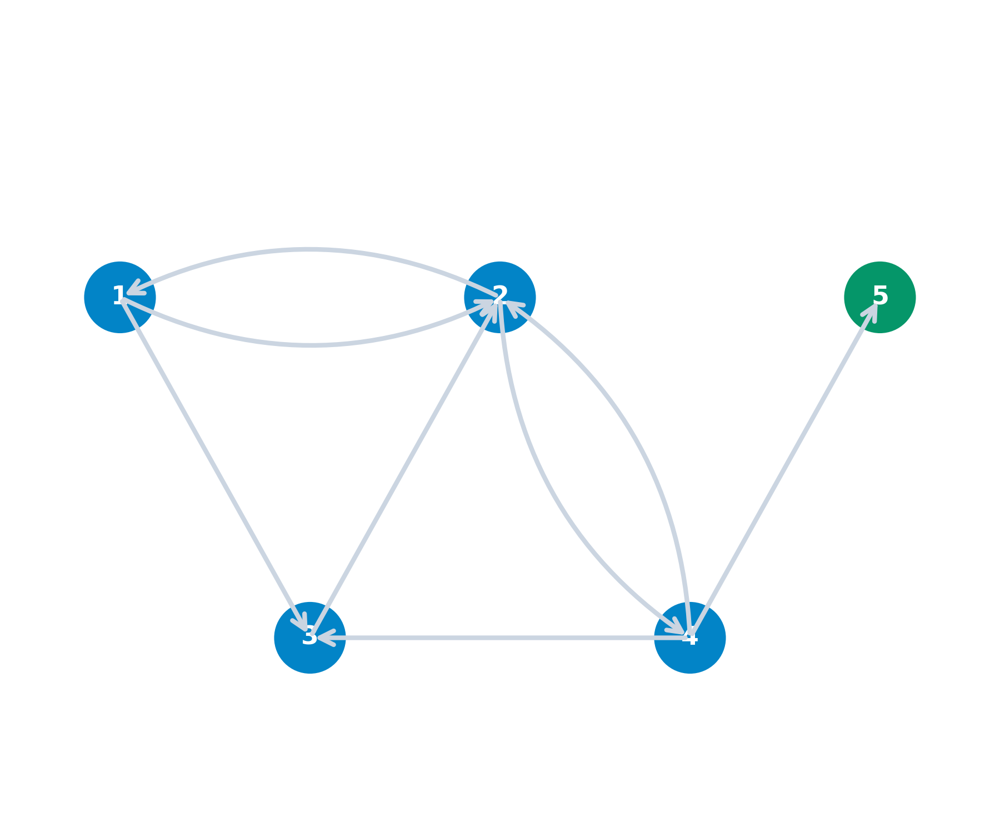{#fig-grado-nodos fig-align="center" width="60%"}

::: {.callout-important title="Teorema de la suma de grados (Handshaking Lemma)" data-kind="teorema"}
En todo grafo no dirigido $G = (V, E)$ con $|V| = n$ y $|E| = m$, la suma de los grados de todos los vértices es igual al doble del número total de aristas:
$$
\sum_{v \in V} d(v) = 2m
$$

*Demostración*:
Cada arista $e = \{u, v\} \in E$ contribuye exactamente en $1$ unidad al grado del nodo $u$ y en $1$ unidad al grado del nodo $v$. Por consiguiente, al sumar los grados de todos los nodos en $V$, cada arista del conjunto $E$ es contabilizada exactamente dos veces. $\blacksquare$
:::

### Incidencia de conjuntos y cortes

En el estudio de los flujos en redes y la conectividad, resulta esencial cuantificar los arcos que cruzan la frontera entre dos subconjuntos de vértices.

::: {.callout-note title="Definición: Incidencia de un conjunto de nodos" data-kind="definicion"}
Dado un digrafo $G = (V, U)$ y un subconjunto propio de nodos $A \subset V$:

*   **Incidencia Exterior** $w^+(A)$: Conjunto de arcos que parten de $A$ y finalizan fuera de $A$:
    $$
    w^+(A) = \{(i, j) \in U : i \in A, j \in V \setminus A\}
    $$

*   **Incidencia Interior** $w^-(A)$: Conjunto de arcos que parten de fuera de $A$ e ingresan en $A$:
    $$
    w^-(A) = \{(i, j) \in U : i \in V \setminus A, j \in A\}
    $$

*   **Corte** $w(A)$: Unión de las incidencias exterior e interior: $w(A) = w^+(A) \cup w^-(A)$.
:::

En la @fig-incidencia-corte-conjuntos se ilustra la aplicación práctica de esta definición sobre una red de 5 nodos seleccionando el subconjunto de nodos $A = \{2, 3\}$ (resaltados en color rojo ladrillo).

Para el subconjunto de nodos $A = \{2, 3\}$, la evaluación analítica de las incidencias y el corte resulta:

$$
\begin{aligned}
\textcolor{firebrick}{w^+(A) = w^+(\{2,3\})} &= \textcolor{firebrick}{\{(2,4), (3,1), (3,5)\}} \\
\textcolor{dodgerblue}{w^-(A) = w^-(\{2,3\})} &= \textcolor{dodgerblue}{\{(1,2), (4,3)\}} \\
w(A) = w(\{2,3\}) &= \{\textcolor{dodgerblue}{(1,2)}, \textcolor{firebrick}{(2,4)}, \textcolor{firebrick}{(3,1)}, \textcolor{firebrick}{(3,5)}, \textcolor{dodgerblue}{(4,3)}\}
\end{aligned}
$$

Como se refleja visualmente en el sistema de ecuaciones y en la figura:
El corte $w(A)$ cuantifica la frontera que separa el subconjunto $A$ del resto de la red. La incidencia exterior $\textcolor{firebrick}{w^+(A)}$ agrupa los arcos salientes que nacen en $A$ y se dirigen hacia los nodos exteriores, mientras que la incidencia interior $\textcolor{dodgerblue}{w^-(A)}$ agrupa los arcos entrantes desde el exterior hacia $A$. El corte total combina ambas incidencias, diferenciando los arcos que cruzan dicha frontera de aquellos que permanecen internos a $A$ o externos al mismo.

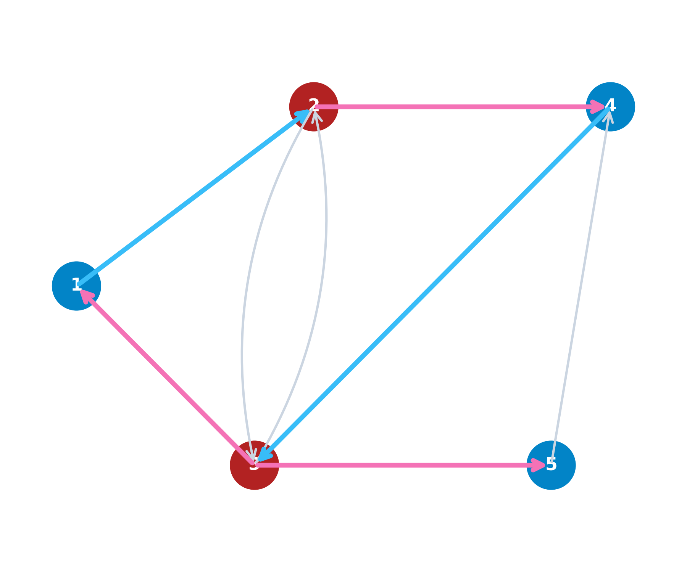{#fig-incidencia-corte-conjuntos fig-align="center" width="60%"}

### Tipología de grafos: multigrafos, grafos completos, subgrafos y grafos parciales

El modelado formal de sistemas mediante teoría de grafos requiere clasificar las redes según la multiplicidad de sus relaciones, la densidad de sus conexiones y las propiedades de sus subestructuras asociadas.

::: {.callout-note title="Definición: Multigrafos, multiplicidad y p-grafos" data-kind="definicion"}
Dado un conjunto de vértices $V$:

*   **Multigrafo / Multidigrafo**: Un **multigrafo** $G = (V, E)$ (o **multidigrafo** $G = (V, U)$) es una estructura matemática que admite la presencia de múltiples aristas o arcos en paralelo entre un mismo par de vértices.

*   **Multiplicidad**: Indica el número exacto de conexiones repetidas en paralelo entre dos vértices dados.

*   **$p$-Grafo**: Se define como un multigrafo en el que la máxima multiplicidad de cualquier arista es exactamente $p$, no existiendo pares de nodos conectados por más de $p$ aristas.
:::

En aplicaciones reales de transporte e infraestructuras, la presencia de aristas múltiples permite representar canalizaciones paralelas o rutas de autobús duplicadas entre dos mismas terminales. Como se ilustra en la @fig-multigrafos-pgrafos, se presenta una red compuesta por 4 vértices $\{a, b, c, d\}$ donde los pares $\{a, b\}$ y $\{c, d\}$ disponen de 3 conexiones en paralelo cada uno, constituyendo formalmente un $3$-grafo.

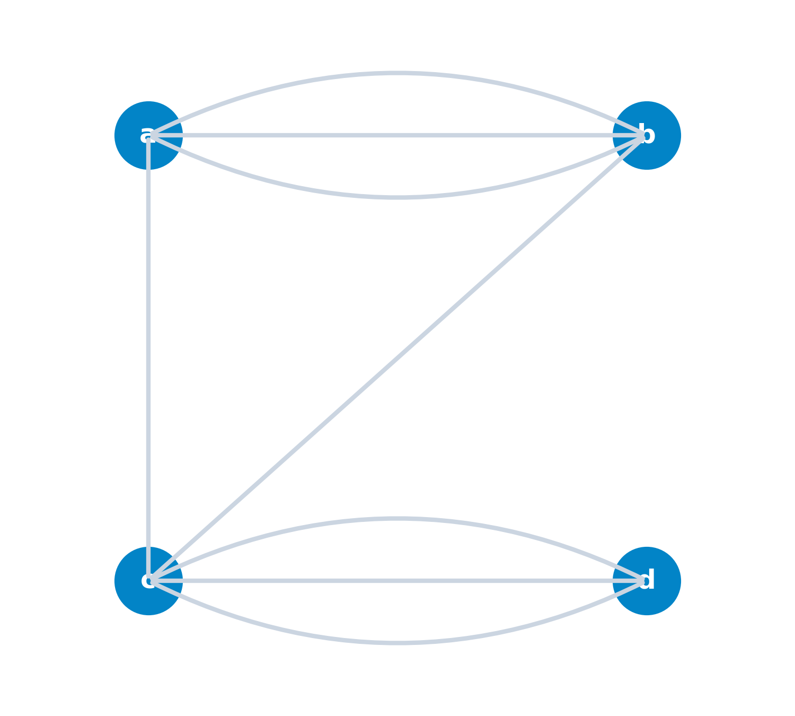{#fig-multigrafos-pgrafos fig-align="center" width="55%"}

Cuando una red carece de bucles y no presenta aristas paralelas, se dice que es un **grafo simple**. En el extremo opuesto de máxima conectividad se sitúan las redes completas.

::: {.callout-note title="Definición: Grafos simples, completos y clanes" data-kind="definicion"}
Sea $G = (V, E)$ un grafo no dirigido de $n = |V|$ vértices:

*   **Grafo Simple**: Estructura de multiplicidad 1 desprovista de autodirecciones o bucles $(i, i)$. De forma análoga se define un **digrafo simple**.

*   **Grafo Completo**: Grafo en el que todo par de vértices distintos se encuentra conectado por una arista: $\{i, j\} \in E, \forall i \neq j$.

*   **Digrafo Completo**: Digrafo $G = (V, U)$ donde para todo par de nodos distintos $i \neq j$, la ausencia de arco en un sentido implica la existencia obligatoria del arco inverso: $(i, j) \notin U \implies (j, i) \in U$.

*   **Clan $K_n$ (Clique)**: Grafo simple y completo de $n$ vértices. Contiene exactamente $m = \binom{n}{2} = \frac{n(n-1)}{2}$ aristas.
:::

La distinción entre la completitud en digrafos y en grafos no dirigidos resulta fundamental en el análisis de redes de transmisión. En un digrafo completo, la conectividad está garantizada en al menos uno de los dos sentidos para cada par de nodos. Como se observa en la @fig-digrafo-completo, sobre 4 nodos $\{a, b, c, d\}$, la pareja $(a, c)$ está conectada únicamente mediante el arco dirigido unidireccional $(a, c)$, cumpliendo estrictamente la condición de completitud orientada.

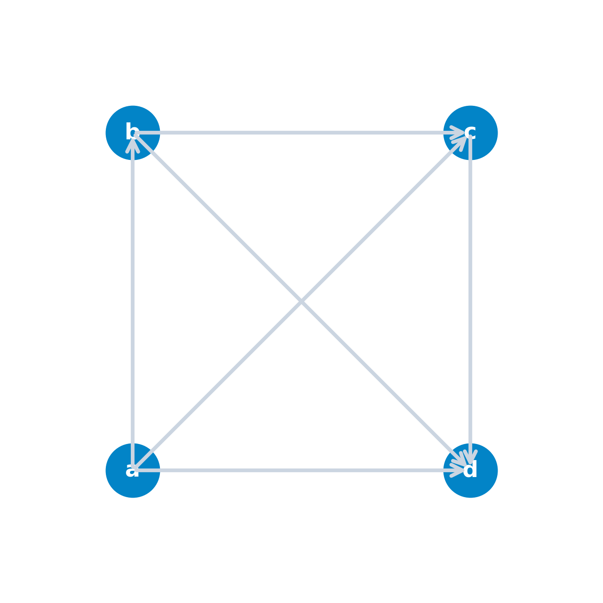{#fig-digrafo-completo fig-align="center" width="45%"}

Por su parte, cuando la simetría es total y cada vértice se comunica bidireccionalmente con todos los demás, la estructura recibe el nombre de **clan** o *clique*, denotado por $K_n$. En la @fig-clan-k4 se representa el clan $K_4$, que integra 6 aristas conectando sus 4 vértices.

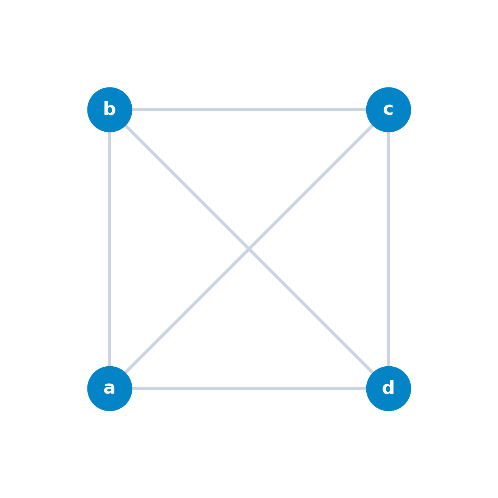{#fig-clan-k4 fig-align="center" width="40%"}

Al incrementar la dimensión a $n=5$ vértices, el número de conexiones necesarias para mantener la completitud crece de forma cuadrática alcanzando las $m = \frac{5 \times 4}{2} = 10$ aristas, tal como se muestra en la @fig-clan-k5 para el clan $K_5$.

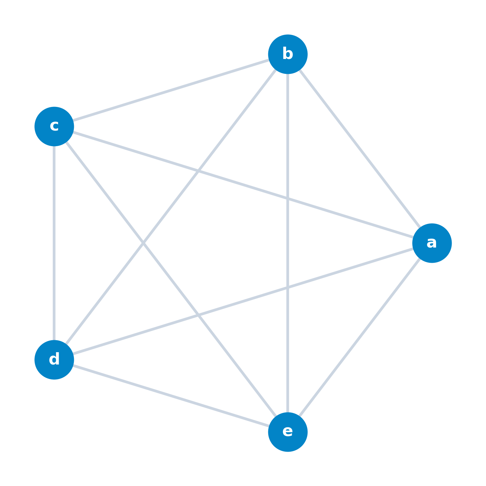{#fig-clan-k5 fig-align="center" width="40%"}

En el estudio sintáctico de grandes redes, frecuentemente se requiere extraer subestructuras más pequeñas limitando los elementos disponibles. Para ello, se distingue rigurosamente entre la extracción guiada por nodos (**subgrafo inducido**) y la extracción guiada por arcos (**grafo parcial**).

::: {.callout-note title="Definición: Subgrafo generado (inducido) y grafo parcial" data-kind="definicion"}
Dado un digrafo $G = (V, U)$ (o grafo $G = (V, E)$):

*   **Subgrafo Generado (Inducido)**: Dado un subconjunto de vértices $A \subset V$, el subgrafo generado $G_A = (A, U_A)$ conserva **únicamente** los nodos de $A$ y las relaciones cuyos dos extremos pertenecen íntegramente a $A$:
    $$
    U_A = \{u = (i, j) \in U : i, j \in A\}
    $$

*   **Grafo Parcial Generado**: Dado un subconjunto de arcos $W \subset U$, el grafo parcial $G(W) = (V, W)$ conserva el conjunto completo de $n$ vértices originales de $V$, pero restringe el conjunto de arcos a $W$.
:::

Para comprender la diferencia intuitiva entre ambas operaciones, considérese la red orientada original $G = (V, U)$ de 5 nodos y 10 arcos representada en la @fig-digrafo-base.

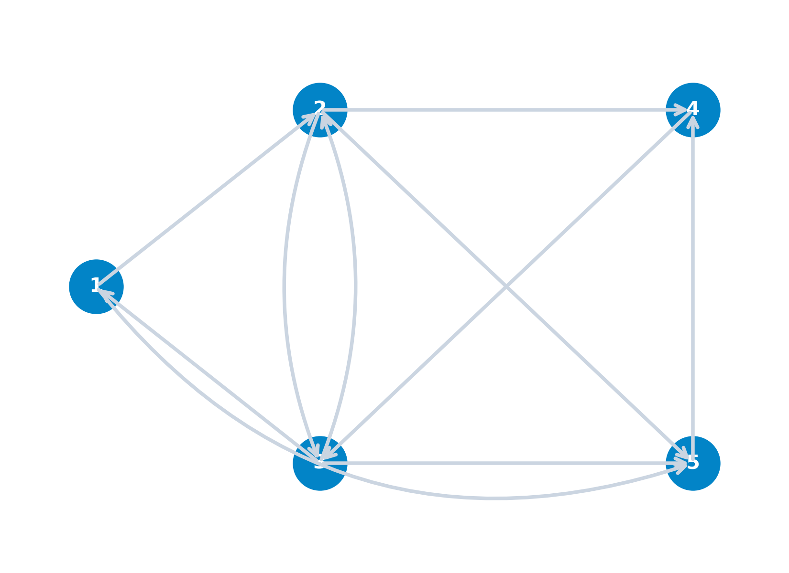{#fig-digrafo-base fig-align="center" width="50%"}

Cuando se genera un subgrafo inducido seleccionando un subconjunto de nodos $A \subset V$, los vértices que no pertenecen a $A$ desaparecen por completo de la representación geométrica y algebraica. Así, al elegir $A = \{1, 2, 5\}$, la @fig-subgrafo-a125 muestra cómo la estructura resultante $G_{\{1,2,5\}}$ conserva únicamente los 3 nodos seleccionados y los 3 arcos que conectaban a dichos nodos entre sí.

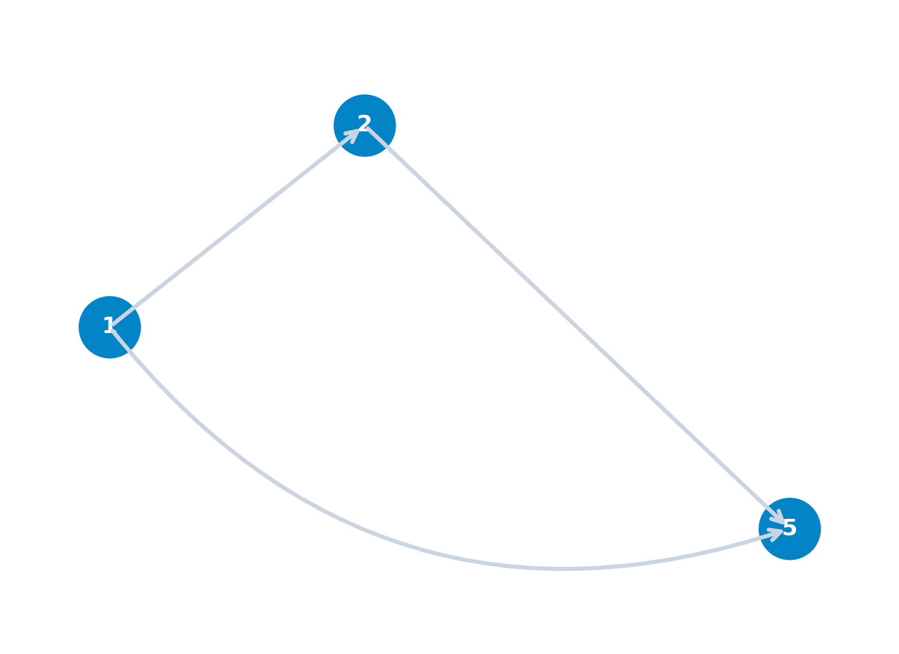{#fig-subgrafo-a125 fig-align="center" width="50%"}

Análogamente, al inducir la red sobre el subconjunto de nodos $A = \{1, 2, 3\}$, la @fig-subgrafo-a123 refleja la topología aislada $G_{\{1,2,3\}}$, compuesta estrictamente por los 3 vértices de $A$ y los 4 arcos internos que los unían en el grafo original.

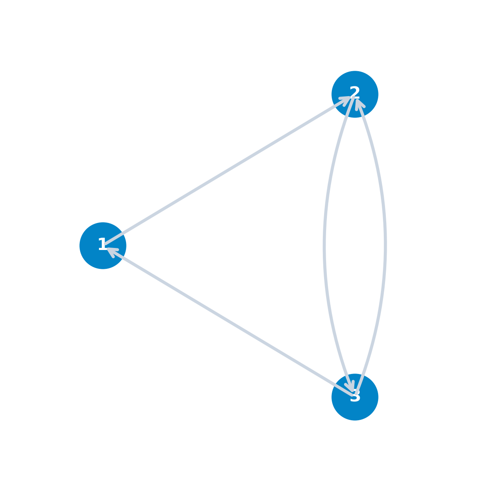{#fig-subgrafo-a123 fig-align="center" width="40%"}

Por el contrario, la extracción de un grafo parcial no altera el conjunto de vértices de la red, manteniendo siempre presentes los $n=5$ nodos de $V$. Si se selecciona el subconjunto de arcos $W = \{(1,2), (2,4), (5,4)\}$, la @fig-grafo-parcial-w1 muestra cómo el nodo 3 permanece en el grafo parcial $G(W)$ en calidad de nodo aislado sin grado de conexión ($d(3)=0$).

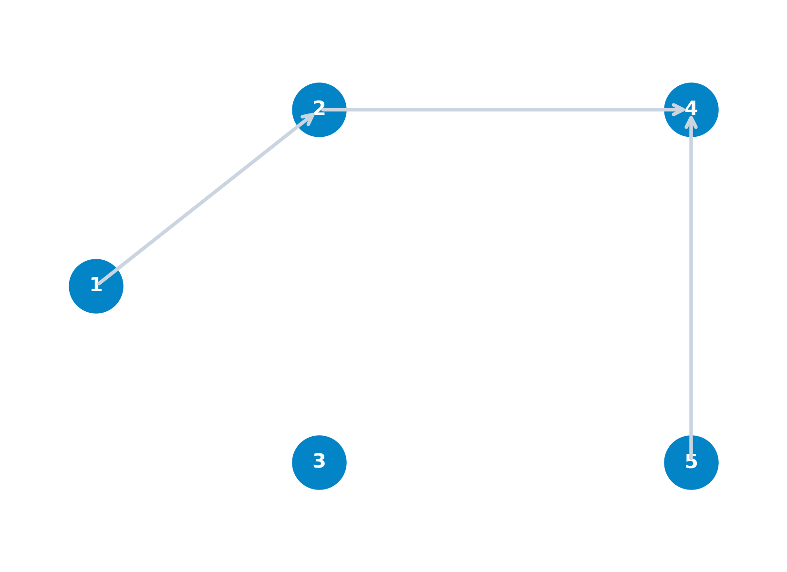{#fig-grafo-parcial-w1 fig-align="center" width="50%"}

Si en su lugar se elige el subconjunto de arcos $W = \{(1,2), (2,4), (2,5), (3,1)\}$, se obtiene el grafo parcial representado en la @fig-grafo-parcial-w2, el cual preserva los 5 vértices de $V$ conectados mediante una topología arborescente parcial.

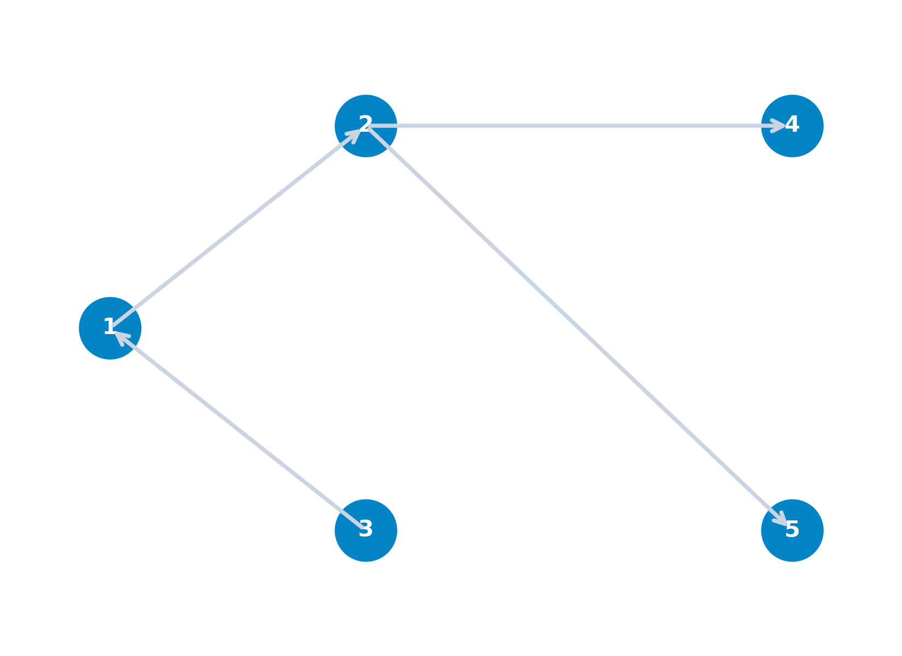{#fig-grafo-parcial-w2 fig-align="center" width="50%"}

Finalmente, en la caracterización teórica de grafos simples resulta relevante analizar las conexiones "ausentes" respecto a la red completa mediante el concepto de grafo complementario.

::: {.callout-note title="Definición: Grafo complementario" data-kind="definicion"}
Dado un grafo simple $G = (V, E)$, el **grafo complementario** $\bar{G} = (V, \bar{E})$ mantiene el mismo conjunto de vértices $V$ y está formado exactamente por las aristas no presentes en $E$:
$$
\bar{G} = (V, \bar{E}) \quad \text{tal que} \quad \{i, j\} \in \bar{E} \iff \{i, j\} \notin E \quad (\forall i \neq j)
$$
:::

En la @fig-grafo-complementario se ilustra este proceso de inversión topológica a partir de un grafo simple $G$ de 5 vértices $V = \{a, b, c, d, e\}$ y 7 aristas. Puesto que en el grafo original $G$ el vértice $b$ se encuentra conectado con todos los demás nodos, en el grafo complementario $\bar{G}$ las únicas 3 aristas resultantes son $\bar{E} = \{\{a,d\}, \{a,e\}, \{c,e\}\}$, pasando el vértice $b$ a convertirse en un nodo totalmente aislado.

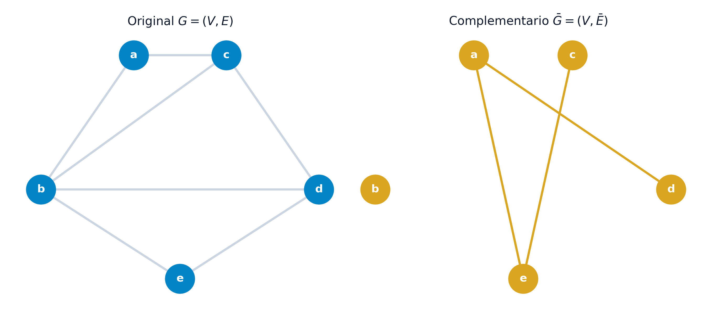{#fig-grafo-complementario fig-align="center" width="75%"}

---

## Recorridos y conectividad en redes

El análisis topológico de una red exige estudiar cómo la información, el tráfico o los flujos se desplazan a través de sus vértices y conexiones. Para ello, es preciso formalizar las secuencias de trayectorias (cadenas y caminos), cuantificar sus métricas de alcance (distancia y diámetro) y evaluar la capacidad global de comunicación e integridad del grafo mediante el concepto de conectividad.

### Cadenas y caminos

En la teoría de redes orientadas [@ahuja1993network], el estudio del movimiento a través de los arcos requiere distinguir entre recorridos que respetan la orientación de las flechas (caminos) y recorridos que transitan los arcos sin importar su dirección (cadenas).

::: {.callout-note title="Definición: Cadena, camino, elementalidad y simplicidad" data-kind="definicion"}
Dado un digrafo $G = (V, U)$:

*   **Cadena**: Secuencia de arcos adyacentes $\mu = (u_1, u_2, \dots, u_q)$ de longitud $q \ge 1$ entre los nodos extremos $i$ y $j$ ($\mu[i, j]$) en la que los arcos pueden recorrerse a favor o en contra de su orientación original.

*   **Camino**: Cadena orientada en la que todos los arcos se transitan estrictamente a favor de su sentido; es decir, el nodo final de $u_k$ coincide con el nodo inicial de $u_{k+1}$ para todo $k = 1, \dots, q-1$.

*   **Elemental**: Una cadena o camino es **elemental** si no repite ningún vértice en su recorrido.

*   **Simple**: Una cadena o camino es **simple** si no repite ningún arco en su recorrido.
:::

Para analizar las propiedades de simplicidad y elementalidad sobre redes orientadas, considérese la red de 6 aeropuertos internacionales $V = \{m, l, p, f, s, t\}$ (Madrid, Londres, París, Frankfurt, Singapur y Tokio).

Un primer caso lo constituye la cadena $\mu^1[m, p] = \{(m, l); (l, f); (p, f)\}$, de longitud $q=3$. Este recorrido resulta ser **elemental y simple**, ya que transita por los 4 vértices $\{m, l, f, p\}$ sin repetir ninguno y recorre 3 arcos distintos. Puesto que el arco $(p, f)$ se atraviesa en sentido inverso (desde $f$ hasta $p$), se trata de una cadena y no de un camino. La @fig-cadena-mu1 ilustra este trayecto en la red.

![Cadena mu1[m, p] elemental y simple con el arco (p, f) recorrido en sentido inverso](images/cadena_ejemplo_mu1.png){#fig-cadena-mu1 fig-align="center" width="55%"}

Cuando la trayectoria respeta la dirección de todas las flechas y no repite elementos, se genera un camino perfecto. La secuencia $\mu^2[p, t] = \{(p, f); (f, s); (s, t)\}$ entre París ($p$) y Tokio ($t$) constituye un **camino elemental y simple** de longitud $q=3$. Como se observa en la @fig-cadena-mu2, los tres arcos avanzan fluidamente en el sentido marcado por la red.

![Camino mu2[p, t] elemental y simple con todos los arcos en sentido directo](images/cadena_ejemplo_mu2.png){#fig-cadena-mu2 fig-align="center" width="55%"}

Es posible que un recorrido no repita ningún arco pero sí vuelva a pasar por un vértice previamente visitado. La cadena $\mu^3[m, p] = \{(m, p); (p, f); (f, s); (p, s); (p, t)\}$, de longitud $q=5$, es **no elemental y sí simple**. Como refleja la @fig-cadena-mu3, la trayectoria visita dos veces el nodo $p$ ($m \to p \to f \to s \to p \to t$), pero mantiene la simplicidad al no duplicar ninguno de sus 5 arcos.

![Cadena mu3[m, p] no elemental y sí simple con visita duplicada al nodo p](images/cadena_ejemplo_mu3.png){#fig-cadena-mu3 fig-align="center" width="55%"}

Por último, cuando un recorrido duplica tanto nodos como conexiones, pierde ambas propiedades. La cadena $\mu^4 = \{(l, f); (f, s); (p, s); (p, f); (f, s); (s, t)\}$, de longitud $q=6$, es **ni elemental ni simple**. Como muestra la @fig-cadena-mu4, el arco $(f, s)$ se transita dos veces en instantes distintos del recorrido.

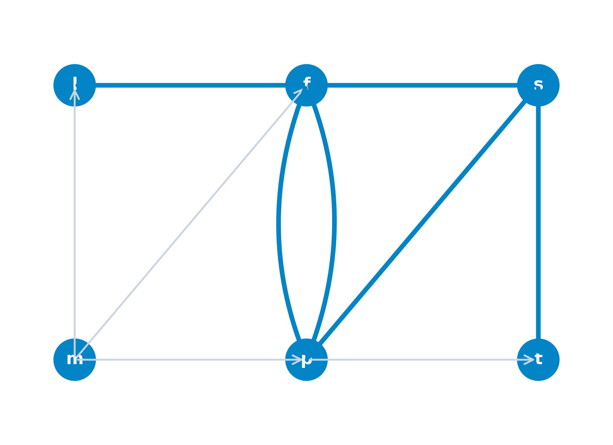{#fig-cadena-mu4 fig-align="center" width="55%"}

::: {.callout-tip title="Ejemplo: Clasificación de cadenas en grafos (elementalidad y simplicidad)" data-kind="ejemplo" collapse="true"}
Considérese un grafo no dirigido sobre 5 vértices $V = \{1, 2, 3, 4, 5\}$ y el análisis de las propiedades de elementalidad y simplicidad para tres cadenas distintas:

1.  **Cadena $\mu_1 = \{\{1,2\}, \{2,3\}, \{3,4\}, \{4,5\}\}$**: Visita 5 vértices distintos sin duplicar ninguno ($\{1,2,3,4,5\}$) y transita por 4 aristas distintas. Por consiguiente, resulta ser una cadena **elemental y simple**.

2.  **Cadena $\mu_2 = \{\{1,2\}, \{2,3\}, \{3,4\}, \{4,2\}, \{2,5\}\}$**: Recorre 5 aristas distintas sin repetir ninguna (conserva la simplicidad), pero el nodo 2 es visitado dos veces durante la secuencia ($1 \to 2 \to 3 \to 4 \to 2 \to 5$). Por tanto, es una cadena **simple pero no elemental**.

3.  **Cadena $\mu_3 = \{\{1,2\}, \{2,4\}, \{4,3\}, \{3,2\}, \{2,1\}\}$**: Duplica vértices (visita 2 múltiples veces) y además transita por la arista $\{1,2\}$ dos veces (en ida y vuelta). Por tanto, es una cadena **ni elemental ni simple**.

::: {.content-visible when-format="html"}
::: {#fig-cadenas-clasificacion-animado}
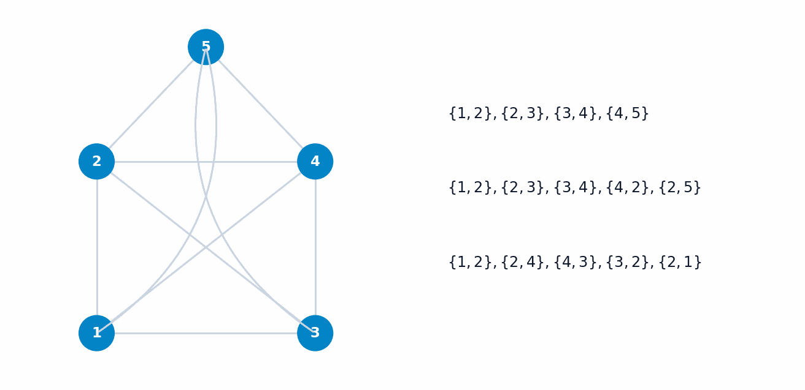

<dialog id="cadenas_clasificacion-dialog" style="border:none; border-radius:10px; padding:0; width:88vw; max-width:88vw; height:84vh; max-height:84vh; box-shadow:0 20px 60px rgba(0,0,0,0.55); overflow:hidden; background:#fff;">
  <button onclick="document.getElementById('cadenas_clasificacion-dialog').close()"
          style="position:absolute; top:10px; right:14px; z-index:10; background:rgba(15,23,42,0.6); color:#fff; border:none; border-radius:50%; width:30px; height:30px; font-size:17px; cursor:pointer; line-height:1; display:flex; align-items:center; justify-content:center;">×</button>
  <iframe src="images/cadenas_clasificacion_player.html" width="100%" height="100%" style="border:none; display:block;" scrolling="no"></iframe>
</dialog>

Animación paso a paso de la clasificación de cadenas según su elementalidad y simplicidad.
:::
:::

::: {.content-visible when-format="pdf"}
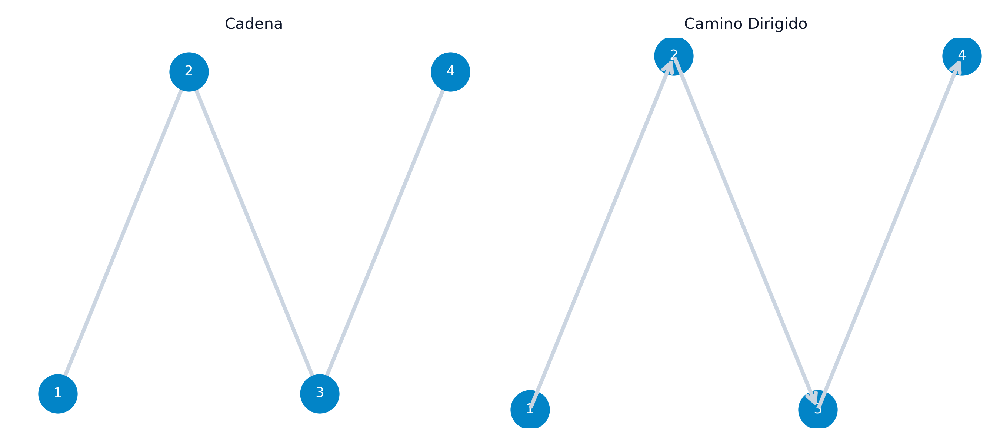{#fig-cadenas-clasificacion-animado fig-align="center" width="75%"}
:::
:::

::: {.callout-tip title="Ejemplo: Clasificación de caminos dirigidos (elementalidad y simplicidad)" data-kind="ejemplo" collapse="true"}
Considérese una red dirigida sobre 7 vértices $V = \{a, b, c, d, e, f, g\}$ y el análisis de las propiedades de elementalidad y simplicidad para tres caminos orientados:

1.  **Camino $P_1 = ((a,b), (b,c), (c,e), (e,f))$**: Transita en sentido directo por 5 vértices distintos ($a \to b \to c \to e \to f$) y 4 arcos distintos. Por tanto, es un **camino elemental y simple**.

2.  **Camino $P_2 = ((c,g), (g,f), (f,b), (b,c), (c,e))$**: Recorre 5 arcos distintos sin duplicar ninguno (conserva la simplicidad), pero el nodo $c$ es visitado dos veces durante el recorrido ($c \to g \to f \to b \to c \to e$). Por tanto, es un **camino simple pero no elemental**.

3.  **Camino $P_3 = ((c,e), (e,f), (f,b), (b,c), (c,e), (e,g))$**: Repite vértices ($c$ y $e$) y además recorre el arco directed $(c,e)$ dos veces. Por tanto, es un **camino ni elemental ni simple**.

::: {.content-visible when-format="html"}
::: {#fig-caminos-clasificacion-animado}
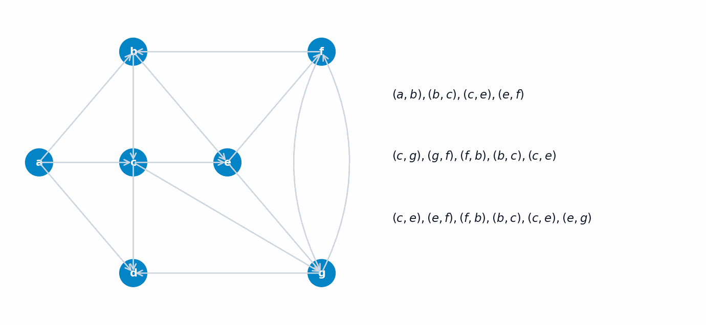

<dialog id="caminos_clasificacion-dialog" style="border:none; border-radius:10px; padding:0; width:88vw; max-width:88vw; height:84vh; max-height:84vh; box-shadow:0 20px 60px rgba(0,0,0,0.55); overflow:hidden; background:#fff;">
  <button onclick="document.getElementById('caminos_clasificacion-dialog').close()"
          style="position:absolute; top:10px; right:14px; z-index:10; background:rgba(15,23,42,0.6); color:#fff; border:none; border-radius:50%; width:30px; height:30px; font-size:17px; cursor:pointer; line-height:1; display:flex; align-items:center; justify-content:center;">×</button>
  <iframe src="images/caminos_clasificacion_player.html" width="100%" height="100%" style="border:none; display:block;" scrolling="no"></iframe>
</dialog>

Animación paso a paso de la clasificación de caminos dirigidos según su elementalidad y simplicidad.
:::
:::

::: {.content-visible when-format="pdf"}
{#fig-caminos-clasificacion-animado fig-align="center" width="75%"}
:::

:::

Además del estudio de la elementalidad y la simplicidad de las cadenas, la cuantificación de la métrica de los recorridos permite caracterizar la extensión global y la compacidad de una red.

::: {.callout-note title="Definición: Longitud, distancia geodésica y diámetro" data-kind="definicion"}
Dado un digrafo $G = (V, U)$ (o grafo $G = (V, E)$):

*   **Longitud de una Cadena**: Número exacto de arcos o aristas $q$ que componen la secuencia $\mu$.

*   **Distancia Geodésica $d(i, j)$**: Longitud de la cadena más corta existente entre el nodo $i$ y el nodo $j$.

*   **Diámetro de un Grafo $D(G)$**: Mayor distancia geodésica entre cualquier par de nodos de la red:
    $$
    D(G) = \max_{i, j \in V} d(i, j)
    $$
:::

En la @fig-diametro-grafo se ilustra la evaluación del diámetro sobre la red orientada de 5 nodos $V = \{1, 2, 3, 4, 5\}$. Al analizar la distancia geodésica entre cada par de vértices (como la conexión entre los nodos 1 y 4 a través de la cadena de 2 arcos $\{(1,2), (2,4)\}$, o entre los nodos 3 y 4 a través de $\{(3,2), (2,4)\}$), se comprueba que la máxima distancia necesaria para comunicar cualquier pareja de nodos en la red es de 2 arcos. Por consiguiente, el diámetro global del grafo es $D(G) = 2$.

{#fig-diametro-grafo fig-align="center" width="55%"}

::: {.callout-warning title="Advertencia: Diferencia fundamental entre cadena y camino" data-kind="advertencia"}
Para sintetizar las propiedades de recorrido en redes orientadas y no dirigidas, conviene destacar la distinción conceptual entre cadena y camino:

*   **Cadena**: Secuencia de arcos o aristas adyacentes que **no exige respetar la orientación de las flechas**. Los arcos pueden recorrerse tanto en sentido directo como en sentido inverso. Caracteriza la **conectividad puramente sintáctica o topológica** entre dos nodos.

*   **Camino**: Secuencia de arcos orientados en la que **todos los arcos se transitan estrictamente en el sentido de su flecha** (el nodo destino del $k$-ésimo arco es el nodo origen del $(k+1)$-ésimo). Describe la **posibilidad real de circulación de flujo o transporte** en la red.

En consecuencia, **todo camino dirigido es una cadena**, pero **no toda cadena constituye un camino**. En redes no dirigidas (donde las aristas carecen de orientación), las nociones de cadena y camino resultan formalmente equivalentes.
:::

### Conectividad

La accesibilidad entre los vértices determina la capacidad global de comunicación e integridad estructural de una red. En grafos no dirigidos, la existencia de recorridos entre sus nodos permite definir la noción de conexidad global, mientras que en redes orientadas es preciso distinguir entre la mera conectividad sintáctica (existencia de cadenas) y la conectividad efectiva de transporte (existencia de caminos dirigidos).

::: {.callout-note title="Definición: Grafo conexo y digrafo fuertemente conexo" data-kind="definicion"}
Dado un grafo $G = (V, E)$ o digrafo $G = (V, U)$:

*   **Grafo Conexo**: Un grafo no dirigido es **conexo** si entre cualquier par de vértices $i, j \in V$ existe al menos una **cadena**.

*   **Digrafo Fuertemente Conexo**: Un digrafo es **fuertemente conexo** si entre cualquier par de vértices $i, j \in V$ existe al menos un **camino dirigido** en ambas direcciones (de $i$ a $j$ y de $j$ a $i$).
:::

En la @fig-digrafo-conexidad se ilustra un digrafo sobre 7 vértices $V = \{a, b, c, d, e, f, g\}$. Este digrafo resulta ser **conexo** en el sentido débil (al existir cadenas no orientadas que comunican todos los nodos), pero **no es fuertemente conexo**. El vértice $d$ actúa como un nodo sumidero al que convergen únicamente arcos entrantes desde $a, c, g$, impidiendo la existencia de cualquier camino saliente que conecte a $d$ con los demás vértices de la red.

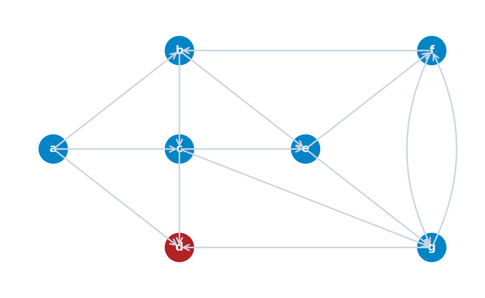{#fig-digrafo-conexidad fig-align="center" width="60%"}

Cuando una red carece de conexidad global, esta se disgrega de forma natural en subgrafos independientes aislados denominados **componentes conexas**. Esta descomposición se formaliza rigurosamente mediante la definición de una relación de equivalencia sobre el conjunto de vértices.

::: {.callout-note title="Definición: Relación de conexidad y componentes conexas" data-kind="definicion"}
En un grafo $G = (V, E)$ o digrafo $G = (V, U)$, se define la relación binaria $R$ sobre el conjunto de vértices $V$:
$$
\forall i, j \in V, \quad i \, R \, j \iff \exists \text{ una cadena entre } i \text{ y } j
$$

La relación $R$ constituye una **relación de equivalencia** al satisfacer tres propiedades fundamentales:

*   **Reflexiva**: Todo nodo está relacionado consigo mismo ($i \, R \, i$) mediante una cadena trivial de longitud 0.

*   **Simétrica**: Si existe una cadena de $i$ a $j$, invirtiendo el orden de recorrido se obtiene una cadena de $j$ a $i$ ($i \, R \, j \implies j \, R \, i$).

*   **Transitiva**: Si existe una cadena de $i$ a $j$ y otra de $j$ a $k$, la concatenación de ambas forma una cadena de $i$ a $k$ ($i \, R \, j \land j \, R \, k \implies i \, R \, k$).

Las clases de equivalencia inducidas por $R$ sobre $V$ determinan la partición del grafo en sus **componentes conexas**.
:::

En la @fig-componentes-conexas-dos se presenta un grafo descompuesto en dos componentes conexas disjuntas: la primera integrada por los vértices $\{a, b, c, d\}$ con las aristas $\{\{a,b\}, \{b,c\}, \{c,d\}, \{b,d\}\}$, y la segunda constituida por los vértices $\{e, f, g\}$ con las aristas $\{\{e,f\}, \{f,g\}\}$.

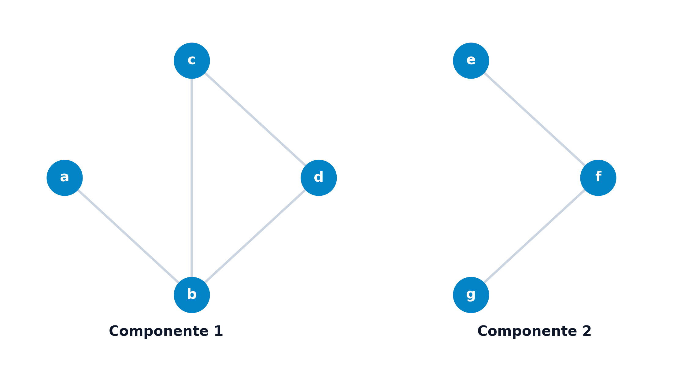{#fig-componentes-conexas-dos fig-align="center" width="65%"}

El análisis de los recorridos cerrados, aquellos cuyo vértice inicial y final coinciden, permite caracterizar la presencia de redundancias en la red y definir los grafos conexos acíclicos, denominados **árboles**, que desempeñan un papel central en la optimización de infraestructuras.

::: {.callout-note title="Definición: Ciclo, bucle, circuito y árbol" data-kind="definicion"}
Dado un grafo $G = (V, E)$ o digrafo $G = (V, U)$:

*   **Ciclo**: Una **cadena simple** cuyo nodo inicial y nodo final coinciden ($v_0 = v_k$).

*   **Bucle**: Un ciclo formado por una única arista o arco que conecta un vértice consigo mismo.

*   **Circuito**: Un **camino simple** en el que el nodo inicial y el nodo final coinciden ($v_0 = v_k$).

*   **Árbol**: Un **grafo conexo sin ciclos**.
:::

En la @fig-arboles-ciclos-ejemplos se comparan dos estructuras topológicas básicas: a la izquierda, un grafo que contiene el ciclo elemental en triángulo $\{\{a,b\}, \{b,c\}, \{c,a\}\}$; a la derecha, una red en estrella centrada en el nodo $a$ conectada a 8 vértices periféricos $\{b, c, d, e, f, g, h, i\}$ que constituye un árbol conexo acíclico.

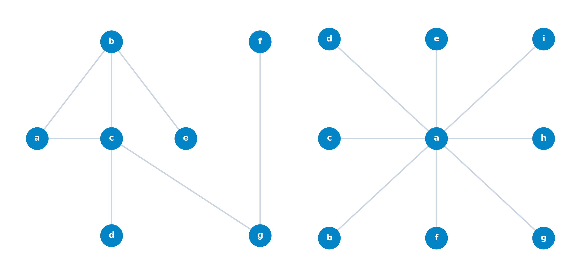{#fig-arboles-ciclos-ejemplos fig-align="center" width="85%"}

La presencia de ciclos impone restricciones estructurales muy precisas sobre los grados de los vértices y la conectividad del grafo, recogidas en el siguiente teorema.

::: {.callout-important title="Teorema: Propiedades estructurales de los ciclos y árboles" data-kind="teorema"}
Para todo grafo conexo $G = (V, E)$ con $n = |V| > 1$ vértices, se verifican las siguientes propiedades fundamentales:

1.  **Ausencia de vértices pendientes**: Si $G$ no posee vértices pendientes (es decir, todos sus nodos tienen grado $\delta(v) \ge 2$), entonces $G$ contiene **al menos un ciclo**.

2.  **Existencia de hojas en árboles**: Si $G$ es un árbol conexo sin ciclos, entonces $G$ contiene **al menos un vértice pendiente** (hoja con $\delta(v) = 1$).

3.  **Caracterización de aristas en ciclos**: Una arista $e \in E$ pertenece a un ciclo $\mu$ de $G$ si y solo si su eliminación no desconecta el grafo; es decir, $G \setminus \{e\}$ continúa siendo un grafo conexo.
:::

Estas propiedades estructurales constituyen el fundamento sobre el que se edifican los algoritmos de búsqueda y construcción de árboles de expansión mínima (como los algoritmos de Kruskal y Prim) que se estudiarán en las secciones posteriores.

---

## Grafos planares y grafos bipartitos

Una propiedad fundamental en el estudio topológico de redes es la capacidad de representar un grafo geométricamente sobre el plano bidimensional $\mathbb{R}^2$ de manera que sus aristas no se intersecten. La disposición geométrica sobre el plano resulta crítica en aplicaciones reales como el diseño de circuitos impresos (PCB), el trazado de mapas de carreteras o la canalización de infraestructuras subterráneas de transporte de energía y fluidos.

::: {.callout-note title="Definición: Grafo planar e incrustación planar" data-kind="definicion"}
Un grafo $G = (V, E)$ se denomina **planar** si admite una representación geométrica en el plano bidimensional de modo que sus aristas no se crucen ni se corten entre sí en ningún punto distinto de sus vértices extremos.

Se denomina **incrustación planar** a cualquier dibujo plano de $G$ exento de intersecciones entre aristas. Una incrustación planar divide el plano en subconjuntos conexos acotados y no acotados denominados **caras** o **regiones** $r$. Todo grafo planar posee exactamente **una región exterior no acotada**.
:::

Un mismo grafo abstracto admite múltiples diagramaciones geométricas sobre el plano. En la @fig-k4-planaridad se ilustra esta propiedad mediante el grafo completo sobre 4 vértices $K_4$: la representación convencional de la izquierda presenta dos aristas diagonales cruzándose en un punto central; sin embargo, al recolocar el vértice $a$ en la región interior acotada por el triángulo $\{b, c, d\}$ (representación derecha), se obtiene un dibujo equivalente exento de intersecciones. Por tanto, el grafo completo $K_4$ es **planar**.

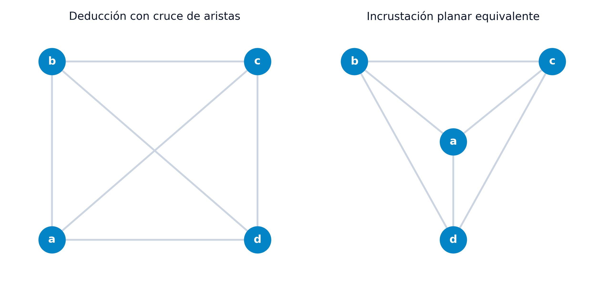{#fig-k4-planaridad fig-align="center" width="75%"}

Los grafos completos de menor orden ($K_2, K_3, K_4$) son todos planares. Sin embargo, al incrementar el número de vértices, la saturación de conexiones impide mantener la planaridad. En 1840, el matemático August Möbius planteó esta limitación mediante un célebre problema acertijo:

> *"Un rey ordenó en su testamento que, tras su muerte, su reino fuera dividido entre sus 5 hijos en 5 regiones contiguas de forma que cada región tuviera frontera común con todas las demás 4 regiones. ¿Es posible cumplir la voluntad del rey?"*

La respuesta matemática es **negativa**. El cumplimiento del testamento requeriría la existencia de un mapa cuyo grafo dual de fronteras fuera un grafo completo con 5 vértices, $K_5$, en el que cada par de vértices tuviera una arista de colindancia. Como se ilustra en la @fig-k5-mobius, el grafo completo $K_5$ (con 5 vértices y 10 aristas) resulta ser un **grafo no planar**, puesto que cualquier intento de incrustar sus aristas en el plano genera al menos un cruce inevitable.

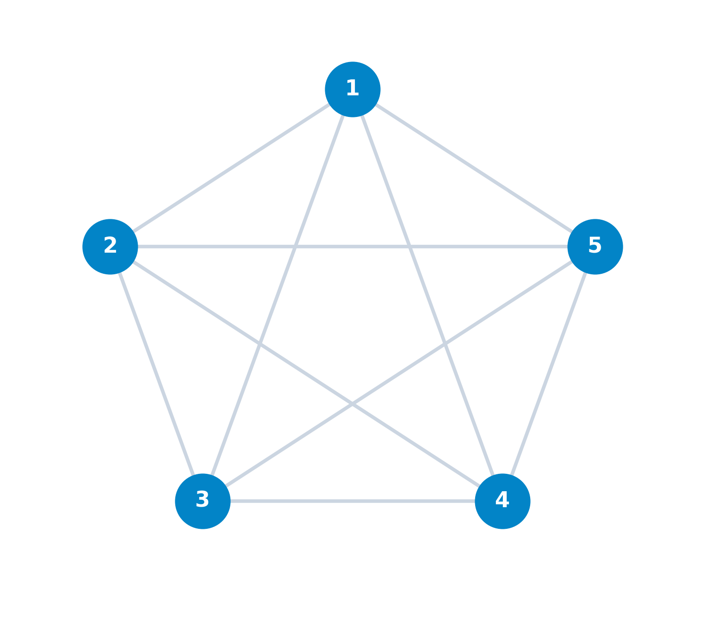{#fig-k5-mobius fig-align="center" width="45%"}

Además de los grafos completos, existe otra importante familia de redes asociadas a problemas de asignación e interconexión: los **grafos bipartitos**.

::: {.callout-note title="Definición: Grafo bipartito y bipartito completo" data-kind="definicion"}
Un grafo $G = (V, E)$ es **bipartito** si su conjunto de vértices admite una partición en dos subconjuntos disjuntos:
$$
V = V_1 \cup V_2, \quad V_1 \cap V_2 = \emptyset
$$
de modo que toda arista de $E$ conecta un vértice de $V_1$ con un vértice de $V_2$ (no existen aristas uniendo vértices dentro del mismo subconjunto).

Un **grafo bipartito completo** $K_{n_1, n_2}$ es un grafo bipartito con $|V_1| = n_1$ y $|V_2| = n_2$ que contiene todas las $n_1 \cdot n_2$ aristas posibles entre ambos subconjuntos:
$$
\{v_1, v_2\} \in E, \quad \forall v_1 \in V_1, \, \forall v_2 \in V_2
$$
:::

Una propiedad estructural fundamental que caracteriza analíticamente a la familia de los grafos bipartitos se formaliza en el siguiente teorema:

::: {.callout-important title="Teorema: Caracterización de grafos bipartitos" data-kind="teorema"}
Un grafo $G = (V, E)$ es **bipartito** si y solo si **no contiene ningún ciclo de longitud impar**.
:::

El análisis de la planaridad en grafos bipartitos se halla históricamente ligado al célebre *Problema de los tres servicios* (suministro de agua $A$, gas $G$ y electricidad $E$ a tres casas $C_1, C_2, C_3$), popularizado por Henry Ernest Dudeney [@dudeney1958amusements]:

> *"¿Es posible canalizar las conducciones subterráneas de tres suministros esenciales (agua, gas y electricidad) hacia tres viviendas independientes de modo que ninguna tubería o cable se cruce con otro en el plano?"*

Desde la perspectiva de la teoría de redes, este acertijo plantea formalmente si el grafo bipartito completo $K_{3,3}$ (formado por $n_1=3$ fuentes de suministro y $n_2=3$ casas, sumando $n=6$ vértices y $m=9$ aristas) admite o no una incrustación planar.

Como se ilustra en la @fig-k33-bipartito, la disposición bipartita estándar en dos columnas paralelas (a la izquierda) exhibe de forma explícita la saturación de conexiones ($3 \times 3 = 9$ aristas) con múltiples cruces inevitables. Incluso si se intenta reorganizar libremente la posición de los vértices en el plano (a la derecha) para trazar las conducciones mediante trayectorias curvas bordeando los nodos, se comprueba que tras conectar exitosamente 8 de los trazados, la novena arista queda confina dentro de una región delimitada por las conducciones anteriores, resultando imposible completar el tendido sin interceptar una arista preexistente. En consecuencia, la respuesta al acertijo de Dudeney es **negativa** y se concluye que el grafo bipartito completo $K_{3,3}$ es un **grafo no planar**.

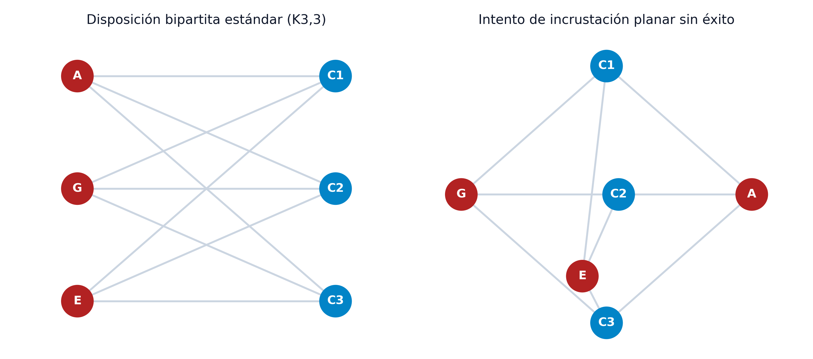{#fig-k33-bipartito fig-align="center" width="85%"}

Los grafos $K_5$ y $K_{3,3}$ representan las dos estructuras elementales "obstructoras" que impiden que una red pueda ser dibujada en el plano. Para caracterizar la planaridad en grafos arbitrarios de mayor escala, se introduce el concepto de **homeomorfismo**.

::: {.callout-note title="Definición: Grafos homeomórficos" data-kind="definicion"}
Dos grafos $G_1$ y $G_2$ se dicen **homeomórficos** (o homeomorfos) si uno de ellos puede obtenerse a partir del otro mediante una secuencia finita de operaciones de **subdivisión elemental de aristas** (insertar un nodo de grado 2 en medio de una arista) o de suprimir vértices de grado 2.
:::

En 1930, el matemático polaco Kazimierz Kuratowski formuló la caracterización definitiva que resuelve el problema de la planaridad en la teoría de grafos.

::: {.callout-important title="Teorema: Teorema de Kuratowski (1930)" data-kind="teorema"}
Un grafo $G = (V, E)$ es **planar** si y solo si no contiene ningún subgrafo parcial que sea **homeomórfico** a $K_5$ ó a $K_{3,3}$:
$$
G \text{ es no planar} \iff \exists H \subseteq G \text{ tal que } H \text{ es homeomorfo a } K_5 \text{ ó } K_{3,3}
$$
:::

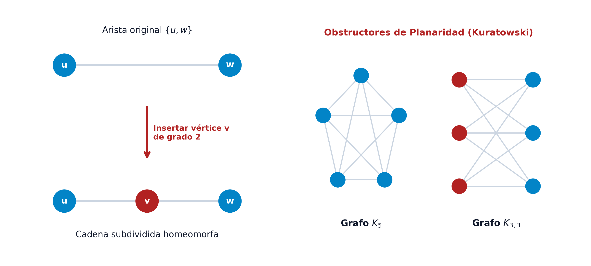{#fig-kuratowski-homeomorfismo fig-align="center" width="85%"}

Un caso emblemático de aplicación del Teorema de Kuratowski lo constituye el **Grafo de Petersen**, un grafo 3-regular formado por 10 vértices y 15 aristas (integrado por una estrella pentagonal interior inscrita en un pentágono exterior).

::: {.callout-note title="Definición: Grafo de Petersen y sus propiedades" data-kind="definicion"}
El **Grafo de Petersen** es un grafo 3-regular (todos sus vértices poseen grado exactamente $\delta(v) = 3$) que satisface las siguientes propiedades combinatorias únicas:

*   Dos vértices adyacentes cualesquiera no comparten ningún vecino en común.

*   Dos vértices no adyacentes cualesquiera comparten exactamente un vecino en común.
:::

Como se ilustra en la @fig-petersen-homeomorfismo, a pesar de su elevada simetría geométrica, el **Grafo de Petersen es no planar**. La demostración formal se obtiene aplicando el Criterio de Kuratowski mediante la identificación de un subgrafo parcial homeomórfico al grafo bipartito completo $K_{3,3}$:

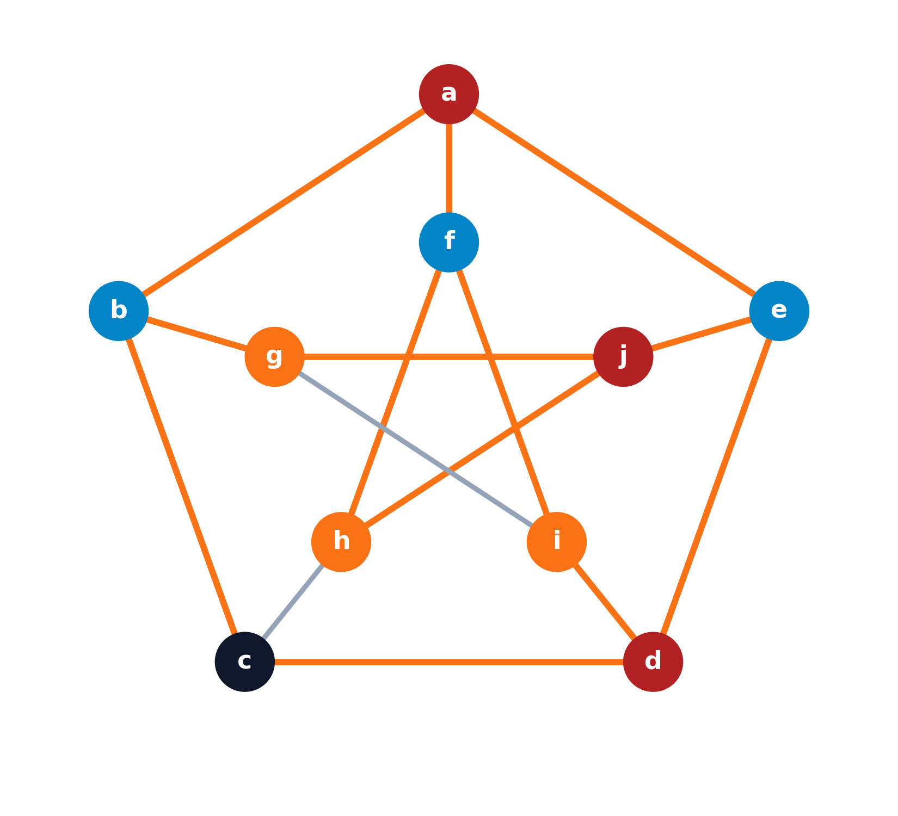{#fig-petersen-homeomorfismo fig-align="center" width="55%"}

Para comprender cómo se manifiesta el obstructo de Kuratowski en esta estructura, se analizan los roles que desempeñan sus nodos y aristas:

1.  **Partición de Vértices del Bipartito $K_{3,3}$**: Seleccionamos los subconjuntos disjuntos $V_1 = \{j, a, d\}$ (nodos rojos) y $V_2 = \{e, f, b\}$ (nodos azules).

2.  **Construcción de las 9 Cadenas Independientes**: Para verificar la estructura de $K_{3,3}$, cada uno de los 3 vértices de $V_1$ debe estar comunicado con los 3 vértices de $V_2$ mediante cadenas disjuntas en sus aristas interiores (resaltadas en color naranja):
    *   **Conexiones desde $a \in V_1$**: El nodo $a$ conecta directamente con $b, e, f \in V_2$ mediante las 3 aristas adyacentes $\{a,b\}$, $\{a,e\}$ y $\{a,f\}$.
    *   **Conexiones desde $j \in V_1$**: El nodo $j$ conecta directamente con $e \in V_2$ ($\{j,e\}$); se comunica con $f \in V_2$ mediante la cadena $j \to h \to f$ (usando el nodo intermedio $h$ de grado 2); y se comunica con $b \in V_2$ mediante la cadena $j \to g \to b$ (usando el nodo intermedio $g$).
    *   **Conexiones desde $d \in V_1$**: El nodo $d$ conecta directamente con $e \in V_2$ ($\{d,e\}$); se comunica con $b \in V_2$ mediante la cadena $d \to c \to b$ (usando el nodo intermedio $c$); y se comunica con $f \in V_2$ mediante la cadena $d \to i \to f$ (usando el nodo intermedio $i$).

3.  **Aristas Excluidas (en gris)**: Las aristas $\{g, i\}$ y $\{c, h\}$ (representadas en gris en la @fig-petersen-homeomorfismo) no se utilizan para conformar el subgrafo y se suprimen.

Dado que todos los vértices intermedios ($g, h, i, c$) actúan como nodos de grado 2 que subdividen aristas, el subgrafo parcial resultante es **homeomórfico a $K_{3,3}$**, lo que prueba de forma concluyente que el Grafo de Petersen **no admite incrustación planar**.

A partir de la caracterización de Kuratowski, se observa intuitivamente que un grafo con una alta densidad de aristas resulta progresivamente más difícil de incrustar en el plano sin provocar intersecciones. Esta relación cuantitativa entre la densidad de aristas y la topología planar fue formalizada originalmente por Leonhard Euler al vincular el número de vértices ($n$), el número de aristas ($m$) y el número de caras o regiones ($r$) que delimita el grafo sobre el plano bidimensional.

::: {.callout-important title="Teorema: Fórmula planar de Euler" data-kind="teorema"}
Sea $G = (V, E)$ un grafo planar conexo con $n = |V|$ vértices y $m = |E|$ aristas. Si $r$ denota el número de regiones delimitadas en cualquier incrustación planar de $G$ (incluyendo la región exterior no acotada), entonces se verifica exactamente la relación:
$$
n + r = m + 2
$$

*Demostración*:
Realizaremos la demostración por inducción matemática sobre el número de aristas $m \ge 0$.

*   **Base Inductiva ($m = 0$)**: Si $m = 0$, al ser $G$ conexo, el grafo consta de un único vértice aislado ($n = 1$). El número de regiones en el plano es la única región exterior no acotada ($r = 1$). Sustituyendo:
    $$
    n + r = 1 + 1 = 2 = 0 + 2 = m + 2
    $$
    Se cumple la igualdad base.

*   **Paso Inductivo**: Asumimos como hipótesis de inducción que la relación $n' + r' = m' + 2$ es válida para todo grafo planar conexo con $m' = m - 1$ aristas. Consideremos ahora un grafo planar conexo $G$ con $m$ aristas:

    *   **Caso 1 (G es un árbol)**: Si $G$ no contiene ningún ciclo, entonces es un árbol y posee exactamente $m = n - 1$ aristas. Como no encierra ningún ciclo, la única cara existente es la región exterior ($r = 1$). Reemplazando:
        $$
        n + r = n + 1 = (m + 1) + 1 = m + 2
        $$
        Queda verificado.

    *   **Caso 2 (G contiene al menos un ciclo)**: Si $G$ contiene al menos un ciclo, seleccionamos una arista $e \in E$ que pertenezca a dicho ciclo. Al eliminar la arista $e$, obtenemos un subgrafo parcial $G' = (V, E \setminus \{e\})$ que sigue siendo conexo, con $n' = n$ vértices y $m' = m - 1$ aristas. Dado que la arista $e$ actuaba como frontera común separando dos regiones contiguas de $G$, su eliminación destruye dicha frontera y fusiona las dos regiones en una sola, por lo que $r' = r - 1$. Por hipótesis inductiva aplicada a $G'$:
        $$
        n' + r' = m' + 2 \implies n + (r - 1) = (m - 1) + 2 \implies n + r = m + 2
        $$

Por el principio de inducción matemática, el teorema queda rigurosamente demostrado para todo grafo planar conexo. $\blacksquare$
:::

La Fórmula de Euler permite establecer cotas superiores algebraicas estrictas sobre el número máximo de aristas que puede contener un grafo antes de perder la propiedad de ser planar.

::: {.callout-note title="Corolario: Desigualdades de planaridad y condición necesaria" data-kind="corolario"}

1. En todo grafo planar conexo simple $G$ con $n \ge 3$ vértices y $m$ aristas:

   $$
   m \le 3n - 6
   $$

2. En todo grafo planar conexo simple **bipartito** (sin triángulos, donde la longitud de todo ciclo es $\ge 4$) con $n \ge 3$:
   $$
   m \le 2n - 4
   $$

*Demostración*:
En un grafo simple conexo, cada región $i$ está delimitada por al menos 3 aristas. Al sumar las aristas frontera de todas las $r$ regiones, cada arista es compartida como máximo por 2 regiones:
$$
3r \le \sum_{i=1}^r \text{aristas}(r_i) = 2m \implies r \le \frac{2}{3}m
$$
Sustituyendo $r \le \frac{2}{3}m$ en la fórmula de Euler $n + r = m + 2$:
$$
n + \frac{2}{3}m \ge m + 2 \implies n - 2 \ge \frac{1}{3}m \implies m \le 3n - 6 \quad \blacksquare
$$
:::

::: {.callout-tip title="Ejemplo: Demostración analítica de no planaridad" data-kind="ejemplo" collapse="true"}
**Demostrar analíticamente que los grafos $K_5$ (completo de 5 vértices) y $K_{3,3}$ (bipartito completo de los 3 suministros) no son planares.**

**Resolución para $K_5$**
El grafo completo $K_5$ posee $n = 5$ vértices y $m = \binom{5}{2} = 10$ aristas. Si $K_5$ fuera planar, debería verificar la desigualdad $m \le 3n - 6$:
$$
10 \le 3(5) - 6 = 15 - 6 = 9 \quad \text{(FALSO)}
$$
Dado que $10 \le 9$ es falso, $K_5$ es **no planar**.

**Resolución para $K_{3,3}$ (Problema de Dudeney)**
El grafo bipartito de Dudeney $K_{3,3}$ posee $n = 6$ vértices y $m = 3 \times 3 = 9$ aristas, sin ningún triángulo interno. Si fuera planar, debería cumplir $m \le 2n - 4$:
$$
9 \le 2(6) - 4 = 12 - 4 = 8 \quad \text{(FALSO)}
$$
Dado que $9 \le 8$ es falso, $K_{3,3}$ es **no planar**.
:::

---

## Representación de grafos

Para almacenar, manipular y ejecutar algoritmos de optimización sobre redes mediante ordenadores, la topología de un grafo o digrafo debe traducirse a estructuras de datos computacionales eficientes. Atendiendo a la densidad de aristas, a la variabilidad temporal de la red y a las operaciones algorítmicas requeridas, la teoría de grafos ofrece tres modalidades fundamentales de representación: matricial, vectorial y por listas de adyacencia.

### Representación matricial

Para procesar, analizar y resolver problemas de optimización sobre redes mediante ordenadores, la topología de un grafo o digrafo debe codificarse de forma algebraica. Las dos formas matriciales clásicas para representar las conexiones de una red son la **matriz de incidencia** y la **matriz de adyacencia**.

::: {.callout-note title="Definición: Matriz de incidencia de un grafo no dirigido" data-kind="definicion"}
Dado un grafo no dirigido $G = (V, E)$ con $n = |V|$ vértices ($V = \{1, \dots, n\}$) y $m = |E|$ aristas ($E = \{e_1, \dots, e_m\}$), la **matriz de incidencia nodo-arista** es una matriz rectangular $A = (a_{ik}) \in \mathbb{R}^{n \times m}$ definida por:
$$
a_{ik} = \begin{cases}
1 & \text{si } e_k = \{i, *\} \in E \text{ (el nodo } i \text{ es uno de los dos extremos de la arista } e_k\text{)}, \\
0 & \text{en otro caso.}
\end{cases}
$$
:::

En un grafo no dirigido, cada columna de la matriz de incidencia $A$ contiene exactamente dos unos, correspondientes a los dos nodos que une la arista respectiva. Asimismo, la suma de los elementos de la fila $i$-ésima coincide exactamente con el grado del nodo, es decir, $\sum_{k=1}^m a_{ik} = d(i)$. En la @fig-matriz-incidencia-grafo se ilustra la construcción explícita de esta matriz para un grafo no dirigido sobre 4 vértices y 5 aristas.

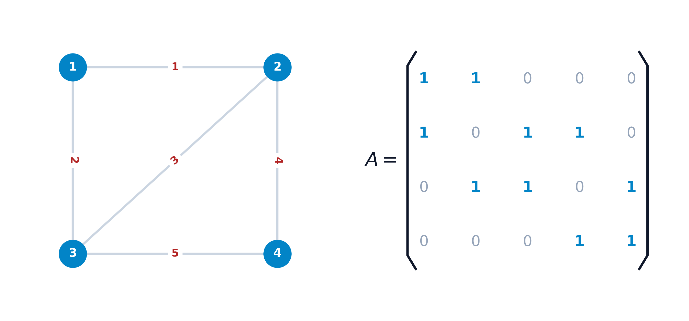{#fig-matriz-incidencia-grafo fig-align="center" width="80%"}

Cuando la red posee orientación en sus conexiones, la matriz de incidencia incorpora el signo de la dirección del flujo de cada arco.

::: {.callout-note title="Definición: Matriz de incidencia de un digrafo" data-kind="definicion"}
Dado un digrafo $G = (V, U)$ con $n = |V|$ vértices y $m = |U|$ arcos dirigidos ($U = \{u_1, \dots, u_m\}$), la **matriz de incidencia nodo-arco** es una matriz rectangular $A = (a_{ik}) \in \mathbb{R}^{n \times m}$ definida por:
$$
a_{ik} = \begin{cases}
1 & \text{si } u_k = (i, *) \in U \text{ (el arco } u_k \text{ parte del nodo } i\text{)}, \\
-1 & \text{si } u_k = (*, i) \in U \text{ (el arco } u_k \text{ llega al nodo } i\text{)}, \\
0 & \text{en otro caso.}
\end{cases}
$$
:::

En esta formulación, cada columna $k = (i, j)$ de la matriz de incidencia de un digrafo contiene exactamente un $+1$ en la fila del nodo de origen $i$ y un $-1$ en la fila del nodo de destino $j$ (o viceversa según el convenio algebraico fijado). Como consecuencia, la suma de todos los elementos de cada columna es nula ($\sum_{i=1}^n a_{ik} = 0$), lo que implica que el rango de la matriz para un digrafo conexo de $n$ vértices es a lo sumo $\text{rango}(A) = n - 1$. Esta propiedad confiere a la matriz de incidencia de digrafos la característica de **Total Unimodularidad (TUM)**, fundamental en programación lineal entera para garantizar que los problemas de flujo balanceado $A x = b$ con datos enteros admitan siempre soluciones óptimas enteras sin necesidad de algoritmos de ramificación. En la @fig-matriz-incidencia-digrafo se presenta la matriz de incidencia resultante para un digrafo dirigido sobre 4 vértices.

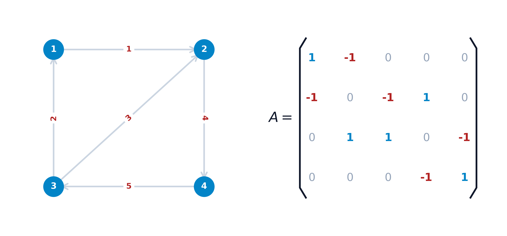{#fig-matriz-incidencia-digrafo fig-align="center" width="80%"}

Por otra parte, la relación directa entre pares de nodos se codifica mediante la matriz de adyacencia, la cual opera directamente sobre el espacio de vértices $n \times n$.

::: {.callout-note title="Definición: Matriz de adyacencia de un grafo no dirigido" data-kind="definicion"}
Dado un grafo no dirigido $G = (V, E)$ con $n$ vértices, la **matriz de adyacencia** es una matriz cuadrada $B = (b_{ij}) \in \mathbb{R}^{n \times n}$ definida por:
$$
b_{ij} = \begin{cases}
1 & \text{si } \{i, j\} \in E, \\
0 & \text{si } \{i, j\} \notin E.
\end{cases}
$$
:::

Dado que las aristas de un grafo no dirigido no poseen orientación ($\{i, j\} = \{j, i\}$), la matriz de adyacencia $B$ es **simétrica** ($B = B^T$). Asimismo, si el grafo carece de bucles o auto-conexiones, la diagonal principal contiene exclusivamente ceros ($b_{ii} = 0$). La suma de los elementos de cualquier fila o columna es igual al grado del nodo correspondiente, $d(i) = \sum_{j=1}^n b_{ij}$. En la @fig-matriz-adyacencia-grafo se muestra la matriz de adyacencia simétrica para la red no dirigida.

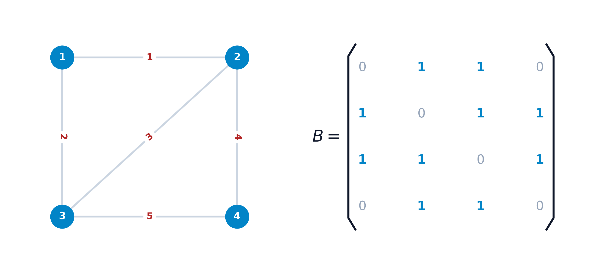{#fig-matriz-adyacencia-grafo fig-align="center" width="80%"}

En el caso de redes dirigidas, la matriz de adyacencia registra la dirección efectiva de los arcos entre vértices.

::: {.callout-note title="Definición: Matriz de adyacencia de un digrafo" data-kind="definicion"}
Dado un digrafo $G = (V, U)$ con $n$ vértices y $m$ arcos, la **matriz de adyacencia** es una matriz cuadrada $B = (b_{ik}) \in \mathbb{R}^{n \times n}$ definida por:
$$
b_{ik} = \begin{cases}
1 & \text{si } (i, k) \in U \text{ (existe un arco dirigido desde el nodo } i \text{ hacia el nodo } k\text{)}, \\
0 & \text{en otro caso.}
\end{cases}
$$
:::

Para un digrafo general, la matriz de adyacencia $B$ es **asimétrica** ($B \neq B^T$). La suma de los elementos de la fila $i$ indica el grado de salida del nodo ($d^+(i) = \sum_{k=1}^n b_{ik}$), mientras que la suma de los elementos de la columna $k$ representa el grado de entrada ($d^-(k) = \sum_{i=1}^n b_{ik}$). Como propiedad analítica adicional, el elemento $(B^p)_{ik}$ de la $p$-ésima potencia de la matriz $B^p$ computa el número exacto de caminos orientados de longitud $p$ existentes entre el nodo $i$ y el nodo $k$. En la @fig-matriz-adyacencia-digrafo se ilustra la matriz de adyacencia asimétrica asociada a la red dirigida.

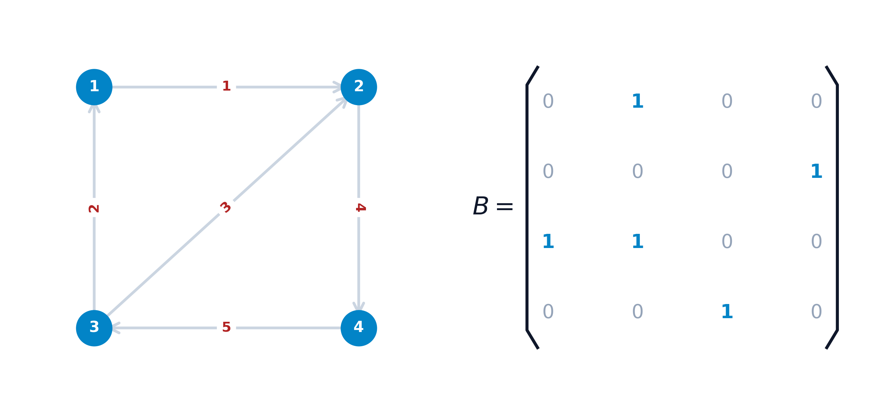{#fig-matriz-adyacencia-digrafo fig-align="center" width="80%"}

A pesar de su claridad conceptual, la representación de redes mediante matrices densas (de dimensiones $n \times m$ para la incidencia o $n \times n$ para la adyacencia) presenta serias limitaciones de eficiencia computacional cuando se trabaja con redes reales de gran escala. Por ejemplo, en una red de infraestructuras o comunicaciones con $n = 10\,000$ vértices y $m = 30\,000$ arcos, almacenar la matriz de incidencia completa requeriría aproximadamente:
$$
n \cdot m \cdot 1 \text{ byte} = 10\,000 \times 30\,000 \text{ bytes} = 3 \times 10^8 \text{ bytes} \approx 300\,000 \text{ KB} = 300 \text{ MB}
$$
Sin embargo, dado que en la matriz de adyacencia solo $30\,000$ de las $n^2 = 100\,000\,000$ entradas son distintas de cero (una densidad de apenas el $0.03\%$), y en la matriz de incidencia solo $2m = 60\,000$ de los $300\,000\,000$ elementos son no nulos (densidad del $0.02\%$), la inmensa mayoría de la memoria almacenaría ceros redundantes.

Por este motivo, los algoritmos de optimización de redes y los entornos de computación científica emplean estructuras de datos dispersas (*sparse formats*) o **listas de adyacencia** para reducir el coste de memoria linealmente a $O(n + m)$.

---

### Representación vectorial

Para superar las limitaciones de memoria y la ineficiencia de las matrices densas (de adyacencia o incidencia), la teoría computacional de redes utiliza el esquema de **representación vectorial de dos vectores**. Este método permite almacenar la topología completa de un digrafo o grafo utilizando únicamente dos vectores unidimensionales: un vector $\alpha$ de punteros o índices de dimensión $n + 1$, y un vector $\beta$ de nodos de destino de dimensión $m$ (o de las aristas consideradas para grafos no dirigidos).

El máximo ahorro de memoria se consigue ordenando previamente el conjunto de arcos o aristas en **orden lexicográfico**.

::: {.callout-note title="Definición: Orden lexicográfico de arcos" data-kind="definicion"}

1. $i_1 \le i_2 \le \dots \le i_m$ (los arcos se agrupan ordenados por su nodo de origen).

2. Si $i_k = i_{k+1}$, entonces $j_k \le j_{k+1}$ (en caso de empate en el origen, se ordenan por su nodo de destino).
:::

Una vez establecidos los arcos en orden lexicográfico, se construyen los dos vectores estructurales $\beta$ y $\alpha$:

::: {.callout-note title="Definición: Construcción de los vectores estructurales $\beta$ y $\alpha$" data-kind="definicion"}

1. **Vector de destinos $\beta$** (de dimensión $m$): Almacena secuencialmente en la posición $k$-ésima el vértice de llegada o destino del $k$-ésimo arco ordenado:
   $$
   \beta(k) = j_k, \quad \forall k \in \{1, \dots, m\}.
   $$

2. **Vector de punteros de inicio $\alpha$** (de dimensión $n + 1$): Determina la posición de memoria en $\beta$ donde comienza la lista de arcos que parten de cada nodo $i \in V$. Se define mediante el valor frontera $\alpha(n + 1) = m + 1$ y la relación de recurrencia regresiva (para $k = n, n-1, \dots, 1$):
   $$
   \alpha(k) = \alpha(k + 1) - d^+(k),
   $$
   donde $d^+(k)$ denota el grado de salida (número de arcos salientes) del nodo $k$.
:::

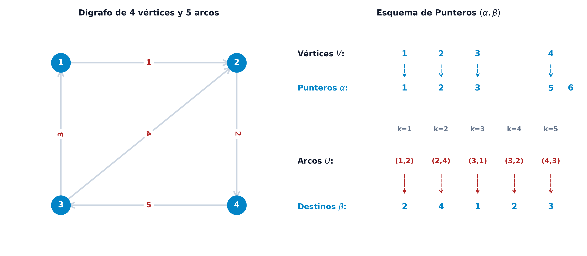{#fig-representacion-vectorial-digrafo fig-align="center" width="85%"}

Como se aprecia detalladamente en la @fig-representacion-vectorial-digrafo, la correspondencia entre la topología del digrafo y la memoria se articula a través de tres niveles de lectura:

* **Ordenación lexicográfica del conjunto de arcos $U$**: Los 5 arcos se ordenan según su nodo de origen y destino, generando la secuencia indexada $k=1, \dots, 5$: el arco $k=1$ es $(1,2)$, el arco $k=2$ es $(2,4)$, los arcos $k=3$ y $k=4$ son $(3,1)$ y $(3,2)$, y el arco $k=5$ es $(4,3)$.
* **Construcción directa de $\beta$**: El vector $\beta = (2, 4, 1, 2, 3)$ registra únicamente los nodos de llegada de cada uno de los arcos ordenados en la fila $U$.
* **Construcción regresiva de $\alpha$**: Se parte de la condición frontera $\alpha(5) = m + 1 = 6$. A continuación, se descuenta el grado de salida de cada nodo de derecha a izquierda:
  * Para el nodo 4 ($d^+(4) = 1$ arco saliente, $(4,3)$), la posición inicial es $\alpha(4) = 6 - 1 = 5$.
  * Para el nodo 3 ($d^+(3) = 2$ arcos salientes, $(3,1)$ y $(3,2)$), la posición inicial es $\alpha(3) = 5 - 2 = 3$.
  * Para el nodo 2 ($d^+(2) = 1$ arco saliente, $(2,4)$), la posición inicial es $\alpha(2) = 3 - 1 = 2$.
  * Para el nodo 1 ($d^+(1) = 1$ arco saliente, $(1,2)$), la posición inicial es $\alpha(1) = 2 - 1 = 1$.

De este modo, para recuperar los sucesores de cualquier nodo $i$ basta consultar la sublista de $\beta$ entre las posiciones $\alpha(i)$ y $\alpha(i+1) - 1$. Por ejemplo, para el nodo 3, se examinan los índices desde $\alpha(3) = 3$ hasta $\alpha(4) - 1 = 4$, obteniendo inmediatamente los nodos de destino $\beta(3) = 1$ y $\beta(4) = 2$, correspondientes a los arcos $(3,1)$ y $(3,2)$.

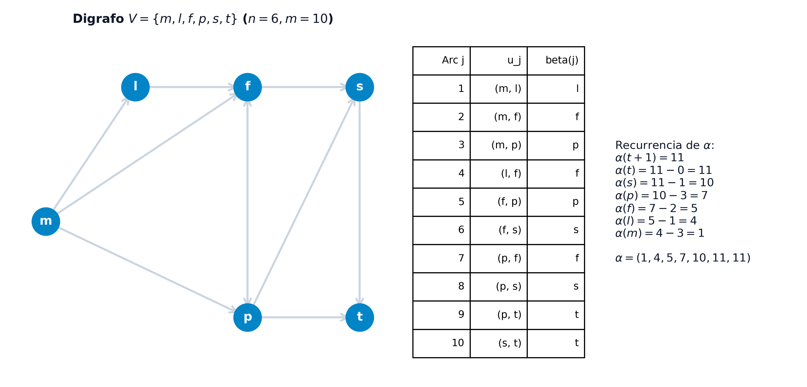{#fig-representacion-vectorial-ejemplo-complejo fig-align="center" width="90%"}

El esquema de representación mediante dos vectores se extiende de forma totalmente natural a los **grafos no dirigidos**. Para ello, cada arista no dirigida $\{u, v\}$ se considera equivalente a un par de conexiones salientes considerando ambas orientaciones posibles. Así, una arista no dirigida contribuirá con una entrada en el vector $\beta$ por cada nodo extremo donde es incidente, y el vector $\alpha$ se construye utilizando la cantidad de aristas que parten de cada nodo según el orden lexicográfico prefijado de las parejas. En la @fig-representacion-vectorial-grafo-nodirigido se muestra la extensión vectorial aplicada a un grafo no dirigido sobre 5 vértices y 7 aristas.

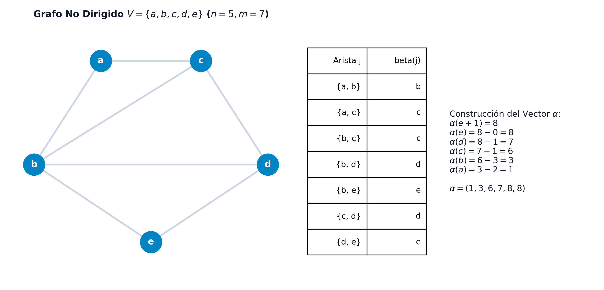{#fig-representacion-vectorial-grafo-nodirigido fig-align="center" width="90%"}

---

### Representación por listas de adyacencia

Frente al almacenamiento estático prefijado que exigen las matrices densas (de adyacencia o incidencia) o las estructuras vectoriales compactas como el vector $\alpha$, la **representación por listas de adyacencia** constituye la alternativa computacional más flexible para gestionar redes dinámicas. Este método consiste en asociar a cada vértice $v \in V$ del grafo o digrafo una lista dinámicamente enlazada que contiene la secuencia de todos sus vértices sucesores (o nodos adyacentes a los que apunta directamente).

::: {.callout-note title="Definición: Representación por listas de adyacencia" data-kind="definicion"}
Dada una red $G = (V, E)$ o $G = (V, U)$ con $n = |V|$ vértices, la **representación por listas de adyacencia** asigna a cada nodo $i \in V$ una lista de punteros dinámicos $\text{Adj}[i]$ formada por la colección ordenada de vértices adyacentes a los que se conecta:
$$
\text{Adj}[i] = \{ j \in V \mid (i, j) \in U \text{ o } \{i, j\} \in E \}.
$$
:::

La ventaja fundamental de este esquema reside en que las listas de adyacencia no requieren dimensionarse ni reservarse de forma estática antes de comenzar los cálculos, haciendo un uso eficiente de la asignación dinámica de memoria mediante punteros o nodos enlazados. Esta flexibilidad estructural permite modificar la red en tiempo real (añadiendo o eliminando vértices y conexiones sin necesidad de reestructurar o copiar bloques contiguos de memoria), lo que convierte a esta representación en la opción óptima para modelar grafos en evolución temporal o algoritmos de exploración probabilística.

En la @fig-lista-adyacencia-digrafo se ilustra la arquitectura de datos dinámica para un digrafo dirigido compuesto por 6 vértices $V = \{m, l, f, p, s, t\}$. La figura contrapone la topología de la red a la izquierda con el vector cabecera de nodos y sus correspondientes cadenas horizontales de punteros hacia los nodos de destino.

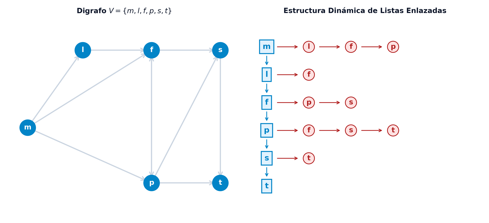{#fig-lista-adyacencia-digrafo fig-align="center" width="90%"}

Como se observa en la @fig-lista-adyacencia-digrafo, la cabecera vertical agrupa a los 6 vértices del digrafo, y cada fila despliega horizontalmente la secuencia de sucesores enlazados:

* El nodo $m$ encadena los vértices adyacentes salientes $l \to f \to p$.
* El nodo $l$ encadena únicamente su único sucesor $f$.
* El nodo $f$ encadena los vértices $p \to s$.
* El nodo $p$ encadena tres destinos $f \to s \to t$.
* El nodo $s$ se conecta con $t$.
* El nodo hundimiento $t$ mantiene una lista vacía ($\emptyset$), reflejando que su grado de salida es $d^+(t) = 0$.

El esquema de listas de adyacencia se extiende de manera inmediata a los **grafos no dirigidos**. En este escenario, cada arista no dirigida $\{u, v\}$ genera dos entradas recíprocas en las estructuras enlazadas: el nodo $v$ se añade a la lista de adyacencia $\text{Adj}[u]$, y simétricamente el nodo $u$ se incorpora a la lista de adyacencia $\text{Adj}[v]$. En la @fig-lista-adyacencia-grafo se presenta la estructura de listas enlazadas recíprocas para un grafo no dirigido sobre 5 vértices $V = \{a, b, c, d, e\}$.

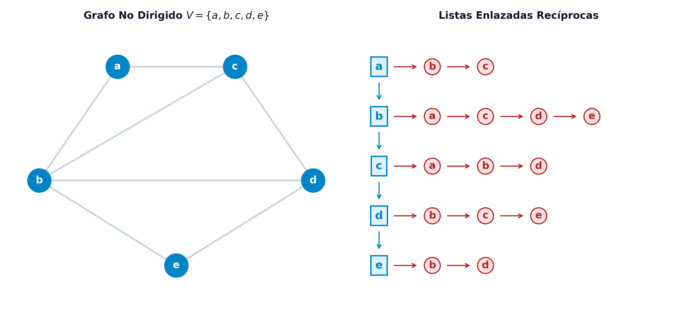{#fig-lista-adyacencia-grafo fig-align="center" width="90%"}

Como ilustra la @fig-lista-adyacencia-grafo, la simetría de las aristas no dirigidas se refleja en la presencia cruzada de los vértices adyacentes: la arista $\{a, b\}$ provoca que $b$ figure en $\text{Adj}[a]$ ($a \to b \to c$) y que $a$ figure en $\text{Adj}[b]$ ($b \to a \to c \to d \to e$). La suma total de los elementos almacenados entre todas las listas enlazadas es exactamente $2m$, lo que garantiza un consumo espacial óptimo $O(n + m)$ con total versatilidad para la inserción y borrado dinámico de aristas.

---

## Estructura matemática de los árboles

Los árboles constituyen la clase más elemental y transversal de grafos en la optimización combinatoria y el análisis de redes. Formalmente, un árbol combina la propiedad de conexión global con la ausencia de redundancia cíclica.

::: {.callout-note title="Definición: Árbol y bosque" data-kind="definicion"}

* **Árbol**: Un **árbol** $T = (V, E)$ es un grafo no dirigido **conexo y acíclico** (sin ciclos).
* **Bosque (Forest)**: Un **bosque** es un grafo no dirigido acíclico cuyas componentes conexas son árboles.
:::

En la @fig-arbol-ejemplo-matriz se ilustra la topología de un árbol compuesto por $n = 5$ vértices y $m = 4$ aristas, junto a su correspondiente matriz de incidencia nodo-arista $A \in \mathbb{R}^{5 \times 4}$. Se observa que la ausencia de circuitos cerrados implica que ninguna combinación de columnas de la matriz resulta linealmente dependiente.

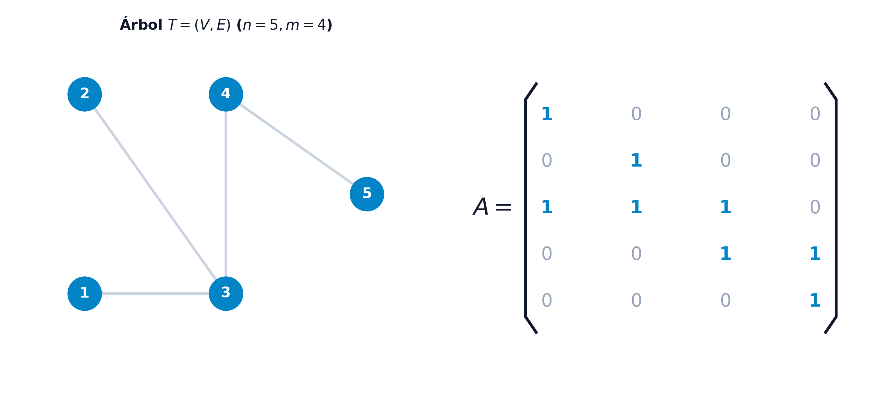{#fig-arbol-ejemplo-matriz fig-align="center" width="85%"}

La estructura de los árboles presenta múltiples caracterizaciones algebraicas y geométricas completamente equivalentes entre sí, las cuales permiten definir a un árbol desde distintos enfoques axiomáticos.

::: {.callout-important title="Teorema: Caracterizaciones equivalentes de un árbol" data-kind="teorema"}

1. $G$ es un **árbol** (es un grafo conexo y acíclico).
2. $G$ **no posee ciclos** y si se añade una arista cualquiera entre dos vértices no adyacentes, se genera **un único ciclo**.
3. Para todo par de vértices distintos $x, y \in V$, existe **una única cadena simple** $\mu[x, y]$ que los conecta.
4. $G$ es **conexo** y si se elimina una arista cualquiera de $E$, el grafo resultante **deja de ser conexo** (toda arista de un árbol es un puente o arista de corte).
5. $G$ no posee ciclos y tiene exactamente **$m = n - 1$ aristas**.
6. $G$ es conexo y tiene exactamente **$m = n - 1$ aristas**.
:::

Este teorema pone de manifiesto que un árbol es una estructura estrictamente **crítica y minimal**:

* Es el grafo **mínimo en aristas que garantiza la conexidad** entre los $n$ vértices (quitar una sola arista desconecta la red).
* Es el grafo **máximo en aristas que evita la formación de ciclos** (añadir una sola arista crea automáticamente un circuito cerrado).

En el ejemplo de la @fig-arbol-ejemplo-matriz se comprueba inmediatamente esta regla fundamental del recuento de aristas: con $n = 5$ vértices, el árbol cuenta con exactamente $m = 4 = n - 1$ aristas. Como consecuencia directa, de las tres propiedades básicas de un grafo sobre $n$ vértices: (a) ser conexo, (b) ser acíclico y (c) poseer $m = n - 1$ aristas, la presencia de **cualesquiera dos de ellas implica automáticamente la tercera**, caracterizando de forma unívoca a la familia de los árboles.

Por último, el número total de árboles soporte etiquetados distintos que pueden construirse sobre un conjunto dado de $n$ vértices diferenciables viene determinado por la célebre **Fórmula de Cayley (1889)** [@cayley1889trees]:
$$
T(n) = n^{n-2}
$$
Esta fórmula demuestra el crecimiento exponencial combinatorio del espacio de búsqueda de árboles cuando se evalúan problemas de diseño topológico en redes de gran escala.

Las propiedades estructurales exclusivas de un árbol, en particular la existencia de una única cadena simple entre cualquier par de vértices, permiten comprimir aún más su codificación en memoria, logrando una **representación monovectorial** mediante un único vector $p$ de dimensión $n$ (número de vértices).

::: {.callout-note title="Definición: Representación monovectorial de un árbol (vector de padres o predecesores)" data-kind="definicion"}
Dado un árbol $T = (V, E)$ con $n = |V|$ vértices, al seleccionar de forma arbitraria un nodo raíz inicial $x_0 \in V$, la topología de $T$ queda unívocamente determinada por el **vector de padres o predecesores** $p \in \mathbb{R}^n$, definido para cada vértice $v \in V$ como:
$$
p(v) = \begin{cases}
x_0, & \text{si } v = x_0 \text{ (el nodo raíz es su propio padre)}, \\
u, & \text{si } u \in V \text{ es el único antecesor directo de } v \text{ en el camino desde } x_0 \text{ a } v.
\end{cases}
$$
:::

Dado que desde el nodo raíz $x_0$ existe un camino único hacia cualquier otro vértice $v \neq x_0$, el antecesor inmediato $u = p(v)$ está definido sin ambigüedad. Esta representación monovectorial resulta extremadamente eficiente en la práctica, pues almacena la topología de un árbol empleando solo $n$ enteros en memoria, frente a los $O(n + m)$ o matrices $n \times n$ necesarios en grafos generales.

La estructura del vector de padres $p$ depende directamente de la elección del nodo raíz $x_0$, adaptando la orientación jerárquica del árbol. En la @fig-arbol-vector-padres se analiza esta variabilidad sobre el árbol de 5 vértices:

* **Enraizamiento en $x_0 = 1$** (panel izquierdo): La raíz es el nodo 1 ($p(1) = 1$). El camino desde 1 hasta 5 pasa por el nodo 3 ($p(3) = 1$) y el nodo 4 ($p(4) = 3$), de modo que $p(5) = 4$. Los nodos hojas 2 y 4 tienen como padre directo a 3 ($p(2) = 3, p(4) = 3$). El vector de padres resultante es $p = (1, 3, 1, 3, 4)$.
* **Enraizamiento en $x_0 = 5$** (panel derecho): La raíz se traslada al nodo 5 ($p(5) = 5$). La jerarquía se invierte a lo largo del tronco principal: el padre de 4 es 5 ($p(4) = 5$), el padre de 3 es 4 ($p(3) = 4$), y los hijos de 3 son 1 y 2 ($p(1) = 3, p(2) = 3$). El vector de padres resultante es $p = (3, 3, 4, 5, 5)$.

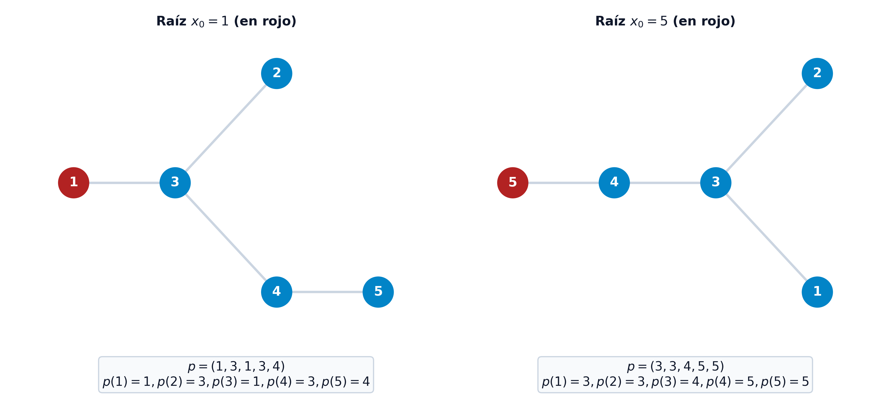{#fig-arbol-vector-padres fig-align="center" width="90%"}

---

## Árbol soporte de mínimo peso (MST)

La incorporación de costes, pesos, tiempos o capacidades a las aristas de un grafo da lugar a la estructura matemática de una **red valorada**. En este contexto de optimización, el **Problema del Árbol Soporte de Mínimo Peso** (*Minimum Spanning Tree*, MST) persigue encontrar la infraestructura de conexión de menor coste acumulado que mantiene la conectividad global entre todos los nodos de la red sin introducir circuitos cerrados redundantes. Este problema constituye una de las aplicaciones más emblemáticas de la optimización combinatoria en el diseño de redes de transporte, distribución eléctrica, canalización de fluidos y algoritmos de agrupamiento (*clustering*).

::: {.callout-note title="Definición: Red valorada y peso total de una arista" data-kind="definicion"}
Una **red valorada** es un par $(G, \mathbf{d})$, donde $G = (V, E)$ o $G = (V, U)$ es un grafo o digrafo y $\mathbf{d} \in \mathbb{R}^m$ es un vector cuyas componentes identifican el valor numérico, peso o coste $d(e) = d_e$ asociado a cada arista $e \in E$ (o $c_{ij}$ a cada arco $(i, j) \in U$). Se habla de **red no dirigida** o **red dirigida** según las conexiones estén orientadas o no.
:::

::: {.callout-important title="Formulación primal del problema del árbol soporte de mínimo peso" data-kind="teorema"}
Dada una red no dirigida valorada $(G, \mathbf{d})$ con $G = (V, E)$ conexo y valores de peso $\{d_e : e \in E\}$, el **Problema del Árbol Soporte de Mínimo Peso** consiste en encontrar un árbol soporte $H = (V, T)$ con $T \subset E$ que minimice la suma de los pesos de sus aristas:
$$
\begin{aligned}
\min_{T \subset E} \quad & d(T) = \sum_{e \in T} d_e \\
\text{sujeto a} \quad & H = (V, T) \text{ es un árbol soporte de } G
\end{aligned}
$$
:::

En la @fig-mst-ejemplo-tres-arboles se ilustra el espacio de soluciones sobre una red no dirigida de 5 vértices $V = \{a, b, c, d, e\}$ comparando tres árboles soporte candidatos alternativos:

* **Árbol candidato $T_1$** (aristas $\{a,b\}, \{a,c\}, \{c,d\}, \{b,e\}$): Acumula un peso total $d(T_1) = 3 + 2 + 4 + 1 = 10$.
* **Árbol candidato $T_2$** (aristas $\{a,b\}, \{b,c\}, \{b,d\}, \{b,e\}$): Acumula un peso total $d(T_2) = 3 + 6 + 2 + 1 = 12$.
* **Árbol mínimo $T_3$ (Óptimo)** (aristas $\{a,c\}, \{a,b\}, \{b,e\}, \{e,d\}$): Acumula el peso mínimo posible $d(T_3) = 2 + 3 + 1 + 1 = 7$.

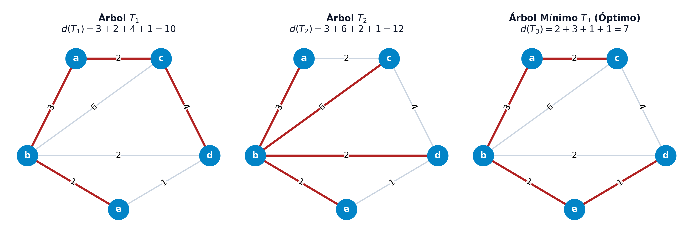{#fig-mst-ejemplo-tres-arboles fig-align="center" width="90%"}

Para resolver el problema del árbol soporte de mínimo peso sin necesidad de evaluar exhaustivamente la cantidad exponencial de árboles soporte ($T(n) = n^{n-2}$ por la Fórmula de Cayley), la teoría de grafos se apoya en una propiedad fundamental de optimalidad local conocida como la **Propiedad del Corte**.

::: {.callout-important title="Teorema: Propiedad del corte (Cut Property)" data-kind="teorema"}
Sea $(G, \mathbf{d})$ una red valorada conexa no dirigida. Dado cualquier subconjunto propio de vértices $S \subset V$, si la arista $e^* = \{u, v\}$ con $u \in S, v \in V \setminus S$ es la arista de **peso estrictamente mínimo** que cruza el corte $w(S)$, entonces la arista $e^*$ **pertenece obligatoriamente a todo Árbol Soporte de Mínimo Peso** de $G$.
:::

Esta propiedad del corte constituye el fundamento teórico sobre el que se edifican los dos célebres algoritmos golosos (*greedy*) para la construcción eficiente del MST: el **Algoritmo de Kruskal (1956)** [@kruskal1956shortest] y el **Algoritmo de Prim (1957)** [@prim1957shortest].

---

### Algoritmo de Kruskal

El **Algoritmo de Kruskal**, propuesto en 1956 por Joseph Kruskal [@kruskal1956shortest], adopta un enfoque goloso (*greedy*) centrado en el ordenamiento global de las aristas. La estrategia fundamental consiste en examinar secuencialmente las aristas de la red en orden creciente de peso, e incorporar a la solución parcial la arista de menor coste disponible, siempre que dicha arista **no cree un ciclo** con las aristas ya seleccionadas.

En las fases intermedias del proceso, el conjunto de aristas seleccionadas $T$ no forma necesariamente una estructura conexa, sino un **bosque parcial de árboles disjuntos** que se van fusionando paulatinamente hasta formar un único árbol soporte cuando se alcanzan exactamente $|T| = n - 1$ aristas.

::: {.callout-note title="Esquema: Algoritmo de Kruskal" data-kind="esquema"}
Dada una red no dirigida valorada $G = (V, E, \mathbf{d})$ con $n = |V| > 1$ vértices, sin bucles y con pesos $\{d_e : e \in E\}$:

* **Paso 0 (Inicialización)**: Definir el conjunto de aristas del árbol $T = \emptyset$ y el conjunto de aristas candidatas disponibles $A \leftarrow E$.

* **Paso 1 (Bucle de Selección Golosa)**: Mientras $|T| < n - 1$ y $A \neq \emptyset$:

  1. Identificar la arista de menor peso $e \in A$.
  2. Actualizar el conjunto de disponibles: $A \leftarrow A \setminus \{e\}$.
  3. Si el subconjunto $T \cup \{e\}$ **no contiene ningún ciclo**, aceptar la arista: $T \leftarrow T \cup \{e\}$.

* **Paso 2 (Criterio de Parada y Verificación)**:

  * Si $|T| = n - 1$, el par $H = (V, T)$ es el **Árbol Soporte de Mínimo Peso (MST)**.
  * Si $A = \emptyset$ y $|T| < n - 1$, la red $G$ no era conexa, obteniéndose el bosque soporte de mínimo peso de sus componentes.
:::

Para implementar el algoritmo con la máxima eficiencia computacional, la verificación de si una arista candidata $e = \{i, j\}$ forma un ciclo en $T$ no requiere explorar la red completa, sino utilizar la estructura de datos de **conjuntos disjuntos** (*Union-Find*):

* Inicialmente, cada uno de los $n$ vértices constituye su propia componente disjunta independiente: $S_k = \{k\}$ para todo $k \in V$.
* Al evaluar una arista $e = \{i, j\}$, se consulta el identificador de subconjunto al que pertenecen sus extremos mediante la operación $\text{Find}(i)$ y $\text{Find}(j)$.
* Si $\text{Find}(i) \neq \text{Find}(j)$, los vértices pertenecen a componentes distintas, garantizando que la incorporación de $\{i, j\}$ **no genera ningún ciclo**. En tal caso, la arista se añade a $T$ y se unen ambas componentes mediante la operación $\text{Union}(S(i), S(j))$.
* Si $\text{Find}(i) = \text{Find}(j)$, ambos vértices ya estaban conectados previamente a través de otras aristas de $T$, por lo que $\{i, j\}$ se descarta por formar un ciclo cerrado redundante.

Adicionalmente, se pueden eliminar de forma anticipada de $A$ todas las aristas restantes que unan vértices que ya pertenezcan al mismo subconjunto disjunto.

::: {.callout-tip title="Ejemplo: Aplicación del algoritmo de Kruskal" data-kind="ejemplo" collapse="true"}
**Obtener el árbol de expansión de peso mínimo mediante el Algoritmo de Kruskal para la red no dirigida sobre $n = 6$ vértices presentada en la @fig-kruskal-ejemplo-matriz.**

**Planteamiento e Inicialización**:
La red no dirigida $G = (V, E)$ está compuesta por 6 vértices $V = \{1, 2, 3, 4, 5, 6\}$ y 11 aristas valoradas. Su topología y su correspondiente matriz simétrica de pesos $B \in \mathbb{R}^{6 \times 6}$ se detallan en la @fig-kruskal-ejemplo-matriz.

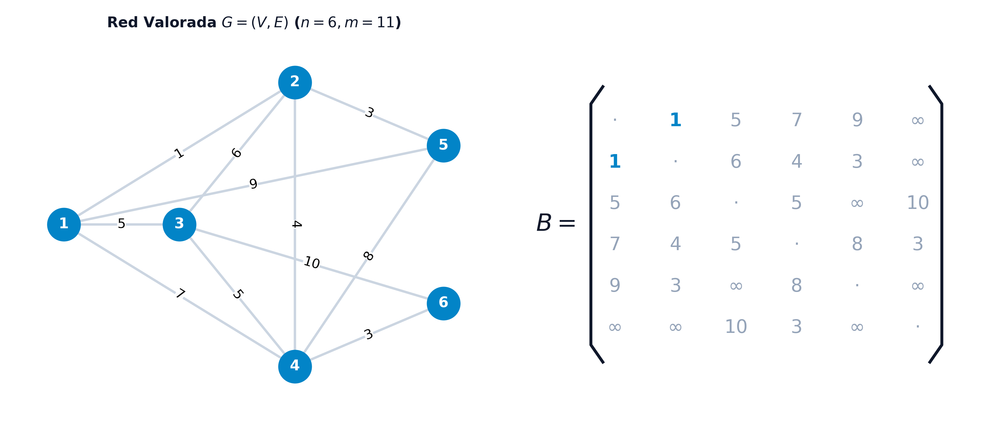{#fig-kruskal-ejemplo-matriz fig-align="center" width="90%"}

En el estado inicial ($k=0$):

* El árbol parcial solución se encuentra vacío: $T = \emptyset$.
* Cada vértice pertenece a su propio subconjunto disjunto independiente:
  $$
  \{1\}, \, \{2\}, \, \{3\}, \, \{4\}, \, \{5\}, \, \{6\}
  $$

**Resolución Iterativa Paso a Paso**:

1. **Iteración $k=1$ (peso mínimo $d = 1$)**:
   Se selecciona la arista de menor peso global $e_1 = \{1, 2\}$ con $d_{\{1,2\}} = 1$. Dado que los nodos 1 y 2 pertenecen a componentes distintas ($\text{Find}(1) \neq \text{Find}(2)$), se acepta la arista en $T$ y se fusionan sus subconjuntos:

   * Árbol parcial: $T = \{\{1, 2\}\}$.
   * Componentes disjuntas: $\{1, 2\}, \, \{3\}, \, \{4\}, \, \{5\}, \, \{6\}$.

2. **Iteración $k=2$ (peso mínimo $d = 3$, resolución de empate)**:
   Las aristas no seleccionadas de menor peso son $\{2, 5\}$ y $\{4, 6\}$, ambas de peso 3. Se selecciona la arista $\{2, 5\}$. Como 5 no pertenece a la componente de 2 ($\{1, 2\} \neq \{5\}$), se acepta la arista:

   * Árbol parcial: $T = \{\{1, 2\}, \{2, 5\}\}$.
   * Componentes disjuntas: $\{1, 2, 5\}, \, \{3\}, \, \{4\}, \, \{6\}$.

3. **Iteración $k=3$ (peso mínimo $d = 3$)**:
   Se selecciona la arista disponible $\{4, 6\}$ de peso 3. Puesto que $\text{Find}(4) \neq \text{Find}(6)$, la arista no forma ciclos y se incorpora a la solución:

   * Árbol parcial: $T = \{\{1, 2\}, \{2, 5\}, \{4, 6\}\}$.
   * Componentes disjuntas: $\{1, 2, 5\}, \, \{3\}, \, \{4, 6\}$.

4. **Iteración $k=4$ (peso mínimo $d = 4$)**:
   La arista candidata de menor peso es $\{2, 4\}$ con peso 4. Dado que el nodo 2 pertenece al bloque $\{1, 2, 5\}$ y el nodo 4 pertenece al bloque $\{4, 6\}$, ambas componentes son distintas y la arista no genera ciclos. Se acepta $\{2, 4\}$ y se fusionan ambos bloques:

   * Árbol parcial: $T = \{\{1, 2\}, \{2, 5\}, \{4, 6\}, \{2, 4\}\}$.
   * Componentes disjuntas: $\{1, 2, 4, 5, 6\}, \, \{3\}$.

5. **Iteración $k=5$ (peso mínimo $d = 5$, resolución de empate final)**:
   Las aristas disponibles de menor peso son $\{1, 3\}$ y $\{3, 4\}$, ambas de peso 5. Se selecciona la arista $\{1, 3\}$. Puesto que el nodo 3 se encuentra en la componente aislada $\{3\}$ y el nodo 1 está en el bloque principal $\{1, 2, 4, 5, 6\}$, la arista se acepta y se logra la conectividad total de la red:

   * Árbol parcial final: $T = \{\{1, 2\}, \{2, 5\}, \{4, 6\}, \{2, 4\}, \{1, 3\}\}$.
   * Componentes disjuntas final: $\{1, 2, 3, 4, 5, 6\}$ (1 sola componente conexa).

En la @fig-kruskal-ejemplo-pasos se ilustra la evolución gráfica de la construcción progresiva del árbol paso a paso a lo largo de las 5 iteraciones.

::: {.content-visible when-format="html"}
::: {#fig-kruskal-ejemplo-pasos}
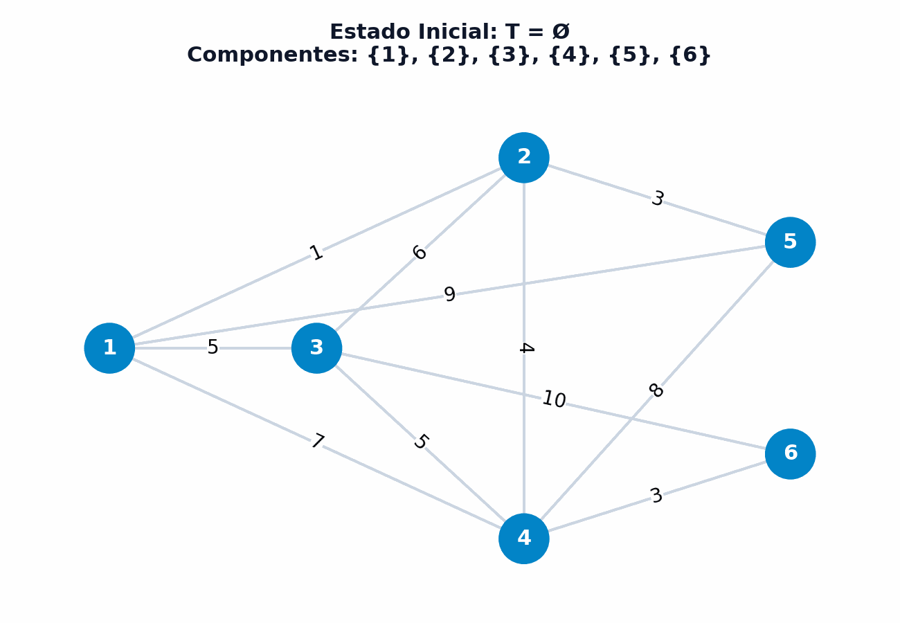

<dialog id="kruskal_ejemplo_pasos-dialog" style="border:none; border-radius:10px; padding:0; width:88vw; max-width:88vw; height:84vh; max-height:84vh; box-shadow:0 20px 60px rgba(0,0,0,0.55); overflow:hidden; background:#fff;">
  <button onclick="document.getElementById('kruskal_ejemplo_pasos-dialog').close()"
          style="position:absolute; top:10px; right:14px; z-index:10; background:rgba(15,23,42,0.6); color:#fff; border:none; border-radius:50%; width:30px; height:30px; font-size:17px; cursor:pointer; line-height:1; display:flex; align-items:center; justify-content:center;">×</button>
  <iframe src="images/kruskal_player.html" width="100%" height="100%" style="border:none; display:block;" scrolling="no"></iframe>
</dialog>

Animación paso a paso de la evolución iterativa del Algoritmo de Kruskal sobre la red de 6 nodos.
:::
:::

::: {.content-visible when-format="pdf"}
{#fig-kruskal-ejemplo-pasos fig-align="center" width="75%"}
:::

**Conclusión y Peso del Árbol Soporte de Mínimo Peso**:
Al alcanzarse $|T| = n - 1 = 5$ aristas, el algoritmo finaliza. El árbol soporte de mínimo peso $H = (V, T)$ acumula un peso total óptimo de:
$$
d(T) = d_{\{1,2\}} + d_{\{2,5\}} + d_{\{4,6\}} + d_{\{2,4\}} + d_{\{1,3\}} = 1 + 3 + 3 + 4 + 5 = 16
$$

**Observación sobre la No Unicidad de la Solución**:
Puesto que en la iteración $k=5$ existía un empate de peso mínimo ($d=5$) entre las aristas $\{1, 3\}$ y $\{3, 4\}$, si en lugar de seleccionar $\{1, 3\}$ se hubiera optado por incorporar $\{3, 4\}$, se obtendría un **árbol soporte de mínimo peso alternativo**:
$$
T' = \{\{1, 2\}, \{2, 5\}, \{4, 6\}, \{2, 4\}, \{3, 4\}\}
$$
El peso acumulado en esta solución alternativa es $d(T') = 1 + 3 + 3 + 4 + 5 = 16$, idéntico al del árbol $T$. Esto demuestra que cuando una red contiene aristas con pesos repetidos, el árbol soporte de mínimo peso **no es necesariamente único**, aunque el valor del peso óptimo $d(T)$ permanezca siempre constante e invariable.
:::

::: {.callout-important title="Teorema: Correctitud del algoritmo de Kruskal" data-kind="teorema"}
Dada una red conexa valorada $(G, \mathbf{d})$, el conjunto de aristas $T$ construido secuencialmente por el Algoritmo de Kruskal constituye un **Árbol Soporte de Mínimo Peso** del grafo $G$.

*Demostración*:
La correctitud del procedimiento se deriva directamente de la Propiedad del Corte. En cada paso $k$, la arista seleccionada $e = \{u, v\}$ es la de peso estrictamente mínimo entre todas las aristas disponibles que unen la componente disjunta $S(u)$ con el resto de la red $V \setminus S(u)$. Por consiguiente, por el Teorema de la Propiedad del Corte, la arista $e$ pertenece obligatoriamente a un árbol soporte de mínimo peso, garantizando la optimalidad global del árbol resultante al finalizar las $n - 1$ iteraciones.
:::

**Complejidad Computacional**:
La eficiencia del Algoritmo de Kruskal depende fundamentalmente de la etapa de ordenación previa de las aristas y del rendimiento de la estructura de datos *Union-Find*:

* **Aristas preordenadas**: Si la colección de $m$ aristas ya se encuentra clasificada por orden de peso, el bucle principal realiza a lo sumo $m$ operaciones $\text{Find}$ y $n - 1$ operaciones $\text{Union}$. Empleando la estructura *Union-Find* optimizada con compresión de caminos y unión por rango, la complejidad resultante es $O(m \cdot \alpha(n))$, donde $\alpha(n)$ es la inversa de la función de Ackermann (efectivamente $O(m \cdot n)$ en cotas elementales o casi lineal en la práctica).

* **Caso general sin ordenación previa**: Cuando las aristas no están clasificadas, el coste computacional dominante viene determinado por el algoritmo de ordenación (como *Heapsort* o *Quicksort*), que requiere un tiempo de $O(m \log m)$. Puesto que en cualquier grafo simple $m \le n^2$ y por tanto $\log m \le 2 \log n$, la complejidad temporal total del Algoritmo de Kruskal se establece en **$O(m \log m)$** o equivalentemente **$O(m \log n)$**.

---

### Algoritmo de Prim

El **Algoritmo de Prim** fue publicado en 1957 por Robert C. Prim [@prim1957shortest]. No obstante, este procedimiento fue descubierto inicialmente por el matemático checo Vojtěch Jarník en 1930 [@jarnik1930jiste] y posteriormente redescubierto de forma independiente por Edsger W. Dijkstra en 1959 [@dijkstra1959note]. Por esta razón, en la literatura científica especializada se le conoce formalmente como el **Algoritmo de Jarník-Prim-Dijkstra**.

A diferencia del Algoritmo de Kruskal (que evalúa aristas globales formando un bosque inconexo en sus fases intermedias), el Algoritmo de Prim construye el árbol soporte de mínimo peso haciendo crecer **una única componente conexa continua** (o arborescencia) a partir de un nodo raíz inicial $v_1 \in V$ elegido de forma arbitraria.

Sea $P \subset V$ el conjunto de vértices ya integrados en la solución parcial (inicialmente $P = \{v_1\}$) y $N = V \setminus P$ el conjunto de nodos pendientes de visitar. En cada iteración, el algoritmo analiza las aristas del corte $w(P)$ que conectan el conjunto $P$ con los nodos de $N$. A continuación, aplica directamente la **Propiedad del Corte**, seleccionando la arista $e^* = \{x^*, y^*\}$ (con $x^* \in P$ y $y^* \in N$) de peso estrictamente mínimo, incorporando el nuevo vértice $y^*$ al subconjunto $P$.

::: {.callout-note title="Esquema: Algoritmo de Prim" data-kind="esquema"}
Dada una red no dirigida valorada $G = (V, E, \mathbf{d})$ conexa con $n = |V| > 1$ vértices, sin bucles y con pesos de arista $\{d_e : e \in E\}$:

* **Paso 0 (Inicialización)**:

  1. Seleccionar un nodo raíz inicial $v_1 \in V$ de manera arbitraria.
  2. Inicializar el conjunto de nodos visitados $P = \{v_1\}$ y el de no visitados $N = V \setminus \{v_1\}$.
  3. Inicializar el conjunto de aristas del árbol $T = \emptyset$ y el contador de iteraciones $i = 1$.

* **Paso 1 (Selección de la Arista Mínima del Corte)**:

  * Identificar la arista $e^* = \{x^*, y^*\} \in E$ tal que $x^* \in P, y^* \in N$ que minimice el peso $d(e^*)$:
    $$
    d(e^*) = \min \{d(e) : e = \{x, y\}, x \in P, y \in N\}
    $$

  * **Criterio de Conexidad**:
    * Si $d(e^*) = \infty$ (no existen aristas que crucen el corte $w(P)$), detener el proceso: la red $G$ no es conexa.
    * Si $d(e^*) < \infty$, actualizar los conjuntos:
      $$
      P \leftarrow P \cup \{y^*\}, \quad N \leftarrow N \setminus \{y^*\}, \quad T \leftarrow T \cup \{e^*\}
      $$

* **Paso 2 (Criterio de Parada e Incremento)**:

  * Si $i = n - 1$, detener el procedimiento: el par $H = (V, T)$ es un **Árbol Soporte de Mínimo Peso (MST)**.
  * Si $i < n - 1$, actualizar $i \leftarrow i + 1$ y regresar al Paso 1.
:::

::: {.callout-tip title="Ejemplo: Aplicación del algoritmo de Prim" data-kind="ejemplo" collapse="true"}

**Obtener el árbol de expansión de peso mínimo mediante el Algoritmo de Prim para la red no dirigida sobre $n = 6$ vértices presentada en la @fig-kruskal-ejemplo-matriz.**

**Planteamiento e Inicialización**:
Se considera la red no dirigida $G = (V, E)$ de 6 vértices $V = \{1, 2, 3, 4, 5, 6\}$ y 11 aristas valoradas, cuya topología y matriz simétrica de pesos $B \in \mathbb{R}^{6 \times 6}$ se detallan en la @fig-kruskal-ejemplo-matriz.

A diferencia del Algoritmo de Kruskal, el Algoritmo de Prim requiere seleccionar un nodo raíz inicial de partida a partir del cual crecerá la arborescencia. Se elige arbitrariamente el nodo raíz $v_1 = 1$.

En el estado inicial ($i=1$):

* Vértices integrados en la arborescencia: $P = \{1\}$.
* Vértices pendientes de visitar: $N = \{2, 3, 4, 5, 6\}$.
* Conjunto de aristas del árbol: $T = \emptyset$.

**Desarrollo Iterativo del Algoritmo**:

* **Iteración $i=1$**:
  * Estado de los conjuntos: $P = \{1\}$, $N = \{2, 3, 4, 5, 6\}$, $T = \emptyset$.
  * Aristas del corte $w(P)$ que conectan $P$ con $N$: $\{1, 2\}$ ($d=1$), $\{1, 3\}$ ($d=5$), $\{1, 4\}$ ($d=7$), $\{1, 5\}$ ($d=9$).
  * Arista de peso mínimo elegida: $e^* = \{1, 2\}$ con $d(e^*) = 1$.
  * Actualización de conjuntos: $P = \{1, 2\}$, $N = \{3, 4, 5, 6\}$, $T = \{\{1, 2\}\}$, incrementando a $i = 2$.

* **Iteración $i=2$**:
  * Estado de los conjuntos: $P = \{1, 2\}$, $N = \{3, 4, 5, 6\}$, $T = \{\{1, 2\}\}$.
  * Aristas del corte $w(P)$ que conectan $P$ con $N$: $\{1, 3\}$ ($d=5$), $\{1, 4\}$ ($d=7$), $\{1, 5\}$ ($d=9$), $\{2, 3\}$ ($d=6$), $\{2, 4\}$ ($d=4$), $\{2, 5\}$ ($d=3$).
  * Arista de peso mínimo elegida: $e^* = \{2, 5\}$ con $d(e^*) = 3$.
  * Actualización de conjuntos: $P = \{1, 2, 5\}$, $N = \{3, 4, 6\}$, $T = \{\{1, 2\}, \{2, 5\}\}$, incrementando a $i = 3$.

* **Iteración $i=3$**:
  * Estado de los conjuntos: $P = \{1, 2, 5\}$, $N = \{3, 4, 6\}$, $T = \{\{1, 2\}, \{2, 5\}\}$.
  * Aristas del corte $w(P)$ que conectan $P$ con $N$: $\{1, 3\}$ ($d=5$), $\{1, 4\}$ ($d=7$), $\{2, 3\}$ ($d=6$), $\{2, 4\}$ ($d=4$), $\{5, 4\}$ ($d=8$), $\{5, 3\}$ ($d=9$).
  * Arista de peso mínimo elegida: $e^* = \{2, 4\}$ con $d(e^*) = 4$.
  * Actualización de conjuntos: $P = \{1, 2, 4, 5\}$, $N = \{3, 6\}$, $T = \{\{1, 2\}, \{2, 5\}, \{2, 4\}\}$, incrementando a $i = 4$.

* **Iteración $i=4$**:
  * Estado de los conjuntos: $P = \{1, 2, 4, 5\}$, $N = \{3, 6\}$, $T = \{\{1, 2\}, \{2, 5\}, \{2, 4\}\}$.
  * Aristas del corte $w(P)$ que conectan $P$ con $N$: $\{1, 3\}$ ($d=5$), $\{2, 3\}$ ($d=6$), $\{4, 3\}$ ($d=5$), $\{5, 3\}$ ($d=9$), $\{4, 6\}$ ($d=3$).
  * Arista de peso mínimo elegida: $e^* = \{4, 6\}$ con $d(e^*) = 3$.
  * Actualización de conjuntos: $P = \{1, 2, 4, 5, 6\}$, $N = \{3\}$, $T = \{\{1, 2\}, \{2, 5\}, \{2, 4\}, \{4, 6\}\}$, incrementando a $i = 5$.

* **Iteración $i=5$**:
  * Estado de los conjuntos: $P = \{1, 2, 4, 5, 6\}$, $N = \{3\}$, $T = \{\{1, 2\}, \{2, 5\}, \{2, 4\}, \{4, 6\}\}$.
  * Aristas del corte $w(P)$ que conectan $P$ con el único nodo restante $N = \{3\}$: $\{1, 3\}$ ($d=5$), $\{4, 3\}$ ($d=5$), $\{2, 3\}$ ($d=6$), $\{5, 3\}$ ($d=9$), $\{6, 3\}$ ($d=10$).
  * **Resolución de empate**: Existen dos aristas de peso mínimo $d=5$ ($\{1, 3\}$ y $\{3, 4\}$). Se selecciona libremente $e^* = \{1, 3\}$.
  * Actualización final: $P = \{1, 2, 3, 4, 5, 6\} = V$, $N = \emptyset$, $T = \{\{1, 2\}, \{2, 5\}, \{2, 4\}, \{4, 6\}, \{1, 3\}\}$, incrementando a $i = 6$.

En la @fig-prim-ejemplo-pasos se ilustra la evolución iterativa continua de la arborescencia conexa a lo largo de las 5 iteraciones del Algoritmo de Prim.

::: {.content-visible when-format="html"}
::: {#fig-prim-ejemplo-pasos}
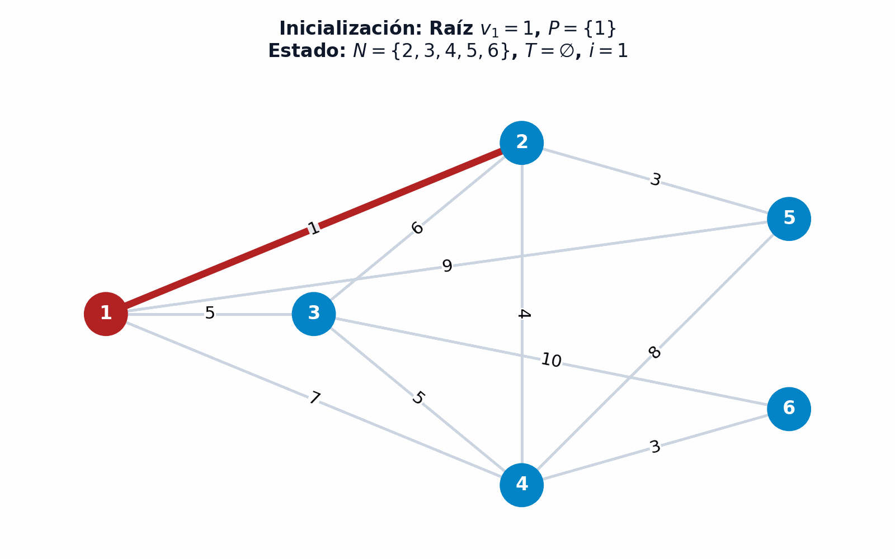

<dialog id="prim_ejemplo_pasos-dialog" style="border:none; border-radius:10px; padding:0; width:88vw; max-width:88vw; height:84vh; max-height:84vh; box-shadow:0 20px 60px rgba(0,0,0,0.55); overflow:hidden; background:#fff;">
  <button onclick="document.getElementById('prim_ejemplo_pasos-dialog').close()"
          style="position:absolute; top:10px; right:14px; z-index:10; background:rgba(15,23,42,0.6); color:#fff; border:none; border-radius:50%; width:30px; height:30px; font-size:17px; cursor:pointer; line-height:1; display:flex; align-items:center; justify-content:center;">×</button>
  <iframe src="images/prim_player.html" width="100%" height="100%" style="border:none; display:block;" scrolling="no"></iframe>
</dialog>

Animación paso a paso de la evolución iterativa de la arborescencia del Algoritmo de Prim sobre la red de 6 nodos.
:::
:::

::: {.content-visible when-format="pdf"}
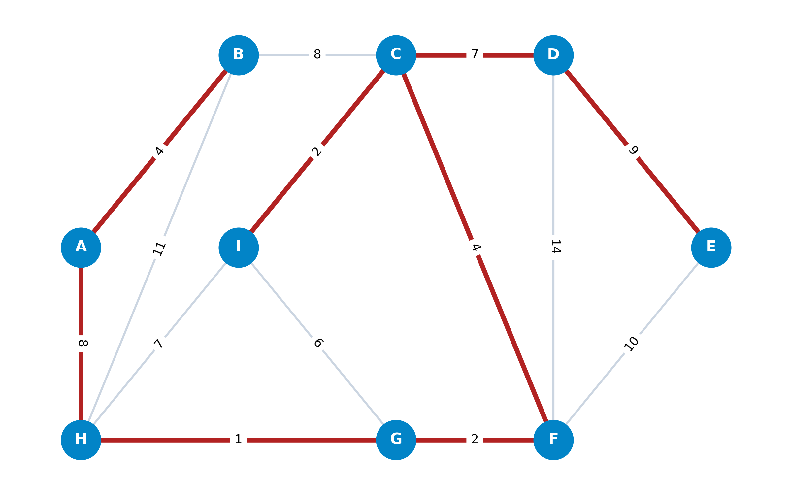{#fig-prim-ejemplo-pasos fig-align="center" width="75%"}
:::

**Conclusión y Peso del Árbol Soporte de Mínimo Peso**:
Al cumplirse $P = V$ (o de forma equivalente $|T| = n - 1 = 5$), el proceso finaliza. El árbol soporte de mínimo peso $H = (V, T)$ acumula un peso total idéntico al obtenido por Kruskal:
$$
d(T) = d_{\{1,2\}} + d_{\{2,5\}} + d_{\{2,4\}} + d_{\{4,6\}} + d_{\{1,3\}} = 1 + 3 + 4 + 3 + 5 = 16
$$

**Observación sobre la Solución Alternativa**:
Puesto que en la iteración $i=5$ existía un empate de peso mínimo ($d=5$) entre las aristas del corte $\{1, 3\}$ y $\{3, 4\}$, si en lugar de seleccionar $\{1, 3\}$ se hubiera optado por incorporar $\{3, 4\}$, se obtendría una **solución alternativa**:
$$
T' = \{\{1, 2\}, \{2, 5\}, \{2, 4\}, \{4, 6\}, \{3, 4\}\}
$$
El peso acumulado en esta arborescencia alternativa es $d(T') = 1 + 3 + 4 + 3 + 5 = 16$, exactamente igual al peso del árbol $T$. Esto reafirma de forma consistente que el Algoritmo de Prim y el Algoritmo de Kruskal llegan al mismo valor del peso del Árbol Soporte de Mínimo Peso ($d(T) = 16$), produciendo la misma familia de soluciones óptimas alternativas ante empates en los pesos de las aristas.
:::

---

### Aplicaciones en aprendizaje no supervisado: clustering basado en MST

En la ciencia de datos moderna y el aprendizaje automático (*machine learning*), uno de los objetivos esenciales del aprendizaje no supervisado (trabajo con datos no etiquetados) es descubrir patrones latentes y estructurar el conjunto de observaciones en grupos o clústeres homogéneos (**clustering**).

La agrupación de datos se realiza en función de la semejanza o desemejanza entre las observaciones.

::: {.callout-note title="Definición: Medida de desemejanza y distancia" data-kind="definicion"}
Dada una colección de observaciones o variables $x, y$, una **función de desemejanza** $\delta(x, y)$ asigna un valor numérico real que cuantifica la divergencia entre ambas observaciones, satisfaciendo las siguientes propiedades fundamentales:

1. **Coincidencia nula**: $\delta(x, y) = 0 \iff x = y$.
2. **No negatividad**: $\delta(x, y) \ge 0$ para todo $x, y$.
3. **Simetría**: $\delta(x, y) = \delta(y, x)$.

Si además la función verifica la **desigualdad triangular** $\delta(x, y) \le \delta(x, z) + \delta(y, z)$, la medida constituye una **distancia métrica** en sentido estricto (como la distancia euclídea $\|x - y\|_2$).
:::

::: {.callout-note title="Comparativa: k-Medias frente a clustering basado en MST" data-kind="nota"}

* **Algoritmo de las $k$-Medias (*$k$-means*)**:

  Es la técnica no supervisada más popular para particionar un conjunto de datos en $K$ clústeres disjuntos $S = \{S_1, \dots, S_K\}$ tales que $S_i \cap S_j = \emptyset$ para todo $i \neq j$, minimizando la variabilidad dentro de cada grupo (*within-cluster variation*):
  $$
  W(S, c) = \sum_{k=1}^K W(S_k) = \sum_{k=1}^K \sum_{x_i \in S_k} \|x_i - c_k\|^2
  $$
  donde $c_k$ representa el centroide (media aritmética) del clúster $S_k$. Al estar basado en regiones de Voronoi delimitadas por hiperplanos, exige implícitamente que los clústeres posean una geometría esférica o convexa.

* **Clustering basado en el Árbol Soporte de Mínimo Peso (MST)**:
  Modela el conjunto de $n$ observaciones como una red completa $G = (V, E, \delta)$ y calcula su MST $T = (V, E')$. Al eliminar las $K - 1$ aristas de mayor peso (mayor desemejanza), particiona la red de forma determinista en $K$ componentes conexas de geometría arbitraria y no lineal.
:::

Como se ilustra en la @fig-mst-clustering-ejemplo, en el panel izquierdo se construye el Árbol Soporte de Mínimo Peso completo sobre $n = 9$ observaciones valoradas por su desemejanza. Al identificar y cortar las $K - 1 = 2$ aristas de mayor peso (la arista $\{2, 4\}$ de longitud $8.5$ y $\{3, 7\}$ de longitud $7.0$, resaltadas en línea discontinua), el grafo se particiona de forma determinista en $K = 3$ clústeres disjuntos bien delimitados (panel derecho).

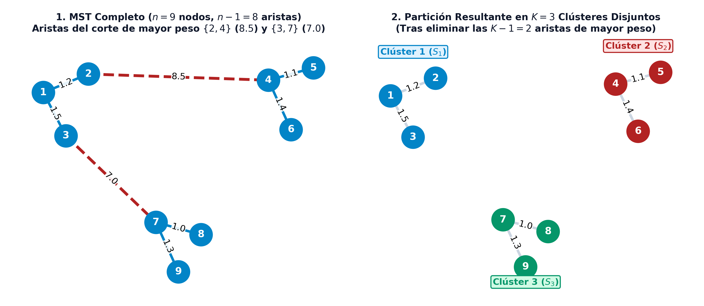{#fig-mst-clustering-ejemplo fig-align="center" width="95%"}

En la @fig-mst-clustering-complejo se observa la capacidad superior del agrupamiento basado en MST para resolver conjuntos de datos con geometrías no convexas complejas (como anillos concéntricos o lunas entrelazadas), situaciones en las que el algoritmo de $k$-medias fracasa al imponer fronteras rígidas de Voronoi.

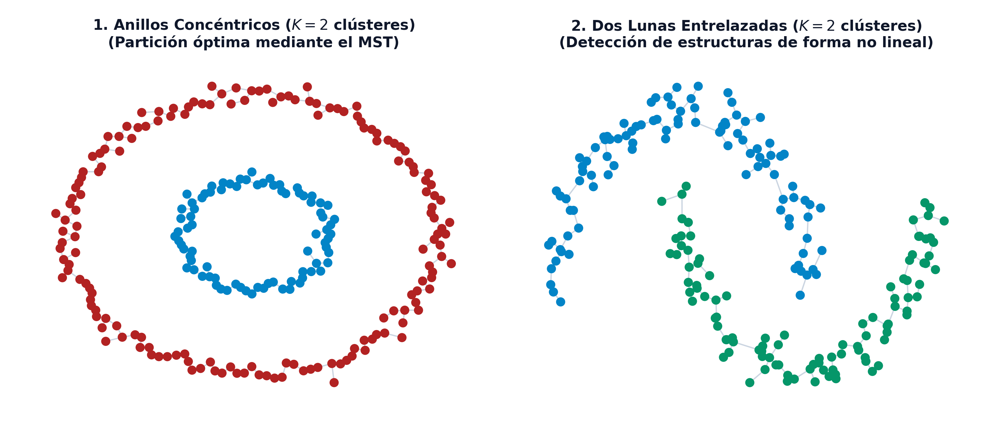{#fig-mst-clustering-complejo fig-align="center" width="95%"}

**Generalización mediante Funciones de Calidad de la Partición**:
Aunque la regla primaria consiste en quitar los $K - 1$ enlaces de mayor peso del MST, es posible encontrar criterios de decisión mucho más elaborados y adaptados a la estructura de los datos mediante una función de evaluación objetiva.

Sea $\mathcal{X}_\ell$ el conjunto de posibles particiones del conjunto de observaciones $\mathbf{X}$ en $\ell$ clústeres o componentes conexas disjuntas. Dado un subgrafo $G' = (V, E'')$ con $\ell$ componentes conexas, denotamos por $C(V, E'') = (X_1, X_2, \dots, X_\ell) \in \mathcal{X}_\ell$ a la partición asociada a $G'$. Se define una función de calidad o validez $F : \mathcal{X}_\ell \to \mathbb{R}$ que evalúa la bondad de la partición. El objetivo consiste en encontrar la partición que maximiza la función $F$.

Para maximizar $F$ sobre el MST se aplica un procedimiento voraz (*greedy*) divisivo:

::: {.callout-note title="Esquema: Maximización de la función de calidad F sobre el MST" data-kind="esquema"}
Dada una red de datos $G = (V, E, \delta)$ y una función de calidad $F$:

1. **Paso 1**: Obtener el árbol soporte de mínimo peso $T = \text{MST}(G) = (V, E', \delta)$.
2. **Paso 2**: Inicializar el conjunto de aristas activas $E'' = E'$.
3. **Paso 3**: Para $i = 1, \dots, K - 1$, hacer:
   * Identificar la arista $\{u, v\} \in E''$ cuya eliminación maximice la calidad de la partición resultante:
     $$
     \{u, v\} = \arg\max_{e \in E''} F(C(V, E'' \setminus \{e\}))
     $$
   * Eliminar la arista $\{u, v\}$ de $E''$: $E'' \leftarrow E'' \setminus \{\{u, v\}\}$.
4. **Paso 4**: Terminar y devolver la partición $C(V, E'')$ como resultado.
:::

::: {.callout-note title="Criterios y funciones de calidad F en la literatura" data-kind="esquema"}
En la literatura científica se emplean diversas especificaciones para la función de calidad $F$:

* **Criterio de mayor longitud (Separación)**:
  $$
  F(X_1, \dots, X_\ell) = \sum_{i=1}^\ell \sum_{x_j \in X_i} x_j
  $$
  (Equivalente a eliminar de forma directa las $K - 1$ aristas de mayor peso en el MST).

* **Suma de cuadrados intra-grupo negativa ($-WCSS$)**:
  $$
  -WCSS(X_1, \dots, X_\ell) = -\sum_{i=1}^\ell \sum_{x_j \in X_i} \|x_j - \mu_i\|^2
  $$
  donde $\mu_i$ representa el centroide del $i$-ésimo clúster.

* **Criterio de información / entropía ($IC$)**:
  $$
  IC(X_1, \dots, X_\ell) = -d \sum_{i=1}^\ell \frac{n_i}{n} \log \frac{L_i}{n_i} - \sum_{i=1}^\ell \frac{n_i}{n} \log \frac{n_i}{n}
  $$
  donde $L_i$ es la suma de los pesos de las aristas en el subárbol asociado al $i$-ésimo clúster y $n_i$ es el número de observaciones en ese grupo.

* **Desviación típica de los pesos de las aristas**: Minimización de la dispersión de las distancias entre aristas dentro de los clústeres.
:::

::: {.callout-warning title="Estrategia aglomerativa e inconvenientes prácticos" data-kind="advertencia"}
Una alternativa al algoritmo divisivo anterior consiste en utilizar una estrategia aglomerativa o acumulativa (de filosofía análoga al Algoritmo de Kruskal): comenzar con $E'' = \emptyset$ e ir añadiendo aristas una a una del MST que maximicen la función $F(C(V, E'' \cup \{\{u,v\}\}))$ hasta alcanzar $K$ componentes conexas.

Sin embargo, esta aproximación aglomerativa resulta computacionalmente menos eficiente y puede presentar problemas cuando se forman grupos aislados con muy pocas observaciones en las iteraciones iniciales. Para resolver esta inestabilidad, diversos autores modifican el algoritmo introduciendo penalizaciones o restricciones (utilizando el **índice de Gini**) que dan prioridad a los grupos más pequeños cuando existe una disparidad excesiva en la dimensión de los clústeres.
:::

