# Caminos mínimos

El **problema del camino mínimo** (*Shortest Path Problem*) constituye una de las piedras angulares de la optimización de redes y de la investigación operativa contemporánea [@ahuja1993network; @bertsekas1998network; @cormen2009introduction]. Su propósito fundamental es determinar la ruta de menor coste, distancia o tiempo acumulado entre un nodo origen $s$ y un nodo destino $t$, o bien desde un origen único hacia la totalidad de los vértices de una red.

Más allá de sus aplicaciones inmediatas en la planificación de transporte, la navegación GPS, el enrutamiento de paquetes en redes de telecomunicaciones y la logística de distribución, el problema del camino mínimo actúa como subproblema crítico en algoritmos de mayor envergadura, tales como los métodos de generación de columnas en programación entera, el diseño de redes de flujo de coste mínimo y la programación dinámica multietapa.

::: {.callout-important title="Objetivos de aprendizaje" data-kind="objetivos"}
Al finalizar este capítulo, serás capaz de:

1.  **Formular y fundamentar** el problema del camino mínimo en digrafos valorados definiendo formalmente su matriz de distancias directas y analizando las condiciones de existencia de solución óptima finita.
2.  **Deducir y resolver** las ecuaciones de optimalidad de Bellman a partir del Principio de Optimalidad de la programación dinámica, identificando las causas de insuficiencia ante circuitos de coste nulo o negativo.
3.  **Aplicar la ordenación topológica** en redes acíclicas (DAGs) para calcular caminos mínimos en tiempo lineal $O(|V| + |A|)$.
4.  **Demostrar y ejecutar** el algoritmo de Dijkstra en redes con costes no negativos, comprendiendo su carácter goloso y su complejidad computacional.
5.  **Programar y evaluar** el algoritmo de Bellman-Ford para redes con arcos de coste negativo, aplicando el criterio de detección de circuitos de coste negativo en tiempo $O(|V| \cdot |A|)$.
6.  **Formular y analizar** el problema mediante programación lineal primal-dual, justificando la integridad de las soluciones mediante la Total Unimodularidad (TUM) de la matriz de incidencia nodo-arco e interpretando los potenciales nodales duales.
7.  **Calcular distancias entre todos los pares de nodos** aplicando el algoritmo de multiplicación de matrices en álgebra min-suma y la relación de recurrencia de programación dinámica del algoritmo de Floyd-Warshall.
:::

---

## Definición formal y condiciones de existencia

Consideremos un digrafo conexo valorado $G = (V, U, \mathbf{d})$, donde $V = \{1, 2, \dots, n\}$ representa el conjunto de vértices o nodos, $U \subseteq V \times V$ denota el conjunto de arcos dirigidos con cardinalidad $|U| = m$, y $\mathbf{d} \in \mathbb{R}^m$ es un vector cuyas componentes $d(u) = d_{ij}$ asignan un coste, tiempo o distancia a cada arco dirigido $u = (i, j) \in U$.

::: {.callout-note title="Definición: Red valorada y longitud de un camino" data-kind="definicion"}
Dado un camino dirigido $\mu = (v_0, v_1, v_2, \dots, v_k)$ en $G$, compuesto por una secuencia de arcos $(v_{j-1}, v_j) \in U$ para todo $j = 1, \dots, k$, la **longitud o coste acumulado del camino** $d(\mu)$ se define como la suma de las longitudes de los arcos que lo integran:

$$
d(\mu) = \sum_{u \in \mu} d_u = \sum_{j=1}^k d_{v_{j-1}, v_j}
$$
:::

Para formalizar algebraicamente las conexiones de la red, se introduce la **matriz de distancias directas** $D \in \overline{\mathbb{R}}^{n \times n}$, cuyas componentes $d_{ij}$ se definen para todo par de vértices $i, j \in V$ como:

$$
d_{ij} = \begin{cases} 
0 & \text{si } i = j \\ 
d_u & \text{si } u = (i, j) \in U \\ 
+\infty & \text{si } (i, j) \notin U \text{ y } i \neq j 
\end{cases}
$$

Esta representación matricial permite modelar problemas de transporte, telecomunicaciones y logística de variada naturaleza, como se ilustra en los dos ejemplos siguientes.

::: {.callout-tip title="Ejemplo: Red de itinerarios de vuelos internacionales" data-kind="ejemplo" collapse="true"}
Un viajero desea planificar la ruta de coste mínimo para volar desde Madrid ($M$) hasta Tokio ($T$). Al no existir un vuelo directo, debe realizar al menos una escala en los aeropuertos intermedios de Londres ($L$), París ($P$), Frankfurt ($F$) o Singapur ($S$).

El problema se modela sobre un digrafo $G = (V, U)$ donde los vértices representan los aeropuertos $V = \{M, L, F, P, S, T\}$ y los arcos corresponden a los vuelos directos disponibles con sus respectivas tarifas en euros:

* Desde $M$: arcos $(M, L)$ con coste 20, $(M, F)$ con coste 40, $(M, P)$ con coste 27.
* Desde $L$: arco $(L, F)$ con coste 10.
* Entre $F$ y $P$: arcos bidireccionales $(F, P)$ con coste 11 y $(P, F)$ con coste 9.
* Desde $F$ y $P$ hacia Asia: $(F, S)$ con coste 90, $(P, S)$ con coste 100, $(P, T)$ con coste 150.
* Desde $S$: arco $(S, T)$ con coste 35.

Como se ilustra en la @fig-cminimo-ejemplo-vuelos, la resolución de este problema consiste en hallar la secuencia de arcos dirigidos que conecte $M$ con $T$ minimizando el sumatorio de las tarifas asociadas.

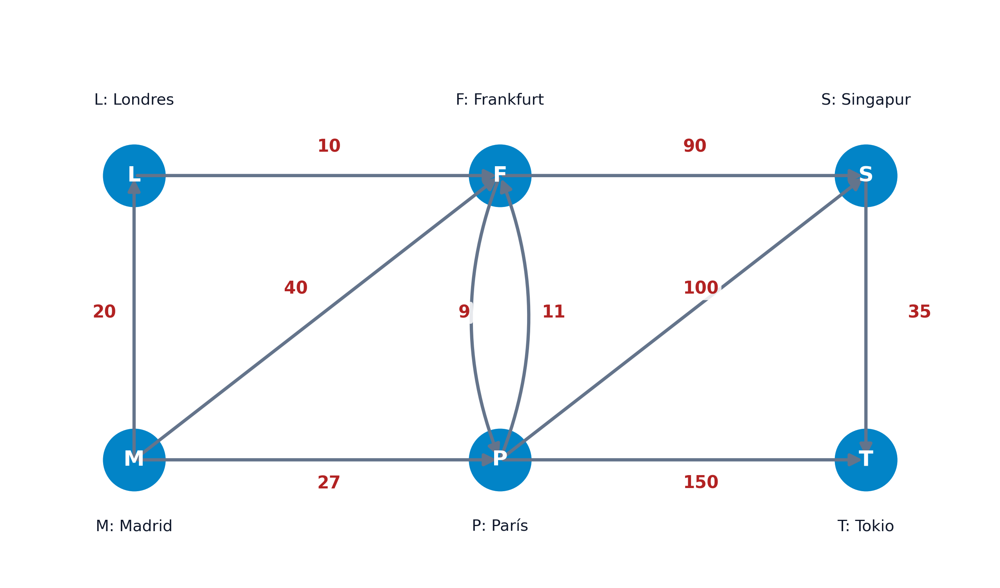{#fig-cminimo-ejemplo-vuelos fig-align="center" width="75%"}
:::

::: {.callout-tip title="Ejemplo: Planificación de transporte marítimo con costes y beneficios" data-kind="ejemplo" collapse="true"}
Un buque de carga debe determinar la ruta óptima de transporte desde un puerto de origen $O$ hasta un puerto de destino $D$. En los puertos intermedios, el buque puede recoger carga para trasladarla a otro puerto obteniendo un beneficio neto, o bien viajar de vacío con el consiguiente coste operativo de combustible.

El problema se representa sobre un digrafo valorado en el que los vértices representan los puertos y los arcos las rutas navegables. El peso de cada arco cuantifica el beneficio o pérdida económica del trayecto:

* Si las pérdidas y costes operativos se representan con valores positivos ($d_{ij} > 0$).
* Si los beneficios netos se representan mediante valores negativos ($d_{ij} < 0$, interpretados como "pérdidas negativas").

La solución óptima corresponderá al camino de coste mínimo (máximo beneficio neto acumulado) que une el origen $O$ con el destino $D$.
:::

A diferencia de otras estructuras de optimización como el árbol soporte de mínimo peso (MST), el cual siempre cuenta con una solución finita y acotada para cualquier grafo conexo, el problema del camino mínimo entre dos vértices $s, t \in V$ presenta particularidades fundamentales cuando la red contiene arcos con costes negativos. Antes de desarrollar los algoritmos de resolución, resulta imprescindible analizar las condiciones matemáticas de existencia de solución óptima.

::: {.callout-tip title="Ejemplo: Paradoja del camino en grafos con circuitos de coste negativo" data-kind="ejemplo" collapse="true"}
Consideremos la red dirigida ilustrada en la @fig-cminimo-circuito-negativo, compuesta por 7 vértices y arcos con costes positivos y negativos. Se desea determinar el camino mínimo desde el nodo $a$ hasta el nodo $f$.

Una primera aproximación evalúa el camino simple $\mu_1 = (a, b, e, f)$, cuyo coste acumulado es:

$$
d(\mu_1) = d_{ab} + d_{be} + d_{ef} = 3 + (-6) + 2 = -1
$$

Sin embargo, observemos que el subgrafo contiene el circuito cerrado $\mu_C = (b, e, f, b)$, cuyo coste total es:

$$
d(\mu_C) = d_{be} + d_{ef} + d_{fb} = -6 + 2 + 2 = -2 < 0
$$

Si trazamos un nuevo camino $\mu_2 = (a, b, e, f, b, e, f)$ que recorre el circuito $\mu_C$ una vez adicional antes de finalizar en $f$, se obtiene un coste de:

$$
d(\mu_2) = 3 + (-6) + 2 + 2 + (-6) + 2 = -3 < -1
$$

Al iterar $k$ veces sobre el circuito $\mu_C$, el coste acumulado es $d(\mu_k) = -1 - 2k$. Conforme $k \to \infty$, el coste tiende a $-\infty$. En consecuencia, **no existe ningún camino mínimo finito** hacia el nodo $f$.

::: {.content-visible when-format="html"}
::: {#fig-cminimo-circuito-negativo}
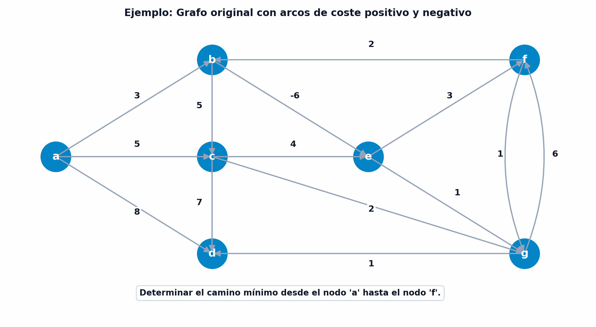

<dialog id="circuito_negativo-dialog" style="border:none; border-radius:10px; padding:0; width:88vw; max-width:88vw; height:84vh; max-height:84vh; box-shadow:0 20px 60px rgba(0,0,0,0.55); overflow:hidden; background:#fff;">
  <button onclick="document.getElementById('circuito_negativo-dialog').close()"
          style="position:absolute; top:10px; right:14px; z-index:10; background:rgba(15,23,42,0.6); color:#fff; border:none; border-radius:50%; width:30px; height:30px; font-size:17px; cursor:pointer; line-height:1; display:flex; align-items:center; justify-content:center;">×</button>
  <iframe src="images/circuito_negativo_player.html" width="100%" height="100%" style="border:none; display:block;" scrolling="no"></iframe>
</dialog>

Animación paso a paso de la paradoja del camino en grafos con circuitos de coste negativo.
:::
:::

::: {.content-visible when-format="pdf"}
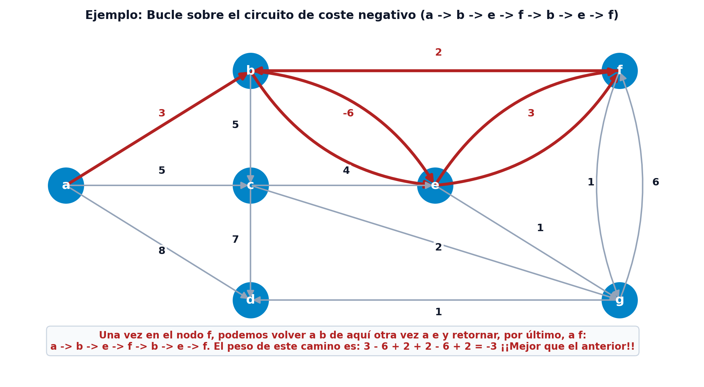{#fig-cminimo-circuito-negativo fig-align="center" width="75%"}
:::
:::

El comportamiento divergente mostrado en el ejemplo anterior evidencia que la presencia de circuitos cerrados con coste total estrictamente negativo impide la existencia de una solución finita. Esta propiedad permite enunciar el teorema fundamental de existencia de solución óptima.

::: {.callout-important title="Teorema: Condición de existencia de solución óptima finita" data-kind="teorema"}
Dada una red dirigida valorada $G = (V, U, \mathbf{d})$ y dos vértices fijados $s, t \in V$, el problema de encontrar el camino mínimo entre $s$ y $t$ tiene solución óptima finita si y sólo si se satisfacen simultáneamente las siguientes dos hipótesis:

* **Hipótesis $H_1$ (Accesibilidad)**: Existe al menos un camino dirigido en $G$ que une el nodo origen $s$ con el nodo destino $t$.
* **Hipótesis $H_2$ (Ausencia de circuitos de coste negativo)**: Ningún camino dirigido de $s$ a $t$ contiene un circuito cuyo coste acumulado sea estrictamente negativo.

*Demostración*:
$(\implies)$ Si no se cumple $H_1$, no existen caminos de $s$ a $t$, por lo que la distancia es $+\infty$. Si no se cumple $H_2$, existe un camino de $s$ a $t$ que atraviesa un circuito $\mu_C$ con $d(\mu_C) < 0$. Recorriendo $\mu_C$ arbitrariamente $k$ veces, el coste acumulado se reduce a $-\infty$, impidiendo la existencia de un mínimo finito.

$(\impliedby)$ Si se cumplen $H_1$ y $H_2$, el número de caminos simples (elementales, sin repetición de vértices) entre $s$ y $t$ es finito al ser $|V| = n$ finito. Como todo circuito en los caminos tiene coste $d(\mu_C) \ge 0$, la eliminación de cualquier circuito no incrementa la longitud del camino. Por tanto, el mínimo sobre el conjunto finito de caminos simples es un valor real bien definido y finito.
:::

---

## Ecuaciones de optimalidad de Bellman

El fundamento teórico dominante para la resolución de problemas de rutas mínimas descansa en el **Principio de Optimalidad** formulado por Richard E. Bellman en 1957 [@bellman1957dynamic; @bellman1958routing].

::: {.callout-note title="Principio de Optimalidad de Bellman (1957)" data-kind="definicion"}
Una secuencia óptima de decisiones que resuelve un problema de optimización multietapa debe cumplir la propiedad de que, cualquiera que sea el estado inicial y la decisión inicial adoptada, las decisiones restantes deben constituir una **política óptima** con respecto al estado resultante de la primera decisión.

En el contexto de redes: **Toda subpolítica de una política óptima es a su vez una subpolítica óptima**.
:::

La traslación de este principio a la teoría de caminos mínimos establece que si un camino $\mu^*[s, t]$ es de coste mínimo entre el origen $s$ y el destino $t$, cualquier subcamino $\mu^*[i, j]$ contenido en él debe ser, de forma obligatoria, el camino de coste mínimo entre los vértices intermedios $i$ y $j$.

Denotemos por $u_{ij}$ la longitud del camino mínimo entre los vértices $i$ y $j$. Para cualquier par $s, t \in V$, la distancia óptima satisface la relación de consistencia:

$$
u_{st} = \min_{i, j \in V} \{ u_{si} + u_{ij} + u_{jt} \}
$$

En particular, si fijamos un origen único $s = 1$ y denotamos por $u_j \equiv u_{1j}$ a la distancia mínima desde el origen $1$ al nodo $j \in V$, podemos descomponer la última etapa identificando el predecesor directo $i$ del nodo $j$, obteniendo el sistema fundamental de ecuaciones de optimalidad.

::: {.callout-important title="Ecuaciones de optimalidad de Bellman" data-kind="teorema"}
Dada una red dirigida valorada $G = (V, U, \mathbf{d})$ sin circuitos de coste negativo, las distancias mínimas $u_j$ desde el nodo origen $1$ a cada uno de los demás nodos $j \in V \setminus \{1\}$ satisfacen el sistema de ecuaciones no lineales:

$$
\begin{aligned}
u_1 &= 0 \\
u_j &= \min_{k \neq j} \{ u_k + d_{kj} \}, \quad \forall j = 2, \dots, n
\end{aligned}
$$

Donde $d_{kj}$ son las componentes de la matriz de distancias directas $D$.
:::

Las ecuaciones de optimalidad de Bellman identifican las condiciones necesarias que deben verificar las distancias mínimas $u_j$ desde un vértice origen a todos los demás nodos de la red. Físicamente, establecen que la longitud del camino mínimo hasta cualquier nodo $j$ equivale al mínimo entre las distancias acumuladas a sus predecesores directos $k$ más el coste del arco de entrada $(k, j)$. Sin embargo, por sí solas, estas ecuaciones presentan dos limitaciones fundamentales: no indican el orden secuencial en el que deben resolverse los nodos (lo que en redes generales exigiría explorar $O(n!)$ combinaciones) y no garantizan la unicidad de solución en presencia de circuitos de coste nulo o negativo.

Para observar el funcionamiento analítico de este sistema, examinemos un primer ejemplo numérico sobre un digrafo de 5 nodos.

::: {.callout-tip title="Ejemplo: Planteamiento y resolución de las ecuaciones de Bellman" data-kind="ejemplo" collapse="true"}
Consideremos el digrafo valorado de 5 nodos presentado en la @fig-bellman-ecuaciones-ejemplo. Se desea formular las ecuaciones de Bellman y determinar la distancia mínima desde el nodo 1 al resto de los vértices.

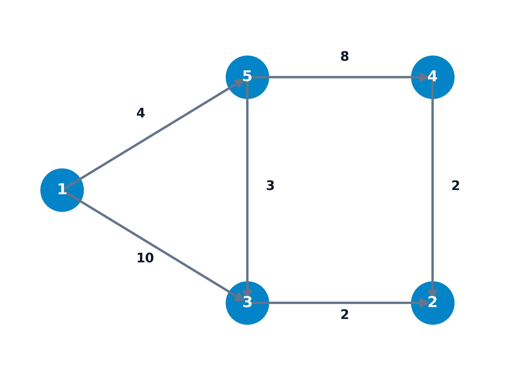{#fig-bellman-ecuaciones-ejemplo fig-align="center" width="65%"}

El sistema de ecuaciones de Bellman para el origen $s = 1$ se plantea expresando la etiqueta de cada nodo en función del mínimo de sus predecesores directos:

$$
\begin{aligned}
u_1 &= 0 \\
u_5 &= \min \{ u_1 + d_{15} \} = \min \{ 0 + 4 \} = 4 \\
u_3 &= \min \{ u_1 + d_{13}, u_5 + d_{53} \} = \min \{ 0 + 10, 4 + 3 \} = \min \{ 10, 7 \} = 7 \\
u_4 &= \min \{ u_5 + d_{54} \} = \min \{ 4 + 8 \} = 12 \\
u_2 &= \min \{ u_3 + d_{32}, u_4 + d_{42} \} = \min \{ 7 + 2, 12 + 2 \} = \min \{ 9, 14 \} = 9
\end{aligned}
$$

Al resolver consecutivamente el sistema, se obtienen las distancias geodésicas y la arborescencia óptima:

* **Vector de distancias mínimas**: $\mathbf{u} = (u_1, u_2, u_3, u_4, u_5) = (0, 9, 7, 12, 4)$.
* **Vector de predecesores**: $\text{Pred} = (1, 3, 5, 5, 1)$.
* **Arborescencia de caminos mínimos**: $\{ (1,5), (5,3), (5,4), (3,2) \}$.
:::

A pesar de su claridad teórica, es crucial recalcar que las ecuaciones de Bellman constituyen una **condición necesaria** de optimalidad, pero no siempre suficiente. En particular, si la red contiene circuitos cerrados con coste nulo ($d(\mu_C) = 0$), el sistema algebraico admite múltiples soluciones, de las cuales solo una representa las verdaderas distancias mínimas.

::: {.callout-tip title="Ejemplo: No unicidad de solución por presencia de circuito de coste nulo" data-kind="ejemplo" collapse="true"}
Consideremos el digrafo de 3 nodos mostrado en la @fig-cminimo-circuito-nulo, con arcos $(1, 2)$ de peso 10, $(2, 3)$ de peso $1$ y $(3, 2)$ de peso $-1$. El circuito formado por los nodos 2 y 3 posee un coste total $d_{23} + d_{32} = 1 + (-1) = 0$.

El sistema de ecuaciones de Bellman para el origen $s = 1$ es:

$$
\begin{aligned}
u_1 &= 0 \\
u_2 &= \min \{ u_1 + d_{12}, u_3 + d_{32} \} = \min \{ 0 + 10, u_3 - 1 \} \\
u_3 &= \min \{ u_1 + d_{13}, u_2 + d_{23} \} = \min \{ 0 + \infty, u_2 + 1 \} = u_2 + 1
\end{aligned}
$$

Todo vector $(u_1, u_2, u_3)$ que satisfaga la relación $u_1 = 0$, $u_2 \le 10$ y $u_3 = u_2 + 1$ constituye una solución matemática del sistema:

* Si fijamos $u_2 = 10 \implies u_3 = 11$. Este vector $(0, 10, 11)$ identifica la distancia mínima real.
* Sin embargo, el vector arbitrario $(0, 5, 6)$ también satisface el sistema algebraico ($5 = \min\{10, 6-1\} = 5$ y $6 = 5+1$), pero **no representa las distancias mínimas**.

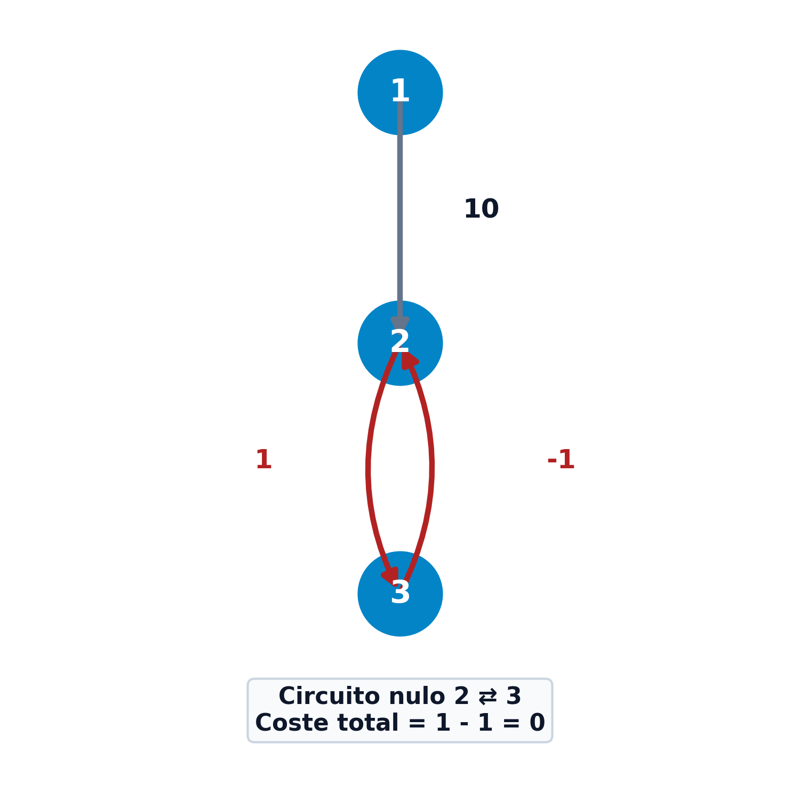{#fig-cminimo-circuito-nulo fig-align="center" width="55%"}
:::

Para garantizar que las ecuaciones de Bellman determinen de forma única las distancias geodésicas y permitan construir la arborescencia soporte de caminos mínimos, se exige la ausencia estricta de circuitos dirigidos de coste nulo o negativo.

::: {.callout-note title="Proposición: Construcción de la arborescencia asociada a las ecuaciones de Bellman" data-kind="corolario"}
Las ecuaciones de optimalidad de Bellman:

$$
\begin{aligned}
u_1 &= 0 \\
u_j &= \min_{k \neq j} \{ u_k + d_{kj} \}, \quad \forall j \neq 1
\end{aligned}
$$

permiten construir de forma única la **arborescencia de caminos mínimos** con raíz en el origen 1 si y sólo si en la red no existen circuitos dirigidos de longitud o coste nulo ni negativo.
:::

Apliquemos nuevamente esta proposición al problema planteado en la red de aeropuertos para verificar la construcción analítica de sus rutas óptimas.

::: {.callout-tip title="Ejemplo: Planteamiento de las ecuaciones de Bellman en el problema de la red de aeropuertos" data-kind="ejemplo" collapse="true"}
Consideremos el problema de la red de aeropuertos presentado en la @fig-cminimo-ejemplo-vuelos, con el origen fijado en el aeropuerto de Madrid ($M$). Se desea formular las ecuaciones de Bellman y obtener el camino mínimo desde el nodo $M$ a todos los demás destinos.

El sistema de ecuaciones de Bellman se plantea evaluando la etiqueta de cada aeropuerto como el mínimo sobre todos sus vuelos de llegada directos:

$$
\begin{aligned}
u_M &= 0 \\
u_L &= \min \{ u_M + d_{ML} \} = \min \{ 0 + 20 \} = 20 \\
u_P &= \min \{ u_M + d_{MP}, u_F + d_{FP} \} = \min \{ 0 + 27, 30 + 9 \} = 27 \\
u_F &= \min \{ u_M + d_{MF}, u_L + d_{LF}, u_P + d_{PF} \} \\
    &= \min \{ 0 + 40, 20 + 10, 27 + 11 \} = \min \{ 40, 30, 38 \} = 30 \\
u_S &= \min \{ u_F + d_{FS}, u_P + d_{PS} \} = \min \{ 30 + 90, 27 + 100 \} = \min \{ 120, 127 \} = 120 \\
u_T &= \min \{ u_P + d_{PT}, u_S + d_{ST} \} = \min \{ 27 + 150, 120 + 35 \} = \min \{ 177, 155 \} = 155
\end{aligned}
$$

La resolución directa del sistema proporciona las siguientes soluciones:

* **Vector de distancias mínimas**: $\mathbf{u} = (u_M, u_L, u_F, u_P, u_S, u_T) = (0, 20, 30, 27, 120, 155)$.
* **Arborescencia de rutas óptimas**: Integrada por las trayectorias $M \to L$ (Londres: 20), $M \to P$ (París: 27), $M \to L \to F$ (Frankfurt: 30), $M \to L \to F \to S$ (Singapur: 120) y $M \to L \to F \to S \to T$ (Tokio: 155).
:::

Finalmente, debemos reflexionar sobre la complejidad computacional asociada a la resolución práctica de las ecuaciones de Bellman:

* **Complejidad factorial $O(n!)$**: Sin conocer de antemano el orden en el que deben resolverse los vértices, evaluar el sistema explorando todas las secuencias posibles de predecesores requiere un esfuerzo combinatorio de $O(n!)$.
* **Reducción de complejidad mediante ordenación topológica**: Si se logra establecer una ordenación adecuada de los nodos, la complejidad de resolución del sistema de Bellman se reduce drásticamente a $O(n^2)$ (o tiempo estrictamente lineal $O(|V| + |U|)$) más el coste del algoritmo de ordenación.
* **Restricción de aciclicidad**: Dicha ordenación topológica secuencial **únicamente es posible si el grafo no contiene circuitos dirigidos** (Grafos Dirigidos Acíclicos o DAGs).

---

## Redes sin circuitos (DAGs) y ordenación topológica

Cuando una red dirigida no contiene circuitos cerrados (*Directed Acyclic Graph*, DAG), su estructura topológica permite ordenar los vértices de manera secuencial. Esta propiedad resulta determinante, pues transforma el complejo sistema no lineal de ecuaciones de Bellman en una sucesión de cálculos directos en tiempo **estrictamente lineal** $O(|V| + |U|)$.

::: {.callout-note title="Proposición: Caracterización de digrafos acíclicos mediante ordenación topológica" data-kind="proposicion"}
Un digrafo $G = (V, U)$ no tiene circuitos dirigidos (es un DAG) si y sólo si existe una **ordenación o numeración topológica** de sus $n$ vértices $v_1, v_2, \dots, v_n$ tal que para todo arco dirigido $(i, j) \in U$ se cumple la condición estricta de orden:

$$
i < j
$$
:::

::: {.callout-tip title="Ejemplo: Verificación de la propiedad de ordenación topológica" data-kind="ejemplo" collapse="true"}
Consideremos nuevamente el digrafo de 5 nodos presentado en la @fig-bellman-ecuaciones-ejemplo. En dicho grafo, los vértices pueden disponerse en la secuencia de ordenación topológica $(1, 5, 3, 4, 2)$.

Al examinar individualmente cada uno de los arcos dirigidos existentes en la red:

* $(1, 5) \implies 1^\circ \text{ precede a } 2^\circ$ (cumple $i < j$).
* $(1, 3) \implies 1^\circ \text{ precede a } 3^\circ$ (cumple $i < j$).
* $(5, 4) \implies 2^\circ \text{ precede a } 4^\circ$ (cumple $i < j$).
* $(5, 3) \implies 2^\circ \text{ precede a } 3^\circ$ (cumple $i < j$).
* $(4, 2) \implies 4^\circ \text{ precede a } 5^\circ$ (cumple $i < j$).
* $(3, 2) \implies 3^\circ \text{ precede a } 5^\circ$ (cumple $i < j$).

Puesto que todos los arcos avanzan estrictamente de izquierda a derecha sin la presencia de arcos de retroceso, se confirma que la secuencia de numeración satisface rigurosamente la propiedad de aciclicidad.
:::

Para determinar esta numeración de manera sistemática en cualquier red acíclica, se ejecuta el siguiente algoritmo basado en la eliminación sucesiva de nodos fuentes (nodos sin arcos de entrada).

::: {.callout-note title="Esquema: Algoritmo de numeración y ordenación topológica" data-kind="esquema"}
Dada una red dirigida $G = (V, U)$ con $n = |V|$ vértices:

1. **Paso 0 (Inicialización)**:
   * Hacer $k \leftarrow 1$ y $V' \leftarrow V, U' \leftarrow U$.

2. **Paso 1 (Selección de nodo fuente)**:
   * Seleccionar un nodo $i \in V'$ al que no llegue ningún arco en $U'$ (grado de entrada $d^-(i) = 0$). En un digrafo acíclico siempre existe al menos un nodo fuente.

3. **Paso 2 (Asignación y eliminación)**:
   * Asignar al nodo $i$ el número de orden topológico $k$.
   * Eliminar el nodo $i$ y todos los arcos que inciden en él: $V' \leftarrow V' \setminus \{i\}$, $U' \leftarrow U' \setminus \{ (i, j) \in U' \}$.

4. **Paso 3 (Criterio de Parada)**:
   * Si $k = n$, detener el procedimiento (se han numerado todos los nodos).
   * En otro caso, hacer $k \leftarrow k + 1$ y regresar al Paso 1.
:::

Una vez que la red ha sido ordenada topológicamente de modo que los arcos cumplan $i < j$, la resolución del sistema de ecuaciones de Bellman se vuelve **completamente trivial y directa**. No es necesario realizar iteraciones aproximadas ni resolver sistemas de ecuaciones simultáneas: basta con calcular secuencialmente la etiqueta de distancia mínima $u_j$ de cada nodo $j = 2, \dots, n$ evaluando a sus predecesores directos $i < j$ que ya han sido resueltos previamente:

$$
\begin{aligned}
u_1 &= 0 \\
u_j &= \min_{i < j, \, (i, j) \in U} \{ u_i + d_{ij} \}, \quad \forall j = 2, \dots, n
\end{aligned}
$$

Puesto que cada arco de la red se examina exactamente una vez durante este recorrido secuencial de izquierda a derecha, la complejidad algorítmica total es **estrictamente lineal $O(|V| + |U|)$**.

::: {.callout-tip title="Ejemplo: Resolución de las ecuaciones de Bellman en un DAG de 7 nodos" data-kind="ejemplo" collapse="true"}
Consideremos el digrafo acíclico de 7 nodos presentado en la @fig-dag-ejemplo-7nodos, cuyos vértices ya están numerados respetando el orden topológico $i < j$. Se desea calcular las distancias mínimas desde el origen $s = 1$ a todos los vértices de la red.

Evaluando las ecuaciones de Bellman en orden topológico creciente de $j = 1$ a $7$:

* **Nodo 1 (Origen)**: $u_1 = 0$.
* **Nodo 2** (Predecesores $\{1\}$):
  $$u_2 = u_1 + d_{12} = 0 + 3 = 3 \implies \text{Pred}(2) = 1$$
* **Nodo 3** (Predecesores $\{1, 2\}$):
  $$u_3 = \min \{ u_1 + d_{13}, u_2 + d_{23} \} = \min \{ 0 + 5, 3 + 5 \} = 5 \implies \text{Pred}(3) = 1$$
* **Nodo 4** (Predecesores $\{2, 3\}$):
  $$u_4 = \min \{ u_2 + d_{24}, u_3 + d_{34} \} = \min \{ 3 - 6, 5 + 4 \} = -3 \implies \text{Pred}(4) = 2$$
* **Nodo 5** (Predecesores $\{2, 4\}$):
  $$u_5 = \min \{ u_2 + d_{25}, u_4 + d_{45} \} = \min \{ 3 + 2, -3 + 2 \} = -1 \implies \text{Pred}(5) = 4$$
* **Nodo 6** (Predecesores $\{3, 4, 5\}$):
  $$u_6 = \min \{ u_3 + d_{36}, u_4 + d_{46}, u_5 + d_{56} \} = \min \{ 5 + 2, -3 + 3, -1 + 6 \} = 0 \implies \text{Pred}(6) = 4$$
* **Nodo 7** (Predecesores $\{1, 3, 6\}$):
  $$u_7 = \min \{ u_1 + d_{17}, u_3 + d_{37}, u_6 + d_{67} \} = \min \{ 0 + 8, 5 + 7, 0 + 1 \} = 1 \implies \text{Pred}(7) = 6$$

::: {.content-visible when-format="html"}
::: {#fig-dag-ejemplo-7nodos}
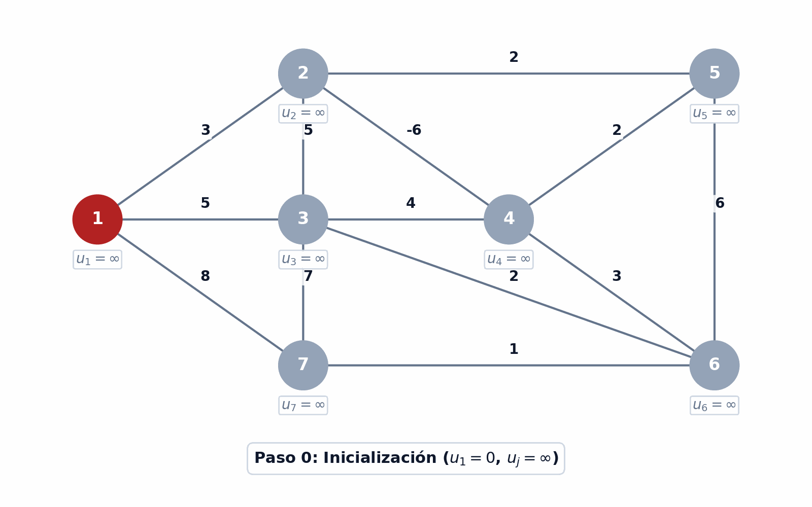

<dialog id="dag_7nodos-dialog" style="border:none; border-radius:10px; padding:0; width:88vw; max-width:88vw; height:84vh; max-height:84vh; box-shadow:0 20px 60px rgba(0,0,0,0.55); overflow:hidden; background:#fff;">
  <button onclick="document.getElementById('dag_7nodos-dialog').close()"
          style="position:absolute; top:10px; right:14px; z-index:10; background:rgba(15,23,42,0.6); color:#fff; border:none; border-radius:50%; width:30px; height:30px; font-size:17px; cursor:pointer; line-height:1; display:flex; align-items:center; justify-content:center;">×</button>
  <iframe src="images/dag_ejemplo_7nodos_player.html" width="100%" height="100%" style="border:none; display:block;" scrolling="no"></iframe>
</dialog>

Animación paso a paso de la resolución de las ecuaciones de Bellman en un DAG de 7 nodos.
:::
:::

::: {.content-visible when-format="pdf"}
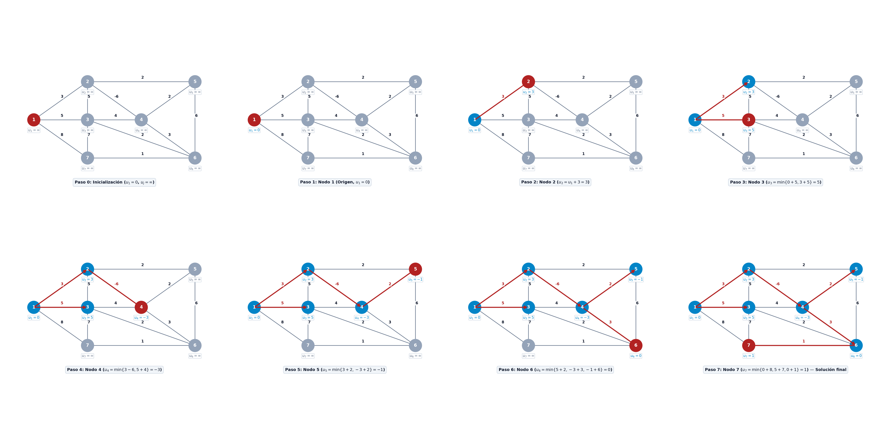{#fig-dag-ejemplo-7nodos fig-align="center" width="80%"}
:::

Al resolver consecutivamente el sistema, obtenemos los siguientes resultados:

El vector de distancias mínimas es $\mathbf{u} = (u_1, u_2, u_3, u_4, u_5, u_6, u_7) = (0, 3, 5, -3, -1, 0, 1)$, mientras que el vector de predecesores resulta ser $\text{Pred} = (1, 1, 1, 2, 4, 4, 6)$. Finalmente, la arborescencia de caminos mínimos queda conformada por las aristas dirigidas $\{ (1,2), (1,3), (2,4), (4,5), (4,6), (6,7) \}$.
:::

---

## Redes con pesos no negativos: Algoritmo de Dijkstra

Para redes dirigidas generales en las que las longitudes de todos los arcos son estrictamente no negativas ($d_{ij} \ge 0$), el procedimiento de origen único más eficiente y célebre es el **Algoritmo de Dijkstra**, introducido por Edsger W. Dijkstra en 1959 [@dijkstra1959note].

El fundamento conceptual de esta técnica reside en su naturaleza de algoritmo **voraz** (*greedy*) basado en un mecanismo de etiquetado permanente. A diferencia de otros enfoques exploratorios que requieren múltiples pasadas sobre el grafo, el algoritmo de Dijkstra construye la solución óptima acumulativamente: en cada etapa, fija la distancia geodésica definitiva desde el origen $1$ hacia exactamente un nuevo nodo de la red, garantizando que el problema quede resuelto por completo tras un máximo de $n - 1$ iteraciones.

::: {.callout-note title="Definición: Subconjuntos de etiquetado y cota de distancia $u_j^P$" data-kind="definicion"}
En la etapa $k$ de la ejecución del Algoritmo de Dijkstra, los vértices del grafo $V$ se dividen dinámicamente en dos subconjuntos disjuntos:

1. **Conjunto de nodos permanentes $\mathcal{P} \subset V$**: Agrupa a los $k$ vértices (con $1 \in \mathcal{P}$) para los cuales ya se conoce de forma exacta su distancia mínima desde el origen. Para todo nodo $j \in \mathcal{P}$, la etiqueta $u_j$ es exactamente igual al valor óptimo $d(1, j)$.
2. **Conjunto de nodos transitorios $\mathcal{T} = V \setminus \mathcal{P}$**: Agrupa a los vértices restantes para los cuales la etiqueta $u_j$ representa únicamente una cota superior provisional del camino mínimo.

Dado este subconjunto $\mathcal{P}$, la cota provisional $u_j^P$ asociada a un nodo $j \in V$ se define como la longitud del camino mínimo desde el origen $1$ al nodo $j$ restringido a utilizar como vértices intermedios **únicamente elementos pertenecientes a $\mathcal{P}$**:

$$
u_j^P \equiv \text{longitud del camino mínimo de } 1 \text{ a } j \text{ con vértices intermedios en } \mathcal{P}
$$
:::

El procedimiento práctico comienza fijando el nodo origen en el conjunto permanente ($\mathcal{P} = \{1\}$ con $u_1 = 0$) y asignando a los restantes vértices transitorios $j \in \mathcal{T} = \{2, \dots, n\}$ la distancia del arco directo de entrada $u_j = d_{1j}$, asumiendo $d_{1j} = +\infty$ si el nodo $j$ no posee conexión directa desde el origen. 

A partir de esta configuración inicial, cada iteración del algoritmo desarrolla dos fases consecutivas de cálculo. En primer lugar, la **fase de selección voraz** identifica el nodo transitorio $j^* \in \mathcal{T}$ que posee la etiqueta provisional estrictamente mínima:

$$
j^* = \arg\min_{j \in \mathcal{T}} \{ u_j \}
$$

En ese instante, la cota $u_{j^*}$ se consolida como óptima y el nodo $j^*$ pasa a integrar los permanentes, actualizando los conjuntos según $\mathcal{P} \leftarrow \mathcal{P} \cup \{j^*\}$ y $\mathcal{T} \leftarrow \mathcal{T} \setminus \{j^*\}$. A continuación, la **fase de relajación de etiquetas** inspecciona las conexiones salientes de $j^*$ para actualizar únicamente las cotas de los nodos que permanecen en $\mathcal{T}$:

$$
u_k \leftarrow \min \{ u_k, \, u_{j^*} + d_{j^*k} \}, \quad \forall k \in \mathcal{T}
$$

Este procedimiento de selección y actualización se repite secuencialmente hasta que no quedan nodos transitorios ($\mathcal{T} = \emptyset$), momento en el cual el algoritmo finaliza con las soluciones óptimas.

::: {.callout-note title="Esquema: Algoritmo de Dijkstra" data-kind="esquema"}
Dada una red valorada $G = (V, U, \mathbf{d})$ con costes no negativos $d_{ij} \ge 0$ para todo $(i, j) \in U$:

1. **Paso 0 (Inicialización)**:
   * Asignar etiquetas iniciales: $u_1 = 0$ y $u_j = d_{1j}$ para todo $j = 2, \dots, n$ (haciendo $d_{1j} = \infty$ si $(1, j) \notin U$).
   * Inicializar el conjunto permanente $\mathcal{P} = \{1\}$ y el transitorio $\mathcal{T} = \{2, \dots, n\}$.
   * Inicializar el vector de predecesores: $\text{Pred}(j) = 1$ para todo $j = 2, \dots, n$.

2. **Paso 1 (Etiquetado permanente)**:
   * Seleccionar el nodo $k \in \mathcal{T}$ con distancia provisional mínima:
     $$
     u_k = \min_{j \in \mathcal{T}} \{ u_j \}
     $$
   * Transferir $k$ a permanentes: $\mathcal{P} \leftarrow \mathcal{P} \cup \{k\}$ y $\mathcal{T} \leftarrow \mathcal{T} \setminus \{k\}$.
   * Si $\mathcal{T} = \emptyset$ o $u_k = \infty$, detener el proceso (solución óptima alcanzada).

3. **Paso 2 (Revisión y relajación de etiquetas transitorias)**:
   * Para cada vecino $j \in \mathcal{T}$ adyacente a $k$:
     * Si $u_k + d_{kj} < u_j$, actualizar la cota y el predecesor:
       $$
       u_j \leftarrow u_k + d_{kj}, \quad \text{Pred}(j) \leftarrow k
       $$
   * Regresar al Paso 1.
:::

La validez teórica del algoritmo descansa en el hecho de que las distancias de los arcos son no negativas, lo que impide que un nodo ya marcado como permanente pueda mejorar su distancia a través de un nodo transitorio posterior.

::: {.callout-important title="Teorema: Correctitud del algoritmo de Dijkstra" data-kind="teorema"}
Si $d_{ij} \ge 0$ para todo $(i, j) \in U$, la etiqueta $u_k$ asignada por el Algoritmo de Dijkstra en el momento en que un nodo $k$ pasa a ser permanente ($\mathcal{P} \leftarrow \mathcal{P} \cup \{k\}$) es la **distancia mínima exacta** desde el origen $1$ al nodo $k$.

*Demostración*:
Procedemos por inducción sobre la secuencia de nodos integrados en $\mathcal{P}$. Para el caso base $\mathcal{P} = \{1\}$, $u_1 = 0$ es trivialmente óptimo. 
Supongamos por contradicción que en el paso donde se elige $k = \arg\min_{j \in \mathcal{T}} \{u_j\}$, la etiqueta $u_k$ no es óptima, existiendo un camino más corto $\mu^*[1, k]$ de longitud $d(\mu^*) < u_k$. Puesto que $1 \in \mathcal{P}$ y $k \in \mathcal{T}$, el camino $\mu^*$ debe cruzar el corte saliendo de $\mathcal{P}$ por una primera arista $(x, y)$ con $x \in \mathcal{P}$ y $y \in \mathcal{T}$.
Dado que $x \in \mathcal{P}$, por hipótesis inductiva su etiqueta $u_x$ es exacta. Por el mecanismo de relajación del Paso 2, la etiqueta del nodo $y$ cumple $u_y \le u_x + d_{xy}$. Como las distancias restantes a lo largo de $\mu^*$ son no negativas ($d_{uv} \ge 0$), se deduce que:

$$
u_y \le u_x + d_{xy} \le d(\mu^*) < u_k
$$

Esto implica $u_y < u_k$ con $y \in \mathcal{T}$, lo cual contradice la elección del algoritmo de $k$ como el nodo transitorio con etiqueta mínima ($u_k = \min_{j \in \mathcal{T}} \{u_j\}$). Por tanto, $u_k$ debe ser estrictamente óptimo.
:::

Respecto al rendimiento computacional del algoritmo, la estructura de datos utilizada determina la eficiencia de la búsqueda del mínimo y la actualización de etiquetas.

::: {.callout-note title="Resumen de Complejidad Computacional de Dijkstra" data-kind="nota"}
* **Implementación estándar con matriz de distancias**: $O(n^2)$ u $O(|V|^2)$.
* **Implementación con Heap binario (Min-Heap)**: $O(|U| \log |V|)$.
* **Implementación con Montículo de Fibonacci (Fib-Heap)**: **$O(|U| + |V| \log |V|)$** (óptimo para redes densas).
:::

::: {.callout-tip title="Ejemplo: Aplicación paso a paso del algoritmo de Dijkstra" data-kind="ejemplo" collapse="true"}
Consideremos la red dirigida de 5 nodos mostrada en la @fig-dijkstra-ejemplo-5nodos, cuyos arcos poseen costes estrictamente positivos.

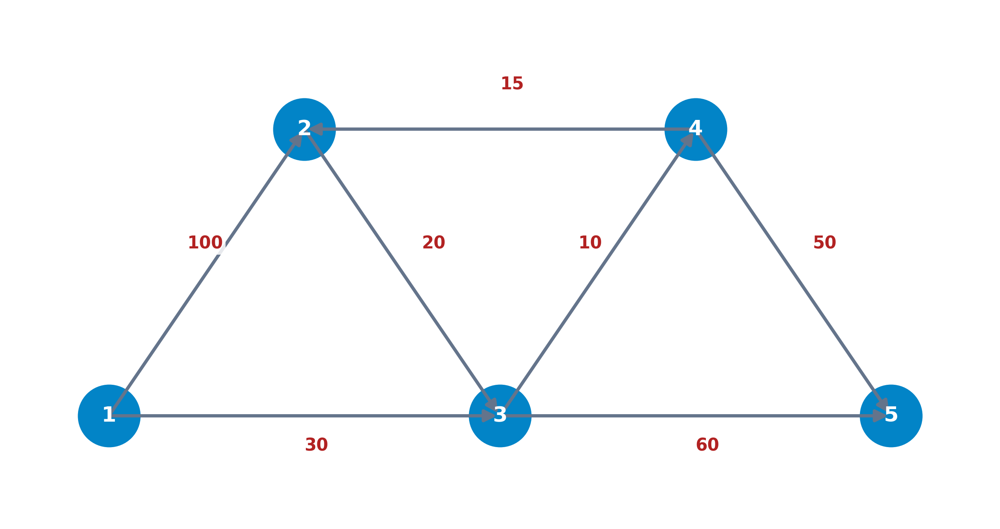{#fig-dijkstra-ejemplo-5nodos fig-align="center" width="70%"}

**Paso 0 (Inicialización)**:

Fijamos el nodo origen $1$ en el conjunto de permanentes $\mathcal{P}$ y asignamos el vector de etiquetas iniciales $u_j$:

$$
\begin{aligned}
u_1 &= 0 \\
u_2 &= 100 \\
u_3 &= 30 \\
u_4 &= \infty \\
u_5 &= \infty \\
\mathcal{P} &= \{1\}, \quad \mathcal{T} = \{2, 3, 4, 5\} \\
\text{Pred}(j) &= 1, \quad \forall j = 2, 3, 4, 5
\end{aligned}
$$

**Iteración 1**:

* **Selección voraz**: Identificamos el nodo transitorio con etiqueta provisional mínima:
  $$
  u_k = \min \{ u_j : j \in \mathcal{T} \} = u_3 = 30 \implies \mathcal{P} = \{1, 3\}, \quad \mathcal{T} = \{2, 4, 5\}
  $$

* **Relajación de etiquetas transitorias**: Actualizamos la cota provisional de los nodos en $\mathcal{T}$:
  $$
  \begin{aligned}
  u_2 &= \min \{ u_2, u_3 + d_{32} \} = \min \{ 100, 30 + \infty \} = 100, \quad \text{Pred}(2) = 1 \\
  u_4 &= \min \{ u_4, u_3 + d_{34} \} = \min \{ \infty, 30 + 10 \} = 40, \quad \text{Pred}(4) = 3 \\
  u_5 &= \min \{ u_5, u_3 + d_{35} \} = \min \{ \infty, 30 + 60 \} = 90, \quad \text{Pred}(5) = 3
  \end{aligned}
  $$

**Iteración 2**:

* **Selección voraz**: El nodo transitorio con etiqueta mínima en $\mathcal{T} = \{2, 4, 5\}$ es:
  $$
  u_k = \min \{ u_j : j \in \mathcal{T} \} = u_4 = 40 \implies \mathcal{P} = \{1, 3, 4\}, \quad \mathcal{T} = \{2, 5\}
  $$

* **Relajación de etiquetas transitorias**: Actualizamos la cota provisional para los nodos restantes en $\mathcal{T}$:
  $$
  \begin{aligned}
  u_2 &= \min \{ u_2, u_4 + d_{42} \} = \min \{ 100, 40 + 15 \} = 55, \quad \text{Pred}(2) = 4 \\
  u_5 &= \min \{ u_5, u_4 + d_{45} \} = \min \{ 90, 40 + 50 \} = 90, \quad \text{Pred}(5) = 4
  \end{aligned}
  $$

**Iteración 3**:

* **Selección voraz**: El nodo transitorio con etiqueta mínima en $\mathcal{T} = \{2, 5\}$ es:
  $$
  u_k = \min \{ u_j : j \in \mathcal{T} \} = u_2 = 55 \implies \mathcal{P} = \{1, 3, 4, 2\}, \quad \mathcal{T} = \{5\}
  $$

* **Relajación de etiquetas transitorias**:
  $$
  u_5 = \min \{ u_5, u_2 + d_{25} \} = \min \{ 90, 55 + \infty \} = 90, \quad \text{Pred}(5) = 4
  $$

**Iteración 4**:

* **Selección voraz**: Se selecciona el último nodo transitorio:
  $$
  u_k = \min \{ u_j : j \in \mathcal{T} \} = u_5 = 90 \implies \mathcal{P} = \{1, 3, 4, 2, 5\}, \quad \mathcal{T} = \emptyset
  $$

* **Criterio de Parada**: Al ser $\mathcal{T} = \emptyset$, se detiene el procedimiento.

Al finalizar el procedimiento iterativo, se obtienen las distancias geodésicas y los predecesores óptimos:

* **Vector de distancias mínimas**: $\mathbf{u} = (u_1, u_2, u_3, u_4, u_5) = (0, 55, 30, 40, 90)$.
* **Vector de predecesores**: $\text{Pred} = (1, 4, 1, 3, 4)$.
* **Arborescencia de caminos mínimos**: Comprendida por los arcos dirigidos $\{ (1,3), (3,4), (4,2), (4,5) \}$.

::: {.content-visible when-format="html"}
::: {#fig-dijkstra-ejemplo-pasos}
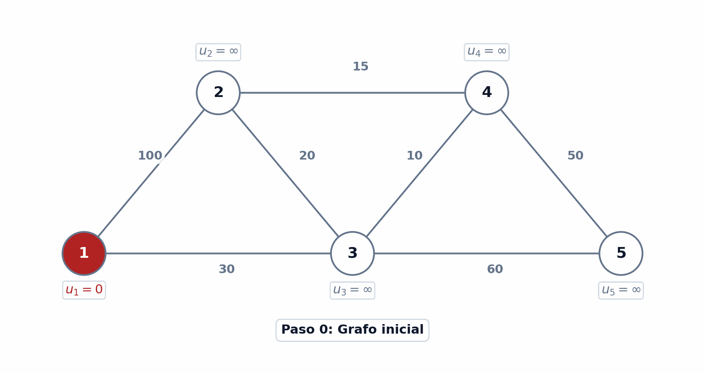

<dialog id="dijkstra_ejemplo_pasos-dialog" style="border:none; border-radius:10px; padding:0; width:88vw; max-width:88vw; height:84vh; max-height:84vh; box-shadow:0 20px 60px rgba(0,0,0,0.55); overflow:hidden; background:#fff;">
  <button onclick="document.getElementById('dijkstra_ejemplo_pasos-dialog').close()"
          style="position:absolute; top:10px; right:14px; z-index:10; background:rgba(15,23,42,0.6); color:#fff; border:none; border-radius:50%; width:30px; height:30px; font-size:17px; cursor:pointer; line-height:1; display:flex; align-items:center; justify-content:center;">×</button>
  <iframe src="images/dijkstra_player.html" width="100%" height="100%" style="border:none; display:block;" scrolling="no"></iframe>
</dialog>

Animación paso a paso de la evolución iterativa del Algoritmo de Dijkstra.
:::
:::

::: {.content-visible when-format="pdf"}
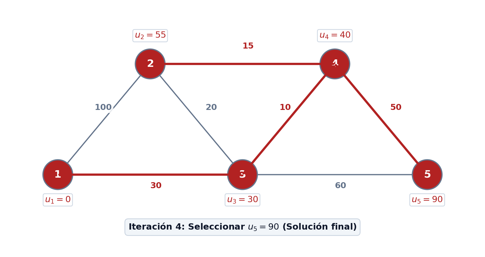{#fig-dijkstra-ejemplo-pasos fig-align="center" width="75%"}
:::
:::

---

## Redes con pesos negativos: Algoritmo de Bellman-Ford

Cuando una red contiene arcos con costes negativos ($d_{ij} < 0$), el algoritmo de Dijkstra pierde validez puesto que una cota provisional o fija podría abaratarse posteriormente mediante un camino derivado de una arista negativa. En el caso general, cuando existen arcos de longitud negativa pero se garantiza la ausencia de circuitos de coste negativo, una alternativa para obtener la solución de las ecuaciones de optimalidad consiste en aproximar el camino mínimo a cualquier vértice por la distancia del camino óptimo que utiliza $1, 2, \dots, m$ arcos.

Esta es la idea fundamental del **Algoritmo de Bellman-Ford**, publicado por Lester R. Ford Jr. en 1956 [@ford1956network], aunque fue propuesto originalmente por Alfonso Shimbel en 1955 [@shimbel1955structure] y desarrollado posteriormente por Richard Bellman en 1958 [@bellman1958routing] y Edward F. Moore en 1959. Posee una complejidad algorítmica de $O(n^3)$ u $O(|V| \cdot |U|)$, superior a la del algoritmo de Dijkstra.

::: {.callout-note title="Definición: Aproximación por número de arcos $u_j^m$" data-kind="definicion"}
Sea $u_j^m$ la longitud del camino mínimo desde el nodo origen $1$ al nodo $j$ **utilizando $m$ arcos dirigidos o menos**:

$$
u_j^m \equiv \text{longitud del camino mínimo de } 1 \text{ a } j \text{ utilizando } m \text{ arcos o menos}
$$

El procedimiento se inicia fijando $m = 1$ e incrementa iterativamente $m$ hasta un máximo de $m = n - 1$. Si la red no contiene circuitos de longitud negativa, el algoritmo converge a la solución óptima global en $n - 1$ iteraciones a lo sumo, satisfaciendo la relación de recurrencia:

$$
u_j^m = \min \left\{ u_j^{m-1}, \ \min_{k \neq j} \{ u_k^{m-1} + d_{kj} \} \right\}, \quad \forall j = 2, \dots, n
$$
:::

El desarrollo formal del procedimiento se sintetiza a través del siguiente esquema algorítmico.

::: {.callout-note title="Esquema: Algoritmo de Bellman-Ford" data-kind="esquema"}
Dada una red valorada $G = (V, U, \mathbf{d})$ con $n = |V|$ vértices:

1. **Paso 1 (Inicialización)**:
   * Para $m = 1$, definir las etiquetas iniciales del camino directo:
     $$
     u_j^1 = \begin{cases} 
     0 & \text{si } j = 1 \\ 
     d_{1j} & \text{si } (1, j) \in U \\ 
     \infty & \text{si } (1, j) \notin U 
     \end{cases}
     $$
   * Hacer $m \leftarrow 1$.

2. **Paso 2 (Iteración de relajación)**:
   * Hacer $m \leftarrow m + 1$.
   * Para cada nodo $j = 2, \dots, n$, evaluar si es más ventajoso mantener la cota anterior o acceder a $j$ pasando por un nodo intermedio $k$:
     $$
     u_j^m = \min \left\{ u_j^{m-1}, \ \min_{k \neq j} \{ u_k^{m-1} + d_{kj} \} \right\}
     $$

3. **Paso 3 (Criterio de Parada y Convergencia)**:
   * **Criterio de Parada Anticipada**: Si $u_j^m = u_j^{m-1}$ para todo $j = 2, \dots, n$, la solución con $m$ arcos es óptima y se detiene el proceso.
   * **Criterio Límite**: Si $m = n - 1$, detener el procedimiento. En otro caso, regresar al Paso 2.
:::

::: {.callout-important title="Teorema: Detección de circuitos de coste negativo" data-kind="teorema"}
Un digrafo $G = (V, U, \mathbf{d})$ contiene al menos un **circuito de coste negativo** accesible desde el origen $1$ si y sólo si en la iteración $m = n$ del Algoritmo de Bellman-Ford existe al menos un nodo $j \in V$ tal que:

$$
u_j^n \neq u_j^{n-1} \quad (\text{equivalentemente } u_j^n < u_j^{n-1})
$$

*Demostración*:
Cualquier camino simple en un grafo de $n$ vértices contiene a lo sumo $n - 1$ arcos. Si la distancia mínima desde el origen a un nodo $j$ disminuye al permitir caminos de $n$ arcos ($u_j^n < u_j^{n-1}$), por el principio del palomar (*pigeonhole principle*) la ruta de $n$ arcos debe contener obligatoriamente un ciclo repetido. Como la distancia se ha reducido estrictamente, dicho ciclo posee un coste total estrictamente negativo.
:::

::: {.callout-tip title="Ejemplo: Aplicación del algoritmo de Bellman-Ford con costes negativos" data-kind="ejemplo" collapse="true"}
Consideremos el digrafo de 4 nodos mostrado en la @fig-bellman-ford-ejemplo-4nodos, el cual contiene el arco de coste negativo $(4, 2)$ con $d_{42} = -3$. Deseamos encontrar el camino mínimo desde el nodo $1$ a todos los demás vértices.

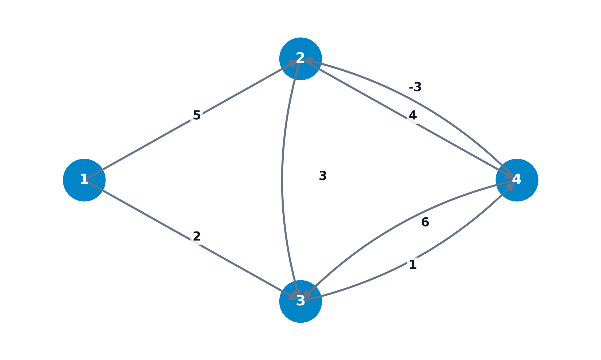{#fig-bellman-ford-ejemplo-4nodos fig-align="center" width="65%"}

**Resolución paso a paso**:

* **Paso 1 (Inicialización $m=1$)**:
  $$
  \begin{aligned}
  u_1^1 &= 0 \\
  u_2^1 &= 5 \\
  u_3^1 &= 2 \\
  u_4^1 &= \infty \\
  m &= 1
  \end{aligned}
  $$

* **Iteración $m=2$**:
  $$
  \begin{aligned}
  u_2^2 &= \min \{ u_2^1, \min \{ u_3^1 + d_{32}, u_4^1 + d_{42} \} \} = \min \{ 5, \min \{ 2 + \infty, \infty - 3 \} \} = 5 = u_2^1 \\
  u_3^2 &= \min \{ u_3^1, \min \{ u_2^1 + d_{23}, u_4^1 + d_{43} \} \} = \min \{ 2, \min \{ 5 + 3, \infty + 6 \} \} = 2 = u_3^1 \\
  u_4^2 &= \min \{ u_4^1, \min \{ u_2^1 + d_{24}, u_3^1 + d_{34} \} \} = \min \{ \infty, \min \{ 5 + 4, 2 + 1 \} \} = 3 \neq u_4^1 \\
  m &= 2
  \end{aligned}
  $$

* **Iteración $m=3$**:
  $$
  \begin{aligned}
  u_2^3 &= \min \{ u_2^2, \min \{ u_3^2 + d_{32}, u_4^2 + d_{42} \} \} = \min \{ 5, \min \{ 2 + \infty, 3 - 3 \} \} = 0 \neq u_2^2 \\
  u_3^3 &= \min \{ u_3^2, \min \{ u_2^2 + d_{23}, u_4^2 + d_{43} \} \} = \min \{ 2, \min \{ 5 + 3, 3 + 6 \} \} = 2 = u_3^2 \\
  u_4^3 &= \min \{ u_4^2, \min \{ u_2^2 + d_{24}, u_3^2 + d_{34} \} \} = \min \{ 3, \min \{ 5 + 4, 2 + 1 \} \} = 3 = u_4^2 \\
  m &= 3
  \end{aligned}
  $$

* **Iteración $m=4$**:
  $$
  \begin{aligned}
  u_2^4 &= \min \{ u_2^3, \min \{ u_3^3 + d_{32}, u_4^3 + d_{42} \} \} = \min \{ 0, \min \{ 2 + \infty, 3 - 3 \} \} = 0 = u_2^3 \\
  u_3^4 &= \min \{ u_3^3, \min \{ u_2^3 + d_{23}, u_4^3 + d_{43} \} \} = \min \{ 2, \min \{ 0 + 3, 3 + 6 \} \} = 2 = u_3^3 \\
  u_4^4 &= \min \{ u_4^3, \min \{ u_2^3 + d_{24}, u_3^3 + d_{34} \} \} = \min \{ 3, \min \{ 0 + 4, 2 + 1 \} \} = 3 = u_4^2 \\
  m &= 4
  \end{aligned}
  $$

Como $u^4 = u^3 = (0, 0, 2, 3)$, se alcanza la **convergencia y parada anticipada**.

Al finalizar el procedimiento iterativo, se obtienen las distancias geodésicas y los predecesores óptimos:

* **Vector de distancias mínimas**: $\mathbf{u} = (u_1, u_2, u_3, u_4) = (0, 0, 2, 3)$.
* **Vector de predecesores**: $\text{Pred} = (1, 4, 1, 3)$.
* **Arborescencia de caminos mínimos**: Comprendida por los arcos dirigidos $\{ (1,3), (3,4), (4,2) \}$.

::: {.content-visible when-format="html"}
::: {#fig-bellman-ford-ejemplo-pasos}
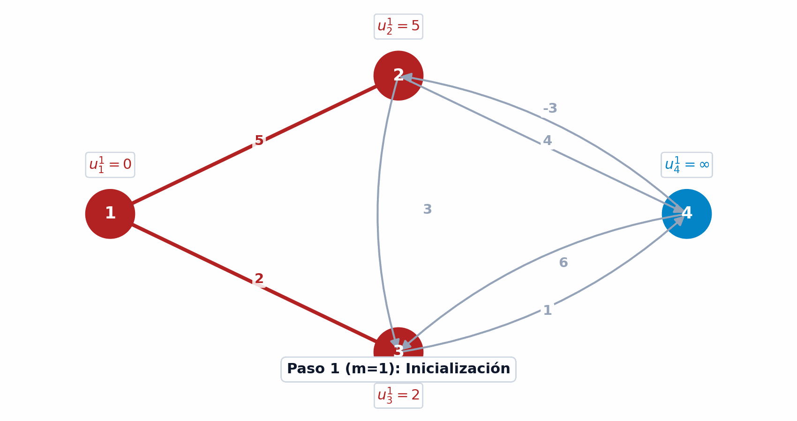

<dialog id="bellman_ford_ejemplo_pasos-dialog" style="border:none; border-radius:10px; padding:0; width:88vw; max-width:88vw; height:84vh; max-height:84vh; box-shadow:0 20px 60px rgba(0,0,0,0.55); overflow:hidden; background:#fff;">
  <button onclick="document.getElementById('bellman_ford_ejemplo_pasos-dialog').close()"
          style="position:absolute; top:10px; right:14px; z-index:10; background:rgba(15,23,42,0.6); color:#fff; border:none; border-radius:50%; width:30px; height:30px; font-size:17px; cursor:pointer; line-height:1; display:flex; align-items:center; justify-content:center;">×</button>
  <iframe src="images/bellman_ford_player.html" width="100%" height="100%" style="border:none; display:block;" scrolling="no"></iframe>
</dialog>

Animación paso a paso de la evolución iterativa del Algoritmo de Bellman-Ford.
:::
:::

::: {.content-visible when-format="pdf"}
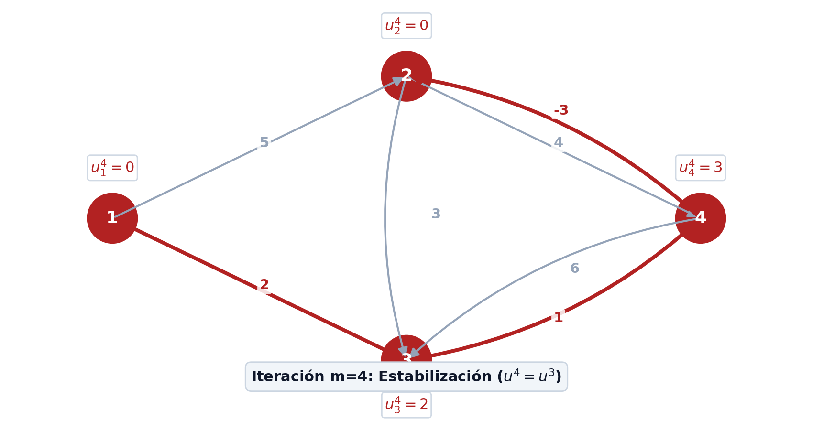{#fig-bellman-ford-ejemplo-pasos fig-align="center" width="75%"}
:::
:::

En el análisis de redes valoradas, una de las mayores utilidades del algoritmo de Bellman-Ford radica en su capacidad para detectar la presencia de **circuitos de coste o longitud negativa**. Si un digrafo contiene un circuito con suma de pesos estrictamente negativa, la longitud del camino óptimo hacia los nodos que componen dicho circuito o accesibles desde él tiende hacia $-\infty$, requiriendo un número infinito de arcos para su recorrido.

Por el contrario, cuando la red carece de circuitos negativos, la distancia mínima hacia cualquier vértice accesible se alcanza utilizando como máximo $n - 1$ arcos. Esta propiedad permite adaptar el algoritmo para realizar una iteración suplementaria hasta $m = n$:

* Si el digrafo **no contiene circuitos de longitud negativa**, las etiquetas de la pasada $n - 1$ y de la pasada $n$ resultarán ser estrictamente idénticas ($u^{n-1} = u^n$).
* Si alguna etiqueta $u_j^m = \infty$, no existe ningún camino físico de conexión desde el origen $1$ hacia el nodo $j$.
* Si en la iteración $m = n$ se detecta que **$u^{n-1} \neq u^n$** (con $u_j^n < u_j^{n-1}$ para algún nodo $j$), queda demostrada formalmente la existencia de un **circuito de longitud negativa** en la red.

::: {.callout-note title="Esquema: Algoritmo de Bellman-Ford adaptado para detección de circuitos negativos" data-kind="esquema"}
Dada una red valorada general $G = (V, U, \mathbf{d})$ con $n = |V|$ vértices:

1. **Paso 1 (Inicialización)**:
   * Asignar las etiquetas iniciales para $m = 1$:
     $$
     u_j^1 = \begin{cases} 
     0 & \text{si } j = 1 \\ 
     d_{1j} & \text{si } (1, j) \in U \\ 
     \infty & \text{si } (1, j) \notin U 
     \end{cases}
     $$
   * Hacer $m \leftarrow 1$.

2. **Paso 2 (Relajación iterativa)**:
   * Hacer $m \leftarrow m + 1$.
   * Para cada nodo $j = 2, \dots, n$, evaluar:
     $$
     u_j^m = \min \left\{ u_j^{m-1}, \ \min_{k \neq j} \{ u_k^{m-1} + d_{kj} \} \right\}
     $$

3. **Paso 3 (Evaluación de optimalidad o detección de circuito)**:
   * **Criterio de Convergencia Óptima**: Si $u_j^m = u_j^{m-1}$ para todo $j = 2, \dots, n$, detener el algoritmo: la solución actual $u^m$ es óptima.
   * **Criterio de Detección de Circuito Negativo**: En otro caso, si $m = n$, detener el procedimiento concluyendo que **existen circuitos de longitud negativa** en la red.
   * En otro caso ($m < n$), regresar al Paso 2.
:::

::: {.callout-tip title="Ejemplo: Detección de un circuito de longitud negativa en un digrafo de 7 nodos" data-kind="ejemplo" collapse="true"}
Consideremos el digrafo de 7 nodos ($V = \{a, b, c, d, e, f, g\}$ con $n = 7$) representado en la @fig-bellman-ford-circuito-negativo-7nodos, con origen en el nodo $a$.

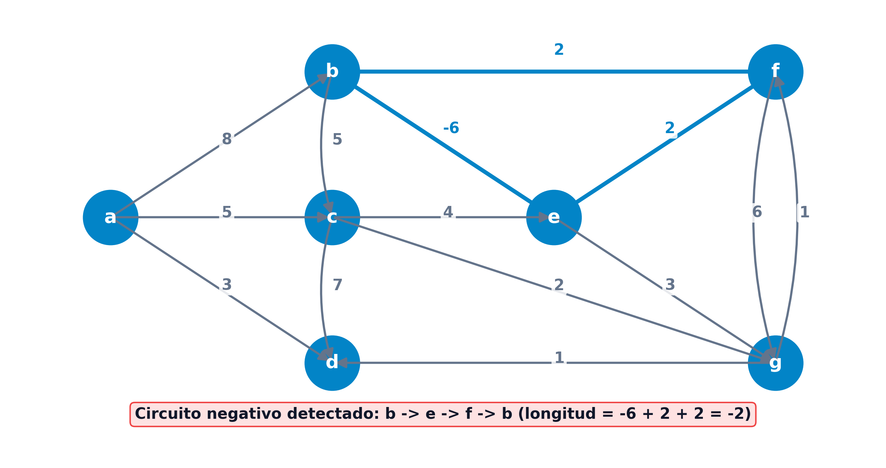{#fig-bellman-ford-circuito-negativo-7nodos fig-align="center" width="75%"}

Inspeccionando los ciclos de la red, observamos que la secuencia $b \to e \to f \to b$ conforma un circuito cerrado de longitud acumulada negativa:

$$
d(b, e) + d(e, f) + d(f, b) = -6 + 2 + 2 = -2 < 0
$$

**Desarrollo del Algoritmo de Bellman-Ford**:

* **Paso 1 (Inicialización $m=1$)**:
  $$
  u_a^1 = 0, \quad u_b^1 = 8, \quad u_c^1 = 5, \quad u_d^1 = 3, \quad u_e^1 = \infty, \quad u_f^1 = \infty, \quad u_g^1 = \infty
  $$

* **Tras ejecutar el procedimiento hasta la iteración $m = n - 1 = 6$**, se obtiene el vector de etiquetas:
  $$
  u_a^6 = 0, \quad u_b^6 = 6, \quad u_c^6 = 5, \quad u_d^6 = 3, \quad u_e^6 = 0, \quad u_f^6 = 2, \quad u_g^6 = 3
  $$

* **Iteración suplementaria $m = n = 7$**:
  Evaluamos la relajación de etiquetas para todos los nodos del digrafo:
  $$
  \begin{aligned}
  u_b^7 &= \min \{ u_b^6, u_a^6 + 8, u_f^6 + 2 \} = \min \{ 6, 0 + 8, 2 + 2 \} = 4 \\
  u_c^7 &= \min \{ u_c^6, u_a^6 + 5, u_b^6 + 5 \} = \min \{ 5, 0 + 5, 4 + 5 \} = 5 \\
  u_d^7 &= \min \{ u_d^6, u_a^6 + 3, u_c^6 + 7, u_g^6 + 1 \} = \min \{ 3, 0 + 3, 5 + 7, 3 + 1 \} = 3 \\
  u_e^7 &= \min \{ u_e^6, u_b^6 - 6, u_c^6 + 4 \} = \min \{ 0, 6 - 6, 5 + 4 \} = 0 \\
  u_f^7 &= \min \{ u_f^6, u_e^6 + 2, u_g^6 + 6 \} = \min \{ 2, 0 + 2, 3 + 6 \} = 2 \\
  u_g^7 &= \min \{ u_g^6, u_c^6 + 2, u_e^6 + 3, u_f^6 + 1 \} = \min \{ 3, 5 + 2, 0 + 3, 2 + 1 \} = 3
  \end{aligned}
  $$

Al comparar las etiquetas entre las iteraciones 6 y 7, detectamos que para el nodo $b$:

$$
u_b^6 = 6 \neq 4 = u_b^7 \implies u_b^7 < u_b^6
$$

Puesto que $u^7 \neq u^6$, el algoritmo se detiene formalmente en $m = n = 7$ concluyendo que **existe un circuito de longitud negativa** ($b \to e \to f \to b$).
:::

---

## Formulación matemática: Programación Lineal Primal y Dual

El problema del camino mínimo entre un nodo origen $s$ y un nodo destino $t$ en un digrafo valorado $G = (V, U, \mathbf{d})$ admite una representación equivalente mediante un **modelo de programación lineal**. Desde la perspectiva de la teoría de redes de flujo, el problema equivale a transportar una unidad de flujo unitario desde el nodo fuente $s$ hasta el nodo sumidero $t$ con el menor coste o distancia acumulada posible.

::: {.callout-note title="Definición: Modelo Primal de Programación Lineal para el Camino Mínimo" data-kind="definicion"}
Dada una red dirigida $G = (V, U, \mathbf{d})$ con $n = |V|$ vértices, etiquetados de forma que $s \in V$ representa el origen y $t \in V$ el destino, asociamos a cada arco $(i, j) \in U$ un coste unitario de transporte dado por su peso $d_{ij}$.

Definimos las **variables de decisión** $x_{ij}$ como variables indicadoras de flujo que determinan la activación de cada arco en el itinerario:

$$
x_{ij} = \begin{cases} 
1 & \text{si el arco } (i, j) \text{ forma parte del camino mínimo} \\ 
0 & \text{en otro caso} 
\end{cases} \quad \forall (i, j) \in U
$$

El modelo lineal minimiza la longitud total del trayecto sujeto a las ecuaciones de balance y conservación de flujo en cada vértice de la red:

$$
\begin{aligned}
\min_{\mathbf{x}} \quad & \sum_{i=1}^n \sum_{j=1}^n d_{ij} x_{ij} \\
\text{sujeto a} \quad & \sum_{k=1}^n x_{sk} = 1 \quad (\text{Salida unitaria del nodo origen } s) \\
& \sum_{k=1}^n x_{kt} = 1 \quad (\text{Entrada unitaria al nodo destino } t) \\
& \sum_{j=1}^n x_{jk} = \sum_{i=1}^n x_{ki}, \quad \forall k \neq s, t \quad (\text{Conservación de flujo en nodos intermedios}) \\
& x_{ij} \in \{0, 1\}, \quad \forall (i, j) \in U
\end{aligned}
$$
:::

En notación matricial compacta, el modelo se expresa como $\min \{ \mathbf{d}^T \mathbf{x} : \mathbf{A} \mathbf{x} = \mathbf{b}, \, \mathbf{x} \ge \mathbf{0} \}$, donde $\mathbf{A} \in \{-1, 0, 1\}^{n \times m}$ representa la **matriz de incidencia nodo-arco** del digrafo y $\mathbf{b} = (1, 0, \dots, 0, -1)^T$ es el vector de balances nodales.

::: {.callout-important title="Teorema: Total unimodularidad e integridad del modelo primal" data-kind="teorema"}
La matriz de incidencia nodo-arco $\mathbf{A}$ de cualquier grafo o digrafo es **totalmente unimodular** (TUM). Por consiguiente, para cualquier vector de balances entero $\mathbf{b}$, todas las soluciones básicas factibles del problema de programación lineal continuo son **estrictamente enteras**.

En particular, la solución óptima del modelo continuo satisface automáticamente $x_{ij}^* \in \{0, 1\}$, seleccionando una ruta simple óptima de $s$ a $t$ sin necesidad de imponer de forma explícita restricciones de programación entera.
:::

A partir de la formulación primal, se puede derivar el **modelo dual** asociando a la ecuación de balance de cada nodo $i \in V$ una variable dual no restringida en signo $u_i \in \mathbb{R}$, denominada **potencial nodal**:

$$
\begin{aligned}
\max_{\mathbf{u}} \quad & u_t - u_s \\
\text{sujeto a} \quad & u_j - u_i \le d_{ij}, \quad \forall (i, j) \in U \\
& u_i \text{ no restringidas}, \quad \forall i \in V
\end{aligned}
$$

::: {.callout-note title="Interpretación física y económica del modelo dual" data-kind="nota"}
* **Potenciales Nodales**: Las variables duales $u_i$ representan **potenciales o tensiones nodales** en la red.
* **Fijación de Referencia**: Dado que el sistema dual presenta un grado de libertad adicional (es invariante ante sumas constantes $u_i + C$), al fijar el origen $u_s = 0$, la variable dual óptima $u_j^*$ coincide exactamente con la **distancia mínima $d(s, j)$** desde $s$ hasta $j$.
* **Restricción de Consistencia**: La condición $u_j - u_i \le d_{ij}$ establece que la diferencia de potencial entre dos nodos adyacentes no puede superar la distancia directa del arco que los une.
* **Holgura Complementaria**: Si el arco $(i, j)$ forma parte del camino mínimo óptimo ($x_{ij}^* = 1$), la restricción dual correspondiente se activa con igualdad estricta: $u_j^* - u_i^* = d_{ij}$.
:::

::: {.callout-tip title="Ejemplo: Formulación primal completa para una red de 7 nodos" data-kind="ejemplo" collapse="true"}
Consideremos el digrafo de 7 nodos $V = \{s, 1, 2, 3, 4, 5, t\}$ representado en la @fig-linear-programming-ejemplo-7nodos. Se desea formular el modelo de programación lineal para resolver el problema del camino mínimo entre el nodo origen $s$ y el nodo destino $t$.

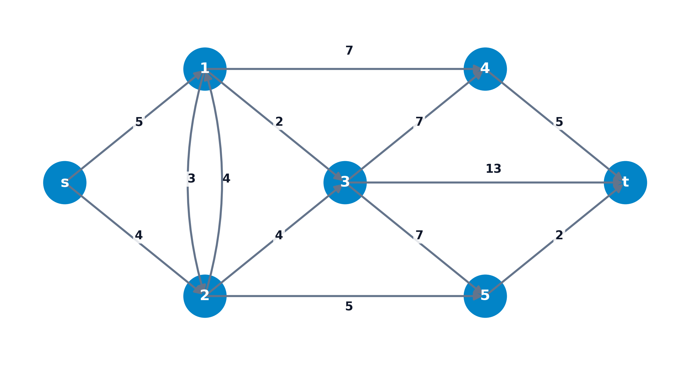{#fig-linear-programming-ejemplo-7nodos fig-align="center" width="75%"}

**1. Variables de decisión**:
$$
x_{ij} = \begin{cases} 
1 & \text{si el arco } (i, j) \text{ forma parte del camino} \\ 
0 & \text{en otro caso} 
\end{cases} \quad \forall (i, j) \in U
$$

**2. Función objetivo**:
Minimizar la suma de costes de los arcos seleccionados en el itinerario:
$$
\begin{aligned}
\min z = \ & 5 x_{s1} + 4 x_{s2} + 4 x_{12} + 2 x_{13} + 7 x_{14} + 3 x_{21} + 4 x_{23} \\
& + 5 x_{25} + 7 x_{34} + 7 x_{35} + 13 x_{3t} + 5 x_{4t} + 2 x_{5t}
\end{aligned}
$$

**3. Restricciones del nodo origen ($s$)**:
Garantizar la salida de una unidad de flujo desde el origen:
$$
x_{s1} + x_{s2} = 1
$$

**4. Restricciones del nodo destino ($t$)**:
Garantizar la llegada de una unidad de flujo al destino:
$$
x_{3t} + x_{4t} + x_{5t} = 1
$$

**5. Restricciones de conservación de flujo en el resto de nodos ($k \neq s, t$)**:
La suma de flujos entrantes a un nodo debe ser igual a la suma de flujos salientes:
$$
\begin{aligned}
\text{Nodo 1:} \quad & x_{s1} + x_{21} = x_{12} + x_{13} + x_{14} \\
\text{Nodo 2:} \quad & x_{s2} + x_{12} = x_{21} + x_{23} + x_{25} \\
\text{Nodo 3:} \quad & x_{13} + x_{23} = x_{34} + x_{35} + x_{3t} \\
\text{Nodo 4:} \quad & x_{14} + x_{34} = x_{4t} \\
\text{Nodo 5:} \quad & x_{25} + x_{35} = x_{5t}
\end{aligned}
$$

**6. Naturaleza de las variables**:
$$
x_{ij} \in \{0, 1\}, \quad \forall (i, j) \in U
$$
:::

---

## Caminos mínimos entre todos los pares de nodos

En diversas aplicaciones prácticas de diseño de redes de comunicación, logística e infraestructura, se requiere determinar las distancias mínimas entre **todos los pares de vértices $(i, j) \in V \times V$**.

Una primera aproximación intuitiva consiste en ejecutar $n$ veces un algoritmo de origen único (como Dijkstra o Bellman-Ford), tomando secuencialmente cada vértice $i \in V$ como raíz del cálculo. Sin embargo, en digrafos con pesos negativos, aplicar $n$ veces el algoritmo de Bellman-Ford multiplica la complejidad computacional por $n$, alcanzando una cota total de $n \times O(n^3) = O(n^4)$. Este enfoque resulta ineficiente al desaprovechar la estructura compartida de los subcaminos óptimos en la red.

Para resolver de forma global este problema optimizando la reutilización de información, exploraremos primeramente el **método basado en la multiplicación de matrices** (álgebra Min-Suma) y, a continuación, el **algoritmo de Floyd-Warshall** basado en programación dinámica.

---

### Método basado en la multiplicación de matrices (Álgebra Min-Suma)

Sea $G = (V, U, \mathbf{d})$ un digrafo valorado con $n = |V|$ vértices. Definimos la **matriz inicial de distancias** $D = (d_{kj}) \in \mathbb{R}^{n \times n}$ asociada a los arcos directos de la red como:

$$
d_{kj} = \begin{cases} 
0 & \text{si } k = j \\ 
d_{kj} & \text{si } (k, j) \in U \\ 
\infty & \text{si } (k, j) \notin U 
\end{cases}
$$

Es posible definir un álgebra de matrices sobre la estructura de semianillo $(\mathbb{R} \cup \{\infty\}, \min, +)$, conocida como **álgebra Min-Suma** o *álgebra tropical*, donde la operación de suma matricial convencional se sustituye por la minimización ($\min$) y la multiplicación por la adición ($+$).

::: {.callout-note title="Definición: Operador del producto matricial Min-Suma" data-kind="definicion"}
Dadas dos matrices $A, B \in \overline{\mathbb{R}}^{n \times n}$, el **producto matricial Min-Suma** $C = A \otimes B$ sustituye el sumatorio $\sum$ por el operador $\min$ y el producto escalar por la suma:

$$
\text{Álgebra Estándar: } c_{ij} = \sum_{k=1}^n a_{ik} \cdot b_{kj} \quad \implies \quad \text{Álgebra Min-Suma: } c_{ij} = \min_{1 \le k \le n} \left\{ a_{ik} + b_{kj} \right\}
$$

* **Paralelismo con el Algoritmo de Bellman-Ford**: La fila $i$-ésima de la matriz $D^{(m)} = D^{(m-1)} \otimes D$ contiene las distancias mínimas alcanzables en a lo sumo $m$ arcos considerando al nodo $i$ como origen único.
:::

Bajo este operador, la potencia $m$-ésima de la matriz $D^m = (d_{ij})^m$ contiene la distancia mínima entre cada par de nodos $i$ y $j$ utilizando **a lo sumo $m$ arcos**. En particular, la ordenación por filas de $D^m$ equivale a resolver simultáneamente una iteración del algoritmo de Bellman-Ford para los $n$ posibles orígenes de la red.

Para $m = 2$, la cota de distancia de $i$ a $j$ utilizando 2 arcos o menos se calcula como:

$$
(d_{ij})^2 = \min \left\{ d_{ij}, \ \min_{k \in V} \{ d_{ik} + d_{kj} \} \right\}
$$

En general, la relación de recurrencia para la potencia $(m+1)$-ésima adopta la forma:

$$
(d_{ij})^{m+1} = \min \left\{ (d_{ij})^m, \ \min_{k \in V} \{ (d_{ik})^m + d_{kj} \} \right\}
$$

Dado que cualquier camino simple en un grafo de $n$ vértices contiene a lo sumo $n - 1$ arcos, el algoritmo alcanza la solución exacta al calcular $D^{n-1}$. La evaluación secuencial de $D, D^2, D^3, \dots, D^{n-1}$ requiere $n - 1$ multiplicaciones de matrices de dimensión $n \times n$, con un coste computacional de $O(n^4)$.

::: {.callout-note title="Optimización por Exponenciación Binaria (Repeated Squaring)" data-kind="nota"}
Si únicamente se requiere calcular la matriz de distancias mínimas absolutas (sin necesidad de reconstruir la secuencia explícita de vértices del camino), es posible reducir significativamente la complejidad algorítmica.

En lugar de evaluar secuencialmente $D^2, D^3, \dots, D^n$, podemos aplicar la técnica de **exponenciación binaria** calculando la serie de potencias cuadráticas $D^2, D^4, D^8, \dots, D^{2^k}$ hasta superar $n - 1$. Con esta estrategia, el número de multiplicaciones matriciales se reduce de $n - 1$ a $\lceil \log_2(n - 1) \rceil$, reduciendo la complejidad total de $O(n^4)$ a **$O(n^3 \log n)$**.
:::

::: {.callout-tip title="Ejemplo: Aplicación del método de multiplicación de matrices en una red de 4 nodos" data-kind="ejemplo" collapse="true"}
Consideremos el digrafo de 4 nodos mostrado en la @fig-matrix-multiplication-ejemplo-4nodos, el cual contiene arcos dirigidos con pesos positivos y negativos.

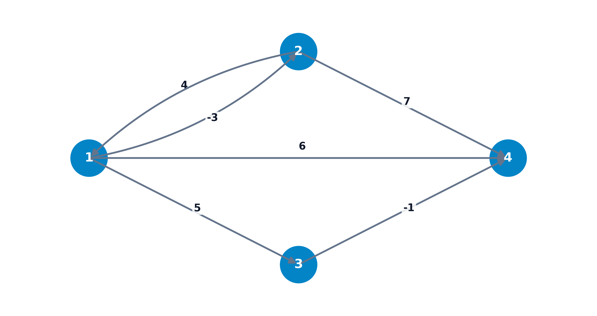{#fig-matrix-multiplication-ejemplo-4nodos fig-align="center" width="65%"}

**1. Matriz inicial de distancias $D = D^{(1)}$**:
$$
D = \begin{pmatrix}
0 & 4 & 5 & 6 \\
-3 & 0 & \infty & 7 \\
\infty & \infty & 0 & -1 \\
\infty & \infty & \infty & 0
\end{pmatrix}
$$

**2. Segunda iteración ($D^{(2)} = D \otimes D$)**:
Evaluando la relajación con a lo sumo 2 arcos:
$$
D^{(2)} = \begin{pmatrix}
0 & 4 & 5 & \textcolor{forestgreen}{\mathbf{4}} \\
-3 & 0 & \textcolor{forestgreen}{\mathbf{2}} & \textcolor{forestgreen}{\mathbf{3}} \\
\infty & \infty & 0 & -1 \\
\infty & \infty & \infty & 0
\end{pmatrix}
$$
*Observación*: $(d_{14})^2 = \min \{ 6, \min \{ 0+6, 4+7, 5-1 \} \} = \min \{ 6, 5 \} = \textcolor{forestgreen}{\mathbf{4}}$ vía el camino $1 \to 3 \to 4$.

**3. Tercera iteración ($D^{(3)} = D^{(2)} \otimes D$)**:
Evaluando la relajación con a lo sumo 3 arcos:
$$
D^{(3)} = \begin{pmatrix}
0 & 4 & 5 & 4 \\
-3 & 0 & 2 & \textcolor{forestgreen}{\mathbf{1}} \\
\infty & \infty & 0 & -1 \\
\infty & \infty & \infty & 0
\end{pmatrix}
$$
*Observación*: La primera fila de $D^{(3)}$ coincide exactamente con el resultado obtenido al ejecutar el algoritmo de Bellman-Ford con origen en el nodo 1.

Puesto que $n = 4$, el algoritmo se detiene formalmente en $D^{(n-1)} = D^{(3)}$ o en la iteración donde la matriz de distancias permanezca invariante ($D^{(m)} = D^{(m-1)}$).
:::

---

### Algoritmo de Floyd-Warshall

El **Algoritmo de Floyd-Warshall** fue publicado formalmente por Floyd en 1962 [@floyd1962algorithm], aunque una versión equivalente del método fue propuesta previamente por Roy en 1959 [@roy1959transitivite] y desarrollada posteriormente de forma independiente por Warshall en 1962 [@warshall1962theorem].

Se trata de un algoritmo de **programación dinámica** válido para calcular las distancias mínimas entre cualquier par de nodos en redes que pueden contener arcos de peso negativo (siempre que se garantice la ausencia de circuitos de coste negativo). Su complejidad algorítmica es **$O(n^3)$**, siendo significativamente más eficiente que ejecutar $n$ veces el algoritmo de Bellman-Ford ($O(n^4)$).

La idea fundamental del algoritmo consiste en iterar sobre cada nodo intermedio candidato $k \in \{1, \dots, n\}$, comparando para cada par de nodos $(i, j)$ si el camino óptimo de $i$ a $j$ mejora al incorporar el nodo $k$ como vértice intermedio.

::: {.callout-note title="Definición: Recurrencia de programación dinámica de Floyd-Warshall" data-kind="definicion"}
Sea $d_{ij}^{(k)}$ la longitud del camino mínimo desde el nodo $i$ hasta el nodo $j$ permitiendo utilizar como **nodos intermedios únicamente un subconjunto de los primeros $k$ nodos** $\{1, 2, \dots, k\}$.

* **Inicialización ($k = 0$)**: $d_{ij}^{(0)} = d_{ij}$ (distancias directas de los arcos en la matriz $D$).
* **Paso iterativo $k$**: Para cada par de vértices $(i, j)$, se compara:
  1. La longitud del camino óptimo de $i$ a $j$ sin utilizar el nodo $k$ como intermedio ($d_{ij}^{(k-1)}$).
  2. La suma de las distancias mínimas de $i$ a $k$ y de $k$ a $j$ utilizando únicamente los primeros $k-1$ nodos ($d_{ik}^{(k-1)} + d_{kj}^{(k-1)}$).

Si la distancia total mejora al transitar por el nodo $k$, se actualiza el camino mínimo mediante la relación de recurrencia:

$$
d_{ij}^{(k)} = \min \left\{ d_{ij}^{(k-1)}, \ d_{ik}^{(k-1)} + d_{kj}^{(k-1)} \right\}, \quad \forall i, j \in V
$$
:::

Puesto que el algoritmo realiza $n$ iteraciones principales (una por cada nodo intermedio $k$) y en cada iteración ejecuta $n^2$ comparaciones escalares (una por cada par $(i, j)$), la complejidad temporal global queda acotada exactamente por:

$$
n \times n^2 = O(n^3)
$$

Adicionalmente, en cada iteración se puede ir registrando de forma paralela la matriz de predecesores $P^{(k)}$ para posibilitar la reconstrucción explícita de los caminos mínimos.

::: {.callout-note title="Esquema: Algoritmo de Floyd-Warshall" data-kind="esquema"}
Dada la matriz de distancias directas $D^{(0)} = D$ y la matriz de predecesores iniciales $P^{(0)}$ con $P_{ij} = j$ para todo $(i, j) \in U$:

1. **Bucle externo (Nodo pivote intermedio $k$)**:
   Para $k = 1, 2, \dots, n$:
2. **Bucles internos (Par origen-destino $i, j$)**:
   Para $i = 1, 2, \dots, n$:
   Para $j = 1, 2, \dots, n$:
   * Evaluar el criterio de relajación:
     $$
     \text{Si } d_{ik}^{(k-1)} + d_{kj}^{(k-1)} < d_{ij}^{(k-1)} \text{ entonces}:
     $$
     $$
     d_{ij}^{(k)} \leftarrow d_{ik}^{(k-1)} + d_{kj}^{(k-1)}, \quad P_{ij}^{(k)} \leftarrow P_{ik}^{(k-1)}
     $$
:::

::: {.callout-tip title="Ejemplo: Aplicación desglosada del algoritmo de Floyd-Warshall" data-kind="ejemplo" collapse="true"}
Consideremos el digrafo de 5 nodos representado en la @fig-floyd-warshall-ejemplo-5nodos. Se desea calcular la matriz de distancias mínimas entre todos los pares de nodos $D^{(5)}$ aplicando el Algoritmo de Floyd-Warshall.

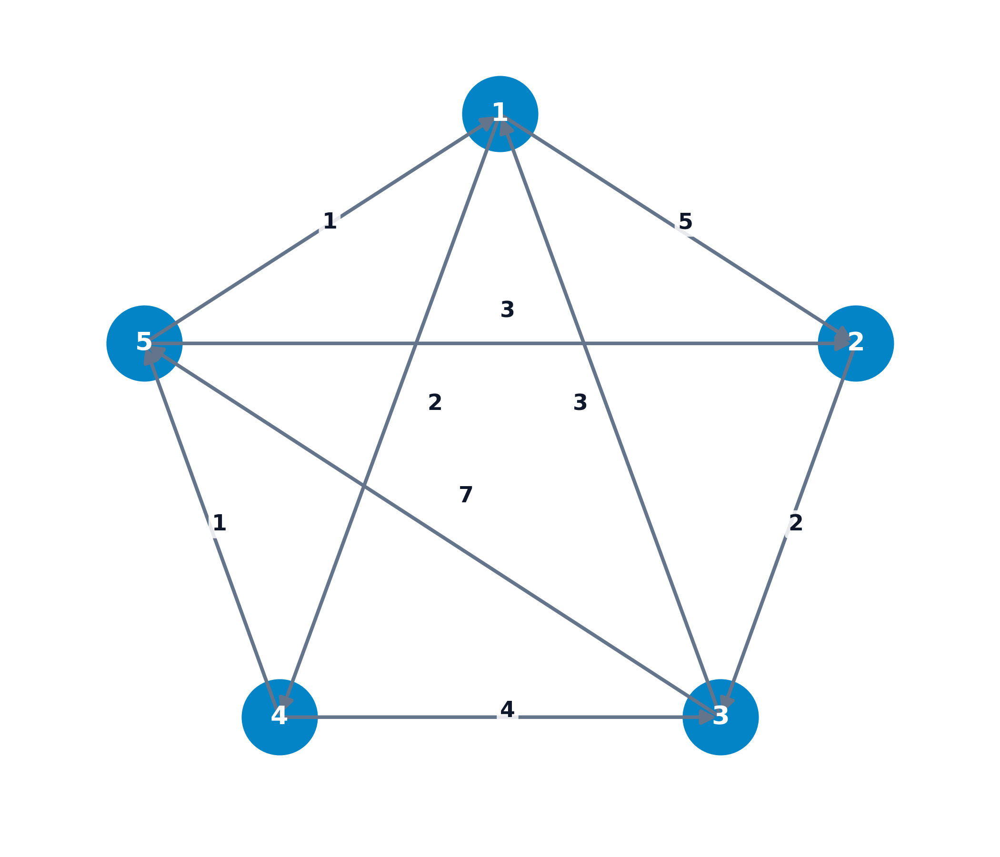{#fig-floyd-warshall-ejemplo-5nodos fig-align="center" width="65%"}

**1. Matriz Inicial $D^{(0)}$ (Distancias directas de los arcos)**:
$$
D^{(0)} = \begin{pmatrix}
0 & 5 & \infty & 2 & \infty \\
\infty & 0 & 2 & \infty & \infty \\
3 & \infty & 0 & \infty & 7 \\
\infty & \infty & 4 & 0 & 1 \\
1 & 3 & \infty & \infty & 0
\end{pmatrix}
$$

**2. Iteración $k=1$ (Permitir el nodo 1 como vértice intermedio)**:
Se evalúa $d_{ij}^{(1)} = \min \{ d_{ij}^{(0)}, d_{i1}^{(0)} + d_{1j}^{(0)} \}$. La fila 1 $(0, 5, \infty, 2, \infty)$ y la columna 1 $(0, \infty, 3, \infty, 1)^T$ permiten actualizar los siguientes elementos:

* $d_{32}^{(1)} = \min \{ \infty, 3 + 5 \} = 8$.
* $d_{34}^{(1)} = \min \{ \infty, 3 + 2 \} = 5$.
* $d_{54}^{(1)} = \min \{ \infty, 1 + 2 \} = 3$.

$$
D^{(1)} = \begin{pmatrix}
0 & 5 & \infty & 2 & \infty \\
\infty & 0 & 2 & \infty & \infty \\
3 & \textcolor{forestgreen}{\mathbf{8}} & 0 & \textcolor{forestgreen}{\mathbf{5}} & 7 \\
\infty & \infty & 4 & 0 & 1 \\
1 & 3 & \infty & \textcolor{forestgreen}{\mathbf{3}} & 0
\end{pmatrix}
$$

**3. Iteración $k=2$ (Permitir el nodo 2 como vértice intermedio)**:
Evaluando combinaciones a través de la fila 2 $(\infty, 0, 2, \infty, \infty)$ y la columna 2 $(5, 0, 8, \infty, 3)^T$:

* $d_{13}^{(2)} = \min \{ \infty, 5 + 2 \} = 7$.
* $d_{53}^{(2)} = \min \{ \infty, 3 + 2 \} = 5$.

$$
D^{(2)} = \begin{pmatrix}
0 & 5 & \textcolor{forestgreen}{\mathbf{7}} & 2 & \infty \\
\infty & 0 & 2 & \infty & \infty \\
3 & 8 & 0 & 5 & 7 \\
\infty & \infty & 4 & 0 & 1 \\
1 & 3 & \textcolor{forestgreen}{\mathbf{5}} & 3 & 0
\end{pmatrix}
$$

**4. Iteración $k=3$ (Permitir el nodo 3 como vértice intermedio)**:
Evaluando combinaciones a través de la fila 3 $(3, 8, 0, 5, 7)$ y la columna 3 $(7, 2, 0, 4, 5)^T$:

* $d_{15}^{(3)} = \min \{ \infty, 7 + 7 \} = 14$.
* $d_{21}^{(3)} = \min \{ \infty, 2 + 3 \} = 5$, $d_{24}^{(3)} = \min \{ \infty, 2 + 5 \} = 7$, $d_{25}^{(3)} = \min \{ \infty, 2 + 7 \} = 9$.
* $d_{41}^{(3)} = \min \{ \infty, 4 + 3 \} = 7$, $d_{42}^{(3)} = \min \{ \infty, 4 + 8 \} = 12$.

$$
D^{(3)} = \begin{pmatrix}
0 & 5 & 7 & 2 & \textcolor{forestgreen}{\mathbf{14}} \\
\textcolor{forestgreen}{\mathbf{5}} & 0 & 2 & \textcolor{forestgreen}{\mathbf{7}} & \textcolor{forestgreen}{\mathbf{9}} \\
3 & 8 & 0 & 5 & 7 \\
\textcolor{forestgreen}{\mathbf{7}} & \textcolor{forestgreen}{\mathbf{12}} & 4 & 0 & 1 \\
1 & 3 & 5 & 3 & 0
\end{pmatrix}
$$

**5. Iteración $k=4$ (Permitir el nodo 4 como vértice intermedio)**:
Evaluando combinaciones a través de la fila 4 $(7, 12, 4, 0, 1)$ y la columna 4 $(2, 7, 5, 0, 3)^T$:

* $d_{13}^{(4)} = \min \{ 7, 2 + 4 \} = 6$, $d_{15}^{(4)} = \min \{ 14, 2 + 1 \} = 3$.
* $d_{25}^{(4)} = \min \{ 9, 7 + 1 \} = 8$.
* $d_{35}^{(4)} = \min \{ 7, 5 + 1 \} = 6$.

$$
D^{(4)} = \begin{pmatrix}
0 & 5 & \textcolor{forestgreen}{\mathbf{6}} & 2 & \textcolor{forestgreen}{\mathbf{3}} \\
5 & 0 & 2 & 7 & \textcolor{forestgreen}{\mathbf{8}} \\
3 & 8 & 0 & 5 & \textcolor{forestgreen}{\mathbf{6}} \\
7 & 12 & 4 & 0 & 1 \\
1 & 3 & 5 & 3 & 0
\end{pmatrix}
$$

**6. Iteración $k=5$ (Permitir el nodo 5 como vértice intermedio)**:
Evaluando combinaciones a través de la fila 5 $(1, 3, 5, 3, 0)$ y la columna 5 $(3, 8, 6, 1, 0)^T$:

* $d_{41}^{(5)} = \min \{ 7, 1 + 1 \} = 2$, $d_{42}^{(5)} = \min \{ 12, 1 + 3 \} = 4$.

$$
D^{(5)} = \begin{pmatrix}
0 & 5 & 6 & 2 & 3 \\
5 & 0 & 2 & 7 & 8 \\
3 & 8 & 0 & 5 & 6 \\
\textcolor{forestgreen}{\mathbf{2}} & \textcolor{forestgreen}{\mathbf{4}} & 4 & 0 & 1 \\
1 & 3 & 5 & 3 & 0
\end{pmatrix}
$$

Parada en $k = 5$. La matriz final $D^{(5)}$ proporciona las distancias mínimas absolutas entre todo par de nodos $i, j \in V$. La animación iterativa y las arborescencias resultantes se ilustran en la @fig-floyd-warshall-ejemplo-pasos.

::: {.content-visible when-format="html"}
::: {#fig-floyd-warshall-ejemplo-pasos}
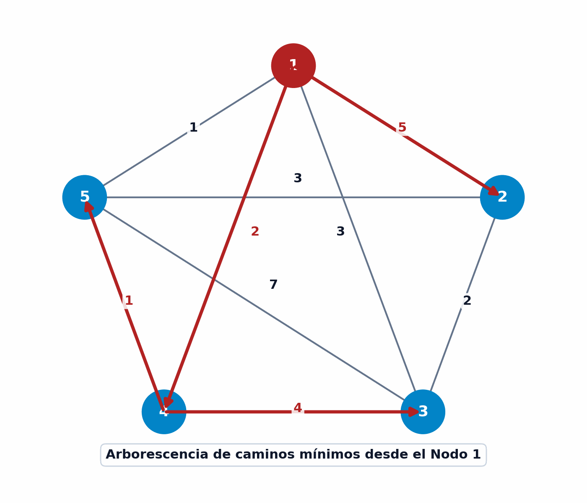

<dialog id="floyd_warshall_ejemplo_pasos-dialog" style="border:none; border-radius:10px; padding:0; width:88vw; max-width:88vw; height:84vh; max-height:84vh; box-shadow:0 20px 60px rgba(0,0,0,0.55); overflow:hidden; background:#fff;">
  <button onclick="document.getElementById('floyd_warshall_ejemplo_pasos-dialog').close()"
          style="position:absolute; top:10px; right:14px; z-index:10; background:rgba(15,23,42,0.6); color:#fff; border:none; border-radius:50%; width:30px; height:30px; font-size:17px; cursor:pointer; line-height:1; display:flex; align-items:center; justify-content:center;">×</button>
  <iframe src="images/floyd_warshall_player.html" width="100%" height="100%" style="border:none; display:block;" scrolling="no"></iframe>
</dialog>

Animación paso a paso de las arborescencias de caminos mínimos obtenidas tras la convergencia del Algoritmo de Floyd-Warshall.
:::
:::

::: {.content-visible when-format="pdf"}
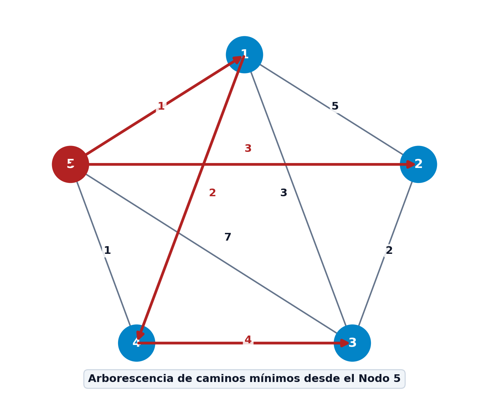{#fig-floyd-warshall-ejemplo-pasos fig-align="center" width="75%"}
:::
:::
