# Flujos en redes

La optimización de **flujos en redes** constituye uno de los pilares más avanzados y de mayor aplicabilidad en el análisis de redes y la investigación operativa. Permite modelar, cuantificar y optimizar la circulación de bienes físicos o abstractos (tales como tráfico vehicular, fluidos en tuberías, corriente eléctrica, paquetes de información o transferencias financieras) a través de infraestructuras interconectadas sujetas a capacidades físicas límite [@ahuja1993network; @bertsekas1998network].

En este capítulo desarrollaremos la fundamentación matemática rigurosa de la teoría de flujos. Comenzaremos con el estudio algebraico del espacio de flujos, ciclos y cociclos (cortes), introduciendo el célebre Lema de Coloración de Arcos de Minty como piedra angular demostrativa. A continuación, formularemos el problema del flujo máximo, demostrando formalmente el Teorema Max-Flow Min-Cut de Ford-Fulkerson y analizando sus algoritmos de resolución. Finalmente, ampliaremos la teoría a la formulación mediante programación lineal dual y a la resolución del problema de flujo a coste mínimo y el problema general del transbordo.

::: {.callout-important title="Objetivos de aprendizaje" data-kind="objetivos"}
Al finalizar este capítulo, serás capaz de:

1. **Formular** algebraicamente el concepto de flujo y circulación en digrafos mediante las ecuaciones de conservación y balance en los nodos.
2. **Caracterizar** la estructura vectorial de los flujos, calculando las bases fundamentales de ciclos y el número ciclomático $\nu(G)$.
3. **Demostrar** y **aplicar** el Lema de Coloración de Arcos de Minty mediante su algoritmo constructivo de etiquetado de vértices.
4. **Demostrar** y **analizar** el Teorema de Flujo Máximo - Corte Mínimo de Ford-Fulkerson y la relación de dualidad en optimización lineal.
5. **Ejecutar** y **caracterizar** el algoritmo de Ford-Fulkerson en redes residuales mediante el método de etiquetado directo y la cota de Edmonds-Karp.
6. **Formular** y **resolver** los problemas de flujo a coste mínimo y el problema general del transbordo.
:::

## Estructura algebraica de flujos, ciclos y cociclos

El análisis cualitativo y cuantitativo de las redes de flujo requiere establecer una representación matemática rigurosa basada en el álgebra lineal sobre la topología del digrafo. Los flujos en una red no son simples colecciones arbitrarias de números asignados a las conexiones; responden a leyes físicas y topológicas estrictas de conservación local en los vértices (análogas a las leyes de Kirchhoff en circuitos eléctricos o a la ecuación de continuidad en dinámica de fluidos).

Para formalizar este comportamiento, representamos la red como un digrafo conexo $G = (V, U)$ formado por un conjunto de $n = |V|$ vértices y $m = |U|$ arcos dirigidos.

::: {.callout-note title="Definición: Flujo en un digrafo y conservación" data-kind="definicion"}
Dado un digrafo conexo $G = (V, U)$ con $m$ arcos dirigidos, un **flujo** es un vector $\mathbf{f} = (f_{u_1}, f_{u_2}, \dots, f_{u_m})^T \in \mathbb{R}^m$ cuyas componentes representan la cantidad de caudal o flujo $f_u$ que transita por cada arco $u \in U$, satisfaciendo la **ley de conservación de flujo** en todos los vértices:

$$
\sum_{u \in w^+(i)} f_u = \sum_{u \in w^-(i)} f_u, \quad \forall i \in V
$$

donde $w^+(i)$ representa el conjunto de arcos salientes del nodo $i$ y $w^-(i)$ el conjunto de arcos entrantes al nodo $i$.
:::

::: {.callout-note title="Nota de notación: Distinción entre arcos, vectores y componentes" data-kind="nota"}
Para evitar cualquier confusión entre los nombres de los arcos y los valores numéricos del flujo:

1. **Identificador del Arco**: Los $m$ arcos del digrafo se etiquetan como $u_1, u_2, \dots, u_m \in U$ (o bien por el par ordenado de sus vértices $u = (i, j)$).
2. **Identificador de Vectores (Superíndices)**: Los distintos vectores de flujo o de ciclo se denotan en negrita utilizando **superíndices** (por ejemplo, $\mathbf{f}^1, \mathbf{f}^2, \mathbf{f}^3$ para vectores de flujo; $\mathbf{\mu}^1, \mathbf{\mu}^2$ para vectores de ciclo).
3. **Componentes Escalares de Arco (Subíndices)**: El caudal que circula por el arco $u_k$ se denota mediante el **subíndice** $f_{u_k}$ (o $f_{ij}$), correspondiente a la $k$-ésima entrada del vector $\mathbf{f}$. En los gráficos de la red, las etiquetas especifican explícitamente el arco y su valor ($u_k: f_{u_k}$).
:::

En modelos generales de redes donde existen inyecciones o extracciones externas de caudal (por ejemplo, plantas de generación o centros de distribución), se asocia a cada nodo $i \in V$ un escalar de balance $b_i \in \mathbb{R}$:

* **Nodo fuente ($b_i > 0$)**: Inyecta $b_i$ unidades netas de flujo a la red.
* **Nodo sumidero ($b_i < 0$)**: Extrae $|b_i|$ unidades netas de flujo de la red.
* **Nodo de transbordo ($b_i = 0$)**: La suma de flujos entrantes iguala exactamente a la de salientes, actuando como mero nodo de paso.

La condición necesaria de factibilidad global exige el equilibrio perfecto entre oferta y demanda: la suma total de balances debe ser nula en toda la red, $\sum_{i \in V} b_i = 0$. Cuando la red no posee entradas ni salidas externas ($b_i = 0$ para todo $i \in V$), el vector $\mathbf{f}$ se denomina estrictamente **circulación**, garantizando la conservación exacta en cada vértice del digrafo.

::: {.callout-tip title="Ejemplo: Evaluación de vectores de flujo en un digrafo" data-kind="ejemplo" collapse="true"}
Considérese el digrafo de 5 nodos $V = \{a, b, c, d, e\}$ y 7 arcos dirigidos $U = \{u_1=(a,b), u_2=(b,c), u_3=(c,d), u_4=(d,e), u_5=(e,a), u_6=(e,b), u_7=(e,c)\}$.

Se evalúan los siguientes tres vectores de flujo $\mathbf{f} \in \mathbb{R}^7$, ilustrados en la @fig-flujos-tres-vectores:

1. $\mathbf{f}^1 = (2.7;\, 2;\, 2;\, 2;\, 2.7;\, -0.7;\, 0)^T$:
   * Nodo $a$: Salen $f_1 = 2.7$, entran $f_5 = 2.7 \implies 2.7 = 2.7$.
   * Nodo $b$: Salen $f_2 = 2$, entran $f_1 + f_6 = 2.7 + (-0.7) = 2 \implies 2 = 2$.
   * Nodo $e$: Salen $f_5 + f_6 + f_7 = 2.7 - 0.7 + 0 = 2$, entra $f_4 = 2 \implies 2 = 2$.
   * *Conclusión*: Cumple la ley de conservación en todos los nodos, luego $\mathbf{f}^1$ es un flujo válido.

2. $\mathbf{f}^2 = (0;\, 1;\, 1;\, 1;\, 0;\, 1;\, 0)^T$: Corresponde al flujo que circula por el ciclo formado por los arcos $u_2, u_3, u_4, u_6$.
3. $\mathbf{f}^3 = (1;\, 0;\, -1;\, -1;\, 1;\, -1;\, -1)^T$: Satisface las ecuaciones de conservación en los 5 nodos.

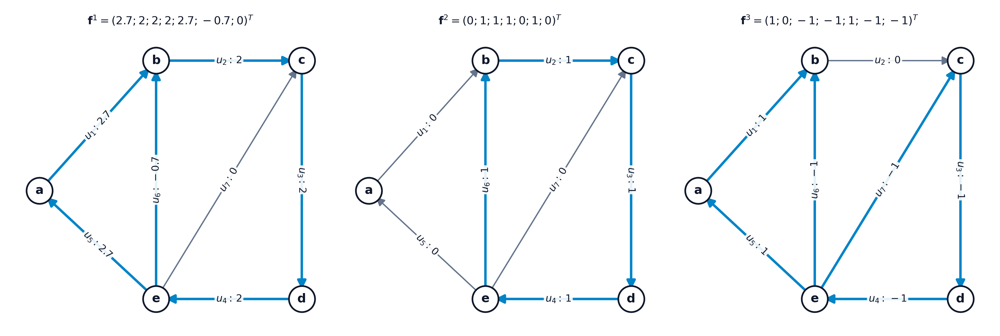{#fig-flujos-tres-vectores fig-align="center" width="85%"}
:::

La topología del digrafo impone restricciones fundamentales sobre los vectores de flujo factibles. Por ejemplo, en una estructura sin circuitos cerrados, la conservación obliga a que no pueda sostenerse ningún caudal continuo.

::: {.callout-note title="Lema: Flujo nulo en árboles" data-kind="lema"}
Un flujo definido sobre un árbol (digrafo conexo acíclico) es necesariamente el **flujo nulo** ($\mathbf{f} = \mathbf{0}$).

*Demostración*:
Todo árbol de $n$ vértices posee $n - 1$ arcos y contiene al menos un vértice pendiente o hoja $x_1$ de grado total $d(x_1) = 1$. Sea $u \in U$ el único arco incidente en $x_1$. Por la ley de conservación de flujo en $x_1$, la única componente entrante o saliente debe ser cero, $f_u = 0$.

Eliminando el nodo $x_1$ y el arco $u$, se obtiene un subgrafo generado sobre $V \setminus \{x_1\}$ que mantiene la estructura de árbol. Repitiendo el razonamiento inductivo para los restantes $n - 1$ nodos, se deduce que todas las componentes del vector de flujo son cero: $f_u = 0, \forall u \in U$. $\blacksquare$
:::

El resultado anterior demuestra que la existencia de ciclos o circuitos cerrados es una condición estrictamente necesaria para sostener una circulación no nula en una red. Al añadir arcos a un árbol para formar ciclos, las ecuaciones de conservación lineales permiten combinar diferentes soluciones de flujo mediante operaciones de suma y multiplicación por escalares. Esta propiedad algebraica fundamental se formaliza en el siguiente resultado.

::: {.callout-note title="Lema: Estructura vectorial del espacio de flujos" data-kind="lema"}
Cualquier combinación lineal de flujos es un flujo. En consecuencia, el conjunto de flujos definidos sobre un digrafo $G = (V, U)$ forma un espacio vectorial.
:::

La estructura de espacio vectorial garantiza que el conjunto de flujos satisface la clausura algebraica: sumar dos circulaciones factibles o escalar una circulación existente produce siempre un flujo válido que preserva la conservación en todos los vértices. Para ilustrar cuantitativamente este principio abstracto, consideremos una combinación lineal concreta de los vectores de flujo evaluados previamente.

::: {.callout-tip title="Ejemplo: Combinación lineal de vectores de flujo" data-kind="ejemplo" collapse="true"}
Consideremos los tres vectores de flujo $\mathbf{f}^1, \mathbf{f}^2, \mathbf{f}^3 \in \mathbb{R}^7$ analizados anteriormente sobre el digrafo de 5 nodos. Construimos la combinación lineal:

$$
\mathbf{f} = 2\mathbf{f}^1 + \mathbf{f}^2 - 3\mathbf{f}^3
$$

Evaluando componente a componente:

$$
\begin{aligned}
\mathbf{f} &= 2(2.7;\, 2;\, 2;\, 2;\, 2.7;\, -0.7;\, 0)^T + (0;\, 1;\, 1;\, 1;\, 0;\, 1;\, 0)^T - 3(1;\, 0;\, -1;\, -1;\, 1;\, -1;\, -1)^T \\
&= (2.4;\, 5;\, 8;\, 8;\, 2.4;\, 2.6;\, 3)^T
\end{aligned}
$$

Como se ilustra en la @fig-flujos-combinacion-lineal, se puede verificar fácilmente la conservación de flujo en cada uno de los 5 vértices:

* **Nodo $a$**: Salen $f_1 = 2.4$, entran $f_5 = 2.4 \implies 2.4 = 2.4$.
* **Nodo $b$**: Salen $f_2 = 5$, entran $f_1 + f_6 = 2.4 + 2.6 = 5 \implies 5 = 5$.
* **Nodo $c$**: Salen $f_3 = 8$, entran $f_2 + f_7 = 5 + 3 = 8 \implies 8 = 8$.
* **Nodo $d$**: Salen $f_4 = 8$, entran $f_3 = 8 \implies 8 = 8$.
* **Nodo $e$**: Salen $f_5 + f_6 + f_7 = 2.4 + 2.6 + 3 = 8$, entra $f_4 = 8 \implies 8 = 8$.

Por consiguiente, la combinación lineal $\mathbf{f}$ satisface la conservación en todos los nodos y constituye un flujo factible bien definido.

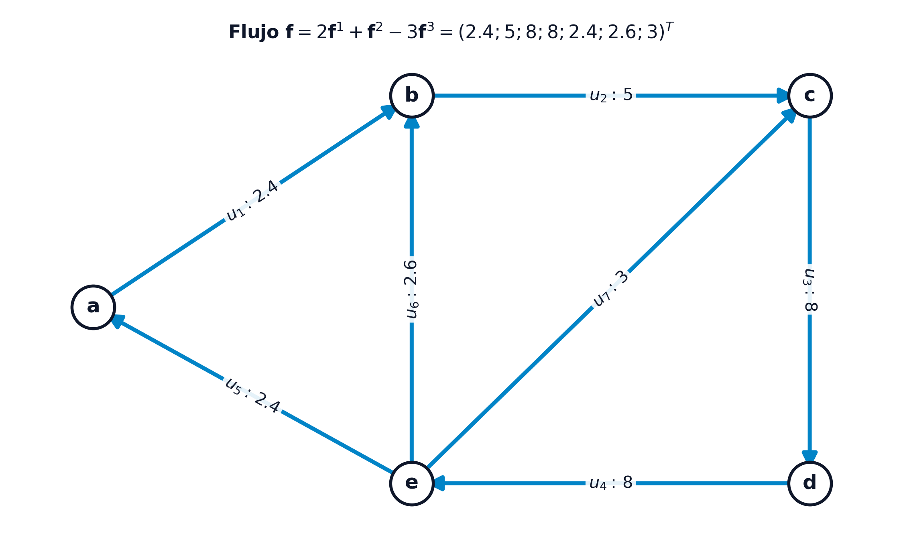{#fig-flujos-combinacion-lineal fig-align="center" width="60%"}
:::

El resultado anterior prueba que el conjunto de flujos definidos sobre un digrafo es un espacio vectorial. Para identificar su dimensión y una base de flujos que permita caracterizarlos todos, es preciso estudiar la relación que existe entre los ciclos y los flujos de un digrafo.

### Ciclos y su relación con los flujos

Dado un digrafo conexo $G = (V, U)$, un **ciclo** $\mu$ es una cadena simple (sin repetir arcos) cuyo nodo inicial y final coinciden. Al dotar a $\mu$ de un sentido de giro de referencia, los arcos $u \in \mu$ se clasifican en:

* **Arcos positivos ($u \in \mu^+$)**: Su orientación en el digrafo coincide con el sentido del ciclo.
* **Arcos negativos ($u \in \mu^-$)**: Su orientación en el digrafo es opuesta al sentido del ciclo.
* **Arcos fuera del ciclo ($u \notin \mu$)**: No forman parte de la cadena simple.

A cada ciclo se le pueden asignar libremente dos orientaciones de giro opuestas, lo que invierte los papeles de los arcos positivos y negativos. Como se ilustra en la @fig-ciclo-orientacion, al recorrer la red según un sentido de giro, los arcos $1, 4, 3$ resultan directos o positivos ($\mu^+$), mientras que los arcos $6, 7$ son opuestos o negativos ($\mu^-$).

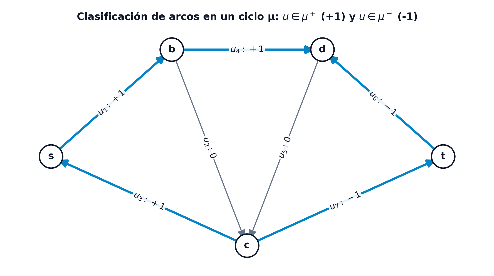{#fig-ciclo-orientacion fig-align="center" width="65%"}

::: {.callout-note title="Definición: Vector característico de un ciclo" data-kind="definicion"}
Un ciclo $\mu$ se representa algebraicamente mediante un vector característico $\mathbf{\mu} = (\mu_1, \mu_2, \dots, \mu_m)^T \in \mathbb{R}^m$, donde la componente asociada a cada arco $u \in U$ se define como:

$$
\mu_u = \begin{cases}
+1 & \text{si } u \in \mu^+ \\
-1 & \text{si } u \in \mu^- \\
0 & \text{si } u \notin \mu
\end{cases}
$$
:::

::: {.callout-tip title="Ejemplo: Vectores característicos de ciclos y relaciones lineales" data-kind="ejemplo" collapse="true"}
Considérese el digrafo de referencia de 5 nodos $s, b, c, d, t$ y 7 arcos dirigidos de la @fig-ciclos-vectores. Se pueden identificar diversos ciclos y sus correspondientes vectores característicos $\mathbf{\mu}_k \in \mathbb{R}^7$:

* $\mathbf{\mu}_1 = (1, 1, 1, 0, 0, 0, 0)^T$: Ciclo orientado $s \to b \to c \to s$ (formado por los arcos $1, 2, 3$).
* $\mathbf{\mu}_2 = (0, -1, 0, 1, 1, 0, 0)^T$: Ciclo $b \to d \to c \to b$ (formado por los arcos $4, 5$ y el opuesto de $2$).
* $\mathbf{\mu}_3 = (1, 0, 1, 1, 1, 0, 0)^T$: Ciclo exterior $s \to b \to d \to c \to s$.
* $\mathbf{\mu}_4 = (-1, -1, -1, 0, -1, -1, -1)^T$: Ciclo global en sentido opuesto.
* $\mathbf{\mu}_5 = (-1, -1, -1, 0, 0, 0, 0)^T$: Ciclo inverso al ciclo $\mathbf{\mu}_1$.

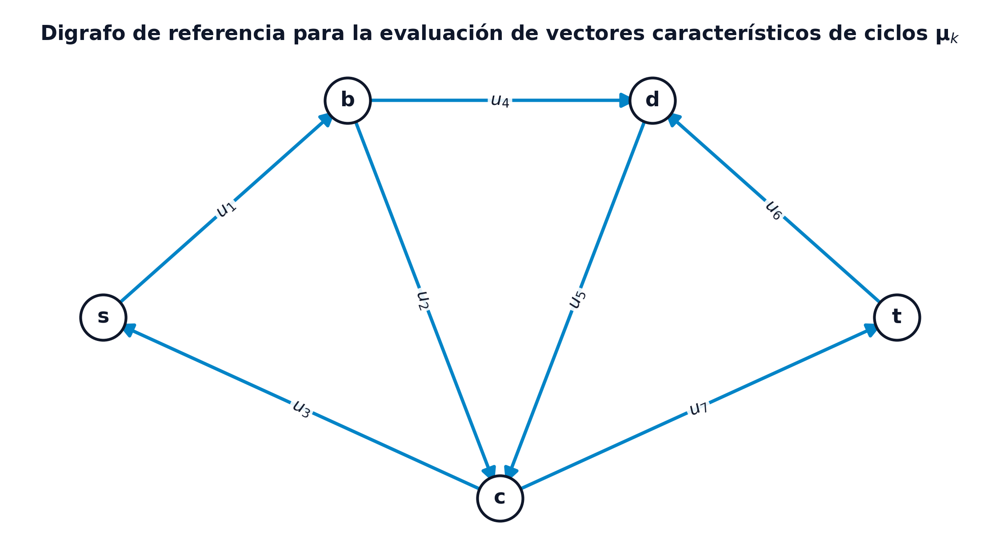{#fig-ciclos-vectores fig-align="center" width="65%"}

Analizando las componentes de los vectores característicos, se comprueban de forma inmediata las siguientes relaciones lineales entre los ciclos:

$$
\mathbf{\mu}_1 = -\mathbf{\mu}_5, \qquad \mathbf{\mu}_3 = \mathbf{\mu}_1 + \mathbf{\mu}_2
$$

Esta propiedad demuestra que las combinaciones lineales de ciclos generan nuevos vectores característicos de ciclos, lo que fundamenta la estructura de espacio vectorial del conjunto de flujos.
:::

::: {.callout-note title="Proposición: Los ciclos son flujos" data-kind="corolario"}
El vector característico $\mathbf{\mu}$ asociado a cualquier ciclo en un digrafo es un flujo.

*Demostración*:
Para cualquier nodo $i \notin \mu$, ningún arco incidente pertenece al ciclo, por lo que $f_u = 0$ y la ley de conservación se cumple de forma trivial ($0 = 0$). Para un nodo $i \in \mu$, el ciclo entra por un arco $u_{in}$ y sale por otro $u_{out}$. Analizando la orientación de ambos arcos respecto al sentido del giro (positivo o negativo), la contribución al balance entrante $\sum f_{in}$ y al balance saliente $\sum f_{out}$ resulta idéntica en ambos miembros, satisfaciéndose $\sum_{u \in w^+(i)} \mu_u = \sum_{u \in w^-(i)} \mu_u$. $\blacksquare$
:::

Como se ilustra en la @fig-ciclos-como-flujos, los vectores $\mathbf{f}^2 = (0;\, 1;\, 1;\, 1;\, 0;\, 1;\, 0)^T$ y $\mathbf{f}^3 = (1;\, 0;\, -1;\, -1;\, 1;\, -1;\, -1)^T$ son flujos válidos generados directamente por ciclos sobre la red de 5 nodos.

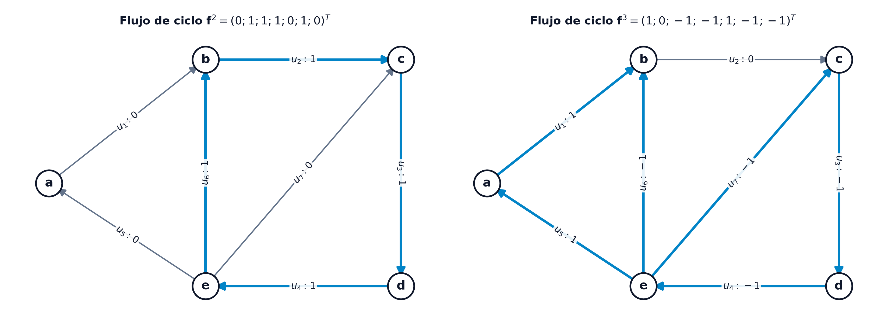{#fig-ciclos-como-flujos fig-align="center" width="85%"}

::: {.callout-note title="Corolario: Variación de flujo mediante ciclos" data-kind="corolario"}
Dado un flujo $\mathbf{f}$ en un digrafo $G$ y un ciclo $\mathbf{\mu}$, el vector resultante de sumar a $\mathbf{f}$ el vector asociado al ciclo multiplicado por una constante $\alpha \in \mathbb{R}$ ($\mathbf{f}' = \mathbf{f} + \alpha \mathbf{\mu}$) es también un flujo en $G$.
:::

### Bases de flujos y número ciclomático

Obviamente, no todos los flujos son ciclos. Sin embargo, cualquier flujo se puede expresar como combinación lineal de ciclos. Además, es posible identificar una base del espacio vectorial de los flujos de un digrafo.

Esta base está formada exclusivamente por ciclos y se obtiene a partir de un árbol soporte del digrafo. Por tanto, cada árbol soporte da lugar a una base distinta del espacio vectorial de flujos.

::: {.callout-note title="Definición: Independencia de flujos" data-kind="definicion"}
Dado un digrafo $G = (V, U)$, un conjunto de flujos $\{\mathbf{f}^1, \mathbf{f}^2, \dots, \mathbf{f}^k\}$ es linealmente independiente si sus correspondientes vectores en $\mathbb{R}^m$ son linealmente independientes.
:::

La propiedad de independencia lineal garantiza que ninguno de los flujos de la base pueda construirse combinando los restantes. Para seleccionar una base de flujos de forma constructiva a partir de la topología del digrafo, el procedimiento matemático estándar se apoya en la elección de un **árbol soporte** de la red.

::: {.callout-important title="Teorema: Base fundamental de ciclos" data-kind="teorema"}
Sea $G = (V, U)$ un digrafo conexo con $n$ vértices y $m$ arcos, y sea $H = (V, T)$ un árbol soporte de $G$ (formado por $n - 1$ arcos).

Al añadir a $T$ cualquier arco fuera del árbol $u \in U \setminus T$, se forma un único ciclo elemental $\mu^u$ en $G$ tal que $\mu^u_u = 1$. El conjunto de ciclos $H = \{\mu^u \mid u \in U \setminus T\}$ constituye una **base del espacio vectorial de flujos** del digrafo $G$.

*Demostración*:
Debemos probar que el conjunto de ciclos $H$ es linealmente independiente y generador:

1. **Independencia lineal**: Cada arco fuera del árbol $u \in U \setminus T$ pertenece a un único ciclo de la base (aquel generado por el propio arco $u$). Por tanto, la componente $\mu^u_u = 1$ mientras que $\mu^{u'}_u = 0$ para cualquier otro $u' \in U \setminus T$. La matriz construida con los vectores de la base contiene una submatriz identidad de dimensión $|U \setminus T| = m - n + 1$, lo que garantiza independencia lineal.
2. **Carácter generador**: Sea un flujo arbitrario $\mathbf{f} = (f_1, \dots, f_m)^T$. Definimos el vector $\mathbf{g} = \mathbf{f} - \sum_{u \in U \setminus T} f_u \mathbf{\mu}^u$. Como $\mathbf{g}$ es combinación lineal de flujos, $\mathbf{g}$ es un flujo. Para cualquier arco $u \in U \setminus T$, la componente $g_u = f_u - f_u (1) = 0$. Por tanto, el flujo $\mathbf{g}$ tiene componentes nulas en todos los arcos de $U \setminus T$. Esto implica que $\mathbf{g}$ es un flujo definido únicamente sobre el árbol $T$. Por el Lema de Flujo Nulo en Árboles, se deduce que $\mathbf{g} = \mathbf{0}$, demostrando que $\mathbf{f} = \sum_{u \in U \setminus T} f_u \mathbf{\mu}^u$. $\blacksquare$
:::

El teorema anterior demuestra que el número de vectores necesarios para generar cualquier circulación en el digrafo queda determinado exclusivamente por la cantidad de arcos fuera del árbol soporte. Esta dimensión algebraica se conoce como número ciclomático del grafo.

::: {.callout-note title="Definición: Número ciclomático" data-kind="definicion"}
Se define el **número ciclomático** $\nu(G)$ de un digrafo conexo $G = (V, U)$ como la dimensión del espacio vectorial de sus flujos:

$$
\nu(G) = m - n + 1
$$
:::

El número ciclomático $\nu(G)$ nos indica que, independientemente de cuán compleja sea la red, basta con identificar $m - n + 1$ cuerdas no básicas para caracterizar unívocamente todo el espacio de circulaciones. A continuación, aplicamos este procedimiento constructivo sobre una red concreta de 5 nodos y 7 arcos.

:::: {.callout-tip title="Ejemplo: Construcción de una base de ciclos y descomposición de un flujo" data-kind="ejemplo" collapse="true"}
Considérese el digrafo de $n = 5$ nodos y $m = 7$ arcos de la @fig-base-ciclos-descomposicion-animado. Su número ciclomático es $\nu(G) = m - n + 1 = 7 - 5 + 1 = 3$, lo que indica que el espacio vectorial de flujos posee dimensión 3.

**Paso 1: Selección del Árbol Soporte y Cuerdas**
Seleccionamos el árbol soporte $H = (V, T)$ formado por $n - 1 = 4$ arcos: $T = \{u_1, u_4, u_5, u_7\}$ (representados en **azul**). Los 3 arcos fuera del árbol, denominados cuerdas o arcos no básicos, son $U \setminus T = \{u_2, u_3, u_6\}$ (representados en **gris**).

**Paso 2: Generación de la Base Fundamental de Ciclos**
Al añadir individualmente cada cuerda $u \in U \setminus T$ al árbol soporte $T$, se forma exactamente un ciclo fundamental elemental $\mathbf{\mu}^u$ en el cual los arcos pertenecientes al ciclo se destacan en **rojo**:

1. **Añadir la cuerda $u_2 = (b, c)$**: Se cierra el ciclo $b \to c \to e \to a \to b$. Fijando orientación positiva en $u_2$ ($\mu^2_{u_2} = 1$), los arcos del árbol $u_1, u_5$ avanzan en sentido directo y $u_7$ en sentido opuesto, obteniéndose:
   $$ \mathbf{\mu}^2 = (1, 1, 0, 0, 1, 0, -1)^T $$

2. **Añadir la cuerda $u_3 = (c, d)$**: Se cierra el ciclo $c \to d \to e \to c$. Con orientación positiva en $u_3$ ($\mu^3_{u_3} = 1$), los arcos $u_4, u_7$ avanzan en sentido directo, resultando:
   $$ \mathbf{\mu}^3 = (0, 0, 1, 1, 0, 0, 1)^T $$

3. **Añadir la cuerda $u_6 = (e, b)$**: Se cierra el ciclo $e \to b \to a \to e$. Con orientación positiva en $u_6$ ($\mu^6_{u_6} = 1$), los arcos $u_1, u_5$ del árbol se recorren en sentido inverso, resultando:
   $$ \mathbf{\mu}^6 = (-1, 0, 0, 0, -1, 1, 0)^T $$

El conjunto $B = \{\mathbf{\mu}^2, \mathbf{\mu}^3, \mathbf{\mu}^6\}$ es linealmente independiente y constituye una **base del espacio vectorial de flujos**.

**Paso 3: Descomposición Unívoca de un Flujo en la Base**
Dado el flujo $\mathbf{f} = (3, 4, 6, 6, 3, 1, 2)^T$, sus coordenadas de descomposición en la base $B$ vienen dadas de forma directa por los valores del flujo en las cuerdas fuera del árbol: $f_{u_2} = 4$, $f_{u_3} = 6$ y $f_{u_6} = 1$. Se verifica la combinación lineal:

$$
\mathbf{f} = 4 \mathbf{\mu}^2 + 6 \mathbf{\mu}^3 + 1 \mathbf{\mu}^6 = 4 \begin{pmatrix} 1 \\ 1 \\ 0 \\ 0 \\ 1 \\ 0 \\ -1 \end{pmatrix} + 6 \begin{pmatrix} 0 \\ 0 \\ 1 \\ 1 \\ 0 \\ 0 \\ 1 \end{pmatrix} + 1 \begin{pmatrix} -1 \\ 0 \\ 0 \\ 0 \\ -1 \\ 1 \\ 0 \end{pmatrix} = \begin{pmatrix} 3 \\ 4 \\ 6 \\ 6 \\ 3 \\ 1 \\ 2 \end{pmatrix}
$$

::: {.content-visible when-format="pdf"}
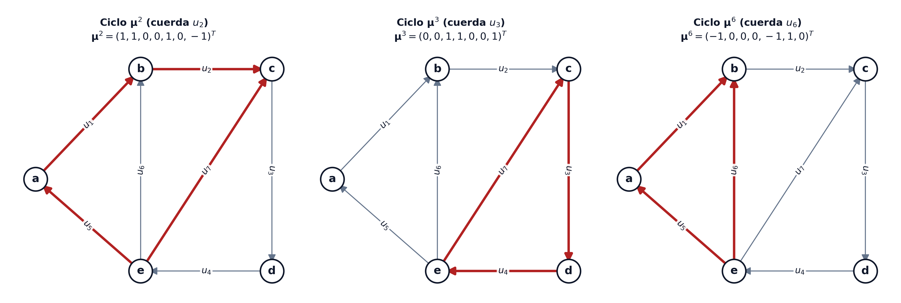{#fig-base-ciclos-tres-pasos fig-align="center" width="85%"}
:::

::: {.content-visible when-format="html"}
::: {#fig-base-ciclos-descomposicion-animado}
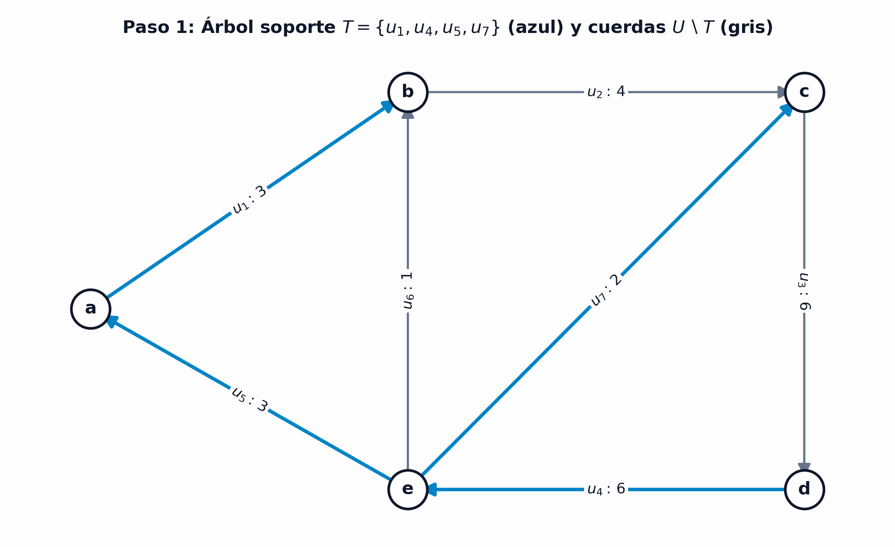

<dialog id="base-ciclos-descomposicion-dialog" style="border:none; border-radius:10px; padding:0; width:88vw; max-width:88vw; height:84vh; max-height:84vh; box-shadow:0 20px 60px rgba(0,0,0,0.55); overflow:hidden; background:#fff;">
  <button onclick="document.getElementById('base-ciclos-descomposicion-dialog').close()"
          style="position:absolute; top:10px; right:14px; z-index:10; background:rgba(15,23,42,0.6); color:#fff; border:none; border-radius:50%; width:30px; height:30px; font-size:17px; cursor:pointer; line-height:1; display:flex; align-items:center; justify-content:center;">×</button>
  <iframe src="images/base_ciclos_descomposicion_player.html" width="100%" height="100%" style="border:none; display:block;" scrolling="no"></iframe>
</dialog>

Animación interactiva paso a paso de la generación de la base fundamental de ciclos y la descomposición del flujo $\mathbf{f}$.
:::
:::
::::

### Cociclos y Lema de Coloración de Arcos de Minty

Mientras que los ciclos representan circulaciones internas cerradas que conservan el flujo localmente sin alterar los balances netos externos, los **cociclos** (o cortes topológicos) representan la estructura dual: barreras globales que separan el conjunto de vértices en dos regiones disjuntas $A$ y $V \setminus A$. Los cociclos condicionan la capacidad global de transporte de la red y determinan la existencia de embotellamientos o cuellos de botella.

::: {.callout-note title="Definición: Cociclo (Corte)" data-kind="definicion"}
Dado un digrafo conexo $G = (V, U)$ y un subconjunto propio no vacío de vértices $A \subset V$, se define el **cociclo** $w(A)$ como el subconjunto de arcos que tienen un extremo en $A$ y el otro en $V \setminus A$:

$$
w(A) = w^+(A) \cup w^-(A)
$$

donde:

* **Arcos salientes de $A$**: $w^+(A) = \{ u = (i, j) \in U \mid i \in A, \, j \notin A \}$.
* **Arcos entrantes a $A$**: $w^-(A) = \{ u = (j, i) \in U \mid i \in A, \, j \notin A \}$.
:::

Para operar analíticamente con los cociclos e integrarlos en sistemas de ecuaciones algebraicas, asignamos a cada cociclo un vector característico que codifica la dirección del tránsito respecto a la frontera de corte.

::: {.callout-note title="Definición: Vector característico de un cociclo" data-kind="definicion"}
Un cociclo $w(A)$ se representa algebraicamente mediante un vector característico $\mathbf{\theta} = (\theta_1, \theta_2, \dots, \theta_m)^T \in \mathbb{R}^m$, cuyas componentes se definen como:

$$
\theta_u = \begin{cases}
+1 & \text{si } u \in w^+(A) \\
-1 & \text{si } u \in w^-(A) \\
0 & \text{si } u \notin w(A)
\end{cases}
$$
:::

La distinción visual en los diagramas de corte resulta fundamental para comprender la partición topológica: los vértices pertenecientes al conjunto $A$ se identifican mediante contorno y texto en **azul cerúleo**, mientras que los vértices del complemento $V \setminus A$ permanecen en **slate oscuro**. Los arcos que cruzan la frontera entre ambas particiones forman el cociclo $w(A)$ y se destacan en **rojo teja**, mientras que los arcos cuyos dos extremos pertenecen a la misma partición (internos a $A$ o internos a $V \setminus A$) permanecen en **gris slate**.

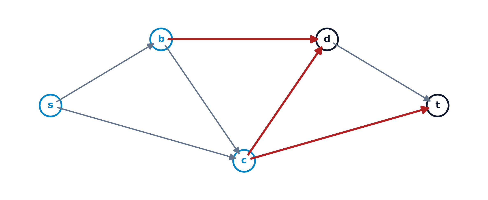{#fig-cociclo-corte-ejemplo fig-align="center" width="65%"}

Como se ilustra en la @fig-cociclo-corte-ejemplo, para el subconjunto de nodos $A = \{s, b, c\}$ (resaltados en azul), los arcos que atraviesan la frontera hacia $\{d, t\}$ son $u_4 = (b, d)$, $u_5 = (d, c)$ y $u_7 = (c, t)$, destacándose en **rojo teja**. De ellos, $u_4$ y $u_7$ salen de $A$ hacia el exterior ($w^+(A)$, asignándoles el valor $+1$), mientras que $u_5$ entra desde $d \notin A$ hacia $c \in A$ ($w^-(A)$, asignándole el valor $-1$). Los arcos $u_1, u_2, u_3, u_6$ no cruzan la frontera y reciben el valor $0$, resultando el vector característico $\mathbf{\theta} = (0, 0, 0, 1, -1, 0, 1)^T$.

::: {.callout-tip title="Ejemplo: Evaluación de vectores de cociclo en un digrafo" data-kind="ejemplo" collapse="true"}
Considérese el digrafo de $n = 5$ nodos y $m = 7$ arcos analizado previamente. Para comprender cómo la elección del conjunto de vértices $A$ modifica radicalmente la frontera de corte y el vector característico resultante, evaluamos dos particiones distintas $A_1$ y $A_2$, ilustradas en la @fig-cociclos-dos-ejemplos:

1. **Subconjunto $A_1 = \{a, b, e\}$ (Subgráfico Izquierdo)**:
   En esta primera partición, los nodos $a, b, e$ se encuentran en la región izquierda (destacados en **azul cerúleo**) y los nodos $c, d$ en la región derecha (en **slate oscuro**). Analizamos los 7 arcos del digrafo uno a uno:

   * Arcos internos a $A_1$: Los arcos $u_1=(a,b)$, $u_5=(e,a)$ y $u_6=(e,b)$ conectan vértices que pertenecen ambos a $A_1$. No cruzan la frontera y por tanto reciben el valor $\theta_{u_1} = \theta_{u_5} = \theta_{u_6} = 0$.
   * Arcos salientes de $A_1$: El arco $u_2=(b,c)$ parte de $b \in A_1$ y llega a $c \notin A_1$; de igual modo, el arco $u_7=(e,c)$ parte de $e \in A_1$ y llega a $c \notin A_1$. Ambos son arcos directos o salientes: $w^+(A_1) = \{u_2, u_7\}$, asignándoles el valor $+1$ ($\theta_{u_2} = 1, \theta_{u_7} = 1$).
   * Arcos entrantes a $A_1$: El arco $u_4=(d,e)$ parte de $d \notin A_1$ e ingresa a $e \in A_1$. Es un arco inverso o entrante: $w^-(A_1) = \{u_4\}$, asignándole el valor $-1$ ($\theta_{u_4} = -1$).
   * Arcos externos a $A_1$: El arco $u_3=(c,d)$ conecta dos vértices fuera de $A_1$, por lo que $\theta_{u_3} = 0$.
   * Vector característico de $w(A_1)$: $\mathbf{\theta}^1 = (0;\, 1;\, 0;\, -1;\, 0;\, 0;\, 1)^T$.

2. **Subconjunto $A_2 = \{b, d\}$ (Subgráfico Derecho)**:
   En esta segunda partición, los nodos $b, d$ forman la región superior (destacados en **azul cerúleo**) y los nodos $a, c, e$ forman la región inferior (en **slate oscuro**):

   * Arcos salientes de $A_2$: Los arcos $u_2=(b,c)$ (sale de $b \in A_2$ hacia $c$) y $u_4=(d,e)$ (sale de $d \in A_2$ hacia $e$) cruzan la frontera hacia afuera: $w^+(A_2) = \{u_2, u_4\}$, asignándoles el valor $+1$ ($\theta_{u_2} = 1, \theta_{u_4} = 1$).
   * Arcos entrantes a $A_2$: Los arcos $u_1=(a,b)$ (entra desde $a$ a $b \in A_2$), $u_3=(c,d)$ (entra desde $c$ a $d \in A_2$) y $u_6=(e,b)$ (entra desde $e$ a $b \in A_2$) cruzan la frontera hacia adentro: $w^-(A_2) = \{u_1, u_3, u_6\}$, asignándoles el valor $-1$ ($\theta_{u_1} = -1, \theta_{u_3} = -1, \theta_{u_6} = -1$).
   * Arcos no incidentes en el corte: Los arcos $u_5=(e,a)$ y $u_7=(e,c)$ conectan nodos fuera de $A_2$, por lo que $\theta_{u_5} = \theta_{u_7} = 0$.
   * Vector característico de $w(A_2)$: $\mathbf{\theta}^2 = (-1;\, 1;\, -1;\, 1;\, 0;\, -1;\, 0)^T$.

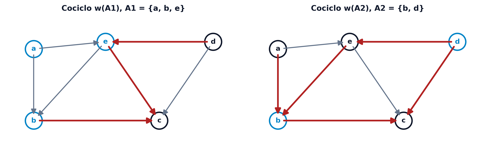{#fig-cociclos-dos-ejemplos fig-align="center" width="95%"}
:::

### Ortogonalidad fundamental entre ciclos y cociclos

Existe una propiedad algebraica fundamental que vincula el espacio de flujos (generado por los ciclos) con el espacio de cociclos (generado por los cortes). Para cualquier ciclo $\mathbf{\mu}$ y cualquier cociclo $\mathbf{\theta}$ definidos sobre el mismo digrafo $G = (V, U)$, su producto escalar es idénticamente nulo:

$$
\mathbf{\mu}^T \mathbf{\theta} = \sum_{u \in U} \mu_u \theta_u = 0
$$

Esta propiedad demuestra que el **espacio vectorial de flujos** (de dimensión $m - n + 1$) y el **espacio vectorial de cociclos** (de dimensión $n - 1$) son **subespacios ortogonales complementarios** en $\mathbb{R}^m$, satisfaciendo $(m - n + 1) + (n - 1) = m$. Físicamente, esto significa que el caudal neto transportado por cualquier circulación a través de un corte topológico es exactamente igual a cero.

Una vez establecida la dualidad estricta entre el espacio de ciclos y el espacio de cociclos, surge la pregunta de si es posible determinar cuál de estas dos estructuras domina la conectividad de la red cuando los arcos están sujetos a restricciones de orientación o estado.

Esta cuestión fue resuelta por George J. Minty en 1966 al formular el **Lema de Coloración de Arcos**. El lema establece una dicotomía matemática perfecta: al colorear arbitrariamente los arcos de un digrafo conexo con tres colores (negro, verde y rojo) y fijar un arco negro de referencia $u_0$, **se verifica o bien la existencia de un ciclo elemental coloreado que contiene a $u_0$, o bien la existencia de un cociclo elemental coloreado que contiene a $u_0$, pero jamás ambos simultáneamente**. Esta dicotomía constituye el motor lógico fundamental para demostrar la convergencia del algoritmo de Ford-Fulkerson y el Teorema Max-Flow Min-Cut.

::: {.callout-note title="Lema: Coloración de arcos de Minty" data-kind="lema"}
Sea $G = (V, U)$ un digrafo conexo cuyos arcos se encuentran coloreados (de forma arbitraria) utilizando tres colores: **negro** ($N$), **verde** ($V$), **rojo** ($R$) o bien permanecen **sin color** ($0$), existiendo al menos un arco de referencia $u_0 \in U$ coloreado de **negro**.

Entonces, se verifica **una, y solo una**, de las dos aseveraciones siguientes:

1. El arco negro $u_0$ pertenece a un **ciclo elemental** coloreado (formado únicamente por arcos negros, verdes o rojos). En este ciclo, los arcos negros tienen orientación positiva, los arcos verdes tienen orientación negativa y los arcos rojos pueden tener cualquier orientación.
2. El arco negro $u_0$ pertenece a un **cociclo elemental** coloreado (formado únicamente por arcos negros, verdes o sin color). En este cociclo, los arcos negros están en $w^+(A)$ (mismo sentido que $u_0$), los verdes están en $w^-(A)$ (sentido opuesto) y los arcos sin color pueden tener cualquier sentido.

*Demostración*:
La demostración del lema es constructiva y se fundamenta en un proceso sistemático de etiquetado de vértices.

Sea $u_0 = (t, s)$ el arco de referencia coloreado de negro (origen en $t$ y destino en $s$).

**Paso 1: Etiquetado Inicial**
Asignar una etiqueta al nodo destino $s$: $p(s) = s$. El resto de vértices permanecen no etiquetados: $p(j) = 0, \forall j \neq s$.

**Paso 2: Propagación de Etiquetas**
Repetir mientras sea posible etiquetar nuevos vértices: dado un nodo $i$ ya etiquetado ($p(i) \neq 0$) y un nodo $j$ no etiquetado ($p(j) = 0$) adyacentes en $G$, asignar la etiqueta $p(j) = i$ si se satisface alguna de las siguientes reglas de color:

* Existe el arco dirigido $u = (i, j) \in U$ (sale de $i$ a $j$) y $u$ está coloreado de **negro** o **rojo**.
* Existe el arco dirigido $u = (j, i) \in U$ (entra de $j$ a $i$) y $u$ está coloreado de **verde** o **rojo**.

**Paso 3: Criterio de Parada y Análisis de Casos**
Al finalizar el proceso de etiquetado, se presenta una y solo una de las siguientes situaciones:

* **Caso A ($p(t) \neq 0$, el vértice $t$ ha sido etiquetado)**:
  Reconstruyendo la cadena de antecedentes desde $t$ hasta $s$ ($t - p(t) - p(p(t)) - \dots - s$) y añadiendo el arco negro $u_0 = (t, s)$, se obtiene un ciclo. Por la regla de etiquetado, todos sus arcos son negros, verdes o rojos. Los negros y rojos directos avanzan de $i$ a $j$ (orientación positiva), mientras que los verdes y rojos inversos van de $j$ a $i$ (orientación negativa). Esto satisface la **Afirmación 1**.

* **Caso B ($p(t) = 0$, el vértice $t$ no pudo ser etiquetado)**:
  Definimos el conjunto de vértices etiquetados $A = \{i \in V \mid p(i) \neq 0\}$. Como $s \in A$ y $t \notin A$, el arco negro $u_0 = (t, s) \in w^-(A)$, o equivalentemente $u_0 \in w^+(V \setminus A)$.
  Analizamos las propiedades del cociclo $w(A)$:

  * No puede contener arcos **rojos**: si existiera un arco rojo $(i, j)$ con $i \in A$ y $j \notin A$, la regla del Paso 2 habría etiquetado $j$, contradiciendo que $j \notin A$.
  * Ningún arco **negro** puede pertenecer a $w^-(A)$ (entrar a $A$): si existiera un arco negro $(j, i)$ con $j \notin A$ e $i \in A$, la segunda regla habría etiquetado $j$.
  * Ningún arco **verde** puede pertenecer a $w^+(A)$ (salir de $A$): si existiera un arco verde $(i, j)$ con $i \in A$ y $j \notin A$, la segunda regla habría etiquetado $j$.

  En consecuencia, los arcos negros en $w(A)$ son exclusivamente salientes ($w^+(A)$), los verdes son exclusivamente entrantes ($w^-(A)$) y los arcos sin color pueden tener cualquier sentido. Esto satisface la **Afirmación 2**. $\blacksquare$
:::

El procedimiento constructivo anterior demuestra que las tres reglas de propagación de etiquetas garantizan siempre una dicotomía estricta. Para visualizar de forma clara cómo el algoritmo busca la cadena de antecedentes y cómo el color de cada arco determina la ruta de etiquetado o la detención del proceso, consideremos la aplicación completa del Lema sobre una red de 5 nodos en dos escenarios alternativos de coloración.

::: {.callout-tip title="Ejemplo: Aplicación del Lema de Coloración de Minty" data-kind="ejemplo" collapse="true"}
Considérese la red de 5 nodos $V = \{a, b, c, d, e\}$ ilustrada en la @fig-minty-ejemplo-casos, con arco negro de referencia $u_0 = (b, c)$. Se evalúan las dos coloraciones posibles para ilustrar los dos casos alternativos del lema:

1. **Caso A: Generación de un Ciclo (Gráfico Izquierdo)**
   * **Coloración asignada**: $u_0 = (b,c)$ en **negro**, $(e,b)$ en **rojo**, $(e,c), (d,c), (d,e), (a,e)$ en **verde**, y $(a,b)$ **sin color** (0).
   * **Propagación del etiquetado**: Se inicia etiquetando el nodo destino del arco negro, $p(c) = c$. A través del arco verde entrante $(e,c)$, se etiqueta $p(e) = c$. A través del arco verde entrante $(d,c)$, se etiqueta $p(d) = c$. Desde $e$, a través del arco rojo saliente $(e,b)$, se etiqueta el nodo origen $p(b) = e$.
   * **Ciclo elemental resultante**: Al haber alcanzado el origen $b$, se reconstruye la cadena $b - e - c - b$, cerrando el ciclo $\mu = \{(e,b), (e,c), (b,c)\}$ con arcos directos $\mu^+ = \{(e,b), (b,c)\}$ y arco inverso $\mu^- = \{(e,c)\}$.

2. **Caso B: Generación de un Cociclo (Gráfico Derecho)**
   * **Coloración asignada**: $u_0 = (b,c)$ en **negro**, $(e,b), (e,c), (c,d)$ en **verde**, $(d,e), (a,b)$ en **negro**, y $(a,e)$ **sin color** (0).
   * **Propagación del etiquetado**: Se inicia etiquetando $p(c) = c$. A través del arco verde entrante $(e,c)$, se etiqueta $p(e) = c$. Desde $e$, el arco verde $(e,b)$ es saliente (no permite etiquetar $b$), el arco verde $(c,d)$ es saliente de $c$ (no permite etiquetar $d$) y los arcos negros entrantes no están activos. El proceso se detiene sin etiquetar el origen $b$ ($p(b) = 0$).
   * **Cociclo elemental resultante**: El conjunto de nodos etiquetados es $A = \{c, e\}$. El cociclo resultante $w(A)$ presenta arcos salientes $w^+(A) = \{(c,d), (e,b)\}$ y arcos entrantes $w^-(A) = \{(b,c), (d,e), (a,e)\}$.

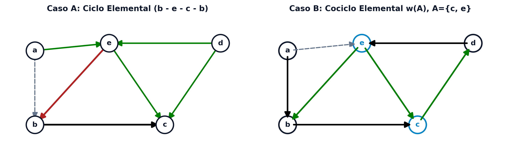{#fig-minty-ejemplo-casos fig-align="center" width="95%"}
:::

Una vez obtenido el ciclo o el cociclo mediante la ejecución del algoritmo de etiquetado, resulta fundamental justificar formalmente por qué la estructura geométrica resultante carece de redundancias o lazos internos. El siguiente resultado complementario analiza la elementalidad de las soluciones obtenidas por el método de Minty.

::: {.callout-note title="Observación: Elementalidad de los ciclos y cociclos de Minty" data-kind="nota"}
En la demostración constructiva del Lema de Minty se asume que las estructuras algebraicas resultantes son elementales. Esta propiedad se justifica formalmente mediante los siguientes argumentos:

1. **Elementalidad del Ciclo**: Si la propagación de etiquetas alcanza el origen $t$, el ciclo resultante es **necesariamente elemental**. La regla de asignación de antecesores $p(j)$ asigna un único padre a cada nodo recién alcanzado, impidiendo que un mismo vértice sea etiquetado dos veces en la trayectoria de retorno de $t$ a $s$.

2. **Elementalidad del Cociclo**: Si la propagación se detiene sin alcanzar el origen $t$, se obtiene la partición de vértices $A$ (etiquetados) y $V \setminus A$ (no etiquetados). Para que el cociclo $w(A)$ sea **elemental**, los subgrafos inducidos $G[A]$ y $G[V \setminus A]$ deben ser conexos:
   * **Conexidad de $G[A]$**: Es conexo de forma trivial por la propia construcción del algoritmo, ya que cada vértice de $A$ se añade siguiendo arcos adyacentes conectados con el nodo inicial $s$.
   * **Conexidad de $G[V \setminus A]$**: Supóngase por reducción al absurdo que el subgrafo $G[V \setminus A]$ no fuera conexo y estuviera descompuesto en $k \ge 2$ componentes conexas disjuntas:
     $$ V \setminus A = \bigcup_{h=1}^k B_h, \qquad B_h \cap B_{h'} = \emptyset, \; \forall h \neq h' $$
     Como el vértice $t$ no pertenece a $A$, debe estar contenido en una de dichas componentes (por ejemplo, $t \in B_1$). Consideremos la unión del conjunto $A$ con el resto de componentes no conectadas con $t$: $A' = A \cup \bigcup_{h=2}^k B_h$.
     El cociclo $w(A')$ generado por $A'$ satisface las mismas propiedades de restricción de color que $w(A)$ y además cumple que $(t, s) \in w^-(A') \subset w^-(A)$. Sin embargo, si $G[V \setminus A]$ no fuera conexo, se contradiría la conexidad global del digrafo inicial $G$, concluyendo que $G[V \setminus A]$ es conexo y por tanto el cociclo $w(A)$ es **elemental**.
:::

## El problema del flujo máximo

Un problema de flujo que surge de forma natural en la práctica es obtener la máxima cantidad de flujo que se puede mover entre dos vértices específicos de un digrafo. Es el denominado **problema del flujo máximo**.

En este problema, cada arco del digrafo posee una capacidad limitada (la cantidad máxima de caudal o flujo que puede transitar físicamente por él por unidad de tiempo). Esto nos lleva a introducir el concepto de **red de transporte**, que valora cada arco por la capacidad de flujo que puede soportar.

### Redes de transporte y flujos compatibles

Para estudiar formalmente el problema del flujo máximo, es preciso dotar al digrafo de una estructura cuantitativa que limite el volumen de tráfico que cada conexión puede albergar.

::: {.callout-note title="Definición: Red de transporte" data-kind="definicion"}
Una **red de transporte** es un par $(G = (V, U), \mathbf{c})$, donde $G = (V, U)$ es un digrafo conexo sin bucles y $\mathbf{c} = \{c_u \mid u \in U\}$ representa el conjunto de **capacidades** superiores no negativas asociadas a cada arco $u \in U$ ($c_u \ge 0$).
:::

Sobre una red de transporte, un vector de flujo es aceptable solo si no excede los límites físicos de las infraestructuras de la red y satisface la conservación local.

::: {.callout-note title="Definición: Flujo compatible (versión preliminar)" data-kind="definicion"}
Dada una red de transporte $(G, \mathbf{c})$, se define un **flujo compatible** como un vector $\mathbf{f} = (f_1, f_2, \dots, f_m)^T \in \mathbb{R}^m$ que satisface:

1. **Ley de conservación pura de flujo**:
   $$ \sum_{u \in w^+(i)} f_u - \sum_{u \in w^-(i)} f_u = 0, \quad \forall i \in V $$

2. **Compatibilidad con las capacidades**:
   $$ 0 \le f_u \le c_u, \quad \forall u \in U $$
:::

Existe una paradoja sutil al aplicar la definición de conservación pura a la transmisión de flujo entre un par de vértices fijados $s$ (fuente) y $t$ (sumidero). En la inmensa mayoría de redes de transporte práctico, de la fuente $s$ solo salen arcos ($w^-(s) = \emptyset$) y al sumidero $t$ solo llegan arcos ($w^+(t) = \emptyset$). 

Si exigimos la conservación pura $\sum_{u \in w^+(i)} f_u = \sum_{u \in w^-(i)} f_u$ de forma estricta en **todos** los nodos sin excepción:

* En el nodo fuente $s$: como no entra ningún arco ($\sum f_{ent} = 0$), la suma de salientes debe ser cero ($\sum f_{sal} = 0$). Como $f_u \ge 0$, se fuerza a que $f_u = 0$ en todos los arcos salientes de $s$.
* En el nodo sumidero $t$: como no sale ningún arco ($\sum f_{sal} = 0$), la suma de entrantes debe ser cero ($\sum f_{ent} = 0$).

Como se ilustra en la @fig-red-conservacion-nula, la conservación estricta en $s$ y $t$ fuerza a que el **único flujo compatible posible sea el flujo trivial nulo** ($\mathbf{f} = \mathbf{0}$), impidiendo enviar cualquier caudal útil desde la fuente hasta el destino.

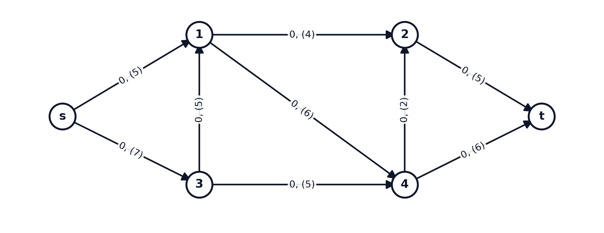{#fig-red-conservacion-nula fig-align="center" width="75%"}

Para solventar este dilema matemático sin romper la estructura de espacio vectorial de las circulaciones ni tener que tratar a $s$ y $t$ como excepciones algorítmicas, se introduce una construcción muy elegante: el **arco ficticio de retorno $u_0 = (t, s)$**.

Conectamos el sumidero $t$ de regreso a la fuente $s$ mediante un arco ficticio $u_0 = (t, s)$ dotado de **capacidad ilimitada** ($c_0 = \infty$). De este modo, todo el flujo que llega a $t$ "recircula" de vuelta a $s$ a través de $u_0$, cerrando la red en una verdadera **circulación**.

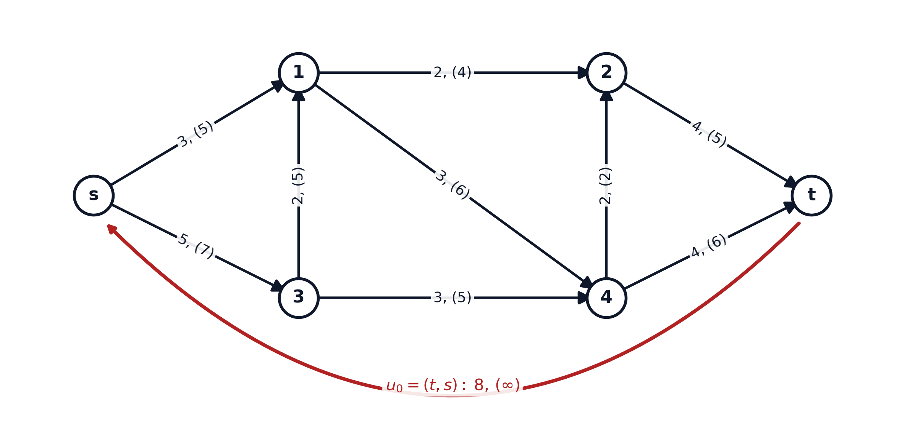{#fig-red-flujo-compatible-retorno fig-align="center" width="80%"}

Como se ilustra en la @fig-red-flujo-compatible-retorno, el flujo $f_0 = f_{(t, s)}$ que circula por el arco ficticio de retorno representa de forma directa el **valor del flujo total** $v(\mathbf{f})$ transmitido por la red desde $s$ hasta $t$:

$$
f_0 = v(\mathbf{f}) = \sum_{j \in \Gamma^+(s)} f_{sj} = \sum_{j \in \Gamma^-(t)} f_{jt}
$$

::: {.callout-note title="Definición formal: $(s, t)$-Flujo compatible" data-kind="definicion"}
Dada una red de transporte $(G = (V, U), \mathbf{c})$ y dos vértices fijados $s, t \in V$, se define un **$(s, t)$-flujo compatible** como una circulación factible sobre la red ampliada $G' = (V, U \cup \{u_0=(t,s)\})$ con $c_0 = \infty$, satisfaciendo $0 \le f_u \le c_u, \, \forall u \in U$.
:::

Una vez caracterizadas las redes de transporte y los $(s, t)$-flujos compatibles con el arco ficticio de retorno $u_0 = (t, s)$, podemos formular de manera rigurosa el problema del flujo máximo.

::: {.callout-note title="Definición: Problema del flujo máximo" data-kind="definicion"}
Dada una red de transporte $(G = (V, U), \mathbf{c})$ y fijados dos vértices $s, t \in V$ (fuente y sumidero), el **problema del flujo máximo** consiste en determinar un $(s, t)$-flujo compatible $\mathbf{f}^* \in \mathbb{R}^m$ tal que el valor del flujo $f_0$ que circula por el arco ficticio de retorno $u_0 = (t, s)$ sea máximo.

Algebraicamente, el problema se formula como:

$$
\begin{aligned}
\max_{\mathbf{f} \in \mathbb{R}^m} \quad & f_0 = \sum_{j \in \Gamma^+(s)} f_{sj} = \sum_{j \in \Gamma^-(t)} f_{jt} \\
\text{s.a.} \quad & \sum_{u \in w^+(i)} f_u - \sum_{u \in w^-(i)} f_u = 0, \quad \forall i \in V \\
& 0 \le f_u \le c_u, \quad \forall u \in U
\end{aligned}
$$
:::

El **valor del flujo** $f_0$ representa cuantitativamente la cantidad total de caudal que sale de la fuente $s$ y llega efectivamente al sumidero $t$.

::: {.callout-tip title="Ejemplo: Evaluación de compatibilidad y saturación por capacidad" data-kind="ejemplo" collapse="true"}
Considérese la red de transporte de 6 nodos $V = \{s, b, c, d, e, t\}$ ilustrada en la @fig-red-flujo-saturacion-ejemplo, equipada con el arco de retorno ficticio $u_0 = (t, s)$ llevando un flujo circulante de $f_0 = 8$ unidades ($v(\mathbf{f}) = 8$).

Evaluamos las condiciones de compatibilidad en los arcos de la red:

1. **Flujo compatible base**: En el estado ilustrado, todos los arcos satisfacen $0 \le f_u \le c_u$. Por ejemplo, el arco $(s, b)$ transita con $f_{sb} = 5 \le c_{sb} = 5$ (arco saturado), mientras que $(b, c)$ transita con $f_{bc} = 2 \le c_{bc} = 3$ (no saturado).
2. **Evaluación de una modificación por ciclo**: Supóngase que intentamos incrementar el flujo enviando 2 unidades adicionales a lo largo del circuito cerrado $c \to d \to e \to c$ (destacado en **rojo teja** en la figura).
   * En el arco $(c, d)$, el flujo aumentaría de $f_{cd} = 1$ a $1 + 2 = 3$. Sin embargo, su capacidad es $c_{cd} = 1$, por lo que $3 > 1$ violando la restricción de capacidad.
   * De igual modo, en $(d, e)$ el flujo pasaría a $4 + 2 = 6 > c_{de} = 3$, e $(e, c)$ pasaría a $2 + 2 = 4 > c_{ec} = 1$.

*Conclusión*: La adición de dicho ciclo destruye la compatibilidad del flujo al exceder las capacidades límite de los arcos.

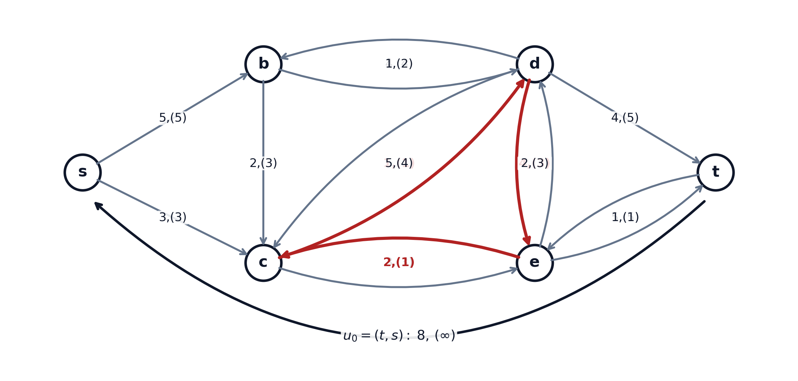{#fig-red-flujo-saturacion-ejemplo fig-align="center" width="85%"}
:::

Para comprender la gran versatilidad didáctica de las redes de transporte, analicemos dos problemas prácticos de modelización: uno proveniente de la ingeniería de tráfico urbano y otro de la optimización combinatoria de tareas.

::: {.callout-tip title="Ejemplo: Modelización de la capacidad de tráfico urbano" data-kind="ejemplo" collapse="true"}
La capacidad de tráfico de las calles de una ciudad se mide habitualmente por el número máximo de automóviles que pueden circular por ellas por minuto. En la red vial ilustrada en la @fig-red-trafico-ejemplo, las intersecciones se representan mediante vértices $V = \{s, a, b, t\}$ y las calles dirigidas mediante arcos con capacidades entre paréntesis $c_u$:

* $c_{sa} = 100$, $c_{sb} = 100$, $c_{ab} = 50$, $c_{at} = 75$, $c_{bt} = 100$.

Se desea determinar la cantidad máxima de automóviles por minuto que pueden transitar desde la zona de entrada $s$ hasta la zona de salida $t$.

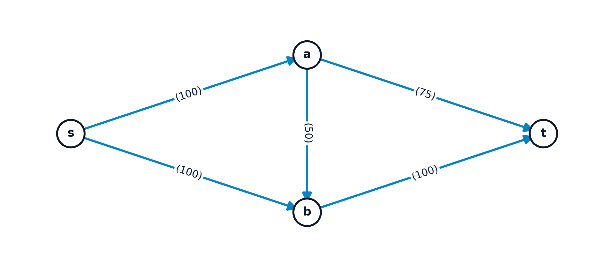{#fig-red-trafico-ejemplo fig-align="center" width="65%"}

Analizando la red, aunque la fuente $s$ puede inyectar hasta $100 + 100 = 200$ vehículos/minuto hacia $a$ y $b$, las calles que llegan al sumidero $t$ restringen el cuello de botella: desde $a$ solo pueden llegar a $t$ como máximo $75$ vehículos/min, y desde $b$ hasta $100$ vehículos/min. El valor del flujo máximo resulta ser $v(\mathbf{f}^*) = 175$ vehículos/min.
:::

Además de sistemas de transporte físico, el problema del flujo máximo permite resolver de forma elegante problemas de optimización combinatoria y asignación de personal.

::: {.callout-tip title="Ejemplo: Asignación óptima de tareas a empleados (Emparejamiento Bipartito)" data-kind="ejemplo" collapse="true"}
En una oficina hay tres empleados ($E_1, E_2, E_3$) y tres tareas ($T_1, T_2, T_3$). Cada tarea requiere unos conocimientos específicos que no todos los empleados poseen. Las compatibilidades se representan en el digrafo bipartito de la @fig-asignacion-tareas-ejemplo (izquierda):

* $E_1$ es compatible con $T_1, T_2$.
* $E_2$ es compatible con $T_1, T_3$.
* $E_3$ es compatible con $T_1, T_3$.

Se desea determinar cómo asignar las tareas a los empleados para tratar de realizarlas todas (asignación uno a uno).

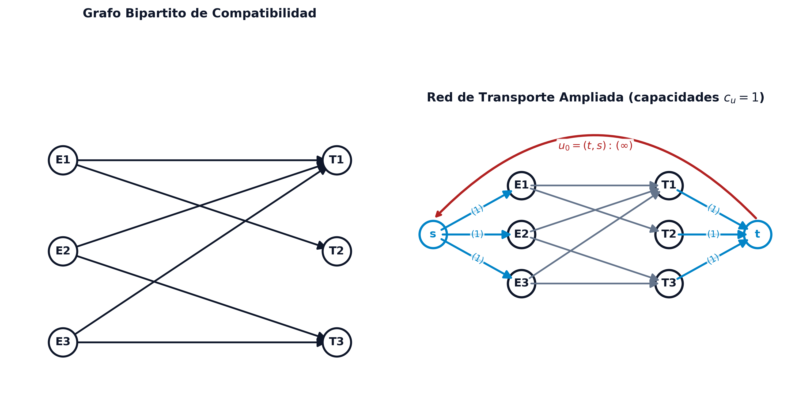{#fig-asignacion-tareas-ejemplo fig-align="center" width="95%"}

**Modelización como problema de flujo máximo**:
Para reducir este problema a una red de transporte (derecha):

1. Añadimos un nodo fuente ficticio $s$ conectado a cada empleado $E_i$ mediante un arco $(s, E_i)$ con capacidad $c_{s E_i} = 1$ (cada empleado puede realizar como máximo 1 tarea).
2. Asignamos capacidad unitaria $c_{E_i T_j} = 1$ a todos los arcos de compatibilidad entre empleados y tareas.
3. Añadimos un nodo sumidero ficticio $t$ conectado desde cada tarea $T_j$ mediante un arco $(T_j, t)$ con capacidad $c_{T_j t} = 1$ (cada tarea requiere exactamente 1 empleado).
4. Añadimos el arco ficticio de retorno $u_0 = (t, s)$ con capacidad ilimitada ($c_0 = \infty$).

Resolver el flujo máximo de $s$ a $t$ sobre esta red equivale a hallar el número máximo de tareas realizables simultáneamente.
:::

Una vez formalizada la red de transporte e ilustrada su versatilidad, el esquema general para resolver cualquier problema de flujo máximo se fundamenta en un procedimiento iterativo de aumento progresivo:

1. **Flujo Inicial**: Comenzar con un flujo compatible válido $\mathbf{f}^0$ sobre la red (típicamente el flujo trivial nulo $\mathbf{f}^0 = \mathbf{0}$).
2. **Búsqueda de Aumento**: Buscar un nuevo flujo compatible $\mathbf{f}^{k+1}$ que incremente el valor circulante por el arco de retorno $f_0$.
3. **Iteración y Criterio de Parada**: Repetir el procedimiento a partir del nuevo flujo hasta que no sea posible realizar ningún incremento adicional.

La justificación matemática de este esquema radica en la estructura algebraica del espacio de flujos: dado que todo flujo se puede expresar como combinación lineal de ciclos, la diferencia entre dos soluciones cualesquiera $\mathbf{f}^2 - \mathbf{f}^1$ es siempre una **combinación lineal de ciclos**. Por tanto, para elevar el caudal de la fuente $s$ al sumidero $t$, el algoritmo analiza si existe en la red un ciclo que incluya al arco ficticio de retorno $u_0 = (t, s)$ y admita un incremento de al menos una unidad de flujo. Esta búsqueda equivale a encontrar una trayectoria no saturada en sentido directo desde $s$ hasta $t$, denominada **cadena incremental**.

::: {.callout-note title="Definición: Cadena incremental y ciclo incremental" data-kind="definicion"}
Dado un flujo compatible $\mathbf{f}$ en la red de transporte $(G = (V, U), \mathbf{c})$, una cadena $\mu[a, b]$ entre dos vértices $a$ y $b$ es una **cadena incremental** (o camino aumentante) si satisface:

$$
f_u < c_u, \quad \forall u \in \mu^+ \qquad \text{y} \qquad f_u > 0, \quad \forall u \in \mu^-
$$

donde $\mu^+$ representa el conjunto de arcos de la cadena recorridos en sentido directo (de $a$ hacia $b$) y $\mu^-$ representa los arcos recorridos en sentido inverso.

Un **ciclo incremental** es una cadena incremental cerrada. En el problema del flujo máximo, el objetivo es incrementar el flujo transportado por el arco de retorno $u_0 = (t, s)$, por lo que se busca sistemáticamente una cadena incremental entre la fuente $s$ y el sumidero $t$.
:::

::: {.callout-note title="Definición: Capacidad residual de una cadena" data-kind="definicion"}
La **capacidad residual** $c(\mu)$ (o cuello de botella) de una cadena incremental $\mu[s, t]$ es la máxima cantidad de flujo adicional que se puede enviar desde $s$ hasta $t$ a través de $\mu$:

$$
c(\mu) = \min \left\{ \min_{u \in \mu^+} (c_u - f_u), \, \min_{u \in \mu^-} f_u \right\}
$$
:::

Si se incrementa el flujo en $c(\mu)$ unidades en los arcos directos $u \in \mu^+$ y se reduce en $c(\mu)$ unidades en los arcos inversos $u \in \mu^-$, el valor total del flujo $f_0$ aumenta exactamente en $c(\mu)$ unidades manteniendo la compatibilidad estricta.

### Flujo máximo en grafos no dirigidos

En el caso de redes construidas sobre un grafo no dirigido $G = (V, E)$, el problema de flujo no queda bien definido de forma directa sobre las aristas. La capacidad $c_e$ de una arista no dirigida $e = \{a, b\} \in E$ puede ser saturada en el sentido de tránsito $(a, b)$ o en el sentido contrario $(b, a)$.

Para evitar enviar flujo en los dos sentidos simultáneamente de modo que se verifique $f_{(a,b)} + f_{(b,a)} \le c_e$ siendo ambos flujos positivos, es necesario transformar el grafo original en un digrafo equivalente de forma que se impida el flujo en sentido inverso sobre una misma arista.

::: {.callout-note title="Definición: Transformación de aristas no dirigidas (Gadget de 5 arcos)" data-kind="definicion"}
Cada arista no dirigida $e = \{a, b\} \in E$ con capacidad $c_e = c$ se sustituye por un conjunto de **cinco arcos dirigidos** que conectan los vértices originales $a$ y $b$ con dos nuevos vértices auxiliares $a'$ y $b'$, asignando capacidad $c$ a todos ellos:

$$
U_e = \{ (a, a'), \, (b, a'), \, (a', b'), \, (b', a), \, (b', b) \}
$$
:::

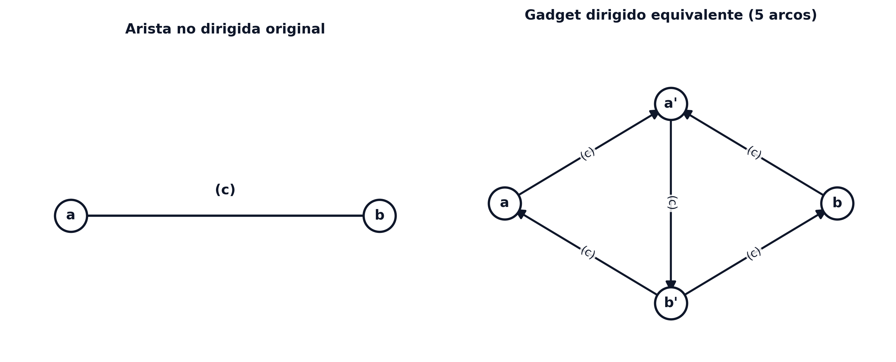{#fig-transformacion-arista-nodirigida fig-align="center" width="75%"}

Como se ilustra en la @fig-transformacion-arista-nodirigida, esta construcción garantiza la equivalencia física y matemática:

* **Tránsito de $a$ hacia $b$**: El flujo sigue el camino $a \to a' \to b' \to b$, quedando limitado por la capacidad $c$ del arco central $(a', b')$.
* **Tránsito de $b$ hacia $a$**: El flujo sigue el camino $b \to a' \to b' \to a$, atravesando exactamente el mismo arco central $(a', b')$.

Dado que ambas direcciones deben atravesar de forma obligatoria el arco central dirigido $(a', b')$, se satisface de forma automática la restricción global $f_{(a,b)} + f_{(b,a)} \le c$, impidiendo la circulación simultánea en ambos sentidos y manteniendo la compatibilidad estricta.

### Flujo máximo y corte mínimo

La búsqueda de la cantidad máxima de caudal que puede transitar desde la fuente $s$ hasta el sumidero $t$ conduce de forma natural al estudio de los cuellos de botella topológicos que restringen la red. La capacidad global de transmisión no está determinada únicamente por las conexiones individuales, sino por barreras o particiones completas que separan físicamente el origen del destino.

::: {.callout-note title="Definición: $(s, t)$-Corte" data-kind="definicion"}
Dada la red de transporte $(G = (V, U), \mathbf{c})$, un **corte que separa $s$ y $t$** o **$(s, t)$-corte** es un conjunto de arcos salientes $w^+(N)$ asociado a un subconjunto de vértices $N \subset V$ tal que $s \in N$ y $t \notin N$.
:::

Para evaluar cuantitativamente el cuello de botella que representa una partición $N$, es preciso sumar la capacidad máxima de todas las conducciones que abandonan el conjunto $N$ hacia su complemento $V \setminus N$.

::: {.callout-note title="Definición: Capacidad de un corte" data-kind="definicion"}
Dada la red de transporte $(G = (V, U), \mathbf{c})$, se define la **capacidad de un $(s, t)$-corte** como la suma de las capacidades de los arcos que lo componen:

$$
c(w^+(N)) = \sum_{u \in w^+(N)} c_u
$$
:::

De todas las posibles particiones que separan la fuente del sumidero, aquellas que imponen la restricción más severa constituyen los cuellos de botella verdaderamente críticos de la infraestructura.

::: {.callout-note title="Definición: Problema de corte de mínima capacidad" data-kind="definicion"}
El **problema de corte de mínima capacidad** trata de determinar en una red de transporte el $(s, t)$-corte cuya capacidad sea mínima:

$$
\min_{\substack{N \subset V \\ s \in N, \, t \notin N}} c(w^+(N)) = \sum_{u \in w^+(N)} c_u
$$
:::

Existe una relación dual fundamental entre el flujo $f_0$ que circula por la red y la capacidad de cualquier $(s, t)$-corte. El siguiente resultado establece que ningún flujo puede superar la capacidad de la barrera más estrecha que deba atravesar.

::: {.callout-note title="Proposición: Acotación del flujo por la capacidad del corte" data-kind="corolario"}
Dada una red de transporte $(G = (V, U), \mathbf{c})$ y fijados los vértices $s, t \in V$, para cualquier $(s, t)$-flujo compatible $\mathbf{f}$ se verifica que su valor de flujo $f_0$ está acotado por la capacidad de cualquier $(s, t)$-corte. Es decir:

$$
f_0 \le \sum_{u \in w^+(N)} c_u, \qquad \forall N \subset V \text{ tal que } s \in N, \, t \notin N
$$

*Demostración*:
Sea $N \subset V$ tal que $s \in N$ y $t \notin N$. Sea $\mathbf{f} = (f_0, f_1, \dots, f_m)$ un flujo compatible en la red ampliada con el arco ficticio de retorno $u_0 = (t, s)$.

Por la ley de conservación de flujo en los nodos del conjunto $N$, la suma de los flujos que entran en $N$ es igual a la suma de los flujos que salen de $N$:

$$
f_0 + \sum_{\substack{(i,j) \in w^-(N) \\ (i,j) \neq (t,s)}} f_{ij} = \sum_{(i,j) \in w^+(N)} f_{ij}
$$

Reordenando términos para aislar el valor del flujo circulante $f_0$:

$$
f_0 = \sum_{(i,j) \in w^+(N)} f_{ij} - \sum_{\substack{(i,j) \in w^-(N) \\ (i,j) \neq (t,s)}} f_{ij}
$$

Como $0 \le f_{ij} \le c_{ij}, \, \forall (i, j) \in U$, acotamos los dos sumandos: la suma de flujos entrantes es no negativa ($\sum f_{ij} \ge 0$) y la suma de flujos salientes no puede superar sus capacidades limitadas ($\sum f_{ij} \le \sum c_{ij}$). Por consiguiente:

$$
f_0 \le \sum_{(i,j) \in w^+(N)} c_{ij} = c(w^+(N))
$$

Esta cota es válida para cualquier partición $N \subset V$ con $s \in N, t \notin N$ y para cada flujo $\mathbf{f}$ compatible con las capacidades. En particular, se verifica también para el flujo que maximiza $f_0$, estableciendo que el flujo máximo está acotado por el corte de capacidad mínima:

$$
\max f_0 \le \min_{\substack{N \subset V \\ s \in N, \, t \notin N}} \left\{ \sum_{(i,j) \in w^+(N)} c_{ij} \right\} \quad \blacksquare
$$
:::

::: {.callout-tip title="Ejemplo: Evaluación de cortes, capacidades y criterio de optimalidad" data-kind="ejemplo" collapse="true"}
Considérese la red de transporte de 6 nodos $V = \{s, b, c, d, e, t\}$ ilustrada en la @fig-red-cortes-ejemplo, equipada con las capacidades entre paréntesis $c_u$ y transitando con un $(s, t)$-flujo compatible de valor $f_0 = 8$.

Evaluamos tres cortes representativos $w^+(N)$ que separan la fuente $s$ del sumidero $t$:

1. **Corte 1 ($N_1 = \{s\}$)** (línea discontinua **roja teja**):
   * Arcos salientes: $w^+(N_1) = \{(s, b), (s, c)\}$.
   * Capacidad del corte: $c(w^+(N_1)) = c_{sb} + c_{sc} = 5 + 3 = 8$.
2. **Corte 2 ($N_2 = \{s, b, c\}$)** (línea discontinua **azul cerúleo**):
   * Arcos salientes: $w^+(N_2) = \{(b, d), (c, d), (c, e)\}$.
   * Capacidad del corte: $c(w^+(N_2)) = c_{bd} + c_{cd} + c_{ce} = 4 + 4 + 3 = 11$.
3. **Corte 3 ($N_3 = \{s, b, c, d, e\}$)** (línea discontinua **magenta**):
   * Arcos salientes: $w^+(N_3) = \{(d, t), (e, t)\}$.
   * Capacidad del corte: $c(w^+(N_3)) = c_{dt} + c_{et} = 5 + 5 = 10$.

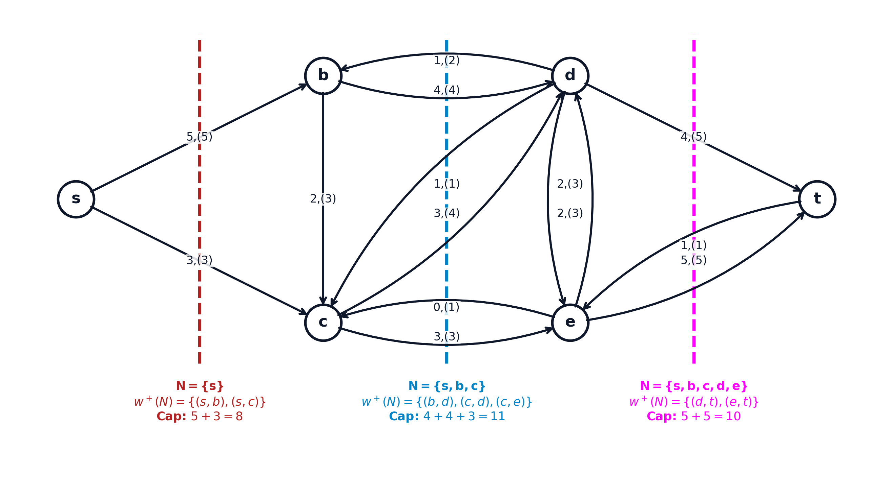{#fig-red-cortes-ejemplo fig-align="center" width="85%"}

**Criterio de Optimalidad**:
La capacidad del corte rojo $w^+(N_1)$ es $c(w^+(N_1)) = 8$ y el valor del flujo que transita de $s$ a $t$ es $f_0 = 8$. 

Dado que el valor del flujo alcanza exactamente la capacidad del corte ($f_0 = c(w^+(N_1)) = 8$), por la Proposición de Acotación, este flujo $\mathbf{f}$ es una **solución óptima al problema del flujo máximo** y el corte $w^+(N_1)$ es un **corte de capacidad mínima**.
:::

Como consecuencia inmediata de esta cota superior, si se encuentra una pareja formada por un flujo compatible y un $(s, t)$-corte cuyas magnitudes numéricas coincidan, queda garantizada de forma simultánea la optimalidad global de ambos elementos.

::: {.callout-note title="Corolario: Criterio de optimalidad de flujo máximo y corte mínimo" data-kind="corolario"}
Si un flujo compatible $\mathbf{f}$ y un $(s, t)$-corte $w^+(N)$ que separe $s$ de $t$ son tales que el valor del flujo es igual a la capacidad del corte ($f_0 = c(w^+(N))$), entonces $\mathbf{f}$ es el **flujo máximo** de $s$ a $t$ y $w^+(N)$ es el **corte de mínima capacidad** que separa $s$ de $t$.

*Demostración*:
La demostración es trivial. Dado que por la proposición previa se verifica $f'_0 \le c(w^+(N'))$ para cualquier flujo compatible $\mathbf{f}'$ y cualquier corte $N'$, si $f_0 = c(w^+(N))$, ningún otro flujo compatible $\mathbf{f}'$ puede tener un valor superior a $c(w^+(N)) = f_0$, de lo que se deduce que $\mathbf{f}$ es óptimo. De forma análoga, ningún otro corte $N'$ puede tener una capacidad inferior a $f_0 = c(w^+(N))$, por lo que $w^+(N)$ es un corte de capacidad mínima. $\blacksquare$
:::

Además de caracterizar la optimalidad mediante la coincidencia entre el flujo y el corte, resulta fundamental determinar las condiciones estructurales bajo las cuales el problema del flujo máximo admite una solución finita o, por el contrario, su valor óptimo diverge a infinito.

::: {.callout-note title="Corolario: Existencia y acotación de solución del problema de flujo máximo" data-kind="corolario"}
El problema del flujo máximo de $s$ a $t$ tiene solución finita si y sólo si no existe un camino orientado de $s$ a $t$, denotado por $\mu[s, t]$, con capacidad infinita en todos sus arcos ($c_u = \infty, \, \forall u \in \mu$).

*Demostración*:

* Implicación directa ($\implies$): La demostración es trivial. Si existiera un camino $\mu[s, t]$ formado íntegramente por arcos de capacidad infinita, se podría enviar una cantidad arbitrariamente grande de caudal a través de él sin violar ninguna restricción de capacidad, haciendo que el valor del flujo $f_0 \to \infty$ y el problema no posea solución finita.

* Implicación contraria ($\impliedby$): Supóngase que no existe ningún camino orientado desde $s$ hasta $t$ compuesto únicamente por arcos de capacidad infinita.
  Consideremos el grafo parcial $G' = (V, U_{\infty})$ formado por todos los vértices $V$ y el subconjunto de arcos de capacidad infinita $U_{\infty} = \{u \in U \mid c_u = \infty\}$. Por hipótesis, en $G'$ no existe ningún camino desde $s$ hasta $t$.
  Definimos $N \subset V$ como el conjunto de vértices alcanzables desde la fuente $s$ mediante caminos orientados en el grafo parcial $G'$. Por construcción de $N$:

  1. La fuente pertenece al conjunto ($s \in N$).
  2. El sumidero no pertenece al conjunto ($t \notin N$), pues si $t \in N$ existiría un camino de capacidad infinita de $s$ a $t$ en $G'$.
  
  Consecuentemente, el conjunto de arcos salientes $w^+(N)$ constituye un $(s, t)$-corte válido. Dado que ningún arco de $w^+(N)$ puede pertenecer a $U_{\infty}$ (de lo contrario, sus nodos de destino habrían sido alcanzados en $G'$ e incluidos en $N$), todos los arcos que integran el corte $w^+(N)$ poseen **capacidad finita** ($c_u < \infty$). Por tanto, la capacidad del corte $c(w^+(N)) = \sum_{u \in w^+(N)} c_u$ es finita, lo que garantiza por la Proposición de Acotación ($f_0 \le c(w^+(N)) < \infty$) que el problema del flujo máximo posee solución finita. $\blacksquare$
:::

Los resultados anteriores relacionan fuertemente el flujo máximo y la capacidad de un corte. El siguiente teorema fortalece estas relaciones estableciendo la coincidencia exacta entre el $(s, t)$-flujo máximo y el $(s, t)$-corte de capacidad mínima.

::: {.callout-important title="Teorema: Flujo máximo - corte mínimo (Ford-Fulkerson, 1956)" data-kind="teorema"}
Dada una red de transporte $(G = (V, U), \mathbf{c})$ y fijados dos vértices $s, t \in V$, el $(s, t)$-flujo máximo coincide exactamente con la mínima capacidad de los $(s, t)$-cortes:

$$
\max_{\mathbf{f}} f_0 = \min_{\substack{N \subset V \\ s \in N, \, t \notin N}} c(w^+(N))
$$

*Demostración*:
Sea $\mathbf{f} = (f_0, f_1, \dots, f_m)$ una solución óptima del problema del flujo máximo de $s$ a $t$. Se considera la red ampliada equipada con el arco de retorno ficticio $u_0 = (t, s)$.

Para aplicar la dicotomía de Minty, se utiliza la siguiente regla para colorear los arcos de la red:

* **Arco de retorno $u_0 = (t, s)$**: **Negro** ($N$).
* Arco $u \in U$ con $f_u = 0, c_u = 0$: **Sin colorear** ($0$) (no admite incremento ni reducción).
* Arco $u \in U$ con $f_u = 0 < c_u$: **Negro** ($N$) (solo se puede incrementar el flujo).
* Arco $u \in U$ con $0 < f_u = c_u$: **Verde** ($V$) (solo se puede reducir el flujo).
* Arco $u \in U$ con $0 < f_u < c_u$: **Rojo** ($R$) (se puede aumentar y reducir el flujo).

Es decir, en los arcos negros solo se puede incrementar el flujo, en los verdes reducir, y en los rojos aumentar y reducir. En los no coloreados no se puede incrementar ni reducir.

A continuación, se inicia un proceso de marcado (o etiquetado) de vértices:

1. Sea $S \subset V$ el conjunto de vértices marcados. Inicialmente $S = \{s\}$.
2. El resto de vértices se marcan en función de los arcos que inciden en ellos. Para cada arco $(i, j) \in U$:
   * Si $i$ está marcado ($i \in S$), $j$ no está marcado ($j \notin S$) y el arco $(i, j)$ es **negro** o **rojo**: marcar $j$.
   * Si $j$ está marcado ($j \in S$), $i$ no está marcado ($i \notin S$) y el arco $(i, j)$ es **verde** o **rojo**: marcar $i$.
3. Repetir el proceso iterativamente hasta marcar el máximo número posible de vértices.

Al finalizar la propagación de marcas, se analizan los dos casos posibles:

* **Si al final el vértice sumidero $t$ resultara marcado ($t \in S$)**: El arco de retorno $(t, s)$ pertenecería a un ciclo elemental coloreado $N/V/R$. Reconstruyendo la trayectoria de antecedentes, este ciclo definiría una cadena incremental $\mu[s, t]$ a lo largo de la cual se podrían añadir $\epsilon > 0$ unidades de flujo, incrementando el valor del flujo de retorno a $f_0 + \epsilon$. Pero dado que $\mathbf{f}$ es una solución óptima y $f_0$ es máximo, este ciclo **no puede existir**.

* **Por tanto, el vértice sumidero $t$ no resulta marcado ($t \notin S$)**: Por el Lema de Coloración de Minty, el arco negro de retorno $(t, s)$ pertenece necesariamente al **cociclo elemental** $w(S)$ asociado a los vértices marcados $S = N$. Como $s \in N$ y $t \notin N$, este cociclo define un $(s, t)$-corte válido.

La capacidad de este corte viene determinada exclusivamente por los arcos que lo componen. Por las reglas de marcado:

* Los arcos salientes del corte $w^+(N)$ son exclusivamente verdes (están a **capacidad máxima**, $f_u = c_u$), pues si alguno fuera negro o rojo habría permitido marcar su nodo de destino en el paso anterior.
* Los arcos entrantes del corte $w^-(N)$ (distintos de $u_0$) son exclusivamente negros (tienen **flujo nulo**, $f_u = 0$), pues si alguno fuera verde o rojo habría permitido marcar su nodo de origen.

Aplicando la ley de conservación de flujo sobre el subconjunto de nodos marcados $N$:

$$
\sum_{u \in w^+(N)} f_u - \sum_{\substack{u \in w^-(N) \\ u \neq (t,s)}} f_u = f_0
$$

Dado que los arcos salientes se encuentran a máxima capacidad ($f_u = c_u$) y los entrantes a flujo nulo ($f_u = 0$), se concluye:

$$
c(w^+(N)) = \sum_{u \in w^+(N)} c_u = \sum_{u \in w^+(N)} f_u = f_0 \quad \blacksquare
$$
:::

La relación entre el valor del flujo máximo y el corte de capacidad mínima no queda limitada a una coincidencia numérica puntual. Los problemas de encontrar el flujo máximo que puede circular por una red y el corte de mínima capacidad son **problemas duales** entre sí dentro del marco de la Programación Lineal.

::: {.callout-tip title="Ejemplo: Aplicación de las reglas de coloración de Minty en el flujo óptimo" data-kind="ejemplo" collapse="true"}
Considérese la red de 6 nodos $V = \{s, 1, 2, 3, 4, t\}$ equipada con el arco de retorno $u_0 = (t, s)$ y un flujo circulante de valor $f_0 = 10$, ilustrada en la @fig-minty-demostracion-red59.

1. **Coloración de arcos según el flujo actual**:
   * Arco de retorno $u_0 = (t, s)$ con $f_0 = 10, c_0 = \infty$: **Negro** (admite aumento).
   * Arco $(3, 1)$ con $f_{31} = 0, c_{31} = 5$: **Negro** ($0 = f_{31} < c_{31}$).
   * Arcos a capacidad máxima: $(1,2)$ con $4,(4)$, $(1,4)$ con $1,(1)$, $(3,4)$ con $5,(5)$, y $(4,2)$ con $2,(2)$: **Verdes** ($0 < f_u = c_u$).
   * Arcos a capacidad intermedia: $(s,1)$ con $5,(6)$, $(s,3)$ with $5,(7)$, $(2,t)$ con $6,(7)$, y $(4,t)$ con $4,(6)$: **Rojos** ($0 < f_u < c_u$).

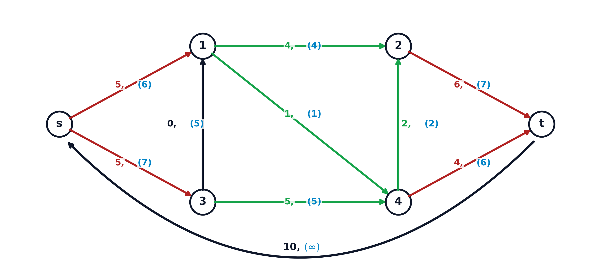{#fig-minty-demostracion-red59 fig-align="center" width="75%"}

2. **Evaluación de la propagación del marcado de vértices**:
   * Iniciamos marcando el origen: $S = \{s\}$.
   * Desde $s$, a través de los arcos rojos $(s,1)$ y $(s,3)$, marcamos los nodos $1$ y $3$: $S = \{s, 1, 3\}$.
   * Desde los nodos marcados $1$ y $3$, los arcos salientes $(1,2)$, $(1,4)$ y $(3,4)$ son verdes (no permiten marcar $2$ ni $4$), y los arcos entrantes a $1$ y $3$ son negros (no permiten marcar nodos adicionales). El marcado finaliza con $S = \{s, 1, 3\}$.
   * Dado que el sumidero $t \notin S$, el proceso no encuentra ningún camino incremental a $t$. El conjunto de nodos marcados $N = \{s, 1, 3\}$ define un $(s, t)$-corte cuyos arcos salientes $w^+(N) = \{(1,2), (1,4), (3,4)\}$ son todos verdes y suman capacidad $C(w^+(N)) = 4 + 1 + 5 = 10 = f_0$, verificando la optimalidad.

3. **Análisis de sensibilidad ante modificaciones de capacidad**:
   Si la capacidad del arco $(1,4)$ se eleva a $c_{14} = 6$ mientras el flujo se mantiene en $f_{14} = 1$ (como se ilustra en la @fig-minty-demostracion-red62), el arco $(1,4)$ pasa de verde a **rojo** ($0 < 1 < 6$). Al ser rojo, la propagación desde el nodo marcado $1$ permite marcar el nodo $4$, y desde $4$, el arco rojo $(4,t)$ permite marcar finalmente el sumidero $t$. Alcanzar el nodo $t$ indica que el flujo $f_0 = 10$ ya no es óptimo y permite enviar flujo adicional a través de la cadena incremental $s \to 1 \to 4 \to t$.

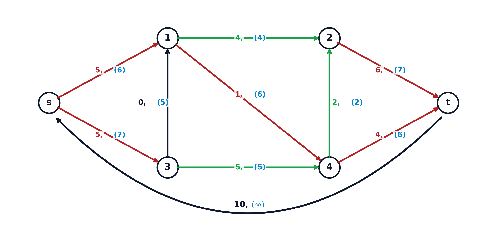{#fig-minty-demostracion-red62 fig-align="center" width="75%"}
:::

### Algoritmo de Ford-Fulkerson

El **algoritmo de Ford-Fulkerson**, publicado en 1956 por L. R. Ford (1927-2017) y D. R. Fulkerson (1924-1976), es el método clásico fundamental de la teoría de flujos. Se conoce también como **algoritmo del camino de aumento**, ya que su idea principal consiste en aumentar progresivamente el caudal de los flujos a lo largo de caminos orientados desde la fuente $s$ hasta el sumidero $t$.

Aplicando la regla de coloración de arcos vista en la demostración del Teorema de Ford-Fulkerson y etiquetando/marcando arcos según el Lema de Minty, es posible determinar de forma directa si un flujo es óptimo o no. Además, en caso de que no sea óptimo, este procedimiento identifica explícitamente un ciclo o camino por el que es posible incrementar el flujo circulante.

::: {.callout-note title="Definición: Grafo incremental (Red residual)" data-kind="definicion"}
Planteado un problema de flujo máximo de $s$ a $t$ en la red de transporte $(G = (V, U), \mathbf{c})$ y dado un flujo compatible $\mathbf{f}$, se define el **grafo incremental** (o **red residual**) $G(\mathbf{f}) = (V, U(\mathbf{f}))$ como el digrafo en el que el conjunto de arcos $U(\mathbf{f})$ se construye para todo $u = (i, j) \in U$ según:

$$
\begin{cases}
u^+ = (i, j) \in U(\mathbf{f}) \text{ con peso } \ell_{u^+} = c_u - f_u, & \text{si } f_u < c_u \\
u^- = (j, i) \in U(\mathbf{f}) \text{ con peso } \ell_{u^-} = f_u, & \text{si } f_u > 0
\end{cases}
$$

* **Arcos directos $u^+$**: Se añade un arco al grafo incremental en el mismo sentido que el arco de la red cuando el flujo del arco en la red se puede incrementar ($f_u < c_u$). Se le asocia un peso $\ell_{u^+} = c_u - f_u$.
* **Arcos inversos $u^-$**: Se añade un arco al grafo incremental en sentido contrario al del arco de la red cuando el flujo del arco en la red se puede reducir ($f_u > 0$). Se le asocia un peso $\ell_{u^-} = f_u$.

*Propiedades*:

1. Estas operaciones no son excluyentes: si un arco satisface $0 < f_u < c_u$, genera tanto un arco directo $u^+$ como un arco inverso $u^-$ en $G(\mathbf{f})$.
2. El arco ficticio de retorno $u_0 = (t, s)$ **no se incluye** en el grafo incremental.
3. A cada arco de $U(\mathbf{f})$ se le asocia una cantidad $\ell_u$ que representa el flujo máximo que admite el arco en cuestión.
:::

::: {.callout-tip title="Ejemplo: Construcción del grafo incremental asociado a una red de transporte" data-kind="ejemplo" collapse="true"}
Considérese la red de transporte de 6 nodos $V = \{s, 2, 3, 4, 5, t\}$ ilustrada en la @fig-red-incremental-ejemplo (izquierda), equipada con un flujo compatible $\mathbf{f}$ de valor $f_0 = 3$.

Para construir su correspondiente grafo incremental $G(\mathbf{f})$ (derecha):

* Por cada arco con $f_u < c_u$ (por ejemplo, $(s, 2)$ con $f=1, c=3$), añadimos el arco directo $(s, 2)$ con peso $\ell = 3 - 1 = 2$.
* Por cada arco con $f_u > 0$ (por ejemplo, $(s, 2)$ con $f=1$), añadimos el arco inverso $(2, s)$ con peso $\ell = 1$.
* Los arcos a capacidad máxima ($f_u = c_u$, como $(s, 3)$ con $2,(2)$) solo generan arco inverso $(3, s)$ con peso $\ell = 2$.
* Los arcos con flujo nulo ($f_u = 0$, como $(3, 2)$ con $0,(1)$) solo generan arco directo $(3, 2)$ con peso $\ell = 1$.

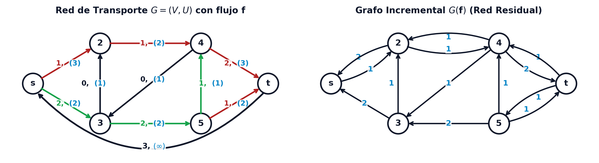{#fig-red-incremental-ejemplo fig-align="center" width="95%"}
:::

La clave del algoritmo radica en que un flujo compatible $\mathbf{f}$ admite un incremento en su valor $f_0$ **si y sólo si existe un camino orientado $\mu[s, t]$ desde la fuente $s$ hasta el sumidero $t$ en el grafo incremental $G(\mathbf{f})$**.

El procedimiento sistemático para resolver cualquier problema de flujo máximo mediante la red residual se resume en la siguiente especificación paso a paso:

::: {.callout-note title="Esquema: Algoritmo de Ford-Fulkerson por Red Incremental" data-kind="esquema"}
* **Paso 1 (Inicialización)**: Hacer $k = 0$. Determinar un flujo inicial compatible $\mathbf{f}^0 = (f_0^0, f_1^0, \dots, f_m^0)^T$ (típicamente el flujo trivial nulo $\mathbf{f}^0 = \mathbf{0}$).

* **Paso 2 (Construcción y Búsqueda)**: Definir la red incremental $G(\mathbf{f}^k) = (V, U(\mathbf{f}^k))$. Buscar un camino orientado $\mu^k$ desde $s$ hasta $t$ en $G(\mathbf{f}^k)$.
  * **Si no existe el camino**: **PARAR**. El flujo actual $\mathbf{f}^k$ es **óptimo** (y el conjunto de nodos alcanzables desde $s$ en $G(\mathbf{f}^k)$ define el **corte de capacidad mínima**).
  * **En caso contrario**: Ir al Paso 3.

* **Paso 3 (Aumento de Flujo y Actualización)**:
  Calcular la capacidad del cuello de botella en la cadena incremental:
  $$ \epsilon^k = \min \{\ell_u \mid u \in \mu^k, \, u \in U(\mathbf{f}^k)\} $$
  Para cada arco $u \in U$ de la red de transporte original:
  $$
  f_u^{k+1} = \begin{cases}
  f_u^k + \epsilon^k, & \text{si } u \in \mu^k(+) \text{ (arco directo en la red)} \\
  f_u^k - \epsilon^k, & \text{si } u \in \mu^k(-) \text{ (arco inverso en la red)} \\
  f_u^k, & \text{si } u \notin \mu^k(+) \cup \mu^k(-) \text{ y } u \neq (t, s)
  \end{cases}
  $$
  E incrementar el valor del flujo circulante por el arco ficticio de retorno $u_0 = (t, s)$:
  $$ f_0^{k+1} = f_0^k + \epsilon^k $$
  Hacer $k \leftarrow k + 1$ y regresar al Paso 2.
:::

::: {.callout-tip title="Ejemplo: Resolución completa paso a paso del Algoritmo de Ford-Fulkerson desde flujo nulo" data-kind="ejemplo" collapse="true"}
Considérese la red de 6 nodos $V = \{s, 2, 3, 4, 5, t\}$ con fuente $s$, sumidero $t$ y capacidades de arcos asociadas:

$$
c_{s2}=3, \quad c_{s3}=2, \quad c_{32}=1, \quad c_{24}=2, \quad c_{43}=1, \quad c_{35}=2, \quad c_{54}=1, \quad c_{4t}=3, \quad c_{5t}=2
$$

Se aplica el algoritmo de Ford-Fulkerson por red incremental partiendo del flujo trivial nulo $\mathbf{f}^0 = \mathbf{0}$. La traza completa de la resolución mediante la red residual y el flujo resultante se ilustra paso a paso en la @fig-ford-fulkerson-completo-animado:

**Iteración 1 ($k=0$)**:

* **Paso 1 (Inicialización)**: Flujos iniciales $f_u^0 = 0$ para todo arco $u \in U$, con caudal de retorno $f_0^0 = 0$.
* **Paso 2 (Red Incremental $G(\mathbf{f}^0)$)**: Como todos los flujos son nulos, la red residual contiene únicamente los arcos directos $u^+$ con capacidades residuales $\ell_{u^+} = c_u$.
* **Búsqueda de Camino Aumentante**: Se detecta la trayectoria orientada $\mu_1 = (s \to 2 \to 4 \to t)$.
* **Cálculo del Cuello de Botella**:
  $$ \epsilon_1 = \min \{\ell_{s2}, \ell_{24}, \ell_{4t}\} = \min \{3, 2, 3\} = 2 $$

* **Paso 3 (Actualización de Flujos $\mathbf{f}^1$)**:
  * $f_{s2}^1 = 0 + 2 = 2$
  * $f_{24}^1 = 0 + 2 = 2$ (el arco $(2,4)$ queda **saturado**, pasando a verde)
  * $f_{4t}^1 = 0 + 2 = 2$
  * Caudal circulante de retorno: $f_0^1 = 0 + 2 = 2$.

**Iteración 2 ($k=1$)**:

* **Paso 2 (Red Incremental $G(\mathbf{f}^1)$)**:
  * Al estar saturado el arco $(2,4)$, en $G(\mathbf{f}^1)$ solo existe el arco inverso $(4,2)$ con peso $\ell = 2$.
  * El arco $(s,2)$ admite incremento $\ell = 3 - 2 = 1$ e inverso $(2,s)$ con peso $\ell = 2$.
* **Búsqueda de Camino Aumentante**: Se detecta la trayectoria orientada $\mu_2 = (s \to 3 \to 5 \to t)$.
* **Cálculo del Cuello de Botella**:
  $$ \epsilon_2 = \min \{\ell_{s3}, \ell_{35}, \ell_{5t}\} = \min \{2, 2, 2\} = 2 $$

* **Paso 3 (Actualización de Flujos $\mathbf{f}^2$)**:
  * $f_{s3}^2 = 0 + 2 = 2$ (arco **saturado**, verde)
  * $f_{35}^2 = 0 + 2 = 2$ (arco **saturado**, verde)
  * $f_{5t}^2 = 0 + 2 = 2$ (arco **saturado**, verde)
  * Caudal circulante de retorno: $f_0^2 = 2 + 2 = 4$.

**Iteración 3 ($k=2$) y Criterio de Parada**:

* **Paso 2 (Red Incremental $G(\mathbf{f}^2)$)**:
  * Al construir $G(\mathbf{f}^2)$, todos los arcos salientes desde la fuente $s$ a través de $3$ están saturados. El único nodo alcanzable desde $s$ mediante caminos orientados en $G(\mathbf{f}^2)$ es el nodo $2$.
  * **Conclusión de Parada**: No existe ningún camino orientado desde $s$ hasta $t$ en la red residual $G(\mathbf{f}^2)$. Por tanto, el flujo $\mathbf{f}^2$ es el **flujo máximo** con valor $f_0^* = 4$.

**Corte de Capacidad Mínima Resultante**:

* El subconjunto de nodos alcanzables desde la fuente $s$ en la red residual final es $N = \{s, 2\}$.
* El corte de capacidad mínima asociado es $w^+(N) = \{(s,3), (2,4)\}$.
* Capacidad del corte:
  $$ C(w^+(N)) = c_{s3} + c_{24} = 2 + 2 = 4 = f_0^* $$

::: {.content-visible when-format="html"}
::: {#fig-ford-fulkerson-completo-animado}
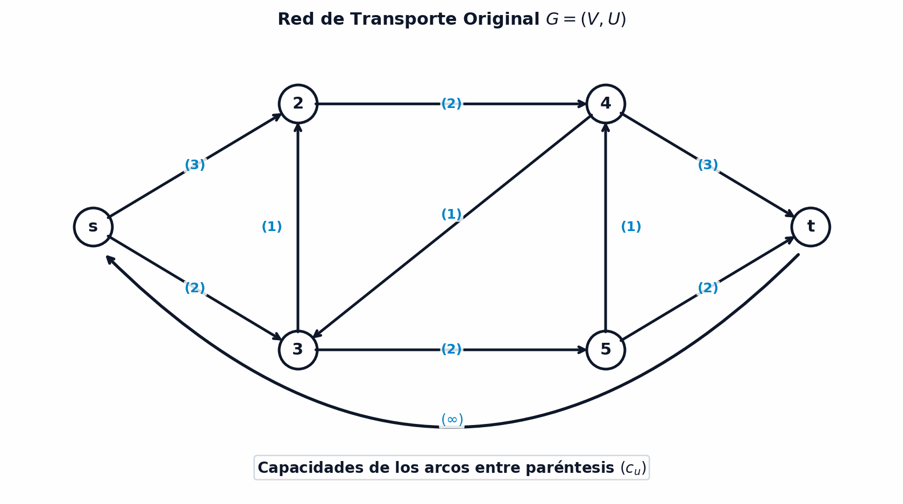

<dialog id="ford-fulkerson-completo-dialog" style="border:none; border-radius:10px; padding:0; width:88vw; max-width:88vw; height:84vh; max-height:84vh; box-shadow:0 20px 60px rgba(0,0,0,0.55); overflow:hidden; background:#fff;">
  <button onclick="document.getElementById('ford-fulkerson-completo-dialog').close()"
          style="position:absolute; top:10px; right:14px; z-index:10; background:rgba(15,23,42,0.6); color:#fff; border:none; border-radius:50%; width:30px; height:30px; font-size:17px; cursor:pointer; line-height:1; display:flex; align-items:center; justify-content:center;">×</button>
  <iframe src="images/ford_fulkerson_completo_player.html" width="100%" height="100%" style="border:none; display:block;" scrolling="no"></iframe>
</dialog>

Ejecución interactiva completa de 10 fotogramas del Algoritmo de Ford-Fulkerson paso a paso, ilustrando las iteraciones $k=0, 1, 2$, la evolución de la red residual $G(\mathbf{f})$, la parada del algoritmo y la obtención del corte de capacidad mínima $N=\{s, 2\}$.
:::
:::

**Código de colores de los arcos y nodos en la representación gráfica**:

* **Arcos en naranja ($\textcolor{orange}{\rightarrow}$)**: Indican los arcos que integran el **camino aumentante** seleccionado en la iteración actual.
* **Arcos en verde ($\textcolor{forestgreen}{\rightarrow}$)**: Indican arcos que han quedado **saturados** a su capacidad máxima ($f_u = c_u$).
* **Arcos en rojo ($\textcolor{firebrick}{\rightarrow}$)**: Indican arcos por los que circula un **flujo parcial no nulo** ($0 < f_u < c_u$).
* **Arcos en negro ($\rightarrow$)**: Indican arcos con **flujo nulo** ($f_u = 0$) o no transitados.
* **Arcos/Nodos en azul ($\textcolor{blue}{\rightarrow}$)**: En la iteración de parada, destacan los nodos alcanzables $N = \{s, 2\}$ y los arcos que componen el **corte de capacidad mínima** $w^+(N)$.
:::

Una vez analizada la fundamentación teórica y la traza explícita mediante la red residual $G(\mathbf{f})$, en la práctica manual o computacional directa resulta ineficiente reconstruir e ilustrar la estructura del grafo incremental en cada iteración. Por esta razón, Ford y Fulkerson diseñaron un procedimiento simplificado de implementación directa denominado **algoritmo por etiquetado de vértices**, que opera sobre los nodos de la red original mediante marcas dinámicas.

### Algoritmo de Ford-Fulkerson por etiquetado de vértices

El algoritmo de Ford-Fulkerson se puede plantear de forma más sencilla e intuitiva sin necesidad de construir explícitamente el grafo incremental $G(\mathbf{f})$ en cada iteración. Para ello, se emplea una **regla de etiquetado dinámico de vértices** que opera directamente sobre la red de transporte original.

Inicialmente se asigna una etiqueta a la fuente $s$, $\text{Etiqueta}(s) = (\text{–}, \, \textcolor{dodgerblue}{\delta_s = +\infty})$, y paso a paso se propagan marcas y etiquetas al resto de vértices no explorados.

::: {.callout-note title="Definición: Estructura de las etiquetas de vértices" data-kind="definicion"}
La etiqueta asignada a un nodo $j$ presenta dos componentes diferenciadas:

$$
\text{Etiqueta}(j) = (\textcolor{darkgray}{\pm i}, \, \textcolor{dodgerblue}{\delta_j})
$$

1. **Procedencia ($\textcolor{darkgray}{\pm i}$)**: Indica el nodo antecedente $i$ (ya etiquetado) que se utiliza para etiquetar al nodo $j$. El signo del antecedente determina la orientación del tránsito:
   * **$\textcolor{forestgreen}{+i}$ (Arco directo $(i, j)$)**: El arco está dirigido de $i$ hacia $j$ y su flujo actual es inferior a su capacidad ($f_{ij} < c_{ij}$). Permite incrementar flujo.
   * **$\textcolor{firebrick}{-i}$ (Arco inverso $(j, i)$)**: El arco está dirigido de $j$ hacia $i$ y su flujo actual es positivo ($f_{ji} > 0$). Permite reducir flujo.

2. **Capacidad disponible ($\textcolor{dodgerblue}{\delta_j}$)**: Indica el valor máximo de flujo incremental que es posible hacer llegar desde la fuente $s$ hasta el nodo $j$ a través de la cadena de antecedentes iniciada en $i$.
:::

::: {.callout-note title="Definición: Reglas formales de etiquetado" data-kind="definicion"}
Sea $i \in V$ un nodo previamente etiquetado con etiqueta $(\cdot, \, \textcolor{dodgerblue}{\delta_i})$ y sea $j \in V$ un nodo adyacente aún **no etiquetado**:

1. **Regla 1 (Arco Directo $(i, j) \in U$)**:
   Si $f_{ij} < c_{ij}$, se etiqueta el nodo $j$ como $(\textcolor{forestgreen}{+i}, \, \textcolor{dodgerblue}{\delta_j})$, donde el cuello de botella se actualiza como:
   $$ \textcolor{dodgerblue}{\delta_j} = \min \left\{ \textcolor{dodgerblue}{\delta_i}, \, c_{ij} - f_{ij} \right\} $$

2. **Regla 2 (Arco Inverso $(j, i) \in U$)**:
   Si $f_{ji} > 0$, se etiqueta el nodo $j$ como $(\textcolor{firebrick}{-i}, \, \textcolor{dodgerblue}{\delta_j})$, donde la capacidad de reducción se calcula como:
   $$ \textcolor{dodgerblue}{\delta_j} = \min \left\{ \textcolor{dodgerblue}{\delta_i}, \, f_{ji} \right\} $$

Un vértice se considera **explorado** cuando está etiquetado o bien no es posible etiquetar a ninguno de sus nodos adyacentes no etiquetados.
:::

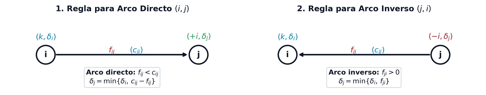{#fig-reglas-etiquetado-ford-fulkerson fig-align="center" width="85%"}

Como se ilustra en la @fig-reglas-etiquetado-ford-fulkerson, la propagación de marcas desde la fuente $s$ explora secuencialmente la red:

* **Si al final del proceso el sumidero $t$ resulta etiquetado**: Se ha alcanzado con éxito el destino a través de una cadena de aumento $\mu[s, t]$. El valor de la etiqueta del sumidero $\Delta = \textcolor{dodgerblue}{\delta_t}$ determina la cantidad exacta en la que se debe incrementar el flujo circulante $f_0$.
* **Si no es posible etiquetar el sumidero $t$ ($t \notin S$)**: **PARAR**. Se ha alcanzado el **flujo máximo** $f_0^*$. El conjunto de nodos etiquetados $N = S$ define de forma inmediata el **corte de capacidad mínima** $w^+(N)$.

::: {.callout-note title="Esquema: Algoritmo de Ford-Fulkerson por Etiquetado de Vértices" data-kind="esquema"}
1. **Paso 1 (Inicialización)**: Asignar un flujo inicial compatible $\mathbf{f} = \mathbf{0}$ (o un flujo compatible conocido). Etiquetar la fuente $s$ con la marca inicial $(\text{–}, \, \textcolor{dodgerblue}{\delta_s = +\infty})$.

2. **Paso 2 (Evaluación de Exploración)**: ¿Todos los vértices etiquetados han sido totalmente explorados?
   * **SÍ**: Ir al **Paso 6**.
   * **NO**: Ir al **Paso 3**.

3. **Paso 3 (Propagación de Etiquetas)**: Etiquetar todos los vértices adyacentes posibles mediante la **Regla 1** (arcos directos) y la **Regla 2** (arcos inversos).

4. **Paso 4 (Verificación del Sumidero)**: ¿Ha sido etiquetado el sumidero $t$?
   * **SÍ**: Fijar la cantidad de aumento $\Delta = \textcolor{dodgerblue}{\delta_t}$ e ir al **Paso 5**.
   * **NO**: Regresar al **Paso 2**.

5. **Paso 5 (Modificación del Flujo Actual)**:
   1. Inicializar el puntero de rastreo en el sumidero: $k \leftarrow t$.

   2. Si la etiqueta del vértice $k$ es $(\textcolor{forestgreen}{+i}, \, \delta_k)$, incrementar el flujo del arco directo:
      $$ f_{ik} \leftarrow f_{ik} + \Delta $$

   3. Si la etiqueta del vértice $k$ es $(\textcolor{firebrick}{-i}, \, \delta_k)$, reducir el flujo del arco inverso:
      $$ f_{ki} \leftarrow f_{ki} - \Delta $$

   4. Retroceder al nodo antecedente: $k \leftarrow i$. ¿Es $i = s$?
      * **SÍ**: Incrementar el flujo de retorno $f_0 \leftarrow f_0 + \Delta$, borrar todas las etiquetas de los nodos excepto la de la fuente $s$ $(\text{–}, \, \textcolor{dodgerblue}{+\infty})$ e ir al **Paso 2**.
      * **NO**: Regresar al **Subpaso 5.2**.

6. **Paso 6 (Optimalidad y Parada)**: El flujo actual $\mathbf{f}^*$ es el **flujo máximo**. El subconjunto de vértices que han quedado etiquetados $N = S$ define el **corte de capacidad mínima** $w^+(N)$.
:::

::: {.callout-tip title="Ejemplo: Traza paso a paso del Algoritmo de Ford-Fulkerson por etiquetado de vértices" data-kind="ejemplo" collapse="true"}
Considérese la red de transporte de 8 nodos $V = \{s, 1, 2, 3, 4, 5, 6, t\}$ equipada con las capacidades entre paréntesis $c_u$:

* $c_{s1} = 7$, $c_{s2} = 2$, $c_{12} = 1$, $c_{13} = 5$, $c_{32} = 3$, $c_{34} = 2$, $c_{35} = 4$, $c_{24} = 4$, $c_{46} = 5$, $c_{56} = 3$, $c_{5t} = 3$, $c_{6t} = 6$.

Se aplica el algoritmo de Ford-Fulkerson por etiquetado partiendo del flujo nulo inicial $\mathbf{f}^0 = \mathbf{0}$ ($f_0^0 = 0$). La propagación dinámica de marcas, la actualización de flujos y la delimitación del corte mínimo se ilustran paso a paso en la @fig-ford-fulkerson-etiquetado-animado:

**Iteración 1**:

* **Propagación de etiquetas**:
  * Etiqueta inicial en el origen: $\text{Etiqueta}(s) = (\text{–}, \, \textcolor{dodgerblue}{\delta_s = +\infty})$.
  * Desde $s$: etiquetar $1$ con $(\textcolor{forestgreen}{+s}, \, \textcolor{dodgerblue}{7})$ y $2$ con $(\textcolor{forestgreen}{+s}, \, \textcolor{dodgerblue}{2})$.
  * Desde $2$: etiquetar $4$ con $(\textcolor{forestgreen}{+2}, \, \textcolor{dodgerblue}{\min\{2, 4\} = 2})$.
  * Desde $4$: etiquetar $6$ con $(\textcolor{forestgreen}{+4}, \, \textcolor{dodgerblue}{\min\{2, 5\} = 2})$.
  * Desde $6$: etiquetar el sumidero $t$ con $(\textcolor{forestgreen}{+6}, \, \textcolor{dodgerblue}{\min\{2, 6\} = 2})$.
* **Camino aumentante**: $\mu_1 = (s \to 2 \to 4 \to 6 \to t)$ con incremento de flujo $\Delta_1 = \textcolor{dodgerblue}{\delta_t = 2}$.
* **Actualización de flujos ($\mathbf{f}^1$)**:
  * $f_{s2} \leftarrow 0 + 2 = 2$ (el arco $(s,2)$ queda **saturado**, pasando a verde).
  * $f_{24} \leftarrow 0 + 2 = 2$, $f_{46} \leftarrow 0 + 2 = 2$, $f_{6t} \leftarrow 0 + 2 = 2$.
  * Flujo total circulante de retorno: $f_0^1 = 2$.

**Iteración 2**:

* **Propagación de etiquetas**:
  * Etiqueta inicial en $s$: $(\text{–}, \, \textcolor{dodgerblue}{+\infty})$. (El arco $(s,2)$ está saturado, no permite etiquetar $2$).
  * Desde $s$: etiquetar $1$ con $(\textcolor{forestgreen}{+s}, \, \textcolor{dodgerblue}{7})$.
  * Desde $1$: etiquetar $3$ con $(\textcolor{forestgreen}{+1}, \, \textcolor{dodgerblue}{\min\{7, 5\} = 5})$ y $2$ con $(\textcolor{forestgreen}{+1}, \, \textcolor{dodgerblue}{\min\{7, 1\} = 1})$.
  * Desde $3$: etiquetar $5$ con $(\textcolor{forestgreen}{+3}, \, \textcolor{dodgerblue}{\min\{5, 4\} = 4})$ y $4$ con $(\textcolor{forestgreen}{+3}, \, \textcolor{dodgerblue}{\min\{5, 2\} = 2})$.
  * Desde $5$: etiquetar el sumidero $t$ con $(\textcolor{forestgreen}{+5}, \, \textcolor{dodgerblue}{\min\{4, 3\} = 3})$.
* **Camino aumentante**: $\mu_2 = (s \to 1 \to 3 \to 5 \to t)$ con incremento de flujo $\Delta_2 = \textcolor{dodgerblue}{\delta_t = 3}$.
* **Actualización de flujos ($\mathbf{f}^2$)**:
  * $f_{s1} \leftarrow 0 + 3 = 3$, $f_{13} \leftarrow 0 + 3 = 3$, $f_{35} \leftarrow 0 + 3 = 3$.
  * $f_{5t} \leftarrow 0 + 3 = 3$ (el arco $(5,t)$ queda **saturado**, pasando a verde).
  * Flujo total circulante de retorno: $f_0^2 = 2 + 3 = 5$.

**Iteración 5**:

* **Propagación de etiquetas**:
  * Etiqueta inicial en $s$: $(\text{–}, \, \textcolor{dodgerblue}{+\infty})$.
  * Desde $s$: el arco $(s,2)$ está saturado ($f_{s2} = 2 = c_{s2}$). Etiquetar $1$ con $(\textcolor{forestgreen}{+s}, \, \textcolor{dodgerblue}{7 - 5 = 2})$.
  * Desde $1$: el arco $(1,3)$ está saturado ($f_{13} = 5 = c_{13}$). Mediante $(1,2)$ etiquetamos $2$ con $(\textcolor{forestgreen}{+1}, \, \textcolor{dodgerblue}{\min\{2, 1\} = 1})$.
  * Desde $2$: mediante $(2,4)$ etiquetamos $4$ con $(\textcolor{forestgreen}{+2}, \, \textcolor{dodgerblue}{\min\{1, 4 - 2\} = 1})$.
  * Desde $4$: etiquetar $6$ con $(\textcolor{forestgreen}{+4}, \, \textcolor{dodgerblue}{\min\{1, 5 - 3\} = 1})$.
  * Desde $6$: etiquetar el sumidero $t$ con $(\textcolor{forestgreen}{+6}, \, \textcolor{dodgerblue}{\min\{1, 6 - 4\} = 1})$.
* **Camino aumentante**: $\mu_5 = (s \to 1 \to 2 \to 4 \to 6 \to t)$ con incremento de flujo $\Delta_5 = \textcolor{dodgerblue}{\delta_t = 1}$.
* **Actualización de flujos ($\mathbf{f}^5$)**:
  * $f_{s1} \leftarrow 5 + 1 = 6$.
  * $f_{12} \leftarrow 0 + 1 = 1$ (el arco $(1,2)$ queda **saturado**, pasando a verde).
  * $f_{24} \leftarrow 2 + 1 = 3$, $f_{46} \leftarrow 3 + 1 = 4$, $f_{6t} \leftarrow 4 + 1 = 5$.
  * Flujo total circulante de retorno: $f_0^5 = 7 + 1 = 8$.

**Iteración 6 (Criterio de Parada)**:

* **Propagación de etiquetas**:
  * Etiqueta inicial en $s$: $(\text{–}, \, \textcolor{dodgerblue}{+\infty})$.
  * Desde $s$: el arco $(s,2)$ está saturado. Etiquetar $1$ con $(\textcolor{forestgreen}{+s}, \, \textcolor{dodgerblue}{7 - 6 = 1})$.
  * Desde $1$: el arco $(1,3)$ está saturado ($f_{13} = 5 = c_{13}$) y el arco $(1,2)$ está saturado ($f_{12} = 1 = c_{12}$). No es posible etiquetar ningún nodo adicional desde $1$.
  * **Fin del algoritmo**: El sumidero $t$ **no resulta etiquetado** ($t \notin S$).

**Solución Óptima y Corte de Capacidad Mínima**:

* **Valor del flujo máximo**: $f_0^* = 8$.
* **Subconjunto de vértices etiquetados**: $N = \{s, 1\}$.
* **Corte de capacidad mínima**: $w^+(N) = \{(s, 2), (1, 3), (1, 2)\}$.
* **Capacidad del corte**:
  $$ C(w^+(N)) = c_{s2} + c_{13} + c_{12} = 2 + 5 + 1 = 8 = f_0^* $$

::: {.content-visible when-format="html"}
::: {#fig-ford-fulkerson-etiquetado-animado}
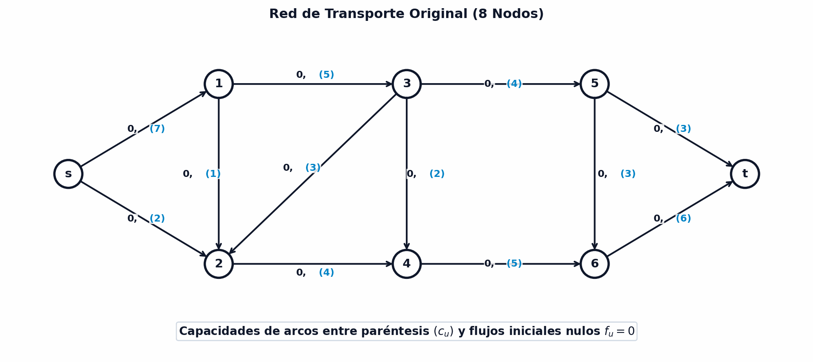

<dialog id="ford-fulkerson-etiquetado-dialog" style="border:none; border-radius:10px; padding:0; width:88vw; max-width:88vw; height:84vh; max-height:84vh; box-shadow:0 20px 60px rgba(0,0,0,0.55); overflow:hidden; background:#fff;">
  <button onclick="document.getElementById('ford-fulkerson-etiquetado-dialog').close()"
          style="position:absolute; top:10px; right:14px; z-index:10; background:rgba(15,23,42,0.6); color:#fff; border:none; border-radius:50%; width:30px; height:30px; font-size:17px; cursor:pointer; line-height:1; display:flex; align-items:center; justify-content:center;">×</button>
  <iframe src="images/ford_fulkerson_etiquetado_player.html" width="100%" height="100%" style="border:none; display:block;" scrolling="no"></iframe>
</dialog>

Ejecución animada e interactiva completa de 12 fotogramas del Algoritmo de Ford-Fulkerson por etiquetado de vértices (Iteraciones 1 a 6) ilustrando la propagación de marcas directas/inversas, la convergencia al flujo óptimo $f_0^* = 8$ y la obtención del corte de capacidad mínima $N = \{s, 1\}$.
:::
:::

**Código de colores de los arcos y nodos en la representación gráfica**:

* **Arcos en naranja ($\textcolor{orange}{\rightarrow}$)**: Indican los arcos que integran el **camino aumentante** seleccionado en la iteración actual.
* **Arcos en verde ($\textcolor{forestgreen}{\rightarrow}$)**: Indican arcos que han quedado **saturados** a su capacidad máxima ($f_u = c_u$).
* **Arcos en rojo ($\textcolor{firebrick}{\rightarrow}$)**: Indican arcos por los que circula un **flujo parcial no nulo** ($0 < f_u < c_u$).
* **Arcos en negro ($\rightarrow$)**: Indican arcos con **flujo nulo** ($f_u = 0$) o no transitados.
* **Nodos en naranja ($\textcolor{orange}{\bigcirc}$)**: En la iteración de parada, representan el subconjunto de nodos etiquetados $N = S$ que contienen a la fuente $s$.
* **Nodos en verde ($\textcolor{forestgreen}{\bigcirc}$)**: En la iteración de parada, representan el subconjunto de nodos no alcanzables $V \setminus N$ que contienen al sumidero $t$.
* **Arcos en azul ($\textcolor{blue}{\rightarrow}$)**: En la iteración de parada, destacan los arcos salientes que componen el **corte de capacidad mínima** $w^+(N)$.
:::

La caracterización de la complejidad computacional del algoritmo de Ford-Fulkerson exige analizar cómo influye el método de selección de caminos de aumento en la eficiencia global. La regla de etiquetado dinámico de vértices no solo simplifica la resolución gráfica sobre la red original, sino que computacionalmente equivale a realizar una **búsqueda en anchura (BFS)** por niveles desde la fuente $s$. Esta estrategia de nivelación garantiza seleccionar en cada iteración la cadena de aumento que contiene el menor número de arcos en la red residual.

En redes de transporte equipadas con capacidades enteras ($\mathbf{c} \in \mathbb{Z}_+^m$), el algoritmo genérico de Ford-Fulkerson incrementa el valor del flujo $f_0$ en al menos una unidad entera en cada paso ($\Delta \ge 1$), alcanzando la convergencia en un número de aumentos acotado superiormente por $O(m \cdot f_0^*)$. Sin embargo, en redes arbitrarias con capacidades reales irracionales ($\mathbf{c} \in \mathbb{R}_+^m$), una elección arbitraria de los caminos de aumento (por ejemplo, mediante búsqueda en profundidad, DFS) puede provocar que el algoritmo realice infinitas iteraciones sin converger a la solución óptima. Para evitar este comportamiento anómalo, la selección del camino de menor longitud en arcos mediante BFS proporciona una cota polinomial estricta, como se formaliza en el siguiente teorema.

::: {.callout-important title="Teorema: Cota y complejidad de Edmonds-Karp y Dinitz (1972 / 1970)" data-kind="teorema"}
Si en el algoritmo de Ford-Fulkerson cada incremento de flujo se realiza seleccionando sistemáticamente la cadena de aumento que posea el **menor número de arcos** en el grafo residual $G(\mathbf{f})$ (propiedad garantizada de forma natural por el algoritmo de etiquetado por niveles BFS), el flujo máximo se alcanza en no más de:

$$
\frac{1}{2} m n
$$

incrementos de flujo.

*Demostración*:

* Demostrado independientemente por Y. A. Dinitz en 1970 y J. Edmonds y R. M. Karp en 1972. La clave de la cota reside en que la distancia en número de arcos $d_{G(\mathbf{f})}(s, v)$ desde la fuente $s$ a cualquier vértice $v$ en la red residual es monótonamente no decreciente a lo largo de las iteraciones del algoritmo. Dado que cada arco crítico que se satura incrementa la distancia entre sus extremos en al menos 2 unidades, un mismo arco solo puede saturarse a lo sumo $n/2$ veces. Sumando sobre los $m$ arcos del grafo, el número total de incrementos de flujo queda estrictamente acotado por $O(m n)$. $\blacksquare$
:::

Dado que la propagación de marcas BFS en cada iteración requiere $O(m)$ operaciones, la variante de **Edmonds-Karp** basada en el etiquetado por niveles garantiza una complejidad temporal estrictamente polinomial de $O(m^2 n)$, totalmente independiente de la magnitud de las capacidades y válida incluso para redes con capacidades irracionales.

### Formulación de optimización lineal y dualidad

El problema del flujo máximo en una red de transporte $(G = (V, U), \mathbf{c})$ entre la fuente $s$ y el sumidero $t$ admite una caracterización matemática exacta como un **programa lineal continuo**. Esta formulación en optimización continua no solo permite resolver el problema mediante algoritmos generales como el del Símplex, sino que proporciona una sólida fundamentación algebraica de la equivalencia entre el flujo máximo y el corte de capacidad mínima mediante la **teoría de dualidad**.

Para construir el modelo primal, se definen como variables de decisión los flujos $f_{ij}$ que transitan por cada arco $(i, j) \in U$, junto con el caudal total circulante de retorno $f_0$. La función objetivo busca maximizar este caudal neto $f_0$, sujeto a la ley de conservación del flujo en cada vértice y a las restricciones de capacidad física en los arcos:

$$
\begin{aligned}
\max_{f, f_0} \quad & f_0 \\
\text{sujeto a} \quad & \sum_{j \mid (j, i) \in U} f_{ji} - \sum_{j \mid (i, j) \in U} f_{ij} = \begin{cases} -f_0 & \text{si } i = s \\ 0 & \text{si } i \neq s, t \\ f_0 & \text{si } i = t \end{cases} \quad \forall i \in V \\
& 0 \le f_{ij} \le c_{ij}, \quad \forall (i, j) \in U
\end{aligned}
$$

A partir de este programa primal, la dualidad lineal permite construir un problema dual cuya interpretación física es extraordinariamente reveladora. Asociando una variable dual no restringida en signo $u_i \in \mathbb{R}$ a cada restricción de conservación en el nodo $i \in V$, y una variable dual no negativa $w_{ij} \ge 0$ a cada cota superior de capacidad $f_{ij} \le c_{ij}$ en el arco $(i, j) \in U$, el problema dual busca minimizar el coste ponderado de las capacidades.

::: {.callout-note title="Nota: Eliminación de ecuaciones redundantes y fijación de potencial" data-kind="nota"}
Dado que la suma global de las restricciones de conservación sobre todos los vértices es idénticamente nula ($\sum_{i \in V} b_i = 0$), el sistema contiene exactamente una ecuación linealmente dependiente. Al eliminar la restricción del nodo sumidero $t$ y fijar su potencial de referencia en $u_t = 0$, la condición de dualidad asociada a la variable $f_0$ impone de forma natural $u_s - u_t = 1 \implies u_s = 1$.
:::

Teniendo en cuenta esta normalización de potenciales, el problema dual de programación lineal se formula como:

$$
\begin{aligned}
\min_{u, w} \quad & \sum_{(i,j) \in U} c_{ij} w_{ij} \\
\text{sujeto a} \quad & u_j - u_i + w_{ij} \ge 0, \quad \forall (i, j) \in U \\
& u_s = 1, \quad u_t = 0 \\
& w_{ij} \ge 0, \quad \forall (i, j) \in U \\
& u_i \text{ no restringida}, \quad \forall i \in V
\end{aligned}
$$

::: {.callout-note title="Interpretación combinatoria y dualidad fuerte" data-kind="nota"}
En cualquier solución básica óptima del problema dual, las variables duales adoptan valores discretos binarios $u_i \in \{0, 1\}$ y $w_{ij} \in \{0, 1\}$.

1. **Partición de los vértices**: La variable $u_i$ actúa como función indicadora del subconjunto $N = \{i \in V \mid u_i = 1\}$. Como $u_s = 1$ y $u_t = 0$, la partición $(N, V \setminus N)$ constituye un **corte válido** que separa la fuente del sumidero ($s \in N, t \notin N$).

2. **Identificación de los arcos del corte**: La restricción dual $w_{ij} \ge u_i - u_j$ obliga a que $w_{ij} = 1$ si y solo si $u_i = 1$ y $u_j = 0$, es decir, si el arco $(i, j)$ parte de $N$ y entra en $V \setminus N$. Para el resto de arcos, la minimización de la función objetivo fija $w_{ij} = 0$.

3. **Equivalencia algebraica por dualidad fuerte**: Por el **Teorema de Dualidad Fuerte de la Programación Lineal**, el valor óptimo del modelo primal $\max f_0^*$ coincide exactamente con el valor óptimo del modelo dual $\min \sum c_{ij} w_{ij} = C(w^+(N))$. Esto demuestra algebraicamente que **el Teorema de Flujo Máximo - Corte Mínimo es la manifestación directa de la dualidad fuerte en optimización lineal**. $\blacksquare$
:::

::: {.callout-tip title="Ejemplo: Formulación primal y dual en una red de 3 nodos" data-kind="ejemplo" collapse="true"}
Considérese la red de 3 nodos $V = \{s, 1, t\}$ ilustrada en la @fig-red-flujo-maximo-dualidad-ejemplo, equipada con arcos y capacidades $c_{s1} = 3, c_{st} = 2, c_{1t} = 4$:

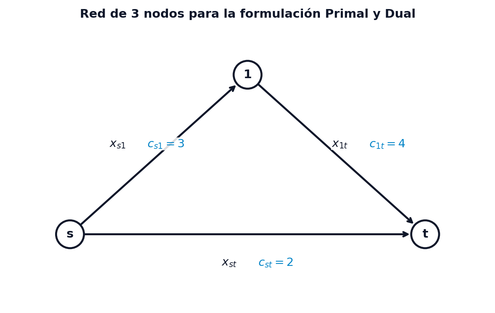{#fig-red-flujo-maximo-dualidad-ejemplo fig-align="center" width="60%"}

Planteando explícitamente el sistema de conservación de flujo para cada vértice, el modelo primal resulta:

$$
\begin{aligned}
\max_{x, f_0} \quad & f_0 \\
\text{sujeto a} \quad & -x_{s1} - x_{st} = -f_0 \quad &(i = s) \\
& x_{s1} - x_{1t} = 0 \quad &(i = 1) \\
& x_{st} + x_{1t} = f_0 \quad &(i = t) \\
& x_{s1} \le 3, \quad x_{st} \le 2, \quad x_{1t} \le 4 \\
& x_{s1}, x_{st}, x_{1t} \ge 0
\end{aligned}
$$

Al eliminar la ecuación del sumidero $t$ y fijar $u_t = 0 \implies u_s = 1$, las restricciones duales asociadas a cada arco $u_j - u_i + w_{ij} \ge 0$ se transforman en:

$$
\begin{aligned}
\min_{u, w} \quad & 3 w_{s1} + 2 w_{st} + 4 w_{1t} \\
\text{sujeto a} \quad & u_1 - u_s + w_{s1} \ge 0 \implies u_1 + w_{s1} \ge 1 \quad &(\text{arco } (s,1)) \\
& u_t - u_s + w_{st} \ge 0 \implies w_{st} \ge 1 \quad &(\text{arco } (s,t)) \\
& u_t - u_1 + w_{1t} \ge 0 \implies -u_1 + w_{1t} \ge 0 \quad &(\text{arco } (1,t)) \\
& w_{s1}, w_{st}, w_{1t} \ge 0
\end{aligned}
$$

La resolución de ambos modelos proporciona la solución primal óptima de flujo máximo $f_0^* = 5$ con $x_{s1}^* = 3$, $x_{st}^* = 2$ y $x_{1t}^* = 3$. Por su parte, la solución dual óptima asigna los potenciales $u_s = 1, u_1 = 0, u_t = 0$ y los multiplicadores de capacidad $w_{s1} = 1, w_{st} = 1, w_{1t} = 0$. El valor objetivo dual es $3(1) + 2(1) + 4(0) = 5 = f_0^*$, identificando de forma unívoca el corte de capacidad mínima $N = \{s\}$ con arcos salientes $w^+(N) = \{(s,1), (s,t)\}$ de capacidad $3 + 2 = 5$, tal y como se representa visualmente en la @fig-red-flujo-maximo-dualidad-solucion:

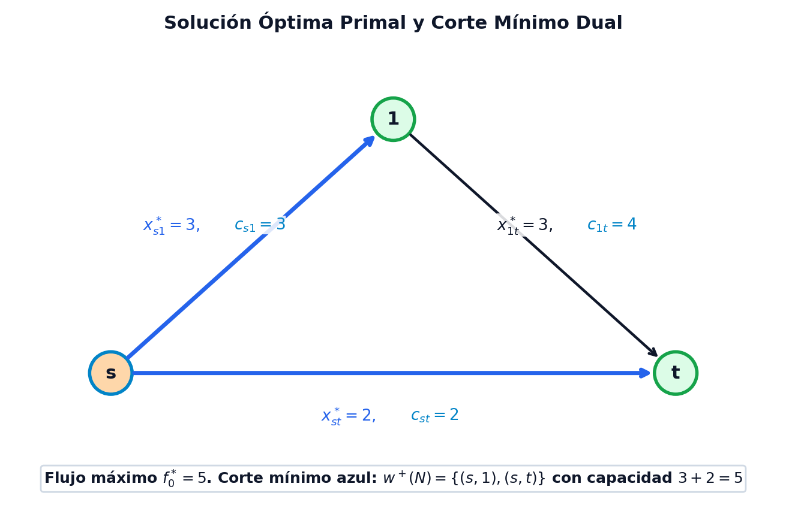{#fig-red-flujo-maximo-dualidad-solucion fig-align="center" width="60%"}
:::

## Problema de flujo a coste mínimo

En los problemas de flujo máximo estudiados previamente, el único objetivo estratégico consistía en determinar la máxima cantidad de volumen que podía enviarse desde la fuente $s$ al sumidero $t$ aprovechando las capacidades acotadas de los arcos. Sin embargo, en la práctica logística, económica y de transporte (distribución de bienes, encaminamiento de tráfico en redes de comunicación o asignación de tareas), enviar flujo a través de diferentes caminos conlleva un **coste unitario de transporte** $p_{ij} \in \mathbb{R}$ por cada unidad circulante.

### Planteamiento y formulación del flujo compatible a coste mínimo

Para comprender la necesidad de esta formulación, considérese el **problema de asignación de tareas a máquinas**. Supóngase que se dispone de un conjunto de $n$ máquinas $m_1, \dots, m_n$ y un conjunto de $n$ tareas $t_1, \dots, t_n$. Tal y como se ilustra en la @fig-red-problema-asignacion-bipartita, construyendo una red de transporte bipartita donde la fuente $s$ se conecta con capacidad 1 a cada máquina, las máquinas con capacidad 1 a las tareas que pueden ejecutar, y las tareas con capacidad 1 al sumidero $t$, la resolución del problema del flujo máximo determina el número máximo de tareas realizables simultáneamente.

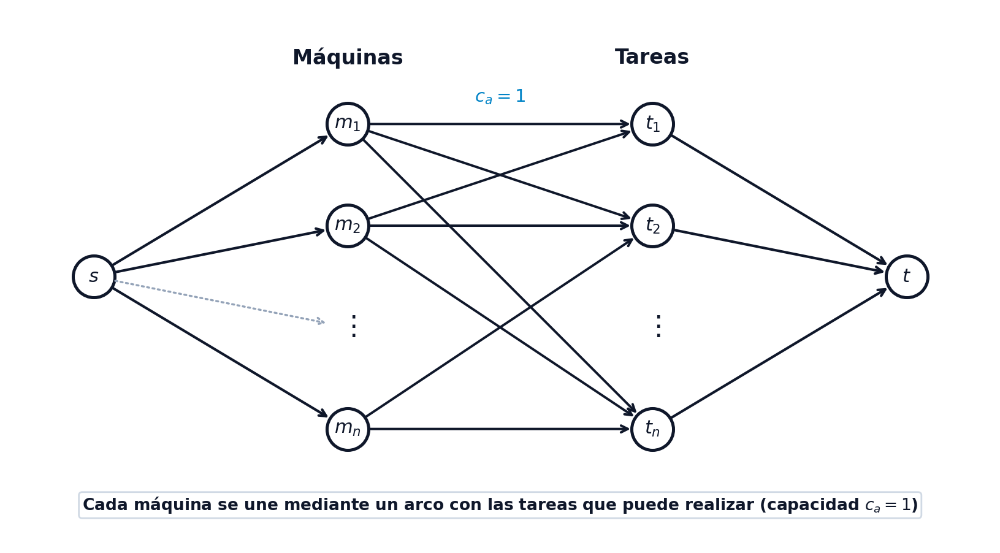{#fig-red-problema-asignacion-bipartita fig-align="center" width="75%"}

No obstante, en la realidad industrial cada máquina $m_i$ incurre en un coste de procesamiento o ejecución distinto $p_{ij}$ al realizar la tarea $t_j$. El objetivo óptimo ya no es únicamente ejecutar el máximo número de tareas, sino hallar la asignación completa que minimice el coste total invertido.

Generalizando este escenario, dada una red de transporte $(G = (V, U), \mathbf{c})$ equipada con capacidades $c_{ij} \ge 0$, costes unitarios $p_{ij} \in \mathbb{R}$ y un valor prefijado de flujo a enviar $f_0 = \nu$ entre la fuente $s$ y el sumidero $t$, el **problema del flujo compatible a coste mínimo** se formula analíticamente como el siguiente programa lineal:

$$
\begin{aligned}
\min_{f} \quad & \sum_{(i,j) \in U} p_{ij} f_{ij} \\
\text{sujeto a} \quad & \sum_{j \mid (j, i) \in U} f_{ji} - \sum_{j \mid (i, j) \in U} f_{ij} = \begin{cases} -\nu & \text{si } i = s \\ 0 & \text{si } i \neq s, t \\ \nu & \text{si } i = t \end{cases} \quad \forall i \in V \\
& 0 \le f_{ij} \le c_{ij}, \quad \forall (i, j) \in U
\end{aligned}
$$

::: {.callout-tip title="Ejemplo: Comparación de flujos compatibles y circulación por ciclos" data-kind="ejemplo" collapse="true"}
Considérese la red de transporte de 5 nodos $V = \{s, a, b, c, t\}$ representada en la @fig-red-flujo-coste-minimo-ejemplo, donde cada arco contiene el identificador de arista (1 a 6) y la etiqueta $(c_{ij})[p_{ij}]$ especificando su capacidad $c_{ij}$ en azul entre paréntesis y su coste unitario $p_{ij}$ en rojo entre corchetes:

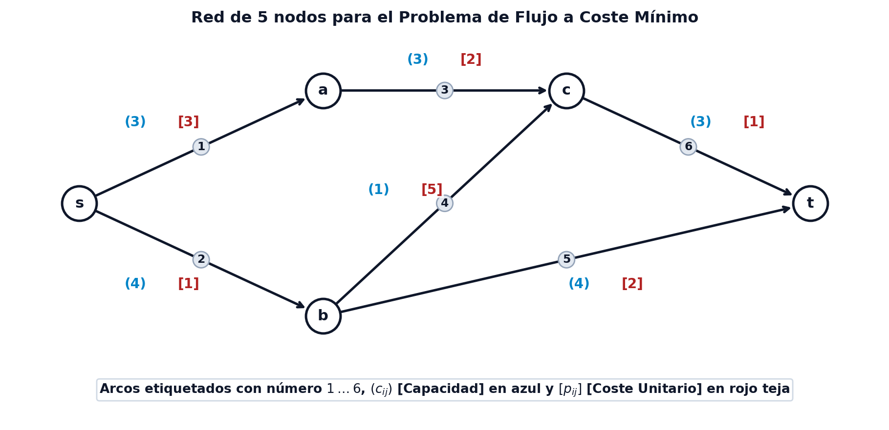{#fig-red-flujo-coste-minimo-ejemplo fig-align="center" width="70%"}

Supóngase que se desea enviar un flujo total prefijado de $\nu = 4$ unidades desde la fuente $s$ al sumidero $t$. Como se ilustra en la @fig-comparacion-flujos-coste-minimo, existen múltiples asignaciones compatibles de flujo. Analicemos dos soluciones factibles particulares, $\mathbf{f}^A$ (destacada en rojo) y $\mathbf{f}^B$ (destacada en azul), cuyos costes totales $c_A = 19$ y $c_B = 18$ se desglosan en la recuadros superiores derechos de la figura:

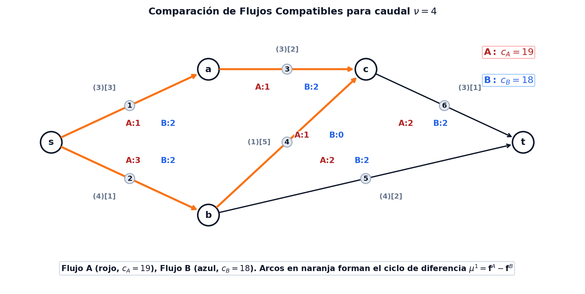{#fig-comparacion-flujos-coste-minimo fig-align="center" width="75%"}

1. **Flujo Compatible $\mathbf{f}^A$** (en rojo):
   * Asignación: $f_{sa}^A=1, f_{sb}^A=3, f_{ac}^A=1, f_{bc}^A=1, f_{bt}^A=2, f_{ct}^A=2$.
   * Coste Total: $c_A = 1(3) + 3(1) + 1(2) + 1(5) + 2(2) + 2(1) = 3 + 3 + 2 + 5 + 4 + 2 = 19$.

2. **Flujo Compatible $\mathbf{f}^B$** (en azul):
   * Asignación: $f_{sa}^B=2, f_{sb}^B=2, f_{ac}^B=2, f_{bc}^B=0, f_{bt}^B=2, f_{ct}^B=2$.
   * Coste Total: $c_B = 2(3) + 2(1) + 2(2) + 0(5) + 2(2) + 2(1) = 6 + 2 + 4 + 0 + 4 + 2 = 18$.

**Análisis de la Diferencia entre Soluciones (Circulación Cíclica)**:

Calculando la diferencia vectorial componente a componente $\mathbf{\mu}^1 = \mathbf{f}^A - \mathbf{f}^B$, se obtiene la tupla de variaciones $\mathbf{\mu}^1 = (-1, 1, -1, 1, 0, 0)$. Gráficamente, estos cuatro arcos modificados forman un **circuito cerrado** $s \to b \to c \to a \to s$. 

Por lo tanto, es posible pasar del flujo no óptimo $\mathbf{f}^A$ al flujo de menor coste $\mathbf{f}^B$ simplemente **sumando un ciclo incremental orientado en sentido inverso $-\mathbf{\mu}^1$**. La diferencia de coste total entre ambas soluciones es exactamente el coste neto de recorrer dicho ciclo: $c_A - c_B = 19 - 18 = 1$. Este resultado demuestra de manera intuitiva que **la diferencia entre dos flujos cualesquiera de igual valor $\nu$ es siempre una combinación lineal de circuitos residuales**.

**Análisis Inicial de Cadenas desde el Flujo Nulo ($\nu_0 = 0$)**:

Para construir directamente la solución de coste mínimo sin tanteos arbitrarios, observamos que para un caudal inicial $\nu_0 = 0$ el flujo nulo $\mathbf{f}^0 = \mathbf{0}$ es trivialmente óptimo (coste 0). En la red inicial existen tres cadenas orientadas simples desde la fuente $s$ al sumidero $t$:

* **Cadena 1** ($s \to a \to c \to t$): Coste total residual $p(\mu_1) = 3 + 2 + 1 = 6$.
* **Cadena 2** ($s \to b \to t$): Coste total residual $p(\mu_2) = 1 + 2 = 3$.
* **Cadena 3** ($s \to b \to c \to t$): Coste total residual $p(\mu_3) = 1 + 5 + 1 = 7$.

La cadena de coste mínimo es $s \to b \to t$ con coste unitario 3 y capacidad residual $\min(4, 4) = 4$. Por tanto, para enviar un caudal $\nu = 4$, la solución óptima absoluta consiste en canalizar las 4 unidades íntegramente por $s \to b \to t$, alcanzando un coste óptimo mínimo de $4 \times 3 = 12$ (estrictamente menor que los costes 19 y 18 de las soluciones de prueba $\mathbf{f}^A$ y $\mathbf{f}^B$).
:::

### Teoremas de optimalidad y caracterización de circuitos

Para formalizar algebraicamente el criterio de parada y las condiciones necesarias y suficientes de coste mínimo, se introducen las siguientes definiciones sobre cadenas e incrementos en redes con costes.

::: {.callout-note title="Definición: Coste de una cadena y cadenas incrementales" data-kind="definicion"}
1. **Coste de una Cadena**: Dada una cadena orientada $\mu$ formada por arcos directos $\mu^+$ e inversos $\mu^-$, el coste total residual de la cadena se define sumando los costes unitarios según la orientación de paso:
   $$
   p(\mu) = \sum_{u \in \mu^+} p_u - \sum_{u \in \mu^-} p_u
   $$

2. **Cadena Incremental**: Una cadena $\mu$ es incremental respecto a un flujo $\mathbf{f}$ si admite un incremento positivo de flujo $\delta > 0$ sin violar la no negatividad ni superar la capacidad física de ningún arco ($f_u < c_u, \forall u \in \mu^+$ y $f_u > 0, \forall u \in \mu^-$).
:::

A partir de estas nociones se establecen los dos teoremas fundamentales que rigen la optimización de flujos con coste.

::: {.callout-important title="Teorema 1: Optimalidad por ausencia de circuitos incrementales de coste negativo" data-kind="teorema"}
Un flujo compatible $\mathbf{f}$ de valor $f_0 = \nu$ es de **coste mínimo** si y solo si la red residual $G(\mathbf{f})$ **no contiene ningún circuito incremental de coste total negativo** (sin incluir el arco ficticio de retorno $(t, s)$).

*Demostración*:
Cualquier otro flujo factible $\mathbf{f}'$ de valor $\nu$ puede expresarse algebraicamente como la suma del flujo $\mathbf{f}$ y una combinación lineal de circulaciones cíclicas simples $\mathbf{f}' - \mathbf{f} = \sum \alpha_k \mathbf{\mu}^k$. Si existiera en la red residual un circuito incremental $\mathbf{\mu}^k$ con coste estrictamente negativo ($p(\mu^k) < 0$), aumentar el flujo a lo largo de $\mathbf{\mu}^k$ mantendría inalterado el caudal $\nu$ (ya que las circulaciones de ciclo no tienen fuente ni sumidero) pero reduciría estrictamente el coste total, lo que contradice la minimidad de $\mathbf{f}'$. Recíprocamente, si no existen circuitos incrementales de coste negativo, ninguna modificación cíclica puede reducir el coste, garantizando la optimalidad global. $\blacksquare$
:::

La verificación de la optimalidad mediante el **Teorema 1** constituye la base teórica para validar si un flujo determinado es el más económico posible para un caudal fijo $\nu$. Dado que cualquier flujo factible puede visualizarse como el flujo actual corregido por una serie de circulaciones cíclicas, la ausencia de ciclos de mejora (aquellos que reducen el coste) garantiza que nos encontramos en un óptimo local y global. Para extender este resultado a un procedimiento de construcción progresiva, necesitamos el siguiente teorema de crecimiento incremental.

::: {.callout-important title="Teorema 2: Incrementos por caminos de coste mínimo" data-kind="teorema"}
Dado un flujo $\mathbf{f}$ de valor $\nu$ que es de coste mínimo, si se incrementa el flujo en $\delta$ unidades a lo largo de la cadena incremental de $s$ a $t$ que posea el **coste total residual mínimo** en $G(\mathbf{f})$, el flujo resultante es de coste mínimo para el nuevo caudal $\nu + \delta$.

*Demostración*:
Partiendo de la solución a coste mínimo para un valor de flujo $\nu$, se encuentra una cadena incremental de $s$ a $t$ de coste mínimo $p(\mu)$. Se debe demostrar que al incrementar el flujo en $\delta$ unidades a lo largo de dicha cadena, la solución resultante es de coste mínimo para el nuevo valor $\nu + \delta$.

Por reducción al absurdo y aplicando el **Teorema 1**, supóngase que la nueva solución no fuera óptima para $\nu + \delta$. En tal caso, debería existir en la red residual un ciclo incremental de coste estrictamente negativo:

1. **Si el ciclo NO comparte arcos con la cadena**: El ciclo ya pertenecía a la red residual de la solución inicial, lo que implicaría que la solución inicial no habría sido de coste mínimo para $\nu$, contradiciendo la hipótesis.
2. **Si el ciclo y la cadena comparten arcos**: Uniendo vectorialmente ambos se puede construir una nueva cadena incremental de $s$ a $t$ con un coste estrictamente menor que $p(\mu)$, lo cual contradice que la cadena original fuera de coste mínimo.

Al ser ambos casos imposibles, se concluye que el flujo incrementado en $\delta$ unidades es de coste mínimo para $\nu + \delta$. $\blacksquare$
:::

El **Teorema 2** valida la estrategia de construcción iterativa: no necesitamos realizar un cálculo de optimización global completo para cada valor de flujo, sino que basta con encadenar aumentos de caudal a lo largo de los caminos más eficientes disponibles en la red residual. Esta propiedad garantiza que cada paso algorítmico preserva la optimalidad, permitiendo avanzar de forma eficiente desde $f_0=0$ hasta la meta $\nu$.

::: {.callout-note title="Nota: Estrategia algorítmica de resolución iterativa" data-kind="nota"}
La combinación didáctica de ambos teoremas proporciona el esquema general de resolución:

1. **Determinación de la Solución Inicial (Teorema 1)**: Se puede iniciar el proceso desde el flujo nulo $\mathbf{f}^0 = \mathbf{0}$ para $\nu = 0$. Si todos los costes unitarios son no negativos ($p_{ij} \ge 0$), no existe ningún circuito inicial de coste negativo y $\mathbf{f}^0$ es trivialmente óptimo. Si existen costes negativos, se aplican algoritmos de detección de ciclos negativos (como Bellman-Ford) para eliminar circulaciones iniciales negativas aplicando el Teorema 1.

2. **Crecimiento Iterativo por Caminos Mínimos (Teorema 2)**: A partir del flujo óptimo inicial, se calcula iterativamente la cadena de coste residual mínimo desde $s$ hasta $t$ y se incrementa el flujo en $\delta$ unidades. Por el Teorema 2, cada paso garantiza la optimalidad del nuevo caudal $\nu + \delta$, repitiendo la búsqueda hasta alcanzar el volumen objetivo $\nu$ prefijado en el problema.
:::

### Algoritmo de Flujo a Coste Mínimo (Grafo de distancias)

El problema de hallar cadenas incrementales de coste mínimo en la red inicial se traduce operacionalmente en encontrar **caminos de longitud mínima** entre la fuente $s$ y el sumidero $t$ en el grafo de distancias residual $G(\mathbf{f})$. Una vez obtenido el camino más corto, el siguiente paso consiste en determinar el incremento máximo de flujo compatible a lo largo de sus arcos. La detección temprana de circuitos negativos en este grafo permite asegurar que el estado inicial del sistema es coherente con los principios de optimalidad descritos anteriormente.

::: {.callout-note title="Nota: Correspondencia de circuitos negativos" data-kind="nota"}
Cualquier circuito de longitud total estrictamente negativa en el grafo residual $G(\mathbf{f})$ se corresponde de forma unívoca con un **ciclo incremental de coste negativo** en la red de transporte original.
:::

::: {.callout-note title="Esquema: Algoritmo de Flujo a Coste Mínimo" data-kind="esquema"}
* **Paso 1: Inicialización**: Obtener un flujo compatible inicial $\mathbf{f}$ (habitualmente el flujo nulo $\mathbf{f}^0 = \mathbf{0}$ para $\nu = 0$).

* **Paso 2: Eliminación de ciclos con coste negativo**:
  1. Construir el grafo de distancias residual $G(\mathbf{f})$.
  2. Si $G(\mathbf{f})$ contiene circuitos de longitud negativa, modificar el flujo incrementándolo a lo largo del circuito en su capacidad residual y volver al Paso 2.1.
  3. En caso contrario (sin circuitos negativos), ir al **Paso 3**.

* **Paso 3: Aumento del valor del flujo**:
  * Si el valor del flujo ha alcanzado la meta $f_0 = \nu$, **PARAR**: Solución óptima alcanzada.
  * En caso contrario ($f_0 < \nu$), buscar en $G(\mathbf{f})$ el camino de longitud mínima de $s$ a $t$:
    1. Si no existe ningún camino de $s$ a $t$ en $G(\mathbf{f})$, **PARAR**: El problema no admite solución factible para el valor de flujo $\nu$.
    2. En caso contrario, calcular la capacidad residual mínima de la cadena asociada al camino $c(s, t)$.
    3. Variar el flujo en los arcos del camino en la cantidad $\Delta = \min\{c(s, t), \nu - f_0\}$.
    4. Actualizar el flujo $f_0 \leftarrow f_0 + \Delta$, construir el grafo residual asociado al nuevo flujo e ir al **Paso 3**.
:::

::: {.callout-tip title="Ejemplo: Traza del algoritmo de flujo a coste mínimo" data-kind="ejemplo" collapse="true"}
Considérese la red de transporte de 5 nodos $V = \{s, a, b, c, t\}$ con 7 arcos dirigidos $U = \{1, 2, 3, 4, 5, 6, 7\}$, cuyas capacidades $c_{ij}$ y costes unitarios $p_{ij}$ se expresan en el formato $(c_{ij})[p_{ij}]$:

* Arco 1: $(s, a)$ con capacidad $c_{sa} = 3$ y coste $p_{sa} = 3$.
* Arco 2: $(s, b)$ con capacidad $c_{sb} = 2$ y coste $p_{sb} = 3$.
* Arco 3: $(a, c)$ con capacidad $c_{ac} = 2$ y coste $p_{ac} = -1$.
* Arco 4: $(a, t)$ con capacidad $c_{at} = 4$ y coste $p_{at} = -1$.
* Arco 5: $(b, a)$ con capacidad $c_{ba} = 2$ y coste $p_{ba} = -2$.
* Arco 6: $(c, b)$ con capacidad $c_{cb} = 2$ y coste $p_{cb} = 1$.
* Arco 7: $(c, t)$ con capacidad $c_{ct} = 5$ y coste $p_{ct} = 2$.

Se desea transmitir un caudal total objetivo de $\nu = 5$ unidades desde la fuente $s$ al sumidero $t$ al menor coste total posible.

**Paso a paso de los cálculos e iteraciones**

**Paso 1: Inicialización**

Se inicia el procedimiento fijando la solución de flujo nulo $\mathbf{f}^0 = \mathbf{0}$ para un valor de caudal circulante de $f_0 = 0$. El coste acumulado inicial es $C(\mathbf{f}^0) = \sum_{(i,j) \in U} p_{ij} f_{ij}^0 = 0$.

**Paso 2: Eliminación de circuitos con coste negativo**

* **Paso 2.1: Construcción de $G(\mathbf{f}^0)$**: Puesto que el flujo es nulo en todos los arcos ($f_{ij}^0 = 0$), todos los arcos directos admiten capacidad residual $c_{ij} - f_{ij}^0 = c_{ij} > 0$. Se construye $G(\mathbf{f}^0)$ asignando a cada arco su peso unitario $p_{ij}$:
  $$p_{sa} = 3, \quad p_{sb} = 3, \quad p_{ba} = -2, \quad p_{ac} = -1, \quad p_{cb} = 1, \quad p_{at} = -1, \quad p_{ct} = 2$$

* **Paso 2.2: Detección del circuito residual de longitud negativa**: Evaluando los circuitos cerrados en $G(\mathbf{f}^0)$, se identifica el circuito orientado $C_1 = a \to c \to b \to a$. Calculamos su coste total:
  $$p(C_1) = p_{ac} + p_{cb} + p_{ba} = (-1) + 1 + (-2) = -2 < 0$$

  Al ser $p(C_1) = -2 < 0$, por el **Teorema 1** el flujo nulo $\mathbf{f}^0$ no es óptimo porque es posible reducir el coste circulando flujo en ciclo. Determinamos la **Capacidad Residual Máxima** $\delta_1$ de $C_1$:
  $$\delta_1 = \min \{ c_{ac} - f_{ac}^0, \, c_{cb} - f_{cb}^0, \, c_{ba} - f_{ba}^0 \} = \min \{ 2 - 0, \, 2 - 0, \, 2 - 0 \} = 2 \text{ unidades}$$

* **Paso 2.3: Incremento de flujo en el circuito y recálculo del coste**: Incrementamos el flujo en $\delta_1 = 2$ unidades a lo largo de $C_1$:
  $$f_{ac}^1 = 2, \quad f_{cb}^1 = 2, \quad f_{ba}^1 = 2$$

  El resto de arcos mantienen su flujo nulo. Recalculamos el coste total acumulado del nuevo flujo $\mathbf{f}^1$:
  $$C(\mathbf{f}^1) = 2(p_{ac}) + 2(p_{cb}) + 2(p_{ba}) = 2(-1) + 2(1) + 2(-2) = -4$$

  El coste total disminuye de $0$ a $-4$ manteniendo el caudal entrante en la fuente igual a $f_0 = 0$.

* **Paso 2.4: Nuevo grafo residual $G(\mathbf{f}^1)$ y verificación**: Al estar los arcos $(a, c)$, $(c, b)$ y $(b, a)$ saturados ($f = c = 2$), los arcos directos desaparecen de $G(\mathbf{f}^1)$ y se activan sus arcos inversos:
  * Arco inverso $(c, a)$ con peso $-p_{ac} = -(-1) = 1$.
  * Arco inverso $(b, c)$ con peso $-p_{cb} = -1$.
  * Arco inverso $(a, b)$ con peso $-p_{ba} = -(-2) = 2$.

  Se comprueba en $G(\mathbf{f}^1)$ que **ya no existe ningún circuito de longitud negativa**. Por el **Teorema 1**, el flujo $\mathbf{f}^1$ es el punto de partida óptimo para caudal $f_0 = 0$.

**Paso 3: Aumento del valor del flujo**

Como el caudal actual $f_0 = 0$ es estrictamente menor que la meta $\nu = 5$, aplicamos iterativamente el Paso 3 buscando caminos de longitud mínima entre $s$ y $t$ en el grafo residual:

* **Primera iteración del Paso 3 (Caudal $f_0 = 0 \to 3$)**:
  1. **Paso 3.1 (Camino Mínimo en $G(\mathbf{f}^1)$)**: Buscamos en $G(\mathbf{f}^1)$ el camino de longitud residual mínima entre $s$ y $t$. Se encuentra el camino mínimo $\mu_1 = s \to a \to t$ con coste residual $p(\mu_1) = p_{sa} + p_{at} = 3 + (-1) = 2$.
  2. **Paso 3.2 (Capacidad residual e incremento)**: Capacidad residual de la cadena $c(\mu_1) = \min \{ 3 - 0, \, 4 - 0 \} = 3$ unidades. Incremento de flujo: $\Delta_1 = \min \{ 3, \, 5 - 0 \} = 3$ unidades.
  3. **Paso 3.3 (Actualización de flujos)**: Asignamos $\Delta_1 = 3$ unidades a lo largo de $\mu_1$: $f_{sa}^2 = 3, f_{at}^2 = 3$. El caudal circulante alcanza $f_0 = 3$. Coste acumulado: $C(\mathbf{f}^2) = -4 + 3(2) = 2$.
  4. **Paso 3.4 (Nuevo Grafo Residual $G(\mathbf{f}^2)$)**: El arco $(s, a)$ queda saturado ($f_{sa} = 3 = c_{sa}$), generando el arco inverso $(a, s)$ con peso $-3$. El arco $(a, t)$ está parcialmente cargado ($f_{at} = 3 < 4$), manteniendo el arco directo $(a, t)$ con peso $-1$ en el grafo azul (y $+1$ al recorrerlo en la figura del camino) y el arco inverso $(t, a)$ con peso $+1$.

* **Segunda iteración del Paso 3 (Caudal $f_0 = 3 \to 4$)**:
  1. **Paso 3.5 (Camino Mínimo en $G(\mathbf{f}^2)$)**: Como $f_0 = 3 < 5 = \nu$, buscamos el siguiente camino residual mínimo entre $s$ y $t$. Se encuentra el camino mínimo $\mu_2 = s \to b \to c \to a \to t$ con coste residual $p(\mu_2) = p_{sb} + p(b,c) + p(c,a) + p(a,t) = 3 + (-1) + 1 + 1 = 4$ (o 2 neto por cancelación de flujo en arcos inversos).
  2. **Paso 3.6 (Capacidad residual e incremento)**: Capacidad residual disponible:
     $$c(\mu_2) = \min \{ c_{sb} - f_{sb}^2, \, f_{cb}^2, \, f_{ac}^2, \, c_{at} - f_{at}^2 \} = \min \{ 2 - 0, \, 2, \, 2, \, 4 - 3 \} = 1 \text{ unidad}$$

     Incremento de flujo compatible: $\Delta_2 = \min \{ 1, \, 5 - 3 \} = 1$ unidad.

  3. **Paso 3.7 (Actualización de flujos)**: Aumenta el flujo directo en $(s, b)$ y $(a, t)$: $f_{sb}^3 = 1$ y $f_{at}^3 = 4$ (saturado). Al recorrer en sentido inverso $(c, b)$ y $(a, c)$, el flujo se reduce en 1 unidad: $f_{cb}^3 = 1, f_{ac}^3 = 1$. El caudal circulante alcanza $f_0 = 4$. Coste acumulado: $C(\mathbf{f}^3) = 2 + 1(2) = 4$.
  4. **Paso 3.8 (Nuevo Grafo Residual $G(\mathbf{f}^3)$)**: Al estar $(a, t)$ saturado ($f_{at} = 4$), desaparece su arco directo y únicamente permanece el inverso $(t, a)$ con peso $+1$. Los arcos $(s, b)$, $(a, c)$ y $(b, c)$ están parcialmente cargados ($f=1 < c=2$), generando dobles arcos.

* **Tercera iteración del Paso 3 (Caudal $f_0 = 4 \to 5$)**:
  1. **Paso 3.9 (Camino Mínimo en $G(\mathbf{f}^3)$)**: Como $f_0 = 4 < 5 = \nu$, buscamos el camino residual mínimo entre $s$ y $t$. Se encuentra el camino mínimo $\mu_3 = s \to b \to c \to t$ con coste residual $p(\mu_3) = p_{sb} + p(b,c) + p_{ct} = 3 + (-1) + 2 = 4$.
  2. **Paso 3.10 (Capacidad residual e incremento final)**: Capacidad residual disponible:
     $$c(\mu_3) = \min \{ c_{sb} - f_{sb}^3, \, c_{cb} - f_{cb}^3, \, c_{ct} - f_{ct}^3 \} = \min \{ 2 - 1, \, 2 - 1, \, 5 - 0 \} = 1 \text{ unidad}$$

     Incremento final: $\Delta_3 = \min \{ 1, \, 5 - 4 \} = 1$ unidad.

  3. **Paso 3.11 (Actualización de flujos y condición de parada)**: Se incrementa el flujo en 1 unidad a lo largo de $\mu_3$:
     * $f_{sb}^* = 1 + 1 = 2$ (saturando el arco $(s, b)$).
     * $f_{cb}^* = 1 - 1 = 0$ (deshaciendo completamente el flujo en $(c, b)$).
     * $f_{ct}^* = 0 + 1 = 1$.
     El caudal circulante alcanza la meta objetivo $f_0 = 5 = \nu$. **PARAR**: Solución óptima alcanzada.

**Solución Óptima del Problema de Flujo a Coste Mínimo**

La distribución óptima de flujo para transmitir $\nu = 5$ unidades al menor coste total es:

$$f_{sa}^* = 3, \quad f_{sb}^* = 2, \quad f_{ba}^* = 2, \quad f_{ac}^* = 1, \quad f_{cb}^* = 0, \quad f_{at}^* = 4, \quad f_{ct}^* = 1$$

El **Coste Mínimo Óptimo Total** resultante es:

$$C^* = 3(3) + 2(3) + 2(-2) + 1(-1) + 0(1) + 4(-1) + 1(2) = 9 + 6 - 4 - 1 + 0 - 4 + 2 = 8$$

**Reproductor interactivo de la traza algorítmica**

::: {.content-visible when-format="html"}
::: {#fig-flujo-coste-minimo-paso1-animado}
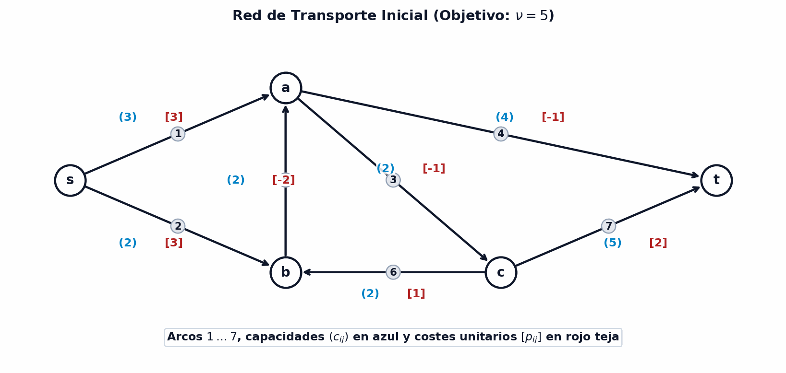

<dialog id="flujo-coste-minimo-paso1-dialog" style="border:none; border-radius:10px; padding:0; width:88vw; max-width:88vw; height:84vh; max-height:84vh; box-shadow:0 20px 60px rgba(0,0,0,0.55); overflow:hidden; background:#fff;">
  <button onclick="document.getElementById('flujo-coste-minimo-paso1-dialog').close()"
          style="position:absolute; top:10px; right:14px; z-index:10; background:rgba(15,23,42,0.6); color:#fff; border:none; border-radius:50%; width:30px; height:30px; font-size:17px; cursor:pointer; line-height:1; display:flex; align-items:center; justify-content:center;">×</button>
  <iframe src="images/flujo_coste_minimo_paso1_player.html" width="100%" height="100%" style="border:none; display:block;" scrolling="no"></iframe>
</dialog>

Animación interactiva de la traza completa de 15 fotogramas: red inicial, flujo nulo $\mathbf{f}^0 = \mathbf{0}$, eliminación del circuito residual negativo $a \to c \to b \to a$ con coste $-2$, e incrementos sucesivos por caminos de coste mínimo hasta alcanzar la solución óptima para $\nu = 5$ con coste total mínimo $C^* = 8$.
:::
:::
:::

## El problema del transbordo

Habiendo estudiado el problema de flujo de coste mínimo para un único par origen-destino $(s, t)$, resulta natural extender esta metodología a redes complejas con múltiples nodos de oferta y demanda. El **problema del transbordo** constituye la formulación lineal más general e integradora dentro de la optimización en redes. Su propósito es determinar el esquema óptimo para transportar una mercancía a través de una red de capacidad limitada (con cotas inferior $\ell_{ij}$ y superior $c_{ij}$ en cada arco), donde determinados nodos actúan como emisores u orígenes de mercancía, otros como receptores o destinos, y un tercer grupo actúa únicamente como puntos intermedios de paso o **transbordo**, de manera que se satisfagan todas las demandas a coste mínimo total.

::: {.callout-note title="Definición: Modelo matemático del problema del transbordo" data-kind="definicion"}
Dada una red dirigida $G = (V, U)$ con $|V| = n$ nodos y $|U| = m$ arcos, definimos los siguientes elementos del modelo:

* **Variables de decisión**: $f_{ij}$ representa el número de unidades de mercancía enviadas del nodo $i$ al nodo $j$, para todo $(i, j) \in U$.
* **Costes unitarios**: $p_{ij}$ es el coste unitario de transporte asociado al arco $(i, j) \in U$.
* **Disponibilidad o recurso en los nodos**: $b_i$ representa el balance neto de mercancía en el nodo $i \in V$:
  * **Nodo de Oferta ($b_i > 0$)**: El nodo genera o dispone de $b_i$ unidades de mercancía.
  * **Nodo de Demanda ($b_i < 0$)**: El nodo requiere o consume $|b_i|$ unidades de mercancía.
  * **Nodo de Transbordo ($b_i = 0$)**: El nodo no produce ni consume mercancía; todo el flujo que entra debe salir.

**Hipótesis de Equilibrio**: Se asume que la red está en equilibrio, de forma que la oferta total generada es exactamente igual a la demanda total requerida:

$$\sum_{i=1}^n b_i = 0$$

El modelo de Programación Lineal del problema del transbordo se formula como:

$$
\begin{aligned}
\min_{f \ge 0} \quad & \sum_{i=1}^n \sum_{j=1}^n p_{ij} f_{ij} \\
\text{sujeto a} \quad & \sum_{j=1}^n f_{ij} - \sum_{k=1}^n f_{ki} = b_i, \quad \forall i \in V \\
& \ell_{ij} \le f_{ij} \le c_{ij}, \quad \forall (i, j) \in U
\end{aligned}
$$
:::

El modelo del transbordo actúa como un marco unificador de la optimización en redes, conteniendo como casos particulares a las siguientes clases de problemas:

1. **Problema de Transporte**: Nodos divididos estrictamente en orígenes ($b_i > 0$) y destinos ($b_i < 0$), sin nodos intermedios de transbordo.
2. **Problema de Asignación**: Caso de transporte bipartito con $b_i = +1$ y $b_j = -1$ con capacidades unitarias.
3. **Problema del Camino Mínimo**: Red con un único nodo fuente $b_s = +1$, un único nodo sumidero $b_t = -1$ y transbordos $b_i = 0$.
4. **Problema del Flujo Máximo**: Red con arco de retorno ficticio $(t, s)$ e igualación de balances a cero.
5. **Problema de Flujo de Coste Mínimo**: Formulación del transbordo con fuente $b_s = \nu$, sumidero $b_t = -\nu$ y transbordos $b_i = 0$.
