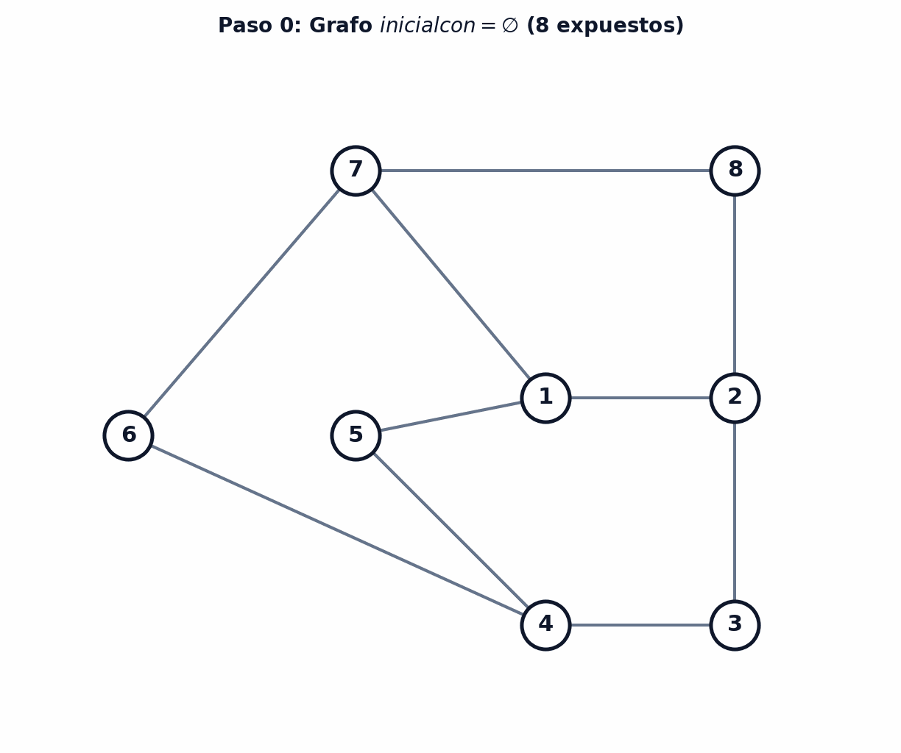
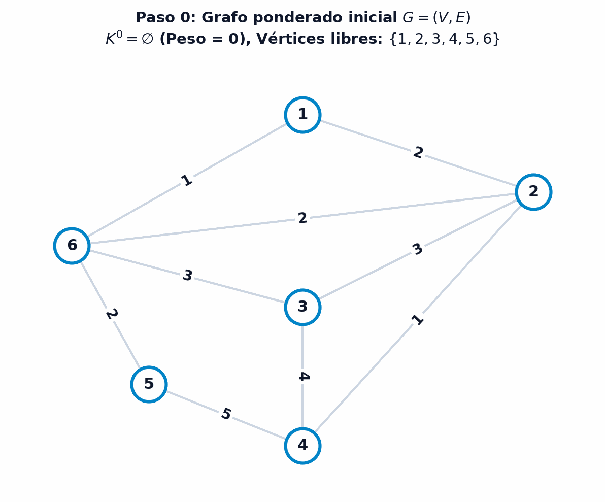

# Emparejamientos en redes

La teoría de **emparejamientos en grafos** (*matchings*) constituye uno de los capítulos más elegantes, profundos y de mayor impacto práctico dentro de la optimización combinatoria y el análisis de redes [@ahuja1993network; @papadimitriou1998combinatorial]. Su propósito fundamental es seleccionar un subconjunto de aristas de forma que ningún par de ellas comparta un vértice común, modelando la asignación óptima de recursos discretos e indivisibles: asignación de tripulaciones a vuelos, emparejamiento de donantes y receptores de órganos, emparejamiento de estudiantes a universidades, y partición de tareas en entornos computacionales y logísticos [@edmonds1965paths; @lovasz2009matching].

En este capítulo desarrollaremos la fundamentación teórica y algorítmica completa de los emparejamientos. Comenzaremos formalizando los conceptos de saturación, vértices expuestos y emparejamientos máximos y perfectos. A continuación, estudiaremos las cadenas alternantes y la operación de transferencia, demostrando rigurosamente el célebre Teorema de Caracterización de Berge y el lema estructural de componentes conexas en la diferencia simétrica. Posteriormente, abordaremos el desafío de los ciclos impares (*flores*) en grafos generales mediante la operación de contracción y el Algoritmo del Árbol Alternante de Edmonds. Finalmente, analizaremos la estrecha relación de dualidad entre emparejamientos y recubrimientos formulada por Gallai, culminando con la resolución del problema de emparejamiento de peso máximo mediante análisis de costes reducidos.

::: {.callout-important title="Objetivos de aprendizaje" data-kind="objetivos"}
Al finalizar este capítulo, serás capaz de:

1. **Definir** y **clasificar** emparejamientos maximales, de máximo cardinal y perfectos, caracterizando el estado de saturación de los vértices.
2. **Demostrar** y **aplicar** el Teorema de Berge para certificar la optimalidad de un emparejamiento mediante la ausencia de cadenas incrementales.
3. **Analizar** la descomposición estructural en componentes conexas del grafo diferencia simétrica $G' = (V, K_1 \bigtriangleup K_2)$.
4. **Construir** árboles y bosques alternantes, caracterizando los conjuntos de niveles pares $Y^0$ e impares $Y^1$ para guiar la búsqueda de caminos de aumento.
5. **Ejecutar** el algoritmo de contracción y descompresión de flores de Edmonds para resolver emparejamientos en grafos no bipartitos.
6. **Demostrar** y **aplicar** el Teorema de Dualidad de Gallai que vincula los emparejamientos máximos con los recubrimientos de aristas mínimos.
7. **Formular** y **resolver** el problema de emparejamiento de máximo peso mediante transferencias de cadenas de coste reducido máximo.
:::

## Fundamentos y conceptos de emparejamiento

Para comprender la naturaleza combinatoria del emparejamiento, resulta ilustrativo comenzar analizando un problema clásico de asignación de recursos indivisibles en el que se busca coordinar pares de elementos compatibles. Consideremos el problema de coordinación de tripulaciones aéreas.

::: {.callout-tip title="Ejemplo: Asignación de tripulaciones de la Royal Air Force (RAF)" data-kind="ejemplo" collapse="true"}
Durante la Segunda Guerra Mundial, la Real Fuerza Aérea británica (RAF) necesitaba organizar tripulaciones formadas por parejas de dos pilotos para sus aviones biplaza de combate. Por motivos operativos y de seguridad en vuelo, ambos pilotos debían dominar al menos un idioma común para garantizar la comunicación fluida en cabina.

Supongamos que en una base aérea se dispone de $7$ pilotos con las siguientes competencias lingüísticas:

* **Piloto 1 ($P$)**: Habla únicamente $\{ \text{polaco} \}$.
* **Piloto 2 ($PI$)**: Habla $\{ \text{polaco, inglés} \}$.
* **Piloto 3 ($P'$)**: Habla $\{ \text{polaco} \}$.
* **Piloto 4 ($I$)**: Habla únicamente $\{ \text{inglés} \}$.
* **Piloto 5 ($A$)**: Habla únicamente $\{ \text{alemán} \}$.
* **Piloto 6 ($AI$)**: Habla $\{ \text{alemán, inglés} \}$.
* **Piloto 7 ($FI$)**: Habla $\{ \text{francés, inglés} \}$.

Se desea determinar el **número máximo de tripulaciones completas** (parejas de pilotos) que pueden formarse simultáneamente.

Para resolver el problema, modelamos el sistema mediante un grafo simple no dirigido $G = (V, E)$, donde cada vértice representa a un piloto ($V = \{P, PI, P', I, A, AI, FI\}$) y existe una arista no dirigida $\{u, v\} \in E$ si y sólo si los pilotos asociados $u$ y $v$ comparten al menos un idioma. Las aristas del grafo resultan ser:
$$
\begin{aligned}
E = \bigl\{ & \{P, PI\}, \, \{P, P'\}, \, \{PI, P'\}, \, \{PI, I\}, \, \{PI, AI\}, \\
& \{PI, FI\}, \, \{I, FI\}, \, \{I, AI\}, \, \{FI, AI\}, \, \{A, AI\} \bigr\}
\end{aligned}
$$

Como se ilustra en la @fig-emparejamiento-tripulaciones-raf, una asignación miope o codiciosa podría emparejar inicialmente a los pilotos $\{P, PI\}$ (por hablar polaco) y $\{A, AI\}$ (por hablar alemán), obteniendo el emparejamiento $K_1 = \bigl\{ \{P, PI\}, \, \{A, AI\} \bigr\}$ de tamaño $2$. Sin embargo, esta selección bloquea a los pilotos restantes ($P', FI, I$), impidiendo formar una tercera pareja a pesar de que el número total de pilotos ($7$) permitiría teóricamente hasta $\lfloor 7/2 \rfloor = 3$ parejas.

{#fig-emparejamiento-tripulaciones-raf fig-align="center" width="90%"}

Reorganizando las asignaciones hacia el emparejamiento $K_2 = \bigl\{ \{P, P'\}, \, \{PI, I\}, \, \{AI, FI\} \bigr\}$, se logran formar **3 tripulaciones completas**, dejando únicamente al piloto $A$ sin pareja asignada. Dado que con $7$ pilotos no es posible formar más de $3$ parejas independientes, $K_2$ constituye una solución de máxima cardinalidad.
:::

La formalización matemática de este problema requiere definir con precisión los conceptos de aristas disjuntas, vértices saturados y clases de optimalidad sobre grafos no dirigidos.

::: {.callout-note title="Definición: Emparejamiento en un grafo" data-kind="definicion"}
Dado un grafo no dirigido simple $G = (V, E)$, un **emparejamiento** (o *matching*) es un subconjunto de aristas $K \subseteq E$ tal que ninguna pareja de aristas en $K$ comparte un vértice en común, es decir:

$$
e_1 \cap e_2 = \emptyset, \quad \forall e_1, e_2 \in K, \; e_1 \neq e_2
$$
:::

Desde una perspectiva algebraica y de programación matemática, un emparejamiento puede representarse mediante un vector binario de decisión $\mathbf{x} \in \{0, 1\}^{|E|}$, donde cada componente $x_e = 1$ si la arista $e \in E$ se incluye en el emparejamiento y $x_e = 0$ en caso contrario. La condición de no adyacencia equivale a imponer que, para cada vértice $v \in V$, la suma de variables incidentes no supere la unidad:

$$
\sum_{e \in \delta(v)} x_e \le 1, \quad \forall v \in V
$$

donde $\delta(v)$ denota el conjunto de aristas incidentes en el vértice $v$. Esta estructura muestra que el conjunto de emparejamientos es hereditario, propiedad clave que permite analizar subconjuntos de soluciones válidas.

::: {.callout-note title="Proposición: Hereditariedad de los emparejamientos" data-kind="corolario"}
Dado un grafo $G = (V, E)$ y un emparejamiento $K \subseteq E$, cualquier subconjunto $K' \subseteq K$ es también un emparejamiento de $G$.

*Demostración*:
Si $K$ no contiene aristas con extremos compartidos, la eliminación de una o más aristas para formar $K'$ preserva trivialmente la ausencia de aristas adyacentes. $\blacksquare$
:::

La propiedad de hereditariedad implica que los emparejamientos forman una familia de conjuntos independientes (un complejo simplicial o sistema de independencia). Sobre esta familia, el objetivo primordial consiste en encontrar la solución de mayor tamaño.

::: {.callout-note title="Definición: Problema de emparejamiento de máximo cardinal" data-kind="definicion"}
Dado un grafo no dirigido $G = (V, E)$, el **problema de emparejamiento de máximo cardinal** consiste en determinar un emparejamiento $K \subseteq E$ que contenga el mayor número posible de aristas, es decir, que maximice $|K|$.
:::

Para caracterizar la calidad de una solución y guiar los algoritmos de búsqueda, resulta esencial clasificar los vértices del grafo según su pertenencia a las aristas del emparejamiento.

::: {.callout-note title="Definición: Vértices saturados y vértices expuestos" data-kind="definicion"}
Dado un grafo $G = (V, E)$ y un emparejamiento $K \subseteq E$:

* Un vértice $x \in V$ está **saturado** (o emparejado) por $K$ si existe alguna arista $\{x, y\} \in K$ incidente en $x$.
* Un vértice $x \in V$ está **expuesto** (o no saturado, o libre) si ninguna arista de $K$ incide en $x$.
:::

Puesto que cada arista de $K$ satura exactamente a $2$ vértices distintos y ningún vértice puede estar saturado por dos aristas a la vez, el número total de vértices saturados por un emparejamiento $K$ es exactamente $2|K|$, y el número de vértices expuestos es $|V| - 2|K|$.

Esta relación de conservación entre aristas y vértices conduce a una cota superior natural: en cualquier grafo con $n = |V|$ vértices, el tamaño de cualquier emparejamiento está acotado por $|K| \le \lfloor n/2 \rfloor$. En consecuencia, cuando el número de vértices libres se reduce al mínimo posible, la búsqueda algorítmica concluye de forma inmediata.

::: {.callout-note title="Proposición: Condición de parada por cardinalidad de expuestos" data-kind="corolario"}
Dado un grafo $G = (V, E)$ con $n = |V|$ vértices y un emparejamiento $K \subseteq E$, si el número de vértices no saturados (expuestos) es $0$ o $1$, entonces $K$ es un **emparejamiento de máximo cardinal**.

*Demostración*:
Cualquier emparejamiento adicional requeriría seleccionar al menos una arista no adyacente a las existentes, lo que exige disponer de al menos $2$ vértices no saturados disponibles. Al haber como máximo $1$ vértice libre, no es posible añadir ninguna arista disjunta ni aumentar el cardinal. $\blacksquare$
:::

Es fundamental distinguir conceptualmente entre un **emparejamiento maximal** (por inclusión) y un **emparejamiento de máximo cardinal** (óptimo global):

* **Emparejamiento Maximal**: Es un emparejamiento al que no se le puede añadir ninguna arista adicional de $E$ sin violar la condición de disyunción de vértices. Cualquier algoritmo codicioso (*greedy*) encuentra un emparejamiento maximal rápidamente, pero este puede quedar atrapado en un óptimo local de cardinal estrictamente inferior al óptimo global (como ocurría en el emparejamiento $K_1$ del problema de la RAF).
* **Emparejamiento de Máximo Cardinal**: Es un emparejamiento que alcanza el máximo valor absoluto de $|K|$ entre todos los emparejamientos posibles del grafo. Para transformar un emparejamiento maximal subóptimo en uno de máximo cardinal, es indispensable reorganizar y reasignar parejas a lo largo del grafo.

::: {.callout-note title="Definición: Emparejamiento perfecto" data-kind="definicion"}
Dado un grafo $G = (V, E)$ con $n = |V|$ vértices, un emparejamiento $K \subseteq E$ se dice **perfecto** (o 1-factor) si satura a todos los vértices del grafo ($|V| - 2|K| = 0$). En tal caso, el tamaño del emparejamiento es exactamente:

$$
|K| = \frac{n}{2}
$$

lo que requiere necesariamente que el orden del grafo $n$ sea un número par.
:::

## Resolución mediante cadenas alternantes e incrementales

Para resolver de forma constructiva el problema de emparejamiento de máximo cardinal cuando existen dos o más vértices expuestos, es necesario analizar cómo modificar un emparejamiento existente para incrementar su tamaño. En lugar de reconstruir el emparejamiento desde cero, los métodos combinatorios emplean un principio de mejora local iterativa basado en **cadenas alternantes de aristas**, que actúan como cascadas de reasignación de parejas.

### Cadenas alternantes, cadenas incrementales y transferencias

La intuición física tras una cadena alternante reside en la posibilidad de intercambiar las asignaciones actuales por nuevas parejas compatibles. Al alternar aristas no emparejadas con aristas ya emparejadas, cualquier cambio en una arista desencadena una reacción en cadena que exige reajustar las aristas adyacentes.

::: {.callout-note title="Definición: Cadena alternante e incremental" data-kind="definicion"}
Dado un grafo $G = (V, E)$ y un emparejamiento $K \subseteq E$:

* Una **cadena alternante** es una cadena simple $\mu = (v_1, v_2, \dots, v_k)$ cuyas aristas pertenecen y no pertenecen alternativamente al emparejamiento $K$ (es decir, las aristas alternan entre $K$ y $E \setminus K$).
* Una **cadena incremental** (o cadena de aumento) $\mu[x, y]$ con $x \neq y$ es una cadena alternante cuyos dos vértices extremos $x$ e $y$ son **vértices expuestos** (no saturados) respecto de $K$.
:::

Las cadenas incrementales poseen propiedades algebraicas y combinatorias muy definidas:

1. **Longitud Impar de Aristas**: Toda cadena incremental contiene un **número impar de aristas**. Al comenzar y terminar en vértices no saturados, sus aristas primera y última deben pertenecer obligatoriamente a $E \setminus K$.
2. **Balance de Aristas**: En una cadena incremental con $2k + 1$ aristas, exactamente $k + 1$ aristas pertenecen a $E \setminus K$ y $k$ aristas pertenecen a $K$. El número de aristas fuera del emparejamiento supera siempre en una unidad al número de aristas dentro de $K$.

Esta asimetría en el número de aristas es la que permite incrementar el tamaño global del emparejamiento mediante la operación de transferencia.

::: {.callout-note title="Definición: Operación de transferencia" data-kind="definicion"}
Dado un emparejamiento $K \subseteq E$ y una cadena incremental $\mu[x, y]$ respecto de $K$, la **transferencia** consiste en permutar la pertenencia de las aristas a lo largo de la cadena, sustituyendo las aristas de $\mu \cap K$ por las aristas de $\mu \setminus K$.

Algebraicamente, el nuevo emparejamiento $K'$ se obtiene mediante la **diferencia simétrica** ($\bigtriangleup$):

$$
K' = K \bigtriangleup \mu[x, y] = (K \setminus \mu) \cup (\mu \setminus K)
$$

El emparejamiento resultante satisface estrictamente:

$$
|K'| = |K| + 1
$$
:::

La operación de transferencia preserva de manera rigurosa la validez del emparejamiento: en los vértices interiores de la cadena $\mu$, la arista eliminada de $K$ es reemplazada exactamente por una nueva arista incidente en dicho vértice, manteniendo su grado saturado en $1$. En los dos vértices extremos $x$ e $y$, que antes estaban expuestos, la incorporación de las aristas extremas pasa su estado a saturado ($sat = 1$), incrementando el cardinal total en una unidad sin alterar el estado del resto del grafo.

::: {.callout-tip title="Ejemplo: Aplicación de una transferencia en un grafo de 6 nodos" data-kind="ejemplo" collapse="true"}
Considérese el grafo de 6 vértices $V = \{1, 2, 3, 4, 5, 6\}$ y 9 aristas $E = \bigl\{ \{1,2\}, \{1,3\}, \{2,3\}, \{2,5\}, \{3,4\}, \{3,6\}, \{4,5\}, \{4,6\}, \{5,6\} \bigr\}$ presentado en la @fig-cadenas-alternantes-transferencia.

Partimos del emparejamiento inicial $K = \bigl\{ \{2,3\}, \, \{5,6\} \bigr\}$ con $|K| = 2$. Evaluamos la red:

1. **Identificación de Vértices Expuestos**: Los vértices $2, 3, 5, 6$ están saturados por $K$. Los vértices $1$ y $4$ son vértices expuestos ($1, 4 \notin V(K)$).
2. **Detección de la Cadena Incremental**: La trayectoria $\mu = (1, 2, 3, 4)$ une los vértices expuestos $1$ y $4$. Sus aristas son:
   * $\{1, 2\} \notin K$ (fuera de $K$)
   * $\{2, 3\} \in K$ (dentro de $K$)
   * $\{3, 4\} \notin K$ (fuera de $K$)
   La cadena alterna aristas de $E \setminus K$ y $K$, y tiene longitud $3$ (impar).

3. **Ejecución de la Transferencia**: Calculamos la diferencia simétrica $K' = K \bigtriangleup \mu$:
   * Eliminamos la arista $\{2, 3\} \in K$.
   * Incorporamos las aristas $\{1, 2\}$ y $\{3, 4\}$.
   * Mantenemos la arista ajena a la cadena $\{5, 6\}$.
   
   Obtenemos el nuevo emparejamiento:
   $$
   K' = \bigl\{ \{1,2\}, \, \{3,4\}, \, \{5,6\} \bigr\}
   $$
   El cardinal aumenta de $|K| = 2$ a $|K'| = 3$. Dado que $|K'| = 6/2 = 3$, $K'$ satura a todos los vértices del grafo y constituye un **emparejamiento perfecto**.

{#fig-cadenas-alternantes-transferencia fig-align="center" width="95%"}
:::

### Teorema de caracterización de Berge y descomposición de componentes

La relación directa entre las cadenas incrementales y el aumento del cardinal conduce a la caracterización fundamental de optimalidad descubierta por Claude Berge en 1957 [@berge1957two]. Para demostrar este teorema formalmente, es necesario caracterizar previamente la estructura topológica que surge al superponer dos emparejamientos distintos sobre un mismo grafo.

Al calcular la diferencia simétrica $K_1 \bigtriangleup K_2$ entre dos emparejamientos $K_1$ y $K_2$, estamos aislando el **grafo de discrepancias** entre ambas soluciones.

::: {.callout-note title="Lema: Estructura del grafo diferencia simétrica" data-kind="lema"}
Dados dos emparejamientos cualesquiera $K_1$ y $K_2$ en un grafo simple $G = (V, E)$, el subgrafo parcial generado por la diferencia simétrica $G' = (V, K_1 \bigtriangleup K_2)$ está compuesto exclusivamente por componentes conexas disjuntas que pertenecen a alguno de los siguientes tres tipos:

1. **Vértices aislados** (grado $0$).
2. **Ciclos elementales alternantes** de longitud estrictamente par (cuyas aristas alternan entre $K_1$ y $K_2$).
3. **Cadenas elementales alternantes** de longitud par o impar (cuyas aristas alternan entre $K_1$ y $K_2$).

*Demostración*:
Analicemos el grado máximo que puede tener cualquier vértice $v \in V$ en el grafo diferencia $G' = (V, K_1 \bigtriangleup K_2)$:

* **Caso 1 (Vértice no saturado por $K_1$ ni por $K_2$)**: Ninguna arista de $K_1 \cup K_2$ incide en $v$. Por tanto, el grado de $v$ en $G'$ es $d_{G'}(v) = 0$ (vértice aislado).
* **Caso 2 (Vértice saturado por $K_1$ y por $K_2$ con la misma arista)**: Sea $e \in K_1 \cap K_2$ la arista incidente. Por definición de diferencia simétrica, $e \notin K_1 \bigtriangleup K_2$. Ninguna otra arista de $K_1$ ni de $K_2$ incide en $v$, luego $d_{G'}(v) = 0$ (vértice aislado).
* **Caso 3 (Vértice saturado sólo por uno de los dos emparejamientos)**: Si $v$ está saturado por $e_1 \in K_1$ y ninguna arista de $K_2$ incide en $v$ (o viceversa), entonces exactamente una arista incidente pertenece a $K_1 \bigtriangleup K_2$, por lo que $d_{G'}(v) = 1$. Estos vértices corresponden exclusivamente a los extremos de cadenas alternantes.
* **Caso 4 (Vértice saturado por ambos emparejamientos con aristas distintas)**: Si $e_1 \in K_1$ y $e_2 \in K_2$ con $e_1 \neq e_2$ inciden en $v$, ambas aristas pertenecen a $K_1 \bigtriangleup K_2$. Al no poder incidir más de una arista de cada emparejamiento en $v$, el grado es exactamente $d_{G'}(v) = 2$.

Puesto que ningún vértice en $G'$ tiene grado superior a $2$ ($d_{G'}(v) \le 2, \forall v \in V$), todo grafo de grado máximo 2 se descompone de forma unívoca en vértices aislados, cadenas simples y ciclos cerrados. Además, como las aristas deben alternar estrictamente entre $K_1$ y $K_2$, los ciclos cerrados deben cerrarse alternando aristas de ambos conjuntos, lo que exige obligatoriamente un número par de aristas. $\blacksquare$
:::

Como se ilustra en la @fig-lema-diferencia-componentes y en la @fig-lema-diferencia-bipartito, el lema anterior permite descomponer cualquier par de soluciones en piezas estructurales elementales independientes sin ramificaciones complejas.

{#fig-lema-diferencia-componentes fig-align="center" width="95%"}

{#fig-lema-diferencia-bipartito fig-align="center" width="90%"}

A partir del lema de descomposición de la diferencia simétrica, podemos demostrar de forma rigurosa el Teorema de Berge.

::: {.callout-important title="Teorema de caracterización de Berge (1957)" data-kind="teorema"}
Dado un grafo $G = (V, E)$, un emparejamiento $K \subseteq E$ es de **máximo cardinal** si y solo si el grafo $G$ **no contiene ninguna cadena incremental** con respecto a $K$.

*Demostración*:
Demostramos la doble implicación:

* **Necesidad ($\implies$)**: Razonamos por reducción al absurdo. Supongamos que $K$ es de máximo cardinal y que existe una cadena incremental $\mu[x, y]$ respecto de $K$. Aplicando la operación de transferencia, el nuevo conjunto $K' = K \bigtriangleup \mu[x, y]$ es un emparejamiento válido de $G$ con cardinal $|K'| = |K| + 1 > |K|$, lo que contradice la hipótesis de que $K$ era de cardinal máximo.
* **Suficiencia ($\impliedby$)**: Supongamos que $K$ no contiene ninguna cadena incremental respecto de sí mismo. Sea $K^*$ un emparejamiento de máximo cardinal en $G$ (cuya existencia está garantizada al ser el conjunto de aristas finito). Consideramos el subgrafo diferencia simétrica $G' = (V, K \bigtriangleup K^*)$.

Por el Lema de Descomposición, $G'$ se compone únicamente de vértices aislados, ciclos pares alternantes y cadenas alternantes:

1. Los vértices aislados contienen $0$ aristas de $K$ y $0$ de $K^*$.
2. Cada ciclo alternante contiene exactamente el mismo número de aristas de $K$ que de $K^*$ (al tener longitud par).
3. En cada cadena alternante de longitud par, el número de aristas de $K$ iguala al de $K^*$.
4. En cada cadena alternante de longitud impar, las aristas alternan comenzando y terminando con el mismo emparejamiento. Si alguna cadena impar tuviera más aristas de $K^*$ que de $K$, sus extremos serían vértices no saturados por $K$, lo que convertiría a dicha cadena en una **cadena incremental respecto de $K$**. Pero por hipótesis, $K$ no admite cadenas incrementales. Por tanto, ninguna cadena impar puede tener más aristas de $K^*$ que de $K$.

Sumando el número de aristas en todas las componentes conexas de $G'$, se deduce que $|K^*| \le |K|$. Dado que por definición de máximo $|K| \le |K^*|$, concluimos que $|K| = |K^*|$, lo que certifica que $K$ es de máximo cardinal. $\blacksquare$
:::

El Teorema de Berge constituye la piedra angular de la teoría de emparejamientos y juega un papel análogo al **Teorema de Flujo Máximo - Corte Mínimo de Ford-Fulkerson** en redes de transporte (donde la ausencia de caminos de aumento en la red residual certifica el flujo máximo, como se vio en el Capítulo 8) y al criterio de parada del **método del Símplex** en Programación Lineal (donde la no negatividad de los costes reducidos certifica la optimalidad global, como se demostró en el Capítulo 3). En todos estos casos, una condición de optimalidad local determinista certifica la optimalidad global absoluta.

## Algoritmo del árbol alternante y contracción de flores (Edmonds)

El Teorema de Berge reduce el problema de optimización a una tarea constructiva: buscar de forma sistemática cadenas incrementales en el grafo o certificar formalmente que no existen. Para realizar esta búsqueda de manera determinista y eficiente, se utiliza la estructura jerárquica del **árbol alternante**.

### Estructura del bosque y árbol alternante

Dado un emparejamiento $K$ y un vértice expuesto, el objetivo algorítmico consiste en explorar caminos alternantes en busca de una cadena incremental de longitud impar que termine en otro vértice expuesto. Para formular este proceso, identificamos el estado de cada vértice $x \in V$ mediante una **variable indicadora de saturación**:

$$
sat(x) = \begin{cases} 1, & \text{si } x \text{ está saturado por } K \text{ (existe } e \in K \text{ incidente en } x) \\ 0, & \text{si } x \text{ es un vértice expuesto o no saturado} \end{cases}
$$

::: {.callout-note title="Nota: Bipartición del subgrafo de aristas del emparejamiento" data-kind="nota"}
A partir de cualquier emparejamiento $K$ sobre un grafo general $G = (V, E)$ (sea este originalmente bipartito o no), el subgrafo parcial $G_K = (V, K)$ formado exclusivamente por las aristas de $K$ es siempre un **grafo bipartito**. En efecto, al ser las aristas de $K$ disjuntas en vértices, cada arista forma una componente conexa $K_2$ independiente, cuyos dos extremos pueden asignarse a conjuntos disjuntos de una bipartición.
:::

::: {.callout-note title="Definición: Árbol alternante y bosque alternante" data-kind="definicion"}
Dados un grafo $G = (V, E)$ y un emparejamiento $K \subseteq E$, un **árbol alternante** es un subgrafo parcial $H = (W, T)$ con $W \subseteq V$ y $T \subseteq E$ que satisface las siguientes tres propiedades fundamentales:

1. $H$ es un árbol (subgrafo conexo y sin ciclos).
2. Existe un único vértice distinguido $r \in W$, denominado **raíz del árbol alternante**, que es un vértice expuesto respecto del emparejamiento $K$ ($sat(r) = 0$).
3. Cualquier cadena elemental en $H$ que une un vértice cualquiera $w \in W$ con la raíz $r$ es una **cadena alternante**.

Un conjunto de árboles alternantes disjuntos cuyas raíces son vértices expuestos de $G$ constituye un **bosque alternante**. Cada árbol se denota unívocamente a partir de su raíz mediante $H(r) = (W(r), T(r))$.
:::

Para la gestión y navegación computacional del bosque alternante, se emplea el **vector de antecesores o vector de padres** $\mathbf{p} = (p(1), p(2), \dots, p(n))^T \in V^n$. Cada raíz $r \in R$ de un árbol alternante se identifica de forma unívoca por la autorreferencia $p(r) = r$. La única cadena alternante que conecta cualquier vértice $w \in W(r)$ con su raíz $r$ se recupera de manera determinista encadenando las referencias del vector $\mathbf{p}$:

$$
w \longleftrightarrow p(w) \longleftrightarrow p(p(w)) \longleftrightarrow \cdots \longleftrightarrow p(\cdots(p(w))\cdots) \longleftrightarrow r
$$

::: {.callout-tip title="Ejemplo: Bosque alternante y verificación de maximalidad en grafo de 6 nodos" data-kind="ejemplo" collapse="true"}
Considérese el grafo de 6 vértices $V = \{1, 2, 3, 4, 5, 6\}$ y aristas $E = \bigl\{ \{1,4\}, \{1,5\}, \{1,6\}, \{2,5\}, \{3,5\} \bigr\}$ representado en la @fig-arbol-ejemplo-6nodos, con el emparejamiento inicial $K = \bigl\{ \{1,4\}, \, \{2,5\} \bigr\}$.

1. **Identificación de Raíces**: Los vértices saturados son $\{1, 2, 4, 5\}$ ($sat = 1$), mientras que los vértices expuestos son $\{3, 6\}$ ($sat = 0$). Por tanto, el conjunto de raíces del bosque alternante es $R = \{3, 6\}$.
2. **Construcción de los Árboles Alternantes**:
   * Árbol $H(3) = (W(3), T(3))$ con raíz $r = 3$:
     $$W(3) = \{2, 3, 5\}, \quad T(3) = \bigl\{ \{3,5\}, \, \{2,5\} \bigr\}$$

   * Árbol $H(6) = (W(6), T(6))$ con raíz $r = 6$:
     $$W(6) = \{1, 4, 6\}, \quad T(6) = \bigl\{ \{6,1\}, \, \{1,4\} \bigr\}$$

3. **Vector de Padres**: El vector de antecesores queda determinado por:
   $$
   \mathbf{p}^T = (6, 5, 3, 1, 3, 6)
   $$

4. **Conclusión de Optimalidad**: Desde los árboles alternantes no es posible alcanzar ningún otro vértice expuesto mediante aristas alternantes. Al no existir cadenas incrementales, el Teorema de Berge certifica que $K$ es un **emparejamiento de máximo cardinal** ($|K| = 2$).

{#fig-arbol-ejemplo-6nodos fig-align="center" width="90%"}
:::

Cuando la exploración del árbol alternante sí alcanza otros vértices expuestos antes de agotarse, se descubre al menos una cadena incremental que permite aplicar la transferencia y aumentar el cardinal del emparejamiento, como se detalla en el siguiente ejemplo:

::: {.callout-tip title="Ejemplo: Detección de cadenas incrementales y transferencia en grafo bipartito de 10 nodos" data-kind="ejemplo" collapse="true"}
Considérese el grafo bipartito de 10 vértices $V = \{1, \dots, 10\}$ ilustrado en la @fig-arbol-ejemplo-10nodos, con el emparejamiento inicial $K_1 = \bigl\{ \{2,7\}, \, \{3,8\}, \, \{5,10\} \bigr\}$ de cardinal $3$.

1. **Inicialización del Árbol con Raíz Expuesta**: El nodo $1$ es un vértice expuesto ($sat(1) = 0$). Tomamos $R = \{1\}$ como raíz del árbol alternante.
2. **Vector de Padres**: Tras explorar las aristas del grafo bipartito desde la raíz $1$ (alcanzando el camino alternante $1 \to 7 \to 2 \to 8 \to 3$ y, desde el vértice $3$, ramificando hacia los nodos $6$, $9$ y la rama $10 \to 5$), el vector de antecesores obtenido es:
   $$
   \mathbf{p}^T = (1, 7, 8, 0, 10, 3, 1, 2, 3, 3)
   $$
   donde $p(4) = 0$ indica que el nodo $4$ no es alcanzado por el árbol, mientras que $p(10) = 3$ y $p(5) = 10$ caracterizan la exploración de la rama saturada $\{5, 10\}$.

3. **Identificación de Cadenas Incrementales**: Los vértices $6$ y $9$ son vértices expuestos que han sido alcanzados por el árbol. Desenrollando sus antecesores mediante $\mathbf{p}$, obtenemos dos cadenas incrementales que conectan con la raíz $1$:
   $$
   6 \longleftrightarrow p(6)=3 \longleftrightarrow p(3)=8 \longleftrightarrow p(8)=2 \longleftrightarrow p(2)=7 \longleftrightarrow p(7)=1
   $$
   $$
   9 \longleftrightarrow p(9)=3 \longleftrightarrow p(3)=8 \longleftrightarrow p(8)=2 \longleftrightarrow p(2)=7 \longleftrightarrow p(7)=1
   $$

4. **Ejecución de la Transferencia**: Aplicando la transferencia por la cadena incremental que parte del nodo expuesto $6$:
   $$
   \mu = (6, 3, 8, 2, 7, 1)
   $$
   Calculamos la diferencia simétrica $K'_1 = K_1 \bigtriangleup \mu$:
   $$
   K'_1 = \bigl\{ \{6,3\}, \, \{8,2\}, \, \{7,1\}, \, \{5,10\} \bigr\}
   $$
   El cardinal resultante aumenta a $|K'_1| = 4$, logrando un nuevo emparejamiento con una arista adicional.

{#fig-arbol-ejemplo-10nodos fig-align="center" width="95%"}
:::

### El desafío de los ciclos impares y la contracción de flores de Edmonds

En grafos bipartitos, todos los ciclos tienen longitud par, lo que garantiza que la búsqueda mediante árboles alternantes siempre progresa de forma directa hacia nuevos vértices o detecta cadenas incrementales. Sin embargo, en grafos generales no bipartitos, la presencia de **ciclos de longitud impar** (denominados *flores* o *blossoms*) introduce una dificultad estructural profunda.

Como se ilustra en la @fig-contraccion-ciclo-flor, en un ciclo impar de $2k + 1$ vértices (por ejemplo, el ciclo de 5 vértices $C_5$), el emparejamiento maximal dentro del ciclo puede saturar como máximo a $2k$ vértices mediante $k$ aristas, dejando exactamente **un vértice expuesto**. La propiedad algebraica y combinatoria clave de la flor es que **cualquiera de los $2k+1$ vértices del ciclo puede elegirse libremente como el vértice expuesto**, mientras los restantes $2k$ vértices quedan completamente saturados por parejas disjuntas.

{#fig-contraccion-ciclo-flor fig-align="center" width="95%"}

Para sortear este obstáculo sin explorar factorialmente todas las posibles asignaciones internas del ciclo, Jack Edmonds introdujo en 1965 la técnica de **contracción de flores**: comprimir todo el ciclo impar en un único pseudovértice (*supernodo*) $w$, resolver el emparejamiento en el grafo comprimido, y descontraer (*expandir*) posteriormente el ciclo ajustando internamente las aristas [@edmonds1965paths].

::: {.callout-note title="Definición: Contracción de un grafo (Grafo comprimido)" data-kind="definicion"}
Dado un grafo no dirigido $G = (V, E)$ y un subconjunto de vértices $W \subset V$ correspondiente a un ciclo impar, se define el **grafo comprimido** $G/W$ como:

$$
G/W = \bigl( (V \setminus W) \cup \{w\}, \, E/W \bigr)
$$

donde $w$ es un nuevo pseudovértice representativo y el conjunto de aristas $E/W$ se define como:

$$
E/W = \bigl\{ \{i, j\} \in E \mid i, j \notin W \bigr\} \cup \bigl\{ \{w, j\} \mid \exists i \in W \text{ tal que } \{i, j\} \in E, \, j \notin W \bigr\}
$$
:::

El siguiente resultado teórico, formulado por Jack Edmonds, garantiza que la contracción de un ciclo impar preserva la capacidad de reconstruir un emparejamiento válido sobre el grafo original mediante una descompresión determinista.

::: {.callout-important title="Teorema: Contracción de ciclos impares de Edmonds (1965)" data-kind="teorema"}
Sea $G = (V, E)$ un grafo, $W \subset V$ un subconjunto de vértices asociado a un ciclo de longitud impar, y sea $K_1$ un emparejamiento en el grafo comprimido $G/W$.

Entonces, existe un emparejamiento $K_W$ en el subgrafo generado por $W$ tal que:

$$
K = K_1 \cup K_W
$$

es un emparejamiento válido de $G$.

*Demostración*:
Al ser $W$ un ciclo de longitud impar $|W| = 2k + 1$, el emparejamiento maximal $K_W$ dentro de $W$ contiene $k$ aristas y deja exactamente un vértice $v \in W$ sin saturar.
Distinguimos dos situaciones posibles sobre el pseudovértice $w$ en el emparejamiento $K_1$:

1. Si $w$ está expuesto en $K_1$, se selecciona cualquier emparejamiento $K_W$ de $k$ aristas en $W$. El único nodo de $W$ que queda sin saturar actúa como vértice expuesto en $G$, y ningún arco de $K_1$ interfiere con $W$, por lo que $K = K_1 \cup K_W$ es un emparejamiento válido.
2. Si $w$ está saturado en $K_1$ por una arista $\{w, j\} \in K_1$, dicha arista proviene originalmente de una arista $\{i, j\} \in E$ con $i \in W$ y $j \notin W$. En tal caso, seleccionamos en $W$ el emparejamiento $K_W$ de $k$ aristas que deja precisamente al vértice $i$ como el único nodo no saturado de $W$. De este modo, la arista $\{i, j\}$ satura a $i$ desde el exterior, y las $k$ aristas de $K_W$ saturan a los restantes $2k$ vértices de $W$. Como ninguna otra arista de $K_1$ incide en $W$, $K = (K_1 \setminus \{\{w, j\}\}) \cup \{\{i, j\}\} \cup K_W$ es un emparejamiento válido en $G$. $\blacksquare$
:::

::: {.callout-note title="Nota: Reglas pedagógicas de descompresión de flores" data-kind="nota"}
Las claves operativas de la contracción de flores se resumen en tres principios:

* **Existencia de vértice expuesto**: Al ser $W$ un ciclo impar, siempre queda exactamente un vértice no saturado en $W$ respecto de $K_W$.
* **Libertad de selección del vértice expuesto**: Siempre es posible elegir de forma determinista qué vértice del ciclo queda no saturado.
* **Alineación con la arista exterior**: Si el pseudovértice $w$ está saturado en $K_1$, se deja como no saturado en el ciclo precisamente el vértice $i \in W$ incidente en la arista exterior que satura a $w$, asegurando que ningún vértice del ciclo quede saturado dos veces.
:::

A pesar de la elegancia del Teorema de Edmonds, la contracción de flores debe gestionarse con extrema cautela dentro de un esquema algorítmico formal, ya que operar directamente con maximalidades en el grafo comprimido puede conducir a soluciones subóptimas:

::: {.callout-warning title="Advertencia: Maximalidad en grafos comprimidos" data-kind="advertencia"}
Que un emparejamiento $K_1$ sea **maximal** en el grafo comprimido $G/W$ no implica necesariamente que el emparejamiento extendido $K$ sea de **máximo cardinal** en el grafo original $G$.

Como se ilustra en la @fig-contraejemplo-maximalidad, considérese un grafo con un ciclo impar $\{1, 2, 3\}$ y tres aristas exteriores $\{ \{1,6\}, \{2,4\}, \{3,5\} \}$. Al comprimir el ciclo $\{1, 2, 3\}$ en el pseudonodo $w$, el grafo comprimido $G/W$ contiene las aristas $\{ \{w,6\}, \{w,4\}, \{w,5\} \}$. El emparejamiento $K_1 = \bigl\{ \{w, 6\} \bigr\}$ es maximal en $G/W$ (no puede añadirse ninguna otra arista disjunta), pero produce en $G$ un emparejamiento de cardinal $2$ ($K = \bigl\{ \{1,6\}, \{2,3\} \bigr\}$), cuando el grafo original admite el emparejamiento de cardinal $3$: $K^* = \bigl\{ \{1,6\}, \{2,4\}, \{3,5\} \bigr\}$. Por esta razón, la contracción debe ejecutarse guiada estrictamente por la jerarquía de niveles del árbol alternante de Edmonds.

{#fig-contraejemplo-maximalidad fig-align="center" width="65%"}
:::

### Algoritmo de Flor de Edmonds: Esquema y resolución paso a paso

Para aplicar y estructurar sistemáticamente el procedimiento de exploración del árbol alternante en el **Paso C** del algoritmo de Edmonds, se definen los siguientes elementos clave:

* **Árbol alternante $(Y, T)$**: Subgrafo donde $Y \subseteq V$ representa el conjunto de vértices explorados por el árbol y $T \subseteq E$ el conjunto de aristas que forman la estructura del árbol.
* **Conjunto de vértices pares ($Y^0 \subset Y$)**: Vértices de $Y$ conectados con la raíz del árbol (incluyendo a la propia raíz a distancia $0$) mediante una cadena alternante de longitud par.
* **Propiedad estructural de las hojas**: Todas las hojas (extremos terminales) del árbol alternante deben ser obligatoriamente vértices pares ($Y^0$).

Como se ilustra en la @fig-arbol-alternante-estructura, considérese el árbol alternante con vértices $Y = \{0, 1, 2, 3, 4, 5, 6, 7, 8\}$, cuya raíz es el vértice expuesto $r = 0$. Los niveles se organizan alternadamente:

* **Nivel 0 (Raíz)**: Vértice $0 \in Y^0$ (par, en rojo).
* **Nivel 1 (Impar)**: Vértices $\{1, 3\}$ (conectados por aristas fuera de $K$).
* **Nivel 2 (Par)**: Vértices $\{2, 4\} \subset Y^0$ (conectados por aristas dentro de $K$, en rojo).
* **Nivel 3 (Impar)**: Vértices $\{5, 7\}$ (conectados por aristas fuera de $K$).
* **Nivel 4 (Par)**: Vértices $\{6, 8\} \subset Y^0$ (conectados por aristas dentro de $K$, en rojo).

En este árbol, el conjunto de vértices pares es exactamente:
$$
Y^0 = \{0, 2, 4, 6, 8\}
$$

{#fig-arbol-alternante-estructura fig-align="center" width="85%"}

A partir de los vértices pares $Y^0$, la exploración del árbol alternante se rige por las siguientes reglas operativas:

1. **Detección de Ciclos Impares (Flores)**: Si en el grafo original existen dos vértices de $Y^0$ conectados directamente por una arista $\{i, j\} \in E$, se ha formado un **ciclo de longitud impar** (flor). Dicho ciclo debe contraerse en un supernodo $w$ para continuar la búsqueda.
2. **Expansión del Árbol desde $Y^0$**: Si no se detectan ciclos impares entre nodos pares, se examinan las aristas incidentes en vértices de $Y^0$ hacia nodos exteriores al árbol ($j \notin Y$):
   * **Hacia vértices adyacentes no saturados ($sat(j) = 0$)**: Se detecta una **cadena alternante incremental** que une la raíz con $j$, permitiendo aumentar de inmediato el cardinal del emparejamiento.
   * **Hacia vértices adyacentes saturados ($sat(j) = 1$)**: Si $j$ está saturado por una arista $\{j, k\} \in K$, se añade el par de aristas al árbol, incorporando el vértice $k$ al conjunto de vértices pares $Y^0$.

El algoritmo completo de Edmonds se sintetiza en el siguiente esquema formal:

::: {.callout-note title="Esquema: Algoritmo de Flor de Edmonds para Emparejamiento Máximo" data-kind="esquema"}
* **Paso A (Inicialización)**: Encontrar un emparejamiento inicial factible $K$ en $G$ (por ejemplo, el emparejamiento trivial $K = \emptyset$).
* **Paso B (Condición de parada elemental)**: Si el número de vértices no saturados por $K$ es $0$ o $1$, **PARAR**: $K$ es de máximo cardinal. En caso contrario, ir al **Paso C**.
* **Paso C (Construcción del Árbol Alternante)**:
  * **Paso C.1**: Seleccionar un vértice expuesto $i_0 \in V$ ($sat(i_0) = 0$). Inicializar el árbol con $Y = Y^0 = \{i_0\}$ y $T = \emptyset$.
  * **Paso C.2 (Exploración desde vértices pares $Y^0$)**:
    * **Caso 1 (Detección de Flor / Ciclo Impar)**: Si existen dos vértices $i, j \in Y^0$ tales que $\{i, j\} \in E$, se detecta un ciclo impar. Contraer el ciclo definiendo el grafo comprimido $G \leftarrow G/W$, actualizar el árbol ($Y \leftarrow (Y \setminus W) \cup \{w\}$, $Y^0 \leftarrow (Y^0 \setminus W) \cup \{w\}$) y volver al **Paso C.2**.
    * **Caso 2 (Extensión del Árbol)**: Si existe $i \in Y^0$ y un vértice adyacente saturado $j \notin Y$ con $\{i, j\} \in E$ y $\{j, k\} \in K$, añadir las aristas $\{i, j\}$ y $\{j, k\}$ al árbol: $Y \leftarrow Y \cup \{j, k\}$, $Y^0 \leftarrow Y^0 \cup \{k\}$, $T \leftarrow T \cup \{\{i, j\}, \{j, k\}\}$ y volver al **Paso C.2**.
    * **Caso 3 (Detección de Cadena Incremental)**: Si existe $i \in Y^0$ y un vértice adyacente expuesto $j \notin Y$ ($sat(j) = 0$) con $\{i, j\} \in E$, se ha detectado una **cadena incremental** entre la raíz $i_0$ y $j$. Realizar la transferencia $K \leftarrow K \bigtriangleup \mu$, descontraer todas las flores activas reconstruyendo el emparejamiento en el grafo original, y volver al **Paso B**.
    * **Caso 4 (Árbol Bloqueado / Húngaro)**: Si no es posible aplicar ninguno de los casos anteriores desde los vértices de $Y^0$, no existe ninguna cadena incremental conectada a $i_0$. Fijar $i_0$ como no aumentable. Si quedan otros vértices expuestos sin explorar, inicializar un nuevo árbol (Paso C.1); en caso contrario, **PARAR**: $K$ es de **máximo cardinal**.
:::

::: {.callout-tip title="Ejemplo: Traza completa del Algoritmo de Edmonds con contracciones sucesivas" data-kind="ejemplo" collapse="true"}
Considérese el grafo de 8 vértices $V = \{1, 2, 3, 4, 5, 6, 7, 8\}$ ilustrado en la @fig-edmonds-animado, cuyas aristas son:
$$
\begin{aligned}
E = \bigl\{ & \{6,7\}, \, \{7,8\}, \, \{1,2\}, \, \{2,3\}, \, \{3,4\}, \\
& \{4,5\}, \, \{4,6\}, \, \{1,5\}, \, \{1,7\}, \, \{2,8\} \bigr\}
\end{aligned}
$$

A continuación se detalla la ejecución paso a paso del algoritmo desde el emparejamiento nulo:

1. **Fase Inicial**:
   * **Paso A (Inicialización)**: Comenzamos con el emparejamiento nulo $K = \emptyset$. Conjunto de vértices expuestos (no saturados): $\{1, 2, 3, 4, 5, 6, 7, 8\}$.
   * **Paso B (Comprobación)**: Hay 8 vértices no saturados ($> 1$). No se cumple la condición de parada elemental $\implies$ Ir al **Paso C**.

2. **Iteración 1**:
   * **Paso C.1**: Seleccionamos la raíz expuesta $i_0 = 1$. Se inicializa el árbol alternante: $Y = Y^0 = \{1\}$, $T = \emptyset$.
   * **Paso C.2**:
     - *Caso 1 (Ciclo impar)*: No hay ciclos impares en $Y^0$.
     - *Caso 2 (Adyacente saturado)*: No existen vecinos saturados por $K = \emptyset$.
     - *Caso 3 (Adyacente no saturado)*: Para $i = 1 \in Y^0$, existe el vértice adyacente expuesto $j = 2 \notin Y$ con $\{1,2\} \in E$. Se detecta la cadena incremental elemental $\mu = (1, 2)$.
     - *Transferencia*: Realizamos $K \leftarrow K \bigtriangleup \{\{1,2\}\} = \bigl\{ \{1,2\} \bigr\}$.
     - **Volver al Paso B**.

3. **Iteración 2**:
   * **Paso B (Comprobación)**: Con $K = \bigl\{ \{1,2\} \bigr\}$, quedan 6 vértices no saturados $\{3, 4, 5, 6, 7, 8\} > 1 \implies$ Ir al **Paso C**.
   * **Paso C.1**: Seleccionamos la raíz expuesta $i_0 = 3$. Se inicializa el árbol alternante: $Y = Y^0 = \{3\}$, $T = \emptyset$.
   * **Paso C.2 (Extensión)**: Para $3 \in Y^0$, existe el vecino saturado $2 \notin Y$ (saturado por $\{1,2\} \in K$) con $\{2,3\} \in E$. Aplicando el Caso 2, incorporamos las aristas $\{2,3\}$ y $\{1,2\}$ al árbol:
     $$Y = \{1, 2, 3\}, \quad Y^0 = \{1, 3\}, \quad T = \bigl\{ \{2,3\}, \, \{1,2\} \bigr\}$$
     Volvemos a evaluar el **Paso C.2**.

   * **Paso C.2 (Detección de Cadena Incremental)**: Evaluando desde los vértices pares $Y^0 = \{1, 3\}$, para $3 \in Y^0$ existe el vecino expuesto $4 \notin Y$ con $\{3,4\} \in E$ (Caso 3). Se detecta la cadena incremental $\mu = (3, 4)$.
   * **Transferencia**: Realizamos $K \leftarrow K \bigtriangleup \{\{3,4\}\} = \bigl\{ \{1,2\}, \, \{3,4\} \bigr\}$.
   * **Volver al Paso B**.

4. **Iteración 3 (Detección y Contracción de la Primera Flor $W$)**:
   * **Paso B (Comprobación)**: Con $K = \bigl\{ \{1,2\}, \{3,4\} \bigr\}$, quedan 4 vértices expuestos $\{5, 6, 7, 8\} > 1 \implies$ Ir al **Paso C**.
   * **Paso C.1**: Seleccionamos la raíz expuesta $i_0 = 5$. Inicializamos el árbol alternante: $Y = Y^0 = \{5\}$, $T = \emptyset$.
   * **Paso C.2 (Extensión 1)**: Para $5 \in Y^0$, existe el vecino saturado $1 \notin Y$ (saturado por $\{1,2\} \in K$). Aplicando el Caso 2, incorporamos las aristas $\{5,1\}$ y $\{1,2\}$ al árbol:
     $$Y = \{1, 2, 5\}, \quad Y^0 = \{2, 5\}, \quad T = \bigl\{ \{5,1\}, \, \{1,2\} \bigr\}$$
     Volvemos al **Paso C.2**.

   * **Paso C.2 (Extensión 2)**: Para $5 \in Y^0$, existe el vecino saturado $4 \notin Y$ (saturado por $\{3,4\} \in K$). Aplicando el Caso 2, incorporamos las aristas $\{5,4\}$ y $\{4,3\}$ al árbol:
     $$Y = \{1, 2, 3, 4, 5\}, \quad Y^0 = \{2, 3, 5\}, \quad T = \bigl\{ \{5,1\}, \, \{1,2\}, \, \{5,4\}, \, \{4,3\} \bigr\}$$
     Volvemos al **Paso C.2**.

   * **Paso C.2 (Caso 1: Detección de Flor)**: Entre los nodos pares del árbol $Y^0 = \{2, 3, 5\}$, existe la arista $\{2, 3\} \in E$. Al conectar dos vértices de la misma paridad respecto a la raíz, se identifica el ciclo impar (flor) de 5 vértices:
     $$W = \{1, 2, 3, 4, 5\}$$

   * **Contracción de la Flor $W$**: Comprimimos todo el subconjunto $W$ en el pseudonodo (supernodo) $w$. Se define el grafo comprimido $G/W$ con vértices $\{w, 6, 7, 8\}$ y aristas $\{ \{w,6\}, \{w,7\}, \{w,8\}, \{6,7\}, \{7,8\} \}$. En $G/W$, el árbol se actualiza a $Y = Y^0 = \{w\}$, $T = \emptyset$ y $K = \emptyset$.
   * **Paso C.2 en $G/W$ (Transferencia)**: Desde $w \in Y^0$, se explora la arista $\{w,6\}$ hacia el vértice expuesto $6 \notin Y$ (Caso 3). Se realiza la transferencia en $G/W$:
     $$K = \bigl\{ \{w, 6\} \bigr\}$$
     **Volver al Paso B**.

5. **Iteración 4 (Búsqueda en $G/W$ y Contracción de la Segunda Flor $W'$)**:
   * **Paso B (Comprobación en $G/W$)**: Con $K = \bigl\{ \{w, 6\} \bigr\}$, los vértices no saturados en $G/W$ son $\{7, 8\}$ ($2 > 1$) $\implies$ Ir al **Paso C**.
   * **Paso C.1**: Seleccionamos la raíz expuesta $i_0 = 7$. Inicializamos el árbol: $Y = Y^0 = \{7\}$, $T = \emptyset$.
   * **Paso C.2 (Extensión)**: Para $7 \in Y^0$, el vecino $w \notin Y$ está saturado por $\{w, 6\} \in K$. Por Caso 2, añadimos $\{7,w\}$ y $\{w,6\}$ al árbol:
     $$Y = \{w, 6, 7\}, \quad Y^0 = \{6, 7\}, \quad T = \bigl\{ \{7,w\}, \, \{w,6\} \bigr\}$$
     Volvemos al **Paso C.2**.

   * **Paso C.2 (Caso 1: Detección de Segunda Flor)**: Entre los nodos pares $Y^0 = \{6, 7\}$, existe la arista $\{6, 7\} \in E$. Se detecta el segundo ciclo impar:
     $$W' = \{w, 6, 7\}$$

   * **Segunda Contracción**: Comprimimos $W'$ en el pseudonodo $w'$. Obtenemos el grafo comprimido $G/W'$ con vértices $\{w', 8\}$ y la arista $\{w', 8\}$.
   * **Paso C.2 en $G/W'$ (Transferencia)**: La arista $\{w', 8\}$ une los dos únicos vértices (ambos expuestos) en $G/W'$ (Caso 3). Transferencia: $K = \bigl\{ \{w', 8\} \bigr\}$.
   * **Paso B (Parada)**: En $G/W'$, todos los vértices están saturados (quedan $0$ vértices expuestos $\le 1$). **PARAR**: Se alcanza la optimalidad global.

6. **Fase de Descompresión y Reconstrucción Óptima**:
   * **Descompresión de $W'$**: Al descontraer el supernodo $w'$, la arista $\{w', 8\}$ proviene originalmente de $\{7, 8\} \in E$. En el ciclo impar $W' = \{w, 6, 7\}$, el nodo $7$ queda saturado hacia el exterior por $\{7, 8\}$, lo que deja en $W'$ la arista $\{w, 6\}$ para saturar a los nodos restantes. Obtenemos en $G/W$:
     $$K = \bigl\{ \{w, 6\}, \, \{7, 8\} \bigr\}$$

   * **Descompresión de $W$**: La arista $\{w, 6\}$ proviene originalmente de la arista exterior $\{4, 6\} \in E$. En la flor $W = \{1, 2, 3, 4, 5\}$, el vértice $4$ queda saturado hacia el exterior por $\{4, 6\}$. Seleccionamos en $W$ el emparejamiento que satura a los 4 vértices restantes $\{1, 2, 3, 5\}$, correspondiente a $\{1, 5\}$ y $\{2, 3\}$.
   * **Emparejamiento Óptimo Final**:
     Reconstruyendo todas las aristas en el grafo original $G$, obtenemos:
     $$
     K^* = \bigl\{ \{1, 5\}, \, \{2, 3\}, \, \{4, 6\}, \, \{7, 8\} \bigr\}
     $$
     El cardinal resultante es $|K^*| = 4 = 8/2$, alcanzando un **emparejamiento perfecto** en el grafo de 8 nodos.

::: {.content-visible when-format="html"}
::: {#fig-edmonds-animado}

<dialog id="edmonds-dialog" style="border:none; border-radius:10px; padding:0; width:88vw; max-width:88vw; height:84vh; max-height:84vh; box-shadow:0 20px 60px rgba(0,0,0,0.55); overflow:hidden; background:#fff;">
  <button onclick="document.getElementById('edmonds-dialog').close()"
          style="position:absolute; top:10px; right:14px; z-index:10; background:rgba(15,23,42,0.6); color:#fff; border:none; border-radius:50%; width:30px; height:30px; font-size:17px; cursor:pointer; line-height:1; display:flex; align-items:center; justify-content:center;">×</button>
  <iframe src="images/edmonds_blossom_player.html" width="100%" height="100%" style="border:none; display:block;" scrolling="no"></iframe>
</dialog>

Traza interactiva paso a paso del Algoritmo de Flor de Edmonds a través de sus 9 fases de contracción y descompresión.
:::
:::
:::

## Problemas de recubrimiento en grafos y relaciones de dualidad

Existe una estrecha relación de complementariedad y dualidad entre seleccionar conjuntos de aristas independientes (emparejamientos) y seleccionar conjuntos de aristas que cubran todos los vértices de una red. Para introducir este concepto, consideremos el problema de diseño de patrullas de vigilancia en recintos fortificados.

::: {.callout-tip title="Ejemplo: Vigilancia de murallas en la fortaleza" data-kind="ejemplo" collapse="true"}
Considérese el recinto fortificado de $12$ torres de vigilancia conectadas mediante $12$ tramos de muralla, representado en la @fig-recubrimiento-aristas-fortaleza.

Se desea posicionar patrullas de centinelas sobre las murallas. Cada guardia asignado a una muralla $\{u, v\}$ vigila simultáneamente las dos torres situadas en sus extremos ($u$ y $v$). El objetivo consiste en **determinar el número mínimo de guardias (murallas)** necesarios para que **todas las torres de la fortaleza queden vigiladas**.

{#fig-recubrimiento-aristas-fortaleza fig-align="center" width="75%"}

Modelando la fortaleza como un grafo $G = (V, E)$, el problema consiste en hallar un subconjunto de aristas $F \subseteq E$ de mínimo cardinal tal que todo vértice $v \in V$ sea incidente en al menos una arista de $F$. Como se observa en la figura, seleccionando las 8 aristas en rojo:
$$
F_0 = \bigl\{ \{1,2\}, \, \{2,12\}, \, \{2,3\}, \, \{4,5\}, \, \{6,7\}, \, \{8,9\}, \, \{8,10\}, \, \{8,11\} \bigr\}
$$
se cubren las 12 torres con $|F_0| = 8$ guardias, garantizando la seguridad completa a coste mínimo.
:::

A partir del problema de la fortaleza, se formaliza la noción de subconjunto de aristas que cubre la totalidad de los vértices del grafo. A diferencia del problema de emparejamiento (donde se busca que cada nodo esté saturado a lo sumo una vez por las aristas seleccionadas, $\sum x_e \le 1$), en el problema de recubrimiento se exige que todo nodo esté cubierto al menos una vez ($\sum x_e \ge 1$).

::: {.callout-note title="Definición: Recubrimiento de aristas (Edge Cover)" data-kind="definicion"}
Dado un grafo no dirigido $G = (V, E)$ sin vértices aislados, un **recubrimiento de aristas** (o *edge cover*) es un subconjunto de aristas $F \subseteq E$ tal que todo vértice $v \in V$ es incidente en al menos una arista de $F$, es decir:

$$
\bigcup_{e \in F} e = V
$$
:::

::: {.callout-note title="Proposición: Monotonía del recubrimiento" data-kind="corolario"}
Dado un grafo $G = (V, E)$ y un recubrimiento de aristas $F \subseteq E$, si $F' \subseteq E$ satisface $F \subseteq F'$, entonces $F'$ es también un recubrimiento de aristas de $G$.

*Demostración*:
Si cada vértice $v \in V$ es incidente en alguna arista de $F$, la adición de aristas adicionales en $F'$ preserva de forma trivial la cobertura de todos los vértices. $\blacksquare$
:::

### Teorema fundamental de dualidad de Gallai

La conexión cuantitativa exacta entre el emparejamiento de máximo cardinal y el recubrimiento de mínimo cardinal fue establecida por Tibor Gallai en 1959 [@gallai1959uber].

::: {.callout-important title="Teorema: Dualidad de Gallai para emparejamientos y recubrimientos" data-kind="teorema"}
Sea $G = (V, E)$ un grafo simple conexo con $n = |V|$ vértices y sin nodos aislados. Sean $K_0 \subseteq E$ un emparejamiento de **máximo cardinal** y $F_0 \subseteq E$ un recubrimiento de aristas de **mínimo cardinal**. Entonces se verifican las siguientes propiedades:

1. **Conservación de la Cardinalidad**:
   $$
   |K_0| + |F_0| = n
   $$

2. **Construcción del Recubrimiento Mínimo a partir de $K_0$**:
   El conjunto $F_1$ obtenido añadiendo a $K_0$ exactamente una arista incidente en cada uno de los $n - 2|K_0|$ vértices expuestos por $K_0$:
   $$
   F_1 = K_0 \cup \bigl\{ e_v \in E \mid v \in V \setminus V(K_0) \bigr\}
   $$
   es un **recubrimiento de aristas de mínimo cardinal** ($|F_1| = |F_0|$).

3. **Construcción del Emparejamiento Máximo a partir de $F_0$**:
   El conjunto $K_1$ obtenido eliminando de $F_0$ todas las aristas redundantes salvo una en cada vértice cubierto más de una vez ($d_{F_0}(v) > 1$):
   $$
   K_1 = F_0 \setminus \bigl\{ \text{aristas sobrantes en vértices de grado } > 1 \text{ en } F_0 \bigr\}
   $$
   es un **emparejamiento de máximo cardinal** ($|K_1| = |K_0|$).

*Demostración*:
Demostramos constructivamente las tres afirmaciones del teorema:

* **Parte 2 (Construcción de $F_1$ y acotación superior)**:
  Sea $K_0$ un emparejamiento de máximo cardinal. $K_0$ satura exactamente a $2|K_0|$ vértices, dejando $n - 2|K_0|$ vértices expuestos. Como $G$ no tiene vértices aislados, para cada vértice expuesto $v \in V \setminus V(K_0)$ existe al menos una arista $e_v \in E$ incidente en $v$. Añadiendo una arista por cada vértice libre, el conjunto $F_1$ cubre a todos los vértices de $G$, constituyendo un recubrimiento válido.
  El número de aristas de $F_1$ es exactamente:
  $$
  |F_1| = |K_0| + (n - 2|K_0|) = n - |K_0| \implies |F_1| + |K_0| = n
  $$
  Dado que $F_0$ es el recubrimiento de mínimo cardinal, por definición $|F_0| \le |F_1|$, luego:
  $$
  |F_0| + |K_0| \le n
  $$

* **Parte 3 (Construcción de $K_1$ y acotación inferior)**:
  Sea $F_0$ un recubrimiento de aristas de mínimo cardinal. En $F_0$, no pueden existir ciclos cerrados (eliminar una arista de un ciclo preservaría la cobertura de todos sus nodos, contradiciendo la minimalidad de $F_0$), ni cadenas de longitud mayor o igual a $3$ (eliminar una arista interior mantendría cubiertos los extremos). Por tanto, el subgrafo $(V, F_0)$ está formado exclusivamente por estrellas conexas (árboles de profundidad 1) de aristas incidentes en centros comunes.
  
  Para cada componente estrella con $k \ge 2$ aristas incidentes en un centro, eliminamos $k - 1$ aristas, conservando una única arista por componente. El conjunto resultante $K_1 \subset F_0$ no tiene aristas adyacentes, luego $K_1$ es un emparejamiento válido de $G$.
  Cada arista eliminada de $F_0$ deja de saturar a exactamente un vértice hoja, por lo que el número de vértices no saturados por $K_1$ es igual al número de aristas eliminadas: $|F_0| - |K_1| = n - 2|K_1|$.
  Despejando:
  $$
  |K_1| = |F_0| - (n - 2|K_1|) \implies |F_0| + |K_1| = n
  $$
  Como $K_0$ es el emparejamiento de máximo cardinal, $|K_1| \le |K_0|$, por lo que:
  $$
  n = |F_0| + |K_1| \le |F_0| + |K_0|
  $$

* **Conclusión de igualdad**:
  Combinando ambas desigualdades:
  $$
  n = |F_1| + |K_0| \ge |F_0| + |K_0| \ge |F_0| + |K_1| = n
  $$
  Todas las desigualdades intermedias deben cumplirse como igualdades estrictas:
  $$
  |F_1| = |F_0|, \quad |K_1| = |K_0|, \quad \text{y} \quad |K_0| + |F_0| = n
  $$
  Esto demuestra simultáneamente que $|K_0| + |F_0| = n$, que $F_1$ es un recubrimiento mínimo y que $K_1$ es un emparejamiento máximo. $\blacksquare$
:::

El Teorema de Gallai establece una de las relaciones de conservación combinatoria más profundas entre problemas de **empaquetamiento** (*packing*) y problemas de **recubrimiento** (*covering*). En cualquier grafo sin vértices aislados, cada arista de un emparejamiento satura exactamente $2$ vértices distintos, mientras que cada arista adicional necesaria para completar un recubrimiento cubre exactamente a $1$ vértice libre. La identidad $|K_0| + |F_0| = n$ actúa como una ecuación de conservación estructural: el déficit de aristas en el emparejamiento respecto del total de nodos se traduce exactamente en el superávit de aristas requeridas para el recubrimiento mínimo.

Como ilustra la @fig-gallai-teorema-demostracion, este teorema proporciona un algoritmo inmediato de complejidad lineal $\mathcal{O}(n)$ para resolver el problema del recubrimiento de aristas mínimo una vez obtenido el emparejamiento máximo mediante el algoritmo de Edmonds.

{#fig-gallai-teorema-demostracion fig-align="center" width="85%"}

## Emparejamiento de máximo peso y algoritmo primal-dual

En múltiples aplicaciones logísticas, económicas y de telecomunicaciones, las conexiones no tienen la misma importancia ni el mismo rendimiento económico. En tales escenarios, cada arista $e \in E$ lleva asignado un peso o beneficio $p(e) \in \mathbb{R}$, y el objetivo no es maximizar el número de parejas, sino el **peso total acumulado**.

::: {.callout-note title="Definición: Problema de emparejamiento de máximo peso" data-kind="definicion"}
Dado un grafo simple no dirigido $G = (V, E)$ y un vector de pesos $\mathbf{p} = \{p(e) \mid e \in E\}$, el **problema de emparejamiento de máximo peso** consiste en determinar un subconjunto de aristas $K \subseteq E$ tal que:

1. $K$ es un emparejamiento válido de $G$.
2. Para cualquier otro emparejamiento $K' \subseteq E$, se satisface:
   $$
   p(K') \le p(K), \quad \text{donde } p(K) = \sum_{e \in K} p(e)
   $$
:::

En el emparejamiento de máximo peso, un emparejamiento óptimo no tiene por qué tener el máximo número de aristas posible: en ocasiones, el beneficio máximo se obtiene con menos aristas si estas concentran pesos individuales muy superiores.

### Coste reducido de cadenas y caracterización de optimalidad

Para cuantificar el impacto económico de alterar un emparejamiento a lo largo de una cadena alternante, definimos el concepto de coste reducido.

::: {.callout-note title="Definición: Coste reducido de una cadena alternante" data-kind="definicion"}
Dado un grafo $G = (V, E)$ con pesos $p(e)$, un emparejamiento $K \subseteq E$ y una cadena alternante $L$, se define el **coste reducido** de $L$ respecto de $K$, denotado por $\delta_L$, como:

$$
\delta_L = p(L \cap \overline{K}) - p(L \cap K) = \sum_{e \in L \setminus K} p(e) - \sum_{e \in L \cap K} p(e)
$$

donde $\overline{K} = E \setminus K$ representa el conjunto de aristas fuera del emparejamiento.
:::

::: {.callout-note title="Definición: Ciclo alternante" data-kind="definicion"}
Dado un grafo $G = (V, E)$ y un emparejamiento $K \subseteq E$, un **ciclo alternante** es una cadena alternante cerrada y simple de longitud estrictamente par, cuyas aristas pertenecen y no pertenecen alternativamente al emparejamiento $K$.
:::

El signo del coste reducido $\delta_L$ posee una interpretación económica directa: representa el beneficio marginal neto obtenido al intercambiar las parejas existentes a lo largo de $L$:

* Si $\delta_L > 0$, la transferencia **incrementa estrictamente** el peso de la solución ($p(K') = p(K) + \delta_L$).
* Si $\delta_L = 0$, la transferencia mantiene invariable el peso acumulado.
* Si $\delta_L < 0$, la transferencia empeora el peso total.

::: {.callout-important title="Teorema: Optimalidad por costes reducidos" data-kind="teorema"}
Dado un grafo $G = (V, E)$ con pesos $p(e)$ sobre las aristas, un emparejamiento $K \subseteq E$ es de **máximo peso** si y solo si **no existe ninguna cadena alternante** (abierta o cerrada) con coste reducido estrictamente positivo ($\delta_L \le 0$ para toda cadena alternante $L$).

*Demostración*:

* **Necesidad ($\implies$)**: Si existiera una cadena alternante $L$ con $\delta_L > 0$, la transferencia $K' = K \bigtriangleup L$ produciría un emparejamiento de peso $p(K') = p(K) + \delta_L > p(K)$, lo que contradice la optimalidad de $K$.
* **Suficiencia ($\impliedby$)**: Sea $K_1$ un emparejamiento de máximo peso global, de modo que $p(K_1) \ge p(K)$. Consideramos el grafo diferencia simétrica $H = (V, K \bigtriangleup K_1)$. Por el Lema de Descomposición, $H$ se descompone en vértices aislados, ciclos alternantes y cadenas alternantes respecto de $K$. Al no existir en $G$ ninguna cadena ni ciclo alternante con coste reducido positivo respecto de $K$, la suma de las diferencias de peso sobre todas las componentes de $H$ satisface $p(K_1) - p(K) \le 0 \implies p(K_1) \le p(K)$. Por consiguiente, $p(K) = p(K_1)$, lo que certifica que $K$ es de máximo peso. $\blacksquare$
:::

Este teorema generaliza el criterio de Berge: mientras que para emparejamientos de máximo cardinal se busca cualquier cadena incremental (que siempre aporta $+1$ arista neta), en el caso ponderado se buscan cadenas que aporten un balance de peso neto positivo ($\delta_L > 0$).

### Algoritmo de aumento por cardinalidad fija

La resolución algorítmica del emparejamiento de máximo peso se estructura determinando inductivamente los emparejamientos $K^m$ de máximo peso para cada cardinalidad fija $m = 1, 2, \dots, \lfloor n/2 \rfloor$:

* $K^1$: Es la arista individual de mayor peso en $E$.
* $K^2$: Es el par de aristas disjuntas de mayor suma de pesos en $E$.
* $K^{m+1}$: Se obtiene a partir de $K^m$ mediante el siguiente resultado teórico fundamental.

::: {.callout-important title="Teorema: Progresión de emparejamientos de peso máximo" data-kind="teorema"}
Sea $G = (V, E)$ un grafo, sea $K^m$ el emparejamiento de máximo peso entre todos los de cardinal $m$, y sea $L$ una **cadena alternante incremental** respecto de $K^m$ que posea el **coste reducido máximo** ($\delta(L) = \max \delta$).

Entonces, el emparejamiento $K^{m+1} = K^m \bigtriangleup L$ obtenido por la transferencia de $L$ es el **emparejamiento de máximo peso entre todos los de cardinal $m + 1$**.

*Demostración*:
Sea $K^*$ un emparejamiento óptimo de peso máximo con exactamente $m + 1$ aristas. Analizamos el subgrafo diferencia simétrica:
$$
H = (V, E_H), \quad \text{donde } E_H = (K^* \setminus K^m) \cup (K^m \setminus K^*)
$$

El grafo $H$ se compone exclusivamente de vértices aislados, ciclos alternantes y cadenas alternantes:

1. Los ciclos alternantes y las cadenas alternantes de longitud par poseen igual número de aristas de $K^*$ que de $K^m$. Al ser $K^*$ y $K^m$ óptimos en sus respectivas cardinalidades, el coste reducido de todas estas componentes cerradas o pares es exactamente $0$.
2. Para las cadenas alternantes de longitud impar, decimos que una cadena está **dominada por $K^*$** si contiene más aristas de $K^*$ que de $K^m$ (es decir, $k+1$ aristas de $K^*$ y $k$ aristas de $K^m$), y **dominada por $K^m$** en caso contrario.

Dado que $|K^*| = |K^m| + 1$, el número de aristas de $K^*$ en $H$ supera en exactamente $1$ al número de aristas de $K^m$. En consecuencia, si existen $s$ cadenas impares dominadas por $K^m$, debe haber exactamente $s + 1$ cadenas impares dominadas por $K^*$.
Las $s$ cadenas dominadas por $K^m$ se pueden emparejar y compensar con $s$ cadenas dominadas por $K^*$. Por la optimalidad de ambas soluciones, estas $2s$ cadenas compensadas tienen coste reducido total nulo.

Queda exactamente **una única cadena impar no compensada**, denotada por $L^*$, que está dominada por $K^*$. Al tener sus extremos libres en $K^m$, $L^*$ es una **cadena alternante incremental** respecto de $K^m$. Dicha cadena concentra toda la diferencia neta de peso entre $K^*$ y $K^m$:
$$
p(K^*) = p(K^m) + \delta(L^*)
$$

Por otro lado, por definición de $K^{m+1} = K^m \bigtriangleup L$, su peso es:
$$
p(K^{m+1}) = p(K^m) + \delta(L)
$$

Como $K^*$ es el emparejamiento de peso máximo con $m + 1$ aristas, se tiene $p(K^{m+1}) \le p(K^*) \implies \delta(L) \le \delta(L^*)$. Pero habiendo seleccionado $L$ como la cadena de coste reducido máximo en $G$, se cumple $\delta(L) \ge \delta(L^*)$.
Por tanto, $\delta(L) = \delta(L^*)$ y $p(K^{m+1}) = p(K^*)$, lo que demuestra que $K^{m+1}$ es un emparejamiento de máximo peso de cardinal $m + 1$. $\blacksquare$
:::

::: {.callout-tip title="Ejemplo: Resolución de emparejamiento de peso máximo en grafo de 6 nodos" data-kind="ejemplo" collapse="true"}
Considérese el grafo de 6 vértices $V = \{1, 2, 3, 4, 5, 6\}$ y 9 aristas ponderadas representado en la @fig-peso-animado, cuyos pesos se dividen en dos conjuntos de aristas:
$$
\begin{aligned}
& p(1,2)=2, \quad p(1,6)=1, \quad p(6,2)=2, \quad p(6,3)=3, \quad p(2,3)=3, \\
& p(2,4)=1, \quad p(3,4)=4, \quad p(4,5)=5, \quad p(6,5)=2
\end{aligned}
$$

Aplicamos el algoritmo de aumento inductivo por cardinalidad:

1. **Cardinal $m = 1$**:
   * Buscamos la arista de peso máximo en $E$:
     $$e^* = \{4, 5\} \quad \text{con } p(4, 5) = 5$$

   * Obtenemos el emparejamiento óptimo de 1 arista:
     $$K^1 = \bigl\{ \{4, 5\} \bigr\}, \quad p(K^1) = 5$$

2. **Cardinal $m = 2$**:
   * Los vértices expuestos respecto de $K^1$ son $\{1, 2, 3, 6\}$.
   * Buscamos entre los vértices expuestos la cadena incremental $L_1$ que maximice el coste reducido $\delta(L_1)$. Evaluamos aristas disjuntas a $\{4,5\}$:
     * Arista $\{2, 3\}$: $\delta = p(2, 3) = 3$.
     * Arista $\{6, 3\}$: $\delta = p(6, 3) = 3$.
     * Arista $\{1, 2\}$: $\delta = p(1, 2) = 2$.
   * Seleccionamos la arista de mayor incremento $L_1 = \{2, 3\}$ con $\delta(L_1) = 3$.
   * Obtenemos el emparejamiento óptimo de 2 aristas:
     $$K^2 = K^1 \cup \bigl\{ \{2, 3\} \bigr\} = \bigl\{ \{4, 5\}, \, \{2, 3\} \bigr\}, \quad p(K^2) = 5 + 3 = 8$$

3. **Cardinal $m = 3$**:
   * Los vértices expuestos respecto de $K^2$ son $\{1, 6\}$.
   * Evaluamos todas las cadenas incrementales alternantes que conectan los vértices expuestos $1$ y $6$:
     * **Cadena de longitud 1** ($L_A = 1 - 6$):
       $$\delta(L_A) = p(1, 6) = 1$$

     * **Cadena de longitud 3** ($L_B = 1 - 2 - 3 - 6$):
       Entran las aristas $\{1,2\}$ y $\{3,6\}$; sale la arista $\{2,3\} \in K^2$:
       $$
       \begin{aligned}
       \delta(L_B) &= [p(1,2) + p(3,6)] - p(2,3) \\
       &= [2 + 3] - 3 = 2
       \end{aligned}
       $$

     * **Cadena de longitud 5** ($L_C = 1 - 2 - 3 - 4 - 5 - 6$):
       Entran las aristas $\{1,2\}$, $\{3,4\}$ y $\{6,5\}$; salen las aristas $\{2,3\}$ y $\{4,5\} \in K^2$:
       $$
       \begin{aligned}
       \delta(L_C) &= [p(1,2) + p(3,4) + p(6,5)] - [p(2,3) + p(4,5)] \\
       &= [2 + 4 + 2] - [3 + 5] = 8 - 8 = 0
       \end{aligned}
       $$

   * El coste reducido máximo es $\delta(L_B) = 2$, correspondiente a la cadena alternante $L_B = 1 - 2 - 3 - 6$.
   * Realizamos la transferencia $K^3 = K^2 \bigtriangleup (1-2-3-6) = \bigl( K^2 \setminus \{\{2,3\}\} \bigr) \cup \bigl\{ \{1,2\}, \{3,6\} \bigr\}$:
     $$
     K^3 = \bigl\{ \{1, 2\}, \, \{3, 6\}, \, \{4, 5\} \bigr\}, \quad p(K^3) = p(K^2) + \delta(L_B) = 8 + 2 = 10
     $$

4. **Conclusión de Optimalidad Global**:
   Dado que $K^3$ es un emparejamiento perfecto (satura los 6 vértices del grafo), no es posible construir emparejamientos con un número mayor de aristas. El **emparejamiento de peso máximo global** es:
   $$
   K^* = K^3 = \bigl\{ \{1, 2\}, \, \{3, 6\}, \, \{4, 5\} \bigr\} \quad \text{con peso óptimo total } p(K^*) = 10
   $$

::: {.content-visible when-format="html"}
::: {#fig-peso-animado}

<dialog id="peso-dialog" style="border:none; border-radius:10px; padding:0; width:88vw; max-width:88vw; height:84vh; max-height:84vh; box-shadow:0 20px 60px rgba(0,0,0,0.55); overflow:hidden; background:#fff;">
  <button onclick="document.getElementById('peso-dialog').close()"
          style="position:absolute; top:10px; right:14px; z-index:10; background:rgba(15,23,42,0.6); color:#fff; border:none; border-radius:50%; width:30px; height:30px; font-size:17px; cursor:pointer; line-height:1; display:flex; align-items:center; justify-content:center;">×</button>
  <iframe src="images/emparejamiento_peso_player.html" width="100%" height="100%" style="border:none; display:block;" scrolling="no"></iframe>
</dialog>

Traza interactiva paso a paso del algoritmo de emparejamiento de peso máximo por incremento sucesivo de cardinalidad.
:::
:::
:::
